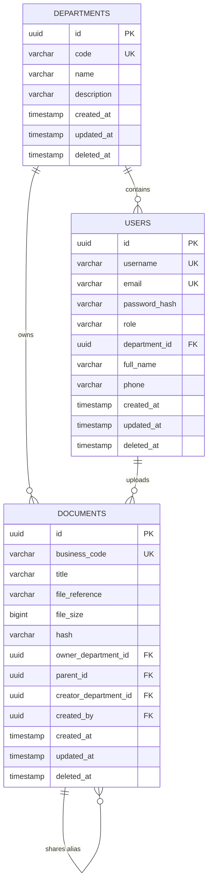

# VCC-EAP (Enterprise Administration Portal) - System Documentation

VCC-EAP is a modern, production-ready enterprise administration platform built with a high-performance **Java Spring Boot Clean Architecture** backend and a sleek, Apple-inspired **React 19 & TailwindCSS** frontend dashboard.

---

## 1. Project Folder Structure

```text
project/
├── docker-compose.yml              # PostgreSQL Docker Compose orchestrator
├── pom.xml                         # Maven root dependency manager
├── README.md                       # Master technical guide
├── eap/                            # Backend Source
│   ├── src/main/java/com/vccorp/eap/
│   │   ├── common/                 # Global error handlers and hash utils
│   │   ├── controller/             # REST Controllers (Auth, Departments, Users, Documents)
│   │   ├── dto/                    # API payloads (Create/Update requests)
│   │   ├── enums/                  # System authorities (Role, ErrorCode)
│   │   ├── infrastructure/         # JWT filtering, security, CORS beans
│   │   ├── model/                  # JPA Database Entities
│   │   ├── repository/             # Spring Data repositories
│   │   └── service/                # Business transaction services
│   └── src/main/resources/
│       ├── application.yml         # Application profiles and settings
│       └── db/migration/           # Flyway SQL migration steps
└── eap/frontend/                   # Frontend Source
    ├── src/
    │   ├── api/                    # Axios instance client
    │   ├── components/             # Reusable UI components (Buttons, Card, Modals, Toast)
    │   ├── hooks/                  # TanStack query custom bindings
    │   ├── layouts/                # Admin shell, dynamic breadcrumbs
    │   ├── pages/                  # Views (Login, Overview, Departments, Users, Documents)
    │   ├── routes/                 # Protected roles route guards
    │   ├── services/               # API endpoint connectors
    │   ├── store/                  # Context APIs (Theme, Auth states)
    │   └── types/                  # TypeScript contract models
    └── package.json                # Project dependencies and building scripts
```

---

## 2. Database Schema & ERD

The system is backed by PostgreSQL. Timestamps and soft-deletes are managed natively using Hibernate SQL Restrictions.



### Table Details & Soft Delete
- **Soft Delete Mapping**: All tables include a nullable `deleted_at` timestamp. Entities are annotated with `@SQLRestriction("deleted_at IS NULL")`, hiding deleted records from standard reads.
- **New Columns (Users)**: `full_name` (VARCHAR(150)) and `phone` (VARCHAR(20)) are added to hold names and Vietnamese phone contacts.

---

## 3. Authentication & Authorization Flow

```text
[ Client Login Request ] ──► POST /api/v1/auth/login ──► Spring Security verifies password
                                                                │
  ┌─────────────────────────────────────────────────────────────┘
  ▼
[ JWT Signed Token Created ] ──► Returns token to Client (React saves in AuthContext)
  │
  ▼
[ Subsequent API Calls ] ──► Client sends Bearer <token> in Authorization Header
  │
  ▼
[ JwtAuthenticationFilter ] ──► Validates signature & extracts Role/Department ID
  │
  ▼
[ SecurityConfig Rules Enforcement ] ──► Approves / Denies request (HTTP 403)
```

### Authorization Matrix

| Endpoint | Method | Allowed Authorities | Description |
| :--- | :--- | :--- | :--- |
| `/api/v1/auth/login` | `POST` | `Anonymous` | Login endpoint to fetch JWT |
| `/api/v1/departments` | `GET` | `All Authenticated` | Lists active departments |
| `/api/v1/departments/{id}` | `GET` | `All Authenticated` | Retrieves a single department's metadata |
| `/api/v1/departments/**` | `POST, PUT, DELETE` | `SYSTEM_ADMIN` | Creates, modifies, or soft-deletes departments |
| `/api/v1/users/**` | `All Methods` | `SYSTEM_ADMIN` | Full CRUD actions on users |
| `/api/v1/original-documents/**` | `All Methods` | `ROLE_EMPLOYEE, ROLE_DEPT_MANAGER, ROLE_BOARD` | Full CRUD on department documents |
| `/api/v1/alias-documents/**` | `All Methods` | `ROLE_EMPLOYEE, ROLE_DEPT_MANAGER, ROLE_BOARD` | Share/access department alias files |

---

## 4. API Endpoints Directory

### Authentication
- `POST /api/v1/auth/login`: `{ username, password }` -> Returns JWT token, roles, and username.

### Departments (Management)
- `GET /api/v1/departments`: Retrieve all active departments.
- `GET /api/v1/departments/{id}`: Fetch department details.
- `POST /api/v1/departments`: `{ code, name }` -> Create new department.
- `PUT /api/v1/departments/{id}`: `{ name, code, description }` -> Update department metadata.
- `DELETE /api/v1/departments/{id}`: Mark department as soft-deleted.

### Users (Management)
- `GET /api/v1/users`: List all active users.
- `GET /api/v1/users/{id}`: Fetch user profile details.
- `POST /api/v1/users`: `{ username, email, role, departmentId, fullName, phone, password }` -> Create user.
- `PUT /api/v1/users/{id}`: `{ username, email, role, departmentId, fullName, phone }` -> Update user profile.
- `DELETE /api/v1/users/{id}`: Soft-delete user profile.

### Documents (Management)
- `GET /api/v1/original-documents?page={page}&size={size}`: List paginated original documents belonging to/shared with user's department.
- `GET /api/v1/original-documents/{id}`: Fetch document detail metadata.
- `POST /api/v1/original-documents`: Multipart request `(title, file)` -> Upload file.
- `PUT /api/v1/original-documents/{id}`: `{ title }` -> Edit document title.
- `DELETE /api/v1/original-documents/{id}`: Soft-delete document and revoke all sharing aliases.
- `POST /api/v1/alias-documents`: `{ originalDocumentId, aliasDepartmentId }` -> Share alias link.
- `GET /api/v1/alias-documents/{id}`: Resolve and download physical document.

---

## 5. Physical Document Upload Storage

### How Document Storage Works
1. Uploaded files are sent via `MultipartFile` to `POST /api/v1/original-documents`.
2. The file is validated by extension (`.pdf`, `.docx`, `.xlsx`, `.pptx`) and size (max 50MB).
3. The server generates a unique UUID (with Least Significant Bit set to 0 for primary files).
4. The file is written to `./eap-storage` resolved as an absolute path. The storage path is created dynamically at runtime by `DocumentService.java` to prevent write errors:
   ```java
   File dir = new File(uploadDir).getAbsoluteFile();
   if (!dir.exists()) {
       dir.mkdirs();
   }
   ```
5. File SHA-256 hash is calculated and stored in the database alongside size, title, and creator information.

---

## 6. How to Run the Project

### Prerequisites
- JDK 17+ installed.
- Node.js v18+ & npm installed.
- Docker & Docker Compose installed.

### Step 1: Start the Database Container
Run from project root directory:
```bash
docker compose up -d
```
This spins up PostgreSQL on port `5432` with username `vccorp` and database `eap`.

### Step 2: Run the Java Backend
Compile and run the Spring Boot service:
```bash
mvn clean spring-boot:run
```
Flyway will automatically run migrations `V1` through `V5`, seeding the database.

### Step 3: Run the React Frontend
Install dependencies and start Vite dev server:
```bash
cd eap/frontend
npm install
npm run dev
```
Open `http://localhost:5173` in your browser.

---

## 7. Database Migration Steps (Flyway)

- **`V1__init_schema.sql`**: Configures initial tables (`departments`, `users`, `documents`).
- **`V2__seed_admin.sql`**: Seeds default `admin` system credentials (password: `123456`).
- **`V3__add_soft_delete_and_timestamps.sql`**: Appends timestamps and `deleted_at` fields to tables.
- **`V4__add_fullname_and_phone_to_users.sql`**: Appends `full_name` and `phone` text fields to the users table.
- **`V5__update_seed_data.sql`**: Updates default admin profile details and seeds `user1` (Nguyễn Văn A, phone: `0912345678`, role: `ROLE_BOARD`, password: `123456`).
