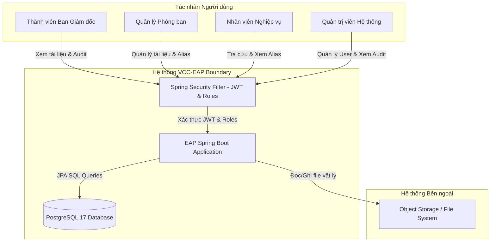

# Architecture Design Document
**Dự án:** VCC Enterprise Archive Platform (VCC-EAP)  
**Tài liệu:** Thiết kế Kiến trúc Tổng thể Hệ thống (System Architecture Design)  
**Giai đoạn:** Giai đoạn 1 (Week 1 Release)  
**Tác giả:** Kiến trúc sư trưởng (Principal Software Architect)  

---

## 1. System Context (Sơ đồ Bối cảnh Hệ thống)

Sơ đồ dưới đây mô tả sự tương tác giữa các tác nhân và hệ thống EAP, cũng như các ranh giới hệ thống:

---

## 2. Architecture Overview (Tổng quan Kiến trúc Tinh gọn)
Hệ thống **VCC Enterprise Archive Platform (VCC-EAP)** sử dụng mô hình **Kiến trúc phân tầng tinh gọn (Lean Layered Architecture - KISS)**. Thay vì áp dụng rập khuôn các nguyên lý Clean Architecture thuần túy với quá nhiều lớp trừu tượng (như Port-Adapter cho Repository, Mapper Layer riêng biệt), kiến trúc này ưu tiên **sự đơn giản, dễ đọc và tính thực tế cao** cho quy mô Tuần 1.

Hệ thống được tổ chức thành 4 phân lớp chính:
1.  **Domain Model Layer (Tầng Thực thể - `model`)**: Chứa các thực thể dữ liệu quan hệ (Rich Domain Model), tự kiểm tra các quy tắc nghiệp vụ bất biến cốt lõi (BOARD protection, Push Model check).
2.  **Business Service Layer (Tầng Nghiệp vụ - `service`)**: Chứa các Service điều phối logic nghiệp vụ và ca sử dụng.
3.  **Presentation Layer (Tầng Hiển thị - `controller`)**: Chứa REST Controllers xử lý HTTP request/response.
4.  **Infrastructure Layer (Tầng Hạ tầng - `infrastructure`)**: Chứa các cấu hình bổ trợ của Spring Boot (Security, JWT, Hibernate Filters).

Hệ thống tập trung toàn bộ các lớp phản hồi (`ApiResponse`, `ErrorResponse`), mã lỗi (`ErrorCode`), xử lý ngoại lệ (`GlobalExceptionHandler`, `BusinessException`) và tiện ích kỹ thuật (`HashUtils`) vào gói chung **`common`** ở root cấp độ. Các kiểu Enum nghiệp vụ tĩnh (`enums`) cũng được tổ chức phẳng ở root. DTOs được đặt tách biệt tại gói `dto` con.

---

## 3. Component Diagram (Sơ đồ Thành phần)

Kiến trúc tinh gọn loại bỏ mọi Interface Port-Adapter dư thừa ở tầng truy cập dữ liệu và ánh xạ trung gian:

```mermaid
graph TB
    subgraph Presentation [Presentation Layer - controller]
        ODC[OriginalDocumentController]
        ADC[AliasDocumentController]
        DC[DepartmentController]
        UC[UserController]
        ALC[AuditLogController]
    end

    subgraph DTO [DTO Layer - dto]
        REQ[Request DTOs]
        RES[Response DTOs]
    end

    subgraph Service [Business Service Layer - service]
        ODS[OriginalDocumentService]
        ADS[AliasDocumentService]
        US[UserService]
        DEPS[DepartmentService]
        AS[AuditLogService]
        ROV[ResourceOwnershipValidator]
    end

    subgraph Model [Domain Model Layer - model]
        DEPT[Department Entity]
        USER[User Entity]
        OD[OriginalDocument - Rich Entity]
        AD[AliasDocument - Rich Entity]
        AL[AuditLog Entity]
    end

    subgraph Common [Common Package - common]
        GEH[GlobalExceptionHandler]
        ERC[ErrorCode]
        API[ApiResponse & ErrorResponse]
        EXC[BusinessException]
        UTI[HashUtils]
    end

    subgraph Root [Root Auxiliaries]
        EN[enums - Role]
    end

    subgraph Repository [Data Access Layer - repository]
        ODR[(OriginalDocumentRepository)]
        ADR[(AliasDocumentRepository)]
        UR[(UserRepository)]
        DR[(DepartmentRepository)]
        ALR[(AuditLogRepository)]
    end

    subgraph Infrastructure [Infrastructure Layer - infrastructure]
        SEC[Spring Security Filter]
        SCH[SecurityContextHelper]
        HAF[Hibernate Filter Auto-Injection]
    end

    ODC & ADC & DC & UC & ALC --> SEC
    ODC & ADC & DC & UC & ALC --> GEH
    ODC & ADC & DC & UC & ALC --> REQ
    
    ODC --> ODS
    ADC --> ADS
    DC --> DEPS
    UC --> US
    ALC --> AS
    
    ODS & ADS --> ROV
    ODS & ADS & US & DEPS --> SCH
    
    ODS --> OD
    ADS --> AD
    US --> USER
    DEPS --> DEPT
    
    ODS --> ODR
    ADS --> ADR
    US --> UR
    DEPS --> DR
    
    ODR & ADR & UR & DR & ALR --> HAF
    ODS & ADS & US & DEPS -->|Gọi trực tiếp| AS
    
    SEC --> DB[(PostgreSQL 17)]
    ODR & ADR & UR & DR & ALR --> DB
    
    Service & Controller & Infrastructure --> EXC
    Service & Controller & Infrastructure --> EN
    Service & Controller & Infrastructure --> API
    Service --> UTI
```

---

## 4. Data Isolation Strategy (Chiến lược Cô lập Dữ liệu)

### 4.1. Cô lập tự động qua Hibernate Filter (Secure by Default)
Mọi truy vấn dữ liệu từ ứng dụng lên bảng `original_documents` và `alias_documents` đều bị lọc tự động bởi Hibernate Filter được cấu hình ở mức thực thể.
*   **Original Document Filter:** Mặc định chèn điều kiện lọc `owner_department_id = :userDeptId` vào mọi truy vấn SELECT và UPDATE sinh ra.
*   **Alias Document Filter:** Mặc định chèn điều kiện lọc `alias_department_id = :userDeptId` vào mọi truy vấn SELECT và UPDATE sinh ra.

### 4.2. Ranh giới Bảo mật Ban Giám đốc (BOARD Boundary)
Tài liệu thuộc phòng ban `BOARD` được bảo vệ nghiêm ngặt bằng cách chặn đứng việc tạo Alias liên kết trỏ tới tài liệu BOARD thông qua `ResourceOwnershipValidator`.

---

## 5. Security Design (Thiết kế Bảo mật)
1.  **Cơ chế Lọc tự động ở mức Entity Base:** Đảm bảo mọi câu truy vấn sinh ra từ JPA (bao gồm cả `COUNT`, `EXISTS` hay các phép chiếu Projection) đều tự động bị Hibernate chèn điều kiện lọc phòng ban trước khi gửi tới Database.
2.  **Chống rò rỉ ngoại lệ (Exception Sanitization):** Bộ xử lý lỗi tập trung `GlobalExceptionHandler` bắt các ngoại lệ cơ sở dữ liệu cấp thấp và chuyển đổi thành `ERR_SYSTEM_ERROR` hoặc mã lỗi chung để tránh dò tìm tài nguyên.
3.  **Phiên làm việc JWT ngắn hạn:** Loại bỏ các cơ chế Blacklist phức tạp của Redis cho Week 1. Thay vào đó, thiết lập thời gian sống của token JWT ngắn (15 phút). Khi có thay đổi quyền hạn hoặc phòng ban, người dùng sẽ tự động nhận quyền mới sau khi đăng nhập lại khi token cũ hết hạn.

---

## 6. Authorization Design (Thiết kế Phân quyền)
*   **Role-based Access Control (RBAC):** Áp dụng trực tiếp phân quyền dựa trên vai trò bằng Spring Security trên các API REST controllers.
*   **Xác thực dựa trên Quyền sở hữu (Ownership-based Authorization):** Việc tạo Alias được phân quyền dựa trên sự khớp nối phòng ban: `currentUser.departmentId == originalDocument.ownerDepartmentId`. Bất kỳ người dùng hoạt động nào thuộc phòng ban sở hữu tài liệu gốc đều được phép tạo Alias.

---

## 7. Alias Design (Thiết kế Alias)
1.  **Tính bất biến của liên kết Alias (Immutable Linkage):** Các trường cấu trúc `originalDocumentId` và `aliasDepartmentId` của thực thể `AliasDocument` được thiết lập là chỉ ghi một lần tại thời điểm khởi tạo (`insertable = true, updatable = false`). API cập nhật Alias không cho phép thay đổi hai trường này.
2.  **Định tuyến API rõ ràng (Explicit Routing):** Phân tách rõ ràng các API endpoints cho Tài liệu Gốc (`/api/v1/original-documents`) và Tài liệu Liên kết (`/api/v1/alias-documents`) để đạt hiệu năng nhận diện loại tài liệu trong 0ms ở tầng API một cách tự nhiên. Sử dụng UUIDv4 tiêu chuẩn ngẫu nhiên.
3.  **Alias Chaining Prohibition:** Alias chỉ được phép tham chiếu trực tiếp đến Original Document. Hệ thống từ chối nếu ID tài liệu gốc truyền vào thực chất là một Alias Document khác.

---

## 8. Database Design Overview (Tổng quan Thiết kế Cơ sở Dữ liệu)
Cơ sở dữ liệu PostgreSQL 17 lưu trữ dữ liệu dưới cấu trúc bảng chuẩn hóa:
*   `departments`: Danh sách phòng ban (BOARD, HR, FINANCE, R&D).
*   `users`: Danh sách nhân viên, mỗi nhân viên thuộc duy nhất 1 phòng ban.
*   `original_documents`: Siêu dữ liệu tài liệu gốc.
*   `alias_documents`: Siêu dữ liệu liên kết tài liệu chia sẻ chéo (có Unique Index có điều kiện để chống trùng lặp Alias hoạt động).
*   `audit_logs`: Nhật ký vận hành hệ thống bất biến (chỉ hỗ trợ INSERT/SELECT).

---

## 9. Integration Design (Thiết kế Tích hợp)
*   **Tích hợp tệp tin vật lý**: Ứng dụng Spring Boot đóng vai trò quản lý siêu dữ liệu (metadata) tài liệu và lưu trữ đường dẫn tệp tin vật lý (`fileReference`) trỏ đến hệ thống file nội bộ an toàn (Object Storage). Luồng tải lên và tải xuống được xác thực phòng ban đồng bộ tại ứng dụng.

---

## 10. Architecture Decisions (Các Quyết định Kiến trúc Tinh gọn)

### ADR-001: Lựa chọn Cô lập Dữ liệu tại Tầng Ứng dụng & Định tuyến Tài nguyên Tách biệt
*   **Quyết định:** Sử dụng tính năng `@Filter` của Hibernate để tự động lọc dữ liệu phòng ban của người dùng (Application-level Isolation) và phân tách rõ ràng các REST API endpoints.

### ADR-002: Áp dụng Chốt chặn Bảo mật An toàn mặc định (Secure by Default)
*   **Quyết định:** Tích hợp bộ lọc Hibernate Filter tự động cho mọi truy vấn (bao gồm cả COUNT/Projection), khóa cứng thông tin cấu trúc Alias thành bất biến (Immutable Linkage), và xử lý ngoại lệ tập trung (GlobalExceptionHandler).

### ADR-003: Sử dụng Helper Bảo mật Trực tiếp tại Tầng Hạ tầng
*   **Quyết định:** Thay vì định nghĩa Port/Adapter trừu tượng cho Security Context (gây over-engineering), hệ thống sử dụng trực tiếp lớp tiện ích/Helper bảo mật `SecurityContextHelper` đặt trong tầng Hạ tầng `infrastructure.security` để cung cấp thông tin người dùng và phòng ban hiện tại cho tầng Service.

### ADR-004: Tối giản hóa Thiết kế Phân tầng (KISS Principle)
*   **Quyết định:** Chuyển đổi toàn bộ kiến trúc từ Clean Architecture thuần túy sang mô hình **Kiến trúc phân tầng tinh gọn (Lean Layered Architecture)**. 

### ADR-005: Xây dựng Mô hình Miền giàu Nghiệp vụ (Rich Domain Model)
*   **Quyết định:** Chuyển các logic kiểm tra quy tắc nghiệp vụ bất biến trực tiếp thành các phương thức bên trong các thực thể Domain.

### ADR-006: Phân tách DTOs và Tập trung hóa cấu phần Dùng chung vào Common Package
*   **Quyết định:** 
    1.  Định nghĩa phân tách rõ rệt các class request/response DTOs tại gói `dto` độc lập của ứng dụng.
    2.  Tập trung hóa toàn bộ các thành phần dùng chung và xử lý lỗi gồm `ApiResponse`, `ErrorResponse`, `ErrorCode`, `BusinessException`, `GlobalExceptionHandler` và `HashUtils` dưới gói **`common`** để tránh circular dependencies và tăng tính bảo trì. Loại bỏ hoàn toàn Mapper Layer.

### ADR-007: Thiết lập Mô hình Vai trò dựa trên Enum & Nhật ký Giám sát Bất biến
*   **Quyết định:** 
    1.  Mô hình hóa vai trò người dùng bằng kiểu dữ liệu Enum `Role` được khai báo tập trung tại `enums/Role.java` và lưu trữ dưới dạng String trong database, loại bỏ hoàn toàn bảng `roles` hoặc `user_roles` trung gian.
    2.  Hệ thống Audit Log được thiết kế bất biến (chỉ hỗ trợ INSERT/SELECT), ghi nhận đồng bộ bằng cách gọi trực tiếp `auditService.log()` trong tầng Service để đảm bảo thiết kế tối giản nhất cho Week 1.
*   **Lý do:** Đối với Tuần 1, các vai trò của hệ thống là cố định. Việc sử dụng DB Role table gây ra overengineering không cần thiết. Việc tinh giản các gói hỗ trợ giúp mã nguồn phẳng hơn, dễ đọc và loại bỏ các file hằng số rác. Ghi log đồng bộ đơn giản và giảm thiểu độ phức tạp vận hành của hệ thống Async.
