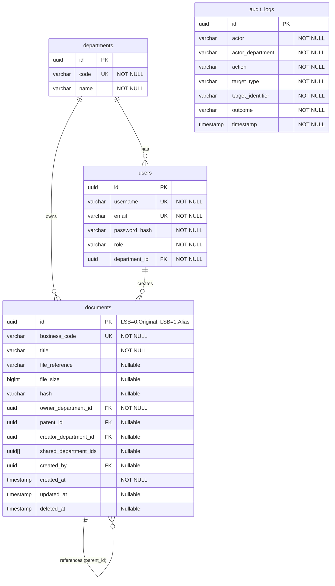

# Detailed Design Document
**Dự án:** VCC Enterprise Archive Platform (VCC-EAP)  
**Tài liệu:** Thiết kế Chi tiết Hệ thống (Detailed Solution Design)  
**Giai đoạn:** Giai đoạn 1 (Week 1 Release)  
**Tác giả:** Trưởng nhóm Kiến trúc Giải pháp (Senior Solution Architect)  

---

## 1. Package Structure (Cấu trúc Thư mục Mã nguồn Tinh gọn & Chuẩn hóa)

Hệ thống Spring Boot được tổ chức theo cấu trúc phân tầng thực tế tinh gọn (Lean Layered Architecture), tập trung các lớp dùng chung và cơ cấu xử lý lỗi vào gói `common`, cô lập bảo mật trong tầng hạ tầng và phân tách rõ ràng trách nhiệm giữa các gói:

```
com.vccorp.eap
│
├── common                          # Các thành phần dùng chung toàn hệ thống
│   ├── response
│   │   ├── ApiResponse.java        # Success Response Envelope
│   │   └── ErrorResponse.java      # Error & Validation Response Envelopes
│   ├── exception
│   │   └── BusinessException.java  # Base Exception cho các lỗi nghiệp vụ
│   ├── error
│   │   ├── ErrorCode.java          # Model mã lỗi tập trung (statusCode, code, message)
│   │   └── GlobalExceptionHandler.java # Bộ xử lý ngoại lệ tập trung (@ControllerAdvice)
│   └── util
│       └── HashUtils.java          # Tiện ích mã hóa SHA-256 dùng chung
│
├── enums                           # Các Enum nghiệp vụ tĩnh dùng chung
│   └── Role.java                   # Vai trò người dùng (SYSTEM_ADMIN, ROLE_BOARD, ROLE_EMPLOYEE, ROLE_DEPT_MANAGER)
│
├── model                           # Tầng Thực thể dữ liệu (Domain Entities)
│   ├── Department.java
│   ├── User.java
│   ├── Document.java               # Thực thể gộp (Original & Alias) có logic tự bảo vệ và Bitwise LSB
│   └── AuditLog.java               # Thực thể nhật ký thao tác bất biến
│
├── controller                      # Tầng Presentation (REST API Controllers)
│   ├── DocumentController.java     # REST API cho tài liệu gốc và Alias
│   ├── DepartmentController.java
│   ├── UserController.java
│   └── AuditLogController.java
│
├── dto                             # Tầng DTOs (Data Transfer Objects)
│   ├── request
│   │   ├── CreateOriginalDocumentRequest.java
│   │   ├── CreateAliasRequest.java
│   │   ├── CreateDepartmentRequest.java
│   │   └── CreateUserRequest.java
│   └── response
│       ├── DocumentMetadataResponse.java
│       ├── AliasResolutionResponse.java
│       ├── DepartmentResponse.java
│       └── UserResponse.java
│
├── service                         # Tầng Nghiệp vụ (Business Logic)
│   ├── DocumentService.java        # Nghiệp vụ tài liệu gốc, sinh UUID LSB, và Alias
│   ├── UserService.java
│   ├── DepartmentService.java
│   ├── AuditLogService.java
│   └── ResourceOwnershipValidator.java # Trình xác thực quyền sở hữu phòng ban
│
├── repository                      # Tầng Truy cập Dữ liệu (Spring Data JPA Repositories)
│   ├── DocumentRepository.java     # Repository duy nhất cho thực thể Document
│   ├── UserRepository.java
│   ├── DepartmentRepository.java
│   └── AuditLogRepository.java
│
└── infrastructure                  # Tầng Hạ tầng kỹ thuật (Framework Configurations & Security Adapters)
    ├── security                    # Cấu hình Spring Security & JWT
    │   ├── SecurityConfig.java
    │   ├── JwtAuthenticationFilter.java
    │   ├── JwtTokenProvider.java
    │   ├── UserPrincipal.java
    │   └── SecurityContextHelper.java  # Tích hợp lấy thông tin User/Department hiện tại
    └── config                      # Cấu hình Hibernate Filter Auto-Injection Interceptor
        └── HibernateFilterInterceptor.java
```

---

## 2. Module Design (Thiết kế các Module)

### 2.1. Module Quản lý Định danh & Vai trò (IAM Module)
*   **Trách nhiệm**: Quản lý thông tin phòng ban, tài khoản và phân quyền vai trò.
*   **Dependencies**: Không phụ thuộc vào module khác.

### 2.2. Module Quản lý Tài liệu (Document Module)
*   **Trách nhiệm**: Tải lên tài liệu gốc, tạo Alias, giải quyết liên kết và xóa mềm lan truyền.
*   **Dependencies**: Phụ thuộc vào IAM Module để xác định phòng ban của người dùng hiện tại.

### 2.3. Module Nhật ký Giám sát (Audit Module)
*   **Trách nhiệm**: Ghi nhận bất biến lịch sử thao tác của người dùng vào bảng `audit_logs`.
*   **Dependencies**: Phụ thuộc vào IAM Module.

---

## 3. Entity Design & Database Schema (Thiết kế Thực thể và Cơ sở Dữ liệu Chi tiết)

Sơ đồ ERD chi tiết các bảng cơ sở dữ liệu:



Mọi bảng dữ liệu được cấu hình ràng buộc chặt chẽ, tối ưu hóa bằng chỉ mục và thực thi quy tắc toàn vẹn nghiệp vụ ở mức độ CSDL:

### 3.1. Thực thể `Department` (Bảng `departments`)
*   `id`: UUID (Primary Key, NOT NULL)
*   `code`: String (VARCHAR(50), Unique Index, NOT NULL) - Ví dụ: "BOARD", "HR", "FINANCE"
*   `name`: String (VARCHAR(100), NOT NULL)

### 3.2. Thực thể `User` (Bảng `users`)
*   `id`: UUID (Primary Key, NOT NULL)
*   `username`: String (VARCHAR(50), Unique Index, NOT NULL)
*   `email`: String (VARCHAR(100), Unique Index, NOT NULL)
*   `passwordHash`: String (VARCHAR(255), NOT NULL)
*   `role`: Role (VARCHAR(50), NOT NULL, Enum mapped as String)
*   `departmentId`: UUID (ForeignKey pointing to `departments(id)`, NOT NULL)
*   **Database Constraints:**
    *   `fk_user_department`: Khóa ngoại `department_id` trỏ tới `departments(id)`.
*   **Vòng đời nghiệp vụ:** Toàn bộ hệ thống chỉ sử dụng cơ chế Soft Delete (xóa mềm), không sử dụng Hard Delete (xóa cứng). Khi người dùng bị xóa mềm, hệ thống vẫn giữ nguyên các tài liệu gốc và Alias do người dùng này tạo ra. Cột `createdBy` của các tài liệu đó phải được giữ nguyên giá trị lịch sử của người dùng cũ để phục vụ đối soát nghiệp vụ, tuyệt đối không được chuyển thành NULL.

### 3.3. Thực thể `Document` (Bảng `documents`)
Thực thể `Document` đại diện cho cả Tài liệu Gốc (Original) và Tài liệu Liên kết (Alias) dưới mô hình bảng tự liên kết đệ quy:
*   `id`: UUID (Primary Key, NOT NULL). Loại tài liệu được nhúng vào Least Significant Bit (LSB):
    - Original Document UUID: Bit cuối LSB = `0`.
    - Alias Document UUID: Bit cuối LSB = `1`.
*   `businessCode`: String (VARCHAR(50), Unique Index, NOT NULL) - Định dạng `ORIG_xxxxxx` hoặc `ALIA_xxxxxx`.
*   `title`: String (VARCHAR(255), NOT NULL) - Siêu dữ liệu tiêu đề (Alias có thể đặt tiêu đề riêng biệt).
*   `fileReference`: String (VARCHAR(500), Nullable) - Đường dẫn vật lý trên Object Storage (chỉ lưu ở tài liệu gốc, Alias lưu NULL).
*   `fileSize`: Long (BIGINT, Nullable) - Dung lượng file (chỉ lưu ở tài liệu gốc, Alias lưu NULL).
*   `hash`: String (VARCHAR(64), Nullable) - SHA-256 hash của tệp tin (chỉ lưu ở tài liệu gốc, Alias lưu NULL).
*   `ownerDepartmentId`: UUID (ForeignKey pointing to `departments(id)`, NOT NULL)
    - Đối với tài liệu gốc: Phòng ban tải lên và sở hữu file.
    - Đối với Alias: Phòng ban nhận được chia sẻ (giúp cô lập quyền truy cập cho phòng ban nhận).
*   `parentId`: UUID (ForeignKey pointing to `documents(id)`, Nullable, updatable = false)
    - Đối với tài liệu gốc: `NULL`.
    - Đối với Alias: ID của tài liệu gốc tương ứng. Khóa cứng bất biến khi tạo.
*   `creatorDepartmentId`: UUID (ForeignKey pointing to `departments(id)`, Nullable, updatable = false)
    - Đối với tài liệu gốc: `NULL`.
    - Đối với Alias: ID của phòng ban tạo ra Alias (phòng sở hữu tài liệu gốc).
*   `sharedDepartmentIds`: List of UUID (UUID[] in Database, Nullable)
    - Đối với tài liệu gốc: Danh sách phòng ban được chia sẻ (được liên kết bằng Alias). Mảng được index dạng GIN.
    - Đối với Alias: `NULL`.
*   `createdBy`: UUID (ForeignKey pointing to `users(id)`, Nullable)
*   `createdAt`: Timestamp (NOT NULL)
*   `updatedAt`: Timestamp (Nullable)
*   `deletedAt`: Timestamp (Nullable)

*   **Database Constraints & Indexes:**
    *   `fk_doc_parent`: Khóa ngoại `parent_id` tự tham chiếu tới `documents(id)`.
    *   `fk_doc_dept`: Khóa ngoại `owner_department_id` trỏ tới `departments(id)`.
    *   `idx_doc_owner_dept`: Index trên cột `owner_department_id` để tối ưu hóa Hibernate Filter.
    *   `idx_doc_shared_depts_gin`: Chỉ mục GIN (Generalized Inverted Index) trên cột `shared_department_ids` để tối ưu hóa hiệu năng tìm kiếm chéo bằng câu lệnh `ANY`:
        ```sql
        CREATE INDEX idx_doc_shared_depts_gin ON documents USING GIN(shared_department_ids);
        ```
    *   `chk_uuid_lsb_type`: Ràng buộc kiểm tra tính nhất quán vật lý giữa UUID LSB và loại tài liệu (nếu `parent_id` IS NULL thì bit cuối UUID phải là 0; ngược lại phải là 1):
        ```sql
        ALTER TABLE documents ADD CONSTRAINT chk_uuid_lsb_type CHECK (
            (parent_id IS NULL AND id::text ~ '[02468ace]$') OR 
            (parent_id IS NOT NULL AND id::text ~ '[13579bdf]$')
        );
        ```
    *   `uq_active_alias_per_dept`: Unique Index ngăn chặn trùng lặp liên kết Alias hoạt động cho cùng một phòng ban nhận:
        ```sql
        CREATE UNIQUE INDEX uq_active_alias_per_dept 
        ON documents(parent_id, owner_department_id) 
        WHERE parent_id IS NOT NULL AND deleted_at IS NULL;
        ```

*   **Hibernate Filter Annotation (Cô lập Dữ liệu không dùng Subquery - Tối ưu hóa Hiệu năng):**
    ```java
    @FilterDef(name = "deptIsolationFilter", parameters = @ParamDef(name = "userDeptId", type = String.class))
    @Filter(name = "deptIsolationFilter", condition = 
        "(parent_id IS NULL AND (owner_department_id = :userDeptId OR :userDeptId = ANY(shared_department_ids))) " +
        "OR (parent_id IS NOT NULL AND (owner_department_id = :userDeptId OR creator_department_id = :userDeptId))"
    )
    ```

*   **Logic Nghiệp vụ Tự bảo vệ (Domain & Bitwise Validation):**
    ```java
    // Nhận dạng loại tài liệu tức thời trong RAM (0ms, 0 I/O)
    public boolean isAlias() {
        return (this.id.getLeastSignificantBits() & 1L) == 1L;
    }
    
    public boolean isOriginal() {
        return !isAlias();
    }
    
    public boolean isOwnedBy(UUID deptId) {
        return this.ownerDepartmentId.equals(deptId);
    }
    
    public boolean isBoardDocument(String deptCode) {
        return "BOARD".equals(deptCode) && this.isOriginal();
    }
    ```

### 3.4. Thực thể `AuditLog` (Bảng `audit_logs`)
Bảng nhật ký bất biến, chỉ hỗ trợ ghi mới (INSERT) và đọc (SELECT). Nghiêm cấm các truy vấn UPDATE hoặc DELETE.
*   `id`: UUID (Primary Key, NOT NULL)
*   `actor`: String (VARCHAR(100), NOT NULL) - Username của người thực hiện
*   `actorDepartment`: String (VARCHAR(100), NOT NULL) - Phòng ban người thực hiện
*   `action`: String (VARCHAR(50), NOT NULL) - Ví dụ: UPLOAD_DOCUMENT, CREATE_ALIAS, RESOLVE_ALIAS...
*   `targetType`: String (VARCHAR(50), NOT NULL) - Ví dụ: ORIGINAL_DOCUMENT, ALIAS_DOCUMENT
*   `targetIdentifier`: String (VARCHAR(100), NOT NULL) - Business code hoặc ID của đối tượng bị tác động
*   `outcome`: String (VARCHAR(50), NOT NULL) - SUCCESS hoặc FAILURE
*   `timestamp`: Timestamp (NOT NULL)
*   **Indexes:**
    *   `idx_audit_timestamp`: Index trên cột `timestamp` để tối ưu hóa việc xem và kiểm toán log theo thời gian.
    *   `idx_audit_actor`: Index trên cột `actor` để lọc vết theo nhân sự.
*   **Hibernate Filter Annotation (Cách ly phòng ban):**
    ```java
    @FilterDef(name = "auditIsolationFilter", parameters = @ParamDef(name = "userDeptId", type = String.class))
    @Filter(name = "auditIsolationFilter", condition = "actor_department = :userDeptId")
    ```

---

## 4. API Design (Thiết kế Giao diện API Chuẩn hóa)

Mọi API phản hồi trong hệ thống đều tuân thủ các hợp đồng dữ liệu thống nhất dưới đây:

### 4.1. Định dạng Phản hồi Hệ thống (Unified Response Formats)

#### 4.1.1. Phản hồi Thành công (Success Response)
```json
{
  "success": true,
  "code": "UPLOAD_SUCCESS",
  "message": "Tải lên tài liệu thành công.",
  "data": {
    "id": "03b827e8-1111-4444-8888-000000000001",
    "business_code": "ORIG_000001",
    "title": "Quy chế lương HR 2026.pdf"
  },
  "timestamp": "2026-06-25T17:30:00Z"
}
```

#### 4.1.2. Phản hồi Lỗi Nghiệp vụ (Business Error Response)
```json
{
  "success": false,
  "code": "ERR_OWNERSHIP_VIOLATION",
  "message": "Bạn không có quyền truy cập tài liệu thuộc phòng ban khác.",
  "timestamp": "2026-06-25T17:31:00Z"
}
```

#### 4.1.3. Phản hồi Lỗi Kiểm tra Dữ liệu (Validation Error Response)
```json
{
  "success": false,
  "code": "VALIDATION_ERROR",
  "message": "Dữ liệu yêu cầu không hợp lệ.",
  "errors": {
    "title": "Tiêu đề tài liệu không được để trống.",
    "fileReference": "Đường dẫn file không hợp lệ."
  },
  "timestamp": "2026-06-25T17:32:00Z"
}
```

---

### 4.2. Danh sách các API Endpoints Nghiệp vụ

#### 4.2.1. Tải lên tài liệu gốc (Upload Original Document)
*   **URI**: `/api/v1/original-documents`
*   **Method**: `POST`
*   **Authorization**: `ROLE_EMPLOYEE` / `ROLE_DEPT_MANAGER` / `ROLE_BOARD`
*   **Multipart Request Payload**: `title` (String), `file` (MultipartFile)
*   **Lưu ý**: `ownerDepartmentId` tự động trích xuất từ Security Context của phiên đăng nhập của người dùng hiện tại; API từ chối tiếp nhận tham số phòng ban từ payload.

#### 4.2.2. Danh sách tài liệu gốc (List Original Documents)
*   **URI**: `/api/v1/original-documents`
*   **Method**: `GET`
*   **Query Parameters**: `page` (Integer), `size` (Integer)
*   **Authorization**: `ROLE_EMPLOYEE` / `ROLE_DEPT_MANAGER` / `ROLE_BOARD`
*   **Lưu ý**: Hibernate Filter kết hợp sẽ tự động lọc dữ liệu, chỉ hiển thị tài liệu gốc thuộc phòng ban người dùng hiện tại.
*   **Lọc dữ liệu**: Chỉ trả về bản ghi có `parent_id IS NULL`.

#### 4.2.3. Xem chi tiết tài liệu gốc (Get Original Document Detail)
*   **URI**: `/api/v1/original-documents/{id}`
*   **Method**: `GET`
*   **Authorization**: `ROLE_EMPLOYEE` / `ROLE_DEPT_MANAGER` / `ROLE_BOARD`

#### 4.2.4. Xóa tài liệu gốc (Delete Original Document)
*   **URI**: `/api/v1/original-documents/{id}`
*   **Method**: `DELETE`
*   **Authorization**: `ROLE_DEPT_MANAGER`
*   **Lưu ý**: Chỉ thực hiện xóa mềm (soft delete), tuyệt đối không xóa cứng (hard delete). Khi tài liệu gốc bị xóa mềm, toàn bộ các liên kết Alias trỏ tới tài liệu này của các phòng ban khác đều tự động bị vô hiệu hóa (thông qua cơ chế xóa mềm lan truyền), khiến các phòng ban đó lập tức bị vô hiệu hóa quyền xem hoặc tải xuống tài liệu gốc thông qua Alias.

#### 4.2.5. Tạo liên kết chia sẻ Alias (Create Alias Document)
*   **URI**: `/api/v1/alias-documents`
*   **Method**: `POST`
*   **Authorization**: `ROLE_EMPLOYEE` / `ROLE_DEPT_MANAGER` (Bất kỳ người dùng hoạt động nào thuộc phòng sở hữu tài liệu gốc đều có quyền tạo Alias chéo phòng ban).
*   **Request Payload**:
    ```json
    {
      "title": "Tài liệu chia sẻ quy chế tài chính",
      "original_document_id": "03b827e8-1111-4444-8888-000000000001",
      "alias_department_id": "890f68bd-2222-3333-4444-555555555555"
    }
    ```
*   **Lưu ý**: Ràng buộc kiểm tra quyền sở hữu bắt buộc: Người dùng chỉ được phép tạo Alias cho tài liệu gốc thuộc sở hữu của phòng ban mình (`currentUser.departmentId == originalDocument.ownerDepartmentId`). Hệ thống nghiêm cấm tạo Alias cho tài liệu thuộc sở hữu của phòng ban khác (nếu vi phạm sẽ trả về lỗi `ERR_OWNERSHIP_VIOLATION` / 404 để bảo mật).

#### 4.2.6. Giải quyết Alias để xem tài liệu (Resolve Alias Document)
*   **URI**: `/api/v1/alias-documents/{id}`
*   **Method**: `GET`
*   **Authorization**: `ROLE_EMPLOYEE` / `ROLE_DEPT_MANAGER`
*   **Lưu ý**: Trả về siêu dữ liệu của tài liệu gốc tương ứng. Trình ghi log sẽ ghi nhận sự kiện `RESOLVE_ALIAS` thay vì truy cập tài liệu trực tiếp.
*   **Lưu ý Bảo mật**: Ràng buộc kiểm tra điều kiện phòng ban của người gửi request đầy đủ và nghiêm ngặt: Hệ thống đối chiếu phòng ban của người dùng (`currentUser.departmentId == aliasDocument.ownerDepartmentId`). Chỉ phòng ban nhận được chia sẻ Alias mới có quyền giải quyết Alias để xem/tải xuống tài liệu gốc liên kết. Bất kỳ tài khoản không thuộc phòng ban nhận Alias nào gọi API này đều bị từ chối truy cập và nhận lỗi `ERR_DOCUMENT_NOT_FOUND` (404) để đảm bảo cô lập dữ liệu tuyệt đối và tránh lộ lọt tài nguyên.

#### 4.2.7. Xóa liên kết Alias (Delete Alias Document)
*   **URI**: `/api/v1/alias-documents/{id}`
*   **Method**: `DELETE`
*   **Authorization**: `ROLE_DEPT_MANAGER` (của phòng ban sở hữu tài liệu gốc / phòng ban tạo Alias).
*   **Lưu ý**: Chỉ thực hiện xóa mềm (soft delete), tuyệt đối không xóa cứng (hard delete) đối với liên kết Alias. **Chỉ phòng ban tạo Alias (phòng ban sở hữu tài liệu gốc) mới có quyền xóa mềm (thu hồi) Alias này.** Phòng ban nhận Alias tuyệt đối không có quyền tự xóa Alias được chia sẻ sang phòng ban của mình (nếu cố tình gọi API sẽ nhận lỗi `ERR_OWNERSHIP_VIOLATION` / 404 để che giấu sự tồn tại hoặc ngăn cản thao tác trái phép). Thao tác này không ảnh hưởng đến tài liệu gốc hoặc các Alias của phòng ban khác trỏ tới cùng tài liệu gốc đó.

#### 4.2.8. Danh sách Alias đã nhận (List Received Aliases)
*   **URI**: `/api/v1/alias-documents/received`
*   **Method**: `GET`
*   **Authorization**: `ROLE_EMPLOYEE` / `ROLE_DEPT_MANAGER`
*   **Lưu ý**: Chỉ trả về các Alias được chia sẻ cho phòng ban của người dùng hiện tại (`owner_department_id = currentUser.departmentId AND parent_id IS NOT NULL`).

#### 4.2.9. Danh sách Alias đã chia sẻ (List Shared Aliases)
*   **URI**: `/api/v1/alias-documents/shared`
*   **Method**: `GET`
*   **Authorization**: `ROLE_EMPLOYEE` / `ROLE_DEPT_MANAGER`
*   **Lưu ý**: Trả về danh sách Alias do phòng ban của người dùng tạo ra để chia sẻ sang phòng ban khác.

#### 4.2.10. Quản lý Người dùng (User Management - Admin)
*   `POST /api/v1/users` (Tạo tài khoản người dùng mới).
*   `GET /api/v1/users` (Lấy danh sách người dùng).
*   `PUT /api/v1/users/{id}/role-department` (Cập nhật phòng ban hoặc vai trò người dùng).
    *   **Lưu ý**: Hệ thống áp dụng token JWT ngắn hạn (15 phút). Phiên làm việc cũ của người dùng sẽ tự động hết hạn và yêu cầu đăng nhập lại sau tối đa 15 phút để cập nhật phòng ban/vai trò mới.

#### 4.2.11. Quản lý Phòng ban (Department Management - Admin)
*   `POST /api/v1/departments` (Tạo phòng ban mới).
*   `GET /api/v1/departments` (Lấy danh sách phòng ban).

---

## 5. Sequence Diagrams (Sơ đồ Tuần tự Nghiệp vụ)

### 5.1. Tạo Alias chia sẻ (Push Model)
```
User -> Controller: POST /api/v1/alias-documents (Payload)
Controller -> Service: createAlias(dto, userContext)
Service -> Repository: findByIdForUpdate(dto.originalId) (Khóa bi quan - FOR UPDATE)
Repository -> DB: SELECT * FROM documents WHERE id = :id FOR UPDATE
DB --> Repository: Bản ghi tài liệu gốc (Hoặc lỗi 404/PessimisticLockException)
Service -> Validator: validateAliasCreation(originalDoc, userContext)
Note over Validator: 1. Kiểm tra tài liệu gốc có phải Original không (LSB = 0).<br/>2. Kiểm tra: original.isOwnedBy(userContext.deptId).<br/>3. Kiểm tra: !original.isBoardDocument().<br/>4. Kiểm tra: !documentRepo.existsActiveAlias(originalId, targetDeptId).<br/>5. Kiểm tra: targetDeptId != userContext.deptId.
Validator --> Service: Quyền hợp lệ
Note over Service: Sinh UUID cho Alias mới có LSB = 1
Service -> Repository: Save Document Entity (Alias type)
Repository -> DB: INSERT INTO documents (id, parent_id, owner_department_id...)
DB --> Repository: Thành công
Service -> AuditService: log("CREATE_ALIAS", userContext, aliasId, "SUCCESS")
Service --> Controller: Success Response DTO
Controller --> User: 201 Created
```

### 5.2. Giải quyết Alias (Resolve Alias)
```
User -> Controller: GET /api/v1/alias-documents/{id}
Controller -> Service: resolveAlias(id, userContext)
Note over Service: JPA Join Query tự động áp dụng điều kiện lọc<br/>owner_department_id = userContext.deptId của Hibernate Filter.
Service -> Repository: resolveJoinOriginal(id)
Repository -> DB: SELECT * FROM documents ad JOIN documents od ON ad.parent_id = od.id...
DB --> Repository: Trả về tài liệu gốc (Hoặc lỗi 404 nếu không khớp phòng ban nhận)
Service -> AuditService: log("RESOLVE_ALIAS", userContext, id, "SUCCESS")
Service --> Controller: Consolidated Metadata Response
Controller --> User: 200 OK
```

---

## 6. Repository Design (Thiết kế Repository)

### 6.1. Câu truy vấn giải quyết Alias (JPA Join Query tự liên kết)
Trong `DocumentRepository.java`:
```java
@Query("SELECT od FROM Document ad JOIN Document od ON ad.parentId = od.id " +
       "WHERE ad.id = :aliasId AND ad.ownerDepartmentId = :userDeptId " +
       "AND ad.deletedAt IS NULL AND od.deletedAt IS NULL")
Optional<Document> resolveAlias(@Param("aliasId") UUID aliasId, @Param("userDeptId") UUID userDeptId);
```

### 6.2. Bộ lọc Xóa mềm lan truyền
Trong `DocumentRepository.java`:
```java
@Modifying
@Query("UPDATE Document ad SET ad.deletedAt = :deletedAt WHERE ad.parentId = :originalId " +
       "AND ad.deletedAt IS NULL")
void softDeleteAliasesByOriginalId(@Param("originalId") UUID originalId, @Param("deletedAt") Timestamp deletedAt);
```

### 6.3. Khóa bi quan (Pessimistic Locking) tránh Race Condition khi tạo Alias
Trong `DocumentRepository.java`:
```java
@Lock(LockModeType.PESSIMISTIC_WRITE)
@Query("SELECT d FROM Document d WHERE d.id = :id AND d.deletedAt IS NULL")
Optional<Document> findByIdForUpdate(@Param("id") UUID id);
```

---

## 7. Validation Rules (Quy tắc Xác thực Nghiệp vụ)

1.  **BOARD Protection Rule:** Từ chối tuyệt đối việc tạo Alias đối với bất kỳ tài liệu gốc nào thuộc phòng ban sở hữu là `BOARD`. Đồng thời, cấm thành viên phòng `BOARD` tạo Alias trỏ tới tài liệu của phòng ban khác (phòng BOARD hoàn toàn cô lập khỏi luồng chia sẻ Alias).
2.  **Ownership-based Alias Rule:** Bất kỳ nhân sự hoạt động nào thuộc phòng ban sở hữu tài liệu gốc (ngoại trừ phòng `BOARD`) và thỏa mãn `currentUser.departmentId == originalDocument.ownerDepartmentId` đều được tạo Alias.
3.  **Anti-Chaining Rule:** Cấm Alias nối tiếp. ID tài liệu gốc truyền vào tạo Alias bắt buộc phải có bit cuối của LSB = `0` (là Original Document), không được trỏ vào tài liệu có bit cuối LSB = `1` (Alias Document).
4.  **No Self-Sharing Rule:** Phòng ban nhận Alias bắt buộc phải khác với phòng ban sở hữu tài liệu gốc.
5.  **Unique Alias Limit Rule:** Mỗi phòng ban nhận chỉ được phép nhận duy nhất 1 Alias từ cùng một tài liệu gốc đang hoạt động (Được kiểm tra bởi mã logic và thực thi cứng bởi Unique Index ở cấp DB).
6.  **File Upload Whitelist Rule:** Hệ thống chỉ cho phép tải lên các tệp tin có định dạng: `.pdf`, `.docx`, `.xlsx`, `.pptx`. Bất kỳ định dạng nào khác sẽ bị từ chối với mã lỗi `VALIDATION_ERROR`.
7.  **File MIME Type Validation Rule:** Hệ thống thực hiện đối soát tính chính xác của file bằng cách kết hợp kiểm tra phần mở rộng (extension) của tệp tin và thuộc tính Content-Type (MIME) được gửi lên.
8.  **File Size Limit Rule:** Giới hạn dung lượng tệp tin tải lên tối đa là **50MB** (thực thi thông qua cấu hình Spring Boot Multipart và kiểm tra kích thước file tại tầng Service).

---

## 8. Error Handling (Xử lý Ngoại lệ tập trung & ErrorCode Mappings)

Hệ thống quản lý lỗi tập trung thông qua lớp `GlobalExceptionHandler` đặt tại gói `common.error`. Mã lỗi nghiệp vụ được định nghĩa tĩnh trong Enum `ErrorCode` thuộc gói `common.error`.

### 8.1. Mô hình `ErrorCode` Tập trung
Mỗi lỗi được định nghĩa rõ: `statusCode` (HTTP Status Code), `code` (Mã lỗi nghiệp vụ), và `message` (Thông điệp hiển thị).

### 8.2. Mẫu Ánh xạ Lỗi (Error Exception Mapping Table)

| Mã lỗi Nghiệp vụ (`code`) | HTTP Status | Mẫu Phản hồi lỗi API | Nguyên nhân kích hoạt |
| :--- | :--- | :--- | :--- |
| `ERR_UNAUTHENTICATED` | 401 Unauthorized | `{"success": false, "code": "ERR_UNAUTHENTICATED", "message": "Phiên đăng nhập hết hạn hoặc không hợp lệ."}` | JWT token không hợp lệ, hết hạn, hoặc đã bị vô hiệu hóa do thay đổi thông tin User. |
| `ERR_OWNERSHIP_VIOLATION`| 404 Not Found | `{"success": false, "code": "ERR_DOCUMENT_NOT_FOUND", "message": "Tài liệu yêu cầu không tồn tại."}` | Người dùng truy cập tài liệu chéo phòng ban không thuộc sở hữu (che giấu sự tồn tại của tài liệu). |
| `ERR_FORBIDDEN_ROLE`  | 403 Forbidden | `{"success": false, "code": "ERR_FORBIDDEN_ROLE", "message": "Bạn không có quyền thực hiện hành động này."}` | Người dùng cố gắng gọi API vượt cấp vai trò chức năng (ví dụ: Employee gọi API của Admin). |
| `ERR_BOARD_PROTECTION` | 400 Bad Request| `{"success": false, "code": "ERR_BOARD_PROTECTION", "message": "Cấm tạo liên kết Alias đối với tài liệu của phòng BOARD."}` | Người dùng cố gắng tạo Alias cho tài liệu thuộc phòng BOARD. |
| `ERR_DUPLICATE_ALIAS` | 400 Bad Request| `{"success": false, "code": "ERR_DUPLICATE_ALIAS", "message": "Phòng ban nhận đã nhận một liên kết đang hoạt động từ tài liệu này."}` | Tạo trùng lặp Alias (vi phạm Unique Index). |
| `ERR_DOCUMENT_NOT_FOUND` | 404 Not Found | `{"success": false, "code": "ERR_DOCUMENT_NOT_FOUND", "message": "Tài liệu yêu cầu không tồn tại."}` | Không tìm thấy ID tài liệu gốc hoặc Alias hoạt động. |
| `VALIDATION_ERROR` | 400 Bad Request| `{"success": false, "code": "VALIDATION_ERROR", "message": "Dữ liệu không hợp lệ.", "errors": {...}}` | Vi phạm Bean Validation ở DTO đầu vào API. |
| `ERR_SYSTEM_ERROR` | 500 Internal | `{"success": false, "code": "ERR_SYSTEM_ERROR", "message": "Lỗi hệ thống bất ngờ."}` | Các lỗi kết nối cơ sở dữ liệu, tràn bộ nhớ, hoặc null pointer. |

---

## 9. Audit Design (Thiết kế Nhật ký Giám sát Bất biến)

*   **Tính bất biến và an toàn**: Tầng Repository và Service của AuditLog chỉ hỗ trợ thao tác `save()` (INSERT) và `findAll()` (SELECT). Mọi phương thức cập nhật hoặc xóa đều bị chặn từ thiết kế (không định nghĩa). Không cung cấp bất kỳ REST API nào cho phép chỉnh sửa hoặc xóa log.
*   **Cơ chế ghi log đồng bộ**: Tầng Service nghiệp vụ sau khi thực hiện giao dịch thành công sẽ gọi trực tiếp `auditService.log(...)` để ghi nhận nhật ký hoạt động của người dùng trong cùng một luồng transaction. Thiết kế này giúp tối giản hóa luồng xử lý và phù hợp với phạm vi Week 1.
*   **Hành động Audit được chuẩn hóa**:
    *   `CREATE_USER`, `UPDATE_USER` (Khi Admin cập nhật thông tin).
    *   `CREATE_DEPARTMENT`, `UPDATE_DEPARTMENT`.
    *   `UPLOAD_DOCUMENT` (Khi tải lên tài liệu gốc).
    *   `UPDATE_DOCUMENT`, `DELETE_DOCUMENT` (Xóa mềm tài liệu gốc).
    *   `CREATE_ALIAS`, `DELETE_ALIAS` (Xóa/thu hồi liên kết Alias).
    *   `RESOLVE_ALIAS` (Ghi nhận khi người dùng xem tài liệu thông qua liên kết Alias, phân biệt với việc xem tài liệu gốc trực tiếp).
    *   `LOGIN`, `LOGOUT`.
*   **Phân quyền xem Audit Log**:
    *   Hệ thống tự động áp dụng Hibernate Filter `auditIsolationFilter` (`actor_department = :userDeptId`) cho người dùng thường để giới hạn họ chỉ được xem nhật ký thao tác của phòng ban mình.
    *   Đối với tài khoản quản trị hệ thống (`SYSTEM_ADMIN`), bộ lọc này sẽ không được kích hoạt để cho phép xem toàn bộ nhật ký hệ thống.

---

## 10. Detailed Business Logic (Logic Nghiệp vụ Chi tiết)

### 10.1. Lan truyền xóa mềm (Cascade Soft Delete)
Trong `DocumentService.java`:
```java
@Transactional
public void deleteOriginalDocument(UUID documentId, User currentUser) {
    // 1. Tìm tài liệu gốc và khóa bi quan để tránh Race Condition tạo Alias song song
    Document original = documentRepo.findByIdForUpdate(documentId)
        .orElseThrow(() -> new EntityNotFoundException("Tài liệu không tồn tại hoặc bạn không có quyền xóa."));
        
    // 2. Xác thực đối tượng là tài liệu gốc và thuộc quyền sở hữu của phòng ban
    if (original.isAlias() || !original.isOwnedBy(currentUser.getDepartmentId())) {
        throw new BusinessException(ErrorCode.ERR_OWNERSHIP_VIOLATION);
    }
        
    Timestamp now = new Timestamp(System.currentTimeMillis());
    original.setDeletedAt(now);
    original.setSharedDepartmentIds(null); // Xóa danh sách chia sẻ phi bình thường hóa
    documentRepo.save(original);
    
    // 3. Lan truyền xóa mềm sang tất cả Alias liên quan (parent_id = documentId)
    documentRepo.softDeleteAliasesByOriginalId(documentId, now);
}
```

### 10.2. Xóa mềm liên kết Alias (Soft Delete Alias Linkage)
Trong `DocumentService.java`:
```java
@Transactional
public void deleteAliasDocument(UUID aliasId, User currentUser) {
    // 1. Tìm bản ghi Alias
    Document alias = documentRepo.findById(aliasId)
        .orElseThrow(() -> new EntityNotFoundException("Alias không tồn tại hoặc bạn không có quyền xóa."));
        
    // 2. Xác thực đối tượng là Alias
    if (!alias.isAlias()) {
        throw new BusinessException(ErrorCode.ERR_DOCUMENT_NOT_FOUND);
    }
    
    // 3. Tìm tài liệu gốc (parent) và khóa bi quan để cập nhật danh sách chia sẻ
    Document original = documentRepo.findByIdForUpdate(alias.getParentId())
        .orElseThrow(() -> new EntityNotFoundException("Không tìm thấy tài liệu gốc liên quan."));
        
    // 4. Chỉ cho phép phòng ban sở hữu tài liệu gốc (phòng ban tạo Alias) thực hiện xóa
    if (!original.isOwnedBy(currentUser.getDepartmentId())) {
        throw new BusinessException(ErrorCode.ERR_OWNERSHIP_VIOLATION);
    }
    
    // 5. Cập nhật danh sách chia sẻ phi bình thường hóa (xóa phòng ban nhận khỏi mảng sharedDepartmentIds)
    if (original.getSharedDepartmentIds() != null) {
        original.getSharedDepartmentIds().remove(alias.getOwnerDepartmentId());
        documentRepo.save(original);
    }
    
    // 6. Thực hiện xóa mềm Alias (gán deletedAt, không xóa cứng)
    alias.setDeletedAt(new Timestamp(System.currentTimeMillis()));
    documentRepo.save(alias);
}
```

### 10.3. Cập nhật quyền hạn người dùng (JWT ngắn hạn 15 phút)
Trong `UserService.java`:
```java
@Transactional
public void updateUserRoleAndDepartment(UUID userId, Role newRole, UUID newDeptId, User currentUser) {
    // 1. Nghiêm cấm tài khoản Admin tự thay đổi vai trò hoặc phòng ban của chính mình
    if (userId.equals(currentUser.getId())) {
        throw new BusinessException(ErrorCode.VALIDATION_ERROR, "Admin không được phép tự thay đổi thông tin vai trò hoặc phòng ban của chính mình.");
    }

    User user = userRepo.findById(userId)
        .orElseThrow(() -> new EntityNotFoundException("Người dùng không tồn tại."));
        
    // 2. Ràng buộc: Tài khoản SYSTEM_ADMIN là tài khoản hệ thống, không thuộc phòng ban nào (newDeptId = null)
    if (newRole == Role.SYSTEM_ADMIN && newDeptId != null) {
        throw new BusinessException(ErrorCode.VALIDATION_ERROR, "Tài khoản SYSTEM_ADMIN không được thuộc bất kỳ phòng ban nghiệp vụ nào.");
    }
        
    user.setRole(newRole);
    user.setDepartmentId(newDeptId);
    userRepo.save(user);
    
    // 3. Ghi nhật ký Audit Log nghiệp vụ không thể sửa đổi
    auditService.log("UPDATE_USER_ROLE_DEPT", currentUser.getUsername(), "SYSTEM", 
                     "USER", user.getId().toString(), "SUCCESS");
}
```

### 10.4. Tạo liên kết chia sẻ Alias (Create Alias Linkage)
Trong `DocumentService.java`:
```java
@Transactional
public void createAlias(CreateAliasRequest dto, User currentUser) {
    // 1. Khóa tài liệu gốc bằng Pessimistic Write Lock để ngăn chặn race condition xóa đồng thời
    Document original = documentRepo.findByIdForUpdate(dto.getOriginalDocumentId())
        .orElseThrow(() -> new EntityNotFoundException("Tài liệu gốc không tồn tại hoặc đã bị xóa."));
        
    // 2. Kiểm tra tài liệu gốc có thuộc sở hữu của phòng ban hiện tại không (BR-07)
    if (!original.isOwnedBy(currentUser.getDepartmentId())) {
        throw new BusinessException(ErrorCode.ERR_OWNERSHIP_VIOLATION);
    }
    
    // 3. Thực thi các ràng buộc nghiệp vụ: cấm Alias nối tiếp, cấm chia sẻ cho chính mình, cấm chia sẻ phòng BOARD
    if (original.isAlias()) {
        throw new BusinessException(ErrorCode.VALIDATION_ERROR, "Không được phép tạo Alias trỏ tới một Alias khác.");
    }
    if (original.getOwnerDepartmentId().equals(dto.getAliasDepartmentId())) {
        throw new BusinessException(ErrorCode.VALIDATION_ERROR, "Không được phép chia sẻ tài liệu cho chính phòng ban sở hữu.");
    }
    if (dto.getAliasDepartmentId().equals(boardDeptId)) {
        throw new BusinessException(ErrorCode.VALIDATION_ERROR, "Cấm chia sẻ tài liệu sang phòng BOARD.");
    }
    
    // 4. Kiểm tra xem phòng ban nhận đã có Alias hoạt động từ tài liệu gốc này chưa (BR-05)
    if (original.getSharedDepartmentIds() != null && original.getSharedDepartmentIds().contains(dto.getAliasDepartmentId())) {
        throw new BusinessException(ErrorCode.ERR_DUPLICATE_ALIAS);
    }
    
    // 5. Cập nhật danh sách phòng ban nhận vào cột phi bình thường hóa của tài liệu gốc
    if (original.getSharedDepartmentIds() == null) {
        original.setSharedDepartmentIds(new ArrayList<>());
    }
    original.getSharedDepartmentIds().add(dto.getAliasDepartmentId());
    documentRepo.save(original);
    
    // 6. Tạo thực thể Alias mới có bit cuối LSB = 1
    Document alias = new Document();
    alias.setId(HashUtils.generateUuidWithLsb(1)); // Gán LSB = 1
    alias.setParentId(original.getId());
    alias.setCreatorDepartmentId(currentUser.getDepartmentId()); // Lưu phòng ban tạo (sharing department)
    alias.setOwnerDepartmentId(dto.getAliasDepartmentId()); // Lưu phòng ban nhận (receiving department)
    alias.setTitle(dto.getTitle());
    alias.setBusinessCode(HashUtils.generateAliasBusinessCode());
    alias.setCreatedBy(currentUser.getId());
    alias.setCreatedAt(new Timestamp(System.currentTimeMillis()));
    
    documentRepo.save(alias);
    
    // 7. Ghi nhật ký Audit Log
    auditService.log("CREATE_ALIAS", currentUser.getUsername(), currentUser.getDepartmentId().toString(),
                     "ALIAS_DOCUMENT", alias.getId().toString(), "SUCCESS");
}
```
