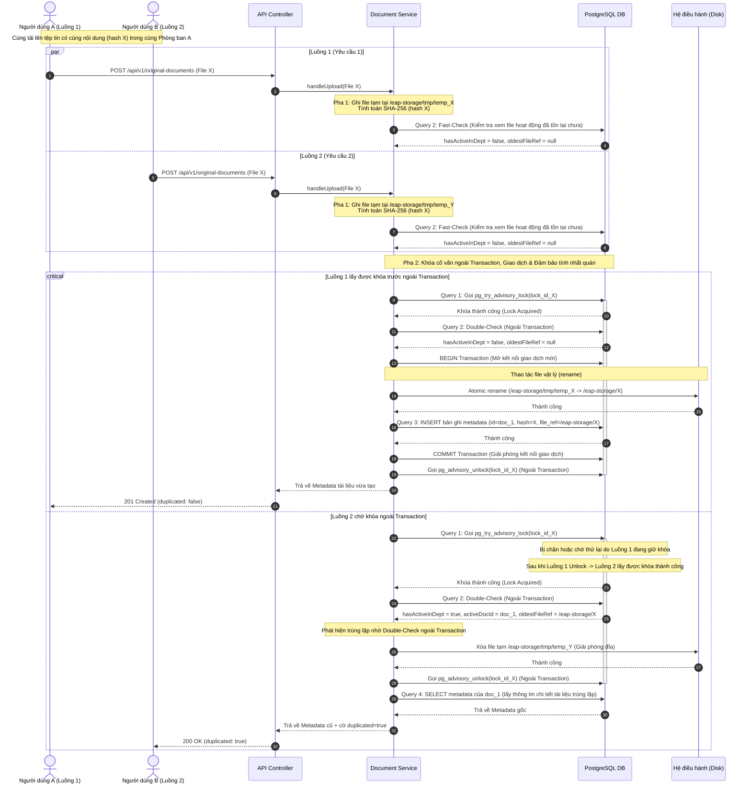

# Tài liệu Thiết kế Chi tiết (Detailed Design) - Tuần 2
## Đặc tả Chi tiết Cơ chế Chống trùng lặp & Xử lý Tải đồng thời

---

## 1. Thiết kế Mô hình Dữ liệu (Database Design)

### 1.1. Cấu trúc bảng `documents` (Siêu dữ liệu tài liệu)

| Tên cột logic | Kiểu dữ liệu logic | Nullable | Ràng buộc / Khóa ngoại | Ý nghĩa nghiệp vụ |
| :--- | :--- | :--- | :--- | :--- |
| `id` | UUID | NO | Khóa chính (LSB: 0 = Original, 1 = Alias) | Mã định danh duy nhất của tài liệu. |
| `business_code` | VARCHAR(50) | NO | UNIQUE | Mã nghiệp vụ thân thiện hiển thị cho người dùng. |
| `title` | VARCHAR(255) | NO | | Tiêu đề hiển thị của tài liệu. |
| `file_reference` | VARCHAR(512) | YES | | Đường dẫn lưu trữ vật lý của file trên đĩa (null đối với alias). |
| `file_size` | BIGINT | YES | | Dung lượng tệp tính bằng byte (null đối với alias). |
| `hash` | VARCHAR(64) | YES | | Mã băm SHA-256 (64 ký tự hex) đại diện cho nội dung tệp. |
| `owner_department_id` | UUID | NO | Khóa ngoại | Phòng ban sở hữu tài liệu này. |
| `parent_id` | UUID | YES | Khóa ngoại (tới `documents.id`) | Liên kết tới tài liệu gốc nếu bản ghi là alias. |
| `creator_department_id`| UUID | YES | Khóa ngoại | Phòng ban thực hiện chia sẻ (chỉ áp dụng cho alias). |
| `created_by` | UUID | YES | Khóa ngoại | Người dùng thực hiện tải lên tệp tin. |
| `created_at` | TIMESTAMP | NO | | Thời điểm tạo bản ghi. |
| `updated_at` | TIMESTAMP | YES | | Thời điểm cập nhật tiêu đề gần nhất. |
| `deleted_at` | TIMESTAMP | YES | | Thời điểm xóa mềm tài liệu. |

### 1.2. Thiết kế Chỉ mục (Index Design)
Hệ thống sử dụng **hai chỉ mục** độc lập phục vụ cho các mục đích nghiệp vụ khác nhau:

1.  **Chỉ mục duy nhất bán phần (uq_documents_hash_dept)**:
    *   *Mục đích*: Bảo vệ tính duy nhất, chống ghi trùng lặp tài liệu hoạt động trong phòng ban.
    *   *SQL*:
        ```sql
        CREATE UNIQUE INDEX uq_documents_hash_dept ON documents(hash, owner_department_id) WHERE deleted_at IS NULL;
        ```
2.  **Chỉ mục phụ toàn phần trên mã băm (idx_documents_hash)**:
    *   *Mục đích*: Tối ưu hóa truy vấn tìm kiếm toàn cục theo `hash` để tái sử dụng tệp vật lý (SIS). Vì luồng SIS cần quét trên cả các tài liệu đã bị xóa mềm, chỉ mục này không chứa điều kiện `deleted_at IS NULL`.
    *   *SQL*:
        ```sql
        CREATE INDEX idx_documents_hash ON documents(hash);
        ```

---

## 2. Đặc tả API (API Design)

### 2.1. API POST /api/v1/original-documents
*   **Method**: `POST`
*   **Content-Type**: `multipart/form-data`
*   **Tham số Request**:
    *   `title` (Chuỗi ký tự, bắt buộc, độ dài từ 1 đến 255 ký tự).
    *   `file` (Dữ liệu tệp nhị phân, bắt buộc, dung lượng tối đa 50MB).
*   **Các quy tắc validation đầu vào**:
    *   Tiêu đề không được để trống hoặc chỉ chứa khoảng trắng.
    *   Dung lượng file tải lên phải lớn hơn 0 và nhỏ hơn hoặc bằng 50MB.
    *   Định dạng tệp thực tế phải thuộc danh sách được hỗ trợ (`application/pdf`, `application/vnd.openxmlformats-officedocument.wordprocessingml.document`, v.v.) bằng cách kiểm tra cấu trúc nhị phân của tệp (magic bytes) qua thư viện phân tích cấu trúc nhị phân độc lập.

### 2.2. Đặc tả Phản hồi API (API Response Design)

#### Trường hợp 201 Created (Tải lên thành công tệp mới hoặc SIS)
```json
{
  "id": "a0eebc99-9c0b-4ef8-bb6d-6bb9bd380a10",
  "businessCode": "ORIG_A8F2E4D1",
  "title": "Báo cáo doanh thu quý 2",
  "ownerDepartmentId": "b2f63f58-5d29-45e0-8151-24db58804791",
  "fileSize": 120540,
  "hash": "e3b0c44298fc1c149afbf4c8996fb92427ae41e4649b934ca495991b7852b855",
  "parentId": null,
  "creatorDepartmentId": null,
  "createdBy": "c3d9a184-7a2e-4b48-8df3-bf7b1348a27b",
  "createdAt": "2026-07-09T15:30:00",
  "updatedAt": null,
  "duplicated": false
}
```

#### Trường hợp 200 OK (Phát hiện tệp trùng lặp trong cùng phòng ban)
```json
{
  "id": "a0eebc99-9c0b-4ef8-bb6d-6bb9bd380a10",
  "businessCode": "ORIG_A8F2E4D1",
  "title": "Báo cáo doanh thu quý 2",
  "ownerDepartmentId": "b2f63f58-5d29-45e0-8151-24db58804791",
  "fileSize": 120540,
  "hash": "e3b0c44298fc1c149afbf4c8996fb92427ae41e4649b934ca495991b7852b855",
  "parentId": null,
  "creatorDepartmentId": null,
  "createdBy": "c3d9a184-7a2e-4b48-8df3-bf7b1348a27b",
  "createdAt": "2026-07-09T15:30:00",
  "updatedAt": null,
  "duplicated": true
}
```

#### Trường hợp 429 Too Many Requests (Hết thời gian chờ khóa hoặc cạn kết nối DB)
```json
{
  "errorCode": "ERR_CONCURRENT_UPLOAD",
  "message": "Yêu cầu tải lên tệp tin đang được xử lý đồng thời. Vui lòng thử lại sau."
}
```

---

## 3. Quy trình Xử lý Nghiệp vụ Chi tiết (Detailed Workflows)

### 3.1. Thuật toán Hashing & Lưu tệp tạm thời 1-pass (Single-Pass Storage & Hashing)
Nhằm tránh việc đọc file hai lần gây lãng phí tài nguyên I/O đĩa cứng, hệ thống áp dụng luồng xử lý như sau:
1.  API tiếp nhận tệp tin dưới dạng luồng dữ liệu (`InputStream`).
2.  Khởi tạo bộ xử lý tính toán mã băm mật mã (SHA-256) và luồng ghi tệp tạm thời.
3.  Vừa đọc luồng dữ liệu đầu vào vừa ghi trực tiếp vào một tệp tạm thời trong thư mục `/eap-storage/tmp` (được cấu hình cùng mount point mạng dùng chung với thư mục đích), đồng thời cập nhật trạng thái của bộ tính toán mã băm cho mỗi khối đệm dữ liệu (kích thước đệm khuyến nghị: 8KB).
4.  Khi luồng dữ liệu đọc hết, hoàn tất quá trình ghi tệp tạm thời và kết xuất chuỗi Hex đại diện cho mã băm SHA-256.
5.  Phương pháp này đảm bảo chỉ đọc dữ liệu nhị phân của tệp tin đúng một lần duy nhất.

### 3.2. Cấu trúc Phân tách Giao dịch & Tối ưu hóa Khóa
Để giải phóng khóa cố vấn PostgreSQL ngay lập tức và tránh chiếm dụng tài nguyên kết nối lâu, logic nghiệp vụ được phân tách thành hai tầng phương thức:

#### Phương thức chính (Ngoài Giao dịch - Non-Transactional)
1.  Nhận tiêu đề, tệp tin và thông tin người dùng.
2.  Thực hiện validation vai trò và định dạng tệp tin.
3.  Gọi bộ xử lý "Hashing & Lưu tệp tạm thời 1-pass" để lấy mã băm `hash` và tệp tạm `tempFile` tại `/eap-storage/tmp/temp_hash_code`.
4.  **Bảo vệ tài nguyên bằng khối Try-Finally**:
    *   Toàn bộ luồng xử lý từ bước này phải nằm trong khối `try-finally` để đảm bảo dọn dẹp file tạm và giải phóng khóa.
5.  **Fast-Check (Ngoài Giao dịch)**: Thực thi **Truy vấn gộp Aggregate (Query 2)**.
    *   Nếu `hasActiveInDept` trả về `true`: Đặt cờ hoàn thành, nhảy đến khối `finally` để xóa tệp tạm `tempFile` và thực thi **Truy vấn lấy thông tin tài liệu (Query 4)** bằng `activeDocId` để trả về phản hồi trùng lặp (HTTP 200 OK + `duplicated: true`).
6.  **Acquire Session-level Advisory Lock (Ngoài Giao dịch)**: Mượn một kết nối riêng biệt từ HikariCP, thực thi `pg_try_advisory_lock` (không chặn) theo cơ chế vòng lặp thử lại (Retry Loop) với giãn cách thời gian tăng dần (Exponential Backoff: 200ms → 400ms → 800ms → 1000ms). Tổng thời gian chờ tối đa là **10 giây** để bảo vệ SLA 15 giây.
    *   Nếu hết 10 giây mà chưa lấy được khóa: Ném ngoại lệ `ConcurrentUploadTimeoutException`, khối `finally` hủy tệp tạm, trả về **HTTP 429 Too Many Requests** với mã lỗi `ERR_CONCURRENT_UPLOAD`.
7.  **Double-Check (Ngoài Giao dịch)**: Thực thi lại **Truy vấn gộp Aggregate (Query 2)**.
    *   Nếu `hasActiveInDept` trả về `true` (do luồng khác vừa ghi thành công trong lúc chờ khóa): Nhảy đến khối `finally` để giải phóng khóa, xóa tệp tạm `tempFile`, thực thi **Truy vấn lấy thông tin tài liệu (Query 4)** bằng `activeDocId` và trả về phản hồi trùng lặp (HTTP 200 OK + `duplicated: true`).
8.  Nếu chưa có bản ghi trùng lặp trong phòng ban, chuyển tiếp yêu cầu đến phương thức giao dịch để thực hiện ghi nhận.

#### Phương thức Giao dịch (Trong Giao dịch - Transactional)
1.  Mở giao dịch (Transaction) cơ sở dữ liệu mới (Spring Boot mượn kết nối giao dịch chính từ pool).
2.  **Xử lý lưu trữ vật lý**:
    *   Nếu `oldestFileRef` không rỗng: Tái sử dụng liên kết tệp vật lý cũ nhất này, đồng thời báo hiệu để khối `finally` xóa tệp tạm `tempFile`.
    *   Nếu `oldestFileRef` rỗng (tệp vật lý chưa từng tồn tại): Di chuyển tệp tạm `tempFile` vào đường dẫn lưu trữ chính thức đặt tên theo mã băm (`/eap-storage/{hash}`) bằng thao tác đổi tên tệp tức thời (atomic rename ở tầng hệ điều hành).
        *   *Lưu ý xử lý xung đột liên phòng ban*: Nếu phát hiện lỗi tệp đích đã tồn tại (do phòng ban khác chạy song song vừa thực hiện rename thành công), tiến hành bắt ngoại lệ `FileAlreadyExistsException`, báo hiệu để khối `finally` tự động hủy tệp tạm `tempFile` và tái sử dụng đường dẫn tệp đích đã có.
3.  Thực hiện **Truy vấn thêm bản ghi mới (Query 3)** để lưu siêu dữ liệu tài liệu mới vào cơ sở dữ liệu.
4.  Kết thúc giao dịch (Commit). Trả về siêu dữ liệu vừa tạo (HTTP 201 Created + `duplicated: false`).
5.  *Xử lý lỗi vi phạm UNIQUE*: Nếu xảy ra lỗi vi phạm UNIQUE constraint (lá chắn cuối cùng) do các vấn đề bất thường, ném ngoại lệ `DataIntegrityViolationException` để tầng ngoài rollback transaction, tự động hủy file tạm và trả về HTTP 200 OK + `duplicated: true`.

#### Khối Dọn dẹp Cuối cùng (Khối Finally của Phương thức chính)
*   **Giải phóng Khóa**: Thực hiện gọi `pg_advisory_unlock` để giải phóng khóa cố vấn PostgreSQL session-level, trả kết nối giữ khóa về pool.
*   **Xóa tệp tạm**: Nếu tệp tạm `tempFile` vẫn tồn tại trên đĩa và luồng xử lý chưa đánh dấu di chuyển tệp thành công -> Thực hiện xóa tệp tạm `tempFile` ngay lập tức để giải phóng tài nguyên đĩa.

### 3.3. Sơ đồ Tuần tự Xử lý Đồng thời (Mermaid Sequence Diagram)
Dưới đây là sơ đồ mô tả chi tiết luồng xử lý khi có hai yêu cầu tải trùng tệp được gửi lên đồng thời bởi hai người dùng trong cùng một phòng ban:



---

## 4. Các câu lệnh SQL Tường minh (Raw SQL Queries)

Dưới đây là đặc tả chi tiết của toàn bộ các câu lệnh SQL được sử dụng trong hệ thống:

### Query 1: Yêu cầu khóa cố vấn 64-bit (Advisory Lock)
Sử dụng hàm `hashtextextended` của PostgreSQL để tạo giá trị băm 64-bit từ chuỗi khóa kết hợp giữa mã phòng ban và mã băm tệp, giảm thiểu tỷ lệ va chạm xuống tối đa. Khóa cố vấn session-level (`pg_advisory_lock`) được yêu cầu và giải phóng tường minh bên ngoài giao dịch để tránh chiếm giữ kết nối DB trong khi xếp hàng chờ.
```sql
SELECT pg_advisory_lock(hashtextextended(concat(:ownerDepartmentId, ':', :hash), 0));
```

### Query 2: Truy vấn gộp Aggregate (Fast-Check và Double-Check)
Truy vấn này quét trên chỉ mục `idx_documents_hash` theo mã băm tệp để lấy ra trạng thái trùng lặp và đường dẫn file vật lý cũ nhất.
```sql
SELECT 
    bool_or(owner_department_id = :ownerDepartmentId AND deleted_at IS NULL) AS has_active_in_dept,
    (array_agg(id ORDER BY created_at ASC) FILTER (WHERE owner_department_id = :ownerDepartmentId AND deleted_at IS NULL))[1] AS active_doc_id,
    (array_agg(file_reference ORDER BY created_at ASC) FILTER (WHERE file_reference IS NOT NULL))[1] AS oldest_file_ref
FROM documents
WHERE hash = :hash;
```
*   `has_active_in_dept`: Trả về `true` nếu phòng ban đã có bản ghi hoạt động trùng khớp.
*   `active_doc_id`: UUID của bản ghi hoạt động đó (lấy bản ghi tạo sớm nhất nếu có nhiều hơn một).
*   `oldest_file_ref`: Đường dẫn tệp vật lý cũ nhất từng tồn tại trên đĩa của mã băm này để phục vụ tái sử dụng (không lọc theo `deleted_at`).

### Kết quả `EXPLAIN ANALYZE INDEX`

```text
Aggregate  (cost=8.59..8.60 rows=1 width=49)
(actual time=0.196..0.197 rows=1 loops=1)

-> Index Scan using idx_documents_hash on documents
   (cost=0.55..8.57 rows=1 width=94)
   (actual time=0.058..0.060 rows=1 loops=1)

   Index Cond: ((hash)::text = '3a69ce08cd836063712a0aa02c6206e22d678a9543c4f74fcec7c6e873574deb'::text)

Planning Time: 0.407 ms
Execution Time: 0.339 ms
```

**Nhận xét:**
- PostgreSQL sử dụng **Index Scan** trên chỉ mục `idx_documents_hash`.
- Điều kiện lọc theo `hash` được thực hiện trực tiếp trên chỉ mục (`Index Cond`).
- Chỉ có **1 bản ghi** được tìm thấy (`rows=1`).
- Thời gian lập kế hoạch (**Planning Time**) là **0.407 ms**.
- Thời gian thực thi (**Execution Time**) là **0.339 ms**, cho thấy truy vấn có hiệu năng rất cao.

### Kết quả `EXPLAIN ANALYZE SEQ`

```text
Aggregate  (cost=73574.50..73574.51 rows=1 width=49)
(actual time=277.041..279.416 rows=1 loops=1)

-> Gather
   (cost=1000.00..73574.49 rows=1 width=94)
   (actual time=276.788..279.166 rows=1 loops=1)

   Workers Planned: 2
   Workers Launched: 2

   -> Parallel Seq Scan on documents
      (cost=0.00..72574.39 rows=1 width=94)
      (actual time=261.060..270.595 rows=0 loops=3)

      Filter: ((hash)::text = '3a69ce08cd836063712a0aa02c6206e22d678a9543c4f74fcec7c6e873574deb'::text)

      Rows Removed by Filter: 666679

Planning Time: 0.314 ms
Execution Time: 279.650 ms
```

**Nhận xét:**

- PostgreSQL **không sử dụng chỉ mục** mà thực hiện **Parallel Sequential Scan** trên toàn bộ bảng `documents`.
- Truy vấn được thực thi song song với **2 worker**, tổng cộng **3 tiến trình** (1 tiến trình chính + 2 worker).
- Mỗi worker quét một phần dữ liệu và áp dụng điều kiện lọc theo `hash`.
- Mỗi worker phải loại bỏ khoảng **666.679 bản ghi**, tương đương gần **2 triệu bản ghi** được quét trên toàn bảng.
- Mặc dù có sử dụng cơ chế quét song song (`Gather`), thời gian thực thi vẫn lên tới **279.650 ms**, lớn hơn rất nhiều so với trường hợp sử dụng `Index Scan`.
- Kết quả này cho thấy khi không có chỉ mục phù hợp trên cột `hash`, PostgreSQL buộc phải quét toàn bộ bảng, làm tăng đáng kể chi phí I/O và thời gian thực thi.

### Query 3: Truy vấn thêm bản ghi tài liệu mới
```sql
INSERT INTO documents (
    id, 
    business_code, 
    title, 
    file_reference, 
    file_size, 
    hash, 
    owner_department_id, 
    parent_id, 
    creator_department_id, 
    created_by, 
    created_at
) VALUES (
    :id, 
    :businessCode, 
    :title, 
    :fileReference, 
    :fileSize, 
    :hash, 
    :ownerDepartmentId, 
    :parentId, 
    :creatorDepartmentId, 
    :createdBy, 
    NOW()
);
```

### Query 4: Truy vấn lấy siêu dữ liệu tài liệu
Sử dụng để lấy thông tin tài liệu trùng lặp trả về cho client.
```sql
SELECT 
    id, 
    business_code, 
    title, 
    file_reference, 
    file_size, 
    hash, 
    owner_department_id, 
    parent_id, 
    creator_department_id, 
    created_by, 
    created_at, 
    updated_at
FROM documents
WHERE id = :id;
```

---

## 5. Quản lý Exception & Timeout (Exception & Timeout Management)

### 5.1. Lỗi Hết hạn kết nối DB (Connection Pending Timeout)
*   **Kịch bản**: stress test 150 requests đồng thời trong khi pool size là 110. 40 requests xếp hàng sau sẽ bị chặn quá 5 giây tại pool chờ kết nối DB.
*   **Xử lý**: Hệ thống bắt ngoại lệ chờ kết nối (`SQLTransientConnectionException` hoặc tương đương) tại Handler toàn cục, ghi log cảnh báo và trả về HTTP 429 Too Many Requests (JSON lỗi `ERR_CONCURRENT_UPLOAD`) thay vì ném lỗi HTTP 500.

### 5.2. Lỗi vi phạm UNIQUE constraint (Lá chắn cuối cùng)
*   **Kịch bản**: Sự cố bất ngờ khiến Double-Check bị vượt qua và xảy ra lỗi vi phạm ràng buộc unique `uq_documents_hash_dept` ở database.
*   **Xử lý**: Tầng Handler toàn cục bắt ngoại lệ `DataIntegrityViolationException`, ghi nhận cảnh báo (Mức độ WARN) kèm mã băm tệp, tự động truy vấn lại thông tin bản ghi cũ theo mã băm để phản hồi thành công (HTTP 200 OK + `duplicated: true`) cho người dùng một cách âm thầm.

### 5.3. Lỗi Hết thời gian chờ Khóa cố vấn (Lock Acquisition Timeout)
*   **Kịch bản**: Dưới tải cực cao (ví dụ: 150 request tải cùng 1 file), các request xếp hàng chờ `pg_try_advisory_lock` vượt quá tổng thời gian retry 10 giây mà vẫn chưa lấy được khóa.
*   **Phân biệt với 5.1**: Lỗi này xảy ra ở tầng **khóa cố vấn** (chờ lock), không phải tầng **kết nối DB** (chờ pool). Request vẫn có kết nối DB nhưng không thể giành được khóa nghiệp vụ.
*   **Xử lý**: Ném ngoại lệ `ConcurrentUploadTimeoutException` tại tầng Service. Handler toàn cục bắt ngoại lệ này, hủy tệp tạm và trả về **HTTP 429 Too Many Requests** với body JSON `{ "errorCode": "ERR_CONCURRENT_UPLOAD", "message": "Hệ thống đang xử lý quá nhiều yêu cầu tải lên cùng tệp. Vui lòng thử lại sau." }`.

### 5.4. Lỗi Kết nối DB bị thu hồi (DB Connection Recycle / Network Timeout)
*   **Kịch bản**: Tường lửa hoặc PostgreSQL tự động thu hồi kết nối đang giữ khóa cố vấn session-level do kết nối bị idle quá lâu trong khi khóa đang được giữ.
*   **Cơ chế tự phục hồi của PostgreSQL**: Khi kết nối TCP bị đứt, PostgreSQL **tự động giải phóng** toàn bộ khóa cố vấn session-level liên kết với session đó – không để lại rò rỉ.
*   **Xử lý tại ứng dụng**: Khi luồng Java cố gắng thực thi `pg_advisory_unlock` trong khối `finally`, nó sẽ nhận được lỗi kết nối. Khối `finally` **bắt buộc phải bắt `Throwable`** (không chỉ `Exception`) để đảm bảo lỗi unlock không đè nát kết quả trả về của request (transaction đã commit thành công từ trước). Mẫu code bắt buộc:
    ```java
    } finally {
        try {
            advisoryLockConnection.execute("SELECT pg_advisory_unlock(...)");
        } catch (Throwable t) {
            log.warn("Không thể giải phóng advisory lock, PostgreSQL tự dọn khi mất kết nối", t);
        }
        // Tiếp tục dọn tệp tạm...
    }
    ```
*   **Phòng ngừa rò rỉ khóa tích lũy**: Cấu hình HikariCP `max-lifetime = 10–15 phút` để định kỳ làm mới kết nối vật lý, giải phóng các khóa bị rò rỉ ngầm (nếu có).

### 5.5. Sự cố Sập Ứng dụng (Application Crash / Node Restart)
*   **Kịch bản**: Node Spring Boot bị sập nguồn đột ngột (kill -9, mất điện) khi đang xử lý và giữ khóa cố vấn session-level.
*   **Cơ chế tự phục hồi của PostgreSQL**: Khi kết nối TCP vật lý đến DB bị đứt đột ngột, PostgreSQL phát hiện qua cơ chế **TCP keepalive** và tự động đóng session. Toàn bộ khóa cố vấn session-level gắn với session đó được **giải phóng tức thì** – các request đang chờ sẽ lần lượt giành được khóa và tiếp tục xử lý bình thường.
*   **Không cần xử lý tại ứng dụng**: Đây là đảm bảo cứng ở tầng PostgreSQL, ứng dụng không cần thêm logic phục hồi đặc biệt. Tuy nhiên, cần đảm bảo **không tắt TCP keepalive** trong cấu hình JDBC connection pool.

---

## 6. Kế hoạch Dọn dẹp Định kỳ (Daemon Cleanup Strategy)

*   **Mục đích**: Dọn dẹp các tệp tạm thời hoặc tệp mồ côi (file vật lý tồn tại trên đĩa nhưng không có metadata trong DB) phát sinh do sự cố sập nguồn đột ngột của node ứng dụng.
*   **Tiến trình 1: Dọn dẹp tệp đệm tạm thời**:
    *   *Tần suất*: Chạy định kỳ mỗi 1 giờ (Cron job).
    *   *Logic*: Quét thư mục tạm `/eap-storage/tmp` và xóa bỏ toàn bộ các tệp đệm tạm thời có thời gian tạo cũ hơn 1 giờ.
*   **Tiến trình 2: Dọn dẹp tệp vật lý mồ côi (Orphaned Files)**:
    *   *Tần suất*: Chạy định kỳ mỗi 24 giờ vào khung giờ thấp điểm (02:00 AM).
    *   *Logic*: Quét thư mục lưu trữ `/eap-storage`, so khớp tên tệp (hash) với danh sách `hash` đang hoạt động trong bảng `documents`. Nếu tệp vật lý trên đĩa không tồn tại bất kỳ tham chiếu nào trong cơ sở dữ liệu (kể cả bản ghi đã xóa mềm - theo quy tắc BR-4), tiến hành xóa tệp vật lý đó để giải phóng ổ đĩa.
