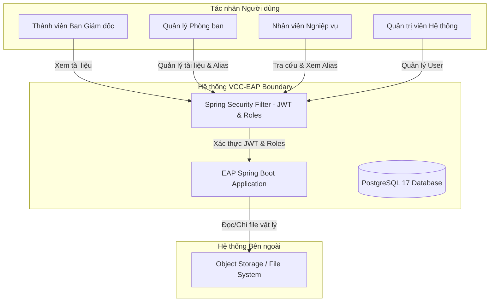
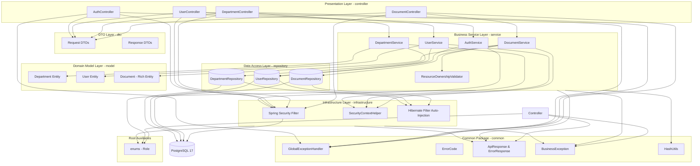
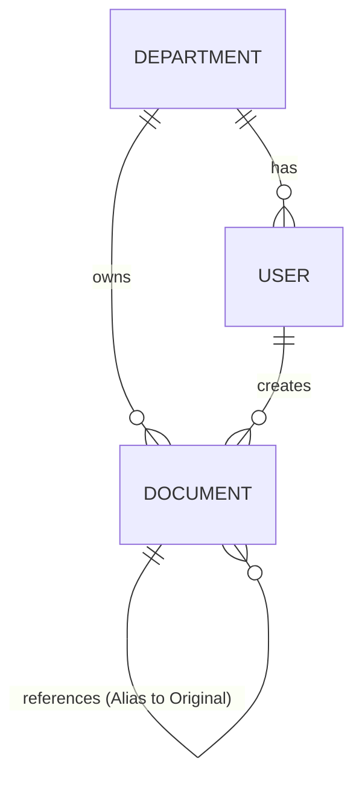

# Architecture Design Document
**Dự án:** VCC Enterprise Archive Platform (VCC-EAP)  
**Tài liệu:** Thiết kế Kiến trúc Tổng thể Hệ thống (System Architecture Design)  
**Giai đoạn:** Giai đoạn 1 (Week 1 Release)  
**Tác giả:** Kiến trúc sư trưởng (Principal Software Architect)  

---

## 1. System Context (Sơ đồ Bối cảnh Hệ thống)

Sơ đồ dưới đây mô tả sự tương tác giữa các tác nhân và hệ thống EAP, cũng như các ranh giới hệ thống:



---

## 2. Architecture Overview (Tổng quan Kiến trúc Tinh gọn)
Hệ thống **VCC Enterprise Archive Platform (VCC-EAP)** sử dụng mô hình **Kiến trúc phân tầng tinh gọn (Lean Layered Architecture - KISS)**. Thay vì áp dụng rập khuôn các nguyên lý Clean Architecture thuần túy với quá nhiều lớp trừu tượng (như Port-Adapter cho Repository, Mapper Layer riêng biệt), kiến trúc này ưu tiên **sự đơn giản, dễ đọc và tính thực tế cao** cho quy mô Tuần 1.

Hệ thống được tổ chức thành 4 phân lớp chính:
1.  **Domain Model Layer (Tầng Thực thể - `model`)**: Chứa các thực thể dữ liệu quan hệ (Rich Domain Model), tự kiểm tra các quy tắc nghiệp vụ bất biến cốt lõi (BOARD protection, Push Model check).
2.  **Business Service Layer (Tầng Nghiệp vụ - `service`)**: Chứa các Service điều phối logic nghiệp vụ và ca sử dụng.
3.  **Presentation Layer (Tầng Hiển thị - `controller`)**: Chứa REST Controllers xử lý HTTP request/response.
4.  **Infrastructure Layer (Tầng Hạ tầng - `infrastructure`)**: Chứa các cấu hình bổ trợ của Spring Boot (Security, JWT, Hibernate Filters).

Hệ thống tập trung toàn bộ các lớp phản hồi (`ApiResponse`, `ErrorResponse`), mã lỗi (`ErrorCode`), xử lý ngoại lệ (`GlobalExceptionHandler`, `BusinessException`) và tiện ích kỹ thuật (`HashUtils`) vào gói chung **`common`** ở root cấp độ. Các kiểu Enum nghiệp vụ tĩnh (`enums`) cũng được tổ chức phẳng ở root. DTOs được đặt tách biệt tại gói `dto` con.

---

## 3. Component Diagram (Sơ đồ Thành phần)

Kiến trúc tinh gọn loại bỏ mọi Interface Port-Adapter dư thừa ở tầng truy cập dữ liệu và ánh xạ trung gian:



---

## 4. Data Isolation Strategy (Chiến lược Cô lập Dữ liệu)

### 4.1. Cô lập tự động qua Hibernate Filter kết hợp (Secure by Default)
Mọi truy vấn dữ liệu từ ứng dụng lên bảng gộp `documents` đều bị lọc tự động bởi Hibernate Filter được cấu hình trên thực thể `Document` để đảm bảo cô lập tuyệt đối mà không làm đứt gãy luồng chia sẻ và thu hồi Alias.

Hệ thống sử dụng thêm trường phi bình thường hóa `creator_department_id` (lưu phòng ban sở hữu tài liệu gốc đối với Alias) nhằm tối ưu hóa hiệu năng, giảm thiểu các phép JOIN phức tạp và các subquery đệ quy tự liên kết. Bộ lọc áp dụng điều kiện kết hợp:
```sql
owner_department_id = :userDeptId 
OR creator_department_id = :userDeptId
OR (parent_id IS NULL AND id IN (
    SELECT parent_id FROM documents 
    WHERE owner_department_id = :userDeptId AND parent_id IS NOT NULL AND deleted_at IS NULL
))
```
- Vế thứ nhất (`owner_department_id = :userDeptId`) đảm bảo phòng ban xem được tài liệu gốc do mình tạo ra và các Alias do mình nhận được (Alias lưu `owner_department_id` là phòng ban nhận).
- Vế thứ hai (`creator_department_id = :userDeptId`) đảm bảo phòng ban gửi (chủ sở hữu tài liệu gốc) vẫn nhìn thấy và có quyền quản lý, xóa/thu hồi các Alias mà họ đã tạo ra để chia sẻ sang phòng ban khác mà không cần thực hiện subquery phức tạp.
- Vế thứ ba (`parent_id IS NULL AND id IN (...)`) đảm bảo khi phòng ban nhận truy cập để Resolve một Alias, Hibernate Filter cho phép truy vấn Join/Select đến tài liệu gốc (parent) của phòng ban khác mà không bị lọc mất.

#### Quyết định Phi chuẩn hóa và Cơ chế Nhất quán:
- **Lý do phi chuẩn hóa**: Để kiểm tra quyền truy cập của phòng ban gửi (chủ sở hữu gốc) đối với các Alias đã phát hành, nếu không phi chuẩn hóa, PostgreSQL sẽ phải thực hiện một phép JOIN bổ sung hoặc một subquery tới bảng gốc (`parent_id`) để xác định phòng ban sở hữu. Trường `creator_department_id` cho phép lọc trực tiếp trên hàng hiện tại của bảng `documents` trong 1 câu SQL phẳng, giảm tải CPU và tăng tốc độ Index Scan.
- **Đảm bảo nhất quán**: Căn cứ quy tắc nghiệp vụ BR-09, phòng ban sở hữu của một tài liệu gốc là cố định và bất biến. Do đó, khi Alias được tạo ra và gán `creator_department_id` bằng ID phòng ban sở hữu tài liệu gốc, giá trị này sẽ không bao giờ thay đổi (`updatable = false`). Điều này triệt tiêu hoàn toàn rủi ro lệch dữ liệu (data drift), bảo đảm dữ liệu luôn nhất quán tuyệt đối với tài liệu gốc.

#### Ràng buộc Toàn vẹn CSDL (CHECK Constraints):
Để ngăn ngừa dữ liệu rơi vào trạng thái không hợp lệ do lỗi ứng dụng hoặc thao tác thủ công, CSDL áp dụng ràng buộc CHECK constraint nghiêm ngặt:
- Đối với **Original**: `parent_id` bắt buộc NULL, `file_reference` bắt buộc NOT NULL, và `creator_department_id` bắt buộc NULL.
- Đối với **Alias**: `parent_id` bắt buộc NOT NULL, `file_reference` bắt buộc NULL, và `creator_department_id` bắt buộc NOT NULL.
```sql
ALTER TABLE documents ADD CONSTRAINT chk_document_type_integrity CHECK (
    (parent_id IS NULL AND file_reference IS NOT NULL AND creator_department_id IS NULL) OR
    (parent_id IS NOT NULL AND file_reference IS NULL AND creator_department_id IS NOT NULL)
);
```

#### Đánh giá Hiệu năng (Performance Assessment):
- **Đánh giá Hiệu năng**: Câu điều kiện `OR` kết hợp `IN (subquery)` có thể gây suy giảm hiệu năng khi bảng dữ liệu vượt ngưỡng triệu bản ghi. Phép toán `OR` có thể khiến PostgreSQL Optimizer chuyển từ Index Scan sang quét tuần bản ghi (Seq Scan) hoặc BitmapOr Scan tốn RAM. Câu subquery `IN` yêu cầu tìm kiếm đệ quy các tài liệu liên kết, tạo thêm chi phí tính toán tỷ lệ thuận với số lượng Alias. Tuy nhiên, đối với quy mô và yêu cầu hiện tại, cơ chế Hibernate Filter vẫn đáp ứng hoàn hảo và hoạt động ổn định.

#### Chống Alias Chaining ở Tầng Nghiệp vụ:
- Hệ thống cấm tuyệt đối việc tạo Alias trỏ tới một Alias khác. Logic xác thực này được thực hiện trước khi tạo Alias tại tầng Service bằng cách truy vấn thực thể từ DB và kiểm tra `parentId` cũng như bit cuối LSB của UUID thực thể từ DB để đảm bảo nó là Original (LSB = 0). Hệ thống tuyệt đối không tin tưởng hay phụ thuộc vào bất kỳ thông số loại tài liệu nào do client gửi lên nhằm tránh Parameter Tampering.

### 4.2. Ranh giới Bảo mật Ban Giám đốc (BOARD Boundary)
Phòng ban `BOARD` được cô lập bảo mật tuyệt đối:
- Thành viên phòng `BOARD` có đầy đủ quyền tải lên tài liệu gốc nội bộ và xem tài liệu thuộc phòng `BOARD` để phục vụ công việc nghiệp vụ nội bộ của BOARD.
- Nghiêm cấm mọi quyền truy cập, đọc hoặc tải xuống tài liệu của phòng `BOARD` từ bất kỳ phòng ban nào khác và từ tài khoản Admin (`SYSTEM_ADMIN`).
- Cấm tuyệt đối việc tạo Alias liên kết trỏ tới tài liệu của phòng `BOARD` để chia sẻ ra bên ngoài (đảm bảo bởi `ResourceOwnershipValidator`).
- Thành viên phòng `BOARD` không được phép tạo Alias liên kết trỏ tới tài liệu của các phòng ban khác ra bên ngoài và không được nhận Alias chia sẻ từ phòng ban khác (hoàn toàn loại trừ BOARD khỏi luồng chia sẻ Alias).

---

## 5. Security Design (Thiết kế Bảo mật)
1.  **Cơ chế Lọc tự động ở mức Entity Base:** Đảm bảo mọi câu truy vấn sinh ra từ JPA (bao gồm cả `COUNT`, `EXISTS` hay các phép chiếu Projection) đều tự động bị Hibernate chèn điều kiện lọc phòng ban kết hợp trước khi gửi tới Database.
2.  **Chống rò rỉ ngoại lệ (Exception Sanitization):** Bộ xử lý lỗi tập trung `GlobalExceptionHandler` bắt các ngoại lệ cơ sở dữ liệu cấp thấp và chuyển đổi thành `ERR_SYSTEM_ERROR` hoặc mã lỗi chung để tránh dò tìm tài nguyên.
3.  **Phiên làm việc JWT ngắn hạn:** Loại bỏ các cơ chế Blacklist phức tạp của Redis cho Week 1. Thay vào đó, thiết lập thời gian sống của token JWT ngắn (15 phút). Khi có thay đổi quyền hạn hoặc phòng ban, người dùng sẽ tự động nhận quyền mới sau khi đăng nhập lại khi token cũ hết hạn.

---

## 6. Authorization Design (Thiết kế Phân quyền)
*   **Role-based Access Control (RBAC):** Áp dụng trực tiếp phân quyền dựa trên vai trò bằng Spring Security trên các API REST controllers.
*   **Xác thực dựa trên Quyền sở hữu (Ownership-based Authorization):** Việc tạo và xóa (thu hồi) Alias được phân quyền dựa trên sự khớp nối phòng ban của chủ sở hữu tài liệu gốc: `currentUser.departmentId == originalDocument.ownerDepartmentId`, ngoại trừ phòng `BOARD`. Bất kỳ người dùng hoạt động/quản lý nào thuộc phòng sở hữu tài liệu gốc (ngoại trừ BOARD) đều được phép tạo hoặc xóa/thu hồi Alias. Phòng nhận Alias tuyệt đối không có quyền tự xóa/thu hồi Alias đã được chia sẻ cho họ. Phòng `BOARD` bị cấm tạo, nhận hoặc thu hồi Alias dưới mọi hình thức.

---

## 7. Alias Design (Thiết kế Alias & SLA 0ms)
1.  **Nhận dạng Loại Tài liệu trong 0ms ở RAM (Bitwise LSB):** Nhúng loại tài liệu vào bit cuối cùng (Least Significant Bit - LSB) của UUID khi sinh ID:
    - Original Document UUID có bit cuối LSB = `0`.
    - Alias Document UUID có bit cuối LSB = `1`.
    - Giúp hệ thống phân biệt loại tài liệu trực tiếp trên RAM bằng phép toán bit trên JVM trong 0ms (`(id.getLeastSignificantBits() & 1L) == 1L`) mà không phát sinh bất kỳ DB query hay I/O đĩa nào.
2.  **Tính bất biến của liên kết Alias (Immutable Linkage):** Các trường cấu trúc `parent_id` (trỏ tới tài liệu gốc) và `owner_department_id` (phòng ban nhận) của thực thể `Document` được thiết lập là chỉ ghi một lần tại thời điểm khởi tạo (`insertable = true, updatable = false`). API cập nhật không cho phép thay đổi hai trường này.
3.  **Định tuyến API rõ ràng (Explicit Routing):** Tiếp tục duy trì các API endpoints nghiệp vụ rõ ràng cho Tài liệu Gốc (`/api/v1/original-documents`) và Tài liệu Liên kết (`/api/v1/alias-documents`) để tối ưu hóa thiết kế RESTful, mặc dù bên dưới chúng cùng lưu vào một bảng `documents` duy nhất.
4.  **Alias Chaining Prohibition:** Hệ thống từ chối nếu ID tài liệu gốc truyền vào thực chất là một Alias (kiểm tra nhanh bằng Bitwise LSB trên RAM trong 0ms trước khi xuống DB).
5.  **Tối ưu hóa Phân luồng Gọi thẳng (Fast-Path Routing Optimization):** Xuất phát từ thực tế vận hành có 99% tài nguyên là tài liệu gốc (Original) và chỉ 1% là tài liệu liên kết (Alias), hệ thống tối ưu hóa luồng điều phối bằng phép toán dịch/kiểm tra bitwise trên LSB của UUID. Nếu bit cuối là 0 (Original - chiếm 99% trường hợp), hệ thống lập tức điều hướng và gọi thẳng bộ xử lý tài liệu gốc (`OriginalDocumentProcessor`). Nếu là 1 (Alias - chiếm 1% trường hợp), hệ thống mới gọi bộ xử lý phân giải liên kết (`AliasDocumentProcessor`). Phương pháp này giúp triệt tiêu chi phí rẽ nhánh hoặc truy vấn kiểm tra CSDL không cần thiết cho đại đa số trường hợp thông thường.

---

## 8. Database Design Overview (Tổng quan Thiết kế Cơ sở Dữ liệu)

Sơ đồ ERD tổng quan mô tả mối quan hệ giữa các thực thể cốt lõi trong hệ thống:



Cơ sở dữ liệu PostgreSQL 17 lưu trữ dữ liệu dưới cấu trúc bảng chuẩn hóa:
*   departments: Danh sách phòng ban (BOARD, HR, FINANCE, R&D).
*   users: Danh sách nhân viên, mỗi nhân viên nghiệp vụ bắt buộc thuộc duy nhất 1 phòng ban (riêng SYSTEM_ADMIN có department_id bằng NULL và áp dụng CHECK constraint chk_user_department_integrity để ràng buộc).
*   `documents`: Bảng gộp lưu trữ cả tài liệu gốc và Alias. 
    - Có trường phi bình thường hóa `creator_department_id` (lưu phòng ban sở hữu tài liệu gốc đối với Alias) nhằm tối ưu hóa câu SQL lọc của Hibernate Filter.
    - Áp dụng cơ chế bit UUID LSB (LSB = 0 là tài liệu gốc, LSB = 1 là Alias) để nhận diện loại tài liệu nhanh chóng ở RAM trong 0ms.
    - Có Unique Index có điều kiện trên `(parent_id, owner_department_id) WHERE deleted_at IS NULL` để chống trùng lặp Alias.
    - Áp dụng ràng buộc cứng cấp CSDL `chk_document_type_integrity` (CHECK constraints) để đảm bảo dữ liệu không rơi vào trạng thái sai (Original có `file_reference` và `parent_id`/`creator_department_id` NULL; Alias ngược lại).
    - Trường `business_code` (Unique Index, NOT NULL) yêu cầu cả Original (`ORIG_xxxxxx`) và Alias (`ALIA_xxxxxx`) có mã định danh nghiệp vụ riêng biệt và duy nhất nhằm đáp ứng chỉ mục duy nhất dưới DB, bảo mật thông tin mã gốc, và hỗ trợ phòng nhận tự phân loại tài liệu theo hệ thống của họ.

---

## 9. Integration Design (Thiết kế Tích hợp)
*   **Tích hợp tệp tin vật lý**: Ứng dụng Spring Boot đóng vai trò quản lý siêu dữ liệu (metadata) tài liệu và lưu trữ đường dẫn tệp tin vật lý (`fileReference`) trỏ đến hệ thống file nội bộ an toàn (Object Storage). Luồng tải lên và tải xuống được xác thực phòng ban đồng bộ tại ứng dụng.

---

## 10. Architecture Decisions (Các Quyết định Kiến trúc Tinh gọn)

### ADR-001: Lựa chọn Cô lập Dữ liệu bằng Hibernate Filter kết hợp và Gộp bảng
*   **Quyết định:** Sử dụng bảng gộp `documents` và áp dụng `@Filter` của Hibernate với điều kiện logic kết hợp `OR` để lọc phòng ban tự động, đảm bảo cả luồng cô lập tài liệu gốc lẫn luồng Resolve Alias chéo phòng ban hoạt động ổn định, bảo mật cao.

### ADR-002: Áp dụng Chốt chặn Bảo mật An toàn mặc định (Secure by Default)
*   **Quyết định:** Tích hợp bộ lọc Hibernate Filter tự động cho mọi truy vấn (bao gồm cả COUNT/Projection), khóa cứng thông tin cấu trúc Alias thành bất biến (Immutable Linkage), và xử lý ngoại lệ tập trung (GlobalExceptionHandler).

### ADR-003: Sử dụng Helper Bảo mật Trực tiếp tại Tầng Hạ tầng
*   **Quyết định:** Thay vì định nghĩa Port/Adapter trừu tượng cho Security Context (gây over-engineering), hệ thống sử dụng trực tiếp lớp tiện ích/Helper bảo mật `SecurityContextHelper` đặt trong tầng Hạ tầng `infrastructure.security` để cung cấp thông tin người dùng và phòng ban hiện tại cho tầng Service.

### ADR-004: Tối giản hóa Thiết kế Phân tầng (KISS Principle)
*   **Quyết định:** Chuyển đổi toàn bộ kiến trúc từ Clean Architecture thuần túy sang mô hình **Kiến trúc phân tầng tinh gọn (Lean Layered Architecture)**. 

### ADR-005: Xây dựng Mô hình Miền giàu Nghiệp vụ (Rich Domain Model)
*   **Quyết định:** Chuyển các logic kiểm tra quy tắc nghiệp vụ bất biến trực tiếp thành các phương thức bên trong các thực thể Domain.

### ADR-006: Hợp nhất bảng dữ liệu & Sử dụng Bitwise UUID LSB để tối ưu hóa nhận diện (SLA 0ms)
*   **Quyết định:** 
    1. Hợp nhất hai loại tài liệu gốc và Alias vào chung bảng `documents` để tối ưu hóa hiệu năng DB.
    2. Nhúng loại tài liệu vào Least Significant Bit (LSB) của UUID (bit cuối = 0 là Original, = 1 là Alias) để nhận diện loại tài liệu trực tiếp trên RAM trong 0ms, loại bỏ I/O đĩa.
    3. Định nghĩa phân tách rõ rệt các class request/response DTOs tại gói `dto` độc lập của ứng dụng.

### ADR-007: Thiết lập Mô hình Vai trò dựa trên Enum
*   **Quyết định:** Mô hình hóa vai trò người dùng bằng kiểu dữ liệu Enum `Role` được khai báo tập trung tại `enums/Role.java` và lưu trữ dưới dạng String trong database, loại bỏ hoàn toàn bảng `roles` hoặc `user_roles` trung gian.
*   **Lý do:** Đối với Tuần 1, các vai trò của hệ thống là cố định. Việc sử dụng DB Role table gây ra overengineering không cần thiết. Việc tinh giản các gói hỗ trợ giúp mã nguồn phẳng hơn, dễ đọc và loại bỏ các file hằng số rác.
