# Detailed Design Document
**Dự án:** VCC Enterprise Archive Platform (VCC-EAP)  
**Tài liệu:** Thiết kế Chi tiết Hệ thống (Detailed Solution Design)  
**Giai đoạn:** Giai đoạn 1 (Week 1 Release)  
**Tác giả:** Trưởng nhóm Kiến trúc Giải pháp (Senior Solution Architect)  

---

## 1. Thư mục Mã nguồn Tinh gọn (Package Structure)

Hệ thống Spring Boot được tổ chức theo cấu trúc phân tầng thực tế tinh gọn (Lean Layered Architecture), tập trung các lớp dùng chung và cơ cấu xử lý lỗi vào gói `common`, cô lập bảo mật trong tầng hạ tầng và phân tách rõ ràng trách nhiệm giữa các gói:

```
com.vccorp.eap
│
├── common                          # Các thành phần dùng chung toàn hệ thống
│   ├── response                    # Cấu trúc phản hồi chuẩn hóa (Success/Error Envelopes)
│   ├── exception                   # Ngoại lệ nghiệp vụ cơ sở
│   ├── error                       # Quản lý mã lỗi tập trung và xử lý ngoại lệ toàn cục
│   └── util                        # Tiện ích bổ trợ (Xử lý chuỗi, mã hóa)
│
├── enums                           # Các Enum nghiệp vụ tĩnh dùng chung (Vai trò người dùng)
│
├── model                           # Tầng Thực thể dữ liệu (Domain Entities)
│
├── controller                      # Tầng Presentation (REST API Controllers)
│
├── dto                             # Tầng DTOs (Data Transfer Objects - Request/Response DTOs)
│
├── service                         # Tầng Nghiệp vụ (Business Logic & Validators)
│
├── repository                      # Tầng Truy cập Dữ liệu (Spring Data JPA Repositories)
│
└── infrastructure                  # Tầng Hạ tầng kỹ thuật (Security, JWT, Hibernate Filters Config)
```

---

## 2. Thiết kế Module (Module Design)

### 2.1. Module Quản lý Định danh & Vai trò (IAM Module)
*   **Trách nhiệm**: Quản lý thông tin phòng ban và tài khoản người dùng tĩnh khi khởi tạo.
*   **Dependencies**: Không phụ thuộc vào module khác.

### 2.2. Module Quản lý Tài liệu (Document Module)
*   **Trách nhiệm**: Tải lên tài liệu gốc, tạo Alias, giải quyết liên kết và xóa mềm lan truyền.
*   **Dependencies**: Phụ thuộc vào IAM Module để xác định phòng ban của người dùng hiện tại và thực hiện phân quyền dựa trên sở hữu.

---

## 3. Sơ đồ Usecase và Đặc tả Chi tiết (Usecase Model & Specifications)

### 3.1. Sơ đồ Usecase Tổng quan

Sơ đồ mô tả các tác nhân chính và các ca sử dụng tương ứng trong hệ thống EAP, bao gồm cả ca sử dụng đăng nhập hệ thống:

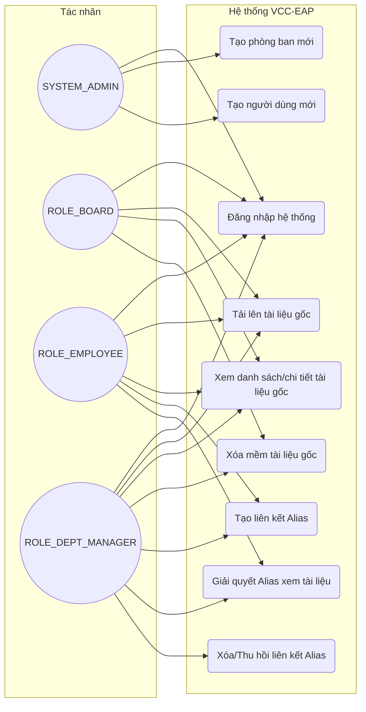

### 3.2. Đặc tả Chi tiết và Sơ đồ từng Usecase (Usecase Specifications & Diagrams)

#### 3.2.1. UC-01: Tạo phòng ban mới (Create Department)

**Sơ đồ Usecase Chi tiết:**
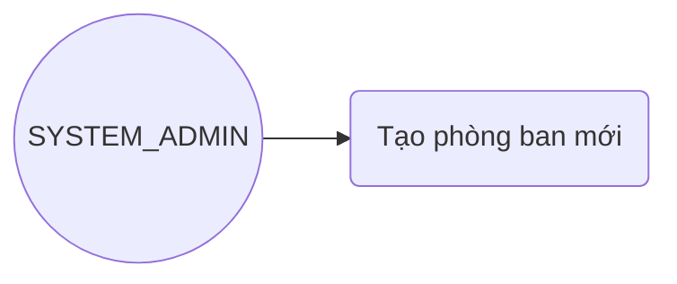

*   **Tác nhân**: `SYSTEM_ADMIN`
*   **Mô tả**: Admin tạo một phòng ban nghiệp vụ mới để phân nhóm người dùng nghiệp vụ.
*   **Tiền điều kiện**: Admin đã đăng nhập hệ thống thành công.
*   **Hậu điều kiện**: Phòng ban mới được tạo và lưu trữ cố định vào CSDL.
*   **Luồng sự kiện chính**:
    1. Admin gửi yêu cầu tạo phòng ban kèm theo mã phòng ban (`code`) và tên phòng ban (`name`).
    2. Hệ thống kiểm tra dữ liệu đầu vào.
    3. Hệ thống đối soát mã phòng ban trong CSDL để đảm bảo không bị trùng lặp.
    4. Hệ thống lưu thực thể phòng ban và trả về mã thành công `201 Created`.
*   **Ngoại lệ (Luồng lỗi)**:
    - Trùng lặp mã phòng ban -> Ném lỗi `VALIDATION_ERROR` (400 Bad Request).
    - Tác nhân không phải Admin -> Ném lỗi `ERR_FORBIDDEN_ROLE` (403 Forbidden).

---

#### 3.2.2. UC-02: Tạo người dùng mới (Create User)

**Sơ đồ Usecase Chi tiết:**
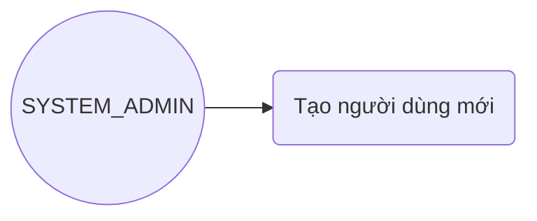

*   **Tác nhân**: `SYSTEM_ADMIN`
*   **Mô tả**: Admin khởi tạo tài khoản nhân viên mới và gán cố định vai trò cùng phòng ban.
*   **Tiền điều kiện**: Admin đã đăng nhập hệ thống thành công.
*   **Hậu điều kiện**: Tài khoản người dùng mới được tạo với mật khẩu mã hóa BCrypt.
*   **Luồng sự kiện chính**:
    1. Admin gửi yêu cầu tạo người dùng kèm thông tin: tên đăng nhập (`username`), email, mật khẩu, vai trò (`role`) và ID phòng ban (`departmentId`).
    2. Hệ thống kiểm tra hợp lệ email, mật khẩu và đối soát tính tồn tại của phòng ban được chọn.
    3. Hệ thống kiểm tra trùng lặp `username` hoặc `email` trong CSDL.
    4. Hệ thống thực hiện mã hóa mật khẩu bằng thuật toán BCrypt.
    5. Hệ thống lưu thực thể User mới và trả về mã thành công `201 Created`.
*   **Ngoại lệ (Luồng lỗi)**:
    - Vai trò là `SYSTEM_ADMIN` nhưng gửi `departmentId` khác NULL -> Hệ thống từ chối và ném lỗi `VALIDATION_ERROR` (400) vì Admin hệ thống không thuộc phòng nghiệp vụ nào.
    - Trùng username/email hoặc phòng ban không tồn tại -> Ném lỗi tương ứng.

---

#### 3.2.3. UC-03: Tải lên tài liệu gốc (Upload Original Document)

**Sơ đồ Usecase Chi tiết:**
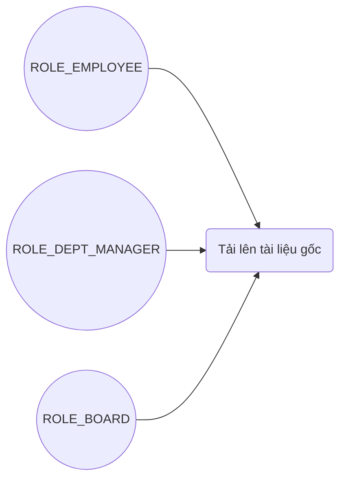

*   **Tác nhân**: `ROLE_EMPLOYEE`, `ROLE_DEPT_MANAGER`, `ROLE_BOARD`
*   **Mô tả**: Người dùng nghiệp vụ tải lên tài liệu gốc và siêu dữ liệu thuộc phòng ban của mình.
*   **Tiền điều kiện**: Người dùng nghiệp vụ đã đăng nhập thành công với token JWT hợp lệ.
*   **Hậu điều kiện**: Tài liệu gốc được lưu vào CSDL và tệp vật lý được lưu trữ trên Object Storage.
*   **Luồng sự kiện chính**:
    1. Người dùng gửi tiêu đề và tệp tin đính kèm thông qua HTTP Multipart Request.
    2. Hệ thống trích xuất thông tin phòng ban hiện tại (`ownerDepartmentId`) từ token JWT đã xác thực của người dùng (tuyệt đối không nhận tham số phòng ban từ payload).
    3. Hệ thống kiểm tra định dạng file (chỉ cho phép PDF, DOCX, XLSX, PPTX) và dung lượng tối đa (50MB).
    4. Hệ thống đẩy file vật lý lên Object Storage, tính toán mã băm SHA-256 của tệp và nhận về đường dẫn lưu trữ.
    5. Hệ thống khởi tạo ID có bit cuối LSB = `0` (tài liệu gốc) và lưu thông tin tài liệu vào DB.
*   **Ngoại lệ (Luồng lỗi)**:
    - File tải lên sai định dạng hoặc quá dung lượng cho phép -> Trả về lỗi `VALIDATION_ERROR` (400).

---

#### 3.2.4. UC-04: Xem danh sách/chi tiết tài liệu gốc (View Original Documents)

**Sơ đồ Usecase Chi tiết:**
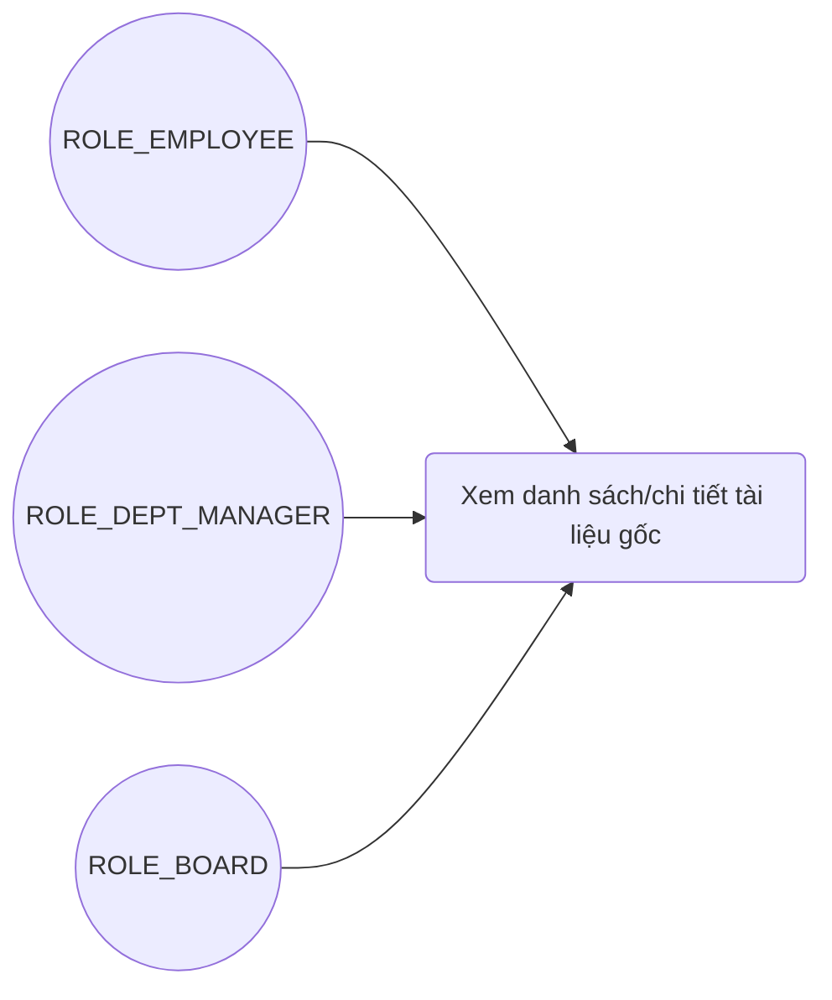

*   **Tác nhân**: `ROLE_EMPLOYEE`, `ROLE_DEPT_MANAGER`, `ROLE_BOARD`
*   **Mô tả**: Người dùng nghiệp vụ xem danh sách hoặc nội dung siêu dữ liệu chi tiết của tài liệu gốc.
*   **Tiền điều kiện**: Đăng nhập thành công và có quyền truy cập.
*   **Kiểm soát quyền nghiêm ngặt**: Chỉ có nhân viên thuộc phòng ban sở hữu tài liệu gốc, HOẶC nhân viên thuộc phòng ban nhận được Alias liên kết đang hoạt động mới được gọi API xem tài liệu gốc đó. Người dùng thuộc phòng ban khác gọi API sẽ bị hệ thống ẩn thông tin bằng lỗi `ERR_DOCUMENT_NOT_FOUND` (404).
*   **Luồng sự kiện chính**:
    1. Người dùng gửi yêu cầu truy xuất tài liệu gốc theo ID tài liệu.
    2. Hibernate Filter tự động chèn điều kiện lọc phòng ban:
       `owner_department_id = currentUser.departmentId OR (parent_id IS NULL AND id IN (SELECT parent_id FROM documents WHERE owner_department_id = currentUser.departmentId AND parent_id IS NOT NULL AND deleted_at IS NULL))`
    3. Hệ thống truy vấn CSDL, kiểm tra tính hợp lệ và trả về thông tin tài liệu.

---

#### 3.2.5. UC-05: Xóa mềm tài liệu gốc (Cascade Soft Delete)

**Sơ đồ Usecase Chi tiết:**
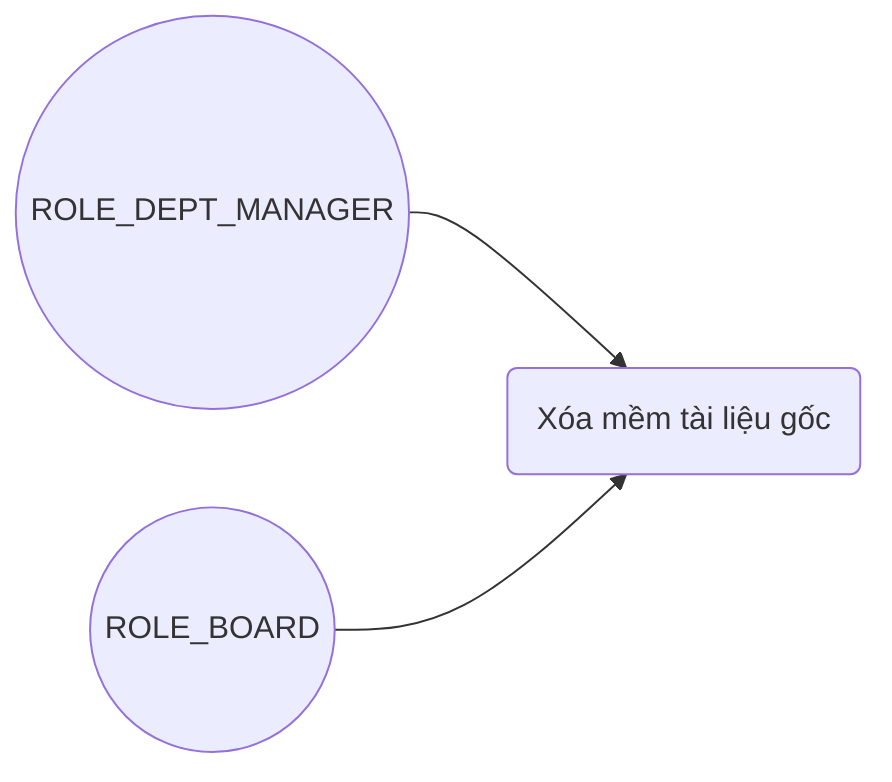

*   **Tác nhân**: `ROLE_DEPT_MANAGER` (đối với phòng ban nghiệp vụ thông thường), `ROLE_BOARD` (chỉ đối với phòng ban BOARD)
*   **Mô tả**: Trưởng phòng sở hữu hoặc thành viên BOARD thực hiện xóa mềm tài liệu gốc của bộ phận mình và thu hồi toàn bộ Alias (nếu có).
*   **Tiền điều kiện**: Đăng nhập với vai trò tương ứng và có quyền quản lý tài liệu.
*   **Kiểm soát quyền nghiêm ngặt**: Chỉ Trưởng phòng của phòng ban thực tế sở hữu tài liệu gốc, hoặc thành viên BOARD đối với tài liệu của phòng BOARD, mới có quyền xóa tài liệu đó. Hệ thống chặn và từ chối mọi yêu cầu xóa chéo từ phòng ban khác.
*   **Luồng sự kiện chính**:
    1. Người dùng gửi yêu cầu xóa tài liệu gốc.
    2. Hệ thống khóa bản ghi tài liệu bằng khóa ghi bi quan `PESSIMISTIC_WRITE` (`FOR UPDATE`) dưới DB để chặn race condition tạo Alias song song.
    3. Hệ thống kiểm tra quyền sở hữu phòng ban: `currentUser.departmentId == document.ownerDepartmentId` và tài liệu là bản gốc (LSB = 0).
    4. Hệ thống cập nhật trường `deleted_at` bằng thời điểm hiện tại và lưu tài liệu gốc.
    5. Hệ thống tự động cập nhật trường `deleted_at` cho toàn bộ Alias liên kết trỏ tới tài liệu gốc này (đối với tài liệu gốc nghiệp vụ thông thường) để vô hiệu hóa quyền truy cập của các phòng nhận.

---

#### 3.2.6. UC-06: Tạo liên kết chia sẻ Alias (Create Alias)

**Sơ đồ Usecase Chi tiết:**
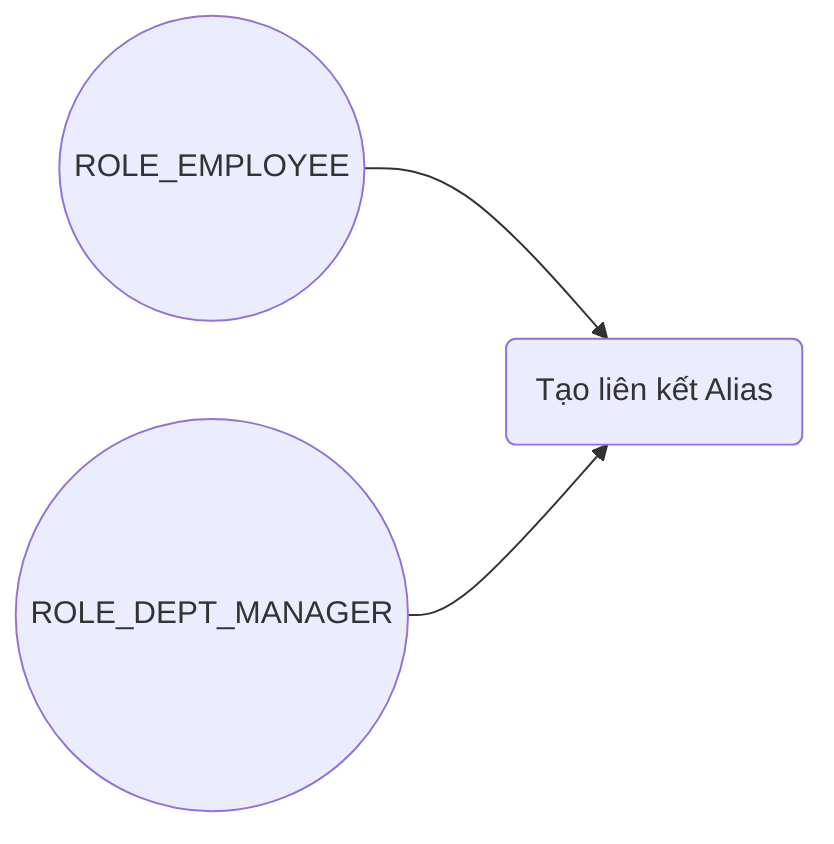

*   **Tác nhân**: `ROLE_EMPLOYEE`, `ROLE_DEPT_MANAGER`
*   **Mô tả**: Người dùng tạo liên kết động (Alias) để chia sẻ tài liệu gốc của bộ phận mình sang phòng ban khác.
*   **Kiểm soát quyền nghiêm ngặt**: Chỉ người dùng thuộc phòng ban thực sự sở hữu tài liệu gốc mới được phép chia sẻ tài liệu đó. BOARD hoàn toàn bị cấm tạo hoặc nhận Alias dưới mọi hình thức.
*   **Luồng sự kiện chính**:
    1. Người dùng gửi yêu cầu chia sẻ kèm theo ID tài liệu gốc và ID phòng ban nhận.
    2. Hệ thống khóa tài liệu gốc `FOR UPDATE`, kiểm tra người dùng thuộc phòng ban sở hữu tài liệu gốc và tài liệu gốc không thuộc phòng ban BOARD.
    3. Hệ thống kiểm tra xem phòng ban nhận đã có Alias hoạt động từ tài liệu gốc này hay chưa để tránh trùng lặp.
    4. Hệ thống sinh UUID cho Alias mới có bit cuối LSB = `1`, thiết lập `parent_id` trỏ đến tài liệu gốc, `creator_department_id` bằng phòng ban người tạo và `owner_department_id` bằng phòng ban nhận. Lưu thực thể Alias xuống DB.

---

#### 3.2.7. UC-07: Giải quyết Alias để xem tài liệu (Resolve Alias)

**Sơ đồ Usecase Chi tiết:**
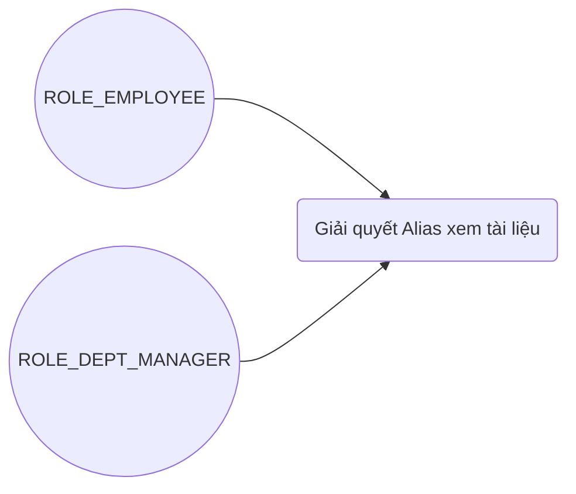
*   **Tác nhân**: `ROLE_EMPLOYEE`, `ROLE_DEPT_MANAGER`
*   **Mô tả**: Người dùng thuộc phòng ban nhận HOẶC phòng ban tạo giải quyết Alias để xem nội dung tài liệu gốc chéo phòng ban.
*   **Kiểm soát quyền nghiêm ngặt**: Chỉ người dùng thuộc phòng ban nhận của Alias (`alias.ownerDepartmentId == currentUser.departmentId`) HOẶC phòng ban tạo Alias (`alias.creatorDepartmentId == currentUser.departmentId`) mới được quyền gọi API này để xem dữ liệu tệp tin gốc. Bất kỳ phòng ban nào khác gọi API này đều bị chặn và trả về lỗi 404 để bảo mật dữ liệu tuyệt đối.
*   **Luồng sự kiện chính**:
    1. Người dùng gửi yêu cầu GET kèm ID của Alias.
    2. Bộ lọc tự động Hibernate Filter giới hạn truy vấn chỉ cho phép xem bản ghi Alias nếu phòng ban trùng khớp với phòng ban nhận (`owner_department_id`) hoặc phòng ban tạo (`creator_department_id`).
    3. Hệ thống thực hiện Join Query để truy xuất siêu dữ liệu và đường dẫn tệp tin gốc tương ứng, sau đó trả về cho người dùng.

---

#### 3.2.8. UC-08: Xóa liên kết Alias (Delete/Revoke Alias)

**Sơ đồ Usecase Chi tiết:**
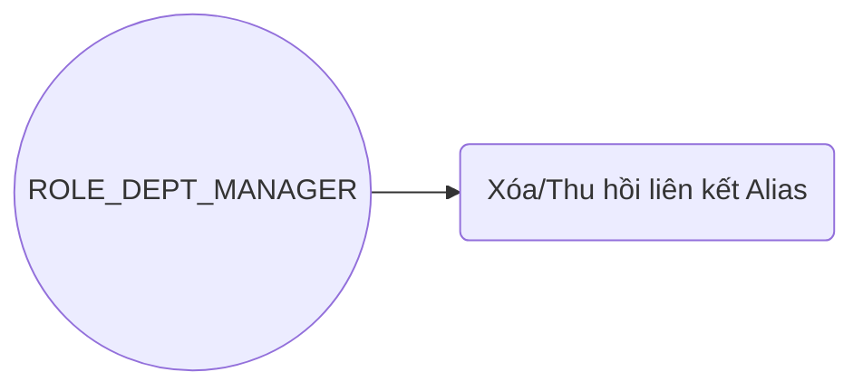

*   **Tác nhân**: `ROLE_DEPT_MANAGER`
*   **Mô tả**: Trưởng phòng ban sở hữu tài liệu gốc (phòng tạo Alias) tiến hành xóa mềm để thu hồi Alias đã chia sẻ.
*   **Kiểm soát quyền nghiêm ngặt**: Chỉ Trưởng phòng của phòng ban tạo Alias (sở hữu tài liệu gốc) mới có quyền xóa mềm liên kết này. Phòng ban nhận Alias tuyệt đối không được phép tự ý xóa liên kết đã chia sẻ cho họ.
*   **Luồng sự kiện chính**:
    1. Trưởng phòng gửi yêu cầu xóa liên kết Alias.
    2. Hệ thống tìm bản ghi Alias và truy xuất tài liệu gốc liên quan, thực hiện khóa bi quan tài liệu gốc `FOR UPDATE`.
    3. Hệ thống kiểm tra quyền sở hữu của phòng ban hiện tại đối với tài liệu gốc (`original.ownerDepartmentId == currentUser.departmentId`). Nếu không khớp, từ chối và trả về lỗi `ERR_OWNERSHIP_VIOLATION` (404).
    4. Hệ thống gán trường `deleted_at` của Alias bằng thời điểm hiện tại và lưu trữ.

---

#### 3.2.9. UC-09: Đăng nhập hệ thống (System Login)

**Sơ đồ Usecase Chi tiết:**
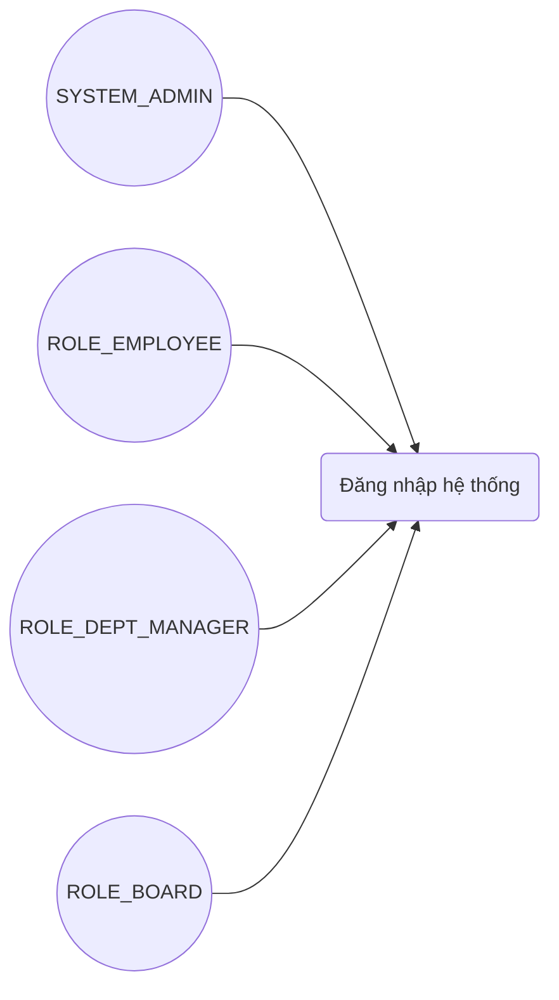

*   **Tác nhân**: Tất cả các vai trò người dùng (`SYSTEM_ADMIN`, `ROLE_EMPLOYEE`, `ROLE_DEPT_MANAGER`, `ROLE_BOARD`).
*   **Mô tả**: Người dùng xác thực thông tin tài khoản bằng tên đăng nhập và mật khẩu để lấy token truy cập JWT.
*   **Tiền điều kiện**: Người dùng đã được Admin khởi tạo tài khoản trong hệ thống.
*   **Hậu điều kiện**: Hệ thống cấp token JWT hợp lệ chứa thông tin định danh và quyền hạn của người dùng để truy cập các API tài liệu.
*   **Luồng sự kiện chính**:
    1. Người dùng gửi yêu cầu đăng nhập kèm `username` và `password`.
    2. Hệ thống kiểm tra dữ liệu đầu vào.
    3. Hệ thống truy xuất người dùng theo `username` trong CSDL.
    4. Hệ thống thực hiện đối khớp mật khẩu bằng thuật toán so sánh BCrypt.
    5. Hệ thống sinh JWT token chứa các thông tin: `username`, `role`, và `departmentId`.
    6. Hệ thống phản hồi mã thành công `200 OK` kèm JWT token.
*   **Ngoại lệ (Luồng lỗi)**:
    - Sai tên đăng nhập hoặc mật khẩu -> Trả về lỗi `ERR_UNAUTHENTICATED` (401 Unauthorized) với thông điệp bảo mật chung "Tên đăng nhập hoặc mật khẩu không chính xác".
    - Dữ liệu gửi lên rỗng hoặc sai định dạng DTO -> Trả về lỗi `VALIDATION_ERROR` (400).

---

## 4. Sơ đồ CSDL và Sơ đồ Lớp Hệ thống (Database Schema & System Class Diagrams)

### 4.1. Sơ đồ CSDL Chi tiết (Database Schema Diagram - ERD)

Sơ đồ mô tả chi tiết các bảng, các trường dữ liệu, kiểu dữ liệu, các ràng buộc khóa ngoại (Foreign Keys) và khóa chính (Primary Keys):

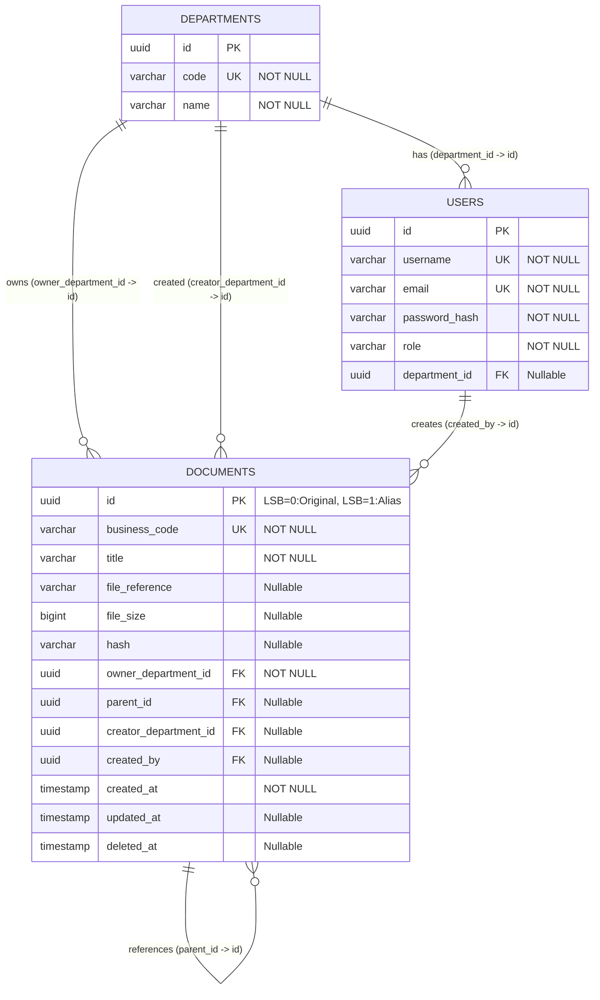

### 4.2. Sơ đồ Lớp Hệ thống Chi tiết (Detailed System Class Diagram)

Sơ đồ thể hiện toàn bộ các lớp thiết kế trong hệ thống bao gồm các lớp Thực thể (Entities), Controller tiếp nhận API, Service thực thi logic nghiệp vụ, Validator kiểm tra quyền hạn, các interface Repository tương tác dữ liệu và mối liên kết phụ thuộc giữa chúng:

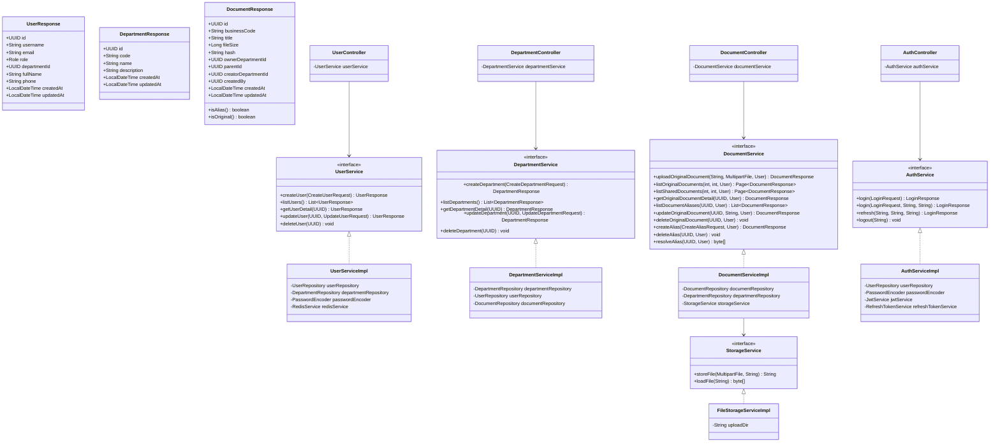

---

## 5. Thiết kế Thực thể chi tiết (Entity Specifications)

### 5.1. Bảng `departments`
*   `id`: UUID (Khóa chính, tự động sinh).
*   `code`: VARCHAR(50) (Unique Index, NOT NULL) - Mã phòng ban viết hoa (HR, FINANCE, R&D, BOARD).
*   `name`: VARCHAR(100) (NOT NULL) - Tên đầy đủ của phòng ban.

### 5.2. Bảng `users`
*   `id`: UUID (Khóa chính, tự động sinh).
*   `username`: VARCHAR(50) (Unique Index, NOT NULL).
*   `email`: VARCHAR(100) (Unique Index, NOT NULL).
*   `password_hash`: VARCHAR(255) (NOT NULL).
*   `role`: VARCHAR(50) (NOT NULL) - Luu ten Vai tro nguoi dung duoi dang chuoi (Enum).
*   `department_id`: UUID (Khoa ngoai tro den departments.id, Nullable) - Bat buoc phai la NULL doi voi tai khoan SYSTEM_ADMIN, bat buoc phai NOT NULL doi voi cac vai tro nguoi dung nghiep vu con lai (dam bao boi rang buoc chk_user_department_integrity).

### 5.3. Bảng `documents`
*   `id`: UUID (Khóa chính) - Nhúng loại tài liệu vào Least Significant Bit (LSB) của UUID:
    - Tài liệu gốc (Original): LSB = `0`.
    - Tài liệu liên kết (Alias): LSB = `1`.
    - Nhận dạng loại tài liệu nhanh chóng ở RAM bằng phép toán dịch/kiểm tra bitwise trên LSB của UUID.
*   `business_code`: VARCHAR(50) (Unique Index, NOT NULL) - Mã nghiệp vụ duy nhất của tài liệu.
    - *Làm rõ quyết định thiết kế*: Vì trường này có ràng buộc `UNIQUE` và `NOT NULL`, cả tài liệu gốc (Original) và tài liệu liên kết (Alias) đều bắt buộc phải sở hữu một mã nghiệp vụ riêng biệt và duy nhất.
    - *Mục đích nghiệp vụ đối với Original*: Định dạng `ORIG_xxxxxx`, dùng làm mã số định danh lưu trữ hồ sơ, lập danh mục nghiệp vụ vật lý và phục vụ công tác đối soát, kiểm toán nội bộ của phòng ban sở hữu gốc.
    - *Mục đích nghiệp vụ đối với Alias*: Định dạng `ALIA_xxxxxx`. Alias không sử dụng chung mã của tài liệu gốc vì:
      1. **Bảo mật và Che giấu thông tin**: Tránh lộ cấu trúc danh mục và mã lưu trữ nội bộ của phòng ban gốc cho phòng ban nhận Alias.
      2. **Khớp nối quy trình phòng nhận**: Cho phép phòng ban nhận tự phân loại, quản lý và tham chiếu tài liệu được chia sẻ như một tài sản thông tin riêng biệt phù hợp với quy trình và hệ thống lưu trữ nội bộ của họ.
      3. **Tránh vi phạm ràng buộc CSDL**: Đảm bảo không bị trùng khóa duy nhất (Unique Key) trên bảng `documents` khi lưu trữ tập trung.
*   `file_reference`: VARCHAR(500) (Nullable) - Đường dẫn vật lý trên Object Storage. Bắt buộc có giá trị đối với tài liệu gốc để truy xuất file; bắt buộc phải là NULL đối với Alias để tránh nhân bản dữ liệu lưu trữ.
*   `file_size`: BIGINT (Nullable) - Dung lượng file (chỉ lưu ở tài liệu gốc).
*   `hash`: VARCHAR(64) (Nullable) - SHA-256 hash của tệp tin (chỉ lưu ở tài liệu gốc).
*   `owner_department_id`: UUID (Khóa ngoại trỏ đến `departments.id`, NOT NULL)
    - Đối với tài liệu gốc: Phòng ban tải lên và sở hữu file.
    - Đối với Alias: Phòng ban nhận được chia sẻ.
*   `parent_id`: UUID (Khóa ngoại tự liên kết đến `documents.id`, Nullable, updatable = false) - ID tài liệu gốc tương ứng. Khóa cứng bất biến khi tạo.
*   `creator_department_id`: UUID (Khóa ngoại trỏ đến `departments.id`, Nullable, updatable = false) - Trường phi chuẩn hóa (Denormalization) lưu phòng ban tạo ra Alias (phòng sở hữu tài liệu gốc).
    - *Lý do phi chuẩn hóa*: Nhằm tối ưu hóa hiệu năng truy vấn của Hibernate Filter. Nếu không phi chuẩn hóa trường này, khi kiểm tra quyền truy cập Alias của phòng ban gửi (chủ sở hữu), hệ thống bắt buộc phải thực hiện phép JOIN hoặc chạy một Subquery lồng nhau tới bảng gốc (`parent_id`) để xác định phòng ban sở hữu gốc. Bằng việc phi chuẩn hóa `creator_department_id`, câu lệnh SQL lọc tự động của Hibernate Filter giảm thiểu độ phức tạp xuống mức tối đa (chỉ so sánh trực tiếp trên trường của bản ghi hiện tại), loại bỏ hoàn toàn JOIN/subquery đệ quy khi Resolve Alias.
    - *Cơ chế đảm bảo nhất quán*: Dữ liệu phi chuẩn hóa này được đảm bảo nhất quán tuyệt đối 100% nhờ vào hai yếu tố cốt lõi:
      1. **Tính bất biến của quyền sở hữu gốc**: Theo Quy tắc Nghiệp vụ BR-09, phòng ban sở hữu tài liệu gốc là cố định và bất biến từ thời điểm tải lên, không bao giờ thay đổi (kể cả khi nhân viên tạo tài liệu luân chuyển phòng ban hoặc nghỉ việc).
      2. **Tính bất biến của liên kết Alias**: Trường `creator_department_id` chỉ được gán một lần duy nhất lúc tạo Alias (lấy giá trị từ `original.ownerDepartmentId`) và được cấu hình `updatable = false` ở thực thể Hibernate, đồng thời API không cung cấp bất kỳ chức năng chỉnh sửa nào đối với trường này. Do đó, không bao giờ xảy ra hiện tượng lệch dữ liệu (data drift) giữa Alias và tài liệu gốc.
*   `created_by`: UUID (Khóa ngoại trỏ đến `users.id`, Nullable).
*   `created_at`: TIMESTAMP (NOT NULL).
*   `updated_at`: TIMESTAMP (Nullable).
*   `deleted_at`: TIMESTAMP (Nullable) - Thời điểm xóa mềm.

### 5.4. Ràng buộc và Chỉ mục CSDL (Database Constraints & Indexes)
1.  **Ràng buộc toàn vẹn cấu trúc loại tài liệu (chk_document_type_integrity)**: Đây là chốt chặn cứng ở mức CSDL sử dụng CHECK constraints để đảm bảo dữ liệu không bao giờ rơi vào trạng thái sai cấu trúc nghiệp vụ (ví dụ: tài liệu gốc nhưng thiếu file, hoặc Alias nhưng lại chứa link file vật lý):
    - Original: parent_id IS NULL AND file_reference IS NOT NULL AND creator_department_id IS NULL.
    - Alias: parent_id IS NOT NULL AND file_reference IS NULL AND creator_department_id IS NOT NULL.
2.  **Ràng buộc phòng ban người dùng (chk_user_department_integrity)**: Chốt chặn cứng ở mức CSDL sử dụng CHECK constraints đảm bảo tài khoản quản trị hệ thống không thuộc phòng ban nào và các người dùng nghiệp vụ khác bắt buộc phải thuộc phòng ban:
    - SYSTEM_ADMIN: department_id IS NULL.
    - Khác: department_id IS NOT NULL.
3.  **Kiểm soát loại ID ở tầng Ứng dụng**: Khi sinh ID, hệ thống tự động thiết lập bit cuối của UUID LSB bằng 0 cho tài liệu gốc và bằng 1 cho Alias. Việc xác định loại tài liệu được thực hiện trên RAM bằng hàm dịch/kiểm tra bit.
4.  **Chỉ mục duy nhất Alias hoạt động (uq_active_alias_per_dept)**: Unique index trên bộ ba (parent_id, owner_department_id) với điều kiện parent_id IS NOT NULL AND deleted_at IS NULL để đảm bảo mỗi phòng ban chỉ nhận tối đa 1 Alias từ cùng một tài liệu gốc đang hoạt động.
5.  **Chỉ mục tối ưu hóa Hibernate Filter (idx_doc_owner_dept & idx_doc_creator_dept)**: Index thường trên cột owner_department_id và creator_department_id để tăng tốc độ truy vấn lọc tự động chéo phòng ban.

### 5.5. Định nghĩa Bộ lọc Tự động và Đánh giá Hiệu năng (Hibernate Filter)
Hệ thống kích hoạt tự động bộ lọc `deptIsolationFilter` trên thực thể `Document` đối với mọi truy vấn JPA.
*   **Logic Điều kiện:**
    `owner_department_id = :userDeptId OR creator_department_id = :userDeptId OR (parent_id IS NULL AND id IN (SELECT parent_id FROM documents WHERE owner_department_id = :userDeptId AND parent_id IS NOT NULL AND deleted_at IS NULL))`

#### Đánh giá Hiệu năng (Performance Assessment)
*   **Tác động Hiệu năng của điều kiện OR + IN (subquery)**: 
    - Phép toán `OR` kết hợp với toán tử `IN` chứa câu truy vấn con tự liên kết (`self-referencing subquery`) là một thách thức đối với bộ tối ưu hóa truy vấn (Query Planner) của PostgreSQL khi kích thước dữ liệu tăng cao.
    - Với điều kiện `OR`, Query Planner thường gặp khó khăn trong việc kết hợp hiệu quả nhiều chỉ mục khác nhau. Thay vì sử dụng Index Scan tốc độ cao, hệ thống có thể chuyển sang quét toàn bộ bảng (Seq Scan) hoặc sử dụng Bitmap Index Scan rồi kết hợp kết quả bằng BitmapOr.
    - Toán tử `IN (subquery)` yêu cầu PostgreSQL thực hiện một câu truy vấn con để tìm tất cả các ID tài liệu gốc được Alias chia sẻ cho phòng ban hiện tại. Khi số lượng Alias tăng lên, chi phí thực thi truy vấn con này và so khớp đệ quy sẽ tăng tuyến tính. Tuy nhiên, đối với quy mô và yêu cầu hiện tại của hệ thống, cơ chế Hibernate Filter vẫn đáp ứng hoàn hảo và hoạt động ổn định.

---

## 6. Thiết kế REST API (REST API Design)

Mọi REST API phản hồi trong hệ thống đều sử dụng cấu trúc đóng gói dữ liệu thống nhất (Success Envelope / Error Envelope) và trả về các mã lỗi nghiệp vụ chuẩn hóa tại gói `common.error`.

### 6.1. API Endpoints

#### 6.1.1. Tải lên tài liệu gốc (Upload Original Document)
*   **URI**: `/api/v1/original-documents` | **Method**: `POST`
*   **Quyền**: `ROLE_EMPLOYEE`, `ROLE_DEPT_MANAGER` hoặc `ROLE_BOARD`.
*   **Lưu ý**: `ownerDepartmentId` tự động lấy từ JWT xác thực.

#### 6.1.2. Danh sách tài liệu gốc (List Original Documents)
*   **URI**: `/api/v1/original-documents` | **Method**: `GET`
*   **Lọc dữ liệu**: Chỉ trả về các bản ghi tài liệu gốc thuộc bộ phận nội bộ của người dùng hiện tại (`owner_department_id = currentUser.departmentId` và `parent_id IS NULL`). Các tài liệu gốc của bộ phận khác sẽ không xuất hiện trong danh sách này.

#### 6.1.3. Xem chi tiết tài liệu gốc (Get Original Document Detail)
*   **URI**: `/api/v1/original-documents/{id}` | **Method**: `GET`
*   **Kiểm soát quyền nghiêm ngặt**: Chỉ phòng ban sở hữu hoặc phòng ban nhận Alias đang hoạt động mới được gọi API. Mọi phòng ban khác cố truy cập sẽ nhận lỗi `ERR_DOCUMENT_NOT_FOUND` (404) để che giấu dữ liệu.

#### 6.1.4. Xóa tài liệu gốc (Delete Original Document)
*   **URI**: `/api/v1/original-documents/{id}` | **Method**: `DELETE`
*   **Quyền**: Chỉ vai trò `ROLE_DEPT_MANAGER` (đối với phòng nghiệp vụ) hoặc `ROLE_BOARD` (đối với phòng BOARD) sở hữu tài liệu tương ứng. Thực hiện xóa mềm lan truyền.

#### 6.1.5. Tạo liên kết chia sẻ Alias (Create Alias Document)
*   **URI**: `/api/v1/alias-documents` | **Method**: `POST`
*   **Quyền**: Chỉ `ROLE_EMPLOYEE` hoặc `ROLE_DEPT_MANAGER` thuộc phòng ban thực tế sở hữu tài liệu gốc (`owner_department_id == currentUser.departmentId`) mới được phép gọi. Nghiêm cấm tạo Alias cho tài liệu thuộc sở hữu của phòng ban khác.

#### 6.1.6. Giải quyết Alias để xem tài liệu (Resolve Alias Document)
*   **URI**: `/api/v1/alias-documents/{id}` | **Method**: `GET`
*   **Kiểm soát quyền nghiêm ngặt**: Chỉ người dùng thuộc phòng ban nhận Alias (`alias.ownerDepartmentId == currentUser.departmentId`) HOẶC phòng ban tạo Alias (`alias.creatorDepartmentId == currentUser.departmentId`) mới được quyền gọi API này để lấy thông tin tệp gốc. Phòng ban khác gọi API sẽ nhận lỗi `ERR_DOCUMENT_NOT_FOUND` (404).

#### 6.1.7. Xóa liên kết Alias (Delete Alias Document)
*   **URI**: `/api/v1/alias-documents/{id}` | **Method**: `DELETE`
*   **Quyền**: Chỉ `ROLE_DEPT_MANAGER` của phòng ban sở hữu tài liệu gốc (phòng tạo Alias) mới được xóa mềm Alias. Phòng ban nhận không được phép xóa (bị chặn và trả về lỗi `ERR_OWNERSHIP_VIOLATION` / 404).

#### 6.1.8. Quản lý Người dùng và Phòng ban (Admin)
*   `POST /api/v1/users` (Tạo tài khoản người dùng mới).
*   `GET /api/v1/users` (Lấy danh sách người dùng).
*   `POST /api/v1/departments` (Tạo phòng ban mới).
*   `GET /api/v1/departments` (Lấy danh sách phòng ban).

#### 6.1.9. Đăng nhập hệ thống (System Login)
*   **URI**: `/api/v1/auth/login` | **Method**: `POST`
*   **Quyền**: Không yêu cầu xác thực (Public Endpoint).
*   **Cấu trúc Request Payload (Request DTO)**:
    - username: Tên đăng nhập (ví dụ: employee_01)
    - password: Mật khẩu (ví dụ: SecretPassword123)
*   **Cấu trúc Response Payload (Success Response DTO)**:
    - success: true
    - code: SUCCESS
    - timestamp: ISO-8601 UTC timestamp (ví dụ: 2026-06-26T16:30:00.000Z)
    - data:
        - accessToken: Chuỗi JWT Access Token (hiệu lực 15 phút)
        - tokenType: Bearer
        - expiresIn: 900 (giây)
        - refreshToken: Chuỗi JWT Refresh Token (hiệu lực 7 ngày)
        - refreshTokenExpiresIn: 604800 (giây)
        - userInfo: Thông tin tài khoản đăng nhập (id, username, email, role, departmentId)

---

## 7. Biểu đồ Tuần tự (Sequence Diagrams)

### 7.1. Tạo Phòng ban mới (Create Department)
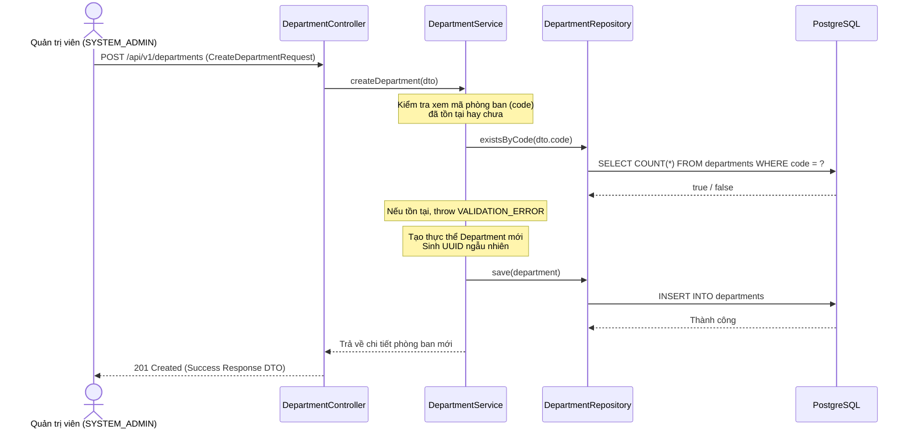

### 7.2. Tạo Người dùng mới (Create User)
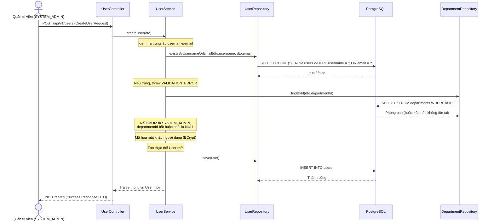

### 7.3. Tải lên tài liệu gốc (Upload Original Document)
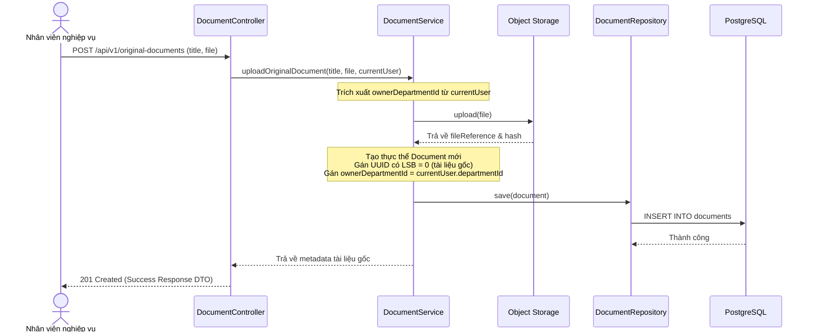

### 7.4. Xóa mềm tài liệu gốc (Cascade Soft Delete)
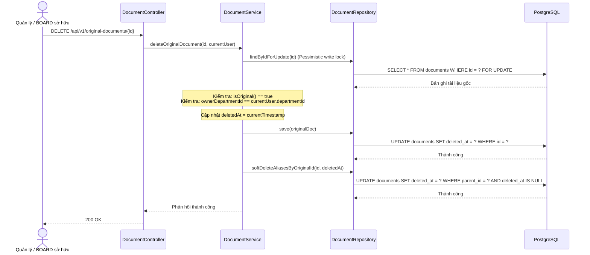

### 7.5. Tạo liên kết chia sẻ Alias (Create Alias)
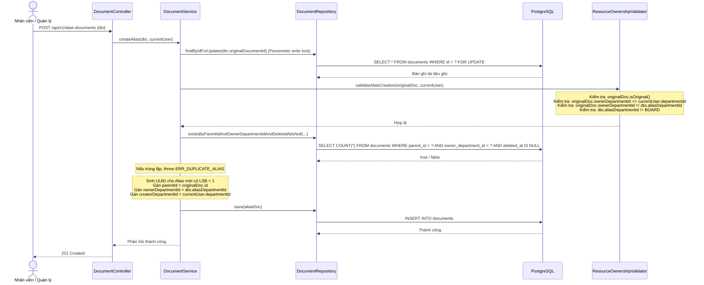

### 7.6. Giải quyết Alias để xem tài liệu (Resolve Alias)
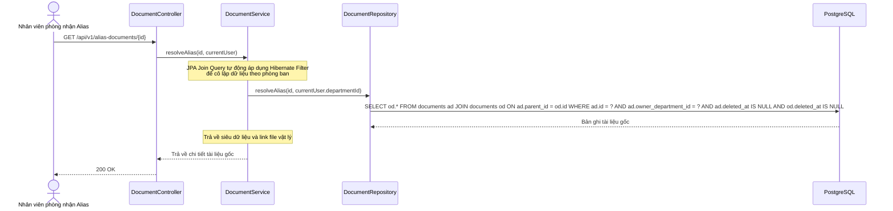

### 7.7. Xóa liên kết Alias (Delete Alias)
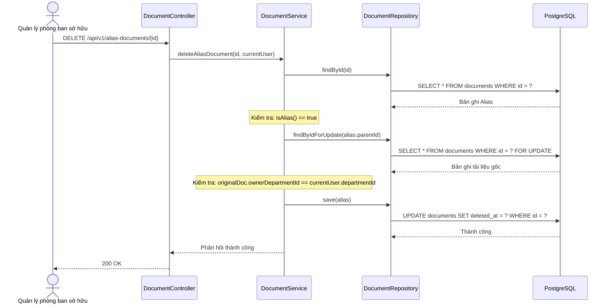

---

### 7.8. Đăng nhập hệ thống (System Login)
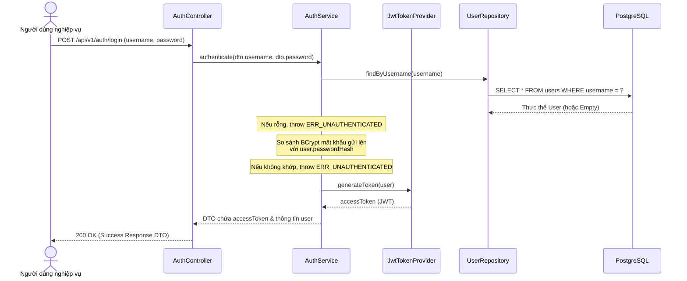

---
## 8. Thiết kế Tầng Truy cập Dữ liệu & Nghiệp vụ (Repository & Service Design)

### 8.1. Thiết kế Lớp Tầng Service và Repository (Class Diagram)
Sơ đồ lớp dưới đây mô tả mối quan hệ, các phương thức và kiểu dữ liệu trao đổi giữa các lớp:

```mermaid
classDiagram
    class UserResponse {
        +UUID id
        +String username
        +String email
        +Role role
        +UUID departmentId
        +String fullName
        +String phone
        +LocalDateTime createdAt
        +LocalDateTime updatedAt
    }
    class DepartmentResponse {
        +UUID id
        +String code
        +String name
        +String description
        +LocalDateTime createdAt
        +LocalDateTime updatedAt
    }
    class DocumentResponse {
        +UUID id
        +String businessCode
        +String title
        +Long fileSize
        +String hash
        +UUID ownerDepartmentId
        +UUID parentId
        +UUID creatorDepartmentId
        +UUID createdBy
        +LocalDateTime createdAt
        +LocalDateTime updatedAt
        +isAlias() boolean
        +isOriginal() boolean
    }

    class UserService {
        <<interface>>
        +createUser(CreateUserRequest) UserResponse
        +listUsers() List~UserResponse~
        +getUserDetail(UUID) UserResponse
        +updateUser(UUID, UpdateUserRequest) UserResponse
        +deleteUser(UUID) void
    }
    class UserServiceImpl {
        -UserRepository userRepository
        -DepartmentRepository departmentRepository
        -PasswordEncoder passwordEncoder
        -RedisService redisService
    }
    UserService <|.. UserServiceImpl

    class DepartmentService {
        <<interface>>
        +createDepartment(CreateDepartmentRequest) DepartmentResponse
        +listDepartments() List~DepartmentResponse~
        +getDepartmentDetail(UUID) DepartmentResponse
        +updateDepartment(UUID, UpdateDepartmentRequest) DepartmentResponse
        +deleteDepartment(UUID) void
    }
    class DepartmentServiceImpl {
        -DepartmentRepository departmentRepository
        -UserRepository userRepository
        -DocumentRepository documentRepository
    }
    DepartmentService <|.. DepartmentServiceImpl

    class DocumentService {
        <<interface>>
        +uploadOriginalDocument(String, MultipartFile, User) DocumentResponse
        +listOriginalDocuments(int, int, User) Page~DocumentResponse~
        +listSharedDocuments(int, int, User) Page~DocumentResponse~
        +getOriginalDocumentDetail(UUID, User) DocumentResponse
        +listDocumentAliases(UUID, User) List~DocumentResponse~
        +updateOriginalDocument(UUID, String, User) DocumentResponse
        +deleteOriginalDocument(UUID, User) void
        +createAlias(CreateAliasRequest, User) DocumentResponse
        +deleteAlias(UUID, User) void
        +resolveAlias(UUID, User) byte[]
    }
    class DocumentServiceImpl {
        -DocumentRepository documentRepository
        -DepartmentRepository departmentRepository
        -StorageService storageService
    }
    DocumentService <|.. DocumentServiceImpl

    class StorageService {
        <<interface>>
        +storeFile(MultipartFile, String) String
        +loadFile(String) byte[]
    }
    class FileStorageServiceImpl {
        -String uploadDir
    }
    StorageService <|.. FileStorageServiceImpl

    class AuthService {
        <<interface>>
        +login(LoginRequest) LoginResponse
        +login(LoginRequest, String, String) LoginResponse
        +refresh(String, String, String) LoginResponse
        +logout(String) void
    }
    class AuthServiceImpl {
        -UserRepository userRepository
        -PasswordEncoder passwordEncoder
        -JwtService jwtService
        -RefreshTokenService refreshTokenService
    }
    AuthService <|.. AuthServiceImpl

    class DocumentController {
        -DocumentService documentService
    }
    class UserController {
        -UserService userService
    }
    class DepartmentController {
        -DepartmentService departmentService
    }
    class AuthController {
        -AuthService authService
    }

    DocumentController --> DocumentService
    UserController --> UserService
    DepartmentController --> DepartmentService
    AuthController --> AuthService
    DocumentServiceImpl --> StorageService
```

### 8.2. Mô tả các Phương thức Nghiệp vụ và Khóa Dữ liệu

#### `DocumentRepository`
*   `findByIdForUpdate(id)`: Lấy bản ghi tài liệu gốc kèm theo cơ chế Khóa ghi bi quan (`PESSIMISTIC_WRITE`) để ngăn race condition.
*   `existsByParentIdAndOwnerDepartmentIdAndDeletedAtIsNull(parentId, ownerDeptId)`: Kiểm tra sự tồn tại của Alias hoạt động để thực thi ràng buộc giới hạn 1 Alias hoạt động cho mỗi bộ phận nhận.
*   `resolveAlias(aliasId, userDeptId)`: Thực hiện truy vấn liên kết lấy thông tin tệp tin gốc nếu phòng ban gửi yêu cầu trùng khớp với `ownerDepartmentId` của Alias.
*   `softDeleteAliasesByOriginalId(originalId, deletedAt)`: Thực hiện cập nhật hàng loạt trạng thái xóa mềm cho toàn bộ Alias trỏ tới tài liệu gốc đã bị xóa.

---

## 8. Quy tắc Xác thực Nghiệp vụ (Validation Rules)

1.  **Ranh giới BOARD (BOARD Boundary Rule):** Hệ thống từ chối mọi yêu cầu tạo Alias đối với tài liệu gốc thuộc sở hữu của phòng ban `BOARD`. Thành viên phòng `BOARD` cũng bị cấm tạo hoặc nhận Alias chéo phòng ban dưới mọi hình thức.
2.  **Xác thực Quyền sở hữu (Ownership Validation Rule):** Khi tạo Alias, hệ thống bắt buộc kiểm tra phòng ban của người dùng hiện tại phải trùng khớp với phòng ban sở hữu tài liệu gốc (`currentUser.departmentId == originalDocument.ownerDepartmentId`). Nếu không khớp, hệ thống ném ra ngoại lệ vi phạm quyền sở hữu.
3.  **Cấm Alias nối tiếp (Anti-Chaining Rule - Chống giả mạo tầng ứng dụng)**: Hệ thống nghiêm cấm tạo Alias trỏ tới một Alias khác.
    *   *Bản chất nghiệp vụ (Business Rule)*: Đây là một quy tắc nghiệp vụ cốt lõi (Business Rule) được kiểm soát nghiêm ngặt trước khi tạo Alias. Một tài liệu liên kết (Alias) chỉ được phép trỏ trực tiếp đến tài liệu gốc (Original Document), không được phép tạo liên kết bắc cầu (Alias trỏ tới Alias) để tránh tạo ra các chuỗi liên kết mồ côi phức tạp và khó kiểm soát quyền truy cập.
    *   *Ràng buộc thực thi nghiêm ngặt*: Quy tắc này không dựa vào bất kỳ trường phân loại nào do Client gửi lên trong request payload (để phòng tránh triệt để tấn công giả mạo tham số - Parameter Tampering). Khi nhận yêu cầu tạo Alias kèm ID tài liệu mục tiêu, tầng Service bắt buộc phải:
        1. Truy vấn thực thể tài liệu từ CSDL dựa trên ID đáng tin cậy.
        2. Kiểm tra thuộc tính `parentId` của thực thể vừa truy vấn từ CSDL. Nếu `parentId IS NOT NULL`, hệ thống từ chối ngay lập tức.
        3. Kết hợp kiểm tra bit cuối LSB của UUID thực thể từ CSDL để đảm bảo LSB = `0` (Original).
        Việc xác thực này được thực hiện hoàn toàn ở phía máy chủ bằng dữ liệu nghiệp vụ tin cậy được truy xuất trực tiếp từ CSDL, đảm bảo tính toàn vẹn tuyệt đối.
4.  **Cấm tự chia sẻ (No Self-Sharing Rule):** Phòng ban nhận Alias phải khác với phòng ban sở hữu tài liệu gốc hiện tại.
5.  **Giới hạn Định dạng File (File Whitelist Rule):** Chỉ chấp nhận các tệp tải lên có phần mở rộng và MIME type hợp lệ: `.pdf`, `.docx`, `.xlsx`, `.pptx`. Dung lượng tối đa được cấu hình cứng là **50MB**.
6.  **Quy tắc Điều hướng Gọi thẳng Tối ưu hóa (Fast-Path Routing Rule):** Dựa trên đặc thù phân bổ tài nguyên của hệ thống (99% tài nguyên là tài liệu gốc, chỉ 1% là Alias), hệ thống tối ưu hóa luồng xử lý bằng cách kiểm tra nhanh bit cuối của ID tài liệu:
    - Nếu bit cuối (LSB) = `0` (Original - chiếm 99% trường hợp): Điều hướng và gọi trực tiếp vào bộ xử lý tài liệu gốc chuyên biệt (`OriginalDocumentProcessor`) mà không chạy qua các logic phân giải Alias hay kiểm tra DB chéo phòng ban.
    - Nếu bit cuối (LSB) = `1` (Alias - chiếm 1% trường hợp): Điều hướng và gọi trực tiếp vào bộ xử lý phân giải liên kết (`AliasDocumentProcessor`).
7.  **Cấm xóa SYSTEM_ADMIN (System Admin Deletion Restriction):** Hệ thống chặn hoàn toàn mọi yêu cầu xóa tài khoản có vai trò `SYSTEM_ADMIN` để đảm bảo tính sẵn sàng và tính vẹn toàn tối cao của việc quản trị hệ thống.

---

## 9. Xử lý Lỗi và Mã lỗi Nghiệp vụ (Error Handling & ErrorCodes)

Hệ thống quản lý lỗi tập trung thông qua bộ xử lý lỗi toàn cục (`GlobalExceptionHandler`). Khi xảy ra lỗi nghiệp vụ, hệ thống trả về mã trạng thái HTTP thích hợp kèm mã lỗi nghiệp vụ cụ thể:

| Mã lỗi Nghiệp vụ (`code`) | HTTP Status | Thông điệp hiển thị | Nguyên nhân |
| :--- | :--- | :--- | :--- |
| `ERR_UNAUTHENTICATED` | 401 Unauthorized | Phiên đăng nhập hết hạn hoặc không hợp lệ. | JWT token bị sai, hết hạn, hoặc thiếu cấu trúc. |
| `ERR_OWNERSHIP_VIOLATION`| 404 Not Found | Tài liệu yêu cầu không tồn tại. | Người dùng truy cập tài liệu chéo phòng ban không thuộc sở hữu (che giấu sự tồn tại để bảo mật). |
| `ERR_FORBIDDEN_ROLE`  | 403 Forbidden | Bạn không có quyền thực hiện hành động này. | Người dùng gọi API không đúng vai trò cho phép. |
| `ERR_BOARD_PROTECTION` | 400 Bad Request| Cấm tạo liên kết Alias đối với tài liệu của phòng BOARD. | Cố tình tạo Alias cho tài liệu bảo mật của BOARD. |
| `ERR_DUPLICATE_ALIAS` | 400 Bad Request| Phòng ban nhận đã nhận một liên kết đang hoạt động từ tài liệu này. | Vi phạm ràng buộc duy nhất 1 Alias hoạt động của phòng ban nhận. |
| `ERR_DOCUMENT_NOT_FOUND` | 404 Not Found | Tài liệu yêu cầu không tồn tại. | Không tìm thấy tài liệu gốc hoặc Alias hoạt động. |
| `VALIDATION_ERROR` | 400 Bad Request| Dữ liệu không hợp lệ. | Vi phạm kiểm tra dữ liệu đầu vào DTO. |
| `ERR_SYSTEM_ERROR` | 500 Internal | Lỗi hệ thống bất ngờ. | Lỗi kết nối DB, lỗi runtime không mong muốn. |

---

## 10. Logic Nghiệp vụ Chi tiết (Detailed Business Logic)

### 10.1. Luồng Lan truyền xóa mềm (Cascade Soft Delete)
1.  **Bước 1**: Nhận yêu cầu xóa tài liệu gốc từ Quản lý phòng ban sở hữu hoặc thành viên BOARD sở hữu.
2.  **Bước 2**: Thực hiện tìm kiếm tài liệu gốc và khóa bản ghi bằng khóa bi quan `PESSIMISTIC_WRITE` (`FOR UPDATE`) dưới cơ sở dữ liệu để chặn mọi yêu cầu tạo Alias chéo phòng ban song song.
3.  **Bước 3**: Xác thực thực thể tìm được có phải tài liệu gốc hay không (LSB = 0) và thuộc quyền sở hữu của phòng ban người dùng hiện tại không (`currentUser.departmentId == original.ownerDepartmentId`). Nếu không thỏa mãn, ném lỗi `ERR_DOCUMENT_NOT_FOUND` (404) để bảo mật.
4.  **Bước 4**: Cập nhật thuộc tính thời gian xóa mềm (`deleted_at`) bằng thời gian hệ thống hiện tại và thực hiện lưu bản ghi tài liệu gốc.
5.  **Bước 5**: Gọi phương thức Repository cập nhật đồng loạt trạng thái xóa mềm (`deleted_at`) cho toàn bộ Alias trỏ tới tài liệu gốc này (`parent_id` bằng ID tài liệu gốc và `deleted_at` đang NULL).

### 10.2. Luồng Xóa liên kết Alias
1.  **Bước 1**: Nhận yêu cầu xóa Alias từ Quản lý phòng ban sở hữu tài liệu gốc (phòng ban tạo Alias).
2.  **Bước 2**: Tìm bản ghi Alias nghiệp vụ theo ID. Xác thực thực thể đó là Alias (LSB = 1), nếu không ném lỗi không tìm thấy tài liệu.
3.  **Bước 3**: Tìm bản ghi tài liệu gốc liên quan (`parent_id`) và khóa bản ghi bằng khóa bi quan `PESSIMISTIC_WRITE` để tránh xung đột dữ liệu.
4.  **Bước 4**: Kiểm tra phòng ban người dùng hiện tại có trùng với phòng ban sở hữu tài liệu gốc đó không (`original.ownerDepartmentId == currentUser.departmentId`). Chỉ cho phép phòng ban sở hữu tài liệu gốc thực hiện xóa Alias đã tạo. Nếu không khớp, ném lỗi `ERR_OWNERSHIP_VIOLATION` (404).
5.  **Bước 5**: Gán thuộc tính xóa mềm (`deleted_at`) cho bản ghi Alias bằng thời gian hiện tại và thực hiện lưu trữ.

### 10.3. Luồng Tạo liên kết chia sẻ Alias
1.  **Bước 1**: Nhận yêu cầu tạo Alias từ nhân viên/quản lý phòng ban sở hữu tài liệu gốc.
2.  **Bước 2**: Khóa tài liệu gốc bằng khóa bi quan ghi `PESSIMISTIC_WRITE` để ngăn chặn tranh chấp dữ liệu khi tài liệu gốc bị xóa đồng thời từ luồng khác.
3.  **Bước 3**: Xác thực tài liệu gốc thuộc sở hữu của phòng ban người dùng nghiệp vụ hiện tại. Kiểm tra tài liệu gốc có phải Original không (LSB = 0), cấm tạo Alias cho Alias.
4.  **Bước 4**: Kiểm tra phòng ban nhận không được trùng với phòng ban sở hữu tài liệu gốc hiện tại (không tự chia sẻ cho chính mình). Kiểm tra phòng ban nhận không được là phòng ban `BOARD`.
5.  **Bước 5**: Thực hiện kiểm tra xem phòng ban nhận đã có Alias hoạt động trỏ tới tài liệu gốc này hay chưa bằng cách kiểm tra sự tồn tại của Alias hoạt động dưới DB. Nếu có, ném lỗi trùng lặp Alias (`ERR_DUPLICATE_ALIAS`).
6.  **Bước 6**: Sinh mã UUID mới cho Alias và thiết lập bit cuối của LSB bằng 1. Gán các trường liên kết tương ứng: `parent_id` trỏ đến ID tài liệu gốc, `creator_department_id` bằng phòng ban người dùng tạo Alias, và `owner_department_id` bằng ID phòng ban nhận. Thiết lập các siêu dữ liệu và lưu thực thể Alias mới xuống DB.
