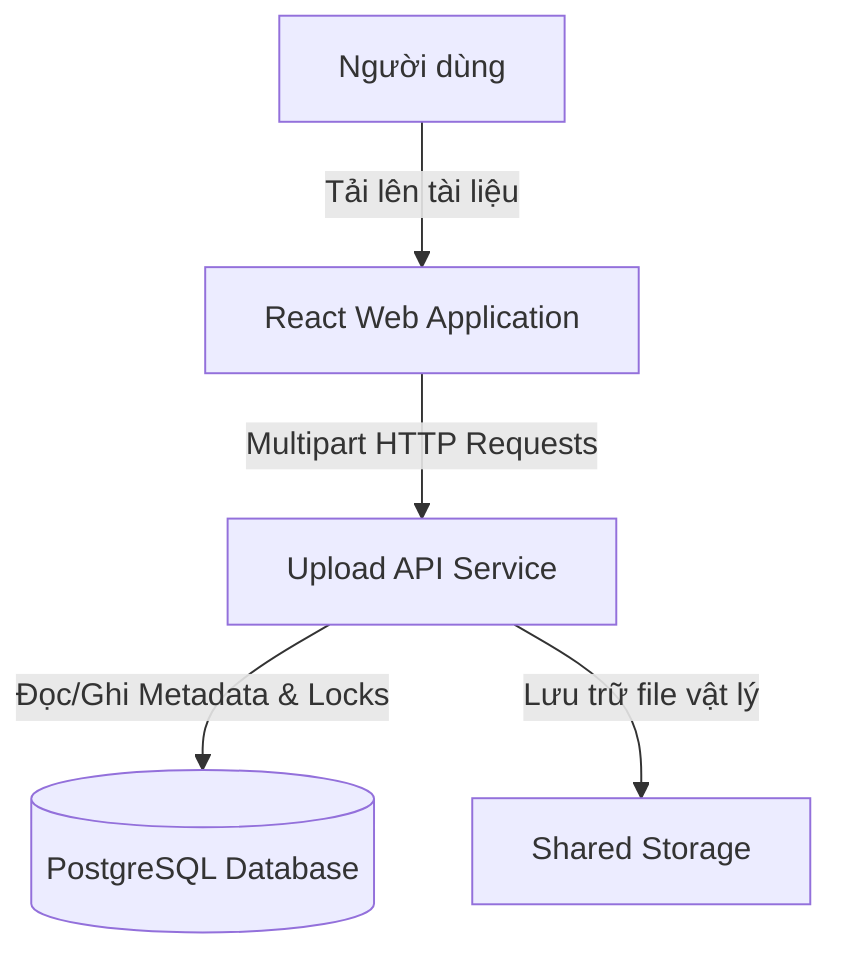
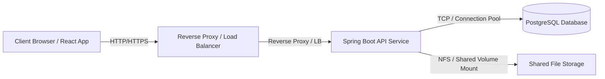
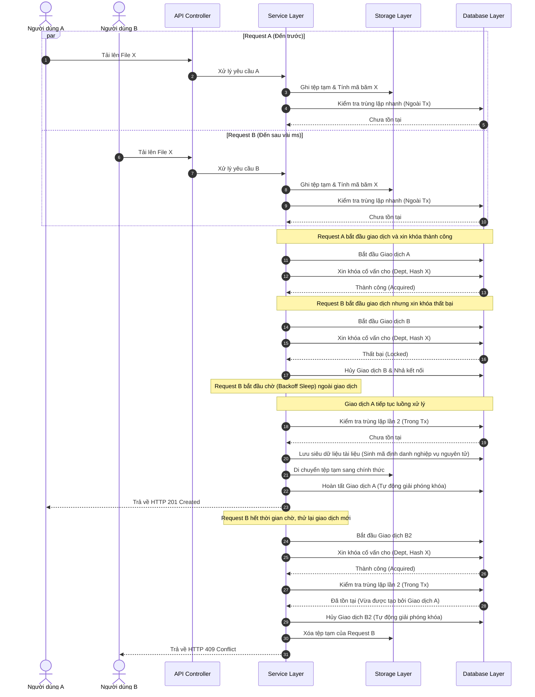

# Tài liệu Thiết kế Kiến trúc (Architecture Design) - Tuần 2
## Giải pháp Chống trùng lặp & Xử lý Ghi đồng thời

---

## 1. Sơ đồ Bối cảnh Hệ thống (Context Diagram)

Sơ đồ mô tả sự tương tác giữa tác nhân người dùng, giao diện ứng dụng và các thành phần chính của hệ thống trong môi trường vận hành:



---

## 2. Kiến trúc Triển khai (Deployment Architecture)

Sơ đồ mô tả cách phân bố vật lý/logic và mối quan hệ giữa các thành phần khi triển khai hệ thống:



### Mô tả các thành phần:
*   **Client**: Trình duyệt phía người dùng chạy ứng dụng React, gửi yêu cầu HTTP tải tệp.
*   **Reverse Proxy / Load Balancer**: Tiếp nhận yêu cầu từ client, điều phối tải và định tuyến yêu cầu HTTP đến các thực thể ứng dụng API Service phù hợp.
*   **Spring Boot API Service**: Thực thể ứng dụng xử lý logic nghiệp vụ, quản lý luồng tải lên và điều phối tài nguyên hệ thống.
*   **PostgreSQL Database**: Cơ sở dữ liệu quan hệ lưu trữ siêu dữ liệu (metadata) tài liệu và quản lý khóa cố vấn (Advisory Lock) để xử lý tranh chấp ghi đồng thời.
*   **Shared File Storage**: Phân vùng lưu trữ dùng chung giữa các thực thể ứng dụng API Service, cho phép lưu trữ tệp tin vật lý độc lập với thực thể xử lý.

---

## 3. Kiến trúc Phân lớp Component & Trách nhiệm (Component Architecture & Responsibilities)

Hệ thống áp dụng mô hình phân lớp kiến trúc (Layered Architecture) để tách biệt trách nhiệm giữa các thành phần nhận yêu cầu, xử lý nghiệp vụ, kiểm soát lưu trữ và cơ sở dữ liệu.

```text
┌────────────────────────────────────────────────────────────────────────┐
│                              Client Layer                              │
└───────────────────────────────────┬────────────────────────────────────┘
                                    │ HTTP Requests
                                    ▼
┌────────────────────────────────────────────────────────────────────────┐
│                        API Controller Component                        │
│ - Tiếp nhận luồng yêu cầu tải tệp (Multipart Stream).                  │
└───────────────────────────────────┬────────────────────────────────────┘
                                    │
                                    ▼
┌────────────────────────────────────────────────────────────────────────┐
│                         Service Layer Component                        │
│ - Điều phối luồng xử lý chính: nhận luồng dữ liệu, tính toán băm.      │
│ - Quản lý ranh giới giao dịch, khóa cố vấn và kiểm tra trùng lặp.      │
└─────────────────────┬─────────────────────────────┬────────────────────┘
                      │                             │
                      ▼                             ▼
┌─────────────────────────────┐             ┌────────────────────────────┐
│        Database Layer       │             │       Storage Layer        │
│ - Quản lý khóa cố vấn.      │             │ - Quản lý tệp vật lý.      │
│ - Đảm bảo ràng buộc duy nhất│             │ - Thực thi di chuyển tệp   │
│   và thực thi truy vấn.     │             │   nguyên tử cấp hệ thống.  │
└─────────────────────────────┘             └────────────────────────────┘
```

### Bảng Trách nhiệm Thành phần (Component Responsibility)

| Component | Responsibility |
| :--- | :--- |
| **API Controller** | Tiếp nhận yêu cầu HTTP từ Client, xử lý dữ liệu đầu vào dạng Multipart Stream và định tuyến đến tầng dịch vụ. |
| **Upload Service** | Điều phối toàn bộ quy trình tải lên (Upload Pipeline), quản lý luồng tính toán mã băm, kiểm soát ranh giới giao dịch và cơ chế thử lại. |
| **Storage Layer** | Quản lý tệp vật lý trên phân vùng lưu trữ dùng chung, xử lý việc ghi tệp tạm, di chuyển tệp nguyên tử và xóa bỏ tệp khi cần thiết. |
| **Database Layer** | Lưu trữ và bảo toàn siêu dữ liệu (metadata), thực thi khóa cố vấn (Advisory Lock) và bảo đảm các ràng buộc duy nhất của dữ liệu. |
| **Cleanup Job** | Tiến trình chạy ngầm định kỳ thực hiện quét và giải phóng các tài nguyên tệp tạm hết hạn hoặc các tệp vật lý mồ côi ngoài giờ cao điểm. |

---

## 4. Kiến trúc Runtime & Luồng Dữ liệu (Runtime View & Data Flow)

### 4.1. Sơ đồ Runtime Khái quát

```
Yêu cầu HTTP (Tải tệp)
       ↓
Quy trình Tải lên (Upload Pipeline)
       ↓
Kiểm tra Trùng lặp (Fast / Double Check)
       ↓
Giao dịch & Khóa (Transaction & Advisory Lock)
       ↓
Lưu trữ Vật lý & Metadata (Storage & Metadata Persist)
       ↓
Phản hồi kết quả (HTTP Response)
```

### 4.2. Chi tiết Quy trình Tải lên (Upload Pipeline)

Luồng xử lý tải lên tài liệu được chuẩn hóa thành một pipeline tuần tự gồm 10 giai đoạn để tối ưu hiệu năng và đảm bảo an toàn đồng thời:

1.  **Receive HTTP Stream**: Tiếp nhận luồng dữ liệu tải lên trực tiếp từ yêu cầu HTTP.
2.  **Write Temporary File + Compute SHA-256 (One-pass)**: Đọc luồng dữ liệu đầu vào và ghi trực tiếp vào một tệp tạm thời trên vùng đĩa dùng chung, đồng thời tính toán mã băm SHA-256 của nội dung tệp tin trong cùng một lượt đọc (One-pass) để tránh đọc lại luồng dữ liệu.
3.  **Validate Magic Bytes**: Sử dụng tệp tạm thời để xác thực cấu trúc byte nhận dạng (magic bytes) nhằm đảm bảo tệp tải lên hợp lệ về mặt định dạng.
4.  **Fast Duplicate Check**: Thực hiện kiểm tra nhanh sự tồn tại của tài liệu hoạt động cùng nội dung trong phòng ban ngoài phạm vi giao dịch. Nếu phát hiện đã tồn tại tài liệu, tệp tạm thời sẽ bị hủy ngay lập tức và hệ thống trả về lỗi trùng lặp mà không cần tạo giao dịch hay xin khóa.
5.  **Acquire Advisory Lock**: Thực hiện xin khóa cố vấn (Advisory Lock) cấp giao dịch của cơ sở dữ liệu dựa trên mã định danh phòng ban và mã băm của tệp tin. Deterministic Lock Key được tạo từ Department và File Hash. Quá trình này được thực hiện thông qua một vòng lặp thử lại với thời gian chờ tăng dần nằm ngoài phạm vi giao dịch để tránh chiếm dụng kết nối.
6.  **Double Duplicate Check**: Sau khi lấy khóa thành công và đi vào phạm vi giao dịch, thực hiện kiểm tra lại trạng thái tài liệu để phòng ngừa trường hợp có yêu cầu chạy song song vừa ghi nhận thành công tài liệu trong lúc yêu cầu này đang chờ khóa.
7.  **Persist Metadata**: Lưu thông tin siêu dữ liệu (metadata) của tài liệu vào cơ sở dữ liệu, sử dụng mã định danh nghiệp vụ được sinh nguyên tử bởi cơ sở dữ liệu để bảo đảm tính duy nhất và an toàn.
8.  **Move Physical File**: Thực hiện di chuyển tệp tạm thời sang thư mục lưu trữ chính thức bằng thao tác đổi tên nguyên tử ở cấp hệ điều hành (Atomic OS Rename). Nếu tệp vật lý tương ứng đã tồn tại (do phòng ban khác đã tải lên trước đó), hệ thống hủy tệp tạm thời và sử dụng đường dẫn tệp vật lý sẵn có (Single Instance Storage).
9.  **Commit Transaction**: Hoàn tất giao dịch, hệ thống tự động giải phóng khóa cố vấn cấp giao dịch và trả kết nối về pool.
10. **Cleanup**: Đảm bảo dọn dẹp các tài nguyên tạm thời (tệp tạm) trong mọi trường hợp nếu chưa được di chuyển thành công.

---

## 5. Chiến lược Kiểm soát Đồng thời & Thử lại (Concurrency & Retry Strategy)

### 5.1. Ranh giới Giao dịch & Chiến lược Khóa (Transaction Boundary & Lock Strategy)
*   **Khóa cố vấn cấp giao dịch (Transaction-level Advisory Lock)**: Khóa được yêu cầu ngay khi bắt đầu giao dịch và tự động giải phóng khi giao dịch commit hoặc rollback. Phạm vi khóa được giới hạn theo Deterministic Lock Key được tạo từ Department và File Hash.
*   **Ghép nối kết nối (Connection Pinning)**: Đảm bảo toàn bộ các thao tác trong giao dịch (từ xin khóa, kiểm tra trùng lặp lần 2, cho đến chèn siêu dữ liệu) đều thực thi trên cùng một kết nối cơ sở dữ liệu duy nhất.
*   **Mức cô lập giao dịch (Transaction Isolation Level)**: Sử dụng mức cô lập giao dịch mặc định (Read Committed) kết hợp với khóa cố vấn và ràng buộc duy nhất để tối ưu hiệu năng và tránh tranh chấp.

### 5.2. Chiến lược Thử lại (Retry Strategy)
*   **Ngủ ngoài giao dịch (Sleep Outside Transaction)**: Vòng lặp thử lại và thời gian chờ ngủ phải được thực thi hoàn toàn ngoài phạm vi giao dịch. Nếu không lấy được khóa cố vấn, giao dịch phải rollback ngay lập tức và giải phóng kết nối về pool trước khi vào trạng thái chờ (sleep).
*   **Giải thuật Backoff**: Sử dụng thuật toán Jittered Exponential Backoff để tính toán thời gian chờ giữa các lần thử lại nhằm phân tán mật độ yêu cầu đồng thời.
*   **Cấu hình**: Retry Strategy sử dụng cấu hình từ hệ thống để quản lý số lần thử tối đa và các khoảng trễ cơ sở/tối đa.

---

## 6. Kiến trúc Lưu trữ & Dữ liệu Logic (Storage & High-level Database Architecture)

### 6.1. Chiến lược Lưu trữ (Storage Strategy)
*   **Single Instance Storage (SIS)**: Áp dụng cơ chế lưu trữ đơn bản trên toàn hệ thống. Nếu các phòng ban khác nhau tải lên các tệp tin có cùng mã băm nội dung, hệ thống chỉ lưu trữ duy nhất một tệp vật lý trên đĩa nhưng quản lý bằng các bản ghi siêu dữ liệu độc lập. Để đảm bảo tính nhất quán giữa siêu dữ liệu và tệp tin vật lý, hệ thống phải kiểm tra tính tồn tại thực tế của tệp tin trên đĩa trước khi quyết định tái sử dụng tài nguyên lưu trữ. Nếu tệp tin vật lý không tồn tại, hệ thống phải tự động chuyển sang luồng ghi mới tệp tin.
*   **Shared Partition**: Thư mục lưu trữ tạm thời và thư mục lưu trữ chính thức phải nằm trên cùng một phân vùng đĩa dùng chung để đảm bảo thao tác di chuyển tệp là thao tác đổi tên nguyên tử ở tầng hệ điều hành (không tốn tài nguyên I/O sao chép dữ liệu).

### 6.2. Kiến trúc Dữ liệu Logic (High-level Database Architecture)
Mô tả quan hệ logic giữa các thực thể dữ liệu trong hệ thống mà không đi vào chi tiết cấu trúc vật lý:

```
Document ──(belongs to)──> Department
Document ──(points to)───> Physical File (Single Instance Storage)
```

*   **Document**: Đại diện cho bản ghi tài liệu hoặc liên kết tài liệu (Alias). Bản ghi này lưu trữ thông tin về phòng ban sở hữu, thông tin phiên bản và chỉ tới một tệp vật lý duy nhất nếu là tài liệu gốc.
*   **Department**: Đơn vị quản lý tài liệu. Mỗi tài liệu luôn thuộc sở hữu của một phòng ban xác định để áp dụng cơ chế cô lập dữ liệu.
*   **Physical File**: Đối tượng lưu trữ thực tế trên đĩa cứng. Nhiều tài liệu thuộc các phòng ban khác nhau có thể cùng liên kết đến một Physical File duy nhất để tối ưu hóa không gian lưu trữ (Single Instance Storage).

---

## 7. Kiến trúc Dọn dẹp Định kỳ (Scheduled Cleanup Architecture)

Hệ thống thiết lập một tiến trình chạy ngầm định kỳ ngoài giờ cao điểm để quản lý và tối ưu hóa tài nguyên lưu trữ thực tế.

*   **Tác vụ kích hoạt (Trigger)**: Scheduled Cleanup Job chạy định kỳ theo cấu hình hệ thống.
*   **Quy trình thực thi (Workflow)**:
    1.  **Dọn dẹp tệp tạm thời (Temporary File Cleanup)**: Quét thư mục tạm thời và thực hiện xóa các tệp tạm đã hết hạn dựa trên thời gian tạo vượt quá cấu hình quy định.
    2.  **Dọn dẹp tệp mồ côi (Orphan File Cleanup)**: Quét các tệp vật lý trong thư mục lưu trữ chính thức, đối chiếu với cơ sở dữ liệu để tìm ra các tệp không còn bất kỳ tài liệu hoạt động hoặc tài liệu đã bị xóa (ở dạng lưu trữ lịch sử) nào tham chiếu đến. Để tránh hiện tượng tranh chấp (race condition) khi tệp tin vật lý vừa được di chuyển vào thư mục chính thức nhưng giao dịch cơ sở dữ liệu lưu metadata chưa kịp commit (khiến hệ thống hiểu lầm tệp đó là mồ côi), tiến trình dọn dẹp chỉ được xử lý các tệp vật lý mồ côi đã tồn tại vượt quá một khoảng thời gian an toàn (grace period) xác định từ thời điểm ghi tệp.

---

## 8. Kiến trúc Xử lý Lỗi (Error Handling Architecture)

Hệ thống quản lý lỗi tập trung ở mức kiến trúc nhằm bảo đảm tính toàn vẹn của dữ liệu và hệ thống tệp tin:

| Tình huống lỗi (Failure) | Chiến lược xử lý (Strategy) |
| :--- | :--- |
| **Yêu cầu không hợp lệ / Sai magic bytes (Validation Failure)** | Từ chối yêu cầu và trả về lỗi định dạng (HTTP 400 Bad Request). |
| **Tài liệu trùng lặp (Duplicate)** | Từ chối yêu cầu và trả về thông tin lỗi trùng lặp (HTTP 409 Conflict). |
| **Quá thời gian xin khóa (Lock Timeout)** | Thực hiện cơ chế thử lại (Retry) ngoài giao dịch. Từ chối yêu cầu và trả về lỗi (HTTP 429 Too Many Requests) nếu vượt số lần thử tối đa. |
| **Lỗi ghi tệp vật lý (Storage Failure)** | Hủy giao dịch (Rollback), dọn dẹp các tệp tạm và trả về lỗi hệ thống (HTTP 500 Internal Server Error). |
| **Lỗi cơ sở dữ liệu (Database Failure)** | Hủy giao dịch (Rollback), dọn dẹp tài nguyên tệp tạm và trả về lỗi hệ thống (HTTP 500 Internal Server Error). |
| **Lỗi dọn dẹp định kỳ (Cleanup Failure)** | Ghi nhật ký lỗi hệ thống, tiến trình sẽ tự động chạy lại vào chu kỳ dọn dẹp tiếp theo. |

---

## 9. Kiến trúc Phi Chức năng (Non-functional Architecture)

*   **Performance (Hiệu năng)**:
    *   Sử dụng cơ chế kiểm tra trùng lặp nhanh (Fast Check) để từ chối sớm yêu cầu trước khi khởi tạo giao dịch hoặc xin khóa.
    *   Sử dụng cơ chế One-pass để ghi tệp và tính toán mã băm trong cùng một luồng đọc nhằm giảm thiểu thao tác I/O đĩa.
    *   Thao tác di chuyển tệp chính thức sử dụng đổi tên nguyên tử (Atomic OS Rename) trên cùng phân vùng dùng chung với độ trễ tối thiểu.
*   **Reliability (Độ tin cậy)**:
    *   Khóa cố vấn cấp giao dịch (Advisory Lock) tự động giải phóng khi giao dịch commit/rollback giúp hạn chế rò rỉ khóa.
    *   Cơ chế dọn dẹp tệp tạm đảm bảo các tài nguyên tạm thời được giải phóng hoàn toàn ngay cả khi luồng xử lý gặp lỗi hệ thống đột ngột.
*   **Scalability (Khả năng mở rộng)**:
    *   Tiến trình thử lại khóa được đưa ra ngoài ranh giới giao dịch giúp ngăn ngừa nghẽn Connection Pool dưới tải cao, cho phép mở rộng số lượng API instance một cách độc lập.
    *   Phân tách lưu trữ vật lý (Shared File Storage) cho phép các thực thể API Service hoạt động song song chia sẻ chung một phân vùng dữ liệu vật lý.
*   **Consistency (Tính nhất quán)**:
    *   Kết hợp cơ chế Double Duplicate Check trong giao dịch có khóa bảo đảm không có tài liệu trùng lặp nào được ghi nhận đồng thời.
    *   Ràng buộc dữ liệu duy nhất cấp cơ sở dữ liệu đóng vai trò chốt chặn cuối cùng ngăn ngừa xung đột dữ liệu.
    *   Nguyên tắc nhất quán giữa siêu dữ liệu và vật lý: Hệ thống chỉ tái sử dụng đường dẫn tệp tin cũ khi tệp tin vật lý đó thực sự tồn tại trên phân vùng lưu trữ, tránh hiện tượng mồ côi siêu dữ liệu trỏ vào tệp rỗng.
*   **Maintainability (Khả năng bảo trì)**:
    *   Tách biệt rõ ràng các tầng trách nhiệm thông qua Component Architecture giúp dễ dàng nâng cấp hoặc thay thế hạ tầng (ví dụ thay đổi phân vùng lưu trữ hoặc cấu hình cơ sở dữ liệu) mà không làm ảnh hưởng đến logic nghiệp vụ cốt lõi.

---

## 10. Bảng Tổng hợp Quyết định Công nghệ (Technology Decisions)

| Lĩnh vực (Area) | Quyết định Kiến trúc (Decision) |
| :--- | :--- |
| **Kiến trúc tổng thể** | Kiến trúc phân lớp (Layered Architecture) |
| **Quản lý khóa ghi đồng thời** | Khóa cố vấn cấp giao dịch (PostgreSQL Advisory Lock) |
| **Tối ưu không gian đĩa** | Lưu trữ đơn bản (Single Instance Storage) |
| **Cơ chế thử lại khóa** | Giãn cách lũy thừa có nhiễu (Jittered Exponential Backoff) |
| **Thuật toán băm nội dung** | SHA-256 |
| **Cơ sở dữ liệu metadata** | PostgreSQL |

---

## 11. Sơ đồ Tuần tự mức Kiến trúc (Architecture Sequence Diagram)

Sơ đồ thể hiện sự tương tác giữa các thành phần khi có hai yêu cầu tải lên đồng thời cùng một tệp tin trong một phòng ban:



---

## 12. Các Quyết định Kiến trúc (Architecture Decision Records - ADR)

### 12.1. ADR-008: Khóa cố vấn cấp giao dịch kết hợp thử lại ngoài giao dịch
*   **Quyết định**: Sử dụng cơ chế khóa cố vấn cấp giao dịch của cơ sở dữ liệu. Vòng lặp thử lại và việc tính toán thời gian chờ ngủ phải được thực thi bên ngoài ranh giới giao dịch cơ sở dữ liệu.
*   **Lý do**:
    *   Tự động giải phóng khóa khi giao dịch kết thúc (Commit hoặc Rollback), hạn chế tối đa rủi ro rò rỉ khóa.
    *   Giải phóng kết nối ngay khi không lấy được khóa và chờ ngoài giao dịch giúp bảo vệ Connection Pool, ngăn ngừa hiện tượng cạn kiệt kết nối (Connection Pool Starvation) dưới tải cao.
    *   Đảm bảo nguyên tắc ghép nối kết nối (Connection Pinning) trong giao dịch.

### 12.2. ADR-009: Giới hạn phạm vi khóa bằng mã băm xác định
*   **Quyết định**: Sử dụng mã băm xác định được tính toán từ phòng ban sở hữu và mã băm của tệp tin để làm ID khóa cố vấn.
*   **Lý do**: Đảm bảo Deterministic Lock Key được tạo từ Department và File Hash giúp triệt tiêu rủi ro trùng lặp ID khóa, ngăn chặn hiện tượng khóa chéo không mong muốn giữa các phòng ban hoặc các tệp tin khác nhau mà không bị ảnh hưởng bởi chi tiết cài đặt vật lý.

### 12.3. ADR-010: Tự động sinh mã nghiệp vụ nguyên tử
*   **Quyết định**: Sử dụng cơ chế tự động sinh mã nghiệp vụ của tài liệu một cách tuần tự và nguyên tử từ cơ sở dữ liệu.
*   **Lý do**: Đảm bảo Business Identifier được sinh nguyên tử bởi cơ sở dữ liệu để tránh xung đột hoặc trùng lặp mã nghiệp vụ khi có nhiều yêu cầu ghi nhận siêu dữ liệu đồng thời trong cùng một thời điểm.

### 12.4. ADR-011: Áp dụng cơ chế kiểm tra nhanh trước khi xin khóa
*   **Quyết định**: Thực hiện kiểm tra trùng lặp nhanh (Fast-Check) ngoài giao dịch ngay sau khi hoàn thành tính toán mã băm tệp.
*   **Lý do**: Giảm thiểu tải cho cơ sở dữ liệu bằng cách loại bỏ sớm các yêu cầu tải lên tệp tin trùng lặp rõ ràng mà không cần khởi tạo giao dịch hoặc xếp hàng xin khóa.

### 12.5. ADR-012: Tối ưu hóa truy vấn bằng cơ chế gộp thông tin
*   **Quyết định**: Thiết kế truy vấn gộp kiểm tra thông tin tài liệu trùng lặp và liên kết tệp vật lý cũ nhất trong cùng một câu lệnh.
*   **Lý do**: Giảm số lượng lượt kết nối cơ sở dữ liệu (round-trips) ở các bước kiểm tra trùng lặp, nâng cao hiệu năng xử lý ở mức kiến trúc truy cập.

### 12.6. ADR-013: Phân vùng lưu trữ dùng chung cho tệp tạm và chính thức
*   **Quyết định**: Thư mục tạm thời và thư mục lưu trữ chính thức phải nằm trên cùng một mount point vật lý hoặc mạng dùng chung.
*   **Lý do**: Đảm bảo thao tác di chuyển tệp thực thi tức thời bằng lệnh đổi tên của hệ điều hành, giúp rút ngắn thời gian giữ giao dịch.

### 12.7. ADR-014: Sử dụng bộ chỉ mục kép tối ưu hóa truy vấn
*   **Quyết định**: Cấu hình đồng thời hai chỉ mục:
    1.  Chỉ mục duy nhất bán phần trên mã băm và phòng ban sở hữu đối với tài liệu chưa bị xóa để phục vụ kiểm tra trùng lặp nghiệp vụ.
    2.  Chỉ mục phụ toàn phần trên mã băm để phục vụ tìm kiếm nhanh tệp tin vật lý trên toàn hệ thống lưu trữ.
*   **Lý do**: Đảm bảo hiệu năng truy vấn tối ưu khi kiểm tra nghiệp vụ và xử lý Single Instance Storage.