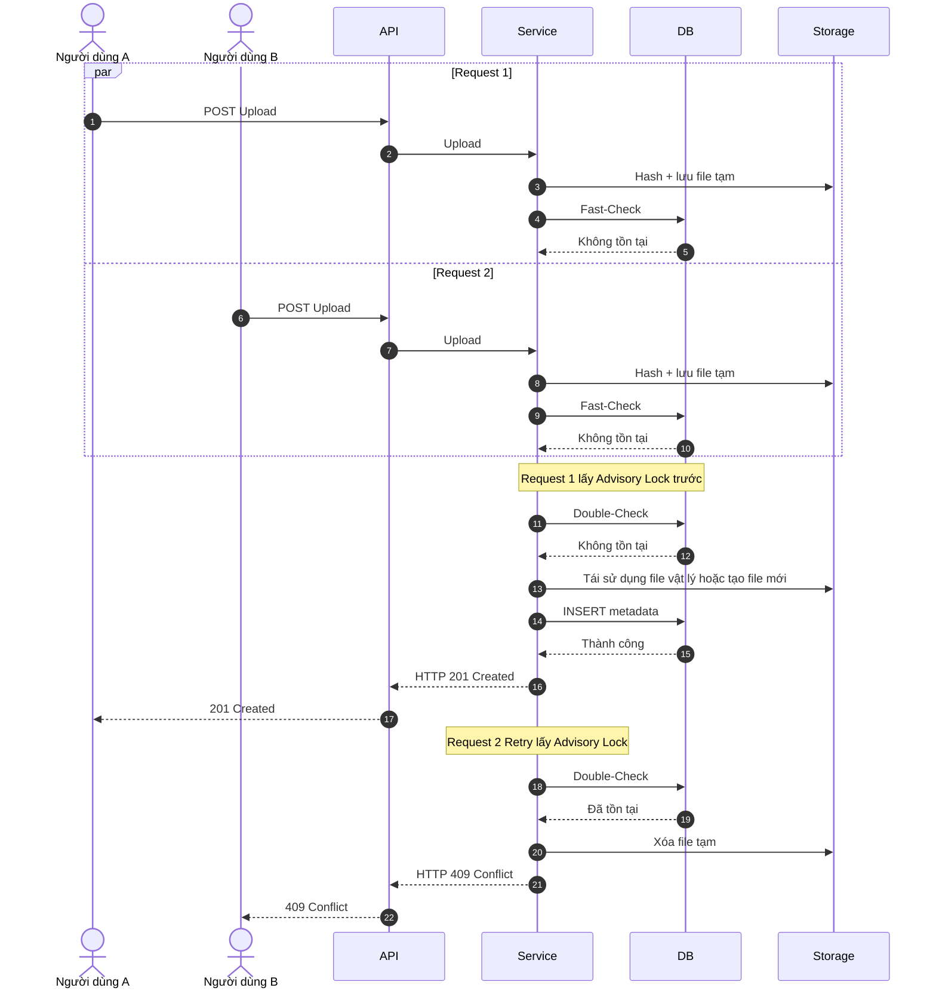
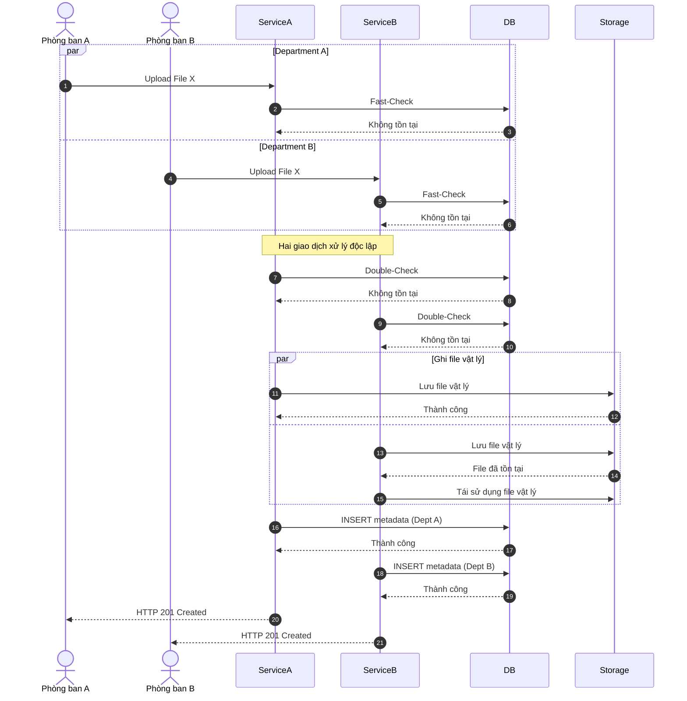
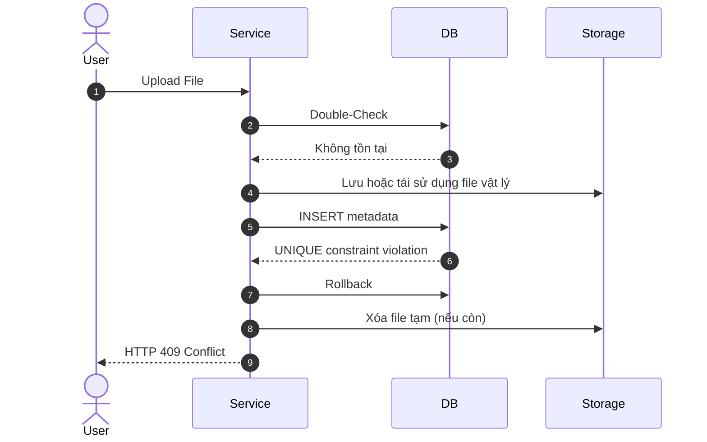
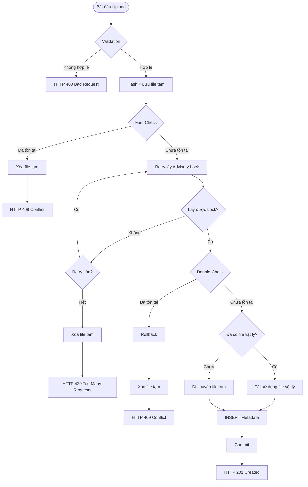

# Tài liệu Thiết kế Chi tiết (Detailed Design) - Tuần 2
## Đặc tả Chi tiết Cơ chế Chống trùng lặp & Xử lý Tải đồng thời

---

## 1. Thiết kế Phân tách Component & Các Lớp Hỗ trợ (Component Refactoring Design)

Để tuân thủ nghiêm ngặt **Nguyên tắc Đơn trách nhiệm (Single Responsibility Principle - SRP)** và tránh cho `DocumentServiceImpl` trở thành một God Class phức tạp, hệ thống phân tách logic xử lý tải lên thành **3 Lớp Hỗ trợ độc lập (Helper Components)**:

```text
com.vccorp.eap.service
│
├── storage/
│   ├── FileStorageService.java             # Interface quản lý I/O tệp tin vật lý
│   └── impl/
│       └── FileStorageServiceImpl.java     # Implement 1-pass streaming hash SHA-256 & atomic OS rename
│
├── lock/
│   └── DocumentAdvisoryLockHandler.java   # Quản lý khóa cố vấn pg_try_advisory_xact_lock trên JDBC connection
│
├── helper/
│   └── DocumentDeduplicationHelper.java   # Thực thi các câu SQL gộp Aggregate (Fast-Check/Double-Check)
│
└── impl/
    └── DocumentServiceImpl.java            # Class điều phối chính (Orchestrator): Validate, Try-Catch & TransactionTemplate
```

### 1.1. Lớp Quản lý Tệp tin Vật lý (`FileStorageService`)
* **Gói**: `com.vccorp.eap.service.storage`
* **Trách nhiệm**:
  1. `SinglePassStorageResult storeTempFile(InputStream inputStream)`: Đọc stream 1-pass, vừa ghi file tạm ra đĩa `/eap-storage/tmp/temp_<uuid>` vừa tính toán SHA-256 hex hash. Trả về DTO chứa `hash`, `fileSize`, và đường dẫn `tempFilePath`.
  2. `String moveTempToPermanent(Path tempFilePath, String hash)`: Di chuyển file tạm sang vị trí lưu trữ chính thức `/eap-storage/{hash}` bằng thao tác đổi tên nguyên tử (`Files.move` - atomic rename ở tầng OS). Tự động xử lý ngoại lệ `FileAlreadyExistsException` nếu tệp đã được tạo bởi phòng ban khác.
  3. `void deleteTempFileQuietly(Path tempFilePath)`: Xóa tệp tạm trong khối `finally` khi xảy ra lỗi hoặc phát hiện tệp trùng lặp.

### 1.2. Lớp Quản lý Khóa Cố vấn PostgreSQL (`DocumentAdvisoryLockHandler`)
* **Gói**: `com.vccorp.eap.service.lock`
* **Trách nhiệm**:
  1. `boolean tryAcquireLock(Connection connection, UUID departmentId, String hash)`: Thực thi câu lệnh native SQL `SELECT pg_try_advisory_xact_lock(hashtextextended(concat(departmentId, ':', hash), 0))` trực tiếp trên kết nối JDBC vật lý được ghim trong `TransactionTemplate`. Trả về `true` nếu lấy được khóa.
  * **Chuẩn hóa Lock ID**:
    - ownerDepartmentId: UUID.toString()
    - hash: SHA-256 lowercase
    - delimiter: ":"
    - Lock ID: `hashtextextended(concat(ownerDepartmentId, ':', hash), 0)` (BIGINT 64-bit)
  * **Cơ chế giải phóng khóa (Lock Lifetime)**: Vì sử dụng khóa cố vấn cấp giao dịch `pg_try_advisory_xact_lock(...)`, PostgreSQL sẽ **tự động giải phóng khóa** ngay khi giao dịch kết thúc (Commit hoặc Rollback). Do đó, thiết kế hệ thống **không được** và **không cần** gọi hàm giải phóng khóa thủ công `pg_advisory_unlock(...)`. Lớp này không định nghĩa phương thức `releaseLock`.
  * **Ranh giới khóa (Lock Boundary)**: Khóa chỉ tồn tại bên trong phạm vi Giao dịch (Transaction). Thao tác thử lại (Retry Loop), thời gian ngủ (Sleep) và thao tác ghi tệp tạm vật lý (File I/O) đều được thực hiện hoàn toàn NẰM NGOÀI Giao dịch. Không giữ khóa ngoài Giao dịch.
  * **Ghép nối kết nối (Connection Pinning)**: Tất cả câu lệnh SQL trong một Transaction (bao gồm xin khóa, Double-Check, di chuyển tệp vật lý nguyên tử, INSERT metadata) phải sử dụng cùng một physical JDBC Connection. Hệ thống không tạo thêm physical connection phụ nào khác hoặc làm mất Connection Pinning (ghim kết nối) của giao dịch. Nguyên lý này độc lập với thư viện triển khai và không ép buộc sử dụng JdbcTemplate hay DataSourceUtils.
  * **Phạm vi khóa (Lock Scope)**: Khóa chỉ khóa cặp duy nhất `(ownerDepartmentId, hash)`. Hệ thống không thực hiện khóa trên toàn bảng `documents`, không khóa toàn bộ phòng ban (`ownerDepartmentId`) và không khóa toàn bộ hệ thống lưu trữ (storage).

### 1.3. Lớp Hỗ trợ Truy vấn Gộp (`DocumentDeduplicationHelper`)
* **Gói**: `com.vccorp.eap.service.helper`
* **Trách nhiệm**:
  1. `DeduplicationQueryResult executeAggregateCheck(JdbcTemplate jdbcTemplate, String hash, UUID departmentId)`: Thực thi câu SQL Query 2 (`SELECT bool_or(...), array_agg(...)`) trên kết nối JDBC, trả về POJO chứa 3 thông số: `hasActiveInDept` (boolean), `activeDocId` (UUID), và `oldestFileRef` (String).

### 1.4. Lớp Điều phối Chính (`DocumentServiceImpl`)
* **Gói**: `com.vccorp.eap.service.impl`
* **Trách nhiệm**:
  * Đóng vai trò **Orchestrator**: Tiêu thụ các bean `FileStorageService`, `DocumentAdvisoryLockHandler`, `DocumentDeduplicationHelper`, và `TransactionTemplate`.
  * Thực hiện kiểm tra quyền (RBAC), kiểm tra magic bytes qua Apache Tika, gọi Pha 1 (Fast-Check) và Pha 2 (`TransactionTemplate.execute`), trả về DTO `DocumentResponse` bọc trong `ApiResponse<T>`.

---

## 2. Thiết kế Mô hình Dữ liệu (Database Design)

### 2.1. Cấu trúc bảng `documents` (Siêu dữ liệu tài liệu)

| Tên cột logic | Kiểu dữ liệu logic | Nullable | Ràng buộc / Khóa ngoại | Ý nghĩa nghiệp vụ |
| :--- | :--- | :--- | :--- | :--- |
| `id` | UUID | NO | Khóa chính (LSB: 0 = Original, 1 = Alias) | Mã định danh duy nhất của tài liệu. |
| `business_code` | VARCHAR(50) | NO | UNIQUE | Mã nghiệp vụ thân thiện hiển thị cho người dùng. |
| `title` | VARCHAR(255) | NO | | Tiêu đề hiển thị của tài liệu. |
| `file_reference` | VARCHAR(512) | YES | | Đường dẫn lưu trữ vật lý của file trên đĩa (null đối với alias). |
| `file_size` | BIGINT | YES | | Dung lượng tệp tính bằng byte (null đối với alias). |
| `hash` | VARCHAR(64) | YES | | Mã băm SHA-256 (64 ký tự hex) đại diện cho nội dung tệp. |
| `owner_department_id` | UUID | NO | Khóa ngoại | Phòng ban sở hữu tài liệu này. |
| `parent_id` | UUID | YES | Khóa ngoại (tới `documents.id`) | Liên kết tới tài liệu gốc nếu bản ghi là alias. |
| `creator_department_id`| UUID | YES | Khóa ngoại | Phòng ban thực hiện chia sẻ (chỉ áp dụng cho alias). |
| `created_by` | UUID | YES | Khóa ngoại | Người dùng thực hiện tải lên tệp tin. |
| `created_at` | TIMESTAMP | NO | | Thời điểm tạo bản ghi. |
| `updated_at` | TIMESTAMP | YES | | Thời điểm cập nhật tiêu đề gần nhất. |
| `deleted_at` | TIMESTAMP | YES | | Thời điểm xóa mềm tài liệu. |

### 2.2. Thiết kế Chỉ mục (Index Design)
Hệ thống sử dụng **hai chỉ mục** độc lập phục vụ cho các mục đích nghiệp vụ khác nhau:

1.  **Chỉ mục duy nhất bán phần (uq_documents_hash_dept)**:
    *   *Mục đích*: Bảo vệ tính duy nhất, chống ghi trùng lặp tài liệu hoạt động trong phòng ban.
    *   *SQL*:
        ```sql
        CREATE UNIQUE INDEX uq_documents_hash_dept ON documents(hash, owner_department_id) WHERE deleted_at IS NULL;
        ```
2.  **Chỉ mục phụ toàn phần trên mã băm (idx_documents_hash)**:
    *   *Mục đích*: Tối ưu hóa truy vấn tìm kiếm toàn cục theo `hash` để tái sử dụng tệp vật lý (SIS). Vì luồng SIS cần quét trên cả các tài liệu đã bị xóa mềm, chỉ mục này không chứa điều kiện `deleted_at IS NULL`.
    *   *SQL*:
        ```sql
        CREATE INDEX idx_documents_hash ON documents(hash);
        ```

---

## 3. Đặc tả API (API Design)

### 3.1. API POST /api/v1/original-documents
*   **Method**: `POST`
*   **Content-Type**: `multipart/form-data`
*   **Tham số Request**:
    *   `title` (Chuỗi ký tự, bắt buộc, độ dài từ 1 đến 255 ký tự).
    *   `file` (Dữ liệu tệp nhị phân, bắt buộc, dung lượng tối đa 50MB).
*   **Các quy tắc validation đầu vào**:
    *   Tiêu đề không được để trống hoặc chỉ chứa khoảng trắng.
    *   Dung lượng file tải lên phải lớn hơn 0 và nhỏ hơn hoặc bằng 50MB.
    *   Định dạng tệp thực tế phải thuộc danh sách được hỗ trợ (`application/pdf`, `application/vnd.openxmlformats-officedocument.wordprocessingml.document`, v.v.) bằng cách kiểm tra cấu trúc nhị phân của tệp (magic bytes) qua thư viện phân tích cấu trúc nhị phân độc lập.

### 3.2. Đặc tả Phản hồi API (API Response Design - Standardized ApiResponse Envelope)

#### Trường hợp 201 Created (Tạo tài liệu thành công)
Hệ thống trả về HTTP 201 Created khi:
  * Tệp hoàn toàn mới trong hệ thống.
  * Tệp vật lý đã tồn tại nhưng trong phòng ban chưa có tài liệu hoạt động (bao gồm trường hợp chỉ còn bản ghi đã xóa mềm).
Trong cả hai trường hợp, hệ thống đều tạo một bản ghi tài liệu mới và trả về metadata của bản ghi vừa được tạo.

```json
{
  "success": true,
  "data": {
    "id": "a0eebc99-9c0b-4ef8-bb6d-6bb9bd380a10",
    "businessCode": "ORIG_00100042",
    "title": "Báo cáo doanh thu quý 2",
    "ownerDepartmentId": "b2f63f58-5d29-45e0-8151-24db58804791",
    "fileSize": 120540,
    "hash": "e3b0c44298fc1c149afbf4c8996fb92427ae41e4649b934ca495991b7852b855",
    "parentId": null,
    "creatorDepartmentId": null,
    "createdBy": "c3d9a184-7a2e-4b48-8df3-bf7b1348a27b",
    "createdAt": "2026-07-09T15:30:00",
    "updatedAt": null
  },
  "error": null
}
```

#### Trường hợp 409 Conflict (Tài liệu đã tồn tại)
Hệ thống trả về HTTP 409 Conflict khi trong cùng phòng ban đã tồn tại một tài liệu hoạt động (deleted_at IS NULL) có cùng nội dung tệp.
  * Không tạo bản ghi mới.
  * Không ghi đè tiêu đề.
  * Không trả metadata của tài liệu đã tồn tại.
```json
{
  "success": false,
  "data": null,
  "error": {
    "errorCode": "ERR_DUPLICATE_DOCUMENT",
    "message": "Tài liệu có cùng nội dung đã tồn tại trong phòng ban."
  }
}
```


#### Trường hợp 429 Too Many Requests (Không lấy được Advisory Lock sau số lần retry tối đa)
```json
{
  "success": false,
  "data": null,
  "error": {
    "errorCode": "ERR_CONCURRENT_UPLOAD",
    "message": "Yêu cầu tải lên tệp tin đang được xử lý đồng thời. Vui lòng thử lại sau."
  }
}
```

---

## 4. Quy trình Xử lý Nghiệp vụ Chi tiết (Detailed Workflows)

### 4.1. Thuật toán Hashing & Lưu tệp tạm thời 1-pass (Single-Pass Storage & Hashing)
Nhằm tránh việc đọc file hai lần gây lãng phí tài nguyên I/O đĩa cứng, hệ thống áp dụng luồng xử lý như sau:
1.  API tiếp nhận tệp tin dưới dạng luồng dữ liệu (`InputStream`).
2.  Khởi tạo bộ xử lý tính toán mã băm mật mã (SHA-256) và luồng ghi tệp tạm thời.
3.  Vừa đọc luồng dữ liệu đầu vào vừa ghi trực tiếp vào một tệp tạm thời trong thư mục `/eap-storage/tmp` (được cấu hình cùng mount point mạng dùng chung với thư mục đích), đồng thời cập nhật trạng thái của bộ tính toán mã băm cho mỗi khối đệm dữ liệu (kích thước đệm khuyến nghị: 8KB).
4.  Khi luồng dữ liệu đọc hết, hoàn tất quá trình ghi tệp tạm thời và kết xuất chuỗi Hex đại diện cho mã băm SHA-256.
5.  Phương pháp này đảm bảo chỉ đọc dữ liệu nhị phân của tệp tin đúng một lần duy nhất.

### 4.2. Cấu trúc Phân tách Giao dịch & Tối ưu hóa Khóa
Logic nghiệp vụ được phân tách thành hai giai đoạn nhằm giảm thời gian giữ giao dịch cơ sở dữ liệu và đảm bảo tính nhất quán khi xử lý đồng thời:
  *  Ngoài giao dịch (Non-Transactional): Validation, Hashing, lưu tệp tạm, Fast-Check và Retry lấy Advisory Lock.
  *  Trong giao dịch (Transactional): Double-Check, xử lý lưu trữ vật lý và ghi nhận bản ghi tài liệu mới.

#### Phương thức chính (Ngoài Giao dịch - Non-Transactional)
1.  Nhận tiêu đề, tệp tin và thông tin người dùng.
2.  Thực hiện validation vai trò và định dạng tệp tin.
3.  Gọi bộ xử lý "Hashing & Lưu tệp tạm thời 1-pass" (§4.1) để lấy mã băm `hash` và tệp tạm `tempFile` tại `/eap-storage/tmp/temp_uuid`.
4.  **Bảo vệ tài nguyên bằng khối Try-Finally**: Toàn bộ luồng xử lý từ bước này phải nằm trong khối `try-finally` để đảm bảo dọn dẹp file tạm.
5.  **Fast-Check (Ngoài Giao dịch)**: Thực thi **Truy vấn gộp Aggregate (Query 2)**.
    *   Nếu `hasActiveInDept` trả về `true`: Huỷ tệp tạm, kết thúc xử lý và trả về HTTP 409 Conflict.
6.  **Vòng lặp thử lại Advisory Lock (Retry Loop ngoài Giao dịch — không giữ Connection)**: Nếu chưa phát hiện tài liệu hoạt động trùng lặp, thực hiện vòng lặp thử lấy Advisory Lock:
    *   Nếu chưa lấy được khóa, kết thúc giao dịch hiện tại, chờ theo chính sách Retry và thử lại.
    *   Sau tối đa 5 lần thử vẫn không lấy được khóa, trả về HTTP 429 Too Many Requests.
7.  Khi lấy được khóa thành công, chuyển sang luồng xử lý trong giao dịch.
8.  Sau khi kết thúc xử lý (thành công hoặc lỗi), hệ thống phải bảo đảm tệp tạm được dọn dẹp nếu chưa được di chuyển sang vị trí lưu trữ chính thức.

#### Phương thức Giao dịch (Trong Giao dịch - Transactional — Single-Connection Pattern)

> Toàn bộ luồng từ bước này được thực thi bên trong một `TransactionTemplate.execute()` duy nhất, sử dụng **1 kết nối JDBC vật lý được ghim cố định**. `pg_try_advisory_xact_lock` là transaction-level lock — được PostgreSQL **tự động giải phóng** khi giao dịch commit hoặc rollback. 

1.  Khởi chạy khối `TransactionTemplate.execute(...)` — kết nối JDBC vật lý A được ghim cho toàn bộ khối.
2.  Thực thi `SELECT pg_try_advisory_xact_lock(hashtextextended(...))` (Query 1) trên kết nối A.
    *   Nếu trả về `false`: Rollback ngay (PostgreSQL giải phóng lock), trả về `LOCK_BUSY` signal. Vòng lặp bên ngoài sẽ ngủ và retry.
3.  **Double-Check** (Query 2):
    *   Nếu hasActiveInDept = true, rollback giao dịch, hủy tệp tạm và trả về HTTP 409 Conflict.
4.  **Xử lý lưu trữ vật lý**:
    *   Nếu `oldestFileRef` không rỗng: Tái sử dụng liên kết tệp vật lý cũ nhất này, đồng thời báo hiệu để khối `finally` xóa tệp tạm `tempFile`.
    *   Nếu `oldestFileRef` rỗng (tệp vật lý chưa từng tồn tại): Di chuyển tệp tạm `tempFile` vào đường dẫn lưu trữ chính thức đặt tên theo mã băm (`/eap-storage/{hash}`) bằng thao tác đổi tên tệp tức thời (atomic rename ở tầng hệ điều hành).
        *   *Lưu ý xử lý xung đột liên phòng ban*: Nếu phát hiện lỗi tệp đích đã tồn tại (do phòng ban khác chạy song song vừa thực hiện rename thành công), tiến hành bắt ngoại lệ `FileAlreadyExistsException`, báo hiệu để khối `finally` tự động hủy tệp tạm `tempFile` và tái sử dụng đường dẫn tệp đích đã có.
5.  Thực hiện **Truy vấn thêm bản ghi mới (Query 3)** để lưu siêu dữ liệu tài liệu mới vào cơ sở dữ liệu.
6.  Kết thúc giao dịch (Commit). PostgreSQL tự động giải phóng `pg_try_advisory_xact_lock`. Trả về siêu dữ liệu vừa tạo — **HTTP 201 Created**.
7.  **Xử lý ngoại lệ**
  *   Nếu xảy ra lỗi vi phạm ràng buộc duy nhất (DataIntegrityViolationException) do các tình huống đồng thời ngoài dự kiến, rollback giao dịch và trả về HTTP 409 Conflict.
  *   Mọi ngoại lệ khác phải rollback giao dịch, dọn dẹp tệp tạm (nếu còn tồn tại) và được xử lý theo cơ chế Global Exception Handler của hệ thống.

#### Khối Dọn dẹp Cuối cùng (Khối Finally của Phương thức chính)
*   **Xóa tệp tạm**: Nếu tệp tạm `tempFile` vẫn tồn tại trên đĩa và luồng xử lý chưa đánh dấu di chuyển tệp thành công → Thực hiện xóa tệp tạm `tempFile` ngay lập tức để giải phóng tài nguyên đĩa.
*   **Lưu ý**: Vì dùng `pg_try_advisory_xact_lock` (transaction-level), PostgreSQL **tự động giải phóng** khóa khi giao dịch kết thúc. Khối `finally` **không cần** gọi `pg_advisory_unlock` thủ công.

### 4.3. Sơ đồ Tuần tự Xử lý Đồng thời (Mermaid Sequence Diagram)
Dưới đây là sơ đồ mô tả chi tiết luồng xử lý khi có hai yêu cầu tải trùng tệp được gửi lên đồng thời bởi hai người dùng trong cùng một phòng ban:

> **Business Requirement**: Luồng tạo mới trả về HTTP 201 Created. Các luồng phát hiện tài liệu đã tồn tại trả về HTTP 409 Conflict.



#### Sơ đồ Tuần tự: Đụng độ ghi file vật lý giữa các phòng ban

Sơ đồ dưới đây mô tả trường hợp hai phòng ban khác nhau đồng thời tải lên cùng một nội dung tệp tin.

Do Advisory Lock chỉ đồng bộ trong phạm vi từng phòng ban nên hai giao dịch có thể xử lý song song. Hệ thống bảo đảm chỉ tạo một tệp vật lý duy nhất, trong khi mỗi phòng ban vẫn có bản ghi tài liệu độc lập của mình.



#### Sơ đồ Tuần tự: Xử lý ngoại lệ vi phạm UNIQUE (Defensive Failsafe)

Sơ đồ dưới đây mô tả cơ chế xử lý dự phòng khi xảy ra lỗi vi phạm ràng buộc duy nhất ngoài dự kiến trong quá trình ghi dữ liệu. Đây không phải luồng nghiệp vụ thông thường mà là lớp bảo vệ cuối cùng nhằm đảm bảo dữ liệu luôn nhất quán.




### 4.4. Sơ đồ Hoạt động Chi tiết (Mermaid Activity Diagram)

Sơ đồ dưới đây mô tả toàn bộ luồng xử lý tải lên tài liệu từ khi tiếp nhận yêu cầu đến khi tạo bản ghi hoặc phát hiện tài liệu trùng lặp.

> **Business Requirement**
>
> * Nếu tạo mới tài liệu thành công, hệ thống trả về **HTTP 201 Created**.
> * Nếu phát hiện tài liệu đang hoạt động đã tồn tại trong cùng phòng ban, hệ thống trả về **HTTP 409 Conflict**.



---

### 4.5. Luồng xử lý khi tải lên tài liệu đã bị xóa mềm (Soft Delete Flow)

Khi một tệp tin đã từng được tải lên bởi phòng ban nghiệp vụ và sau đó bị xóa mềm (soft deleted — bản ghi siêu dữ liệu cũ có `deleted_at IS NOT NULL`), nghiệp vụ yêu cầu tuyệt đối không được khôi phục (restore), phục hồi (revive) hay tái sử dụng bản ghi logic cũ (logical record). Hệ thống sẽ tạo một bản ghi tài liệu hoàn toàn mới và tái sử dụng tệp vật lý sẵn có.

#### Các bước xử lý chi tiết:
1.  **Fast-Check và Double-Check (Query 2)**:
    *   Hệ thống thực hiện truy vấn gộp (Query 2) lọc theo mã băm `hash`. Do bản ghi cũ đã bị xóa mềm (`deleted_at IS NOT NULL`), cột `has_active_in_dept` trả về `false`, và `active_doc_id` trả về `null`.
    *   Truy vấn gộp không lọc theo trạng thái xóa đối với trường tệp vật lý, do đó cột `oldest_file_ref` vẫn trả về đường dẫn tệp vật lý cũ nhất đã lưu trên đĩa (ví dụ: `/eap-storage/{hash}`).
2.  **Định tuyến luồng**:
    *   Vì `has_active_in_dept` là `false`, hệ thống nhận định đây là một tài liệu mới đối với phòng ban và đi tiếp vào luồng ghi nhận.
    *   Tại bước kiểm tra tối ưu hóa lưu trữ (SIS Check), hệ thống phát hiện `oldest_file_ref` không rỗng.
3.  **Tái sử dụng tệp vật lý & Tạo bản ghi logic mới**:
    *   Hệ thống không ghi tệp mới lên đĩa, thực hiện đánh dấu hủy tệp tạm ở khối `finally`.
    *   Hệ thống thực hiện `INSERT` một bản ghi siêu dữ liệu mới (Query 3) với:
        *   Một khóa chính `id` mới hoàn toàn (sinh ngẫu nhiên UUID).
        *   Mã nghiệp vụ `business_code` mới sinh từ sequence.
        *   Trạng thái hoạt động (`deleted_at IS NULL`).
        *   Đường dẫn `file_reference` trỏ tới `oldest_file_ref` (tệp vật lý cũ).
4.  **Kết quả phản hồi**:
    *   Hệ thống commit giao dịch và phản hồi **HTTP 201 Created** chứa siêu dữ liệu của bản ghi logic mới, hoàn tất việc tái sử dụng file vật lý mà không có bất kỳ sự khôi phục nào trên bản ghi cũ.

---

## 5. Các câu lệnh SQL Tường minh (Raw SQL Queries)

Dưới đây là đặc tả chi tiết của toàn bộ các câu lệnh SQL được sử dụng trong hệ thống:

### Query 1: Yêu cầu khóa cố vấn 64-bit không chặn (pg_try_advisory_xact_lock)

Sử dụng `pg_try_advisory_xact_lock` (**transaction-level**) thay vì session-level. Lock được PostgreSQL **tự động giải phóng** khi giao dịch commit hoặc rollback — không cần gọi `pg_advisory_unlock` thủ công. Hàm `hashtextextended` tạo giá trị băm 64-bit từ chuỗi khóa kết hợp giữa mã phòng ban và mã băm tệp, giảm thiểu tỷ lệ va chạm xuống tối đa. Thực thi trên kết nối JDBC vật lý được ghim trong `TransactionTemplate`.
```sql
SELECT pg_try_advisory_xact_lock(hashtextextended(concat(:ownerDepartmentId, ':', :hash), 0));
```

### Query 2: Truy vấn gộp Aggregate (Fast-Check và Double-Check)
Truy vấn này quét trên chỉ mục `idx_documents_hash` theo mã băm tệp để lấy ra trạng thái trùng lặp và đường dẫn file vật lý cũ nhất.
```sql
SELECT 
    bool_or(owner_department_id = :ownerDepartmentId AND deleted_at IS NULL) AS has_active_in_dept,
    (array_agg(id ORDER BY created_at ASC) FILTER (WHERE owner_department_id = :ownerDepartmentId AND deleted_at IS NULL))[1] AS active_doc_id,
    (array_agg(file_reference ORDER BY created_at ASC) FILTER (WHERE file_reference IS NOT NULL))[1] AS oldest_file_ref
FROM documents
WHERE hash = :hash;
```
*   `has_active_in_dept`: Trả về `true` nếu phòng ban đã có bản ghi hoạt động trùng khớp.
*   `active_doc_id`: UUID của bản ghi hoạt động đó (lấy bản ghi tạo sớm nhất nếu có nhiều hơn một).
*   `oldest_file_ref`: Đường dẫn tệp vật lý cũ nhất từng tồn tại trên đĩa của mã băm này để phục vụ tái sử dụng (không lọc theo `deleted_at`).

### Kết quả `EXPLAIN ANALYZE INDEX`

```text
Aggregate  (cost=8.59..8.60 rows=1 width=49)
(actual time=0.196..0.197 rows=1 loops=1)

-> Index Scan using idx_documents_hash on documents
   (cost=0.55..8.57 rows=1 width=94)
   (actual time=0.058..0.060 rows=1 loops=1)

   Index Cond: ((hash)::text = '3a69ce08cd836063712a0aa02c6206e22d678a9543c4f74fcec7c6e873574deb'::text)

Planning Time: 0.407 ms
Execution Time: 0.339 ms
```

**Nhận xét:**
- PostgreSQL sử dụng **Index Scan** trên chỉ mục `idx_documents_hash`.
- Điều kiện lọc theo `hash` được thực hiện trực tiếp trên chỉ mục (`Index Cond`).
- Chỉ có **1 bản ghi** được tìm thấy (`rows=1`).
- Thời gian lập kế hoạch (**Planning Time**) là **0.407 ms**.
- Thời gian thực thi (**Execution Time**) là **0.339 ms**, cho thấy truy vấn có hiệu năng rất cao.

### Kết quả `EXPLAIN ANALYZE SEQ`

```text
Aggregate  (cost=73574.50..73574.51 rows=1 width=49)
(actual time=277.041..279.416 rows=1 loops=1)

-> Gather
   (cost=1000.00..73574.49 rows=1 width=94)
   (actual time=276.788..279.166 rows=1 loops=1)

   Workers Planned: 2
   Workers Launched: 2

   -> Parallel Seq Scan on documents
      (cost=0.00..72574.39 rows=1 width=94)
      (actual time=261.060..270.595 rows=0 loops=3)

      Filter: ((hash)::text = '3a69ce08cd836063712a0aa02c6206e22d678a9543c4f74fcec7c6e873574deb'::text)

      Rows Removed by Filter: 666679

Planning Time: 0.314 ms
Execution Time: 279.650 ms
```

**Nhận xét:**

- PostgreSQL **không sử dụng chỉ mục** mà thực hiện **Parallel Sequential Scan** trên toàn bộ bảng `documents`.
- Truy vấn được thực thi song song với **2 worker**, tổng cộng **3 tiến trình** (1 tiến trình chính + 2 worker).
- Mỗi worker quét một phần dữ liệu và áp dụng điều kiện lọc theo `hash`.
- Mỗi worker phải loại bỏ khoảng **666.679 bản ghi**, tương đương gần **2 triệu bản ghi** được quét trên toàn bảng.
- Mặc dù có sử dụng cơ chế quét song song (`Gather`), thời gian thực thi vẫn lên tới **279.650 ms**, lớn hơn rất nhiều so với trường hợp sử dụng `Index Scan`.
- Kết quả này cho thấy khi không có chỉ mục phù hợp trên cột `hash`, PostgreSQL buộc phải quét toàn bộ bảng, làm tăng đáng kể chi phí I/O và thời gian thực thi.

### Query 3: Truy vấn thêm bản ghi tài liệu mới
```sql
INSERT INTO documents (
    id, 
    business_code, 
    title, 
    file_reference, 
    file_size, 
    hash, 
    owner_department_id, 
    parent_id, 
    creator_department_id, 
    created_by, 
    created_at
) VALUES (
    :id, 
    'ORIG_' || lpad(nextval('doc_business_code_seq')::text, 8, '0'), 
    :title, 
    :fileReference, 
    :fileSize, 
    :hash, 
    :ownerDepartmentId, 
    :parentId, 
    :creatorDepartmentId, 
    :createdBy, 
    NOW()
);
```

### Query 4: Truy vấn lấy siêu dữ liệu tài liệu
Sử dụng để lấy thông tin tài liệu trùng lặp trả về cho client.
```sql
SELECT 
    id, 
    business_code, 
    title, 
    file_reference, 
    file_size, 
    hash, 
    owner_department_id, 
    parent_id, 
    creator_department_id, 
    created_by, 
    created_at, 
    updated_at
FROM documents
WHERE id = :id;
```

---

## 6. Quản lý Exception & Timeout (Exception & Timeout Management)

### 6.1. Lỗi hết thời gian chờ kết nối CSDL (Connection Pool Timeout)

* **Kịch bản**:
    * Khi HikariCP không cấp được kết nối trong thời gian `connection-timeout = 5000ms`, Driver JDBC sẽ phát sinh `SQLTransientConnectionException` (hoặc ngoại lệ tương đương).

* **Xử lý**:
    * Global Exception Handler bắt ngoại lệ này và chuyển thành phản hồi:
        * HTTP 429 Too Many Requests
        * Error Code: `ERR_CONCURRENT_UPLOAD`
    * Hệ thống ghi log ở mức **WARN** để phục vụ giám sát vận hành.

* **Lưu ý triển khai**:
    * Kích thước HikariCP (`maximum-pool-size`) và Thread Pool cho tác vụ CPU-bound được cấu hình theo Architecture Design.
    * Luồng retry advisory lock luôn thực hiện ngoài transaction, vì vậy trong thời gian chờ retry hệ thống không giữ JDBC Connection.

### 6.2. Lỗi vi phạm UNIQUE Constraint (Failsafe)

* **Kịch bản**: Trong trường hợp bất thường, thao tác `INSERT` vi phạm ràng buộc `uq_documents_hash_dept`.

* **Xử lý**:
    * Rollback transaction (PostgreSQL tự động giải phóng transaction-level advisory lock).
    * Dọn dẹp tệp tạm nếu vẫn còn tồn tại.
    * Truy vấn lại bản ghi tài liệu đang hoạt động.
    * Trả về **HTTP 201 Created** với metadata của bản ghi đã tồn tại nhằm đảm bảo tính idempotent của API.

### 6.3. Lỗi Hết thời gian chờ Advisory Lock

* **Kịch bản**: Sau số lần retry tối đa, request vẫn không lấy được `pg_try_advisory_xact_lock`.

* **Xử lý**:
    * Kết thúc transaction hiện tại (nếu có).
    * Dọn dẹp tệp tạm.
    * Ném `ConcurrentUploadTimeoutException`.
    * Global Exception Handler chuyển đổi thành phản hồi **HTTP 429 Too Many Requests** (`ERR_CONCURRENT_UPLOAD`).

### 6.4. Mất kết nối hoặc Dừng Ứng dụng

* **Kịch bản**:
    * Kết nối tới PostgreSQL bị gián đoạn; hoặc
    * Ứng dụng dừng trong khi transaction đang thực thi.

* **Xử lý**:
    * PostgreSQL tự động rollback transaction.
    * Advisory lock transaction-level được tự động giải phóng.
    * Ứng dụng dọn dẹp tệp tạm trong khối `finally`.
    * Các request khác có thể tiếp tục xử lý bình thường.

---

## 7. Phân tích & Đánh giá Giải pháp Khóa (Locking Mechanism Technical Evaluation)

Đối với bài toán kiểm soát tải đồng thời và chống trùng lặp dữ liệu, hệ thống tiến hành phân tích so sánh 3 phương án kỹ thuật:

### 7.1. So sánh các Phương án Khóa

| Tiêu chí | Option 1: Native SQL via `JdbcTemplate` trong `TransactionTemplate` (Đề xuất) | Option 2: Spring Data JPA `@Query(nativeQuery = true)` | Option 3: JPA `@Lock(PESSIMISTIC_WRITE)` |
| :--- | :--- | :--- | :--- |
| **Cơ chế hoạt động** | Gọi `pg_try_advisory_xact_lock` trực tiếp trên kết nối JDBC được ghim bởi `TransactionTemplate`. | Gọi native query qua Proxy đại lý của Spring Data JPA. | Gọi `SELECT ... FOR UPDATE` trên thực thể JPA. |
| **Khóa dòng chưa tồn tại** | **TỐT**: Khóa trên giá trị băm logic (64-bit BigInt), không phụ thuộc bản ghi DB. | **TỐT**: Khóa trên giá trị băm logic. | **KHÔNG THỂ**: `FOR UPDATE` đòi hỏi bản ghi phải tồn tại trước dưới DB. Không tác dụng với file mới. |
| **Đảm bảo Pinned Connection** | **TUYỆT ĐỐI 100%**: `TransactionTemplate` giữ chặt đúng 1 kết nối JDBC cho toàn chuỗi thao tác. | **RỦI RO**: Rò rỉ kết nối nếu không quản lý chặt chẽ transaction boundary của Proxy. | **TRUNG BÌNH**: Phụ thuộc vào transaction quản lý bởi Hibernate. |
| **Hiệu năng & Overhead** | **TỐI ƯU**: Trực thi SQL phẳng, 0ms proxy overhead. | **TRUNG BÌNH**: Phải đi qua proxy layer của Spring Data. | **THẤP**: Phải load entity state vào Hibernate Persistence Context. |
| **Khả năng giải phóng sớm** | **TỐT**: Trả về boolean ngay (`pg_try_advisory_xact_lock`), fail-fast HTTP 429 nếu hết retry. | **TRUNG BÌNH**: Khó kiểm soát retry loop ở tầng DAO. | **KÉM**: Giữ lock cho đến tận khi kết thúc transaction commit. |

### 7.2. Kết luận Giải pháp Đề xuất

1. **Từ bỏ Option 3 (JPA `@Lock(PESSIMISTIC_WRITE)`):** Do `PESSIMISTIC_WRITE` dựa trên `FOR UPDATE` cấp dòng (row-level lock), nó hoàn toàn không thể khóa được các yêu cầu tải lên tệp tin mới (chưa có bản ghi nào trong database).
2. Lựa chọn Option 1 (`JdbcTemplate` + `TransactionTemplate` Pinned Connection):
   * Đây là phương án tối ưu nhất về mặt kiến trúc.
   * `JdbcTemplate` kết hợp `TransactionTemplate` đảm bảo chuỗi thao tác `pg_try_advisory_xact_lock` -> `Double-Check` -> `Atomic Rename` -> `INSERT` -> Transaction Commit (PostgreSQL tự động giải phóng lock) được chạy nguyên tử trên đúng **1 kết nối JDBC vật lý duy nhất (Pinned Connection)**.
   * Đảm bảo tính Idempotency, không gây connection pool starvation, và bảo vệ an toàn cho SLA phản hồi của hệ thống.