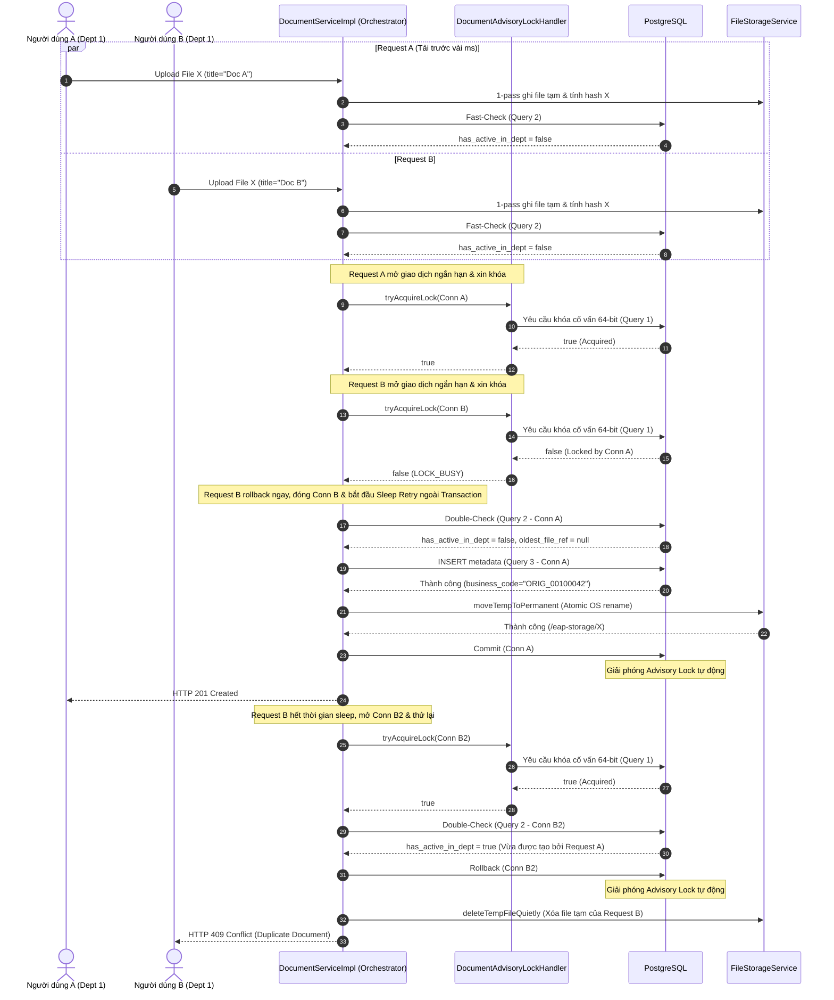
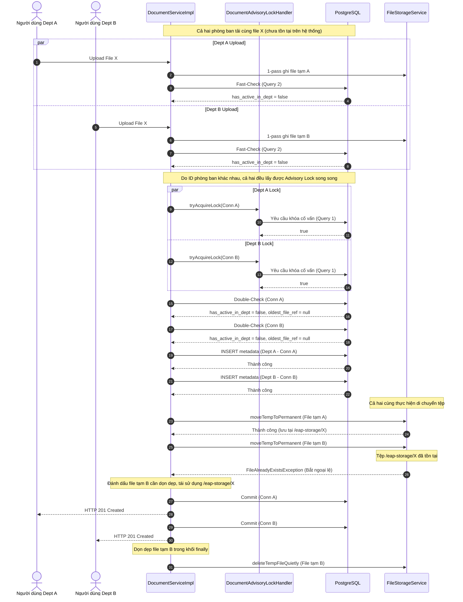
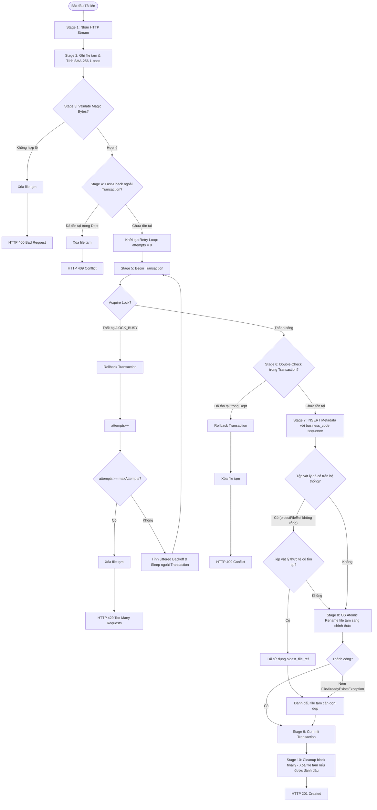

# Tài liệu Thiết kế Chi tiết (Detailed Design) - Tuần 2
## Đặc tả Chi tiết Cơ chế Chống trùng lặp & Xử lý Tải đồng thời

---

## 1. Thiết kế Phân tách Component & Các Lớp Hỗ trợ (Component Refactoring Design)

Để tuân thủ nghiêm ngặt **Nguyên tắc Đơn trách nhiệm (Single Responsibility Principle - SRP)**, logic xử lý tải lên được phân tách thành **3 Lớp Hỗ trợ độc lập (Helper Components)**:

```text
com.vccorp.eap.service
│
├── storage/
│   ├── FileStorageService.java             # Interface quản lý I/O tệp tin vật lý
│   └── impl/
│       └── FileStorageServiceImpl.java     # Triển khai lưu tệp tạm & đổi tên nguyên tử ở tầng hệ điều hành
│
├── lock/
│   └── DocumentAdvisoryLockHandler.java   # Quản lý khóa cố vấn PostgreSQL cấp giao dịch
│
├── helper/
│   └── DocumentDeduplicationHelper.java   # Thực thi các câu lệnh SQL gộp kiểm tra trùng lặp
│
└── impl/
    └── DocumentServiceImpl.java            # Lớp điều phối chính với vòng lặp thử lại ngoài giao dịch
```

### 1.1. Lớp Quản lý Tệp tin Vật lý (`FileStorageService`)
* **Trách nhiệm**:
  1. `SinglePassStorageResult storeTempFile(InputStream inputStream)`: Đọc HTTP stream 1-pass, vừa ghi file tạm ra đĩa `/eap-storage/tmp/temp_<uuid>` vừa tính toán SHA-256 hex hash. Không đọc InputStream nhiều lần.
  2. `String moveTempToPermanent(Path tempFilePath, String hash)`: Di chuyển file tạm sang vị trí chính thức `/eap-storage/{hash}` bằng thao tác đổi tên nguyên tử (`Files.move` - atomic rename ở tầng OS). Tự động xử lý ngoại lệ `FileAlreadyExistsException` nếu tệp đã được phòng ban khác di chuyển thành công.
  3. `boolean exists(String fileReference)`: Kiểm tra sự tồn tại thực tế của tệp tin tại đường dẫn được chỉ định trên đĩa (`Files.exists(Path)`).
  4. `void deleteTempFileQuietly(Path tempFilePath)`: Xóa tệp tạm trong khối `finally` khi xảy ra lỗi hoặc phát hiện tệp trùng lặp.

### 1.2. Lớp Quản lý Khóa Cố vấn PostgreSQL (`DocumentAdvisoryLockHandler`)
* **Trách nhiệm**:
  1. `boolean tryAcquireLock(Connection connection, UUID departmentId, String hash)`: Thực thi câu lệnh yêu cầu khóa cố vấn cấp giao dịch trên kết nối JDBC vật lý được ghim trong giao dịch.
  * **Cơ chế giải phóng khóa**: PostgreSQL tự động giải phóng khóa cố vấn cấp giao dịch ngay khi giao dịch kết thúc (Commit hoặc Rollback). Hệ thống không gọi hàm giải phóng khóa thủ công `pg_advisory_unlock` để loại bỏ nguy cơ rò rỉ khóa.
  * **Ranh giới khóa**: Khóa chỉ tồn tại bên trong phạm vi Giao dịch. Thao tác thử lại (Retry Loop), thời gian ngủ (Sleep) và thao tác ghi tệp tạm vật lý đều được thực hiện hoàn toàn NẰM NGOÀI Giao dịch.
  * **Ghim kết nối (Connection Pinning)**: Tất cả câu lệnh SQL trong một Transaction (bao gồm xin khóa, Double-Check, INSERT metadata) phải sử dụng cùng một physical JDBC Connection duy nhất.
  * **Phạm vi khóa**: Khóa được giới hạn theo cặp thông tin phòng ban và mã băm của tệp tin `(ownerDepartmentId, hash)`. Không thực hiện khóa trên toàn bảng hay toàn phòng ban.

### 1.3. Lớp Hỗ trợ Truy vấn Gộp (`DocumentDeduplicationHelper`)
* **Trách nhiệm**:
  1. `DeduplicationQueryResult executeAggregateCheck(JdbcTemplate jdbcTemplate, String hash, UUID departmentId)`: Thực thi truy vấn gộp kiểm tra trùng lặp trên kết nối JDBC, trả về đối tượng chứa thông tin trạng thái trùng lặp và đường dẫn tệp vật lý cũ nhất.

### 1.4. Lớp Điều phối Chính (`DocumentServiceImpl`)
* **Trách nhiệm**: Đóng vai trò Orchestrator phối hợp vòng lặp retry ngoài giao dịch để thực hiện tuần tự hóa, điều phối transaction, validate magic bytes và phân quyền.

---

## 2. Thiết kế Mô hình Dữ liệu & Chỉ mục (Database Design)

### 2.1. Cấu trúc bảng `documents` (Siêu dữ liệu tài liệu)

| Tên cột | Kiểu dữ liệu | Nullable | Ràng buộc / Khóa ngoại | Ý nghĩa nghiệp vụ |
| :--- | :--- | :--- | :--- | :--- |
| `id` | UUID | NO | Khóa chính | Mã định danh duy nhất của tài liệu. |
| `business_code` | VARCHAR(50) | NO | UNIQUE | Mã nghiệp vụ hiển thị cho người dùng. |
| `title` | VARCHAR(255) | NO | | Tiêu đề hiển thị của tài liệu. |
| `file_reference` | VARCHAR(512) | YES | | Đường dẫn lưu trữ vật lý của file trên đĩa (null đối với alias). |
| `file_size` | BIGINT | YES | | Dung lượng tệp tính bằng byte (null đối với alias). |
| `hash` | VARCHAR(64) | YES | | Mã băm SHA-256 (64 ký tự hex) đại diện cho nội dung tệp. |
| `owner_department_id` | UUID | NO | Khóa ngoại | Phòng ban sở hữu tài liệu này. |
| `parent_id` | UUID | YES | Khóa ngoại (tới `documents.id`) | Liên kết tới tài liệu gốc nếu bản ghi là alias. |
| `creator_department_id`| UUID | YES | Khóa ngoại | Phòng ban thực hiện chia sẻ (chỉ áp dụng cho alias). |
| `created_by` | UUID | YES | Khóa ngoại | Người dùng thực hiện tải lên tệp tin. |
| `created_at` | TIMESTAMP | NO | | Thời điểm tạo bản ghi. |
| `updated_at` | TIMESTAMP | YES | | Thời điểm cập nhật tiêu đề gần nhất. |
| `deleted_at` | TIMESTAMP | YES | | Thời điểm xóa mềm tài liệu. |

### 2.2. Thiết kế Chỉ mục (Index Design)
Hệ thống sử dụng ba chỉ mục để tối ưu hóa truy vấn:
1.  **Chỉ mục duy nhất bán phần (uq_documents_hash_dept)**: Đảm bảo chống trùng lặp tài liệu hoạt động trong cùng phòng ban ở tầng vật lý.
2.  **Chỉ mục phụ toàn phần trên mã băm (idx_documents_hash)**: Tối ưu hóa việc quét tìm kiếm tệp vật lý cũ nhất trên toàn hệ thống lưu trữ phục vụ Single Instance Storage (SIS).
3.  **Chỉ mục phụ phục vụ truy vấn theo phòng ban (idx_documents_owner_dept_deleted)**: Tối ưu hóa việc tìm kiếm và lọc danh sách tài liệu đang hoạt động thuộc sở hữu của một phòng ban cụ thể.

---

## 3. Đặc tả API & Phản hồi (API Design)

### 3.1. API POST /api/v1/original-documents
*   **Method**: `POST`
*   **Content-Type**: `multipart/form-data`
*   **Tham số Request**:
    *   `title` (Chuỗi ký tự, bắt buộc, độ dài từ 1 đến 255 ký tự).
    *   `file` (Dữ liệu tệp nhị phân, bắt buộc, dung lượng tối đa 50MB).

### 3.2. Cấu trúc Phản hồi API (API Response Envelope)

*   **HTTP 201 Created (Thành công tải lên mới hoặc tái sử dụng file vật lý)**:
    ```json
    {
      "success": true,
      "data": {
        "id": "a0eebc99-9c0b-4ef8-bb6d-6bb9bd380a10",
        "businessCode": "ORIG_00100042",
        "title": "Báo cáo doanh thu quý 2",
        "ownerDepartmentId": "b2f63f58-5d29-45e0-8151-24db58804791",
        "fileSize": 120540,
        "hash": "e3b0c44298fc1c149afbf4c8996fb92427ae41e4649b934ca495991b7852b855",
        "parentId": null,
        "creatorDepartmentId": null,
        "createdBy": "c3d9a184-7a2e-4b48-8df3-bf7b1348a27b",
        "createdAt": "2026-07-09T15:30:00",
        "updatedAt": null
      },
      "error": null
    }
    ```
*   **HTTP 400 Bad Request (Yêu cầu tải lên không hợp lệ, tiêu đề trống, dung lượng tệp vượt giới hạn hoặc định dạng/magic bytes không được hỗ trợ)**:
    ```json
    {
      "success": false,
      "data": null,
      "error": {
        "errorCode": "ERR_INVALID_REQUEST",
        "message": "Thông tin yêu cầu không hợp lệ hoặc định dạng tệp không được hỗ trợ."
      }
    }
    ```
*   **HTTP 409 Conflict (Tài liệu hoạt động đã tồn tại trong phòng ban)**:
    ```json
    {
      "success": false,
      "data": null,
      "error": {
        "errorCode": "ERR_DUPLICATE_DOCUMENT",
        "message": "Tài liệu có cùng nội dung đã tồn tại trong phòng ban."
      }
    }
    ```
*   **HTTP 429 Too Many Requests (Không lấy được Advisory Lock sau retry tối đa hoặc cạn kiệt kết nối tạm thời)**:
    ```json
    {
      "success": false,
      "data": null,
      "error": {
        "errorCode": "ERR_CONCURRENT_UPLOAD",
        "message": "Yêu cầu tải lên tệp tin đang được xử lý đồng thời. Vui lòng thử lại sau."
      }
    }
    ```
*   **HTTP 500 Internal Server Error (Lỗi lưu trữ vật lý hoặc lỗi kết nối/vận hành cơ sở dữ liệu)**:
    ```json
    {
      "success": false,
      "data": null,
      "error": {
        "errorCode": "ERR_INTERNAL_SERVER_ERROR",
        "message": "Đã xảy ra lỗi hệ thống. Vui lòng liên hệ quản trị viên."
      }
    }
    ```

---

## 4. Quy trình Xử lý & Workflows (Detailed Workflows)

### 4.1. Hashing & Lưu tệp tạm thời 1-pass
1.  Đầu vào là `InputStream` của file từ HTTP.
2.  Khởi tạo bộ xử lý ghi đĩa `FileOutputStream` hướng tới `/eap-storage/tmp/temp_<uuid>` bọc trong `MessageDigest` (SHA-256).
3.  Vừa đọc luồng dữ liệu đầu vào (buffer 8KB) vừa ghi trực tiếp vào tệp tạm thời, đồng thời cập nhật `MessageDigest`. Không đọc InputStream nhiều lần (One-Pass Processing).
4.  Khi kết thúc stream, đóng các luồng dữ liệu, sinh chuỗi Hex SHA-256 đại diện cho file.
5.  Thực hiện validate magic bytes qua file tạm thời vừa ghi trên đĩa.

### 4.2. Cấu trúc Giao dịch & Quản lý Khóa (Single-Connection Pattern)

#### Phương thức chính (Ngoài Giao dịch - Non-Transactional)
1.  Validate đầu vào, vai trò người dùng (RBAC).
2.  Thực hiện "Hashing & Lưu tệp tạm thời 1-pass" để lấy `hash` và đường dẫn file tạm `tempFile`.
3.  **Khối Try-Finally bắt đầu**: Dùng để đảm bảo dọn dẹp file tạm.
4.  **Fast-Check (Ngoài Giao dịch)**: Thực thi **Query 2** (Truy vấn gộp Aggregate).
    *   Nếu `hasActiveInDept` là `true`: Xóa file tạm, ném `DuplicateDocumentException` (HTTP 409).
5.  **Vòng lặp thử lại (Retry Loop ngoài Transaction)**:

#### Chi tiết Retry Strategy (Jittered Exponential Backoff ngoài Transaction)
Retry Loop hoạt động ngoài phạm vi giao dịch cơ sở dữ liệu để tránh chiếm giữ kết nối DB trong lúc ngủ (sleep):
*   **Cấu hình**:
    *   `retry.maxAttempts`: Số lần thử tối đa (đọc từ cấu hình ngoài).
    *   `retry.baseDelay`: Thời gian chờ cơ sở (đọc từ cấu hình ngoài).
    *   `retry.maxDelay`: Thời gian chờ tối đa (đọc từ cấu hình ngoài).
*   **Workflow**:
```text
Retry Loop (attempts < maxAttempts)
│
├──> Begin Transaction (Mở kết nối JDBC mới)
│     │
│     ├──> Acquire Lock (Yêu cầu khóa cố vấn 64-bit trên kết nối)
│     │     │
│     │     ├──> [THẤT BẠI] -> Rollback Transaction -> Đóng kết nối -> Sleep (Backoff) -> Tiếp tục Loop
│     │     │
│     │     └──> [THÀNH CÔNG] -> Thực thi Double-Check
│     │           │
│     │           ├──> [Double-Check TRÙNG] -> Rollback -> Đóng kết nối -> Trả lỗi HTTP 409 (Thoát)
│     │           │
│     │           └──> [Double-Check SẠCH] -> INSERT Metadata -> Move File -> Commit -> Trả HTTP 201 (Thoát)
│     │
│     └──> Bất kỳ lỗi hệ thống nào khác -> Rollback -> Đóng kết nối -> Trả lỗi HTTP 500 (Thoát)
│
└──> Hết số lần retry -> Trả lỗi HTTP 429 (Too Many Requests)
```
*   **Công thức tính Jittered Delay**:
    $$Delay_{temp} = \min(	ext{maxDelay}, 	ext{baseDelay} 	imes 2^{	ext{attempt}})$$
    $$Delay = Delay_{temp} \pm 	ext{random\_jitter}$$

#### Phương thức Giao dịch (Trong Giao dịch - Transactional)
Được bọc trong giao dịch ngắn hạn trên một kết nối JDBC được ghim cố định:
1.  Thực thi yêu cầu khóa cố vấn 64-bit không chặn (Query 1).
    *   Nếu trả về `false`: Rollback ngay lập tức và trả về tín hiệu `LOCK_BUSY` để vòng lặp ngoài tiến hành Sleep và Retry.
2.  **Double-Check** (Query 2):
    *   Nếu `hasActiveInDept` là `true`: Rollback ngay lập tức và ném `DuplicateDocumentException` (Trả về HTTP 409).
3.  **Persist Metadata**:
    *   Thực thi câu SQL INSERT metadata tài liệu (Query 3), sinh `business_code` nguyên tử từ PostgreSQL sequence.
4.  **Xử lý lưu trữ vật lý (Move Physical File)**:
    *   Nếu `oldestFileRef` không rỗng: Tiến hành kiểm tra sự tồn tại thực tế của tệp tin tại đường dẫn `oldestFileRef` bằng `FileStorageService.exists()`.
        *   Nếu tệp tin vật lý TỒN TẠI: Đánh dấu tệp tạm cần dọn dẹp, tái sử dụng đường dẫn `oldestFileRef`.
        *   Nếu tệp tin vật lý KHÔNG TỒN TẠI: Thực hiện như trường hợp `oldestFileRef` rỗng (di chuyển tệp tạm sang vị trí lưu trữ chính thức `/eap-storage/{hash}`).
    *   Nếu `oldestFileRef` rỗng: Tiến hành di chuyển tệp tạm sang vị trí lưu trữ chính thức `/eap-storage/{hash}` bằng lệnh `Files.move` (OS atomic rename).
        *   *Xử lý đụng độ ghi file vật lý liên phòng ban*: Nếu file đích đã tồn tại (do phòng ban khác vừa rename thành công trước đó vài phần mười giây), hệ điều hành sẽ ném ra `FileAlreadyExistsException`. Tiến hành bắt ngoại lệ này, đánh dấu file tạm cần dọn dẹp, và tiếp tục sử dụng đường dẫn đích có sẵn.
5.  Commit giao dịch (PostgreSQL tự động giải phóng khóa cố vấn cấp giao dịch).

#### Khối Dọn dẹp Cuối cùng (finally block)
*   Thực hiện xóa file tạm `tempFile` trên đĩa nếu nó chưa được di chuyển sang thư mục chính thức thành công.

---

### 4.3. Sơ đồ Tuần tự (Sequence Diagrams)

#### Sơ đồ Tuần tự Tải đồng thời trong cùng một Phòng ban (SLA 1)

```mermaid
sequenceDiagram
    autonumber
    actor UserA as Người dùng A (Dept 1)
    actor UserB as Người dùng B (Dept 1)
    participant Service as DocumentServiceImpl (Orchestrator)
    participant Lock as DocumentAdvisoryLockHandler
    participant DB as PostgreSQL
    participant Storage as FileStorageService

    par Request A (Tải trước vài ms)
        UserA->>Service: Upload File X (title="Doc A")
        Service->>Storage: 1-pass ghi file tạm & tính hash X
        Service->>DB: Fast-Check (Query 2)
        DB-->>Service: has_active_in_dept = false
    and Request B
        UserB->>Service: Upload File X (title="Doc B")
        Service->>Storage: 1-pass ghi file tạm & tính hash X
        Service->>DB: Fast-Check (Query 2)
        DB-->>Service: has_active_in_dept = false
    end

    Note over Service,Lock: Request A mở giao dịch ngắn hạn & xin khóa
    Service->>Lock: tryAcquireLock(Conn A)
    Lock->>DB: Yêu cầu khóa cố vấn 64-bit (Query 1)
    DB-->>Lock: true (Acquired)
    Lock-->>Service: true

    Note over Service,Lock: Request B mở giao dịch ngắn hạn & xin khóa
    Service->>Lock: tryAcquireLock(Conn B)
    Lock->>DB: Yêu cầu khóa cố vấn 64-bit (Query 1)
    DB-->>Lock: false (Locked by Conn A)
    Lock-->>Service: false (LOCK_BUSY)
    
    Note over Service: Request B rollback ngay, đóng Conn B & bắt đầu Sleep Retry ngoài Transaction

    Service->>DB: Double-Check (Query 2 - Conn A)
    DB-->>Service: has_active_in_dept = false, oldest_file_ref = null
    Service->>DB: INSERT metadata (Query 3 - Conn A)
    DB-->>Service: Thành công (business_code="ORIG_00100042")
    Service->>Storage: moveTempToPermanent (Atomic OS rename)
    Storage-->>Service: Thành công (/eap-storage/X)
    Service->>DB: Commit (Conn A)
    Note over DB: Giải phóng Advisory Lock tự động
    Service-->>UserA: HTTP 201 Created

    Note over Service: Request B hết thời gian sleep, mở Conn B2 & thử lại
    Service->>Lock: tryAcquireLock(Conn B2)
    Lock->>DB: Yêu cầu khóa cố vấn 64-bit (Query 1)
    DB-->>Lock: true (Acquired)
    Lock-->>Service: true

    Service->>DB: Double-Check (Query 2 - Conn B2)
    DB-->>Service: has_active_in_dept = true (Vừa được tạo bởi Request A)
    Service->>DB: Rollback (Conn B2)
    Note over DB: Giải phóng Advisory Lock tự động
    Service->>Storage: deleteTempFileQuietly (Xóa file tạm của Request B)
    Service-->>UserB: HTTP 409 Conflict (Duplicate Document)
```

#### Sơ đồ Tuần tự Tải đồng thời liên Phòng ban (SIS Write Conflict)

```mermaid
sequenceDiagram
    autonumber
    actor UserA as Người dùng Dept A
    actor UserB as Người dùng Dept B
    participant Service as DocumentServiceImpl
    participant Lock as DocumentAdvisoryLockHandler
    participant DB as PostgreSQL
    participant Storage as FileStorageService

    Note over Service,DB: Cả hai phòng ban tải cùng file X (chưa tồn tại trên hệ thống)
    par Dept A Upload
        UserA->>Service: Upload File X
        Service->>Storage: 1-pass ghi file tạm A
        Service->>DB: Fast-Check (Query 2)
        DB-->>Service: has_active_in_dept = false
    and Dept B Upload
        UserB->>Service: Upload File X
        Service->>Storage: 1-pass ghi file tạm B
        Service->>DB: Fast-Check (Query 2)
        DB-->>Service: has_active_in_dept = false
    end

    Note over Service,DB: Do ID phòng ban khác nhau, cả hai đều lấy được Advisory Lock song song
    par Dept A Lock
        Service->>Lock: tryAcquireLock(Conn A)
        Lock->>DB: Yêu cầu khóa cố vấn (Query 1)
        DB-->>Lock: true
    and Dept B Lock
        Service->>Lock: tryAcquireLock(Conn B)
        Lock->>DB: Yêu cầu khóa cố vấn (Query 1)
        DB-->>Lock: true
    end

    Service->>DB: Double-Check (Conn A)
    DB-->>Service: has_active_in_dept = false, oldest_file_ref = null
    Service->>DB: Double-Check (Conn B)
    DB-->>Service: has_active_in_dept = false, oldest_file_ref = null

    Service->>DB: INSERT metadata (Dept A - Conn A)
    DB-->>Service: Thành công
    Service->>DB: INSERT metadata (Dept B - Conn B)
    DB-->>Service: Thành công

    Note over Storage: Cả hai cùng thực hiện di chuyển tệp
    Service->>Storage: moveTempToPermanent (File tạm A)
    Storage-->>Service: Thành công (lưu tại /eap-storage/X)

    Service->>Storage: moveTempToPermanent (File tạm B)
    Note over Storage: Tệp /eap-storage/X đã tồn tại
    Storage-->>Service: FileAlreadyExistsException (Bắt ngoại lệ)
    Note over Service: Đánh dấu file tạm B cần dọn dẹp, tái sử dụng /eap-storage/X

    Service->>DB: Commit (Conn A)
    Service-->>UserA: HTTP 201 Created
    
    Service->>DB: Commit (Conn B)
    Service-->>UserB: HTTP 201 Created

    Note over Service: Dọn dẹp file tạm B trong khối finally
    Service->>Storage: deleteTempFileQuietly (File tạm B)
```

---

### 4.4. Sơ đồ Hoạt động Chi tiết (Mermaid Activity Diagram)

```mermaid
flowchart TD
    Start([Bắt đầu Tải lên]) --> Recv[Stage 1: Nhận HTTP Stream]
    Recv --> WriteTemp[Stage 2: Ghi file tạm & Tính SHA-256 1-pass]
    WriteTemp --> ValidateMagic{Stage 3: Validate Magic Bytes?}
    
    ValidateMagic -- Không hợp lệ --> DeleteTempBad[Xóa file tạm]
    DeleteTempBad --> Return400[HTTP 400 Bad Request]
    
    ValidateMagic -- Hợp lệ --> FastCheck{Stage 4: Fast-Check ngoài Transaction?}
    
    FastCheck -- Đã tồn tại trong Dept --> DeleteTempDup[Xóa file tạm]
    DeleteTempDup --> Return409[HTTP 409 Conflict]
    
    FastCheck -- Chưa tồn tại --> RetryLoop[Khởi tạo Retry Loop: attempts = 0]
    
    RetryLoop --> BeginTx[Stage 5: Begin Transaction]
    BeginTx --> TryLock{Acquire Lock?}
    
    TryLock -- Thất bại/LOCK_BUSY --> RollbackTx[Rollback Transaction]
    RollbackTx --> IncAttempts[attempts++]
    IncAttempts --> AttemptsExceeded{attempts >= maxAttempts?}
    
    AttemptsExceeded -- Có --> DeleteTempTimeout[Xóa file tạm]
    DeleteTempTimeout --> Return429[HTTP 429 Too Many Requests]
    
    AttemptsExceeded -- Không --> SleepBackoff[Tính Jittered Backoff & Sleep ngoài Transaction]
    SleepBackoff --> BeginTx
    
    TryLock -- Thành công --> DoubleCheck{Stage 6: Double-Check trong Transaction?}
    
    DoubleCheck -- Đã tồn tại trong Dept --> RollbackTxDup[Rollback Transaction]
    RollbackTxDup --> DeleteTempDup2[Xóa file tạm]
    DeleteTempDup2 --> Return409B[HTTP 409 Conflict]
    
    DoubleCheck -- Chưa tồn tại --> InsertMetadata[Stage 7: INSERT Metadata với business_code sequence]
    
    InsertMetadata --> SISCheck{Tệp vật lý đã có trên hệ thống?}
    
    SISCheck -- Có (oldestFileRef không rỗng) --> PhysicalExist{Tệp vật lý thực tế có tồn tại?}
    PhysicalExist -- Có --> ReusePath[Tái sử dụng oldest_file_ref]
    ReusePath --> MarkTempDelete[Đánh dấu file tạm cần dọn dẹp]
    PhysicalExist -- Không --> AtomicMove[Stage 8: OS Atomic Rename file tạm sang chính thức]
    
    SISCheck -- Không --> AtomicMove
    AtomicMove --> MoveSuccess{Thành công?}
    
    MoveSuccess -- Ném FileAlreadyExistsException --> MarkTempDelete
    MoveSuccess -- Có --> CommitTx[Stage 9: Commit Transaction]
    
    MarkTempDelete --> CommitTx
    CommitTx --> Cleanup[Stage 10: Cleanup block finally - Xóa file tạm nếu được đánh dấu]
    Cleanup --> Return201[HTTP 201 Created]
```

---

### 4.5. Luồng xử lý tài liệu bị xóa mềm (Soft Delete Flow)
*   **Nguyên tắc**: Tuyệt đối không khôi phục (restore) hoặc sửa đổi các bản ghi siêu dữ liệu cũ đã bị xóa mềm (`deleted_at IS NOT NULL`).
*   **Workflow**:
    1.  **Fast-Check & Double-Check (Query 2)**: Trả về `has_active_in_dept = false` (do bản ghi cũ có `deleted_at IS NOT NULL`), đồng thời trả về `oldest_file_ref` chứa đường dẫn file vật lý cũ trên đĩa.
    2.  **Tái sử dụng file vật lý**: Nhận diện `oldest_file_ref` không rỗng, bỏ qua bước di chuyển file tạm, đánh dấu file tạm cần dọn dẹp ở khối `finally`.
    3.  **Tạo bản ghi mới**: Thực thi câu lệnh `INSERT` (Query 3) tạo bản ghi metadata hoàn toàn mới với UUID và `business_code` mới sinh từ sequence, trạng thái `deleted_at IS NULL`.
    4.  **Phản hồi**: Trả về **HTTP 201 Created**.

---

## 5. Danh sách câu lệnh SQL (Database Raw Queries)

### 5.1. Advisory Lock Acquisition
*   **Purpose**: Yêu cầu khóa cố vấn 64-bit cấp giao dịch trên kết nối JDBC vật lý được ghim để tuần tự hóa các yêu cầu tải lên đồng thời cùng một tệp tin trong cùng một phòng ban.
*   **SQL**:
    ```sql
    SELECT pg_try_advisory_xact_lock(hashtextextended(concat(:ownerDepartmentId::text, ':', :hash), 0));
    ```
*   **Parameters**:
    *   `:ownerDepartmentId`: UUID phòng ban sở hữu tài liệu.
    *   `:hash`: Chuỗi VARCHAR(64) SHA-256 đại diện cho nội dung tệp.
*   **Expected Result**: Trả về `true` (boolean) nếu lấy khóa thành công; `false` nếu khóa đã bị chiếm giữ bởi một giao dịch khác.
*   **Related Business Rule**: BR-2 (Phạm vi kiểm tra trùng lặp áp dụng theo từng phòng ban) và SLA-1 (Xử lý đồng thời 100 requests).

### 5.2. Fast Duplicate Check
*   **Purpose**: Thực hiện truy vấn nhanh ngoài giao dịch (không xin khóa) để kiểm tra xem phòng ban đã có tài liệu hoạt động trùng mã băm nội dung hay chưa, đồng thời tìm kiếm tệp vật lý cũ nhất để tái sử dụng.
*   **SQL**:
    ```sql
    SELECT 
        bool_or(owner_department_id = :ownerDepartmentId AND deleted_at IS NULL) AS has_active_in_dept,
        (array_agg(id ORDER BY created_at ASC) FILTER (WHERE owner_department_id = :ownerDepartmentId AND deleted_at IS NULL))[1] AS active_doc_id,
        (array_agg(file_reference ORDER BY created_at ASC) FILTER (WHERE file_reference IS NOT NULL))[1] AS oldest_file_ref
    FROM documents
    WHERE hash = :hash;
    ```
*   **Parameters**:
    *   `:ownerDepartmentId`: UUID phòng ban thực hiện yêu cầu.
    *   `:hash`: Chuỗi VARCHAR(64) SHA-256 của tệp.
*   **Expected Result**: Trả về 1 dòng chứa các thông số:
    *   `has_active_in_dept`: `true` nếu phòng ban đã có tài liệu hoạt động, `false` nếu ngược lại.
    *   `active_doc_id`: UUID của tài liệu hoạt động trùng lặp nếu có, `null` nếu không.
    *   `oldest_file_ref`: Đường dẫn tệp vật lý cũ nhất đã lưu để thực hiện cơ chế lưu trữ đơn bản (SIS), `null` nếu chưa có tệp nào trên hệ thống.
*   **Related Business Rule**: BR-2, BR-3 (Ràng buộc trạng thái tài liệu hoạt động) và FR-003 (Tối ưu hóa lưu trữ SIS).

#### Phân tích Hiệu năng (EXPLAIN ANALYZE) của truy vấn kiểm tra trùng lặp:

##### 1. Kết quả `EXPLAIN ANALYZE INDEX` (Khi có chỉ mục `idx_documents_hash`)

```text
Aggregate  (cost=8.59..8.60 rows=1 width=49)
(actual time=0.196..0.197 rows=1 loops=1)

-> Index Scan using idx_documents_hash on documents
   (cost=0.55..8.57 rows=1 width=94)
   (actual time=0.058..0.060 rows=1 loops=1)

   Index Cond: ((hash)::text = '3a69ce08cd836063712a0aa02c6206e22d678a9543c4f74fcec7c6e873574deb'::text)

Planning Time: 0.407 ms
Execution Time: 0.339 ms
```

**Nhận xét:**
*   PostgreSQL sử dụng **Index Scan** trên chỉ mục `idx_documents_hash`.
*   Điều kiện lọc theo `hash` được thực hiện trực tiếp trên chỉ mục (`Index Cond`).
*   Chỉ có **1 bản ghi** được tìm thấy (`rows=1`).
*   Thời gian lập kế hoạch (**Planning Time**) là **0.407 ms**.
*   Thời gian thực thi (**Execution Time**) là **0.339 ms**, cho thấy truy vấn có hiệu năng rất cao.

##### 2. Kết quả `EXPLAIN ANALYZE SEQ` (Khi không có chỉ mục hoặc bị Sequential Scan)

```text
Aggregate  (cost=73574.50..73574.51 rows=1 width=49)
(actual time=277.041..279.416 rows=1 loops=1)

-> Gather
   (cost=1000.00..73574.49 rows=1 width=94)
   (actual time=276.788..279.166 rows=1 loops=1)

   Workers Planned: 2
   Workers Launched: 2

   -> Parallel Seq Scan on documents
      (cost=0.00..72574.39 rows=1 width=94)
      (actual time=261.060..270.595 rows=0 loops=3)

      Filter: ((hash)::text = '3a69ce08cd836063712a0aa02c6206e22d678a9543c4f74fcec7c6e873574deb'::text)

      Rows Removed by Filter: 666679

Planning Time: 0.314 ms
Execution Time: 279.650 ms
```

**Nhận xét:**
*   PostgreSQL **không sử dụng chỉ mục** mà thực hiện **Parallel Sequential Scan** trên toàn bộ bảng `documents`.
*   Truy vấn được thực thi song song với **2 worker**, tổng cộng **3 tiến trình** (1 tiến trình chính + 2 worker).
*   Mỗi worker quét một phần dữ liệu và áp dụng điều kiện lọc theo `hash`.
*   Mỗi worker phải loại bỏ khoảng **666.679 bản ghi**, tương đương gần **2 triệu bản ghi** được quét trên toàn bảng.
*   Mặc dù có sử dụng cơ chế quét song song (`Gather`), thời gian thực thi vẫn lên tới **279.650 ms**, lớn hơn rất nhiều so với trường hợp sử dụng `Index Scan`.
*   Kết quả này cho thấy khi không có chỉ mục phù hợp trên cột `hash`, PostgreSQL buộc phải quét toàn bộ bảng, làm tăng đáng kể chi phí I/O và thời gian thực thi.

### 5.3. Double Duplicate Check
*   **Purpose**: Thực hiện kiểm tra lại trùng lặp bên trong giao dịch sau khi đã có khóa cố vấn để ngăn chặn race condition khi hai yêu cầu đồng thời đi qua bước Fast Duplicate Check cùng một lúc.
*   **SQL**: Sử dụng chung cấu trúc truy vấn với Fast Duplicate Check:
    ```sql
    SELECT 
        bool_or(owner_department_id = :ownerDepartmentId AND deleted_at IS NULL) AS has_active_in_dept,
        (array_agg(id ORDER BY created_at ASC) FILTER (WHERE owner_department_id = :ownerDepartmentId AND deleted_at IS NULL))[1] AS active_doc_id,
        (array_agg(file_reference ORDER BY created_at ASC) FILTER (WHERE file_reference IS NOT NULL))[1] AS oldest_file_ref
    FROM documents
    WHERE hash = :hash;
    ```
*   **Parameters**:
    *   `:ownerDepartmentId`: UUID phòng ban thực hiện yêu cầu.
    *   `:hash`: Chuỗi VARCHAR(64) SHA-256 của tệp.
*   **Expected Result**: Cấu trúc trả về tương tự như Fast Duplicate Check. Nếu `has_active_in_dept` trả về `true`, giao dịch sẽ được rollback ngay lập tức.
*   **Related Business Rule**: BR-2, BR-3, và SLA-1.

### 5.4. Insert Metadata
*   **Purpose**: Chèn siêu dữ liệu của tài liệu mới vào bảng cơ sở dữ liệu, tự động sinh mã nghiệp vụ thông qua sequence một cách nguyên tử.
*   **SQL**:
    ```sql
    INSERT INTO documents (
        id, 
        business_code, 
        title, 
        file_reference, 
        file_size, 
        hash, 
        owner_department_id, 
        parent_id, 
        creator_department_id, 
        created_by, 
        created_at
    ) VALUES (
        :id, 
        'ORIG_' || lpad(nextval('doc_business_code_seq')::text, 8, '0'), 
        :title, 
        :fileReference, 
        :fileSize, 
        :hash, 
        :ownerDepartmentId, 
        :parentId, 
        :creatorDepartmentId, 
        :createdBy, 
        NOW()
    );
    ```
*   **Parameters**:
    *   `:id`: UUID của tài liệu mới sinh ở ứng dụng.
    *   `:title`: Tiêu đề của tài liệu (VARCHAR(255)).
    *   `:fileReference`: Đường dẫn lưu trữ vật lý chính thức của tệp (VARCHAR(512)) hoặc `null` nếu là alias.
    *   `:fileSize`: Dung lượng tệp (BIGINT).
    *   `:hash`: Mã băm SHA-256 của tệp (VARCHAR(64)).
    *   `:ownerDepartmentId`: UUID phòng ban sở hữu.
    *   `:parentId`: UUID tài liệu gốc (luôn là `null` đối với Original).
    *   `:creatorDepartmentId`: UUID phòng ban chia sẻ (luôn là `null` đối với Original).
    *   `:createdBy`: UUID người dùng tải lên.
*   **Expected Result**: Ghi thành công bản ghi mới vào cơ sở dữ liệu.
*   **Related Business Rule**: BR-3 (Tạo bản ghi mới độc lập khi bản cũ đã bị xóa mềm) và BR-5.

### 5.5. Metadata Lookup
*   **Purpose**: Truy vấn thông tin tài liệu theo khóa chính để trả về siêu dữ liệu chi tiết cho client sau khi tải lên thành công.
*   **SQL**:
    ```sql
    SELECT 
        id, 
        business_code, 
        title, 
        file_reference, 
        file_size, 
        hash, 
        owner_department_id, 
        parent_id, 
        creator_department_id, 
        created_by, 
        created_at, 
        updated_at
    FROM documents
    WHERE id = :id;
    ```
*   **Parameters**:
    *   `:id`: UUID khóa chính của tài liệu cần tìm.
*   **Expected Result**: Trả về 1 dòng chứa thông tin tài liệu.
*   **Related Business Rule**: Trả về phản hồi đồng nhất theo API specs.

### 5.6. Cleanup Job Database Lookup
*   **Purpose**: Đối chiếu danh sách các file vật lý quét được trên đĩa lưu trữ chính thức để xác định các file mồ côi (không tồn tại bất kỳ bản ghi metadata hoạt động hoặc đã xóa mềm nào trong DB).
*   **SQL**:
    ```sql
    SELECT hash FROM (SELECT unnest(:fileHashes) AS hash) AS temp_hashes 
    WHERE NOT EXISTS (
        SELECT 1 FROM documents d WHERE d.hash = temp_hashes.hash
    );
    ```
*   **Parameters**:
    *   `:fileHashes`: Mảng VARCHAR[] chứa danh sách các mã băm tệp vật lý thu thập được từ đĩa lưu trữ `/eap-storage`.
*   **Expected Result**: Trả về danh sách các mã băm không còn tồn tại bất kỳ bản ghi tham chiếu nào trong cơ sở dữ liệu.
*   **Related Business Rule**: BR-4 (Bảo toàn tệp vật lý, chỉ dọn dẹp các tệp mồ côi hoàn toàn).

### 5.7. Unique Index Definition
*   **Purpose**: Định nghĩa chỉ mục duy nhất bán phần trên cơ sở dữ liệu để bảo vệ chống trùng lặp dữ liệu hoạt động trong cùng một phòng ban tại tầng vật lý.
*   **SQL**:
    ```sql
    CREATE UNIQUE INDEX uq_documents_hash_dept ON documents(hash, owner_department_id) WHERE deleted_at IS NULL;
    ```
*   **Parameters**: Không có.
*   **Expected Result**: Tạo thành công chỉ mục duy nhất trên bảng `documents`.
*   **Related Business Rule**: BR-2 và BR-3.

### 5.8. Partial Index Definition
*   **Purpose**: Định nghĩa chỉ mục toàn phần trên mã băm tệp tin phục vụ việc tìm kiếm nhanh tệp vật lý cũ nhất trên toàn hệ thống lưu trữ phục vụ Single Instance Storage (SIS).
*   **SQL**:
    ```sql
    CREATE INDEX idx_documents_hash ON documents(hash);
    ```
*   **Parameters**: Không có.
*   **Expected Result**: Tạo thành công chỉ mục trên bảng `documents`.
*   **Related Business Rule**: FR-003 và BR-4.

### 5.9. Transaction Isolation
*   **Purpose**: Đảm bảo cấu hình mức cô lập giao dịch phù hợp cho các giao dịch tải lên tài liệu.
*   **SQL**:
    ```sql
    SET TRANSACTION ISOLATION LEVEL READ COMMITTED;
    ```
*   **Parameters**: Không có.
*   **Expected Result**: Giao dịch hiện tại hoạt động dưới mức cô lập READ COMMITTED.
*   **Related Business Rule**: Tránh lỗi Serialization Failure của các mức cô lập cao hơn và tối ưu hóa tài nguyên kết nối cơ sở dữ liệu.

### 5.10. Department Index Definition
*   **Purpose**: Định nghĩa chỉ mục trên phòng ban sở hữu và trạng thái xóa mềm để tối ưu hóa truy vấn lọc và thống kê danh sách tài liệu hoạt động thuộc sở hữu của một phòng ban cụ thể.
*   **SQL**:
    ```sql
    CREATE INDEX idx_documents_owner_dept_deleted ON documents(owner_department_id, deleted_at);
    ```
*   **Parameters**: Không có.
*   **Expected Result**: Tạo thành công chỉ mục trên bảng `documents`.
*   **Related Business Rule**: Độc lập và cô lập dữ liệu theo phòng ban (BR-2).

---

## 6. Đặc tả Tiến trình Dọn dẹp Định kỳ (Scheduled Cleanup Job)

Tiến trình dọn dẹp chạy ngầm định kỳ (Scheduled Job) được triển khai để tối ưu hóa tài nguyên lưu trữ ngoài giờ cao điểm.

### 6.1. Cấu hình Kích hoạt
*   **Cấu hình Trigger**: Sử dụng Cron Expression cấu hình ngoài (không hard-code). Ví dụ: `cleanup.cron=0 2 * * *` (chạy lúc 2 giờ sáng hàng ngày).
*   **Tham số cấu hình**:
    *   `cleanup.tempExpirationMs`: Thời gian hết hạn của tệp tạm thời (mặc định: 86400000 ms - tương đương 24 giờ).
    *   `cleanup.orphanGracePeriodMs`: Khoảng thời gian an toàn trước khi dọn dẹp tệp mồ côi để tránh tranh chấp với giao dịch chưa commit (mặc định: 600000 ms - tương đương 10 phút).

### 6.2. Quy trình thực thi (Workflow)
1.  **Pha 1: Dọn dẹp tệp tạm thời hết hạn (Expired Temp Files)**:
    *   Tiến trình quét thư mục tạm thời `/eap-storage/tmp`.
    *   Đối chiếu thời gian sửa đổi cuối cùng (`lastModifiedTime`) của từng tệp tạm với thời điểm hiện tại.
    *   Xóa mọi tệp tạm có thời gian tồn tại vượt quá `cleanup.tempExpirationMs`.
2.  **Pha 2: Dọn dẹp tệp vật lý mồ côi (Orphan Physical Files)**:
    *   Tiến trình quét tất cả tệp vật lý nằm trong thư mục chính thức `/eap-storage` (loại trừ thư mục `/eap-storage/tmp`).
    *   Đối với từng tệp vật lý, đối chiếu thời gian sửa đổi cuối cùng (`lastModifiedTime`) với thời điểm hiện tại. Chỉ chọn các tệp đã tồn tại trên đĩa lâu hơn khoảng thời gian `cleanup.orphanGracePeriodMs` để đưa vào danh sách kiểm tra. Các tệp mới hơn sẽ bị bỏ qua trong chu kỳ này để tránh tranh chấp với các giao dịch tải lên đang hoạt động nhưng chưa commit.
    *   Thu thập danh sách tên tệp vật lý thỏa mãn điều kiện thời gian (cũng chính là các mã băm) thành một mảng và truyền vào **Cleanup Job Database Lookup (Query 5.6)**.
    *   Nhận danh sách mã băm mồ côi được cơ sở dữ liệu trả về (không còn bất kỳ bản ghi nào tham chiếu, kể cả bản ghi đã xóa mềm).
    *   Thực hiện xóa các tệp vật lý tương ứng trên đĩa lưu trữ.

### 6.3. Nguyên nhân tồn tại các tệp mồ côi
*   **Lỗi giao dịch DB**: Tệp tạm đã được di chuyển thành công sang tệp chính thức nhưng giao dịch ghi nhận siêu dữ liệu sau đó gặp lỗi và bị rollback, dẫn đến tệp vật lý tồn tại trên đĩa nhưng không có siêu dữ liệu tương ứng trong cơ sở dữ liệu.
*   **Lỗi ứng dụng đột ngột**: Ứng dụng bị dừng đột ngột (crash/kill -9) trong khi đang xử lý tệp tạm, khiến khối `finally` không thể thực thi để dọn dẹp tệp tạm.

---

## 7. Quản lý Ngoại lệ & Ánh xạ Lỗi (Exception & Error Mapping)

### 7.1. Áp dụng Ranh giới Ngoại lệ

| Ngoại lệ phát sinh | Nguyên nhân | Phản hồi API trả về | Cách xử lý |
| :--- | :--- | :--- | :--- |
| `SQLTransientConnectionException` | Không lấy được kết nối từ HikariCP pool sau 5000ms. | HTTP 429 Too Many Requests (`ERR_CONCURRENT_UPLOAD`) | Ghi log WARN. |
| `ConcurrentUploadTimeoutException` | Vượt quá số lần retry (`maxAttempts`) xin khóa cố vấn. | HTTP 429 Too Many Requests (`ERR_CONCURRENT_UPLOAD`) | Hủy tệp tạm, ghi log WARN. |
| `DuplicateDocumentException` | Phát hiện tài liệu hoạt động đã tồn tại trong phòng ban (ở Fast-check hoặc Double-check). | HTTP 409 Conflict (`ERR_DUPLICATE_DOCUMENT`) | Hủy tệp tạm, kết thúc xử lý. |
| `DataIntegrityViolationException` | Lỗi vi phạm ràng buộc chèn trùng lặp ở tầng DB (lớp bảo vệ failsafe cuối cùng). | HTTP 409 Conflict (`ERR_DUPLICATE_DOCUMENT`) | Rollback giao dịch, hủy tệp tạm. |
| `FileAlreadyExistsException` | Hai phòng ban khác nhau đổi tên tệp tạm trùng hash cùng một lúc. | Không trả lỗi (Thành công - HTTP 201) | Bắt ngoại lệ ở tầng Service, đánh dấu hủy tệp tạm hiện tại và tái sử dụng tệp đích có sẵn. |
| `MethodArgumentNotValidException` / `InvalidMagicBytesException` | Dữ liệu đầu vào hoặc định dạng tệp tin (magic bytes) không hợp lệ. | HTTP 400 Bad Request (`ERR_INVALID_REQUEST`) | Hủy tệp tạm, trả lỗi cho client. |
| `IOException` | Lỗi đọc/ghi đĩa cứng, đầy đĩa, mất quyền ghi. | HTTP 500 Internal Server Error (`ERR_INTERNAL_SERVER_ERROR`) | Rollback giao dịch, ghi log ERROR chi tiết. |