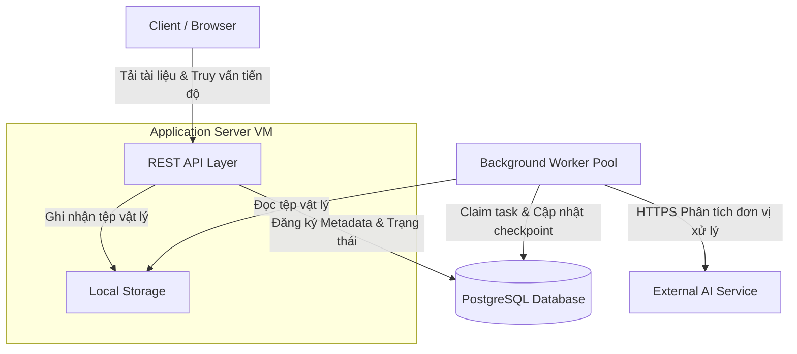
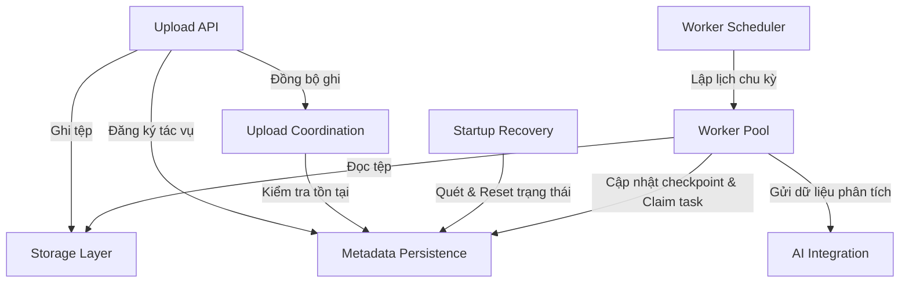
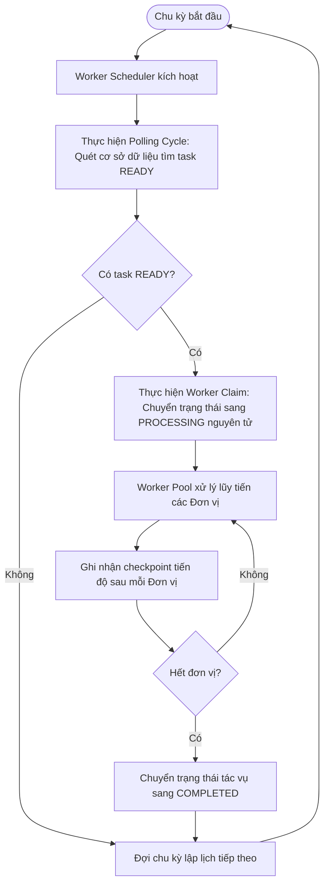
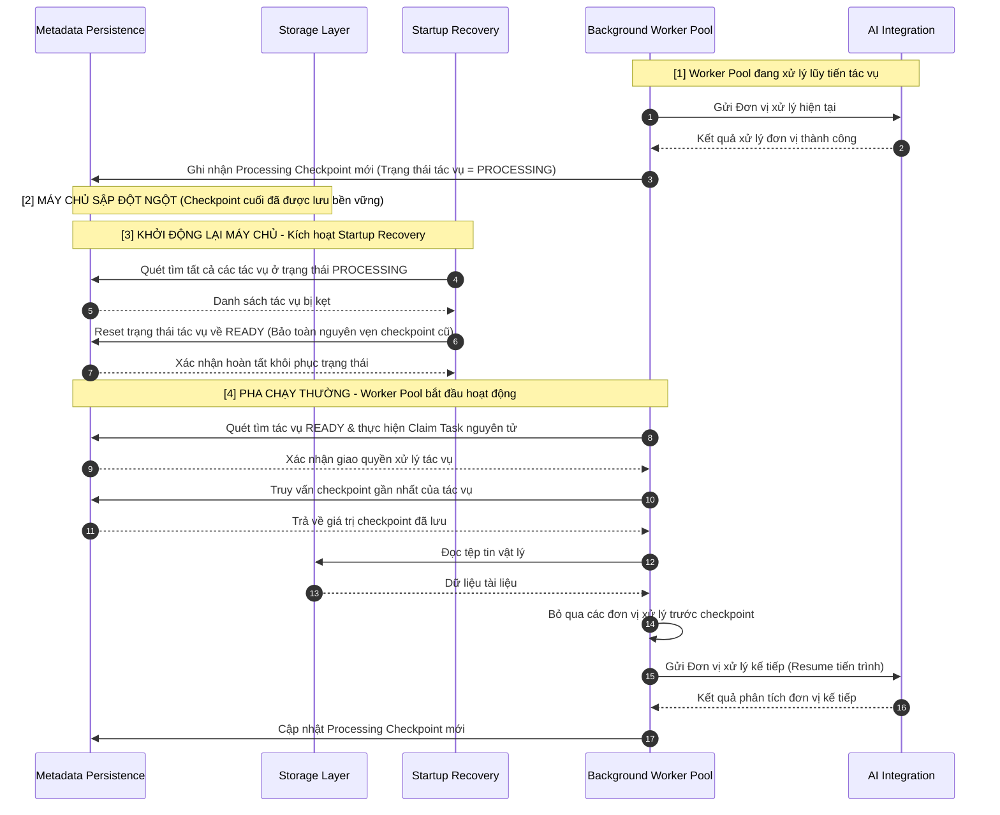
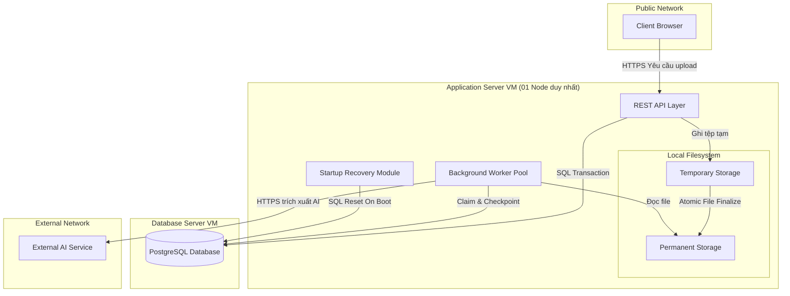
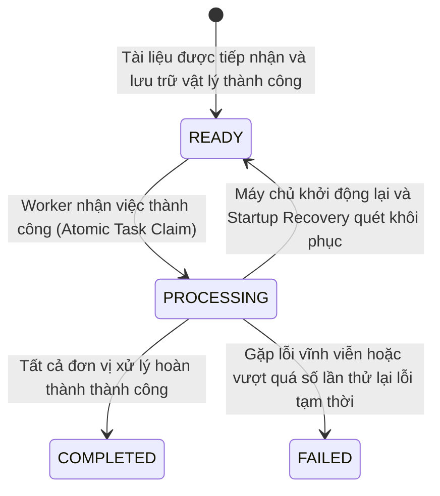

# SOFTWARE ARCHITECTURE DESIGN DOCUMENT (SADD)
*(Tuân thủ Tiêu chuẩn ISO/IEC/IEEE 42010)*

**Hệ Thống Xử Lý Tài Liệu Bất Đồng Bộ và Tự Phục Hồi Độ Tin Cậy Cao**  
*(Resilient & Asynchronous Document Processing System)*

---

## 1. Thông tin Tài liệu (Document Metadata)

| Thuộc tính | Giá trị |
| :--- | :--- |
| **Tiêu đề Tài liệu** | Tài liệu Thiết kế Kiến trúc Phần mềm (SADD) |
| **Mã Tài liệu** | ADD-001 |
| **Phiên bản** | 2.0 |
| **Trạng thái** | Phê duyệt (Approved) |
| **Tác giả** | [Kiến trúc sư Giải pháp Cấp cao] |
| **Ngày cập nhật** | 2026-07-31 |

---

## 2. Lịch sử Thay đổi (Revision History)

| Phiên bản | Ngày | Tác giả | Mô tả Thay đổi |
| :--- | :--- | :--- | :--- |
| 1.0 | 2026-07-29 | [Kiến trúc sư Giải pháp Cấp cao] | Phiên bản đầu tiên dựa trên yêu cầu ban đầu. |
| 2.0 | 2026-07-31 | [Kiến trúc sư Giải pháp Cấp cao] | Cập nhật toàn bộ kiến trúc để phù hợp với PRD v2.0. Loại bỏ cơ chế Watchdog Service và nhịp tim (heartbeat). Đơn giản hóa mô hình khôi phục sự cố thông qua tiến trình quét và đưa trạng thái `PROCESSING` về `READY` khi khởi động lại máy chủ (Startup Recovery). Đồng nhất các thuật ngữ nghiệp vụ (Đơn vị xử lý, Vị trí xử lý). Loại bỏ các chi tiết triển khai chi tiết thuộc Detailed Design. |

---

## 3. Mục lục (Table of Contents)

- [1. Thông tin Tài liệu (Document Metadata)](#1-thông-tin-tài-liệu-document-metadata)
- [2. Lịch sử Thay đổi (Revision History)](#2-lịch-sử-thay-đổi-revision-history)
- [3. Mục lục (Table of Contents)](#3-mục-lục-table-of-contents)
- [4. Thuật ngữ và Định nghĩa (Glossary)](#4-thuật-ngữ-và-định-nghĩa-glossary)
- [5. Architectural Background & Context (Bối cảnh & Ràng buộc Kiến trúc)](#5-architectural-background--context-bối-cảnh--ràng-buộc-kiến-trúc)
- [6. Context View (Góc nhìn Bối cảnh)](#6-context-view-góc-nhìn-bối-cảnh)
- [7. Logical / Component View (Góc nhìn Hợp phần logic)](#7-logical--component-view-góc-nhìn-hợp-phần-logic)
- [8. Process View (Góc nhìn Tiến trình)](#8-process-view-góc-nhìn-tiến-trình)
- [9. Deployment View (Góc nhìn Triển khai)](#9-deployment-view-góc-nhìn-triển-khai)
- [10. Information View (Góc nhìn Thông tin)](#10-information-view-góc-nhìn-thông-tin)
- [11. Quy tắc Bất biến Kiến trúc (Architectural Invariants)](#11-quy-tắc-bất-biến-kiến-trúc-architectural-invariants)
- [12. Hồ sơ Quyết định Kiến trúc (Architectural Decision Records - ADR)](#12-hồ-sơ-quyết-định-kiến-trúc-architectural-decision-records---adr)
- [13. Rủi ro Kiến trúc và Đánh đổi (Architectural Risks & Trade-offs)](#13-rủi-ro-kiến-trúc-và-đánh-đổi-architectural-risks--trade-offs)
- [14. Ánh xạ Thuộc tính Chất lượng & Bảng Truy vết (Quality Attributes Mapping & Traceability Matrix)](#14-ánh-xạ-thuộc-tính-chất-lượng--bảng-truy-vết-quality-attributes-mapping--traceability-matrix)

---

## 4. Thuật ngữ và Định nghĩa (Glossary)

*   **Tài liệu (Document)**: Tệp tin tài liệu chứa thông tin nghiệp vụ do khách hàng tải lên hệ thống để phân tích và trích xuất.
*   **Đơn vị xử lý (Processing Unit)**: Đơn vị nhỏ nhất có thể xử lý và ghi nhận tiến độ độc lập của một tài liệu (ví dụ: từng trang hoặc các phân đoạn dữ liệu độc lập).
*   **Vị trí xử lý thành công (Processing Checkpoint)**: Chỉ số đại diện cho đơn vị xử lý cuối cùng đã được phân tích thành công và ghi nhận bền vững.
*   **Hàng đợi Tác vụ (Task Queue)**: Hàng đợi lưu trữ trạng thái của các tác vụ xử lý tài liệu trong cơ sở dữ liệu.
*   **Trạng thái Bền vững (Durable State)**: Trạng thái của tác vụ được duy trì bền vững trong cơ sở dữ liệu quan hệ (bao gồm các trạng thái: READY, PROCESSING, COMPLETED, FAILED).
*   **Vùng lưu trữ tạm thời (Temporary Storage)**: Vùng lưu trữ đệm cục bộ dùng để lưu trữ tạm thời các tệp tin trong quá trình tải lên trước khi kiểm tra tính toàn vẹn.
*   **Vùng lưu trữ chính thức (Permanent Storage)**: Vùng lưu trữ cục bộ dùng để lưu trữ vĩnh viễn các tệp tin đã hoàn thành xác thực và sẵn sàng xử lý.
*   **Khôi phục khi khởi động (Startup Recovery)**: Quá trình hệ thống tự động quét và thu hồi các tác vụ đang bị xử lý dở dang khi khởi động lại máy chủ ứng dụng để chuẩn bị cho việc xử lý tiếp tục.
*   **Tiếp tục xử lý (Resume)**: Khả năng hệ thống khôi phục tiến trình xử lý từ đơn vị tiếp theo của vị trí checkpoint đã lưu, tránh phải xử lý lại từ đầu tài liệu.
*   **Xử lý ít nhất một lần (At-least-once Processing)**: Đảm bảo mọi đơn vị xử lý của tài liệu đã được tiếp nhận đều phải được xử lý thành công ít nhất một lần.

---

## 5. Architectural Background & Context (Bối cảnh & Ràng buộc Kiến trúc)

### 5.1. Nguyên tắc Kiến trúc (Architecture Principles)
*   **Tách biệt Luồng Tiếp nhận và Xử lý (Asynchronous Decoupling)**: Luồng đồng bộ của API tiếp nhận tài liệu và luồng bất đồng bộ của Worker xử lý tài liệu được phân tách hoàn toàn thông qua cơ sở dữ liệu làm vùng đệm, bảo vệ hệ thống khỏi nghẽn luồng kết nối HTTP.
*   **Ghi nhận Tiến độ Lũy tiến (Progressive Checkpointing)**: Ghi nhận trạng thái xử lý sau mỗi Đơn vị xử lý thành công và cập nhật Processing Checkpoint bền vững theo hướng tăng tiến một chiều.
*   **Nguồn Dữ liệu Tin cậy Duy nhất (Single Source of Truth)**: Cơ sở dữ liệu quan hệ là nơi duy nhất quản lý trạng thái xử lý nghiệp vụ, metadata tài liệu và tiến độ xử lý.
*   **Xử lý Lũy đẳng (Idempotent Processing)**: Thiết kế việc gửi yêu cầu xử lý đến dịch vụ ngoại vi phải đảm bảo tính lũy đẳng dựa trên định danh tài liệu và đơn vị xử lý để tránh dư thừa hoặc trùng lặp dữ liệu khi phải xử lý lại.
*   **Thất bại Sớm (Fail Fast)**: Thực hiện kiểm tra tính toàn vẹn, định dạng và kích thước tài liệu ngay tại lớp API tiếp nhận để loại bỏ sớm các tệp không hợp lệ, tránh gây lãng phí tài nguyên xử lý nền.
*   **Xử lý ít nhất một lần (At-least-once Processing)**: Đảm bảo mọi tài liệu được tiếp nhận thành công phải đi đến trạng thái cuối cùng (COMPLETED hoặc FAILED), chấp nhận việc chạy lại đơn vị xử lý bị gián đoạn chưa kịp ghi nhận checkpoint.
*   **Tính Bền vững trước Phản hồi (Durability-First)**: Tài liệu gốc phải được ghi nhận an toàn vào hệ thống lưu trữ bền vững trước khi hệ thống trả về mã định danh Document ID cho client.

### 5.2. Ràng buộc Kiến trúc (Architectural Constraints)
*   **Triển khai trên Máy chủ Đơn (Single-server Deployment)**: Hệ thống REST API và Background Worker Pool được chạy chung trên một máy chủ ứng dụng duy nhất. Không sử dụng thiết kế phân tán đa node cho ứng dụng.
*   **Vùng Lưu trữ Cục bộ Duy nhất**: Hệ thống sử dụng lưu trữ tệp tin cục bộ trên cùng một máy chủ ứng dụng. Không sử dụng lưu trữ mạng phân tán.
*   **Không sử dụng Message Broker Ngoại vi**: Không tích hợp các hệ thống hàng đợi độc lập ngoài để truyền tin. Việc truyền tin và hàng đợi tác vụ được hiện thực hóa qua cơ sở dữ liệu.
*   **Không sử dụng Cache Phân tán**: Không sử dụng các in-memory grid ngoài đĩa cứng.
*   **Cơ chế Giám sát Worker Ngoại vi ngoài Phạm vi**: Hệ thống không yêu cầu Watchdog độc lập hoặc cơ chế nhịp tim phát hiện worker treo trong thời gian chạy (runtime). Khả năng tự phục hồi lỗi dừng tiến trình chỉ thực hiện sau khi máy chủ khởi động lại.
*   **Công nghệ Phê duyệt**: Hệ thống phải được triển khai sử dụng ngôn ngữ Java, framework Spring Boot và cơ sở dữ liệu PostgreSQL.

### 5.3. Giả định Kiến trúc (Architectural Assumptions)
*   **Tính toàn vẹn của Lưu trữ Cục bộ**: Thư mục lưu trữ cục bộ trên máy chủ ứng dụng đảm bảo tốc độ đọc/ghi I/O ổn định trong điều kiện hoạt động bình thường.
*   **Tính phân rã của Tài liệu**: Tất cả tài liệu đầu vào có thể phân tách thành các Đơn vị xử lý tuần tự độc lập và có thể xử lý riêng biệt.
*   **Tính ACID của PostgreSQL**: Cơ sở dữ liệu PostgreSQL hoạt động ổn định và hỗ trợ đầy đủ các giao dịch ACID cùng cơ chế kiểm soát đồng thời để đảm bảo đồng nhất trạng thái.
*   **Dịch vụ Ngoại vi hỗ trợ Lũy đẳng**: Dịch vụ API AI ngoại vi hỗ trợ xử lý trùng lặp hoặc hệ thống có cơ chế bảo vệ để việc gọi lại đơn vị xử lý dở dang không gây ra lỗi logic nghiệp vụ.
*   **Tự khởi động của Hệ thống**: Máy chủ ứng dụng được cấu hình tự động khởi chạy lại sau khi hệ thống phần cứng/máy chủ vật lý khởi động lại thành công.

---

## 6. Context View (Góc nhìn Bối cảnh)

### 6.1. Mục đích (Purpose)
Góc nhìn Bối cảnh thiết lập ranh giới hệ thống, định nghĩa các thực thể bên ngoài tương tác với hệ thống và luồng thông tin mức cao đi qua hệ thống.

### 6.2. Đối tượng liên quan (Stakeholders)
*   **Người dùng cuối (Client)**: Yêu cầu phản hồi tiếp nhận tài liệu tức thì, theo dõi tiến độ xử lý và tính toàn vẹn dữ liệu.
*   **Đội ngũ Vận hành (Operations)**: Cần cơ chế triển khai đơn giản, tự phục hồi khi có sự cố mà không cần can thiệp thủ công phức tạp.
*   **Chủ sở hữu nghiệp vụ (Business Owner)**: Quan tâm đến chi phí sử dụng dịch vụ AI ngoại vi và tính an toàn của dữ liệu doanh nghiệp.

### 6.3. Mối quan tâm (Concerns)
*   Xác định rõ ràng ranh giới và tương tác của hệ thống với các dịch vụ bên ngoài.
*   Bảo đảm hiệu năng tiếp nhận yêu cầu độc lập với tiến độ xử lý nền.

### 6.4. Sơ đồ Bối cảnh Hệ thống (System Context Diagram)
Dưới đây là sơ đồ bối cảnh hệ thống mô tả tương tác giữa Client, REST API, hệ thống lưu trữ và cơ sở dữ liệu trên máy chủ ứng dụng đơn lẻ cùng dịch vụ AI ngoại vi:



### 6.5. Mô tả dòng chảy thông tin (Description)
1.  **Client** gửi yêu cầu tải tài liệu đồng bộ đến **REST API Layer**.
2.  **REST API Layer** thực hiện lưu trữ tệp vật lý vào **Local Storage** (gồm Temporary Storage và Permanent Storage) và ghi nhận metadata cùng Durable State vào **PostgreSQL Database**.
3.  **Client** nhận phản hồi tức thì kèm mã định danh tác vụ và định kỳ truy vấn trạng thái xử lý qua API.
4.  **Background Worker Pool** chạy ngầm, quét tìm tác vụ READY, đọc tài liệu từ **Local Storage**, điều phối gọi phân tích từng đơn vị xử lý qua **External AI Service**, và liên tục cập nhật checkpoint tiến độ vào **PostgreSQL Database**.

---

## 7. Logical / Component View (Góc nhìn Hợp phần logic)

### 7.1. Mục đích (Purpose)
Góc nhìn Hợp phần mô tả cấu trúc tĩnh của hệ thống, định nghĩa các thành phần kiến trúc, trách nhiệm của chúng, các mối liên kết phụ thuộc và giao thức giao tiếp (interface) giữa chúng.

### 7.2. Đối tượng liên quan & Mối quan tâm (Stakeholders & Concerns)
*   **Đội ngũ Phát triển & QA**: Cần cấu trúc phân rã rõ ràng để phát triển song song các hợp phần độc lập và viết kịch bản kiểm thử tích hợp dựa trên các interface được xác định rõ ràng.
*   **Kiến trúc sư phần mềm**: Đảm bảo ranh giới kiến trúc rõ ràng thông qua Task Queue bền vững, triệt tiêu các phụ thuộc vòng.

### 7.3. Sơ đồ Kiến trúc Thành phần (Component Diagram)
Sơ đồ dưới đây thể hiện mối quan hệ phụ thuộc một chiều giữa các hợp phần kiến trúc tĩnh:



### 7.4. Chi tiết các Hợp phần Kiến trúc (Component Details)

*   **Upload API**:
    *   *Trách nhiệm*: Tiếp nhận yêu cầu tải tài liệu từ Client, thực hiện kiểm tra tính hợp lệ sơ bộ của tài liệu và điều phối luồng tiếp nhận.
    *   *Phụ thuộc*: Storage Layer, Upload Coordination, Metadata Persistence.
    *   *Interface*: Tiếp nhận yêu cầu HTTP từ Client; sử dụng File System Interface và Persistence Interface.
*   **Upload Coordination**:
    *   *Trách nhiệm*: Thực thi kiểm soát trong vùng tranh chấp (Critical Section) nhằm đảm bảo tại cùng một thời điểm chỉ có một request được phép quyết định việc tạo metadata cho cùng một tài liệu.
    *   *Phụ thuộc*: Metadata Persistence.
    *   *Interface*: Cung cấp Transaction Interface điều phối tranh chấp đồng thời cho Upload API.
*   **Metadata Persistence**:
    *   *Trách nhiệm*: Đảm bảo tính nhất quán dữ liệu quan hệ, quản lý các giao dịch ghi nhận metadata tài liệu, quản lý Durable State và tiến độ checkpoint của tác vụ trong cơ sở dữ liệu PostgreSQL.
    *   *Phụ thuộc*: Hệ quản trị cơ sở dữ liệu quan hệ.
    *   *Interface*: Cung cấp các API lưu trữ metadata, cập nhật trạng thái tác vụ, ghi nhận checkpoint tiến độ, và truy vấn trạng thái.
*   **Startup Recovery**:
    *   *Trách nhiệm*: Quét dọn và khôi phục các tác vụ dở dang khi hệ thống khởi động lại sau sự cố sập nguồn. Hoạt động độc lập và độc quyền trong pha khởi động.
    *   *Phụ thuộc*: Metadata Persistence.
    *   *Interface*: Sử dụng Transaction Interface để quét và cập nhật trạng thái tác vụ.
*   **Worker Scheduler**:
    *   *Trách nhiệm*: Lập lịch và điều phối các chu kỳ thăm dò (Polling Cycle) tác vụ mới ở trạng thái READY trong cơ sở dữ liệu.
    *   *Phụ thuộc*: Worker Pool.
    *   *Interface*: Kích hoạt chu kỳ quét của Worker Pool.
*   **Worker Pool**:
    *   *Trách nhiệm*: Quản lý nhóm luồng xử lý nền thực hiện nhận tác vụ nguyên tử, đọc tài liệu từ Permanent Storage và điều phối gửi phân tích trích xuất dữ liệu lũy tiến.
    *   *Phụ thuộc*: Storage Layer, Metadata Persistence, AI Integration.
    *   *Interface*: Sử dụng Persistence Interface để claim task và lưu checkpoint; sử dụng File Interface để đọc tệp tin.
*   **AI Integration**:
    *   *Trách nhiệm*: Đóng gói phân đoạn dữ liệu của Đơn vị xử lý và gửi yêu cầu phân tích trích xuất thông tin đến dịch vụ AI ngoại vi thông qua kết nối mạng bảo mật.
    *   *Phụ thuộc*: External AI Service.
    *   *Interface*: Cung cấp phân tích trích xuất dữ liệu; sử dụng HTTPS Client Interface kết nối dịch vụ ngoài.
*   **Storage Layer**:
    *   *Trách nhiệm*: Quản lý tệp tin vật lý trên ổ đĩa cục bộ, bao gồm việc ghi tệp tạm thời vào Temporary Storage, finalized tệp chính thức vào Permanent Storage (Atomic File Finalize) và thu dọn tệp mồ côi.
    *   *Phụ thuộc*: Hệ thống tệp tin cục bộ.
    *   *Interface*: Cung cấp File Read/Write Interface và Atomic File Finalize Interface.

### 7.5. Interface giữa các Hợp phần (Interfaces)

Bảng dưới đây mô tả rõ ràng các giao tiếp dữ liệu chính thức giữa các thành phần kiến trúc:

| Component Cung cấp Interface | Component Sử dụng Interface | Kiểu Dữ liệu / Thông điệp truyền tải | Ý nghĩa Nghiệp vụ |
| :--- | :--- | :--- | :--- |
| **Storage Layer** | **Upload API** | Tài liệu nhị phân (Document Binary Data) | Ghi nhận tệp tin tạm thời vào Temporary Storage. |
| **Metadata Persistence** | **Upload API** | Metadata tài liệu (Document Metadata) | Đăng ký thông tin tài liệu mới vào cơ sở dữ liệu. |
| **Metadata Persistence** | **Upload API / Startup Recovery** | Trạng thái tác vụ (Durable State) | Thiết lập hoặc khôi phục trạng thái khởi tạo `READY` cho tác vụ. |
| **Metadata Persistence** | **Worker Pool** | Tác vụ Sẵn sàng (READY Task) | Thăm dò và nhận quyền xử lý tác vụ nguyên tử (Claim Task). |
| **Storage Layer** | **Worker Pool** | Đường dẫn tệp tin chính thức (Document File Path) | Cho phép worker đọc tệp tin vật lý để thực hiện phân tích. |
| **AI Integration** | **Worker Pool** | Đơn vị xử lý (Processing Unit payload) | Gửi phân đoạn dữ liệu của tài liệu để phân tích ngoại vi. |
| **Metadata Persistence** | **Worker Pool** | Checkpoint xử lý (Processing Checkpoint value) | Cập nhật vị trí xử lý thành công lũy tiến sau mỗi đơn vị. |
| **AI Integration** | **External AI Service** | Kết quả phân tích (Processing Result data) | Tiếp nhận kết quả trích xuất thông tin để tổng hợp. |

---

## 8. Process View (Góc nhìn Tiến trình)

### 8.1. Mục đích & Mối quan tâm (Purpose & Concerns)
Góc nhìn Tiến trình mô tả động học của hệ thống khi vận hành, tập trung vào cơ chế phối hợp xử lý bất đồng bộ, lập lịch Worker, kịch bản lỗi và cơ chế tự phục hồi. Mục tiêu là đảm bảo không xảy ra tình trạng bế tắc (deadlock) hoặc tranh chấp giao dịch khi nhiều worker hoạt động song song.

### 8.2. Phối hợp Điều phối Worker (Worker Scheduler Coordination Flow)
Hệ thống điều phối việc quét và nhận việc của Background Worker Pool thông qua một quy trình lập lịch tuần tự và khép kín:



*Mô tả*: Worker Scheduler liên tục thực hiện các chu kỳ thăm dò (Polling Cycle) dưới nền. Khi phát hiện tác vụ hợp lệ, thao tác nhận việc (Worker Claim) được bảo vệ bằng giao dịch biệt lập mức cơ sở dữ liệu để đảm bảo tính độc quyền. Mỗi luồng worker sau đó độc lập xử lý và ghi checkpoint trước khi hoàn tất (Completion).

### 8.3. Kiến trúc Startup Recovery (Khôi phục lúc khởi động)
Startup Recovery là một module đặc thù được tích hợp vào tiến trình khởi động của ứng dụng, hoạt động như một rào cản kiến trúc (Architectural Barrier):

```text
Application Startup
        │
        ▼
[Startup Recovery Phase] ─── (Độc quyền: Worker Pool chưa khởi chạy)
        │
        ▼
Scan CSDL & reset tác vụ PROCESSING về READY
        │
        ▼
[Normal Runtime Phase] ───── (Worker Pool bắt đầu quét CSDL nhận việc)
```

**Ràng buộc kiến trúc cốt lõi**:
1.  **Kích hoạt sớm**: Module Startup Recovery bắt buộc phải được kích hoạt tự động và thực thi hoàn tất trong pha khởi chạy máy chủ ứng dụng (Application Startup).
2.  **Tính Loại trừ Lẫn nhau (Mutual Exclusion)**: Startup Recovery phải kết thúc toàn bộ quá trình quét dọn và thiết lập trạng thái trước khi Background Worker Pool bắt đầu thực hiện chu kỳ Polling đầu tiên. Startup Recovery và Worker Pool tuyệt đối không được hoạt động song song trong giai đoạn khởi động nhằm tránh race condition trên dữ liệu dở dang.

### 8.4. Sơ đồ tuần tự khôi phục (Resume Sequence Diagram)
Sơ đồ tuần tự dưới đây mô tả sự tương tác ở mức kiến trúc giữa các hợp phần trong kịch bản xử lý lũy tiến, gặp sự cố sập nguồn đột ngột và khôi phục resume:



### 8.5. Ma trận Kịch bản Lỗi (Failure Scenarios Matrix)

| Loại Sự cố | Phương thức Phát hiện | Cơ chế Khôi phục Kiến trúc |
| :--- | :--- | :--- |
| **Sập máy chủ / Crash tiến trình** | Phát hiện khi máy chủ ứng dụng khởi động lại. | Startup Recovery quét cơ sở dữ liệu lúc khởi động -> Đưa tất cả tác vụ `PROCESSING` về `READY` -> Giữ nguyên vị trí checkpoint đã lưu -> Worker mới nhận việc sẽ xử lý tiếp tục (Resume). *Lưu ý: Startup Recovery và Worker không chạy song song ở pha này.* |
| **Lỗi kết nối dịch vụ ngoại vi tạm thời** | Worker bắt được ngoại lệ kết nối/Timeout hoặc nhận thông báo lỗi tạm thời (Rate Limit Error, Server Error) từ AI Service. | Giữ nguyên trạng thái `PROCESSING` -> Áp dụng chính sách thử lại với khoảng thời gian chờ tăng dần của Worker -> Nếu vượt quá số lần thử tối đa, chuyển trạng thái sang `FAILED` và ghi log nguyên nhân. |
| **Lỗi tài liệu hỏng cấu trúc vĩnh viễn** | Thư viện xử lý báo lỗi phân tích tệp hoặc dịch vụ ngoại vi trả về lỗi định dạng nội dung không thể đọc (Client Error). | Dừng xử lý ngay lập tức -> Chuyển trạng thái tác vụ sang `FAILED` -> Ghi nhận nguyên nhân lỗi chi tiết phục vụ truy vết. |
| **Lỗi kết nối CSDL tạm thời khi Worker đang chạy** | Worker gặp ngoại lệ kết nối DB khi cố gắng cập nhật checkpoint hoặc claim task. | Luồng xử lý tạm dừng -> Worker thực hiện thử lại kết nối DB -> Khi DB khả dụng trở lại, tiếp tục cập nhật checkpoint. |
| **Lỗi ghi DB khi tải tệp lên (Upload API)** | Lớp API tiếp nhận gặp lỗi rollback giao dịch khi thực hiện lưu metadata tài liệu. | Rollback giao dịch database -> Kích hoạt dọn dẹp (Compensating Cleanup) để xóa tệp tin vừa lưu trong Permanent Storage -> Trả về mã lỗi cho Client. |
| **Lỗi dọn dẹp tệp tin vật lý lúc upload thất bại** | API không thể xóa file vật lý do quyền truy cập hoặc hệ thống bận. | File tạm bị bỏ lại đĩa -> Tiến trình Storage Cleanup quét định kỳ dưới nền sẽ phát hiện tệp mồ côi (không có metadata tham chiếu trong DB) và thực hiện xóa sau khi hết thời gian chờ an toàn (Configurable Retention Period). |
| **Sập máy chủ khi đang ghi Checkpoint dở dang** | Worker gửi kết quả AI thành công nhưng máy chủ sập trước khi giao dịch ghi checkpoint hoàn thành. | Trạng thái tác vụ vẫn là `PROCESSING`, checkpoint trong DB chưa tăng. Sau khi khởi động lại, Startup Recovery reset trạng thái về `READY` -> Worker mới nhận việc sẽ xử lý lại đơn vị dở dang này. Tính lũy đẳng của AI Integration bảo vệ hệ thống khỏi sai lệch dữ liệu. |
| **Tắt ứng dụng an toàn** | Nhận tín hiệu dừng tiến trình an toàn (Graceful Shutdown signal). | Worker Pool dừng nhận tác vụ `READY` mới -> Cho phép các luồng đang chạy hoàn tất đơn vị xử lý hiện tại và commit checkpoint -> Dừng ứng dụng. Các tác vụ chưa hoàn tất toàn bộ sẽ được khôi phục an toàn ở lần khởi động tiếp theo qua Startup Recovery. |

---

## 9. Deployment View (Góc nhìn Triển khai)

### 9.1. Mục đích (Purpose)
Góc nhìn Triển khai mô tả cấu trúc vật lý của hệ thống, chỉ rõ cách các hợp phần phần mềm phân bố trên hạ tầng phần cứng và tương tác vật lý.

### 9.2. Sơ đồ Triển khai (Deployment Diagram)



### 9.3. Cơ chế Co giãn Hiệu năng (Vertical Concurrency Scaling)
*   Hệ thống không hỗ trợ co giãn ngang (horizontal scaling) đa node cho máy chủ ứng dụng do ràng buộc về Local Storage.
*   Để tăng hiệu năng xử lý đồng thời, hệ thống sử dụng cơ chế co giãn dọc (vertical scaling) bằng cách cấu hình số lượng luồng thực thi tối đa (bounded thread pool) của Background Worker Pool chạy trên máy chủ.
*   Tải xử lý đồng thời tối đa bị giới hạn bởi: năng lực xử lý CPU của máy chủ, băng thông I/O của đĩa cứng cục bộ, băng thông mạng kết nối với dịch vụ ngoại vi và giới hạn tần suất gọi của External AI Service.

---

## 10. Information View (Góc nhìn Thông tin)

### 10.1. Mục đích (Purpose)
Góc nhìn Thông tin định nghĩa cấu trúc dữ liệu bền vững, vòng đời trạng thái của các thực thể và mô hình thông tin điều phối trong hệ thống.

### 10.2. Vòng đời Trạng thái Tác vụ (Task State Lifecycle)
Mỗi tác vụ xử lý tài liệu trong hệ thống được quản lý thông qua các trạng thái bền vững sau:



*   **READY**: Trạng thái ban đầu, tài liệu đã nằm an toàn trong Permanent Storage và metadata đã đăng ký. Sẵn sàng để Worker Pool tranh chấp nhận việc. Hoặc tác vụ dở dang được thu hồi bởi Startup Recovery.
*   **PROCESSING**: Worker đang sở hữu độc quyền tác vụ và tiến hành gửi dữ liệu phân tích lũy tiến.
*   **COMPLETED**: Trạng thái thành công cuối cùng của tài liệu. Kết quả trích xuất đã được tổng hợp bền vững.
*   **FAILED**: Trạng thái lỗi cuối cùng. Tác vụ bị dừng do gặp lỗi không thể sửa đổi hoặc đã thử lại quá giới hạn cho phép.

### 10.3. Chiến lưu trữ & Mô hình Thông tin (Data Persistence Strategy)
Dữ liệu hệ thống phân rã thành hai luồng độc lập:
1.  **Dữ liệu Nhị phân (Binary Data)**: Tài liệu gốc được lưu trực tiếp trên Local Storage của đĩa cứng máy chủ (Temporary Storage và Permanent Storage).
2.  **Dữ liệu Quan hệ (Relational Metadata & Durable State)**:
    *   *Document Metadata*: Lưu thông tin định danh duy nhất (Document ID), đường dẫn tệp chính thức trong Storage, bộ phận gửi, và trạng thái hiện tại (Durable State).
    *   *Processing Checkpoint*: Ghi nhận tổng số đơn vị xử lý (`Total Processing Units`) và vị trí xử lý thành công gần nhất (`Processing Checkpoint value`).
    *   *Error Control*: Số lần đã thử lại khi gặp lỗi tạm thời (`Retry Count`).
    *   *Analysis Result*: Kết quả trích xuất thông tin tổng hợp cuối cùng.

---

## 11. Quy tắc Bất biến Kiến trúc (Architectural Invariants)

Hệ thống phải tuân thủ tuyệt đối các quy tắc bất biến sau tại mọi thời điểm vận hành để bảo vệ tính toàn vẹn dữ liệu và an toàn xử lý:

1.  **Chỉ nhận việc khi Sẵn sàng**: Chỉ các tác vụ ở trạng thái `READY` mới được phép quét và nhận quyền xử lý độc quyền bởi các luồng của Worker Pool.
2.  **Tệp tin đi trước Trạng thái**: Không một tác vụ nào được phép chuyển sang trạng thái `READY` trong cơ sở dữ liệu trước khi tệp tin tương ứng của nó đã được ghi nhận an toàn và hoàn tất (Atomic File Finalize) trong Permanent Storage.
3.  **Checkpoint tăng tiến một chiều**: Vị trí xử lý thành công (`Processing Checkpoint`) chỉ được phép cập nhật tăng lũy tiến, tuyệt đối không được phép giảm đi hoặc reset về 0 trong suốt vòng đời xử lý và phục hồi của tác vụ.
4.  **Bảo toàn checkpoint khi Khôi phục**: Tiến trình Startup Recovery khi quét và reset trạng thái tác vụ từ `PROCESSING` về `READY` tuyệt đối không được phép thay đổi giá trị `Processing Checkpoint` đang lưu trữ.
5.  **Một Hệ thống tệp duy nhất**: Vùng Temporary Storage và Permanent Storage bắt buộc phải được đặt trên cùng một mount phân vùng đĩa vật lý để đảm bảo thao tác di chuyển tệp là nguyên tử.
6.  **Trạng thái Cuối là Bất biến**: Các tác vụ đã đạt trạng thái cuối là `COMPLETED` hoặc `FAILED` sẽ không bao giờ bị thay đổi trạng thái bởi bất kỳ tiến trình tự động nào.
7.  **Không xử lý tệp tạm**: Background Worker tuyệt đối không được đọc hoặc xử lý tài liệu khi tệp đang nằm trong Temporary Storage.
8.  **Dọn dẹp tệp an toàn**: Tiến trình dọn dẹp tệp mồ côi bắt buộc phải áp dụng một khoảng thời gian chờ an toàn (Configurable Retention Period) trước khi thực hiện xóa để tránh xung đột với các yêu cầu đang tải lên đồng thời.

---

## 12. Hồ sơ Quyết định Kiến trúc (Architectural Decision Records - ADR)

### ADR-001: Asynchronous Processing (Xử lý Bất đồng bộ)

*   **Context (Bối cảnh)**: Phân tích tài liệu thông qua dịch vụ AI bên ngoài tốn nhiều thời gian (từ vài giây đến vài phút tùy dung lượng tệp), dễ gây quá tải hệ thống nếu xử lý đồng bộ.
*   **Problem (Vấn đề)**: Làm thế nào để API tiếp nhận tài liệu phản hồi tức thì giải phóng client (p99 < 300ms) mà không chặn kết nối mạng của Web container, đồng thời vẫn đảm bảo tài liệu được xử lý đầy đủ dưới nền.
*   **Decision (Quyết định)**: Tách biệt hoàn toàn luồng tiếp nhận đồng bộ (REST API) và luồng xử lý nghiệp vụ nặng (Background Worker Pool) bằng cơ chế xử lý bất đồng bộ. REST API sau khi kiểm tra tính hợp lệ và ghi file thành công sẽ ghi nhận metadata vào DB với trạng thái `READY` và lập tức phản hồi `Document ID` cho client. Luồng Background Worker sẽ quét database và thực hiện xử lý ngầm dưới nền.
*   **Alternatives Considered (Giải pháp thay thế)**: Xử lý đồng bộ trực tiếp trên luồng HTTP request. Giải pháp này bị loại bỏ vì chắc chắn gây ra HTTP timeout đối với tài liệu lớn, làm khóa giao diện người dùng và không đáp ứng chỉ số hiệu năng API.
*   **Consequences (Hệ quả)**:
    *   *Tích cực*: Đáp ứng cam kết hiệu năng API tiếp nhận cực nhanh. Hệ thống hoạt động mượt mà, client có thể theo dõi tiến độ qua API truy vấn trạng thái độc lập.
    *   *Tiêu cực*: Phức tạp hóa luồng xử lý do phải quản lý trạng thái trung gian (`READY`, `PROCESSING`) và client phải thực hiện cơ chế polling trạng thái.
*   **Status (Trạng thái)**: Đã phê duyệt (Approved).

---

### ADR-002: Fault Recovery (Khôi phục Lỗi)

*   **Context (Bối cảnh)**: Hệ thống hoạt động trên một máy chủ đơn lẻ và có nguy cơ bị sập nguồn đột ngột hoặc dừng tiến trình JVM do lỗi hệ thống trong khi đang thực hiện xử lý dở dang các tài liệu.
*   **Problem (Vấn đề)**: Cần một cơ chế tự động khôi phục các tác vụ đang bị kẹt ở trạng thái `PROCESSING` về trạng thái có thể xử lý tiếp mà không bắt người dùng phải tải lên lại tệp tin, đồng thời tối giản hóa thiết kế theo PRD v2.0 (loại bỏ Watchdog/Heartbeat).
*   **Decision (Quyết định)**: Triển khai cơ chế **Startup Recovery (Khôi phục lúc khởi động)**. Khi ứng dụng khởi động lại sau sự cố sập nguồn, một module đặc biệt sẽ quét database để tìm tất cả các task ở trạng thái `PROCESSING`, tự động chuyển trạng thái của chúng về `READY` và bảo toàn nguyên vẹn giá trị checkpoint vị trí thành công gần nhất. Worker Pool sẽ nhận lại các task này và tiếp tục xử lý từ vị trí đã lưu.
*   **Alternatives Considered (Giải pháp thay thế)**: Giữ nguyên cơ chế Watchdog Service chạy định kỳ kết hợp nhịp tim của Worker. Phương án này bị loại bỏ vì PRD v2.0 đã chủ động đơn giản hóa sản phẩm và loại bỏ yêu cầu watchdog/heartbeat do triển khai trên máy chủ đơn không cần cơ chế phức tạp phát hiện worker treo trong runtime.
*   **Consequences (Hệ quả)**:
    *   *Tích cực*: Kiến trúc cực kỳ đơn giản, loại bỏ hoàn toàn mã nguồn và tài nguyên dành cho việc cập nhật nhịp tim liên tục vào DB, giảm tải cho PostgreSQL. Khôi phục hoàn toàn tự động khi máy chủ restart.
    *   *Tiêu cực*: Nếu một luồng worker bị treo hoặc chết trong runtime mà máy chủ không khởi động lại (ví dụ: lỗi hết bộ nhớ cục bộ của một luồng nhưng tiến trình chính vẫn sống), task đó sẽ bị kẹt ở trạng thái `PROCESSING` cho đến khi có hành động restart máy chủ ứng dụng.
*   **Status (Trạng thái)**: Đã phê duyệt (Approved).

---

### ADR-003: Metadata Persistence (Lưu trữ Bền vững Metadata)

*   **Context (Bối cảnh)**: Trạng thái và tiến trình xử lý tài liệu cần được quản lý chính xác và bền vững để phục vụ việc truy vấn trạng thái và khôi phục khi có sự cố.
*   **Problem (Vấn đề)**: Lựa chọn công nghệ và mô hình lưu trữ metadata để đảm bảo tính nhất quán giao dịch và khả năng phục hồi dữ liệu tối ưu.
*   **Decision (Quyết định)**: Lưu trữ toàn bộ metadata tài liệu, trạng thái tác vụ và vị trí checkpoint xử lý trong cơ sở dữ liệu quan hệ PostgreSQL. Sử dụng các cột quan hệ chuẩn để quản lý các thuộc tính điều phối như trạng thái tác vụ, số lần thử lại, và checkpoint vị trí xử lý.
*   **Alternatives Considered (Giải pháp thay thế)**:
    *   *Lưu trữ dạng tệp JSON trên đĩa*: Dễ bị lỗi ghi dở dang và không hỗ trợ giao dịch ACID, cực kỳ khó khăn khi thực hiện khóa dòng nguyên tử để điều phối worker.
    *   *Sử dụng NoSQL Database (MongoDB)*: Không cần thiết và vi phạm ràng buộc công nghệ được phê duyệt của dự án.
*   **Consequences (Hệ quả)**:
    *   *Tích cực*: Đảm bảo tính toàn vẹn dữ liệu tuyệt đối thông qua giao dịch ACID. Dễ dàng viết các câu lệnh truy vấn báo cáo và thực hiện Startup Recovery nguyên tử.
    *   *Tiêu cực*: Việc ghi checkpoint liên tục sau mỗi đơn vị xử lý tạo ra tải trọng ghi đáng kể lên database (cần tối ưu hóa kết nối cơ sở dữ liệu).
*   **Status (Trạng thái)**: Đã phê duyệt (Approved).

---

## 13. Rủi ro Kiến trúc và Đánh đổi (Architectural Risks & Trade-offs)

### 13.1. Rủi ro Kiến trúc (Architectural Risks)

| STT | Mô tả Rủi ro | Tác động (Impact) | Giải pháp Kiến trúc Giảm thiểu (Mitigation) |
| :--- | :--- | :--- | :--- |
| **1** | **Single Point of Failure (SPOF) trên máy chủ đơn**: Triển khai toàn bộ ứng dụng trên một máy chủ duy nhất có nguy cơ mất toàn bộ dịch vụ nếu phần cứng máy chủ gặp sự cố vật lý. | Cao (Hệ thống ngừng hoạt động hoàn toàn). | Thiết lập cơ chế tự khởi động của hệ thống ở tầng ảo hóa/máy chủ vật lý. Duy trì sao lưu (backup) cơ sở dữ liệu PostgreSQL định kỳ sang vùng lưu trữ ngoài độc lập. |
| **2** | **Phụ thuộc vào Lưu trữ Cục bộ (Local Storage)**: Đĩa cứng cục bộ bị đầy hoặc bị hỏng I/O dẫn đến việc không thể tiếp nhận tài liệu mới và hỏng tệp gốc. | Cao (Gây mất mát dữ liệu tài liệu gốc). | Triển khai cơ chế dọn dẹp tự động định kỳ các tệp mồ côi (Storage Cleanup) kết hợp giám sát dung lượng đĩa cứng mức hệ điều hành để cảnh báo sớm. |
| **3** | **Độ trễ do cơ chế thăm dò tuần hoàn (Polling Latency)**: Việc sử dụng chu kỳ quét định kỳ bằng Polling để tìm tác vụ `READY` tạo ra một độ trễ nhỏ trước khi tác vụ được xử lý ngầm. | Thấp (Tác vụ không được xử lý ngay lập tức). | Tách biệt hoàn toàn luồng API và Worker, định cấu hình chu kỳ thăm dò linh hoạt dựa trên tải trọng thực tế của hệ thống. |
| **4** | **Phụ thuộc dịch vụ AI ngoại vi (Rate limits / Network instability)**: Dịch vụ AI bên thứ ba bị quá tải tần suất gọi hoặc lỗi mạng gây gián đoạn tiến trình trích xuất. | Trung bình (Tác vụ bị kẹt lâu hoặc bị đánh dấu FAILED). | Áp dụng chính sách thử lại thông minh (Retry với Backoff) tại Worker Pool cho các lỗi tạm thời. Thiết kế xử lý lũy đẳng để tránh trùng dữ liệu khi gọi lại. |

### 13.2. Đánh đổi Kiến trúc (Architectural Trade-offs)

#### Quyết định lựa chọn: Startup Recovery thay vì Runtime Watchdog
Hệ thống lựa chọn cơ chế tự phục hồi tại thời điểm khởi động máy chủ (Startup Recovery) thay vì duy trì một dịch vụ giám sát thời gian chạy liên tục (Runtime Watchdog Service) để quản lý nhịp tim worker.

*   **Lý do lựa chọn**: Nhằm đáp ứng mục tiêu đơn giản hóa thiết kế của PRD v2.0 trên môi trường máy chủ đơn lẻ.
*   **Lợi ích**:
    *   *Tối giản hạ tầng*: Loại bỏ hoàn toàn mã nguồn của watchdog, loại bỏ các giao dịch ghi nhịp tim liên tục vào cơ sở dữ liệu, giảm tải cho PostgreSQL.
    *   *Tin cậy cao*: Phục hồi an toàn và triệt để 100% các tác vụ dở dang khi máy chủ bị crash vật lý hoặc dừng tiến trình JVM đột ngột.
*   **Hạn chế**:
    *   *Độ nhạy khôi phục*: Nếu một luồng worker đơn lẻ trong Worker Pool bị treo/chết do lỗi cục bộ mà tiến trình chính JVM vẫn sống và không khởi động lại, tác vụ đó sẽ bị kẹt ở trạng thái `PROCESSING` cho đến khi máy chủ được vận hành thủ công restart.

---

## 14. Ánh xạ Thuộc tính Chất lượng & Bảng Truy vết (Quality Attributes Mapping & Traceability Matrix)

### 14.1. Ánh xạ Thuộc tính Chất lượng
*   **Concurrency Safety (An toàn Đồng thời)**: Bảo đảm chỉ một metadata được tạo cho cùng một tài liệu, và Worker chỉ xử lý một READY tác vụ tại một thời điểm. Được bảo vệ bởi **Upload Coordination** tại tiếp nhận và **Atomic Task Claim** tại worker.
*   **Reliability (Độ tin cậy)**: Đảm bảo tài liệu gốc không bị mất mát sau khi tiếp nhận thành công. Được bảo vệ bởi **Atomic File Finalize** và ranh giới giao dịch tiếp nhận nghiêm ngặt.
*   **Recoverability (Khả năng phục hồi)**: Tự động khôi phục luồng xử lý dở dang khi khởi động lại máy chủ. Được bảo vệ bởi module **Startup Recovery** và cơ chế **Resume** lũy tiến.
*   **Performance (Hiệu năng)**: API tiếp nhận tài liệu phản hồi tức thì dưới 300ms. Được bảo vệ bởi cơ chế **Decoupling** bất đồng bộ qua hàng đợi cơ sở dữ liệu.

### 14.2. Bảng Truy vết Kiến trúc (Traceability Matrix)

Dưới đây là ma trận ánh xạ cho thấy mối liên kết và khả năng truy vết xuyên suốt từ Yêu cầu Chất lượng, Nguyên tắc Kiến trúc, Quyết định ADR đến các Hợp phần thực thi cụ thể:

| Thuộc tính Chất lượng (Quality Attribute) | Nguyên tắc Kiến trúc (Architecture Principle) | Quyết định Kiến trúc (ADR) | Thành phần Kiến trúc (Architecture Component) |
| :--- | :--- | :--- | :--- |
| **Performance** | Asynchronous Decoupling | ADR-001 | REST API Layer, Worker Scheduler, Task Queue |
| **Performance** | Tính Bền vững trước Phản hồi | ADR-001 | Upload API, Storage Layer, Metadata Persistence |
| **Recoverability** | Progressive Checkpointing | ADR-002, ADR-003 | Worker Pool, Metadata Persistence |
| **Recoverability** | Xử lý ít nhất một lần (At-least-once) | ADR-002 | Startup Recovery, Worker Pool |
| **Reliability** | Nguồn Dữ liệu Tin cậy Duy nhất | ADR-003 | Metadata Persistence, PostgreSQL Database |
| **Concurrency Safety** | Thất bại Sớm (Fail Fast) | ADR-001 | Upload API, Upload Coordination |
