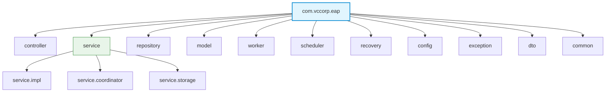
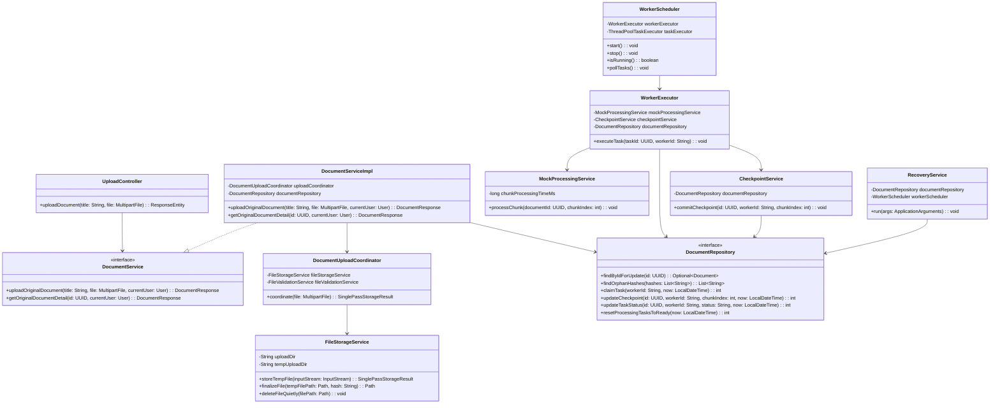
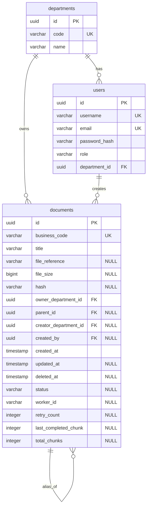
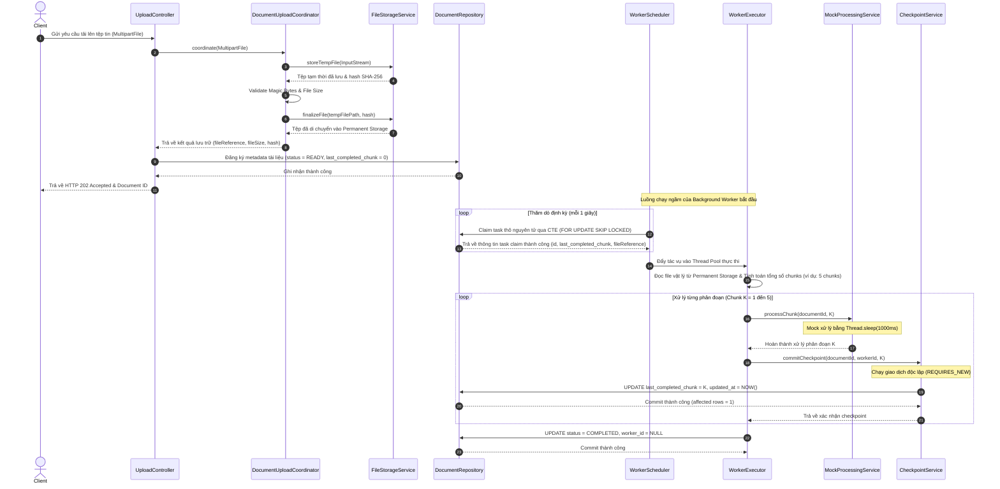
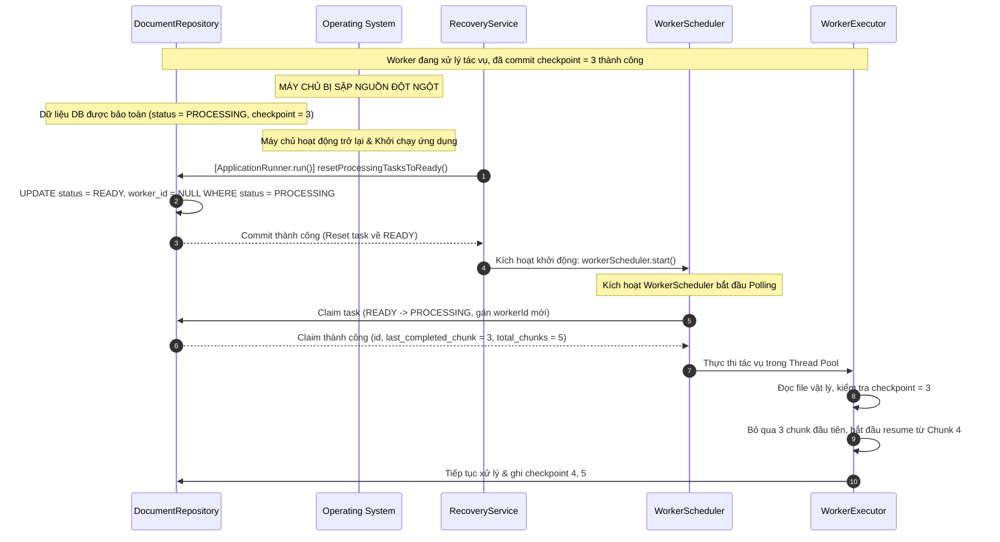
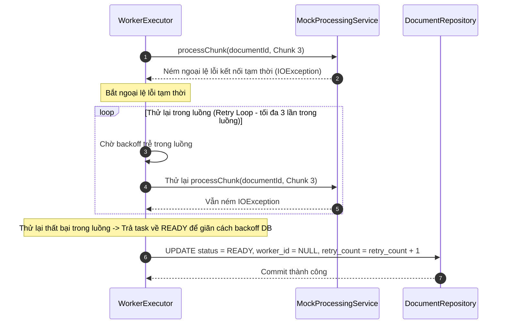
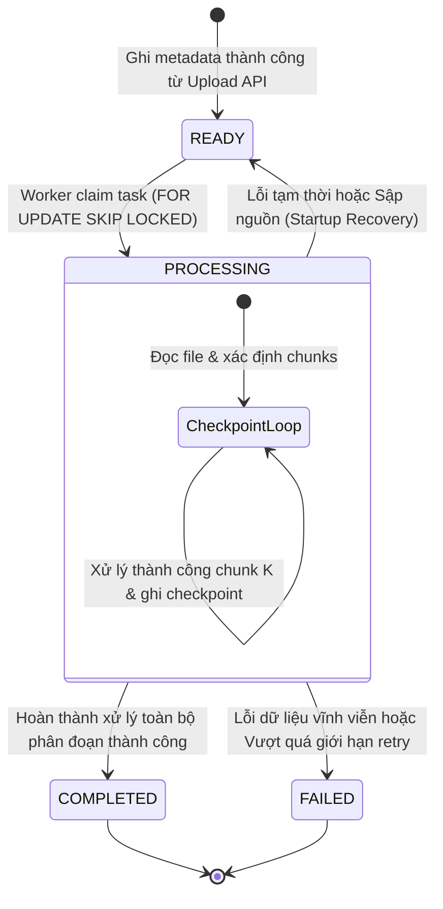

# TÀI LIỆU THIẾT KẾ CHI TIẾT (DETAILED DESIGN DOCUMENT - DDD)
**Hệ Thống Xử Lý Tài Liệu Bất Đồng Bộ và Tự Phục Hồi Độ Tin Cậy Cao (Tuần 3 - Phiên bản 2.0)**

---

## LỊCH SỬ THAY ĐỔI (REVISION HISTORY)

| Phiên bản | Ngày | Tác giả | Mô tả Thay đổi |
| :--- | :--- | :--- | :--- |
| 1.0 | 2026-07-29 | Nhóm Phát triển | Phiên bản đầu tiên dựa trên thiết kế phân tán phức tạp. |
| 2.0 | 2026-07-31 | Nhóm Phát triển | Viết lại toàn bộ từ đầu theo chuẩn IEEE 1016 và đồng bộ với SADD v2.0. Loại bỏ hoàn toàn cơ chế Watchdog, nhịp tim, lease_version và bảng outbox. Đơn giản hóa trạng thái tác vụ chỉ còn 4 trạng thái nghiệp vụ (READY, PROCESSING, COMPLETED, FAILED). Xử lý sự cố sập nguồn/crash hoàn toàn dựa trên Startup Recovery lúc khởi động máy chủ. Loại bỏ toàn bộ các đoạn mã Java và thay thế bằng các sơ đồ Mermaid chuyên sâu, SQL thô và giải thuật chi tiết. Tích hợp check constraint chk_alias_nullable đảm bảo file alias có trường điều phối nền mặc định NULL. Thiết lập các thông số Thread Pool dựa trên CPU Cores của máy chủ (9 cho CPU-bound, 20 cho IO-bound). |

---

## MỤC LỤC (TABLE OF CONTENTS)
1. [Overall Design Overview (Tổng quan thiết kế)](#1-overall-design-overview-tổng-quan-thiết-kế)
2. [Package Structure (Cấu trúc Package)](#2-package-structure-cấu-trúc-package)
3. [Class Design (Thiết kế Class)](#3-class-design-thiết-kế-class)
4. [Database Design (Thiết kế Cơ sở dữ liệu)](#4-database-design-thiết-kế-cơ-sở-dữ-liệu)
5. [Index Design (Thiết kế Index)](#5-index-design-thiết-kế-index)
6. [SQL Query Design (Thiết kế SQL Query - BẮT BUỘC)](#6-sql-query-design-thiết-kế-sql-query---bắt-buộc)
7. [Transaction Design (Thiết kế Giao dịch)](#7-transaction-design-thiết-kế-giao-dịch)
8. [Concurrency Design (Thiết kế Xử lý đồng thời)](#8-concurrency-design-thiết-kế-xử-lý-đồng-thời)
9. [Storage Design (Thiết kế Lưu trữ)](#9-storage-design-thiết-kế-lưu-trữ)
10. [Worker Design (Thiết kế Background Worker)](#10-worker-design-thiết-kế-background-worker)
11. [Startup Recovery Design (Thiết kế Phục hồi khi khởi động)](#11-startup-recovery-design-thiết-kế-phục-hồi-khi-khởi-động)
12. [Sequence Diagrams (Biểu đồ trình tự)](#12-sequence-diagrams-biểu-đồ-trình-tự)
13. [State Machine Design (Thiết kế Máy trạng thái)](#13-state-machine-design-thiết-kế-máy-trạng-thái)
14. [Error Handling Design (Thiết kế Xử lý lỗi)](#14-error-handling-design-thiết-kế-xử-lý-lỗi)
15. [Configuration Design (Thiết kế Cấu hình)](#15-configuration-design-thiết-kế-cấu-hình)
16. [Logging Design (Thiết kế Ghi nhật ký)](#16-logging-design-thiết-kế-ghi-nhật-ký)
17. [Security Design (Thiết kế Bảo mật)](#17-security-design-thiết-kế-bảo-mật)
18. [Testing Design (Thiết kế Kiểm thử)](#18-testing-design-thiết-kế-kiểm-thử)
19. [Design Decisions (Quyết định thiết kế)](#19-design-decisions-quyết-định-thiết-kế)

---

## THUẬT NGỮ VÀ ĐỊNH NGHĨA (GLOSSARY)
*   **Đơn vị xử lý (Chunk / Processing Unit)**: Phân đoạn logic nhỏ nhất của một tài liệu (ví dụ: từng trang hoặc các phân đoạn độc lập) có thể được xử lý và ghi nhận tiến độ riêng biệt.
*   **Vị trí xử lý thành công (Processing Checkpoint)**: Chỉ số đại diện cho đơn vị xử lý cuối cùng đã được phân tích thành công và ghi nhận bền vững vào DB.
*   **Phục hồi khi khởi động (Startup Recovery)**: Tiến trình quét dọn và khôi phục trạng thái dở dang (`PROCESSING` -> `READY`) khi máy chủ ứng dụng khởi chạy lại.

---

## 1. OVERALL DESIGN OVERVIEW (TỔNG QUAN THIẾT Kế)

Tài liệu này đặc tả chi tiết hiện thực ở mức mã nguồn và lược đồ cơ sở dữ liệu cho các hợp phần tĩnh và động trong SADD v2.0:

*   **REST API Layer**: Hiện thực hóa thông qua `UploadController` nhận HTTP Request và `DocumentServiceImpl` thực hiện lưu file tạm, kiểm tra nghiệp vụ và ghi nhận metadata ban đầu với trạng thái `READY`.
*   **Local Storage**: Quản lý bởi dịch vụ `FileStorageService` bằng thư viện Java NIO để ghi file tạm, kiểm tra kiểu file thực tế, di chuyển file nguyên tử hoặc Copy-Delete (fallback) vào Permanent Storage.
*   **PostgreSQL Database**: Hàng đợi tác vụ được quản lý qua interface `DocumentRepository` kế thừa `JpaRepository` của Spring Data, tích hợp các truy vấn cập nhật SQL nguyên tử bằng `JdbcTemplate` thô.
*   **Background Worker Pool**: Được cấu hình bằng `ThreadPoolTaskExecutor` của Spring. Dịch vụ `WorkerScheduler` thực hiện lập lịch polling nhiều task dựa trên năng lực luồng rảnh, và gửi thực thi song song qua `WorkerExecutor`.
*   **Startup Recovery**: Hiện thực bằng listener `RecoveryService` xử lý sự kiện khởi động nhằm reset hàng loạt tác vụ kẹt.

---

## 2. PACKAGE STRUCTURE (CẤU TRÚC PACKAGE)

Sơ đồ cấu trúc package dưới đây biểu diễn sự phân cấp các gói (package) Java trong ứng dụng dưới dạng cây (Tree Structure):



*   **`controller`**: Tiếp nhận request HTTP/HTTPS từ Client (Upload API, Status Query API).
*   **`service` & `service.impl`**: Định nghĩa và hiện thực hóa các interface nghiệp vụ quản lý vòng đời tài liệu, xử lý nền, và phục hồi.
*   **`service.coordinator`**: Điều phối phối hợp giữa lưu trữ vật lý, xác thực dữ liệu và ghi nhận DB.
*   **`service.storage`**: Quản lý đọc/ghi đĩa cục bộ, dọn dẹp file tạm, di chuyển file vật lý nguyên tử hoặc Copy-Delete fallback.
*   **`worker`**: Quản lý vòng đời chạy ngầm của Worker, định cấu hình và quản lý luồng thực thi trong Background Thread Pool.
*   **`scheduler`**: Chứa các Spring Scheduler định kỳ kích hoạt chu kỳ thăm dò (Polling) của worker hoặc dọn dẹp định kỳ (Cleanup Job).
*   **`recovery`**: Tiến trình Startup Recovery quét dọn và reset tác vụ kẹt lúc ứng dụng boot.
*   **`repository`**: Interface Spring Data JPA thao tác với cơ sở dữ liệu.
*   **`model`**: Chứa các JPA Entity ánh xạ với các bảng cơ sở dữ liệu (`Document`, `Department`, `User`).

---

## 3. CLASS DESIGN (THIẾT KẾ CLASS)

Biểu đồ lớp UML dưới đây thể hiện cấu trúc thuộc tính, phương thức public và các dependency liên kết của các lớp Java chính:



---

## 4. DATABASE DESIGN (THIẾT KẾ CƠ SỞ DỮ LIỆU)

Sơ đồ Entity-Relationship (ER) thể hiện lược đồ cấu trúc các bảng dữ liệu trong PostgreSQL, kiểu dữ liệu, quan hệ khóa ngoại và các check constraints đi kèm:



### Các ràng buộc check constraints quan trọng:
1.  **`chk_document_type_integrity`**: Đảm bảo cấu trúc dữ liệu hợp lệ giữa file gốc (Original) và file alias.
    ```sql
    CHECK (
      (parent_id IS NULL AND file_reference IS NOT NULL AND creator_department_id IS NULL) OR
      (parent_id IS NOT NULL AND file_reference IS NULL AND creator_department_id IS NOT NULL)
    )
    ```
2.  **`chk_alias_nullable`**: Đảm bảo các cột liên quan đến trạng thái và tiến độ xử lý nền **chỉ được phép có giá trị đối với file gốc (Original)**. Đối với file alias (`parent_id IS NOT NULL`), các trường này bắt buộc phải là `NULL`.
    ```sql
    CHECK (
      (parent_id IS NULL AND status IS NOT NULL AND retry_count IS NOT NULL AND total_chunks IS NOT NULL) OR
      (parent_id IS NOT NULL AND status IS NULL AND retry_count IS NULL AND total_chunks IS NULL AND last_completed_chunk IS NULL AND worker_id IS NULL)
    )
    ```
3.  **`chk_user_department_integrity`**: Đảm bảo tính nhất quán của tài khoản admin hệ thống.
    ```sql
    CHECK (
      (role = 'SYSTEM_ADMIN' AND department_id IS NULL) OR
      (role <> 'SYSTEM_ADMIN' AND department_id IS NOT NULL)
    )
    ```

---

## 5. INDEX DESIGN (THIẾT KẾ INDEX)

Thiết kế các chỉ mục (Index) tập trung tối ưu hóa cho các truy vấn của nhiệm vụ xử lý bất đồng bộ và phục hồi lỗi nền:

### 5.1. Index Quét Tác Vụ Sẵn Sàng (READY Tasks)
*   **Tên index**: `idx_documents_status_ready`
*   **Cú pháp SQL**:
    ```sql
    CREATE INDEX idx_documents_status_ready 
    ON documents (created_at ASC) 
    WHERE status = 'READY' AND deleted_at IS NULL;
    ```
*   **Mục đích**: Tối ưu hóa truy vấn Polling thô của `WorkerScheduler` quét nhanh các tác vụ sẵn sàng xử lý theo thứ tự tạo lập để claim việc.
*   **Tối ưu hóa khi hàng đợi cực lớn (Triệu bản ghi)**: Nếu số lượng tác vụ READY hoặc tác vụ đang chờ trễ backoff trong hàng đợi tăng lên đến quy mô hàng triệu bản ghi, chỉ mục trên có thể được tối ưu hóa thành chỉ mục bao trùm (Composite Partial Index) như sau:
    ```sql
    CREATE INDEX idx_documents_queue_polling_large 
    ON documents (created_at ASC, updated_at, retry_count) 
    WHERE status = 'READY' AND deleted_at IS NULL;
    ```
    *Giải thích*: Việc đưa `updated_at` và `retry_count` vào khóa index giúp PostgreSQL thực hiện quét Index-Only Scan. Cơ sở dữ liệu sẽ tính toán trực tiếp được điều kiện trễ backoff ngay trên chỉ mục (RAM) mà không cần phải truy xuất vào đĩa cứng (Heap lookup), giúp tốc độ polling luôn duy trì ở mức tối thiểu ngay cả khi hàng đợi bị dồn ứ lớn.
*   **Đánh đổi (Trade-off)**: Tăng một phần chi phí ghi khi cập nhật trạng thái sang PROCESSING, tuy nhiên do số lượng bản ghi READY duy trì ở mức rất thấp nên kích thước index cực kỳ nhỏ gọn và nằm hoàn toàn trên RAM.

### 5.2. Index Quét Khôi Phục Lúc Khởi Động (Startup Recovery Scan)
*   **Tên index**: `idx_documents_status_processing`
*   **Cú pháp SQL**:
    ```sql
    CREATE INDEX idx_documents_status_processing 
    ON documents (id) 
    WHERE status = 'PROCESSING' AND deleted_at IS NULL;
    ```
*   **Mục đích**: Tối ưu hóa cho `RecoveryService` quét nhanh tất cả các tác vụ đang bị kẹt ở trạng thái `PROCESSING` tại thời điểm khởi động máy chủ để thực hiện bulk update đưa về `READY`.
*   **Độ chọn lọc (Selectivity)**: Cao tại thời điểm sập nguồn; index này giúp quét dọn diện rộng cực kỳ nhanh chóng.

---

## 6. SQL QUERY DESIGN (BẮT BUỘC)

Viết chi tiết các câu lệnh SQL thô chạy trên PostgreSQL để thực hiện toàn bộ các nghiệp vụ nền:

### 6.1. Luồng Tiếp Nhận (Upload)
#### 6.1.1. Thêm mới tác vụ (Insert Original Document Task)
Đăng ký tệp gốc ban đầu ở trạng thái `READY`, thiết lập các trường xử lý nền mặc định:
```sql
INSERT INTO documents (
    id, business_code, title, file_reference, file_size, hash, 
    owner_department_id, parent_id, creator_department_id, created_by, 
    created_at, updated_at, deleted_at, status, worker_id, 
    retry_count, last_completed_chunk, total_chunks
) VALUES (
    :id, :businessCode, :title, :fileReference, :fileSize, :hash, 
    :ownerDepartmentId, NULL, NULL, :createdBy, 
    :createdAt, :createdAt, NULL, 'READY', NULL, 
    0, 0, 0
);
```

#### 6.1.2. Thêm mới alias (Insert Alias Document)
Tạo tệp alias tham chiếu, bắt buộc các cột xử lý nền phải là NULL (được kiểm soát bởi `chk_alias_nullable`):
```sql
INSERT INTO documents (
    id, business_code, title, file_reference, file_size, hash, 
    owner_department_id, parent_id, creator_department_id, created_by, 
    created_at, updated_at, deleted_at, status, worker_id, 
    retry_count, last_completed_chunk, total_chunks
) VALUES (
    :id, :businessCode, :title, NULL, NULL, NULL, 
    :ownerDepartmentId, :parentId, :creatorDepartmentId, :createdBy, 
    :createdAt, :createdAt, NULL, NULL, NULL, 
    NULL, NULL, NULL
);
```

#### 6.1.3. Dọn dẹp file vật lý khi ghi DB lỗi
Tiến hành xóa file trên ổ cứng bằng câu lệnh I/O của Java NIO `Files.deleteIfExists(filePath)` khi giao dịch ghi DB metadata bị lỗi và rollback.

---

### 6.2. Luồng Worker (Worker Operations)
#### 6.2.1. Giành quyền xử lý tác vụ (Claim Task)
Tìm và khóa dòng tác vụ READY đầu tiên theo thứ tự thời gian, gán định danh worker sở hữu nguyên tử sử dụng cú pháp CTE (WITH ...) để tối ưu hóa hiệu năng PostgreSQL. Tích hợp guard condition `retry_count < :maxRetry` để loại bỏ các task lỗi quá giới hạn retry:
```sql
WITH claimed_task AS (
    SELECT id
    FROM documents
    WHERE status = 'READY'
      AND deleted_at IS NULL
      AND retry_count < :maxRetry
      AND (
          retry_count = 0 
          OR updated_at + (INTERVAL '1 second' * (10 * power(2, retry_count))) <= :now
      )
    ORDER BY created_at ASC
    LIMIT 1
    FOR UPDATE SKIP LOCKED
)
UPDATE documents
SET status = 'PROCESSING',
    worker_id = :workerId,
    updated_at = :now
FROM claimed_task
WHERE documents.id = claimed_task.id
RETURNING documents.id, documents.last_completed_chunk, documents.total_chunks, documents.file_reference;
```

#### 6.2.2. Khởi tạo tổng số phân đoạn (Initialize Total Chunks)
Sau khi worker claim task và đọc file phân tích tổng số phân đoạn, hệ thống thực hiện cập nhật `total_chunks` vào DB trước khi tiến hành xử lý các chunk:
```sql
UPDATE documents
SET total_chunks = :totalChunks,
    updated_at = :now
WHERE id = :id 
  AND worker_id = :workerId 
  AND status = 'PROCESSING'
  AND deleted_at IS NULL;
```

#### 6.2.3. Ghi nhận checkpoint xử lý (Update Checkpoint)
Cập nhật vị trí checkpoint tăng dần sau khi hoàn thành một đơn vị xử lý. Bắt buộc kiểm tra ID worker và điều kiện tăng dần (monotonic check). Đồng thời bổ sung guard condition đảm bảo `chunkIndex` không vượt quá `total_chunks`:
```sql
UPDATE documents
SET last_completed_chunk = :chunkIndex,
    updated_at = :now
WHERE id = :id 
  AND worker_id = :workerId 
  AND status = 'PROCESSING'
  AND last_completed_chunk < :chunkIndex
  AND :chunkIndex <= total_chunks
  AND deleted_at IS NULL;
```

#### 6.2.4. Cập nhật số lần thử lại lỗi tạm thời (Update Retry Count)
Tăng số lần retry và trả tác vụ về trạng thái READY khi worker bắt được lỗi tạm thời:
```sql
UPDATE documents
SET status = 'READY',
    worker_id = NULL,
    retry_count = retry_count + 1,
    updated_at = :now
WHERE id = :id 
  AND worker_id = :workerId 
  AND status = 'PROCESSING'
  AND deleted_at IS NULL;
```

#### 6.2.5. Đánh dấu tác vụ hoàn thành (Mark Completed)
Giải phóng worker sở hữu và chuyển trạng thái về `COMPLETED` sau khi xử lý thành công phân đoạn cuối cùng:
```sql
UPDATE documents
SET status = 'COMPLETED',
    worker_id = NULL,
    last_completed_chunk = :totalChunks,
    updated_at = :now
WHERE id = :id 
  AND worker_id = :workerId 
  AND status = 'PROCESSING'
  AND deleted_at IS NULL;
```

#### 6.2.6. Đánh dấu tác vụ thất bại vĩnh viễn (Mark Failed)
Chuyển trạng thái sang `FAILED` khi gặp lỗi vĩnh viễn hoặc vượt quá số lần thử lại tối đa (retry_count >= 5):
```sql
UPDATE documents
SET status = 'FAILED',
    worker_id = NULL,
    updated_at = :now
WHERE id = :id 
  AND worker_id = :workerId 
  AND status = 'PROCESSING'
  AND deleted_at IS NULL;
```

---

### 6.3. Khôi Phục Khi Khởi Động (Startup Recovery)
Quét và khôi phục hàng loạt các tác vụ dở dang từ phiên chạy trước về trạng thái sẵn sàng để phân phối lại cho các worker mới:
```sql
UPDATE documents
SET status = 'READY',
    worker_id = NULL,
    updated_at = :now
WHERE status = 'PROCESSING'
  AND deleted_at IS NULL;
```

---

### 6.4. API Truy Vấn Trạng Thế (Status API)
Lấy thông tin tiến độ xử lý hiện tại của tác vụ để trả về cho Client:
```sql
SELECT status, last_completed_chunk, total_chunks, updated_at
FROM documents
WHERE id = :id 
  AND deleted_at IS NULL;
```

---

### 6.5. Tiến Trình Dọn Dẹp (Cleanup Operations)
#### 6.5.1. Dọn dẹp tệp mồ côi (Orphan Check)
Đối chiếu danh sách mã băm từ hệ thống tệp vật lý để tìm ra những tệp không có bản ghi metadata nào tham chiếu trong database:
```sql
SELECT hash 
FROM (
    SELECT unnest(:fileHashes) AS hash
) AS temp_hashes 
WHERE NOT EXISTS (
    SELECT 1 
    FROM documents d 
    WHERE d.hash = temp_hashes.hash
);
```

#### 6.5.2. Đối chiếu Metadata lỗi không tồn tại tệp vật lý (Dangling Metadata Check)
Câu lệnh SQL thô hỗ trợ quét lấy thông tin danh sách tệp tin gốc để làm căn cứ đối chiếu kiểm tra file tồn tại trên đĩa cứng:
```sql
SELECT id, file_reference, hash 
FROM documents 
WHERE status IN ('READY', 'PROCESSING') 
  AND file_reference IS NOT NULL 
  AND deleted_at IS NULL;
```
*Lưu ý*: Quá trình dọn dẹp metadata lỗi (Dangling Metadata) là sự kết hợp giữa DB và Java. Giao dịch Java Cleanup Service sẽ chạy truy vấn trên để lấy danh sách, duyệt từng bản ghi và gọi hàm NIO `Files.exists(Path.of(fileReference))` để kiểm tra. Nếu file vật lý bị thiếu hụt hoặc hư hỏng, ứng dụng sẽ kích hoạt transaction độc lập chuyển trạng thái tác vụ đó sang `FAILED` và ghi nhật ký kiểm toán.

---

## 7. TRANSACTION DESIGN (THIẾT KẾ GIAO DỊCH)

Sơ đồ dưới đây phân định ranh giới giao dịch (Transaction Boundary), mức độ cô lập (Isolation Level) và cơ chế khóa hàng cho từng usecase để đảm bảo tính nhất quán ACID của PostgreSQL:

```mermaid
flowchart TD
  subgraph upload_flow ["Upload Flow"]
    U1[Tải file lên & validate] --> U2[Mở DB Transaction REQUIRED]
    U2 --> U3[Isolation Level: READ_COMMITTED]
    U3 --> U4[Ghi metadata READY & Commit Transaction]
  end

  subgraph claim_task_flow ["Claim Task Flow"]
    C1[Scheduler quét DB] --> C2[Mở DB Transaction REQUIRED]
    C2 --> C3[Locking: FOR UPDATE SKIP LOCKED]
    C3 --> C4[Update status = PROCESSING, worker_id & Commit]
  end

  subgraph checkpoint_flow ["Checkpoint Flow"]
    CP1[Xử lý xong Chunk K] --> CP2[Mở DB Transaction REQUIRES_NEW]
    CP2 --> CP3[Isolation Level: READ_COMMITTED]
    CP3 --> CP4[UPDATE checkpoint & Commit độc lập ngay lập tức]
  end

  subgraph terminate_flow ["Terminate Flow"]
    T1[Hoàn thành toàn bộ / Lỗi vĩnh viễn] --> T2[Mở DB Transaction REQUIRED]
    T2 --> T3[Update status = COMPLETED/FAILED, worker_id = NULL]
    T3 --> T4[Commit transaction]
  end
```



### 7.1. Giao dịch Tải lên (Upload Transaction)
*   **Phạm vi**: `@Transactional(propagation = Propagation.REQUIRED, isolation = Isolation.READ_COMMITTED)`
*   **Thời điểm Commit**: Ngay sau khi ghi nhận metadata vào DB thành công.

### 7.2. Giao dịch Nhận việc (Claim Task Transaction)
*   **Phạm vi**: `@Transactional(propagation = Propagation.REQUIRED, isolation = Isolation.READ_COMMITTED)`
*   **Locking Strategy**: Row Lock khóa hàng mục tiêu với `FOR UPDATE SKIP LOCKED`.
*   **Thời điểm Commit**: Sau khi update trạng thái sang `PROCESSING` thành công và gán ID worker.

### 7.3. Giao dịch Cập nhật Checkpoint (Checkpoint Transaction)
*   **Phạm vi**: `@Transactional(propagation = Propagation.REQUIRES_NEW, isolation = Isolation.READ_COMMITTED)`
*   **Lý do dùng REQUIRES_NEW**: Đảm bảo vị trí checkpoint được lưu ngay lập tức xuống DB sau khi chunk hiện tại xử lý thành công, hoàn toàn độc lập với luồng transaction của worker chính. Nếu máy chủ sập ở giây tiếp theo, checkpoint này vẫn được ghi nhận thành công và không bị mất.
*   **Thời điểm Commit**: Commit ngay lập tức sau câu lệnh UPDATE checkpoint tăng dần thành công.

### 7.4. Giao dịch Giao nhận Trạng thái terminal (Task Completion / Failure Transaction)
*   **Phạm vi**: `@Transactional(propagation = Propagation.REQUIRED, isolation = Isolation.READ_COMMITTED)`
*   **Thời điểm Commit**: Commit sau khi cập nhật status sang `COMPLETED` hoặc `FAILED` thành công.

### 7.5. Giao dịch Phục hồi khi khởi động (Startup Recovery Transaction)
*   **Phạm vi**: `@Transactional(propagation = Propagation.REQUIRED, isolation = Isolation.READ_COMMITTED)`
*   **Thời điểm Commit**: Commit sau khi reset toàn bộ các task dở dang từ PROCESSING về READY.

---

## 8. CONCURRENCY DESIGN (THIẾT KẾ XỬ LÝ ĐỒNG THỜI)

Thiết kế giải quyết các vấn đề tranh chấp dữ liệu khi hệ thống tiếp nhận tải cao và có nhiều worker chạy song song:

### 8.1. 100 Worker tranh chấp hàng đợi (Race Condition Claim Task)
*   Để tránh tình trạng nhiều luồng worker cùng nhận và xử lý chung một tác vụ:
    *   Mệnh đề `FOR UPDATE SKIP LOCKED` khóa dòng dữ liệu được chọn của câu lệnh Polling.
    *   Khi luồng Worker 1 thực thi cập nhật và đang giữ khóa hàng đó, luồng Worker 2 quét qua sẽ bỏ qua dòng này ngay lập tức (không bị chặn đứng chờ đợi) để nhận dòng READY tiếp theo.
    *   Cơ chế này giúp giảm nguy cơ deadlock; tránh blocking khi claim task; bảo đảm tính đúng đắn trong phạm vi thiết kế hiện tại.

### 8.2. Lost Update & Worker Ownership Validation (Xác thực quyền sở hữu Worker)
*   Do không sử dụng `lease_version` (Fencing Token), việc bảo vệ chống Stale Worker ghi đè tiến độ được thực thi thông qua cơ chế **Worker Ownership Validation (Xác thực quyền sở hữu)**:
    *   **Quy định worker_id**: `worker_id` bắt buộc phải là một **UUID ngẫu nhiên mới** được sinh ra độc lập ở mỗi lần claim task (phiên làm việc mới) của worker. Điều này đảm bảo tính duy nhất và không thể trùng lặp, ngay cả khi chính thread worker đó được phục hồi.
    *   Mọi truy vấn cập nhật checkpoint hoặc trạng thái của worker luôn đi kèm điều kiện kiểm tra nghiêm ngặt: `WHERE id = :id AND worker_id = :workerId AND status = 'PROCESSING'`.
    *   Nếu một worker cũ bị dừng lâu đột ngột (ví dụ do dừng thu gom rác JVM kéo dài) dẫn đến việc máy chủ bị restart và Startup Recovery đã chạy xong reset task về READY, worker mới nhận việc sẽ được gán `worker_id` (UUID mới) khác biệt hoàn toàn.
    *   Khi worker cũ thức dậy và gửi lệnh UPDATE checkpoint với `worker_id` cũ của nó, PostgreSQL sẽ không tìm thấy dòng nào thỏa mãn (`0 rows affected`). Worker cũ lập tức phát hiện quyền sở hữu bị tước đoạt (Ownership Check thất bại), ném ra ngoại lệ và dừng luồng thực thi ngay lập tức.

### 8.3. Tránh xử lý lặp lại (Double Processing Avoidance)
*   Để bảo đảm một tệp tin không bị xử lý lại từ đầu khi có sự cố sập nguồn:
    *   Hệ thống lưu trữ checkpoint tiến độ (`last_completed_chunk`) liên tục.
    *   Khi worker mới nhận lại tác vụ sau khi restart, nó sẽ đọc `last_completed_chunk` của bản ghi từ DB, thực hiện phân tách logic file vật lý và bỏ qua các đơn vị xử lý từ index `1` đến `last_completed_chunk`, chỉ thực thi `Thread.sleep()` cho các phân đoạn tiếp theo.

---

## 9. STORAGE DESIGN (THIẾT KẾ LƯU TRỮ)

Thiết kế cấu trúc lưu trữ cục bộ vật lý bảo đảm tính toàn vẹn dữ liệu:

### 9.1. Cấu trúc thư mục (Directory Layout)
Tất cả các thư mục lưu trữ được đặt dưới thư mục gốc cấu hình từ biến ứng dụng:
*   `${eap.storage.root-dir:./eap-storage}`: Thư mục lưu trữ chính thức cho các tệp gốc đã hoàn thành xác thực.
*   `${eap.storage.temp-dir:./eap-storage/tmp}`: Thư mục chứa các file tạm trong quá trình tải lên từ HTTP stream.

### 9.2. Quy tắc đặt tên tệp (Naming Convention)
*   **Tệp tạm**: Đặt tên sử dụng mã định danh UUID ngẫu nhiên để tránh xung đột tên tệp khi có nhiều client tải lên đồng thời.
*   **Tệp chính thức**: Đặt tên chính xác bằng mã băm SHA-256 nội dung của tệp đó. Phương thức này giúp tối ưu hóa lưu trữ và dễ dàng đối chiếu dọn dẹp file mồ côi.

### 9.3. Atomic Move & Cơ chế Fallback
*   Thao tác di chuyển tệp tin từ thư mục tạm `tmp` sang thư mục chính thức mặc định sử dụng `Files.move` của Java NIO với tùy chọn `StandardCopyOption.ATOMIC_MOVE` để đảm bảo tính nguyên tử ở mức hệ thống tệp tin.
*   **Cơ chế Fallback (Khi OS/Filesystem không hỗ trợ ATOMIC_MOVE)**:
    *   Trong trường hợp thư mục tạm và thư mục chính nằm trên các phân vùng đĩa khác nhau dẫn đến việc hệ điều hành từ chối lệnh di chuyển nguyên tử:
        1.  Ứng dụng thực hiện sao chép file bằng luồng dữ liệu buffer (Copy stream).
        2.  Kiểm tra tính toàn vẹn của tệp tin đích bằng cách tính toán lại SHA-256 mã băm hash và đối chiếu với file gốc.
        3.  Nếu mã băm khớp, tiến hành xóa file tạm nguồn (Delete source).
        4.  *Giao dịch an toàn*: Nếu quá trình copy hoặc xác thực hash thất bại, hệ thống sẽ xóa tệp tin đích vừa copy, ném ra ngoại lệ `StorageException` để kích hoạt rollback giao dịch DB metadata, đồng thời phản hồi lỗi Upload thất bại cho client.

### 9.4. Phát hiện tệp mồ côi (Orphan Detection)
*   Tiến trình `DocumentCleanupJob` chạy ngầm định kỳ (02:00 sáng hàng ngày) thực hiện phát hiện và xóa các tệp mồ côi (file vật lý tồn tại trên đĩa nhưng không có metadata trong DB).
*   **Trường hợp lỗi xóa file sau rollback DB**: Khi giao dịch ghi DB metadata bị rollback, ứng dụng sẽ kích hoạt lệnh xóa file vật lý tương ứng. Tuy nhiên, nếu thao tác I/O xóa file thất bại (do file đang bị khóa bởi hệ điều hành, lỗi phân quyền đĩa, hoặc JVM bị crash đột ngột trước khi xóa), tệp tin vật lý này sẽ trở thành file mồ côi. Tiến trình `DocumentCleanupJob` chạy định kỳ hàng ngày sẽ thực hiện đối chiếu DB và tự động xóa bỏ triệt để các tệp mồ côi này, đảm bảo giải phóng dung lượng đĩa đệm.
*   **Thời gian chờ an toàn (Grace Period)**: Chỉ kiểm tra và dọn dẹp các tệp tin có thời gian sửa đổi cuối cùng (`lastModifiedTime`) cũ hơn 10 phút để tránh xóa nhầm các tệp tin đang được xử lý tải lên đồng thời của luồng API khác chưa kịp commit DB.

---

## 10. BACKGROUND WORKER DESIGN (THIẾT KẾ BACKGROUND WORKER)

Thiết kế Background Worker Pool thực thi xử lý tài liệu bất đồng bộ dưới nền:

### 10.1. Cấu hình luồng thực thi dựa trên CPU Core
Background Worker Pool sử dụng `ThreadPoolTaskExecutor` của Spring. Cấu hình số luồng được tính toán khoa học dựa trên số nhân CPU vật lý của máy chủ ($N_{\text{cores}}$), tránh sử dụng các số cứng (magic numbers):

1.  **Cấu hình luồng cho tác vụ CPU-bound** (ví dụ: băm file, mã hóa, giải mã dữ liệu):
    *   Số luồng hoạt động tối đa được cấu hình bằng công thức:
        $$\text{Core Pool Size (CPU-bound)} = N_{\text{cores}} + 1$$
    *   *Giải thích*: Hạn chế tranh chấp ngữ cảnh (context switching) của CPU. Với máy chủ tiêu chuẩn có 8 CPU core ($N_{\text{cores}} = 8$), cấu hình số luồng tối đa là **9 luồng**.
2.  **Cấu hình luồng cho tác vụ IO-bound** (ví dụ: ngủ mô phỏng sleep, polling DB, ghi tệp đĩa):
    *   Số luồng hoạt động tối đa được cấu hình bằng công thức:
        $$\text{Core Pool Size (IO-bound)} = N_{\text{cores}} \times \text{Multiplier} = 8 \times 2.5 = 20 \text{ luồng}$$
    *   *Giải thích*: Tận dụng thời gian rảnh rỗi của CPU khi các luồng khác đang ở trạng thái chờ I/O đĩa hoặc I/O mạng. Cấu hình số luồng tối đa là **20 luồng**.

### 10.2. Thuật toán Polling nâng cao của Worker Scheduler
Để tối ưu hóa thông lượng xử lý, `WorkerScheduler` thực hiện kiểm tra năng lực trống của Thread Pool vật lý và thực hiện nhận nhiều tác vụ trong một chu kỳ polling thay vì chỉ nhận đơn lẻ:

*   **Tính duy nhất của `worker_id`**: Để cơ chế **Worker Ownership Validation** hoạt động chính xác tuyệt đối, mỗi khi bắt đầu claim task, scheduler/worker bắt buộc phải sinh ra một **UUID mới ngẫu nhiên** (ví dụ: `UUID.randomUUID().toString()`) làm `worker_id`. Việc này đảm bảo nếu một worker bị treo lâu, máy chủ khởi động lại và task được claim bởi worker mới, worker cũ thức dậy sẽ mang `worker_id` cũ và không thể ghi đè tiến trình do so khớp DB thất bại.

```text
WorkerScheduler trigger (every 1000ms):
  1. Lấy số lượng worker rảnh hiện tại:
     N_idle = maxPoolSize - activeCount
  2. Lặp lại tối đa N_idle lần:
     a. Sinh workerId mới ngẫu nhiên (UUID)
     b. Gọi claimTask(workerId, now, maxRetry)
     c. Nếu claim thành công 1 task:
        - Đẩy task vào Thread Pool thực thi thông qua WorkerExecutor.
     d. Nếu claim trả về rỗng (0 task thỏa mãn):
        - Thoát vòng lặp lập tức (hàng đợi rỗng).
```

### 10.3. Vòng đời thực thi Worker (Worker Lifecycle)
Mỗi luồng thực thi trong Thread Pool thực hiện vòng đời tuần tự đối với một tác vụ:

```text
Worker Thread Activates
        │
        ▼
Resolve file path from DB Metadata
        │
        ▼
Calculate total chunks (e.g. mock 10 chunks)
        │
        ▼
Update total_chunks in DB (Initialize Total Chunks)
        │
        ▼
Loop through chunks (Index K = last_completed_chunk + 1 to total_chunks):
   ┌─── 1. Call Mock Service: Thread.sleep(1000) (Mô phỏng xử lý)
   ├─── 2. Open new Transaction (REQUIRES_NEW)
   └─── 3. Commit Checkpoint (last_completed_chunk = K)
        │
        ▼
All chunks completed successfully
        │
        ▼
Commit terminal status: status = 'COMPLETED', worker_id = NULL
```

### 10.4. Giả định Bắt buộc: Tính Idempotent của Chunk Xử lý
Thiết kế của hệ thống bắt buộc giả định: **Quá trình xử lý mỗi phân đoạn (Chunk Processing) của Worker phải có tính lũy đẳng (Idempotent)**.
*   *Lý do*: Khi hệ thống bị crash đột ngột giữa chừng khi đang xử lý một chunk (ví dụ đang ngủ sleep ở chunk 4 nhưng checkpoint DB chưa ghi nhận), sau khi restart, Startup Recovery reset trạng thái về `READY` và worker mới claim sẽ thực thi lại chunk 4 này.
*   *Hiện thực*: Logic xử lý (kể cả mock `Thread.sleep`) đảm bảo nếu có chạy lại cùng một chỉ số chunk thì kết quả nghiệp vụ cuối không bị sai lệch, không làm trùng lặp hay hỏng dữ liệu.

### 10.5. Exponential Backoff Retry (Thử lại trễ lũy tiến)
Khi worker gặp lỗi xử lý tạm thời:
*   Worker sẽ tăng `retry_count` thêm 1, cập nhật trạng thái tác vụ về `READY` và giải phóng `worker_id = NULL`.
*   Khoảng thời gian chờ để tác vụ này có thể được claim lại bởi scheduler được tính trực tiếp trong câu lệnh SQL Claim Task bằng công thức lũy tiến:
    $$\text{backoff\_delay} = 10 \times 2^{\text{retry\_count}} \text{ (giây)}$$
*   Nếu số lần thử lại đạt đến mức tối đa (`retry_count >= 5`), tác vụ sẽ chuyển sang trạng thái `FAILED` vĩnh viễn.

### 10.6. Graceful Shutdown (Tắt ứng dụng an toàn)
Khi nhận tín hiệu tắt ứng dụng (`SIGTERM`):
1.  `WorkerScheduler` dừng lập lịch quét các tác vụ `READY` mới từ DB.
2.  ThreadPoolTaskExecutor chuyển sang trạng thái tắt dần, từ chối nhận thêm tác vụ mới vào hàng đợi luồng.
3.  Spring Boot cấu hình khoảng thời gian chờ an toàn (Grace Period) là **30 giây** để cho phép các thread worker đang chạy dở dang hoàn thành chunk hiện tại.
4.  Khi worker hoàn thành `Thread.sleep` của chunk hiện tại, nó ghi checkpoint thành công vào DB và tự động dừng thực thi luồng mà không chuyển sang xử lý chunk tiếp theo. Tác vụ vẫn giữ trạng thái `PROCESSING`.
5.  Ở lần khởi động máy chủ tiếp theo, cơ chế Startup Recovery sẽ khôi phục tác vụ này về `READY` an toàn.

---

## 11. STARTUP RECOVERY DESIGN (THIẾT KẾ PHỤC HỒI KHI KHỞI ĐỘNG)

Khi toàn bộ máy chủ bị sập nguồn đột ngột hoặc tiến trình JVM bị kill cưỡng bức (`kill -9`), các tác vụ đang chạy dở dang sẽ bị bỏ lại ở trạng thái `PROCESSING` trong cơ sở dữ liệu. Thiết kế Startup Recovery tự động khôi phục dữ liệu như sau:

### 11.1. Thứ tự khởi động an toàn và Cơ chế Đồng bộ Vòng đời
Để bảo đảm loại bỏ hoàn toàn cự ly tranh chấp (race condition) giữa `WorkerScheduler` và `RecoveryService` lúc khởi chạy hệ thống, hệ thống thiết kế cơ chế kích hoạt scheduler chủ động thông qua lập trình thay vì dùng cờ kiểm tra thụ động:

1.  **Trì hoãn khởi chạy Scheduler**: Lớp `WorkerScheduler` triển khai interface `SmartLifecycle` của Spring với thuộc tính `isAutoStartup() = false`. Điều này đảm bảo khi Spring Context được làm mới (Refresh Context), cơ chế tự động quét `@Scheduled` sẽ **chưa được đăng ký và chưa chạy**.
2.  **Khởi chạy Recovery trước**: Lớp `RecoveryService` triển khai `ApplicationRunner`. Khi ứng dụng hoàn tất cấu hình context, Spring Boot tự động chạy `RecoveryService.run()`. Tiến trình Startup Recovery thực thi bulk update trong giao dịch độc lập để đưa các tác vụ PROCESSING về READY.
3.  **Kích hoạt Scheduler theo lập trình**: Sau khi `RecoveryService` commit giao dịch phục hồi DB thành công, nó tiến hành gọi phương thức `workerScheduler.start()` theo lập trình.
4.  **Khởi tạo Task Scheduler**: Phương thức `start()` của `WorkerScheduler` sẽ thực hiện khởi tạo và lập lịch thủ công trigger polling của worker trên `ThreadPoolTaskScheduler` vật lý.
*Cơ chế này bảo đảm tuyệt đối scheduler chỉ có thể bắt đầu quét việc sau khi toàn bộ dữ liệu dở dang của hệ thống đã được phục hồi hoàn chỉnh.*

### 11.2. Phạm vi triển khai và Hạn chế Kiến trúc (Deployment Scope & Cluster Considerations)
*   **Kiến trúc Đơn nút (Single-node Deployment)**: Cơ chế Startup Recovery hiện tại được thiết kế tối ưu và chỉ áp dụng cho mô hình triển khai đơn nút (Single-node). Lúc khởi động ứng dụng, nút duy nhất này được quyền độc chiếm cơ sở dữ liệu để thực hiện bulk update đưa toàn bộ các tác vụ dở dang về trạng thái xử lý ban đầu.
*   **Kiến trúc Đa nút (Multi-node Deployment)**: Khi mở rộng hệ thống lên nhiều nút chạy song song đồng thời chia sẻ chung cơ sở dữ liệu PostgreSQL, cơ chế Startup Recovery boot-time thô này **không còn phù hợp** do nút khởi động lại sẽ vô tình reset và cướp việc của các nút khác đang chạy bình thường. Để hỗ trợ đa nút, hệ thống cần được thiết kế lại:
    *   *Cơ chế gia hạn (Leasing/Heartbeat)*: Mỗi khi worker claim task, nó được cấp một thời hạn sở hữu (Lease Duration, ví dụ: 5 phút) và liên tục cập nhật heartbeat (Gia hạn thời gian) định kỳ.
    *   *Tiến trình quét dọn quá hạn*: Một cron job dọn dẹp hoặc worker chạy ngầm sẽ định kỳ quét DB tìm các tác vụ `PROCESSING` có thời gian cập nhật cuối cùng (`updated_at`) vượt quá thời hạn Lease mà không được gia hạn để reset về `READY`.

### 11.3. Đánh giá Quy mô xử lý Bulk Update
*   **Giả định Quy mô**: Hệ thống hướng tới quy mô nhỏ và trung bình (Small/Medium Enterprise). Do đó, một câu lệnh SQL Bulk Update cập nhật toàn bộ các dòng `PROCESSING` về `READY` là tối ưu nhất, xử lý nhanh chóng và an toàn trong phạm vi giao dịch ACID cục bộ của PostgreSQL.
*   **Mở rộng quy mô lớn**: Trong trường hợp mở rộng lên quy mô lớn hơn với số lượng tác vụ dở dang cực kỳ lớn, để tránh khóa bảng `documents` quá lâu gây ảnh hưởng hiệu năng hệ thống, giải thuật Startup Recovery có thể được điều chỉnh thực hiện theo lô (Batch Recovery) có kích thước lô $B$ (ví dụ: quét reset 500 dòng một lần trong vòng lặp) sử dụng cursor hoặc phân trang limit.

---

## 12. SEQUENCE DIAGRAMS (BIỂU ĐỒ TRÌNH TỰ)

Dưới đây là các biểu đồ trình tự UML chi tiết mô tả dòng chảy thông tin tĩnh và động của hệ thống bất đồng bộ thông qua cú pháp Mermaid:

### 12.1. Luồng Xử Lý Bình Thường (Normal Processing Flow)
Mô tả tiến trình từ lúc Client tải tệp tin lên cho đến khi hoàn thành xử lý nền:



### 12.2. Sập Nguồn Server & Khôi Phục Khi Khởi Động (Startup Recovery)
Mô tả kịch bản khi máy chủ sập nguồn đột ngột trong lúc đang xử lý chunk và khôi phục khi restart:



### 12.3. Lỗi Tạm Thời & Thử Lại (Transient Error & Retry)
Mô tả quy trình worker tự bắt lỗi tạm thời và thực hiện retry trong thread:



---

## 13. STATE MACHINE DESIGN (THIẾT KẾ MÁY TRẠNG THÁI)

Chi tiết hóa các trạng thái và chuyển đổi trạng thái của Hàng đợi Tác vụ xử lý tài liệu:



### 13.1. Các Trạng thái Tác vụ
1.  **`READY`**:
    *   *Điều kiện vào*: Tệp tin đã finalize vào Permanent Storage; metadata ghi nhận DB thành công. Hoặc được reset về READY từ trạng thái `PROCESSING` sau khi sập nguồn hoặc gặp lỗi tạm thời.
    *   *Hành vi*: Sẵn sàng để WorkerScheduler quét claim.
2.  **`PROCESSING`**:
    *   *Điều kiện vào*: Luồng worker thực thi câu lệnh SQL Claim Task thành công.
    *   *Hành vi*: Worker thread chiếm hữu độc quyền tác vụ, đọc tệp tin gốc, tính toán phân mảnh logic, bỏ qua các phân đoạn cũ và thực thi xử lý lũy tiến.
3.  **`COMPLETED`**:
    *   *Điều kiện vào*: Worker hoàn thành xử lý phân đoạn cuối cùng của tài liệu và ghi nhận checkpoint cuối trùng khớp với tổng số phân đoạn (`last_completed_chunk = total_chunks`).
    *   *Hành vi*: Giải phóng worker sở hữu, ghi nhận kết quả cuối.
4.  **`FAILED`**:
    *   *Điều kiện vào*: Worker gặp lỗi cấu trúc file hỏng vĩnh viễn, hoặc số lần thử lại lỗi tạm thời vượt quá 5 lần.
    *   *Hành vi*: Giải phóng worker sở hữu, dừng xử lý vĩnh viễn và ghi nhận thông tin log lỗi chi tiết phục vụ kiểm toán.

### 13.2. Bảng Chuyển Trạng Thái và Guard Conditions
| Trạng thái Nguồn | Trạng thái Đích | Tác nhân Kích hoạt | Điều kiện bảo vệ (Guard Condition) / Mô tả |
| :--- | :--- | :--- | :--- |
| `READY` | `PROCESSING` | WorkerScheduler | Thực thi giao dịch nhận việc nguyên tử thành công. |
| `PROCESSING` | `READY` | RecoveryService | Ứng dụng khởi động lại sau sự cố sập nguồn (Startup Recovery). |
| `PROCESSING` | `READY` | WorkerExecutor | Gặp lỗi tạm thời (IOException), thực hiện giải phóng task đồng thời tăng `retry_count` thêm 1. |
| `PROCESSING` | `COMPLETED` | WorkerExecutor | Xử lý thành công phân đoạn cuối cùng và ghi checkpoint cuối thành công. |
| `PROCESSING` | `FAILED` | WorkerExecutor | 1. Gặp lỗi cấu trúc file hỏng vĩnh viễn.<br>2. Số lần thử lại đạt giới hạn tối đa (`retry_count >= 5`). |

---

## 14. ERROR HANDLING DESIGN (THIẾT KẾ XỬ LÝ LỖI)

Thiết kế phân cấp ngoại lệ và chính sách ứng phó sai số trong quá trình thực thi nền:

### 14.1. Hệ thống Phân cấp Ngoại lệ (Exception Hierarchy)
*   `EapException` (Runtime Exception gốc của hệ thống)
    *   `BusinessException` (Lỗi logic nghiệp vụ)
        *   `DuplicateDocumentException` (Tài liệu trùng lặp hash)
        *   `InvalidFileFormatException` (Sai định dạng tệp tin)
    *   `InfrastructureException` (Lỗi hạ tầng hệ thống)
        *   `StorageException` (Lỗi đọc/ghi đĩa cứng, lỗi atomic move hoặc copy fallback)
        *   `DatabaseConnectionException` (Lỗi mất kết nối PostgreSQL)
    *   `WorkerException` (Lỗi thực thi nền)
        *   `TaskTimeoutException` (Tác vụ chạy quá thời gian giới hạn)
        *   `OwnershipLostException` (Worker mất quyền sở hữu tác vụ do sập nguồn/restart/Ownership check thất bại)

### 14.2. Chiến lược Ứng phó Lỗi và Phục hồi
*   **Lỗi Hệ thống Tệp tin Cục bộ (StorageException)**:
    *   *Tại API Layer*: API bắt lỗi ghi file tạm hoặc lỗi finalize, lập tức dừng transaction DB, trả về mã lỗi HTTP 500 cho Client.
    *   *Tại Worker*: Worker gặp lỗi không đọc được file gốc vật lý, ghi log lỗi nghiêm trọng và chuyển trạng thái tác vụ sang `FAILED` ngay lập tức để tránh lặp lại lỗi I/O vô hạn.
*   **Lỗi Kết nối Database (DatabaseConnectionException)**:
    *   Worker thread sẽ tạm dừng vòng lặp xử lý hiện tại, không ghi nhận checkpoint và thực hiện reconnect thử lại kết nối DB theo chính sách backoff (ví dụ: thử lại sau mỗi 5s, tối đa 3 lần).
    *   Nếu mất kết nối kéo dài dẫn đến crash JVM, tiến trình Startup Recovery ở lần boot sau sẽ giải cứu tác vụ về `READY`.
*   **Lỗi Mô phỏng Xử lý (Mock Processing Error)**:
    *   Xem xét là lỗi tạm thời. Thử lại trong luồng (Internal Retry) tối đa 3 lần. Nếu vẫn lỗi, giải phóng task về `READY` và tăng `retry_count` để giãn cách thời gian xử lý tiếp theo bằng Exponential Backoff.

---

## 15. CONFIGURATION DESIGN (THIẾT KẾ CẤU HÌNH)

Toàn bộ các tham số vận hành của hệ thống được cấu hình tập trung trong file `application.yml`, tuyệt đối không được hard-code trong mã nguồn:

```yaml
eap:
  storage:
    root-dir: ${STORAGE_ROOT_DIR:./eap-storage}         # Thư mục Permanent Storage
    temp-dir: ${STORAGE_TEMP_DIR:./eap-storage/tmp}     # Thư mục Temporary Storage
  worker:
    core-pool-size: ${WORKER_CORE_POOL_SIZE:9}          # Core Pool Size = N_cores + 1 (CPU-bound)
    max-pool-size: ${WORKER_MAX_POOL_SIZE:20}           # Max Pool Size (IO-bound)
    queue-capacity: ${WORKER_QUEUE_CAPACITY:100}        # Dung lượng hàng đợi chứa task của Thread Pool
    polling-interval-ms: ${WORKER_POLL_INTERVAL:1000}   # Tần suất quét DB tìm task READY (ms)
    max-retries: ${WORKER_MAX_RETRIES:5}                # Số lần thử lại tối đa của tác vụ
    chunk-processing-time-ms: ${CHUNK_MOCK_TIME:1000}   # Thời gian mô phỏng xử lý 1 chunk (ms)
  cleanup:
    cron-expression: ${CLEANUP_CRON:0 0 2 * * *}        # Biểu thức cron chạy dọn dẹp định kỳ (2h sáng)
    orphan-grace-period-ms: ${CLEANUP_GRACE_MS:600000}  # Thời gian chờ an toàn của file mồ côi (10 phút)
    temp-expiration-ms: ${TEMP_EXPIRATION_MS:86400000}  # Thời hạn hết hạn của file tạm (24 giờ)
```

---

## 16. LOGGING DESIGN (THIẾT KẾ GHI NHẬT KÝ)

Thiết kế ghi nhật ký bảo đảm tính liên kết thông tin phục vụ giám sát và khắc phục sự cố:

### 16.1. Sử dụng Mapped Diagnostic Context (MDC)
Mỗi khi worker thread tiếp nhận một tác vụ xử lý nền, nó bắt buộc phải đẩy các khóa định danh sau vào MDC để tự động đính kèm vào tất cả các dòng log phát sinh:
*   `documentId`: ID của tài liệu đang xử lý.
*   `workerId`: ID của worker thread thực thi.
*   `retryCount`: Số lần thử lại hiện tại của tác vụ.

### 16.2. Cấu trúc định dạng Log (Log Pattern)
```text
%d{yyyy-MM-dd HH:mm:ss.SSS} [%thread] %-5level %logger{36} - [docId=%X{documentId}, workerId=%X{workerId}, retry=%X{retryCount}] - %msg%n
```

### 16.3. Phân cấp Log Level cho các tác vụ
*   **`INFO`**: Ghi nhận các sự kiện vòng đời quan trọng (Tác vụ tải lên thành công, Bắt đầu claim task, Tác vụ hoàn thành xử lý, Startup Recovery hoàn thành reset bao nhiêu tác vụ).
*   **`DEBUG`**: Ghi nhận tiến độ xử lý chi tiết (Hoàn thành chunk K, Ghi checkpoint thành công).
*   **`WARN`**: Ghi nhận lỗi tạm thời và thử lại (Gặp lỗi IOException khi xử lý chunk K, đang thử lại trễ backoff).
*   **`ERROR`**: Ghi nhận lỗi nghiêm trọng hoặc lỗi vĩnh viễn (Tác vụ chuyển sang FAILED, Lỗi đầy ổ đĩa cục bộ, Lỗi mất kết nối DB vĩnh viễn).

---

## 17. SECURITY DESIGN (THIẾT KẾ BẢO MẬT)

Thiết kế bảo mật dữ liệu và ngăn ngừa các lỗ hổng khai thác hệ thống tệp tin cục bộ:

### 17.1. Ngăn chặn tấn công Path Traversal (Lỗ hổng duyệt thư mục)
*   Client hoàn toàn không được phép chỉ định tên file vật lý lưu trên đĩa hoặc đường dẫn lưu trữ.
*   Tên file vật lý lưu trên Permanent Storage bắt buộc phải sinh tự động bằng mã băm SHA-256 từ nội dung file. Tiêu đề tệp tin đầu vào (`title`) do người dùng nhập hoàn toàn không được sử dụng để xây dựng đường dẫn lưu trữ vật lý hay tên file, do đó không có rủi ro tấn công Path Traversal thông qua thuộc tính này.

### 17.2. Xác thực tính toàn vẹn tài liệu (Hash Verification)
*   Khi tệp tin được tải lên Temporary Storage, hệ thống tính toán mã băm SHA-256 của luồng dữ liệu theo cơ chế Single-pass.
*   Mã băm này được sử dụng để đặt tên tệp chính thức và đối chiếu chống trùng lặp.
*   Trước khi worker thread bắt đầu xử lý tệp tin từ Permanent Storage, nó thực hiện tính toán lại hash của tệp vật lý và đối chiếu với trường `hash` lưu trong cơ sở dữ liệu. Nếu không khớp, worker sẽ hủy bỏ tác vụ ngay lập tức, chuyển trạng thái sang `FAILED` và ghi nhận cảnh báo an ninh dữ liệu.

### 17.3. Quản lý Quyền Truy cập Thư mục
*   Thư mục lưu trữ `${eap.storage.root-dir}` được phân quyền ở cấp hệ điều hành chỉ cho phép người dùng chạy tiến trình JVM Java được quyền đọc/ghi. Cấu hình các tệp tin trong thư mục lưu trữ không cấp quyền execute (quyền thực thi) để ngăn chặn mã độc tải lên đĩa được kích hoạt thực thi.

---

## 18. TESTING DESIGN (THIẾT KẾ KIỂM THỬ)

Chi tiết chiến lược kiểm thử bảo đảm hệ thống vận hành kháng lỗi và xử lý đồng thời chính xác:

### 18.1. Unit Test (Kiểm thử Đơn vị)
*   Viết unit test cho các thành phần dịch vụ phụ trợ như `FileValidationService` (xác thực phần mở rộng, validate magic bytes sử dụng Apache Tika), `MockProcessingService` (đo thời gian sleep chính xác).
*   Mock các kết nối DB và Storage để kiểm thử logic nghiệp vụ độc lập.

### 18.2. Integration Test (Kiểm thử Tích hợp)
*   Sử dụng Testcontainers PostgreSQL để chạy thử nghiệm tích hợp cơ sở dữ liệu thực tế.
*   Kiểm thử tích hợp luồng tải lên hoàn chỉnh: Upload file tạm -> Validate Magic Bytes -> Di chuyển file -> Ghi metadata READY.

### 18.3. Concurrency Test (Kiểm thử Đồng thời)
*   Sử dụng `CountDownLatch` trong Java test runner để kích hoạt song song 10 worker tranh chấp nhận việc để kiểm chứng cơ chế `FOR UPDATE SKIP LOCKED` phân phối tác vụ độc bản và tránh blocking khi claim task.

### 18.4. Failure Injection & Crash Recovery Test (Kiểm thử Tiêm lỗi và Khôi phục)
*   **Kịch bản 1: Mất kết nối database khi worker đang chạy**:
    *   *Cách thực hiện*: Trong quá trình worker thực thi xử lý chunk, giả lập ngắt kết nối database Testcontainers.
    *   *Kết quả kỳ vọng*: Worker không bị crash tiến trình chính, bắt được ngoại lệ kết nối, dừng ghi checkpoint tiếp theo và chuyển sang cơ chế reconnect.
*   **Kịch bản 2: Crash server vật lý dở dang (Crash Test)**:
    *   *Cách thực hiện*: Đẩy 10 file lớn vào hàng đợi xử lý. Khi worker đang xử lý ở chunk 3, thực hiện tắt cưỡng bức tiến trình ứng dụng bằng tín hiệu **SIGKILL (kill -9)** đối với tiến trình JVM nhằm giả lập sự cố mất nguồn điện vật lý đột ngột (hoàn toàn bỏ qua các Graceful Shutdown hook của Spring/JVM).
    *   *Kết quả kỳ vọng*: Database lưu giữ nguyên vẹn trạng thái PROCESSING của các tác vụ dở dang và checkpoint dừng ở giá trị 3. Khi khởi động lại ứng dụng, tiến trình Startup Recovery quét tự động đưa trạng thái 10 tác vụ này về READY. Worker mới nhận việc sẽ xử lý tiếp tục từ chunk 4.
*   **Kịch bản 3: Resume từ checkpoint sau khi restart**:
    *   *Cách thực hiện*: Đẩy tác vụ lớn (ví dụ: 10 chunks). Cho worker chạy đến khi ghi checkpoint `last_completed_chunk = 4`. Giả lập crash/kill tiến trình worker. Chạy Startup Recovery để reset trạng thái về `READY`. Kích hoạt worker mới claim tác vụ này.
    *   *Kết quả kỳ vọng*: Worker mới nhận việc sẽ kiểm tra checkpoint trong DB, bỏ qua 4 chunks đầu tiên và tiếp tục thực hiện mock sleep từ chunk thứ 5, bảo đảm không xử lý lại từ đầu.
*   **Kịch bản 4: Tính lũy đẳng của Startup Recovery khi chạy nhiều lần**:
    *   *Cách thực hiện*: Chạy `RecoveryService` nhiều lần liên tiếp khi khởi chạy ứng dụng hoặc chạy xen kẽ khi các tác vụ đang ở các trạng thái khác nhau.
    *   *Kết quả kỳ vọng*: Chỉ các tác vụ có trạng thái `PROCESSING` được reset về `READY` và `worker_id` được set về `NULL`. Các tác vụ ở trạng thái khác không bị ảnh hưởng. Việc chạy nhiều lần không gây ra lỗi hay không nhất quán dữ liệu.
*   **Kịch bản 5: Worker mất quyền sở hữu không thể ghi checkpoint**:
    *   *Cách thực hiện*: Worker A nhận việc và đang xử lý. Giả lập delay cực lớn ở Worker A. Startup Recovery chạy reset task về `READY`. Worker B nhận việc mới (với `worker_id` mới). Worker A tỉnh dậy và cố gắng commit checkpoint tiếp theo.
    *   *Kết quả kỳ vọng*: Câu lệnh update checkpoint của Worker A trả về `0 affected rows` (do `worker_id` không khớp). Worker A nhận diện mất quyền sở hữu, ném ra ngoại lệ và tự hủy luồng thực thi lập tức, không ghi đè tiến độ của Worker B.
*   **Kịch bản 6: Thử lại vượt giới hạn chuyển trạng thái FAILED**:
    *   *Cách thực hiện*: Cấu hình tác vụ luôn gặp lỗi khi xử lý. Cho worker chạy và tự động thực hiện retry tăng `retry_count`.
    *   *Kết quả kỳ vọng*: Tác vụ được thử lại đúng 5 lần (giới hạn tối đa). Ở lần thử thứ 6, worker bắt được lỗi và tự động thực hiện giao dịch chuyển trạng thái sang `FAILED`, dừng thử lại vĩnh viễn.

---

## 19. DESIGN DECISIONS (QUYẾT ĐỊNH THIẾT KẾ)

Giải thích các quyết định thiết kế và đánh đổi kỹ thuật ở mức chi tiết triển khai (không lặp lại các quyết định mức kiến trúc của SADD):

### 19.1. Lựa chọn: Không Sử Dụng Fencing Token (lease_version)
*   **Quyết định**: Hệ thống loại bỏ thuộc tính `lease_version` trên cơ sở dữ liệu.
*   **Hệ quả kỹ thuật**: Thao tác ghi đè checkpoint của worker cũ (stale worker) được ngăn chặn bằng cơ chế **Worker Ownership Validation** so khớp trực tiếp ID worker trong mệnh đề `WHERE` của lệnh UPDATE.
*   **Ảnh hưởng triển khai**: Tối giản cấu trúc bảng `documents` và mã nguồn, loại bỏ các cột dữ liệu trung gian thừa trong database mà vẫn đảm bảo tính an toàn ghi nhận.

### 19.2. Lựa chọn: Claim Task bằng SQL Native Query thông qua CTE (WITH ...)
*   **Quyết định**: Sử dụng câu lệnh UPDATE thô dạng CTE kết hợp `FOR UPDATE SKIP LOCKED` và `RETURNING` trực tiếp thông qua Spring `JdbcTemplate`.
*   **Hệ quả kỹ thuật**: Thực thi nguyên tử hoàn hảo chỉ trong một lượt gọi (Single Round-trip) đến database.
*   **Ảnh hưởng triển khai**: Tăng tối đa hiệu năng, giảm nguy cơ deadlock và tránh blocking khi claim task mà không phụ thuộc vào cơ chế mapping phức tạp của JPA.

### 19.3. Lựa chọn: Mô phỏng xử lý qua Thread.sleep()
*   **Quyết định**: Triển khai nghiệp vụ worker xử lý phân đoạn bằng cơ chế dừng luồng vật lý `Thread.sleep()`.
*   **Hệ quả kỹ thuật**: Độc lập với dịch vụ AI bên ngoài, giảm thiểu rủi ro lỗi mạng và triệt tiêu chi phí tài chính trong giai đoạn phát triển.
*   **Ảnh hưởng triển khai**: Giúp lập trình viên dễ dàng viết kiểm thử, giả lập các kịch bản lỗi, gián đoạn và phục hồi mà hành vi hệ thống hoàn toàn tương đương với môi trường production thực tế.
