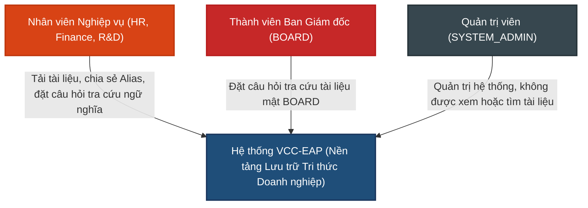

# TÀI LIỆU YÊU CẦU SẢN PHẨM (PRD)
**Tuần 4: Số hóa & Tra cứu Tri thức Cơ bản (Basic RAG - Retrieval Layer)**

---

## 1. Quản lý Tài liệu (Document Control)

### 1.1. Thông tin Tài liệu
| Trường thông tin | Giá trị |
| :--- | :--- |
| **Tiêu đề Tài liệu** | Tài liệu Yêu cầu Sản phẩm - Tuần 4 (PRD-004) |
| **Dự án** | VCC Enterprise Archive Platform (VCC-EAP) |
| **Phiên bản** | 1.1 |
| **Trạng thái** | Hoàn thành |
| **Tác giả** | Senior Product Analyst |
| **Ngày phát hành** | 2026-08-13 |

### 1.2. Lịch sử Thay đổi
| Phiên bản | Ngày | Tác giả | Mô tả Thay đổi | Lý do |
| :--- | :--- | :--- | :--- | :--- |
| 1.0 | 2026-08-07 | Senior Product Analyst | Phiên bản đầu tiên. | |
| 1.1 | 2026-08-13 | Senior Product Analyst | Chuẩn hóa PRD theo tiêu chuẩn IEEE và C4: loại bỏ chi tiết kỹ thuật, chuyển sang phương pháp chunking đơn giản, tích hợp ngưỡng tương đồng tối thiểu dạng cấu hình cố định, mô hình hóa Alias logic và tinh chỉnh NFRs. | Đơn giản hóa quy trình số hóa và tối ưu chất lượng tìm kiếm. |

---

## 2. Giới thiệu (Introduction)

### 2.1. Bối cảnh Nghiệp vụ
Doanh nghiệp lưu trữ lượng lớn tài liệu chính sách, quy chế và tài liệu nghiệp vụ. Nhân viên thường mất nhiều thời gian để tra cứu thông tin khi chỉ sử dụng phương pháp tìm kiếm từ khóa chính xác truyền thống. Tính năng tìm kiếm tương đồng ngữ nghĩa (Semantic Search) cho phép nhân viên đặt câu hỏi bằng ngôn ngữ tự nhiên và hệ thống tự động trả về chính xác đoạn văn bản chứa thông tin liên quan nhất, giúp tối ưu hóa hiệu suất làm việc.

> [!IMPORTANT]
> **Định nghĩa về Basic RAG trong Tuần 4**: Trong phạm vi phát triển của Tuần 4, hệ thống chỉ triển khai **Tầng Truy xuất dữ liệu (Retrieval Layer)**. Hệ thống nhận câu hỏi bằng ngôn ngữ tự nhiên, tìm kiếm các đoạn văn bản tương đồng ngữ nghĩa trong kho tri thức đã được số hóa và hiển thị kết quả trực tiếp cho người dùng kèm trích dẫn nguồn. Hệ thống **không** thực hiện việc tự sinh câu trả lời bằng LLM (LLM Generation/RAG Chatbot) hay tóm tắt nội dung tài liệu.

### 2.2. Mục đích
Tài liệu này đặc tả các yêu cầu sản phẩm đối với phân hệ **Số hóa & Tra cứu Tri thức Cơ bản (Basic RAG - Retrieval Layer)**. Tài liệu tập trung mô tả các hành vi chức năng từ góc nhìn của sản phẩm ("Làm cái gì và Tại sao"), thiết lập các ràng buộc bảo mật phòng ban và các tiêu chuẩn chất lượng (SLA) phục vụ cho quá trình thiết kế hệ thống.

### 2.3. Phạm vi (Scope)
* **Quy trình Số hóa**: Tự động trích xuất nội dung văn bản của tài liệu gốc (PDF, Word, Excel), thực hiện phân mảnh theo đoạn văn (Paragraph Chunking) và tạo biểu diễn vector ngữ nghĩa cục bộ để lưu trữ bền vững.
* **Quy trình Tra cứu (Retrieval Layer)**: Cung cấp API tiếp nhận câu hỏi bằng ngôn ngữ tự nhiên, thực hiện so khớp vector tương đồng ngữ nghĩa và trả về tối đa Top-3 đoạn văn bản liên quan nhất kèm thông tin trích dẫn nguồn.
* **Kiểm soát Bảo mật**: Áp dụng quy tắc cô lập phòng ban nghiêm ngặt (Department Isolation), phân giải liên kết chia sẻ tài liệu (Alias Sharing), bảo vệ thông tin BOARD và xử lý tài liệu bị xóa logic.
* **Ngoài phạm vi**: Không tự động sinh câu trả lời bằng LLM (RAG Generation), không xếp hạng lại (Re-ranking), không tìm kiếm lai (Hybrid Search), không xử lý nhận dạng ký tự từ hình ảnh (OCR).

### 2.4. Thuật ngữ và Định nghĩa
* **Tìm kiếm tương đồng ngữ nghĩa (Semantic Search)**: Phương thức tra cứu dựa trên ý nghĩa của câu hỏi thay vì so khớp từ khóa chính xác.
* **Phân mảnh theo đoạn văn (Paragraph Chunking)**: Chia nhỏ văn bản gốc thành các phân đoạn (chunk) dựa trên dấu ngắt đoạn tự nhiên (như `\n\n`). Nếu đoạn văn dài vượt quá giới hạn tối đa (1000 tokens), hệ thống thực hiện cắt cứng (hard split) tại ranh giới câu mà không cần tính toán tương đồng ngữ nghĩa hay cơ chế chồng lấn (overlap).
* **Vector biểu diễn ngữ nghĩa (Embedding)**: Biểu diễn toán học của một đoạn văn bản dưới dạng vector số thực để đo đạc độ tương đồng ý nghĩa.
* **Cách ly Phòng ban (Department Isolation)**: Người dùng chỉ được tìm kiếm tài liệu thuộc sở hữu của phòng ban mình hoặc được phòng ban khác chia sẻ.
* **Liên kết chia sẻ (Alias Sharing)**: Chia sẻ quyền truy cập tài liệu sang phòng ban khác dưới dạng liên kết logic, không nhân bản tệp vật lý.
* **Xóa logic (Soft Delete)**: Trạng thái tài liệu bị ẩn khỏi hệ thống và không tham gia tra cứu nhưng không bị xóa vật lý ngay lập tức.

---

## 3. Mô tả Tổng quan (Overall Description)

### 3.1. Tác nhân Hệ thống (Actors)
* **Nhân viên Nghiệp vụ**: Người dùng thuộc các phòng ban (như HR, Finance, R&D) có nhu cầu đặt câu hỏi tự nhiên để tra cứu thông tin trong phạm vi phòng ban hoặc tài liệu được chia sẻ hợp lệ.
* **Ban Giám đốc (BOARD)**: Người dùng có quyền tra cứu tài liệu tuyệt mật của BOARD.
* **Quản trị viên (SYSTEM_ADMIN)**: Người quản trị hệ thống, không có quyền truy cập nội dung tài liệu và không được sử dụng tính năng tìm kiếm ngữ nghĩa.

### 3.2. Giả định và Sự phụ thuộc
* **Tài liệu hợp lệ**: Tài liệu tải lên hệ thống là tài liệu định dạng kỹ thuật số chứa văn bản có thể trích xuất trực tiếp (không phải ảnh quét).

---

## 4. Bối cảnh Hệ thống (System Context - C1)

Sơ đồ ngữ cảnh hệ thống (C1) thể hiện các tác nhân tương tác với hệ thống VCC-EAP đối với chức năng tra cứu tri thức:

---

## 5. Yêu cầu Chức năng (Functional Requirements)

### 5.1. Quy trình Số hóa Tài liệu
* **FR-4.1. Tiếp nhận tài liệu**: Hệ thống tự động phát hiện và tiếp nhận các tài liệu mới tải lên ở trạng thái sẵn sàng số hóa (Trạng thái **Chờ số hóa**).
* **FR-4.2. Trích xuất văn bản**:
  * Trích xuất nội dung văn bản từ các định dạng tệp được hỗ trợ: PDF, Word (docx), Excel (xlsx).
  * Bảo đảm giữ nguyên định dạng chữ tiếng Việt có dấu.
  * Trong trường hợp tệp không chứa văn bản trích xuất được, hệ thống chuyển tài liệu sang trạng thái lỗi xử lý (Trạng thái **Thất bại**) và lưu thông tin lỗi để phục vụ công tác quản trị.
* **FR-4.3. Phân mảnh văn bản (Chunking)**:
  * Hệ thống áp dụng phương pháp **Phân mảnh theo Đoạn văn** (Paragraph Chunking) để số hóa tài liệu. Văn bản thô được trích xuất sẽ được phân đoạn tự động dựa trên ký tự ngắt đoạn tự nhiên (mặc định là dấu xuống dòng kép `\n\n`).
  * Hệ thống áp dụng cấu hình giới hạn kích thước tối đa của mỗi mảnh (tham số cấu hình hệ thống, ví dụ mặc định là 1000 tokens).
    * Nếu đoạn văn tự nhiên có độ dài nhỏ hơn hoặc bằng giới hạn kích thước tối đa, toàn bộ đoạn văn đó được lưu thành **1 chunk**.
    * Nếu đoạn văn tự nhiên dài vượt quá giới hạn tối đa, hệ thống thực hiện **cắt cứng (hard split)** đoạn văn tại ranh giới câu gần nhất (dựa trên dấu chấm câu `.`, `?`, `!`) để tạo thành các chunk nhỏ hơn nằm trong giới hạn tối đa. Hệ thống không sử dụng tính toán vector tương đồng giữa các câu và không áp dụng cơ chế overlap (gối đầu) giữa các chunk.
    * **Xử lý tránh phân mảnh vụn (Min Chunk Size constraint):** Khi thực hiện cắt cứng đoạn văn, nếu phần dư còn lại của đoạn văn sau khi cắt có kích thước nhỏ hơn giới hạn tối thiểu quy định (tham số cấu hình hệ thống, ví dụ mặc định là 100 tokens), hệ thống sẽ thực hiện gộp phần dư này vào chunk liền trước (chấp nhận kích thước chunk liền trước vượt quá giới hạn tối đa một chút nhưng không vượt quá giới hạn tràn tối đa cấu hình, ví dụ mặc định là 1100 tokens) hoặc phân bổ lại điểm cắt tại các ranh giới câu gần đó sao cho độ dài của các chunk được phân chia tương đối cân bằng, tránh tạo ra phân mảnh quá nhỏ làm giảm chất lượng biểu diễn ngữ nghĩa.
  * Toàn bộ quy trình phân mảnh và lưu trữ chunk phải đảm bảo tính **Idempotent (độc lập và nhất quán)**. Nếu tài liệu bị số hóa lại hoặc tiến trình bị gián đoạn và khởi động lại, các chunk mới lưu trữ phải ghi đè hoặc cập nhật chính xác lên các chunk cũ đã có của tài liệu đó, tránh trùng lặp dữ liệu.
  * Các tham số phân mảnh (giới hạn tối đa của một chunk, giới hạn tối thiểu của chunk dư, ký tự phân tách đoạn) được thiết kế dưới dạng cấu hình cố định của hệ thống.
* **FR-4.4. Tạo vector biểu diễn ngữ nghĩa**:
  * Hệ thống tự động chuyển đổi từng đoạn văn bản thành một vector biểu diễn ngữ nghĩa (embedding) bằng mô hình nhúng cục bộ.
  * Hệ thống áp dụng kiểm tra tính hợp lệ của vector nhúng được tạo ra (như số chiều vector tương thích với cấu hình). Nếu phát hiện lỗi cấu hình mô hình hoặc vector không hợp lệ, hệ thống sẽ dừng tiến trình số hóa của tài liệu đó và ghi nhận lỗi.
  * Mỗi đoạn văn bản được liên kết chặt chẽ với vector ngữ nghĩa tương ứng của nó để phục vụ so khớp.
* **FR-4.5. Lưu trữ, Quản lý Trạng thái và Hiển thị Đồng bộ (Document Lifecycle & Atomic Visibility)**:
  * **Vòng đời nghiệp vụ tài liệu (Document Lifecycle)**: Quá trình số hóa tài liệu được quản lý và theo dõi thông qua các trạng thái nghiệp vụ: **Chờ số hóa** (sẵn sàng số hóa) -> **Đang số hóa** (đang thực hiện trích xuất và lưu trữ vector) -> **Hoàn thành** (hoàn tất số hóa và sẵn sàng tra cứu) hoặc **Thất bại** (gặp lỗi không thể phục hồi trong quá trình xử lý).
  * **Độ hiển thị đồng bộ (Atomic Visibility)**: Để bảo toàn tính nhất quán của dữ liệu tra cứu, hệ thống áp dụng nguyên tắc chỉ những tài liệu đã đạt trạng thái **Hoàn thành** mới được đưa vào tập truy vấn tìm kiếm ngữ nghĩa. Người dùng không được phép tìm thấy bất kỳ chunk nào của tài liệu đang ở các trạng thái khác (**Chờ số hóa**, **Đang số hóa** hay **Thất bại**).
  * **Xử lý lỗi một phần và cơ chế tự phục hồi (Partial Failure & Retry)**:
    * Khi gặp sự cố lưu trữ tạm thời đối với một chunk cụ thể, hệ thống sẽ thực hiện thử lại tối đa **3 lần**.
    * Nếu vẫn thất bại sau 3 lần thử lại, hệ thống sẽ ghi nhận cảnh báo, bỏ qua (SKIP) chunk bị lỗi này, cập nhật checkpoint tiến độ lưu trữ và tiếp tục xử lý các chunk tiếp theo của tài liệu.
    * Khi toàn bộ các chunk của tài liệu được xử lý xong (kể cả có chunk bị bỏ qua), tài liệu vẫn sẽ được cập nhật trạng thái sang **Hoàn thành** để cho phép tra cứu các phần nội dung đã được số hóa thành công.

### 5.2. Quy trình Tìm kiếm Tương đồng Ngữ nghĩa (Retrieval Layer)
* **FR-4.6. Cổng API Tìm kiếm**:
  * Tiếp nhận yêu cầu tìm kiếm từ người dùng dưới dạng câu hỏi ngôn ngữ tự nhiên.
  * Tự động xác thực danh tính và xác định phòng ban trực thuộc của người dùng thực hiện yêu cầu.
* **FR-4.7. Truy xuất tương đồng**:
  * Chuyển đổi câu hỏi của người dùng thành vector biểu diễn ngữ nghĩa (sử dụng cùng mô hình nhúng với quy trình số hóa).
  * Thực hiện tìm kiếm và đối sánh tương đồng giữa vector câu hỏi và vector các đoạn văn bản trong cơ sở dữ liệu dựa trên độ tương đồng vector.
  * Sắp xếp kết quả tìm kiếm theo thứ tự độ liên quan giảm dần và trả về tối đa số lượng đoạn văn bản theo yêu cầu (mặc định hiển thị tối đa 3 kết quả liên quan nhất).
  * **Bộ lọc ngưỡng tương đồng tối thiểu (Similarity Threshold):** Hệ thống áp dụng một bộ lọc theo ngưỡng điểm tương đồng tối thiểu. Ngưỡng này là một cấu hình cố định của hệ thống (ví dụ mặc định là 0.60).
    * Bất kỳ kết quả nào có điểm tương đồng nhỏ hơn ngưỡng cấu hình hiện tại sẽ bị hệ thống loại bỏ khỏi danh sách kết quả trả về.
    * Trường hợp sau khi lọc không có đoạn văn bản nào đạt ngưỡng tương đồng hoặc không có tài liệu hợp lệ, hệ thống trả về kết quả trống và hiển thị thông báo thân thiện cho người dùng: *"Không tìm thấy thông tin phù hợp trong kho tài liệu của phòng ban bạn."*
  * Mỗi đoạn văn bản trả về bắt buộc phải đi kèm thông tin nguồn gốc tài liệu (như mã tài liệu, tiêu đề tài liệu) và siêu dữ liệu trích dẫn chi tiết lưu dưới dạng cấu trúc JSONB (như số trang `page_number`, tiêu đề phần `section_header`, số lượng token `token_count`) để phục vụ đối chiếu nguồn trích dẫn phong phú.
* **FR-4.8. Cách ly phòng ban tuyệt đối (Department Isolation)**:
  * Kết quả tìm kiếm của người dùng bắt buộc phải được giới hạn trong phạm vi phòng ban trực thuộc của người dùng đó, ngoại trừ trường hợp tài liệu được chia sẻ hợp lệ qua liên kết Alias.
  * **Ràng buộc an toàn tuyệt đối (Security Invariant)**: Hệ thống phải đảm bảo cô lập dữ liệu và phân quyền truy cập tuyệt đối giữa các phòng ban. Việc truy vấn kết hợp lọc phân quyền (phòng ban, Alias) và lọc trạng thái tài liệu (ở trạng thái **Hoàn thành** và không bị xóa logic) phải đảm bảo nguyên tắc bảo mật tối đa, không để xảy ra bất kỳ rò rỉ dữ liệu nào giữa các phòng ban.
* **FR-4.9. Chia sẻ tài liệu qua Alias (Alias Sharing)**:
  * Hệ thống hỗ trợ chia sẻ quyền truy cập tài liệu gốc từ phòng ban sở hữu sang phòng ban khác bằng liên kết logic. Hệ thống tuyệt đối không nhân bản tệp tin vật lý, không tạo thêm phân đoạn (chunk) hoặc tính toán lại embedding cho tài liệu được chia sẻ.
  * **Cơ chế truy cập**: Khi người dùng thực hiện tra cứu, hệ thống tự động phân giải quyền truy cập thông qua các liên kết Alias còn hiệu lực được chia sẻ đến phòng ban của người dùng hiện tại để trả về các phân đoạn thuộc tài liệu gốc tương ứng.
* **FR-4.10. Kiểm soát trạng thái hiệu lực**:
  * Hệ thống loại bỏ các tài liệu gốc đã bị đánh dấu xóa logic (Soft Delete) khỏi tập dữ liệu tra cứu.
  * Nếu một liên kết chia sẻ (Alias) bị đánh dấu xóa logic (Soft Delete), người dùng thuộc phòng ban nhận liên kết đó lập tức mất quyền truy cập và tìm kiếm tài liệu tương ứng.

---

## 6. Yêu cầu Phi chức năng (Non-functional Requirements)

### 6.1. Hiệu năng & Chất lượng (Performance & Quality)
* **NFR-4.1. Mục tiêu độ trễ tìm kiếm (SLA)**: Độ trễ phản hồi cho một yêu cầu tìm kiếm tương đồng ngữ nghĩa phải đạt mức **p95 dưới 500ms**. Ranh giới đo lường (Measurement Boundary) được tính từ thời điểm hệ thống tiếp nhận yêu cầu tìm kiếm của người dùng, thực hiện sinh vector câu hỏi, truy vấn kết hợp lọc phân quyền và so khớp tương đồng ở tầng lưu trữ, cho đến khi gửi phản hồi kết quả tìm kiếm (không bao gồm độ trễ truyền tải mạng ngoài hệ thống).
* **NFR-4.2. Thời gian xử lý số hóa (SLA)**: Quy trình số hóa bất đồng bộ đối với một tài liệu tiêu chuẩn dài 10 trang hướng tới mục tiêu hoàn thành **dưới 10 giây** kể từ khi hệ thống bắt đầu xử lý.
* **NFR-4.3. Chất lượng tìm kiếm (SLA Hit Rate @ Top-3)**: Đảm bảo độ chính xác tìm kiếm (Retrieval Accuracy) đạt tỷ lệ tối thiểu **90%** trên tập dữ liệu kiểm thử chuẩn hóa (Ground Truth gồm 50 câu hỏi nghiệp vụ đã được gán nhãn sẵn đoạn văn chứa câu trả lời). Một kết quả tìm kiếm được tính là thành công (Hit) khi và chỉ khi đoạn văn bản chứa câu trả lời chính xác cho câu hỏi nằm trong **Top 3** kết quả được trả về đầu tiên từ hệ thống.

### 6.2. Độ tin cậy (Reliability)
* **NFR-4.4. Đồng bộ hóa quyền truy cập**: Khi tài liệu hoặc liên kết Alias bị đánh dấu xóa logic, hệ thống phải cập nhật lập tức hiệu lực truy cập trong kết quả tra cứu ngữ nghĩa.

### 6.3. An toàn Bảo mật (Security)
* **NFR-4.5. Ngăn ngừa rò rỉ dữ liệu (SLA)**: Đảm bảo an toàn thông tin, không xảy ra rò rỉ chéo dữ liệu giữa các phòng ban hoặc từ BOARD ra ngoài. Toàn bộ cơ chế kiểm tra quyền truy cập phòng ban và Alias phải được thực hiện triệt để ngay trong truy vấn dữ liệu ở tầng lưu trữ, không được lấy kết quả thô lên bộ nhớ ứng dụng rồi mới lọc.
* **NFR-4.6. Chặn quyền quản trị viên**: Tài khoản quản trị hệ thống (SYSTEM_ADMIN) bị tước quyền tìm kiếm ngữ nghĩa và không được phép xem nội dung chi tiết của bất kỳ tài liệu nghiệp vụ nào.

### 6.4. Khả năng Mở rộng (Scalability)
* **NFR-4.7. Quy mô chỉ mục và Tải trọng hệ thống (Scalability & Load Baseline)**: Hệ thống phải duy trì hiệu năng tìm kiếm ổn định (đáp ứng p95 < 500ms) khi quy mô phân đoạn lưu trữ tăng trưởng lên tới **100,000 chunks**, đồng thời chịu tải ổn định với tần suất yêu cầu truy vấn đồng thời tối thiểu là **50 QPS (Queries Per Second)**.
* **NFR-4.8. Khả năng xử lý tài liệu lớn**: Hệ thống phải có khả năng xử lý và số hóa các tài liệu lớn (quy mô từ 100 đến 1000 trang) mà không gây ra lỗi cạn kiệt tài nguyên hệ thống (như lỗi hết bộ nhớ - OOM) hoặc làm suy giảm hiệu năng của các tiến trình tìm kiếm đồng thời khác.

---

## 7. Quy tắc Nghiệp vụ (Business Rules)

* **BR-4.1. Điều kiện số hóa**: Chỉ số hóa tài liệu đang ở trạng thái hoạt động và chưa bị đánh dấu xóa.
* **BR-4.2. Điều kiện tham gia tra cứu**: Chỉ các đoạn văn bản thuộc tài liệu đã hoàn tất số hóa thành công mới được tham gia vào quá trình tìm kiếm tương đồng vector.
* **BR-4.3. Định dạng hiển thị trích dẫn**: Kết quả tìm kiếm hiển thị đoạn nội dung liên quan để người dùng đọc nhanh, kèm theo link liên kết để mở tài liệu gốc nếu người dùng có đủ quyền hạn truy cập tài liệu đó.
* **BR-4.4. Phân quyền chia sẻ tài liệu**: Chỉ phòng sở hữu tài liệu gốc mới có quyền tạo liên kết chia sẻ (Alias) sang phòng ban khác.
* **BR-4.5. Ràng buộc bảo mật của BOARD**: Tài liệu thuộc phòng ban BOARD là tuyệt mật. Hệ thống cấm mọi hành vi tạo liên kết chia sẻ tài liệu BOARD ra ngoài, đồng thời BOARD cũng không tiếp nhận liên kết chia sẻ từ các phòng ban khác.

---

## 8. Kịch bản Nghiệm thu (Acceptance Criteria)

### TC-4.1. Tìm kiếm ngữ nghĩa thành công trong phòng ban
* **GIVEN**: Người dùng thuộc phòng ban HR đã đăng nhập. Hệ thống có tài liệu `Doc_HR_01` thuộc phòng HR đã hoàn thành số hóa, chứa đoạn văn bản: *"Chính sách hỗ trợ phương tiện công cộng áp dụng cho nhân viên đi xe buýt đi làm với mức trợ cấp 200,000 VND/tháng"*.
* **WHEN**: Người dùng gửi yêu cầu tìm kiếm với câu hỏi bằng ngôn ngữ tự nhiên: *"Tôi đi xe buýt đi làm có được trợ cấp không?"*.
* **THEN**:
  1. Thời gian trả kết quả dưới 500ms.
  2. Đoạn văn bản chứa quy định trợ cấp xe buýt hiển thị trong Top 3 kết quả đầu tiên.
  3. Thông tin trích dẫn hiển thị đúng mã tài liệu và tiêu đề của `Doc_HR_01`.

### TC-4.2. Cách ly phòng ban tuyệt đối
* **GIVEN**: Người dùng thuộc phòng ban R&D đã đăng nhập. Hệ thống có tài liệu `Doc_Finance_01` thuộc phòng FINANCE đã hoàn thành số hóa chứa thông tin lương thưởng và tài liệu này **chưa** được chia sẻ cho phòng R&D.
* **WHEN**: Người dùng R&D gửi yêu cầu tìm kiếm với câu hỏi: *"Mức lương thưởng cuối năm là bao nhiêu?"*.
* **THEN**: Kết quả trả về không chứa bất kỳ đoạn văn bản nào trích từ tài liệu `Doc_Finance_01`.

### TC-4.3. Tìm kiếm tài liệu chia sẻ qua Alias
* **GIVEN**:
  - Tài liệu gốc `Doc_Finance_02` thuộc phòng FINANCE có tiêu đề gốc là *"Quy chế Chi tiêu Nội bộ VCCorp"*, đã hoàn thành số hóa, chứa nội dung: *"Nhân viên đi công tác được thanh toán tối đa 1,000,000 VND tiền phòng/ngày"*.
  - Phòng FINANCE đã tạo một liên kết chia sẻ (Alias) tài liệu này sang phòng HR.
  - Người dùng thuộc phòng HR thực hiện tìm kiếm.
* **WHEN**: Người dùng HR gửi yêu cầu tìm kiếm với câu hỏi: *"Đi công tác được chi bao nhiêu tiền phòng?"*.
* **THEN**:
  1. Kết quả tìm kiếm hiển thị đoạn văn bản trích từ tài liệu gốc `Doc_Finance_02`.
  2. Tên tài liệu đi kèm kết quả hiển thị tiêu đề *"Quy chế Chi tiêu Nội bộ VCCorp"* (tiêu đề của tài liệu gốc).

### TC-4.4. Không tìm kiếm trên tài liệu đã xóa
* **GIVEN**: Tài liệu `Doc_HR_02` thuộc phòng HR đã bị đánh dấu xóa logic (Soft Delete) trên hệ thống.
* **WHEN**: Người dùng thuộc phòng HR thực hiện tìm kiếm với câu hỏi khớp với nội dung của `Doc_HR_02`.
* **THEN**: Kết quả trả về không chứa bất kỳ nội dung nào thuộc tài liệu `Doc_HR_02`.

### TC-4.5. Nghiệm thu chất lượng tìm kiếm (SLA Hit Rate @ Top-3)
* **GIVEN**: Hệ thống đã số hóa hoàn thành tài liệu quy định nghỉ phép: *"Quy chế nghỉ phép năm quy định nhân viên được nghỉ tối đa 12 ngày làm việc hưởng nguyên lương"*.
* **WHEN**: Người dùng thực hiện đặt câu hỏi ngôn ngữ tự nhiên không trùng khớp từ khóa chính xác: *"Một năm tôi được nghỉ bao nhiêu ngày phép mà vẫn được trả lương?"*.
* **THEN**: Kết quả tìm kiếm trả về đoạn văn bản quy định nghỉ phép 12 ngày trong Top 3 kết quả đầu tiên.

### TC-4.6. Kiểm thử cách ly tuyệt đối và cấm chia sẻ tài liệu BOARD
* **GIVEN**:
  - Người dùng thuộc phòng ban HR đã đăng nhập.
  - Hệ thống có tài liệu `Doc_BOARD_01` thuộc phòng BOARD đã số hóa hoàn thành.
* **WHEN**:
  - Có yêu cầu tạo Alias chia sẻ tài liệu `Doc_BOARD_01` cho phòng HR.
  - Người dùng phòng HR thực hiện tìm kiếm ngữ nghĩa với câu hỏi liên quan đến nội dung tài liệu của BOARD.
* **THEN**:
  - Hệ thống từ chối yêu cầu tạo Alias và trả về lỗi phân quyền truy cập.
  - Kết quả tìm kiếm của người dùng phòng HR hoàn toàn trống rỗng, không hiển thị bất kỳ cảnh báo hoặc thông báo nào làm lộ sự tồn tại của tài liệu BOARD.

### TC-4.7. Kiểm thử chặn quyền tìm kiếm của Quản trị viên (SYSTEM_ADMIN)
* **GIVEN**: Người dùng có vai trò `SYSTEM_ADMIN` đã đăng nhập. Hệ thống có tài liệu `Doc_HR_01` đã số hóa hoàn thành.
* **WHEN**: Người dùng `SYSTEM_ADMIN` thực hiện yêu cầu tìm kiếm tương đồng ngữ nghĩa, hoặc cố gắng đọc nội dung tài liệu.
* **THEN**:
  - Hệ thống từ chối yêu cầu và báo lỗi không có quyền truy cập.
  - Nhật ký giám sát ghi nhận hành vi truy cập trái phép của tài khoản quản trị để phục vụ công tác giám sát bảo mật.

---

## 9. Ngoài Phạm vi (Out of Scope)
* Không xây dựng mô hình tự sinh câu trả lời (LLM Generation/RAG Chatbot).
* Không tích hợp tìm kiếm lai (Hybrid Search) kết hợp Full-text Search.
* Không hỗ trợ xếp hạng lại kết quả (Re-ranking) bằng mô hình bổ sung.
* Không hỗ trợ nhận dạng ký tự quang học (OCR) đối với định dạng ảnh quét.
* Không lưu trữ lịch sử cuộc hội thoại (Multi-turn Chat).
* Không hỗ trợ lọc nâng cao theo siêu dữ liệu (Metadata filtering) ngoài phạm vi phòng ban/Alias.

---

## 10. Chú giải (Glossary)
* **BOARD**: Ban Giám đốc VCCorp, phòng ban tuyệt mật đặc biệt trong hệ thống.
* **HR (Human Resources)**: Phòng ban Nhân sự.
* **FINANCE**: Phòng ban Tài chính.
* **R&D (Research and Development)**: Phòng ban Nghiên cứu và Phát triển.
* **EAP (Enterprise Archive Platform)**: Nền tảng Lưu trữ Tri thức Doanh nghiệp.
* **SYSTEM_ADMIN**: Tài khoản quản trị toàn bộ hệ thống EAP, bị tước quyền đọc tài liệu.
