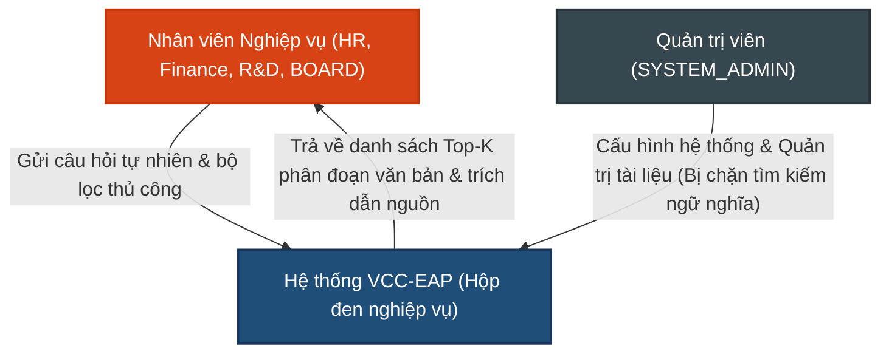

# TÀI LIỆU YÊU CẦU SẢN PHẨM (PRD)
**Số hóa & Tra cứu Tri thức Cơ bản (Basic RAG - Retrieval Layer)**

---

## 1. Quản lý Tài liệu (Document Control)

### 1.1. Thông tin Tài liệu
| Trường thông tin | Giá trị |
| :--- | :--- |
| **Tiêu đề Tài liệu** | Tài liệu Yêu cầu Sản phẩm - Số hóa & Tra cứu Tri thức (PRD-004) |
| **Dự án** | VCC Enterprise Archive Platform (VCC-EAP) |
| **Phiên bản** | 1.3 |
| **Trạng thái** | Hoàn thành |
| **Tác giả** | Senior Product Analyst |
| **Ngày phát hành** | 2026-08-19 |

### 1.2. Lịch sử Thay đổi
| Phiên bản | Ngày | Tác giả | Mô tả Thay đổi | Lý do |
| :--- | :--- | :--- | :--- | :--- |
| 1.0 | 2026-08-07 | Senior Product Analyst | Phiên bản đầu tiên. | Yêu cầu ban đầu cho tính năng tra cứu tri thức. |
| 1.1 | 2026-08-13 | Senior Product Analyst | Chuẩn hóa quy trình phân mảnh và tìm kiếm ngữ nghĩa cơ bản. | Đơn giản hóa quy trình và tích hợp bộ lọc tương đồng. |
| 1.2 | 2026-08-14 | Senior Product Analyst | Cập nhật thuật toán phân mảnh (bỏ max/min token), tích hợp tiền lọc siêu dữ liệu (metadata pre-filtering) và loại bỏ các chi tiết kỹ thuật hệ thống. | Tối ưu hóa tính chính xác ngữ cảnh tra cứu và chuẩn hóa phạm vi tài liệu sản phẩm. |
| 1.3 | 2026-08-19 | Senior Product Analyst | Bổ sung cơ chế trích xuất siêu dữ liệu tự động từ câu hỏi bằng LLM và tích hợp bộ lọc thuộc tính động khi tra cứu tri thức. | Tăng độ chính xác và tính phù hợp của ngữ cảnh tra cứu bằng cách kết hợp lọc thuộc tính siêu dữ liệu động. |
| 1.4 | 2026-08-21 | Senior Product Analyst | Chuẩn hóa bản chốt 5 nhóm thuộc tính siêu dữ liệu nghiệp vụ và quy tắc ngắt sớm (short-circuit) khi không có phân đoạn nào thỏa mãn tiền lọc siêu dữ liệu. Cập nhật tối ưu hóa Prompt và cấu hình LLM (JSON Mode, xử lý trả về full schema và lọc rỗng ở Backend Java). | Đảm bảo độ chính xác tuyệt đối cho bộ lọc thuộc tính trong RAG, tăng tốc độ phản hồi và hạn chế timeout. |

---

## Mục lục
1. [Quản lý Tài liệu](#1-quản-lý-tài-liệu-document-control)
2. [Giới thiệu](#2-giới-thiệu-introduction)
3. [Mô tả Tổng quan](#3-mô-tả-tổng-quan-overall-description)
4. [Yêu cầu Chức năng](#4-yêu-cầu-chức-năng-functional-requirements)
5. [Yêu cầu Phi chức năng](#5-yêu-cầu-phi-chức-năng-non-functional-requirements)
6. [Quy tắc Nghiệp vụ](#6-quy-tắc-nghiệp-vụ-business-rules)
7. [Kịch bản Nghiệm thu](#7-kịch-bản-nghiệm-thu-acceptance-criteria)
8. [Chú giải & Chú thích](#8-chú-giải--chú-thích-glossary--references)

---

## 2. Giới thiệu (Introduction)

### 2.1. Bối cảnh Nghiệp vụ
Doanh nghiệp sở hữu khối lượng lớn tài liệu nghiệp vụ, quy định và chính sách nội bộ. Việc tra cứu thủ công hoặc tìm kiếm theo từ khóa truyền thống tốn nhiều thời gian và dễ bỏ sót thông tin do không hiểu được ngữ cảnh câu hỏi. Tính năng tìm kiếm tương đồng ngữ nghĩa (Semantic Search) cho phép nhân viên đặt câu hỏi bằng ngôn ngữ tự nhiên và nhận về chính xác các phân đoạn văn bản chứa câu trả lời. Ví dụ: khi nhân viên hỏi 'Tôi đi xe buýt đi làm có được trợ cấp không?', hệ thống phải tìm ra đoạn văn bản nói về 'chính sách hỗ trợ phương tiện công cộng' mặc dù hai câu này không trùng từ khóa.

### 2.2. Mục đích
Tài liệu này đặc tả các yêu cầu nghiệp vụ đối với phân hệ **Số hóa & Tra cứu Tri thức Cơ bản**. Tài liệu tập trung làm rõ hành vi hệ thống, luồng nghiệp vụ và các ràng buộc bảo mật dữ liệu ở mức sản phẩm, làm cơ sở để xây dựng thiết kế kiến trúc và thiết kế chi tiết.

### 2.3. Phạm vi Sản phẩm (Product Scope)
*   **Quy trình Số hóa**: Tự động chuyển đổi tài liệu tải lên thành các phân đoạn văn bản và lưu trữ biểu diễn ngữ nghĩa tương ứng kèm theo siêu dữ liệu nội dung.
*   **Quy trình Tra cứu**: Cung cấp giao diện/API tiếp nhận câu hỏi, thực hiện tiền lọc theo siêu dữ liệu và phân quyền, so khớp ngữ nghĩa để hiển thị các kết quả phù hợp nhất cho người dùng.
*   **Không nằm trong phạm vi (Out of Scope)**: Không xây dựng mô hình tự sinh câu trả lời bằng LLM (RAG Chatbot - tạo câu trả lời tự nhiên từ ngữ cảnh cho người dùng), không xếp hạng lại kết quả (Re-ranking), không tìm kiếm lai (Hybrid Search) và không xử lý nhận dạng ký tự từ hình ảnh (OCR). Việc tích hợp LLM trong phạm vi sản phẩm này chỉ phục vụ duy nhất cho mục đích nhận diện các thuộc tính siêu dữ liệu từ câu hỏi đầu vào.

---

## 3. Mô tả Tổng quan (Overall Description)

### 3.1. Tác nhân Hệ thống (Actors)
*   **Nhân viên Nghiệp vụ**: Người dùng thuộc các phòng ban (bao gồm BOARD) có nhu cầu đặt câu hỏi tự nhiên để tra cứu thông tin trong phạm vi tài liệu thuộc phòng ban mình hoặc tài liệu được chia sẻ hợp lệ.
*   **Quản trị viên (SYSTEM_ADMIN)**: Người vận hành hệ thống, không có quyền truy cập nội dung chi tiết của tài liệu nghiệp vụ và không được phép sử dụng chức năng tìm kiếm ngữ nghĩa.

#### Sơ đồ Bối cảnh Hệ thống (C1 — System Context Diagram)
Sơ đồ dưới đây mô tả tương tác cấp cao của các tác nhân với hệ thống VCC-EAP dưới góc độ nghiệp vụ sản phẩm:

### 3.2. Giả định và Sự phụ thuộc
*   Tài liệu tải lên hệ thống là tài liệu định dạng kỹ thuật số chứa văn bản có thể trích xuất trực tiếp (không phải ảnh quét).

---

## 4. Yêu cầu Chức năng (Functional Requirements)

### 4.1. Quy trình Số hóa Tài liệu
*   **FR-4.1. Tiếp nhận tài liệu**: Hệ thống tự động phát hiện và tiếp nhận các tài liệu mới tải lên ở trạng thái chờ số hóa.
*   **FR-4.2. Trích xuất văn bản**:
    *   Hỗ trợ trích xuất nội dung văn bản tiếng Việt có dấu từ các định dạng tệp thông dụng (PDF, Word, Excel).
    *   Nếu tệp lỗi không trích xuất được văn bản, hệ thống cập nhật trạng thái lỗi xử lý và ghi nhận thông tin lỗi.
*   **FR-4.3. Phân mảnh văn bản (Chunking)**:
    *   Hệ thống thực hiện phân mảnh văn bản dựa trên dấu ngắt đoạn tự nhiên (mặc định là dấu xuống dòng kép `\n\n`).
    *   **Quy tắc phân loại và gộp**:
        *   **Số đề mục (`1.`, `1.1`, `1.2`, `2`, `3`, `#`, `Chương`, `Điều`)**: Được nhận diện là **Headings (Tiêu đề)** và xử lý bởi bộ **Heading Stack Tracker** để duy trì cây tiêu đề bao hàm (`H1 > H2 > H3`).
        *   **Bullet Items con (Dấu chấm `•`, Gạch đầu dòng `-`, `*`, `+`, Chữ cái `a)`, `b)`)**: Tất cả các bullet item con thuộc cùng một khối đoạn văn **được gộp toàn bộ vào cùng 1 phân đoạn (chunk) duy nhất** của khối đoạn văn cha đó, không xé lẻ từng gạch đầu dòng thành phân đoạn riêng.
    *   Mỗi phân đoạn văn bản được tạo ra không áp dụng giới hạn kích thước ký tự hay số lượng từ (token) tối đa hoặc tối thiểu.
    *   Đảm bảo tính lũy đẳng (Idempotent): khi thực hiện số hóa lại, các phân đoạn mới được tạo ra phải ghi đè hoặc cập nhật chính xác lên các phân đoạn cũ của chính tài liệu đó, tránh trùng lặp dữ liệu.
*   **FR-4.4. Trích xuất và Lưu trữ Siêu dữ liệu Phân đoạn (Mô hình Trích xuất Lai)**:
  *   Trong quá trình số hóa tài liệu, đối với mỗi phân đoạn văn bản được tạo ra, hệ thống tự động phân tích và ghi nhận các thuộc tính siêu dữ liệu nghiệp vụ chuẩn hóa bao gồm:
        *   **Nhóm Phục vụ Tiền lọc ở Cơ sở dữ liệu (Pre-filtering)**:
            *   **Thể loại tài liệu (`doc_type`)**: Loại hình văn bản (`guide`, `regulation`, `analysis`, `description`, `transaction`, `communication`, `education`, `news`, `literature`, `other`) dạng chữ thường — do LLM API trích xuất.
            *   **Danh mục chủ đề nghiệp vụ (`topics`)**: Chủ đề lớn cốt lõi dạng Enum chữ thường (`hr_policy`, `compensation_benefits`, `finance_accounting`, `legal_compliance`, `it_technical`, `sales_marketing`, `operation_process`, `admin_facilities`, `board_direction`, `general_info`) — do LLM API trích xuất (thay thế cho `chunk_role` cũ).
            *   **Thực thể tên riêng & Khái niệm nghiệp vụ (`entities`)**: Mảng thực thể trích xuất chi tiết dạng `type:value` chữ thường (`org:`, `dept:`, `person:`, `product:`, `law:`, `standard:`, `tech:`, `loc:`, `concept:`). Trong đó `concept:` bóc tách chi tiết các thuật ngữ nghiệp vụ, chế độ, phụ cấp, quyền lợi cụ thể — do LLM API trích xuất (thay thế cho `keywords` cũ).
            *   **Mốc thời gian (`time_refs`)**: Các mốc thời gian liên quan được chuẩn hóa (`yyyy`, `yyyy-qn`, `yyyy-mm`, `yyyy-mm-dd`, `2 năm`, `đầu năm`, `cuối quý`) dạng chữ thường — do LLM API trích xuất.
        *   **Nhóm Phục vụ Trích dẫn Vị trí trên Giao diện (Display Citation)**:
            *   **Số trang (`page_number`)**: Số trang gốc trong tài liệu PDF (kiểu số nguyên).
            *   **Cây tiêu đề trích dẫn (`citation_headings`)**: Mảng danh sách phân cấp các tiêu đề gốc nguyên bản của phân đoạn (giữ nguyên kiểu chữ nguyên bản - bao gồm chữ hoa như trong tài liệu gốc, ví dụ: `["Chương I: Quy định chung", "Mục 2: Lương cơ bản"]`).
    *   **Ràng buộc Bắt buộc khi Số hóa (Ingestion Non-Null Constraint)**: Dữ liệu siêu dữ liệu (`metadata`) của mỗi phân đoạn sau khi số hóa BẮT BUỘC KHÔNG NULL và KHÔNG RỖNG `{}`. Nếu `doc_type` không rõ thể loại sẽ mặc định chọn `"other"`, `topics` không rõ chọn `["general_info"]`. Tất cả các giá trị metadata được chuẩn hóa về chữ thường (`lowercase`).
    *   **Quy tắc bỏ thuộc tính rỗng**: Các thuộc tính tùy chọn rỗng (`null` hoặc `[]`) được lọc sạch tại Java Backend (`filterOmittedKeys()`), đảm bảo dữ liệu siêu dữ liệu tinh gọn nhưng luôn giữ đầy đủ các trường bắt buộc.
    *   Hệ thống tự động chuyển đổi từng phân đoạn văn bản thành một biểu diễn ngữ nghĩa phục vụ tra cứu.
*   **FR-4.5. Độ hiển thị đồng bộ**:
    *   Chỉ các tài liệu đã hoàn thành số hóa thành công mới được đưa vào tập dữ liệu tra cứu. Người dùng không được phép tìm thấy bất kỳ phân đoạn nào của tài liệu đang xử lý hoặc bị lỗi số hóa.
    *   Nếu có phân đoạn riêng lẻ gặp sự cố lưu trữ tạm thời, hệ thống tự động thử lại tối đa 3 lần. Nếu vẫn thất bại, hệ thống bỏ qua phân đoạn lỗi đó và tiếp tục xử lý các phân đoạn tiếp theo để đảm bảo tài liệu vẫn hoàn thành số hóa phần nội dung còn lại.

### 4.2. Quy trình Tìm kiếm Tương đồng Ngữ nghĩa
*   **FR-4.6. Tiếp nhận yêu cầu**: Hệ thống tiếp nhận câu hỏi bằng ngôn ngữ tự nhiên, tự động xác thực danh tính và xác định phòng ban của người dùng.
*   **FR-4.7. Trích xuất Siêu dữ liệu tự động, Tiền lọc và Tìm kiếm ngữ nghĩa**:
    *   **Trích xuất siêu dữ liệu tự động từ câu hỏi**: Khi tiếp nhận câu hỏi của người dùng, hệ thống tự động phân tích câu hỏi để nhận diện các tiêu chí siêu dữ liệu thuộc 4 nhóm thuộc tính tiền lọc (`doc_type`, `topics`, `entities`, `time_refs`). Trong đó, các trường `doc_type` và `topics` BẮT BUỘC KHÔNG NULL/KHÔNG RỖNG. Nếu câu hỏi không chỉ định rõ loại tài liệu hay chủ đề, hệ thống mặc định chọn `doc_type: "other"` và `topics: ["general_info"]`. Toàn bộ các giá trị siêu dữ liệu filter được chuẩn hóa tự động sang chữ thường (`lowercase`). Trường `keywords` đã được loại bỏ hoàn toàn khỏi bộ lọc câu hỏi.
    *   **Tiền lọc siêu dữ liệu đóng vai trò Cổng chặn bắt buộc**: Hệ thống tự động khoanh vùng tập ứng viên bằng cách lọc các phân đoạn văn bản thỏa mãn đồng thời tiêu chí siêu dữ liệu do câu hỏi yêu cầu và quyền truy cập phòng ban của người dùng trước khi so khớp độ liên quan ngữ nghĩa.
    *   **Quy tắc ngắt sớm (Short-Circuit)**: Nếu câu hỏi KHÔNG trích xuất được giá trị siêu dữ liệu nào HOẶC không có phân đoạn văn bản nào thỏa mãn các tiêu chí siêu dữ liệu yêu cầu, hệ thống lập tức ngắt luồng xử lý và trả về kết quả "Không tìm thấy kết quả phù hợp" (danh sách rỗng). Hệ thống tuyệt đối không tự động loại bỏ bộ lọc siêu dữ liệu để tìm kiếm vector toàn bảng.
    *   Thực hiện so khớp độ liên quan ngữ nghĩa (Cosine Similarity) giữa câu hỏi và các phân đoạn văn bản đã thỏa mãn các điều kiện tiền lọc nêu trên.
    *   Sắp xếp kết quả theo thứ tự điểm tương đồng giảm dần và lấy Top-K kết quả phù hợp nhất trả về cho người dùng (không áp dụng ngưỡng lọc điểm tương đồng cố định).
    *   Mỗi phân đoạn văn bản trả về bắt buộc phải hiển thị kèm thông tin nguồn gốc tài liệu (như tiêu đề tài liệu, `page_number`, `citation_headings`) và các thông tin siêu dữ liệu tương ứng của phân đoạn đó.
*   **FR-4.8. Cách ly phòng ban (Department Isolation)**: Người dùng chỉ được tìm kiếm các tài liệu thuộc phòng ban mình hoặc tài liệu phòng ban khác chia sẻ thông qua liên kết chia sẻ hợp lệ.
*   **FR-4.9. Chia sẻ tài liệu (Alias Sharing)**: Hệ thống hỗ trợ chia sẻ quyền truy cập tài liệu sang phòng ban khác dưới dạng liên kết logic mà không thực hiện sao chép tệp vật lý hay tính toán lại biểu diễn ngữ nghĩa.
*   **FR-4.10. Kiểm soát trạng thái hiệu lực**: Khi tài liệu hoặc liên kết chia sẻ bị đánh dấu xóa logic, người dùng liên quan lập tức mất quyền tìm kiếm và truy cập tài liệu tương ứng.

---

## 5. Yêu cầu Phi chức năng (Non-functional Requirements)

### 5.1. Hiệu năng & Chất lượng (Performance & Quality)
*   **NFR-4.1. Độ trễ tìm kiếm (SLA)**: Thời gian phản hồi cho yêu cầu tìm kiếm tương đồng ngữ nghĩa phải đạt mức **p95 dưới 500ms** (tính từ lúc nhận câu hỏi đến khi trả kết quả, không bao gồm độ trễ đường truyền mạng ngoài).
*   **NFR-4.2. Thời gian số hóa (SLA)**: Quy trình số hóa bất đồng bộ đối với một tài liệu tiêu chuẩn dài 10 trang đạt mục tiêu hoàn thành **dưới 10 giây**.
*   **NFR-4.3. Chất lượng tìm kiếm (Hit Rate)**: Đảm bảo độ chính xác tìm kiếm đạt tỷ lệ tối thiểu **90%** trên tập dữ liệu kiểm thử chuẩn hóa (kết quả chính xác nằm trong danh sách Top-K kết quả trả về đầu tiên).

### 5.2. An toàn Bảo mật (Security)
*   **NFR-4.4. Ngăn ngừa rò rỉ dữ liệu**: Cơ chế lọc quyền truy cập phòng ban, liên kết chia sẻ và trạng thái tài liệu phải được thực thi triệt để ngay tại bước tìm kiếm đầu tiên. Người dùng không được phép tiếp cận hoặc hiển thị bất kỳ dữ liệu nào ngoài phạm vi phòng ban được cấp quyền.
*   **NFR-4.5. Chặn quyền quản trị viên**: Tài khoản quản trị hệ thống (SYSTEM_ADMIN) bị tước quyền thực hiện tìm kiếm ngữ nghĩa và không được phép xem nội dung chi tiết của tài liệu nghiệp vụ.

### 5.3. Khả năng Mở rộng (Scalability)
*   **NFR-4.6. Quy mô hệ thống**: Hệ thống duy trì hiệu năng ổn định (p95 < 500ms) khi quy mô dữ liệu tăng lên tới **100,000 phân đoạn** và chịu tải đồng thời tối thiểu **50 yêu cầu mỗi giây (50 QPS)**.

---

## 6. Quy tắc Nghiệp vụ (Business Rules)

*   **BR-4.1. Điều kiện tham gia tra cứu**: Chỉ các phân đoạn thuộc tài liệu đã hoàn thành số hóa thành công và đang hoạt động (chưa bị xóa) mới được tham gia vào quá trình tìm kiếm tương đồng ngữ nghĩa.
*   **BR-4.2. Phân quyền chia sẻ**: Chỉ phòng sở hữu tài liệu gốc mới có quyền tạo liên kết chia sẻ sang phòng ban khác.
*   **BR-4.3. Cô lập tuyệt đối của BOARD**: Tài liệu thuộc phòng ban BOARD là tuyệt mật. Hệ thống cấm mọi hành vi tạo liên kết chia sẻ tài liệu BOARD ra ngoài, đồng thời BOARD cũng không tiếp nhận liên kết chia sẻ từ các phòng ban khác.
*   **BR-4.4. Xử lý khi LLM trích xuất siêu dữ liệu rỗng hoặc lỗi**:
    *   Trong trường hợp LLM không nhận diện hoặc trích xuất được bất kỳ thuộc tính siêu dữ liệu nào phù hợp từ câu hỏi (không nhận diện được thuộc tính siêu dữ liệu), hệ thống sẽ bỏ qua bước lọc siêu dữ liệu động từ câu hỏi và chỉ áp dụng các bộ lọc mặc định (phân quyền phòng ban và bộ lọc thủ công trên giao diện nếu có).
    *   Trường hợp LLM gặp sự cố kết nối hoặc lỗi xử lý hệ thống, tiến trình trích xuất siêu dữ liệu động từ câu hỏi tự động được bỏ qua và chuyển hướng sang tìm kiếm ngữ nghĩa thông thường, tránh làm gián đoạn trải nghiệm người dùng.

---

## 7. Kịch bản Nghiệm thu (Acceptance Criteria)

### TC-4.1. Tìm kiếm ngữ nghĩa thành công trong phòng ban
*   **GIVEN**: Người dùng thuộc phòng ban HR đã đăng nhập. Hệ thống có tài liệu của phòng HR đã hoàn thành số hóa, chứa nội dung: *"Chính sách hỗ trợ phương tiện công cộng áp dụng cho nhân viên đi xe buýt đi làm với mức trợ cấp 200,000 VND/tháng"*.
*   **WHEN**: Người dùng gửi yêu cầu tìm kiếm với câu hỏi: *"Tôi đi xe buýt đi làm có được trợ cấp không?"*.
*   **THEN**: 
    1. Thời gian phản hồi dưới 500ms.
    2. Phân đoạn chứa nội dung quy định trợ cấp xe buýt hiển thị trong danh sách Top-K kết quả đầu tiên kèm nguồn trích dẫn đúng.

### TC-4.2. Cách ly phòng ban tuyệt đối
*   **GIVEN**: Người dùng thuộc phòng ban R&D đã đăng nhập. Hệ thống có tài liệu thuộc phòng FINANCE chứa thông tin lương thưởng và tài liệu này chưa được chia sẻ cho phòng R&D.
*   **WHEN**: Người dùng R&D gửi yêu cầu tìm kiếm với câu hỏi: *"Mức lương thưởng cuối năm là bao nhiêu?"*.
*   **THEN**: Kết quả trả về trống hoặc không chứa bất kỳ phân đoạn nào thuộc tài liệu của phòng FINANCE.

### TC-4.3. Tìm kiếm tài liệu chia sẻ qua liên kết
*   **GIVEN**: Tài liệu gốc của phòng FINANCE có tiêu đề *"Quy chế Chi tiêu Nội bộ VCCorp"* đã hoàn thành số hóa và được tạo liên kết chia sẻ sang phòng HR. Người dùng thuộc phòng HR thực hiện tìm kiếm.
*   **WHEN**: Người dùng HR gửi câu hỏi liên quan đến nội dung tài liệu chia sẻ đó.
*   **THEN**: Kết quả tìm kiếm hiển thị phân đoạn văn bản trích từ tài liệu gốc của phòng FINANCE và hiển thị đúng tên tài liệu gốc *"Quy chế Chi tiêu Nội bộ VCCorp"*.

### TC-4.4. Không tìm kiếm trên tài liệu đã xóa
*   **GIVEN**: Tài liệu của phòng HR đã bị đánh dấu xóa logic.
*   **WHEN**: Người dùng thuộc phòng HR tìm kiếm với câu hỏi khớp với nội dung tài liệu đã xóa.
*   **THEN**: Kết quả trả về không chứa bất kỳ phân đoạn nào thuộc tài liệu đã xóa.

### TC-4.5. Kiểm thử bảo mật của BOARD
*   **GIVEN**: Tài liệu thuộc phòng ban BOARD đã được số hóa.
*   **WHEN**: Người dùng phòng ban khác cố gắng tạo liên kết chia sẻ tài liệu BOARD hoặc tìm kiếm thông tin liên quan đến tài liệu này.
*   **THEN**: Hệ thống ngăn chặn việc tạo liên kết chia sẻ. Kết quả tìm kiếm của người dùng ngoài BOARD hoàn toàn trống rỗng và không tiết lộ sự tồn tại của tài liệu BOARD.

### TC-4.6. Tìm kiếm kết hợp trích xuất siêu dữ liệu động bằng LLM
*   **GIVEN**: Người dùng thuộc phòng ban *Công nghệ (R&D)* đã đăng nhập vào hệ thống. Cơ sở dữ liệu chứa các phân đoạn tài liệu quy trình kiểm thử của phòng R&D có đính kèm siêu dữ liệu `entities: ["DEPT:rnd"]` and `chunk_role: ["procedure"]`.
*   **WHEN**: Người dùng gửi câu hỏi tìm kiếm: *"Quy trình kiểm thử công nghệ của phòng R&D"*.
*   **THEN**:
    1. Hệ thống tự động nhận diện thuộc tính siêu dữ liệu: `entities: ["DEPT:rnd"]` và `chunk_role: ["procedure"]`.
    2. Hệ thống tự động lọc ra các phân đoạn khớp với tiêu chí siêu dữ liệu trên cùng với phân quyền phòng ban của người dùng hiện tại.
    3. Kết quả hiển thị chỉ bao gồm các phân đoạn thỏa mãn đồng thời các điều kiện lọc siêu dữ liệu trên. Các phân đoạn không khớp siêu dữ liệu bị loại bỏ hoàn toàn khỏi kết quả tìm kiếm.

---

## 8. Chú giải & Chú thích (Glossary & References)

### 8.1. Thuật ngữ viết tắt
*   **RAG (Retrieval-Augmented Generation)**: Kỹ thuật tăng cường thông tin truy xuất từ kho tri thức trước khi đưa vào mô hình ngôn ngữ lớn (trong phân hệ này chỉ thực hiện tầng Retrieval).
*   **Embedding**: Kỹ thuật biểu diễn thông tin văn bản dưới dạng vector số thực nhiều chiều để tính toán khoảng cách ngữ nghĩa.
*   **Alias**: Liên kết logic chia sẻ tài liệu chéo phòng ban.
*   **SLA (Service Level Agreement)**: Cam kết mức độ dịch vụ về thời gian phản hồi và chất lượng xử lý.
*   **BOARD**: Ban Giám đốc, phòng ban bảo mật tuyệt đối đặc biệt.
*   **SYSTEM_ADMIN**: Tài khoản quản trị vận hành hệ thống.
