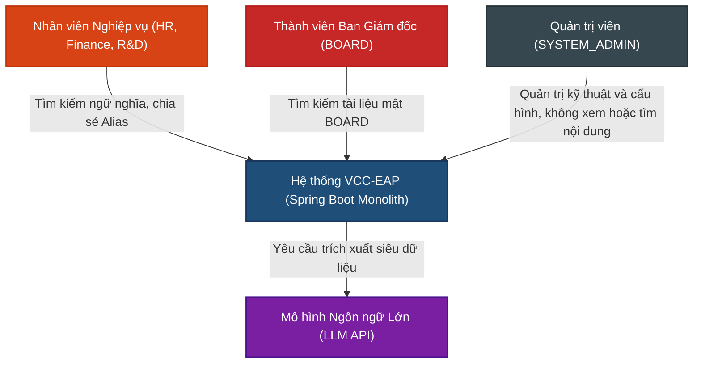
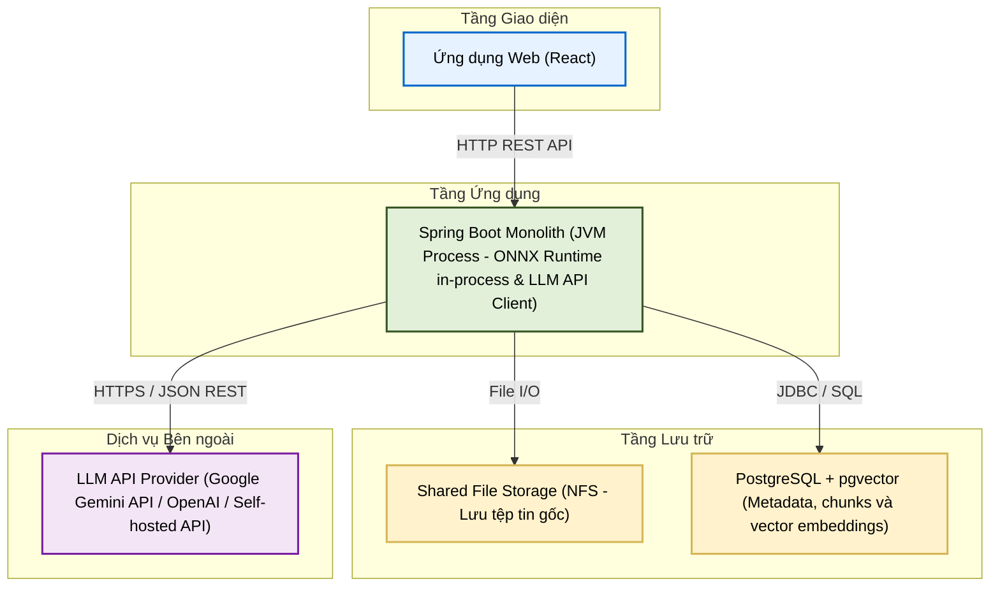
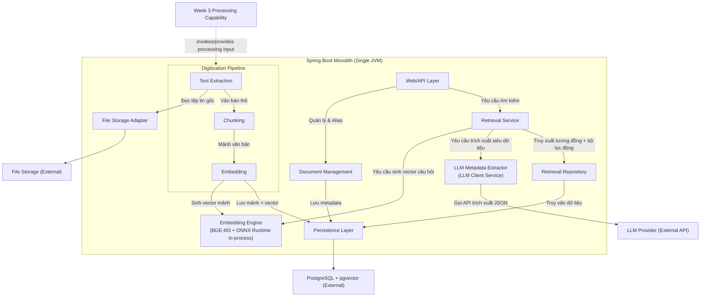

# TÀI LIỆU THIẾT KẾ KIẾN TRÚC (ADD)
**Tuần 4: Số hóa & Tra cứu Tri thức Cơ bản (Basic RAG - Retrieval Layer)**

---

## 1. Kiểm soát Tài liệu

### 1.1. Thông tin Tài liệu
| Thuộc tính | Giá trị |
| :--- | :--- |
| **Tiêu đề Tài liệu** | Tài liệu Thiết kế Kiến trúc - Tuần 4 (ADD-004) |
| **Dự án** | Nền tảng lưu trữ tri thức doanh nghiệp VCC (VCC-EAP) |
| **Phiên bản** | 1.3 |
| **Trạng thái** | Hoàn thiện |
| **Tác giả** | Senior Software Architect / Solution Architect |
| **Ngày phát hành** | 2026-08-19 |
| **Khung tham chiếu** | IEEE Std 42010-2011; C4 Model biểu diễn góc nhìn kiến trúc; Architecture Decision Records (ADRs) ghi nhận quyết định kiến trúc. |

### 1.2. Lịch sử Thay đổi
| Phiên bản | Ngày | Tác giả | Mô tả Thay đổi |
| :--- | :--- | :--- | :--- |
| 1.0 | 2026-08-07 | Senior Software Architect | Phiên bản đầu tiên. |
| 1.1 | 2026-08-13 | Senior Software Architect | Chuẩn hóa theo PRD v1.2: chuyển đổi phương pháp phân mảnh từ Phân mảnh Ngữ nghĩa sang Phân mảnh theo Đoạn văn (Paragraph Chunking), loại bỏ Matryoshka 768 chiều cho ranh giới câu, và tích hợp bộ lọc ngưỡng tương đồng tối thiểu. |
| 1.2 | 2026-08-14 | Senior Software Architect | Chuẩn hóa theo PRD v1.2 (cập nhật): loại bỏ giới hạn token tối đa/tối thiểu trong phân mảnh (max_tokens, min_tokens), tích hợp tiền lọc siêu dữ liệu JSONB (Metadata Pre-filtering) kèm chỉ mục GIN, loại bỏ Similarity Threshold trong tìm kiếm. |
| 1.3 | 2026-08-19 | Senior Software Architect | Cập nhật theo PRD v1.3: Tích hợp cơ chế trích xuất siêu dữ liệu tự động từ câu hỏi bằng LLM (LLM-based Metadata Extraction), đưa bộ lọc động JSONB vào mệnh đề WHERE của truy vấn pgvector để thực hiện tiền lọc động (dynamic metadata pre-filtering), đặc tả cơ chế xử lý lỗi/fallback khi LLM gặp sự cố hoặc trả về đối tượng rỗng. |
| 1.4 | 2026-08-21 | Senior Software Architect | Chuẩn hóa kiến trúc tiền lọc siêu dữ liệu theo bản chốt spec Metadata JSONB Filter 5 keys, chiến lược 2 chỉ mục (B-tree idx_meta_doc_type và GIN jsonb_path_ops idx_meta_gin), toán tử containment @> và cơ chế cổng chặn ngắt sớm (Metadata Hard Gate & Short-Circuit on Empty Candidates). Đồng thời tối ưu hóa System Prompt (chuyển sang mô hình trả về full schema và lọc rỗng trên Java Backend để giảm latency) và kích hoạt JSON Mode. |

---

## 2. Giới thiệu

### 2.1. Mục đích
Tài liệu này đặc tả thiết kế kiến trúc cho phân hệ **Số hóa & Tra cứu Tri thức Cơ bản (Basic RAG - Retrieval Layer)** thuộc hệ thống VCC-EAP. Tài liệu định nghĩa cách thức tổ chức các thành phần logic, ranh giới dữ liệu và bảo mật phòng ban, cùng cơ chế tích hợp mô hình nhúng cục bộ BGE-M3 và dịch vụ trích xuất siêu dữ liệu tự động bằng LLM từ câu hỏi để phục vụ cho quá trình lập Detailed Design.

### 2.2. Phạm vi Kiến trúc
* **Kiến trúc Số hóa**: Trích xuất văn bản thô, phân mảnh văn bản theo đoạn văn (Paragraph Chunking), sinh vector nhúng cho từng mảnh văn bản và lưu trữ các mảnh văn bản kèm vector.
* **Kiến trúc Tra cứu (Retrieval Layer)**: Tiếp nhận câu hỏi ngôn ngữ tự nhiên, trích xuất siêu dữ liệu tự động từ câu hỏi bằng LLM, sinh vector câu hỏi, thực hiện tìm kiếm tương đồng vector kết hợp tiền lọc siêu dữ liệu và phân quyền tại database, trả về kết quả.
* **Kiến trúc Phân quyền**: Thực thi Department Isolation, Alias-based Sharing, BOARD Isolation và Soft Delete trực tiếp tại ranh giới cơ sở dữ liệu.

### 2.3. Ngoài phạm vi (Out of Scope)
* **LLM Generation / RAG Chatbot**: Hệ thống không tự sinh câu trả lời bằng LLM hoặc tóm tắt tài liệu từ ngữ cảnh. Việc tích hợp LLM trong phạm vi phân hệ này chỉ phục vụ duy nhất cho mục đích trích xuất các thuộc tính siêu dữ liệu (Metadata Extraction) từ câu hỏi đầu vào để tạo thành đối tượng JSON bộ lọc.
* **Tìm kiếm nâng cao**: Không hỗ trợ xếp hạng lại (Re-ranking) bằng Cross-Encoder, không tích hợp tìm kiếm lai (Hybrid Search) kết hợp Full-text Search.
* **OCR**: Không hỗ trợ nhận dạng ký tự từ ảnh quét.
* **Cơ sở hạ tầng Tuần 3**: Tải tệp lên hệ thống, quản lý tệp vật lý, lập lịch tác vụ nền, hàng đợi xử lý bền vững (durable task queue), tiến trình quét tệp (scanner) và cơ chế tự phục hồi tác vụ khi server khởi động lại (`PROCESSING -> READY`) đều nằm ngoài phạm vi tài liệu này.

### 2.4. Sự phụ thuộc vào Kiến trúc Tuần 3 (Dependencies)
Tuần 4 kế thừa và phát triển dựa trên năng lực xử lý tài liệu bất đồng bộ đã được thiết lập từ Tuần 3.

Sơ đồ phân định ranh giới kiến trúc giữa Tuần 3 và Tuần 4:

```text
                    WEEK 3 (Upload & Async Infrastructure)
┌─────────────────────────────────────────────────────────────────────────┐
│ Upload HTTP -> Store Original File -> Set READY -> Scanner Thread       │
│                                                          │              │
│ (Quản lý hàng đợi tác vụ & Phục hồi khi server crash)    │              │
└──────────────────────────────────────────────────────────┼──────────────┘
                                                           │
                                                           │ Processing Capability
                                                           ▼
                    WEEK 4 (Digitization & Retrieval - This Document)
┌─────────────────────────────────────────────────────────────────────────┐
│ [Document Selected in PROCESSING State]                                 │
│        │                                                                │
│        ▼                                                                │
│ Text Extraction -> Paragraph Chunking -> Embeddings -> Persist          │
│                                                                  │      │
│ [State -> COMPLETED / FAILED]                                    │      │
│                                                                  ▼      │
│ User Query -> LLM Metadata Extraction                                   │
│            -> Query Embedding -> Auth-aware DB Retrieval -> Top-K       │
└─────────────────────────────────────────────────────────────────────────┘
```

---

## 3. Các Bên liên quan & Mối quan tâm

* **Nhân viên Nghiệp vụ (Employee)**: Quan tâm đến chất lượng kết quả tìm kiếm (đoạn văn bản chứa thông tin cần tìm xuất hiện trong Top-K kết quả trả về) và tốc độ phản hồi của tính năng tìm kiếm ngữ nghĩa.
* **Ban Giám đốc (BOARD User)**: Yêu cầu tính cô lập bảo mật tuyệt đối của tài liệu BOARD, đảm bảo không bị rò rỉ hoặc chia sẻ trái phép thông qua liên kết Alias.
* **Quản trị viên (SYSTEM_ADMIN)**: Có quyền quản trị cấu hình hệ thống nhưng bị chặn hoàn toàn quyền tìm kiếm ngữ nghĩa hoặc đọc nội dung các mảnh văn bản nghiệp vụ.
* **Đội ngũ Phát triển (Developers)**: Cần tài liệu đặc tả rõ ranh giới các thành phần logic, các bất biến kiến trúc (architectural invariants) để hiện thực hóa trong Detailed Design.
* **Đội ngũ Vận hành & Bảo mật (Ops & Security)**: Yêu cầu kiến trúc đơn giản tối đa (Spring Boot Monolith, PostgreSQL, không sử dụng hàng đợi ngoài hay vector database ngoài), bảo mật dữ liệu tuyệt đối tại tầng DB, và ngăn chặn việc tải dữ liệu chưa phân quyền lên bộ nhớ JVM.

---

## 4. Mục tiêu & Ràng buộc Kiến trúc

### 4.1. Mục tiêu Chất lượng (SLA)
1. **Độ trễ Tìm kiếm Ngữ nghĩa (Retrieval Latency)**:
   * Đây là mục tiêu hiệu năng cần được xác thực qua thực nghiệm (benchmark-validated performance targets under a defined environment and workload), không phải là cam kết kiến trúc tuyệt đối.
   * Thời gian phản hồi cuối-đến-cuối (end-to-end) cho một yêu cầu tìm kiếm ngữ nghĩa hướng tới chỉ số **p95 < 500ms** dưới khối lượng tải tiêu chuẩn.
   * Phạm vi đo lường: Gửi câu hỏi -> Trích xuất siêu dữ liệu qua LLM API -> Nhúng câu hỏi (Query Embedding) -> Lọc bảo mật & tiền lọc siêu dữ liệu tại Database -> Ánh xạ kết quả -> Trả về HTTP response.
2. **Thời gian Số hóa Tài liệu (Digitization Latency)**:
   * Đây là mục tiêu hiệu năng cần được xác thực qua thực nghiệm trong môi trường định trước.
   * Thời gian xử lý số hóa nền đối với tài liệu văn bản thô (text-native) dài 10 trang hướng tới hoàn thành **dưới 10 giây**.
   * Phạm vi đo lường: Từ thời điểm tác vụ số hóa nhận tài liệu ở trạng thái `PROCESSING` cho đến khi toàn bộ tiến trình số hóa hoàn tất và trạng thái tài liệu chuyển sang `COMPLETED`.
3. **Chất lượng Tìm kiếm (Retrieval Quality)**:
   * Tỷ lệ đoạn văn bản chứa thông tin cần tìm xuất hiện trong tối đa Top-K kết quả trả về (**Hit Rate @ Top-K**) đạt tối thiểu **90%** trên bộ dữ liệu kiểm thử Ground Truth gồm 50 câu hỏi nghiệp vụ đã chuẩn hóa (initial acceptance / benchmark dataset).
   * *Định nghĩa*: Hit Rate @ Top-K chỉ đo lường việc liệu có ít nhất một mảnh văn bản liên quan xuất hiện trong Top-K kết quả trả về của tầng Retrieval hay không.

### 4.2. Ràng buộc Kiến trúc
1. **Spring Boot Monolith duy nhất**: Chạy trên một tiến trình JVM độc lập. Không sử dụng kiến trúc microservices.
2. **Định dạng Vector 1024 chiều**: Cấu hình cột vector trong cơ sở dữ liệu bắt buộc là `vector(1024)`.
3. **Lọc phân quyền tại ranh giới Cơ sở dữ liệu (Database-level Authorization Filtering)**: Cấm cơ chế truy xuất vector không ràng buộc rồi thực hiện lọc phân quyền trên bộ nhớ JVM. Việc lọc quyền bắt buộc phải được dịch thành các điều kiện (predicates) trong câu lệnh SQL để PostgreSQL lọc trực tiếp tại tầng lưu trữ.
4. **Hạ tầng tối giản**: Không sử dụng vector database độc lập ngoài PostgreSQL (pgvector). Không sử dụng Kafka, RabbitMQ hoặc Redis.
5. **In-process Inference cho Embedding**: Mô hình nhúng BGE-M3 chạy trực tiếp bên trong JVM process thông qua thư viện ONNX Runtime.
6. **LLM Integration**: Việc trích xuất siêu dữ liệu động từ câu hỏi sử dụng một mô hình ngôn ngữ lớn (LLM) thông qua API (External/Internal API Client) với cơ chế xử lý lỗi chặt chẽ (fallback), không làm ảnh hưởng đến độ sẵn sàng của hệ thống tra cứu.

---

## 5. Kiến trúc Hệ thống (Mô hình C4)

### 5.1. C1 — System Context (Bối cảnh Hệ thống)
Sơ đồ C1 mô tả tương tác cấp hệ thống của các tác nhân với VCC-EAP:



### 5.2. C2 — Container (Kiến trúc Container)
Sơ đồ C2 mô tả ranh giới triển khai vật lý của hệ thống:



### 5.3. C3 — Component (Kiến trúc Thành phần)
Sơ đồ C3 phân rã cấu trúc logic bên trong Spring Boot Monolith:



---

## 6. Kiến trúc Số hóa Tài liệu & Vòng đời

Quy trình số hóa tài liệu diễn ra hoàn toàn sau khi tài liệu đã được chuyển sang trạng thái `PROCESSING` bởi tiến trình quét nền của Tuần 3.

### 6.1. Quy trình Xử lý Số hóa & Cơ chế Retry/Skip Chunk
Tiến trình số hóa thực hiện phân mảnh tài liệu và sinh vector cho từng chunk độc lập. Để đảm bảo tính bền vững của đường ống xử lý, lỗi phát sinh tại một chunk riêng lẻ sẽ được xử lý cô lập theo quy tắc sau:

```text
               [Bắt đầu số hóa mảnh (Chunk Ingestion)]
                                │
                                ▼
                       [Sinh Vector Nhúng]
                                │
                                ├── Thành công ──► [Lưu mảnh + Vector vào DB] ──► [Xử lý mảnh tiếp theo]
                                │
                                └── Thất bại (Lỗi phát sinh)
                                         │
                                         ▼
                               [Thử lại (Retry)] ◄─── Hoạt động tối đa 3 lần
                                         │
                          ┌──────────────┴──────────────┐
                          ▼ (Vẫn lỗi sau 3 lần)         ▼ (Thử lại thành công)
                   [BỎ QUA (SKIP)]             [Lưu mảnh + Vector vào DB]
                          │                             │
                          └──────────────┬──────────────┘
                                         ▼
                            [Xử lý mảnh tiếp theo]
```

* **Quy tắc cô lập lỗi (Isolated Chunk Failure)**: Thất bại của một mảnh văn bản riêng lẻ (sau tối đa 3 lần retry sinh vector hoặc lưu trữ) **không được phép** dừng hoặc hủy bỏ toàn bộ đường ống số hóa tài liệu. Các mảnh lỗi sẽ bị bỏ qua (skipped), ghi nhận thông tin cảnh báo/lỗi phục vụ giám sát (observability), và đường ống vẫn tiếp tục xử lý các mảnh văn bản kế tiếp của tài liệu.
* **Cập nhật trạng thái tài liệu**: Sau khi toàn bộ các mảnh văn bản của tài liệu đã được xử lý (bao gồm các mảnh thành công và các mảnh bị bỏ qua do cạn kiệt số lần retry), tài liệu sẽ được chuyển sang trạng thái `COMPLETED`. 
* **Trạng thái tài liệu lỗi**: Tài liệu chỉ chuyển sang trạng thái `FAILED` khi gặp lỗi hệ thống nghiêm trọng làm sập toàn bộ luồng số hóa (ví dụ: mất kết nối cơ sở dữ liệu, lỗi trích xuất văn bản thô trên toàn bộ tệp, v.v.). Hệ thống không tạo thêm các trạng thái vòng đời trung gian khác (như `COMPLETED_WITH_WARNINGS`) để giữ kiến trúc tối giản.
* **Bất biến về truy xuất mảnh bị skip**: Các mảnh văn bản bị bỏ qua trong quá trình số hóa do lỗi (`skipped chunks`) sẽ không có vector nhúng tương ứng trong cơ sở dữ liệu, và mặc nhiên không được phép tham gia vào bất kỳ truy vấn tìm kiếm ngữ nghĩa nào.

---

## 7. Kiến trúc Sinh Vector Nhúng (Embedding Engine)

* **In-process Inference**: Sinh vector nhúng cục bộ thông qua ONNX Runtime tích hợp trong tiến trình JVM của Spring Boot Monolith với mô hình BGE-M3. Không sử dụng dịch vụ nhúng ngoài nhằm đảm bảo an toàn thông tin và giảm độ trễ mạng.
* **Số chiều biểu diễn**: Cột lưu trữ vector bắt buộc là 1024 chiều.
* **Tính đồng nhất của Không gian Vector (Vector Space Invariant)**:
  $$\vec{v}_{\text{query}} \in \mathbb{R}^{1024} \quad \text{và} \quad \vec{v}_{\text{chunk}} \in \mathbb{R}^{1024}$$
  Quá trình sinh vector nhúng cho mảnh văn bản khi số hóa (Ingestion-time) và cho câu hỏi của người dùng khi truy vấn (Query-time) bắt buộc phải sử dụng chung một phiên bản mô hình nhúng BGE-M3 và chung một không gian vector. Nếu phiên bản mô hình nhúng thay đổi, toàn bộ các vector nhúng hiện tại trong cơ sở dữ liệu phải được tạo lại từ đầu (re-indexed/re-generated).
* **Khả năng truy vết phiên bản mô hình (Model Version Traceability)**: Phiên bản mô hình nhúng hiện tại được cấu hình tập trung ở cấp độ ứng dụng (`application.yml`). Để tiết kiệm dung lượng lưu trữ, hệ thống không lưu tên và phiên bản mô hình cho từng dòng vector trong cơ sở dữ liệu. Tất cả các vector trong `tbl_chunks` mặc nhiên được coi là thuộc về phiên bản mô hình đang hoạt động; khi thay đổi mô hình, bắt buộc phải chạy tiến trình re-index toàn bộ dữ liệu.
* **Quản lý luồng và kiểm soát tài nguyên (Thread Pooling & Resource Management)**: Tiến trình sinh vector nhúng chạy in-process chia sẻ tài nguyên CPU và RAM của JVM với các luồng Web API xử lý yêu cầu HTTP. Nhằm đảm bảo tính sẵn sàng của hệ thống và tránh làm treo/nghẽn luồng xử lý Web API chính (Tomcat threads), hệ thống đặc tả cấu hình phân bổ tài nguyên và quản lý luồng như sau:
  * **Cấu hình ONNX Runtime Session (`SessionOptions`)**:
    * `intra_op_num_threads`: Giới hạn luồng tính toán song song các toán tử (như nhân ma trận) bên trong 1 phiên chạy mô hình. Cấu hình này được giới hạn tối đa bằng **1/2 số nhân CPU vật lý** của máy chủ (ví dụ: tối đa 4 luồng trên máy chủ 8 nhân).
    * `inter_op_num_threads`: Thiết lập cố định bằng `1` do các mảnh văn bản được nhúng tuần tự trong mỗi tác vụ, tránh phát sinh overhead quản lý luồng không cần thiết.
    * Chế độ thực thi: `ORT_SEQUENTIAL`.
    * Đảm bảo ONNX Runtime Session được khởi tạo và quản lý dưới dạng **Singleton Bean** trong Spring Context để tái sử dụng luồng, tránh tạo nhiều session gây bùng nổ số lượng luồng ngoài kiểm soát.
  * **Cấu hình Spring TaskExecutor cho tác vụ số hóa nền (`asyncDigitizationExecutor`)**:
    * Sử dụng một `ThreadPoolTaskExecutor` riêng biệt được cấu hình giới hạn kích thước (Bounded Queue Thread Pool) với các tham số mặc định: `corePoolSize = 1`, `maxPoolSize = 2`, `queueCapacity = 1000`. Việc sử dụng Bounded Queue giúp ngăn ngừa nguy cơ OOM do tích lũy quá nhiều tác vụ chờ xử lý trong bộ nhớ JVM Heap.
    * Đặt độ ưu tiên của các luồng xử lý số hóa nền ở mức thấp nhất (`Thread.MIN_PRIORITY = 1`). Điều này buộc Hệ điều hành (OS Scheduler) ưu tiên thời gian xử lý CPU cho các luồng HTTP của Tomcat phục vụ tra cứu thời gian thực (SLA p95 < 500ms) trước khi phân bổ cho tác vụ xử lý nền.
* **Đánh giá Bộ nhớ ONNX Runtime**: Bộ nhớ sử dụng bởi mô hình nhúng và ONNX Runtime phải được đánh giá tổng thể ở cấp độ tiến trình hệ điều hành (Process level), bao gồm cả vùng nhớ Heap JVM (JVM Heap) và các vùng nhớ ngoài Heap (native/off-heap memory) được cấp phát bởi ONNX Runtime.

---

## 8. Kiến trúc Tìm kiếm Vector & So khớp

Quy trình tìm kiếm tương đồng ngữ nghĩa tích hợp trích xuất siêu dữ liệu động bằng LLM và tiền lọc tại database diễn ra như sau:

```text
[Câu hỏi ngôn ngữ tự nhiên]
             │
             ├───► [Embedding Engine (BGE-M3)] ───► Sinh vector truy vấn 1024 chiều
             │                                                    │
             └───► [LLM Metadata Extractor] ───► Trích xuất siêu dữ liệu dạng JSON ──┐
                                                                                       │
                                                                                       ▼
[Tiền lọc tại ranh giới DB] ◄─────────────────────────────────────────────────────────┘
             │
             ├───► Thực thi đồng thời trong mệnh đề WHERE của SQL:
             │     - Tiền lọc siêu dữ liệu JSONB động (trích xuất bởi LLM)
             │     - Kết hợp bộ lọc siêu dữ liệu thủ công từ giao diện (nếu có)
             │     - Cô lập phòng ban (Department Isolation)
             │     - Liên kết chia sẻ Alias (Alias Sharing)
             │     - Cô lập BOARD (BOARD Isolation)
             │     - Trạng thái tài liệu gốc là COMPLETED
             │     - Loại trừ tài liệu bị Soft Delete
             ▼
    [Filtered Candidates]
             │
             ▼
   [Tính toán Cosine Similarity] ─► Chỉ thực hiện tính toán trên tập ứng viên đã lọc
             │
             ▼
          [Ranking] ───────────────► Sắp xếp theo độ tương đồng giảm dần
             │
             ▼
        [Tối đa Top-K Chunks] ──────► Trả về Top K kết quả phù hợp nhất kèm trích dẫn
```

### 8.1. Phép đo Tương đồng (Similarity Metric)
Sử dụng độ tương đồng Cosine (Cosine Similarity) để so khớp vector câu hỏi và vector mảnh văn bản:
$$\text{Cosine Similarity} = \frac{\vec{u} \cdot \vec{v}}{\|\vec{u}\| \|\vec{v}\|}$$

### 8.2. Trích xuất Siêu dữ liệu (Hybrid Metadata Extraction)
Hệ thống kết hợp mã nguồn Java và Mô hình Ngôn ngữ Lớn (LLM) để trích xuất và quản lý cấu trúc siêu dữ liệu chuẩn hóa:
* **Cấu trúc 4 Key Metadata Filter (Phục vụ Tiền lọc SQL `@>`)**:
  1. **`doc_type`** (String Enum, lowercase - LLM trích xuất): Thể loại tài liệu (`guide`, `regulation`, `analysis`, `description`, `transaction`, `communication`, `education`, `news`, `literature`, `other`) dạng chữ thường.
  2. **`topics`** (String Array Enum, lowercase - LLM trích xuất): Chủ đề lớn cốt lõi (`hr_policy`, `compensation_benefits`, `finance_accounting`, `legal_compliance`, `it_technical`, `sales_marketing`, `operation_process`, `admin_facilities`, `board_direction`, `general_info`) - thay thế cho `chunk_role` cũ.
  3. **`entities`** (String Array, lowercase - LLM trích xuất chi tiết tỉ mỉ dạng `type:value`): Trích xuất phong phú và toàn diện tất cả thực thể, tên riêng và khái niệm chuyên môn: `org:` (tổ chức), `dept:` (phòng ban), `person:` (người/chức danh/vai trò), `product:` (sản phẩm), `law:` (văn bản/nội quy), `standard:` (tiêu chuẩn), `tech:` (công nghệ/phần mềm), `loc:` (địa danh/văn phòng), `concept:` (khái niệm/nghiệp vụ/chế độ/phụ cấp/quyền lợi cụ thể). *(Đã loại bỏ trường `keywords`; thay vào đó trường `entities` được mở rộng chi tiết bao gồm cả nhóm khái niệm `concept:`)*.
  4. **`time_refs`** (String Array, lowercase - LLM trích xuất): Mốc thời gian được chuẩn hóa (`yyyy`, `yyyy-qn`, `yyyy-mm`, `yyyy-mm-dd`, `2 năm`, `đầu năm`, `cuối quý`).
* **Cấu trúc 2 Key Trích dẫn Vị trí (Phục vụ Hiển thị UI)**:
  1. **`page_number`** (Integer): Số trang gốc trong tài liệu PDF.
  2. **`citation_headings`** (String Array): Mảng tiêu đề phân cấp gốc nguyên bản (giữ nguyên kiểu chữ nguyên bản - bao gồm chữ hoa như trong tài liệu gốc, ví dụ: `["Chương I: Quy định chung", "Mục 2: Lương cơ bản"]`).

1. **Khi số hóa tài liệu (Ingestion-time)**:
   * **Mã Java (`ParagraphChunker`)**: Tự động duy trì Cây Tiêu Đề (`H1 > H2 > H3`) để cung cấp bối cảnh đề mục và trích xuất danh sách `citation_headings` phân cấp.
   * **LLM API Client**: Phân tích đoạn văn bản kèm bối cảnh Cây Tiêu Đề để trích xuất các thuộc tính siêu dữ liệu trong 1 cuộc gọi API duy nhất. Tất cả các giá trị thuộc tính metadata (doc_type, topics, entities, time_refs) được chuyển về chữ thường (`lowercase`).
   * **Quy tắc lược bỏ thuộc tính rỗng**: Để tiết kiệm không gian lưu trữ và tối ưu hóa chỉ mục, các key rỗng (`null` hoặc `[]`) được loại bỏ hoàn toàn tại tầng Java Backend (`filterOmittedKeys()`) trước khi ghi vào cột `metadata` JSONB của `tbl_chunks`.
2. **Khi người dùng truy vấn (Query-time)**:
   * **Nguyên lý hoạt động**: Khi tiếp nhận câu hỏi tự nhiên từ người dùng, hệ thống gửi câu hỏi qua LLM để nhận diện các tiêu chí lọc siêu dữ liệu. Trong đó các trường `doc_type` và `topics` BẮT BUỘC KHÔNG NULL (sử dụng fallback `"other"` và `["general_info"]` nếu câu hỏi không chỉ định rõ thể loại/chủ đề). Toàn bộ các giá trị trong đối tượng lọc metadata filter đều được tự động chuẩn hóa sang chữ thường (`lowercase`).
3. **Xử lý song song**: 
   * Ở luồng truy vấn, gọi LLM trích xuất siêu dữ liệu và nhúng vector câu hỏi (Query Embedding) chạy song song qua `CompletableFuture`.

### 8.3. Tiền lọc Siêu dữ liệu Động & Tối ưu HNSW khi Lọc Đa Điều Kiện
* **Quy trình thực thi**:
  1. Nhận đối tượng JSON phẳng chứa các tiêu chí lọc do LLM trích xuất từ câu hỏi.
  2. Kết hợp logic `AND` đối tượng này với bộ lọc thủ công (nếu có).
  3. Áp dụng mệnh đề tiền lọc `c.metadata @> CAST(:metadataFilter AS jsonb)` kết hợp các điều kiện phân quyền tại cơ sở dữ liệu.
* **Phương án Tối ưu HNSW Vector Index khi Lọc Đa Điều Kiện Chặt Chẽ**:
  * Khi áp dụng đồng thời tất cả các điều kiện lọc (Phòng ban, Alias, BOARD isolation, Soft delete, và Metadata JSONB `@>`), hệ thống thiết lập cấu hình phiên truy vấn:
    ```sql
    SET pgvector.iterative_index_scan = 'strict';
    SET hnsw.ef_search = 64;
    ```
  * **Cơ chế Quét Lặp Chỉ Mục (`iterative_index_scan = 'strict'`)**: Buộc `pgvector` tiếp tục duyệt mở rộng đồ thị HNSW lân cận để lấy thêm ứng viên cho đến khi thu đủ Top-K bản ghi thỏa mãn **ĐỒNG THỜI TẤT CẢ các mệnh đề WHERE**, ngăn chặn PostgreSQL Planner từ bỏ chỉ mục HNSW để chuyển sang Sequential Scan.
* **Chỉ mục 2 Lớp tối ưu**: B-tree `idx_meta_doc_type` trên `(metadata->>'doc_type')` và GIN `jsonb_path_ops` `idx_meta_gin` trên `metadata`.
* **Cơ chế Ngắt Sớm (Short-Circuit)**:
  * Nếu câu hỏi không trích xuất được siêu dữ liệu nào HOẶC kết quả tiền lọc kết hợp phân quyền trả về **0 phân đoạn ứng viên** ($N=0$), hệ thống lập tức ngắt luồng tra cứu và trả về kết quả rỗng `[]` ("Không tìm thấy") ngay lập tức. Hệ thống tuyệt đối không tự động nới lỏng hoặc loại bỏ bộ lọc metadata để chạy tính toán vector Cosine trên toàn bộ tập dữ liệu.
* **Yêu cầu kết quả (Top-K)**: Cơ sở dữ liệu chỉ thực thi tính toán Cosine Similarity trên các phân đoạn thỏa mãn cổng chặn tiền lọc metadata và phân quyền, sắp xếp giảm dần theo điểm Cosine và trả về tối đa Top-K phân đoạn phù hợp nhất (không áp dụng ngưỡng lọc điểm Cosine cố định).

### 8.4. Cơ chế Xử lý Ngoại lệ & Fallback của LLM (LLM Exception & Fallback Policy)
Để đảm bảo hệ thống tra cứu hoạt động an sau và đúng nguyên tắc cổng chặn siêu dữ liệu, luồng trích xuất siêu dữ liệu qua LLM tuân thủ chặt chẽ các quy tắc sau:
1. **Trích xuất siêu dữ liệu rỗng (Empty Metadata)**: Nếu LLM không nhận diện được thuộc tính siêu dữ liệu nào từ câu hỏi, hệ thống tự động kích hoạt cơ chế **Short-Circuit ngắt sớm**, trả về kết quả rỗng `[]` mà không chạy truy vấn vector toàn bảng.
2. **Lỗi hệ thống hoặc Timeout (API Failure/Timeout)**: Trường hợp kết nối tới dịch vụ LLM bên ngoài bị lỗi hoặc timeout, hệ thống bắt ngoại lệ, ghi log cảnh báo và fallback trả về map rỗng `{}`. Việc trả về map rỗng này kích hoạt Short-Circuit ngắt sớm trả về "Không tìm thấy", đảm bảo tuyệt đối không rò rỉ hay bỏ qua cổng lọc siêu dữ liệu. Thời gian timeout cho cuộc gọi LLM trích xuất siêu dữ liệu được cấu hình nghiêm ngặt (`eap.llm.query-timeout-ms=2000ms`) để đảm bảo SLA.

---

## 9. Kiến trúc Phân quyền & Bảo mật

Phân quyền truy cập tài liệu ngữ nghĩa được thực thi triệt để tại **ranh giới Cơ sở dữ liệu (Database-level Authorization Filtering)**.

### 9.1. Quy chế thực thi phân quyền
Chính sách bảo mật (phòng ban, Alias, BOARD, Soft Delete) thuộc tầng nghiệp vụ của ứng dụng được Repository chuyển dịch thành các mệnh đề điều kiện (SQL predicates) lồng ghép trực tiếp vào câu lệnh truy vấn tìm kiếm tương đồng vector. Hệ thống cấm việc truy vấn dữ liệu vector không ràng buộc rồi thực hiện lọc kết quả trên JVM. Mọi mảnh văn bản không hợp lệ về mặt quyền truy cập tuyệt đối không được nạp vào bộ nhớ JVM.

### 9.2. Các quy tắc phân quyền cốt lõi
* **Cô lập phòng ban (Department Isolation)**: Người dùng thuộc phòng ban $D_A$ chỉ được phép tìm kiếm và xem các mảnh văn bản thuộc tài liệu do phòng ban $D_A$ sở hữu, hoặc tài liệu của phòng ban khác được chia sẻ hợp lệ cho $D_A$ qua liên kết Alias.
* **Liên kết chia sẻ (Alias Sharing)**:
  * Cho phép chia sẻ tài liệu giữa phòng ban sở hữu sang phòng ban nhận dưới dạng liên kết logic Alias.
  * Quyền truy cập qua Alias chỉ có hiệu lực khi tài liệu gốc tương ứng chưa bị đánh dấu xóa logic (Soft Delete). Khi tài liệu gốc bị xóa logic, các liên kết chia sẻ Alias liên quan cũng lập tức mất hiệu lực.
* **Cô lập tuyệt đối của BOARD (BOARD Isolation)**:
  * Tài liệu thuộc phòng ban BOARD chỉ cho phép người dùng thuộc BOARD truy xuất.
  * Hệ thống cấm tạo liên kết chia sẻ (Alias) đối với tài liệu của BOARD ra các phòng ban bên ngoài, đồng thời BOARD cũng không nhận chia sẻ Alias từ phòng ban khác. Không có bất kỳ cơ chế Alias nào được phép bypass quy tắc cô lập của BOARD.
* **Hạn chế đối với Quản trị viên (SYSTEM_ADMIN)**:
  * Tài khoản `SYSTEM_ADMIN` bị chặn quyền thực hiện tìm kiếm ngữ nghĩa và xem nội dung chi tiết của tất cả các tài liệu/mảnh văn bản trên hệ thống.
  * Ràng buộc này được thực thi tại Web/API Layer đối với mọi đường dẫn truy cập nội dung người dùng (user-facing content-access paths), không chỉ giới hạn ở API tìm kiếm `/search`.
* **Xử lý tài liệu đã xóa (Soft Delete)**:
  * Khi tài liệu bị đánh dấu xóa logic, toàn bộ các mảnh văn bản thuộc tài liệu đó lập tức bị loại trừ khỏi phạm vi tìm kiếm ngữ nghĩa thông qua điều kiện lọc trạng thái tài liệu ở câu lệnh SQL.

---

## 10. Chiến lược Phân mảnh & Tách biệt Lưu trữ

### 10.1. Chiến lược Phân mảnh (Document Chunking)
Hệ thống sử dụng giải pháp **Phân mảnh theo Đoạn văn kết hợp Heading Stack Tracker (Paragraph Chunking with Heading Stack)**.
* **Nguyên lý hoạt động**:
  * **Phân biệt Đề mục vs Bullet Items con**:
    * **Đề mục (Headings - `1.`, `1.1`, `1.2`, `2`, `3`, `#`, `Chương`, `Điều`)**: Các dòng bắt đầu bằng số thứ tự đề mục (`1.`, `1.1`, `1.1.1`, `2`, `3`), Markdown `#`, `Chương`, `Điều` được nhận diện là **Headings** và nạp vào bộ **Heading Stack Tracker** (`H1 > H2 > H3`), KHÔNG gộp vào đoạn văn.
    * **Bullet Items con (Child Items - Dấu chấm `•`, Gạch đầu dòng `-`, `*`, `+`, Chữ cái `a)`, `b)`)**: Tất cả các dòng danh sách con **được gộp toàn bộ vào cùng 1 phân đoạn (chunk) duy nhất** thuộc khối đoạn văn cha chứa chúng, không xé lẻ từng gạch đầu dòng thành chunk riêng.
  * **Bối cảnh Cây Tiêu Đề (Heading Stack)**: Mã Java duy trì Cây Tiêu Đề bao hàm phân cấp (`H1 > H2 > H3`), trích xuất mảng `citation_headings` nguyên bản phục vụ hiển thị trích dẫn và truyền bối cảnh đề mục này sang LLM API để trích xuất chính xác 4 nhóm siêu dữ liệu (`doc_type`, `topics`, `entities`, `time_refs`).
  * **Không áp dụng giới hạn kích thước**: Toàn bộ khối đoạn văn + bullet items con tự nhiên được gộp lại sẽ tạo thành 1 chunk duy nhất, không áp dụng cắt cứng hay giới hạn token.
  * **Tính lũy đẳng (Idempotency)**: Đảm bảo quy trình số hóa và lưu trữ chunk là deterministic. Khi số hóa lại, các chunk mới sẽ ghi đè hoặc cập nhật chính xác lên các chunk cũ của tài liệu.

### 10.2. Tách biệt Hạ tầng Lưu trữ (Storage Separation)
* **Kho Lưu trữ Tệp tin (File Storage)**: Lưu trữ vật lý các tệp tài liệu gốc nguyên bản (PDF, Word, Excel). Các thuộc tính như cấu trúc thư mục, thuật toán đặt tên tệp, ghi tệp nguyên tử nằm ngoài phạm vi tài liệu này.
* **Cơ sở dữ liệu Quan hệ (PostgreSQL + pgvector)**: Lưu trữ metadata tài liệu, cấu hình Alias, nội dung văn bản của từng mảnh (`tbl_chunks`), vector nhúng 1024 chiều tương ứng và siêu dữ liệu nội dung dạng `JSONB` lưu tại cột `metadata` (chứa các trường thuộc các key chuẩn hóa: `doc_type`, `topics`, `entities`, `time_refs`, `citation_headings`). Cột `metadata` được thiết lập chiến lược 2 chỉ mục tối ưu: B-tree `idx_meta_doc_type` cho `doc_type` và GIN `jsonb_path_ops` `idx_meta_gin` cho các mảng thuộc tính còn lại để hỗ trợ tiền lọc nhanh trước khi so khớp vector.

---

## 11. Các Bất biến Kiến trúc (Architectural Invariants)

Hệ thống bắt buộc phải duy trì và tuân thủ các bất biến kiến trúc sau đây tại mọi thời điểm:
1. **Trạng thái sẵn sàng tra cứu**: Chỉ các mảnh văn bản thuộc tài liệu có trạng thái `COMPLETED` mới được tham gia vào quá trình tìm kiếm tương đồng vector.
2. **Không lọc quyền trên JVM (No JVM Post-filtering)**: Các mảnh văn bản không hợp lệ về quyền truy cập tuyệt đối không được nạp vào bộ nhớ JVM từ cơ sở dữ liệu để thực hiện lọc quyền bằng mã ứng dụng.
3. **Lọc quyền và tiền lọc tại DB (Database-level Filtering)**: Bộ lọc cô lập phòng ban (Department Isolation), bộ lọc siêu dữ liệu thủ công, và bộ lọc siêu dữ liệu động được trích xuất từ câu hỏi bởi LLM bắt buộc phải được thực thi trực tiếp trong câu lệnh truy vấn SQL ở tầng lưu trữ để lọc trước tập ứng viên trước khi thực hiện tính toán khoảng cách vector.
4. **Hiệu lực của Alias phụ thuộc tài liệu gốc**: Quyền truy cập thông qua Alias lập tức mất hiệu lực khi tài liệu gốc bị đánh dấu xóa logic (Soft Delete).
5. **Tính cô lập của BOARD**: Sự cô lập tài liệu của BOARD là tuyệt đối và không thể bị bypass bởi bất kỳ cơ chế chia sẻ Alias nào.
6. **Giới hạn quyền của SYSTEM_ADMIN**: Tài khoản `SYSTEM_ADMIN` bị từ chối truy cập nội dung tài liệu và mảnh văn bản trên mọi giao diện và đường dẫn API của ứng dụng.
7. **Đồng nhất Không gian Vector**: Quy trình nhúng khi số hóa (Ingestion-time) và nhúng khi truy vấn (Query-time) bắt buộc sử dụng chung một phiên bản mô hình nhúng BGE-M3 và cùng không gian vector 1024 chiều.
8. **Khả năng truy vết mô hình**: Phiên bản mô hình nhúng được quản lý tập trung ở cấu hình hệ thống (application.yml). Toàn bộ vector trong cơ sở dữ liệu mặc nhiên thuộc về không gian vector của phiên bản mô hình này; khi thay đổi mô hình, hệ thống bắt buộc phải thực hiện re-index toàn bộ để đảm bảo đồng nhất không gian vector.
9. **Giới hạn tài nguyên số hóa nền và quản lý luồng (Resource Bounding & Thread Management)**: Các tác vụ số hóa nền bắt buộc phải được giới hạn tài nguyên tính toán để không chiếm quyền xử lý hoặc gây nghẽn luồng truy xuất thời gian thực của người dùng. Cụ thể: áp dụng cơ chế xử lý cuốn chiếu (Incremental Chunk Processing), Batch Inference tối đa 128 chunks mỗi đợt, giới hạn số luồng tính toán song song CPU của ONNX Runtime session tối đa bằng 1/2 số nhân CPU thực tế (`intra_op_num_threads`), cố định `inter_op_num_threads = 1`, chạy tác vụ nền trên Thread Pool riêng biệt (`corePoolSize = 1`, `maxPoolSize = 2`, Bounded Queue capacity = 1000) và hạ độ ưu tiên luồng xuống mức thấp nhất (`Thread.MIN_PRIORITY = 1`) để ưu tiên hiệu năng xử lý REST API.
10. **Không định nghĩa lại hạ tầng Tuần 3**: Kiến trúc Tuần 4 không thiết kế lại hoặc sao chép cơ sở hạ tầng upload tệp, scanner quét tệp, hàng đợi tác vụ và cơ chế tự phục hồi tác vụ sau crash của Tuần 3.
11. **Lỗi Chunk độc lập (Isolated Chunk Failure)**: Sự thất bại của một mảnh văn bản riêng lẻ sau khi cạn kiệt 3 lần retry bắt buộc không được làm dừng hay hủy bỏ toàn bộ đường ống số hóa tài liệu. Mảnh lỗi sẽ bị skip, ghi nhận thông tin và đường ống tiếp tục xử lý mảnh kế tiếp. Mảnh bị skip không có vector nhúng và không tham gia tra cứu.
12. **Tiền lọc trước khi tính Vector (Metadata Pre-filtering)**: Mọi truy vấn tra cứu tri thức kết hợp tìm kiếm vector bắt buộc phải thực hiện tiền lọc bằng Metadata để định vị phạm vi chunk liên quan trước khi tính toán độ tương đồng Cosine nhằm tối ưu hiệu năng và độ chính xác.
13. **Cơ chế Fallback trích xuất siêu dữ liệu**: Tiến trình trích xuất siêu dữ liệu bằng LLM không được phép làm gián đoạn luồng tìm kiếm chính. Nếu LLM lỗi hoặc phản hồi rỗng, hệ thống phải tự động fallback và tiếp tục thực hiện tìm kiếm ngữ nghĩa mà không áp dụng bộ lọc siêu dữ liệu động.

---

## 12. Hồ sơ Quyết định Kiến trúc (ADR)

### 12.1. ADR-004-1: Chiến lược Phân mảnh Tài liệu
* **Trạng thái**: Đã phê duyệt.
* **Bối cảnh**: Văn bản trích xuất từ tài liệu gốc cần được chia tách thành các mảnh để đưa vào cơ sở dữ liệu. Cần một phương pháp phân mảnh đơn giản, hiệu năng cao và giữ được tính liên kết ngữ nghĩa tự nhiên của văn bản tiếng Việt mà không cần tính toán phức tạp in-memory của JVM.
* **Quyết định**: Sử dụng giải pháp **Phân mảnh theo Đoạn văn gộp Bullet Items kết hợp Heading Stack Tracker**:
  * **Phân biệt Đề mục vs Bullet Items con**: Phân loại rõ số đề mục (`1.`, `1.1`, `2`, `3`, `#`) làm Heading Stack (`H1 > H2 > H3`); gộp toàn bộ các bullet item con (dấu chấm `•`, `-`, `*`, `+`) vào đoạn văn cha chứa chúng.
  * **Bối cảnh Cây Tiêu Đề (Heading Stack)**: LLM API đọc bối cảnh Cây Tiêu Đề bao hàm (`H1 > H2 > H3`) để trích xuất chuẩn xác các nhóm thuộc tính siêu dữ liệu (`doc_type`, `topics`, `entities`, `time_refs`) và lưu trữ danh sách đề mục phân cấp `citation_headings`.
  * **Không giới hạn kích thước token**: Loại bỏ các ràng buộc `max_tokens` and `min_tokens` ở tầng phân mảnh, giữ nguyên cấu trúc đoạn văn bản gốc của tác giả tài liệu.
  * **Tính lũy đẳng**: Đảm bảo quy trình số hóa và lưu trữ chunk ghi đè hoặc cập nhật chính xác lên các chunk cũ đã có của tài liệu đó khi số hóa lại.
* **Các phương án thay thế**:
    * *Paragraph Chunking trần không có Heading Stack*: Cắt đoạn văn tự nhiên nhưng làm mất ngữ cảnh đề mục cha đối với các đoạn văn nằm sâu trong tài liệu.
    * *Fixed-size Chunking (Phân mảnh kích thước cố định)*: Cắt chuỗi theo số ký tự cố định. Đơn giản nhưng dễ cắt đôi câu ở ranh giới mảnh, làm mất ý nghĩa ngữ cảnh tiếng Việt.
* **Hệ quả**:
    *   Loại bỏ rủi ro Heading Context Loss.
    *   Giữ nguyên vẹn tính toàn vẹn của đoạn văn bản do tác giả viết.
    *   Đảm bảo tính lũy đẳng (idempotency) của dữ liệu lưu trữ khi số hóa lại.

### 12.2. ADR-004-2: Bộ máy Lưu trữ Vector & Phép đo tương đồng
* **Trạng thái**: Đã phê duyệt.
* **Bối cảnh**: Hệ thống cần thực hiện tìm kiếm tương đồng vector trên hàng chục nghìn mảnh văn bản đồng thời thực thi các điều kiện phân quyền phức tạp chéo phòng ban.
* **Quyết định**: Sử dụng `PostgreSQL + pgvector` (kiểu cột `vector(1024)`), sử dụng phép đo độ tương đồng Cosine, thiết lập chỉ mục `HNSW` trên cột chứa vector nhúng, và cấu hình `SET pgvector.iterative_index_scan = 'strict'` để duy trì hiệu năng HNSW ngay cả khi điều kiện WHERE có tính chọn lọc rất cao.
* **Các phương án thay thế**:
    * *Cơ sở dữ liệu Vector chuyên dụng (Milvus, Qdrant, Pinecone)*: Tối ưu cho quy mô vector cực lớn nhưng làm phức tạp hóa kiến trúc hạ tầng do phát sinh thêm node dịch vụ, và khó khăn trong việc đồng bộ trạng thái phân quyền phòng ban/Alias thời gian thực.
    * *Khoảng cách Euclidean (L2 Distance)*: Đo khoảng cách hình học tuyệt đối. Không phù hợp với bài toán so khớp văn bản vì khoảng cách bị ảnh hưởng mạnh bởi độ dài câu/mảnh văn bản.
* **Hệ quả**: Tận dụng tính nhất quán ACID của PostgreSQL, đơn giản hóa hạ tầng Monolith. Việc so khớp vector kết hợp lọc phân quyền được thực thi đồng thời trong một câu lệnh SQL duy nhất. Chỉ mục HNSW kết hợp Quét Lặp Chỉ Mục (`iterative_index_scan = 'strict'`) đảm bảo duy trì độ chính xác và hiệu năng vượt trội dưới mọi điều kiện lọc phức tạp.

### 12.3. ADR-004-3: Bộ máy Sinh Vector Nhúng Cục bộ
* **Trạng thái**: Đã phê duyệt.
* **Bối cảnh**: Hệ thống yêu cầu bảo mật thông tin nội bộ nghiêm ngặt, không được gửi dữ liệu văn bản ra API bên ngoài mạng và cần giảm thiểu chi phí tích hợp.
* **Quyết định**: Sử dụng mô hình nhúng cục bộ **BGE-M3** chạy in-process trực tiếp trong JVM thông qua thư viện ONNX Runtime. ONNX Runtime thực hiện sinh vector nhúng trực tiếp cho các chunk thành phẩm theo số chiều cấu hình của mô hình nhúng cục bộ (mặc định 1024 chiều đối với BGE-M3). Hệ thống áp dụng kiểm tra tính hợp lệ của vector nhúng được tạo ra (như số chiều vector tương thích với cấu hình).
* **Các phương án thay thế**:
    * *Sử dụng API nhúng thương mại bên ngoài (OpenAI, Cohere)*: Vật lý bảo mật (gửi thông tin nhạy cảm của doanh nghiệp ra ngoài) và phụ thuộc mạng ngoài làm tăng độ trễ phản hồi.
    * *Mô hình nhúng cỡ nhỏ chạy cục bộ (all-MiniLM-L6-v2)*: Kích thước mô hình nhẹ, nhưng khả năng hiểu ngữ nghĩa tiếng Việt kém, ảnh hưởng trực tiếp đến chất lượng tìm kiếm.
* **Hệ quả**: Đảm bảo an toàn thông tin vì không truyền văn bản ra ngoài doanh nghiệp. Mô hình nhúng BGE-M3 chạy in-process đáp ứng đầy đủ yêu cầu về bảo mật dữ liệu doanh nghiệp và độ chính xác ngữ nghĩa. Cần cấu hình JVM Heap thích hợp (-Xmx4g cho RAM 8GB) để chạy ổn định.

### 12.4. ADR-004-4: Lọc Phân quyền tại Tầng Repository
* **Trạng thái**: Đã phê duyệt.
* **Bối cảnh**: VCC-EAP yêu cầu kiểm soát quyền truy cập tài liệu nghiêm ngặt chéo phòng ban. Cần quyết định vị trí thực thi chính sách phân quyền này trong quy trình tìm kiếm tương đồng vector để đảm bảo an toàn thông tin tối đa mà không ảnh hưởng tới độ chính xác của kết quả.
* **Quyết định**: Ủy quyền truy xuất bắt buộc phải được thực thi trực tiếp tại ranh giới cơ sở dữ liệu (`Database-level Authorization Filtering`). Các điều kiện lọc bảo mật được đưa trực tiếp vào điều kiện lọc của câu lệnh SQL thực hiện tìm kiếm vector.
* **Các phương án thay thế**:
    * *Lọc phân quyền ở tầng ứng dụng (Application-side Filtering / Post-filtering)*: Thực hiện tìm kiếm tương đồng vector trên toàn bộ cơ sở dữ liệu để lấy ra Top-K kết quả gần nhất, sau đó dùng mã nguồn Java để duyệt qua danh sách và lọc bỏ các bản ghi người dùng không có quyền truy cập để chọn ra Top-3. Phương án này chứa đựng rủi ro bảo mật lớn (dữ liệu trái phép bị nạp lên bộ nhớ ứng dụng). Hơn nữa, nó gây suy giảm nghiêm trọng chất lượng tìm kiếm: nếu toàn bộ Top-K kết quả đầu tiên đều thuộc phòng ban khác và bị lọc bỏ, người dùng sẽ không nhận được kết quả nào mặc dù trong phòng ban của họ có tồn tại tài liệu liên quan.
* **Hệ quả**: Bảo vệ an toàn thông tin, ngăn chặn dữ liệu không được phép truy cập nạp lên bộ nhớ JVM. Đảm bảo trả về tối đa Top-3 kết quả hợp lệ mà người dùng thực sự có quyền xem. Câu lệnh SQL ở tầng Repository sẽ phức tạp hơn và cần được tối ưu hiệu năng cẩn thận.

### 12.5. ADR-004-5: Chiến lược Tiền lọc Siêu dữ liệu (Metadata Pre-filtering) & Cổng Chặn Ngắt Sớm
* **Trạng thái**: Đã phê duyệt.
* **Bối cảnh**: Khi tìm kiếm ngữ nghĩa, hệ thống cần nhắm mục tiêu chính xác vào các phần nội dung liên quan nhất để giảm nhiễu ngữ cảnh và tối ưu hóa tính liên quan của kết quả trả về.
* **Quyết định**: Sử dụng chiến lược **Tiền lọc Siêu dữ liệu tại Cơ sở dữ liệu (Database-level Metadata Pre-filtering)** làm cổng chặn cứng (Hard Gate) trước khi thực hiện tính toán Cosine Similarity để so khớp vector.
  * Sử dụng chiến lược 2 chỉ mục tối ưu trên cột `metadata` JSONB: B-tree `idx_meta_doc_type` trên `(metadata->>'doc_type')` và GIN `jsonb_path_ops` `idx_meta_gin` trên `metadata`.
  * Câu truy vấn SQL sử dụng toán tử khớp chứa JSONB `@>` với tham số `:metadataFilter` để thực hiện tiền lọc nhanh cấp cơ sở dữ liệu.
  * **Quy tắc ngắt sớm (Short-circuit on Empty Candidates)**: Nếu tập ứng viên thỏa mãn tiền lọc metadata rỗng ($N=0$), hệ thống ngắt luồng xử lý và trả về kết quả rỗng `[]` ("Không tìm thấy") ngay lập tức. Tuyệt đối không nới lỏng hay bỏ bộ lọc metadata để tính toán vector trên toàn bộ tập dữ liệu.
* **Các phương án thay thế**:
    * *Lọc siêu dữ liệu sau tìm kiếm vector (Post-filtering)*: Sử dụng HNSW Index tìm kiếm ra Top-K bản ghi gần nhất toàn bảng, sau đó áp dụng bộ lọc metadata để lọc bỏ các bản ghi không khớp. Phương án này dẫn tới lỗi "hụt kết quả" nếu Top-K bản ghi tương đồng nhất không chứa các bản ghi thỏa mãn metadata (ví dụ tìm Top-10 nhưng cả 10 bản ghi đều không khớp metadata khiến kết quả trả về trống rỗng, mặc dù trong bảng có bản ghi khớp metadata và có độ tương đồng khá cao).
    * *Bỏ bộ lọc khi tiền lọc rỗng (Fallback to Unfiltered Vector Search)*: Nếu tiền lọc metadata trả về 0 kết quả, chuyển sang tìm kiếm vector không lọc metadata. Phương án này vi phạm nghiêm trọng yêu cầu nghiệp vụ do trả về các tài liệu không khớp loại/thực thể người dùng yêu cầu.
* **Hệ quả**:
    *   Đảm bảo kết quả Top-K trả về luôn khớp chính xác 100% với bộ lọc metadata nghiệp vụ của người dùng.
    *   Tối ưu hóa hiệu năng truy vấn: nhờ chỉ mục GIN `jsonb_path_ops`, PostgreSQL lọc trước các bản ghi một cách cực kỳ nhanh chóng. Việc tính toán Cosine Similarity chỉ thực thi trên tập nhỏ các bản ghi thỏa mãn, giảm tải đáng kể phép toán dấu phẩy động trên CPU so với việc tính toán khoảng cách vector trên quy mô lớn.

### 12.6. ADR-004-6: Cơ chế Trích xuất Siêu dữ liệu từ câu hỏi sử dụng LLM
* **Trạng thái**: Đã phê duyệt.
* **Bối cảnh**: Người dùng thường đặt câu hỏi chứa các thông tin siêu dữ liệu cụ thể (ví dụ: "Báo cáo năm 2026", "Quy chế của HR"). Nếu chỉ tìm kiếm vector thuần túy, các phân đoạn tương đồng cao thuộc các năm khác hoặc phòng ban khác có thể làm nhiễu kết quả. Cần một cơ chế trích xuất các thuộc tính siêu dữ liệu này từ câu hỏi tự nhiên để lọc trước khi tính toán độ tương đồng.
* **Quyết định**: Tích hợp một mô hình ngôn ngữ lớn (LLM) thông qua API (như Google Gemini API hoặc OpenAI/self-hosted API) để thực hiện phân tích và trích xuất siêu dữ liệu dưới dạng JSON (LLM-based Metadata Extraction). JSON này sẽ được chuyển thành các điều kiện lọc động trong mệnh đề WHERE của SQL (Dynamic WHERE Clause).
* **Các phương án thay thế**:
    * *Chỉ sử dụng bộ lọc thủ công trên giao diện*: Bắt người dùng phải chọn bộ lọc bằng tay. Cách này làm giảm trải nghiệm người dùng và không tận dụng được thông tin ngữ cảnh trong câu hỏi tự nhiên.
    * *Sử dụng quy tắc biểu thức chính quy (Regex/Rule-based Parsing)*: Rất khó duy trì và kém linh hoạt khi câu hỏi có cấu trúc đa dạng hoặc viết tắt.
    * *Sử dụng LLM để lọc trên JVM (JVM Post-filtering)*: Trả về Top-K kết quả từ DB rồi dùng LLM để lọc lại. Phương án này vi phạm nghiêm trọng bất biến kiến trúc số 2 (No JVM Post-filtering) và làm tăng độ trễ tìm kiếm đáng kể.
* **Hệ quả**:
    *   Nâng cao độ chính xác của tìm kiếm ngữ nghĩa bằng cách kết hợp thông tin cấu trúc (metadata) và phi cấu trúc (vector).
    *   Tận dụng sức mạnh hiểu ngôn ngữ tự nhiên của LLM cho các câu hỏi phức tạp.
    *   Đòi hỏi xây dựng prompt tối ưu, xử lý JSON đầu ra từ LLM một cách chặt chẽ và cài đặt cơ chế xử lý lỗi/fallback hiệu quả.

---

## 13. Rủi ro & Giả định Kiến trúc

1. **Tranh chấp Tài nguyên CPU (CPU Contention)**:
   * *Mô tả*: Việc chạy mô hình nhúng BGE-M3 in-process bằng ONNX Runtime trực tiếp trên CPU của máy chủ ứng dụng có thể gây nghẽn và tranh chấp tài nguyên với các luồng Web API chính xử lý yêu cầu HTTP đồng thời khi hệ thống chịu tải cao.
   * *Giảm thiểu*: Thiết lập giới hạn luồng tính toán song song của ONNX Runtime và kiểm soát số lượng tác vụ xử lý số hóa bất đồng bộ nền ở mức ưu tiên thấp (resource-bounding).
2. **Hiệu năng của HNSW khi tích hợp Bộ lọc Phân quyền phức tạp**:
   * *Mô tả*: Việc lồng ghép nhiều điều kiện lọc phân quyền (phòng ban, Alias, BOARD, Soft Delete) và lọc siêu dữ liệu động/thủ công có thể làm giảm hiệu năng của chỉ mục đồ thị HNSW trong pgvector, dẫn đến việc PostgreSQL chuyển sang quét tuần tự (sequential scan) làm độ trễ tìm kiếm vượt quá SLA 500ms.
   * *Giảm thiểu*: Thiết lập chỉ mục phù hợp trên các cột metadata phân quyền, sử dụng chỉ mục GIN trên cột metadata JSONB để tiền lọc tối ưu và thực hiện tối ưu hóa cấu trúc cơ sở dữ liệu cùng kiểm thử tải với dữ liệu giả lập quy mô lớn.
3. **Mức độ chiếm dụng bộ nhớ của mô hình nhúng (Model Memory Footprint)**:
   * *Mô tả*: Việc tải mô hình BGE-M3 và ONNX Runtime vào RAM của JVM làm tăng dung lượng chiếm dụng bộ nhớ của tiến trình Java, có khả năng dẫn tới lỗi tràn bộ nhớ (OutOfMemoryError) hoặc kích hoạt Garbage Collection tần suất cao làm treo ứng dụng.
   * *Giảm thiểu*: Đo lường thực tế mức chiếm dụng bộ nhớ ở cấp độ tiến trình (Process level) bao gồm JVM heap và native/off-heap memory và cấu hình tài nguyên hệ thống phù hợp.
4. **Nhất quán về phiên bản mô hình nhúng (Embedding Model Consistency)**:
   * *Mô tả*: Việc vô tình cập nhật hoặc thay đổi mô hình nhúng ở các phiên bản sau mà không thực hiện số hóa lại (re-index) dữ liệu vector cũ sẽ phá vỡ tính đồng nhất của không gian vector ngữ nghĩa, làm mất đi hoàn toàn độ chính xác của tính năng tìm kiếm.
   * *Giảm thiểu*: Sử dụng cơ chế kiểm tra phiên bản mô hình thông qua thông tin lưu trữ traceability và thiết lập quy trình re-index tự động khi thay đổi phiên bản mô hình.
5. **Chất lượng tìm kiếm phụ thuộc vào chiến lược phân mảnh**:
   * *Mô tả*: Nếu chiến lược phân mảnh ngữ nghĩa hoạt động kém hiệu quả, các mảnh văn bản được cắt ra có thể bị rời rạc hoặc chứa quá nhiều thông tin nhiễu, làm giảm độ chính xác của tìm kiếm tương đồng vector.
   * *Giảm thiểu*: Thực hiện đánh giá chất lượng liên tục bằng tập Ground Truth câu hỏi mẫu và tinh chỉnh tham số cấu hình phân mảnh tại runtime.
6. **Độ trễ khi gọi LLM API ngoài (LLM API Latency & Reliability)**:
   * *Mô tả*: Việc gọi LLM API ngoài (như Google Gemini API) để trích xuất siêu dữ liệu động có thể có độ trễ lớn (thường từ 500ms - 2s+), gây ảnh hưởng trực tiếp đến SLA p95 < 500ms của luồng tra cứu, hoặc gây lỗi treo khi LLM API mất kết nối.
   * *Giảm thiểu*: Cấu hình timeout cuộc gọi LLM hợp lý (ví dụ 2000ms), thực hiện gọi song song (asynchronous parallel call) với tiến trình sinh vector câu hỏi, và xây dựng cơ chế tự động fallback (bỏ qua lọc siêu dữ liệu từ câu hỏi khi LLM lỗi hoặc quá hạn phản hồi) để đảm bảo độ sẵn sàng của hệ thống tra cứu.

---

## 14. Kế hoạch Xác thực Kiến trúc

### 14.1. Xác thực Hiệu năng & SLA (Performance Verification)
* **Phương pháp**: Sử dụng công cụ kiểm thử tải (như JMeter hoặc k6) giả lập yêu cầu truy vấn đồng thời từ người dùng.
* **Môi trường & Dữ liệu**:
  * Giả lập tải đồng thời từ **50 đến 100 người dùng truy vấn**.
  * Cơ sở dữ liệu chứa tối thiểu **10.000 mảnh văn bản đã được số hóa** phân bố ở các phòng ban khác nhau.
  * Sử dụng tài liệu văn bản thô dài **10 trang** để đo lường độ trễ số hóa bất đồng bộ.
* **Chỉ số kiểm chứng**:
  * SLA Tìm kiếm ngữ nghĩa: Đạt mức **p95 < 500ms** cho toàn bộ luồng xử lý end-to-end (bao gồm sinh vector truy vấn, lọc bảo mật tại database, và ánh xạ kết quả). Tỷ lệ lỗi (Error Rate) phải bằng 0%.
  * SLA Số hóa tài liệu: Thời gian xử lý bất đồng bộ (từ lúc bắt đầu xử lý ở trạng thái `PROCESSING` đến khi hoàn thành lưu trữ vector ở trạng thái `COMPLETED`) đạt **< 10 giây** cho tài liệu 10 trang mẫu trên môi trường thử nghiệm xác định.

### 14.2. Xác thực Bảo mật & Cách ly (Security Verification)
* **Phương pháp**: Thiết lập các kịch bản kiểm thử tích hợp tự động (Integration Tests) kiểm chứng ma trận phân quyền truy xuất dữ liệu ngữ nghĩa.
* **Ma trận kiểm thử tích hợp**:

| Vai trò người dùng | Phòng ban sở hữu tài liệu | Trạng thái tài liệu | Kết quả mong muốn (Tìm kiếm ngữ nghĩa & Lọc) |
| :--- | :--- | :--- | :--- |
| Employee ($D_A$) | $D_A$ | COMPLETED | **ALLOW**: Tìm thấy mảnh văn bản tương đồng của $D_A$. |
| Employee ($D_A$) | $D_B$ (chưa có Alias) | COMPLETED | **DENY**: Không tìm thấy mảnh văn bản của $D_B$. |
| Employee ($D_A$) | $D_B$ (đã có Alias) | COMPLETED | **ALLOW**: Tìm thấy mảnh văn bản tương đồng qua Alias. |
| Employee ($D_A$) | BOARD | COMPLETED | **DENY**: Không tìm thấy tài liệu BOARD. |
| Employee ($D_A$) | BOARD (cố tạo Alias) | COMPLETED | **DENY / ERROR**: Hệ thống ngăn chặn tạo Alias cho tài liệu BOARD. |
| BOARD User | BOARD | COMPLETED | **ALLOW**: Tìm thấy mảnh văn bản tài liệu BOARD. |
| SYSTEM_ADMIN | Bất kỳ phòng ban nào | COMPLETED | **DENY**: Trả về 403 Forbidden trên mọi kênh truy cập. |
| Employee ($D_A$) | $D_A$ | Soft Deleted | **DENY**: Loại trừ hoàn toàn khỏi kết quả tìm kiếm (kéo theo Alias bị ẩn). |
| Employee ($D_A$) | $D_A$ | PROCESSING / FAILED | **DENY**: Không tham gia truy xuất ngữ nghĩa. |
| Employee ($D_A$) | $D_A$ (có siêu dữ liệu động) | COMPLETED | **ALLOW**: Kết quả tìm kiếm lọc đúng theo siêu dữ liệu do LLM trích xuất (ví dụ: role = STAFF). Các mảnh có vai trò áp dụng khác bị loại bỏ. |
| Employee ($D_A$) | $D_A$ (gọi LLM bị lỗi/timeout) | COMPLETED | **ALLOW**: Fallback tự động sang tìm kiếm ngữ nghĩa thông thường không lọc siêu dữ liệu động từ câu hỏi. |

### 14.3. Xác thực Chất lượng Tìm kiếm (Retrieval Quality Verification)
* **Phương pháp**: Đo lường độ chính xác dựa trên tập câu hỏi kiểm nghiệm mẫu (Ground Truth).
* **Kịch bản**: 
  * Chuẩn bị một tập Ground Truth gồm **50 câu hỏi nghiệp vụ thực tế** khác nhau, mỗi câu hỏi được định sẵn một hoặc nhiều đoạn văn bản liên quan hợp lệ nằm trong tập tài liệu đã được số hóa. Một số câu hỏi được thiết kế chứa các yếu tố siêu dữ liệu cấu trúc (ví dụ: vai trò, loại báo cáo) để kiểm thử bộ lọc siêu dữ liệu tự động bằng LLM.
  * Thực hiện kiểm thử và đo lường độ chính xác của tìm kiếm ngữ nghĩa thông thường và tìm kiếm kết hợp trích xuất siêu dữ liệu tự động bằng LLM.
* **Chỉ số kiểm chứng**: 
  * Thực hiện truy vấn 50 câu hỏi và tính toán chỉ số **Hit Rate @ Top-K** (tỷ lệ câu hỏi mà kết quả trả về Top-K của hệ thống chứa ít nhất một đoạn văn bản liên quan hợp lệ). Mục tiêu nghiệm thu đạt **Hit Rate @ Top-K >= 90%** trên tập dữ liệu ban đầu này.
  * Xác thực việc trích xuất và lọc siêu dữ liệu động: Kiểm tra rằng khi người dùng hỏi về "Báo cáo dành cho nhân viên", LLM trích xuất thành công `{"applicable_roles": ["STAFF"]}`, hệ thống truy vấn DB kết hợp mệnh đề `WHERE` lọc đúng siêu dữ liệu này và chỉ trả về các phân đoạn dành cho nhân viên.
