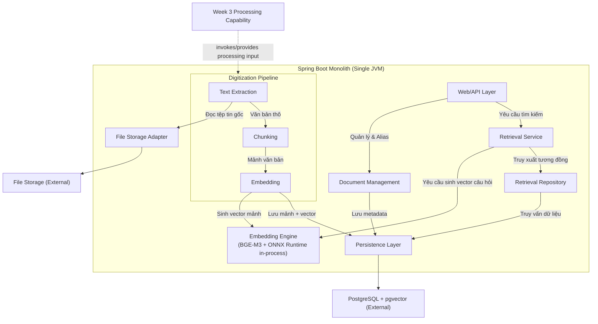

# TÀI LIỆU THIẾT KẾ KIẾN TRÚC (ADD)
**Tuần 4: Số hóa & Tra cứu Tri thức Cơ bản (Basic RAG - Retrieval Layer)**

---

## 1. Kiểm soát Tài liệu

### 1.1. Thông tin Tài liệu
| Thuộc tính | Giá trị |
| :--- | :--- |
| **Tiêu đề Tài liệu** | Tài liệu Thiết kế Kiến trúc - Tuần 4 (ADD-004) |
| **Dự án** | Nền tảng lưu trữ tri thức doanh nghiệp VCC (VCC-EAP) |
| **Phiên bản** | 1.1 |
| **Trạng thái** | Hoàn thiện |
| **Tác giả** | Senior Software Architect / Solution Architect |
| **Ngày phát hành** | 2026-08-13 |
| **Khung tham chiếu** | IEEE Std 42010-2011; C4 Model biểu diễn góc nhìn kiến trúc; Architecture Decision Records (ADRs) ghi nhận quyết định kiến trúc. |

### 1.2. Lịch sử Thay đổi
| Phiên bản | Ngày | Tác giả | Mô tả Thay đổi |
| :--- | :--- | :--- | :--- |
| 1.0 | 2026-08-07 | Senior Software Architect | Phiên bản đầu tiên. |
| 1.1 | 2026-08-13 | Senior Software Architect | Chuẩn hóa theo PRD v1.2: chuyển đổi phương pháp phân mảnh từ Phân mảnh Ngữ nghĩa sang Phân mảnh theo Đoạn văn (Paragraph Chunking), loại bỏ Matryoshka 768 chiều cho ranh giới câu, và tích hợp bộ lọc ngưỡng tương đồng tối thiểu. |

---

## 2. Giới thiệu

### 2.1. Mục đích
Tài liệu này đặc tả thiết kế kiến trúc cho phân hệ **Số hóa & Tra cứu Tri thức Cơ bản (Basic RAG - Retrieval Layer)** thuộc hệ thống VCC-EAP. Tài liệu định nghĩa cách thức tổ chức các thành phần logic, ranh giới dữ liệu và bảo mật phòng ban, cùng cơ chế tích hợp mô hình nhúng cục bộ BGE-M3 phục vụ cho quá trình lập Detailed Design.

### 2.2. Phạm vi Kiến trúc
* **Kiến trúc Số hóa**: Trích xuất văn bản thô, phân mảnh văn bản theo đoạn văn (Paragraph Chunking), sinh vector nhúng cho từng mảnh văn bản và lưu trữ các mảnh văn bản kèm vector.
* **Kiến trúc Tra cứu (Retrieval Layer)**: Tiếp nhận câu hỏi ngôn ngữ tự nhiên, sinh vector câu hỏi, thực hiện tìm kiếm tương đồng vector và trả về kết quả.
* **Kiến trúc Phân quyền**: Thực thi Department Isolation, Alias-based Sharing, BOARD Isolation và Soft Delete trực tiếp tại ranh giới cơ sở dữ liệu.

### 2.3. Ngoài phạm vi (Out of Scope)
* **LLM Generation / RAG Chatbot**: Hệ thống không tự sinh câu trả lời bằng LLM hoặc tóm tắt tài liệu.
* **Tìm kiếm nâng cao**: Không hỗ trợ xếp hạng lại (Re-ranking), không tích hợp tìm kiếm lai (Hybrid Search) kết hợp Full-text Search.
* **OCR**: Không hỗ trợ nhận dạng ký tự từ ảnh quét.
* **Cơ sở hạ tầng Tuần 3**: Tải tệp lên hệ thống, quản lý tệp vật lý, lập lịch tác vụ nền, hàng đợi xử lý bền vững (durable task queue), tiến trình quét tệp (scanner) và cơ chế tự phục hồi tác vụ khi server khởi động lại (`PROCESSING -> READY`) đều nằm ngoài phạm vi tài liệu này.

### 2.4. Sự phụ thuộc vào Kiến trúc Tuần 3 (Dependencies)
Tuần 4 kế thừa và phát triển dựa trên năng lực xử lý tài liệu bất đồng bộ đã được thiết lập từ Tuần 3.

Sơ đồ phân định ranh giới kiến trúc giữa Tuần 3 và Tuần 4:

```text
                    WEEK 3 (Upload & Async Infrastructure)
┌─────────────────────────────────────────────────────────────────────────┐
│ Upload HTTP -> Store Original File -> Set READY -> Scanner Thread       │
│                                                          │              │
│ (Quản lý hàng đợi tác vụ & Phục hồi khi server crash)    │              │
└──────────────────────────────────────────────────────────┼──────────────┘
                                                           │
                                                           │ Processing Capability
                                                           ▼
                    WEEK 4 (Digitization & Retrieval - This Document)
┌─────────────────────────────────────────────────────────────────────────┐
│ [Document Selected in PROCESSING State]                                 │
│        ↓                                                                │
│ Text Extraction -> Paragraph Chunking -> Embeddings -> Persist          │
│                                                                  │      │
│ [State -> COMPLETED / FAILED]                                    │      │
│                                                                  ▼      │
│ User Query -> Query Embedding -> Auth-aware DB Retrieval -> Top-3       │
└─────────────────────────────────────────────────────────────────────────┘
```

---

## 3. Các Bên liên quan & Mối quan tâm

* **Nhân viên Nghiệp vụ (Employee)**: Quan tâm đến chất lượng kết quả tìm kiếm (đoạn văn bản chứa thông tin cần tìm xuất hiện trong Top-3 kết quả trả về) và tốc độ phản hồi của tính năng tìm kiếm ngữ nghĩa.
* **Ban Giám đốc (BOARD User)**: Yêu cầu tính cô lập bảo mật tuyệt đối của tài liệu BOARD, đảm bảo không bị rò rỉ hoặc chia sẻ trái phép thông qua liên kết Alias.
* **Quản trị viên (SYSTEM_ADMIN)**: Có quyền quản trị cấu hình hệ thống nhưng bị chặn hoàn toàn quyền tìm kiếm ngữ nghĩa hoặc đọc nội dung các mảnh văn bản nghiệp vụ.
* **Đội ngũ Phát triển (Developers)**: Cần tài liệu đặc tả rõ ranh giới các thành phần logic, các bất biến kiến trúc (architectural invariants) để hiện thực hóa trong Detailed Design.
* **Đội ngũ Vận hành & Bảo mật (Ops & Security)**: Yêu cầu kiến trúc đơn giản tối đa (Spring Boot Monolith, PostgreSQL, không sử dụng hàng đợi ngoài hay vector database ngoài) và ngăn chặn việc tải dữ liệu chưa phân quyền lên bộ nhớ JVM.

---

## 4. Mục tiêu & Ràng buộc Kiến trúc

### 4.1. Mục tiêu Chất lượng (SLA)
1. **Độ trễ Tìm kiếm Ngữ nghĩa (Retrieval Latency)**:
   * Đây là mục tiêu hiệu năng cần được xác thực qua thực nghiệm (benchmark-validated performance targets under a defined environment and workload), không phải là cam kết kiến trúc tuyệt đối.
   * Thời gian phản hồi cuối-đến-cuối (end-to-end) cho một yêu cầu tìm kiếm ngữ nghĩa hướng tới chỉ số **p95 < 500ms** dưới khối lượng tải tiêu chuẩn.
   * Phạm vi đo lường: Gửi câu hỏi -> Nhúng câu hỏi (Query Embedding) -> Lọc phân quyền tại Database -> Ánh xạ kết quả -> Trả về HTTP response.
2. **Thời gian Số hóa Tài liệu (Digitization Latency)**:
   * Đây là mục tiêu hiệu năng cần được xác thực qua thực nghiệm trong môi trường định trước.
   * Thời gian xử lý số hóa nền đối với tài liệu văn bản thô (text-native) dài 10 trang hướng tới hoàn thành **dưới 10 giây**.
   * Phạm vi đo lường: Từ thời điểm tác vụ số hóa nhận tài liệu ở trạng thái `PROCESSING` cho đến khi toàn bộ tiến trình số hóa hoàn tất và trạng thái tài liệu chuyển sang `COMPLETED`.
3. **Chất lượng Tìm kiếm (Retrieval Quality)**:
   * Tỷ lệ đoạn văn bản chứa thông tin cần tìm xuất hiện trong tối đa Top-3 kết quả trả về (**Hit Rate @ Top-3**) đạt tối thiểu **90%** trên bộ dữ liệu kiểm thử Ground Truth gồm 50 câu hỏi nghiệp vụ đã chuẩn hóa (initial acceptance / benchmark dataset).
   * *Định nghĩa*: Hit Rate @ Top-3 chỉ đo lường việc liệu có ít nhất một mảnh văn bản liên quan xuất hiện trong Top-3 kết quả trả về của tầng Retrieval hay không; chỉ số này không đo lường độ chính xác của câu trả lời do LLM sinh ra.

### 4.2. Ràng buộc Kiến trúc
1. **Spring Boot Monolith duy nhất**: Chạy trên một tiến trình JVM độc lập. Không sử dụng kiến trúc microservices.
2. **Định dạng Vector 1024 chiều**: Cấu hình cột vector trong cơ sở dữ liệu bắt buộc là `vector(1024)`.
3. **Lọc phân quyền tại ranh giới Cơ sở dữ liệu (Database-level Authorization Filtering)**: Cấm cơ chế truy xuất vector không ràng buộc rồi thực hiện lọc phân quyền trên bộ nhớ JVM. Việc lọc quyền bắt buộc phải được dịch thành các điều kiện (predicates) trong câu lệnh SQL để PostgreSQL lọc trực tiếp tại tầng lưu trữ.
4. **Hạ tầng tối giản**: Không sử dụng vector database độc lập ngoài PostgreSQL (pgvector). Không sử dụng Kafka, RabbitMQ hoặc Redis.
5. **In-process Inference**: Mô hình nhúng BGE-M3 chạy trực tiếp bên trong JVM process thông qua thư viện ONNX Runtime.

---

## 5. Kiến trúc Hệ thống (Mô hình C4)

### 5.1. C1 — System Context (Bối cảnh Hệ thống)
Sơ đồ C1 mô tả tương tác cấp hệ thống của các tác nhân với VCC-EAP:

```mermaid
graph TD
    Employee["Nhân viên Nghiệp vụ<br>(HR, Finance, R&D)"]
    BoardUser["Thành viên Ban Giám đốc<br>(BOARD)"]
    SysAdmin["Quản trị viên<br>(SYSTEM_ADMIN)"]
    
    SystemEAP["Hệ thống VCC-EAP<br>(Spring Boot Monolith)"]
    
    Employee -->|Tìm kiếm ngữ nghĩa, chia sẻ Alias| SystemEAP
    BoardUser -->|Tìm kiếm tài liệu mật BOARD| SystemEAP
    SysAdmin -->|Quản trị kỹ thuật & Cấu hình<br>(Không được xem/tìm nội dung)| SystemEAP
    
    style SystemEAP fill:#1F4E79,stroke:#1A365D,stroke-width:2px,color:#FFFFFF
    style Employee fill:#D84315,stroke:#BF360C,stroke-width:2px,color:#FFFFFF
    style BoardUser fill:#C62828,stroke:#B71C1C,stroke-width:2px,color:#FFFFFF
    style SysAdmin fill:#37474F,stroke:#263238,stroke-width:2px,color:#FFFFFF
```

### 5.2. C2 — Container (Kiến trúc Container)
Sơ đồ C2 mô tả ranh giới triển khai vật lý của hệ thống:

```mermaid
graph TB
    subgraph ClientLayer ["Tầng Giao diện"]
        WebApp["Ứng dụng Web (React)"]
    end

    subgraph AppLayer ["Tầng Ứng dụng"]
        SpringBootApp["Spring Boot Monolith<br>(JVM Process - ONNX Runtime in-process)"]
    end

    subgraph StorageLayer ["Tầng Lưu trữ"]
        FileStorage["File Storage<br>(Lưu tệp tin gốc)"]
        PostgresDB["PostgreSQL + pgvector<br>(Lưu metadata, chunks và vector embeddings)"]
    end

    WebApp -->|HTTP REST API Requests| SpringBootApp
    SpringBootApp -->|File I/O| FileStorage
    SpringBootApp -->|JDBC/SQL - vector(1024)| PostgresDB

    style WebApp fill:#E6F2FF,stroke:#0066CC,stroke-width:2px,color:#000000
    style SpringBootApp fill:#E2F0D9,stroke:#385723,stroke-width:2px,color:#000000
    style FileStorage fill:#FFF2CC,stroke:#D6B656,stroke-width:2px,color:#000000
    style PostgresDB fill:#FFF2CC,stroke:#D6B656,stroke-width:2px,color:#000000
```

### 5.3. C3 — Component (Kiến trúc Thành phần)
Sơ đồ C3 phân rã cấu trúc logic bên trong Spring Boot Monolith:




---

## 6. Kiến trúc Số hóa Tài liệu & Vòng đời

Quy trình số hóa tài liệu diễn ra hoàn toàn sau khi tài liệu đã được chuyển sang trạng thái `PROCESSING` bởi tiến trình quét nền của Tuần 3.

### 6.1. Quy trình Xử lý Số hóa & Cơ chế Retry/Skip Chunk
Tiến trình số hóa thực hiện phân mảnh tài liệu và sinh vector cho từng chunk độc lập. Để đảm bảo tính bền vững của đường ống xử lý, lỗi phát sinh tại một chunk riêng lẻ sẽ được xử lý cô lập theo quy tắc sau:

```text
               [Bắt đầu số hóa mảnh (Chunk Ingestion)]
                                │
                                ▼
                       [Sinh Vector Nhúng]
                                │
                                ├── Thành công ──► [Lưu mảnh + Vector vào DB] ──► [Xử lý mảnh tiếp theo]
                                │
                                └── Thất bại (Lỗi phát sinh)
                                        │
                                        ▼
                               [Thử lại (Retry)] ◄─── Hoạt động tối đa 3 lần
                                        │
                         ┌──────────────┴──────────────┐
                         ▼ (Vẫn lỗi sau 3 lần)         ▼ (Thử lại thành công)
                  [BỎ QUA (SKIP)]             [Lưu mảnh + Vector vào DB]
                         │                             │
                         └──────────────┬──────────────┘
                                        ▼
                           [Xử lý mảnh tiếp theo]
```

* **Quy tắc cô lập lỗi (Isolated Chunk Failure)**: Thất bại của một mảnh văn bản riêng lẻ (sau tối đa 3 lần retry sinh vector hoặc lưu trữ) **không được phép** dừng hoặc hủy bỏ toàn bộ đường ống số hóa tài liệu. Các mảnh lỗi sẽ bị bỏ qua (skipped), ghi nhận thông tin cảnh báo/lỗi phục vụ giám sát (observability), và đường ống vẫn tiếp tục xử lý các mảnh văn bản kế tiếp của tài liệu.
* **Cập nhật trạng thái tài liệu**: Sau khi toàn bộ các mảnh văn bản của tài liệu đã được xử lý (bao gồm các mảnh thành công và các mảnh bị bỏ qua do cạn kiệt số lần retry), tài liệu sẽ được chuyển sang trạng thái `COMPLETED`. 
* **Trạng thái tài liệu lỗi**: Tài liệu chỉ chuyển sang trạng thái `FAILED` khi gặp lỗi hệ thống nghiêm trọng làm sập toàn bộ luồng số hóa (ví dụ: mất kết nối cơ sở dữ liệu, lỗi trích xuất văn bản thô trên toàn bộ tệp, v.v.). Hệ thống không tạo thêm các trạng thái vòng đời trung gian khác (như `COMPLETED_WITH_WARNINGS`) để giữ kiến trúc tối giản.

### 6.2. Vòng đời Tài liệu & Sự sẵn sàng Tra cứu
Kiến trúc quy định rõ trạng thái tài liệu quyết định tính sẵn sàng tham gia tra cứu ngữ nghĩa:
* **READY** (Tuần 3 sở hữu): Tài liệu mới tải lên, chưa được số hóa. **Chặn hoàn toàn** khỏi truy vấn tra cứu.
* **PROCESSING** (Tuần 3 sở hữu): Tài liệu đang trong quá trình số hóa. **Chặn hoàn toàn** khỏi truy vấn tra cứu nhằm ngăn chặn việc rò rỉ dữ liệu bán phần (partial chunk leaks) khi tiến trình đang diễn ra.
* **FAILED**: Luồng số hóa tài liệu gặp lỗi hệ thống. **Chặn hoàn toàn** khỏi truy vấn tra cứu.
* **COMPLETED**: Số hóa hoàn tất. Các mảnh văn bản thuộc tài liệu `COMPLETED` có vector nhúng hợp lệ sẽ được phép tham gia tra cứu.
* **Soft Deleted**: Tài liệu đã bị đánh dấu xóa logic. **Chặn hoàn toàn** khỏi truy vấn tra cứu.

* **Bất biến về truy xuất mảnh bị skip**: Các mảnh văn bản bị bỏ qua trong quá trình số hóa do lỗi (`skipped chunks`) sẽ không có vector nhúng tương ứng trong cơ sở dữ liệu, và mặc nhiên không được phép tham gia vào bất kỳ truy vấn tìm kiếm ngữ nghĩa nào.

---

## 7. Kiến trúc Sinh Vector Nhúng (Embedding Engine)

* **In-process Inference**: Sinh vector nhúng cục bộ thông qua ONNX Runtime tích hợp trong tiến trình JVM của Spring Boot Monolith với mô hình BGE-M3. Không sử dụng dịch vụ nhúng ngoài nhằm đảm bảo an toàn thông tin và giảm độ trễ mạng.
* **Số chiều biểu diễn**: Cột lưu trữ vector bắt buộc là 1024 chiều.
* **Tính đồng nhất của Không gian Vector (Vector Space Invariant)**:
  $$\vec{v}_{\text{query}} \in \mathbb{R}^{1024} \quad \text{và} \quad \vec{v}_{\text{chunk}} \in \mathbb{R}^{1024}$$
  Quá trình sinh vector nhúng cho mảnh văn bản khi số hóa (Ingestion-time) và cho câu hỏi của người dùng khi truy vấn (Query-time) bắt buộc phải sử dụng chung một phiên bản mô hình nhúng BGE-M3 và chung một không gian vector. Nếu phiên bản mô hình nhúng thay đổi, toàn bộ các vector nhúng hiện tại trong cơ sở dữ liệu phải được tạo lại từ đầu (re-indexed/re-generated).
* **Khả năng truy vết phiên bản mô hình (Model Version Traceability)**: Phiên bản mô hình nhúng hiện tại được cấu hình tập trung ở cấp độ ứng dụng (`application.yml`). Để tiết kiệm dung lượng lưu trữ, hệ thống không lưu tên và phiên bản mô hình cho từng dòng vector trong cơ sở dữ liệu. Tất cả các vector trong `tbl_chunks` mặc nhiên được coi là thuộc về phiên bản mô hình đang hoạt động; khi thay đổi mô hình, bắt buộc phải chạy tiến trình re-index toàn bộ dữ liệu.
* **Quản lý luồng và kiểm soát tài nguyên (Thread Pooling & Resource Management)**: Tiến trình sinh vector nhúng chạy in-process chia sẻ tài nguyên CPU và RAM của JVM với các luồng Web API xử lý yêu cầu HTTP. Nhằm đảm bảo tính sẵn sàng của hệ thống và tránh làm treo/nghẽn luồng xử lý Web API chính (Tomcat threads), hệ thống đặc tả cấu hình phân bổ tài nguyên và quản lý luồng như sau:
  * **Cấu hình ONNX Runtime Session (`SessionOptions`)**:
    * `intra_op_num_threads`: Giới hạn luồng tính toán song song các toán tử (như nhân ma trận) bên trong 1 phiên chạy mô hình. Cấu hình này được giới hạn tối đa bằng **1/2 số nhân CPU vật lý** của máy chủ (ví dụ: tối đa 4 luồng trên máy chủ 8 nhân).
    * `inter_op_num_threads`: Thiết lập cố định bằng `1` do các mảnh văn bản được nhúng tuần tự trong mỗi tác vụ, tránh phát sinh overhead quản lý luồng không cần thiết.
    * Đảm bảo ONNX Runtime Session được khởi tạo và quản lý dưới dạng **Singleton Bean** trong Spring Context để tái sử dụng luồng, tránh tạo nhiều session gây bùng nổ số lượng luồng ngoài kiểm soát.
  * **Cấu hình Spring TaskExecutor cho tác vụ số hóa nền (`asyncDigitizationExecutor`)**:
    * Sử dụng một `ThreadPoolTaskExecutor` riêng biệt được cấu hình giới hạn kích thước (Bounded Queue Thread Pool) với các tham số mặc định: `corePoolSize = 1`, `maxPoolSize = 2`, `queueCapacity = 1000`. Việc sử dụng Bounded Queue giúp ngăn ngừa nguy cơ OOM do tích lũy quá nhiều tác vụ chờ xử lý trong bộ nhớ JVM Heap.
    * Đặt độ ưu tiên của các luồng xử lý số hóa nền ở mức thấp nhất (`Thread.MIN_PRIORITY = 1`). Điều này buộc Hệ điều hành (OS Scheduler) ưu tiên thời gian xử lý CPU cho các luồng HTTP của Tomcat phục vụ tra cứu thời gian thực (SLA p95 < 500ms) trước khi phân bổ cho tác vụ xử lý nền.
* **Đánh giá Bộ nhớ ONNX Runtime**: Bộ nhớ sử dụng bởi mô hình nhúng và ONNX Runtime phải được đánh giá tổng thể ở cấp độ tiến trình hệ điều hành (Process level), bao gồm cả vùng nhớ Heap JVM (JVM Heap) và các vùng nhớ ngoài Heap (native/off-heap memory) được cấp phát bởi ONNX Runtime.

---

## 8. Kiến trúc Tìm kiếm Vector & So khớp

Quy trình tìm kiếm tương đồng ngữ nghĩa:

```text
[Câu hỏi ngôn ngữ tự nhiên]
             │
             ▼
[Embedding Engine (BGE-M3)] ───► Sinh vector truy vấn 1024 chiều
             │
             ▼
[Lọc phân quyền tại ranh giới DB] ───► Thực thi đồng thời:
             │                         - Độ tương đồng Cosine
             │                         - Cô lập phòng ban (Department Isolation)
             │                         - Liên kết chia sẻ Alias (Alias Sharing)
             │                         - Cô lập BOARD (BOARD Isolation)
             │                         - Trạng thái tài liệu là COMPLETED
             │                         - Loại trừ tài liệu bị Soft Delete
             │                         - Bộ lọc ngưỡng tương đồng tối thiểu
             ▼
  [Authorized Candidates]
             │
             ▼
         [Ranking] ───► Sắp xếp theo độ tương đồng giảm dần
             │
             ▼
     [Tối đa Top-3 Chunks] ───► Trả về tối đa 3 kết quả phù hợp nhất kèm trích dẫn
```

* **Phép đo Tương đồng (Similarity Metric)**: Sử dụng độ tương đồng Cosine (Cosine Similarity) để so khớp vector câu hỏi và vector mảnh văn bản:
  $$\text{Cosine Similarity} = \frac{\vec{u} \cdot \vec{v}}{\|\vec{u}\| \|\vec{v}\|}$$
* **HNSW (Hierarchical Navigable Small World)**: Sử dụng chỉ mục HNSW trên cột vector của PostgreSQL (`pgvector`) để tối ưu hiệu năng tìm kiếm láng giềng gần đúng (Approximate Nearest-Neighbor - ANN). Mối quan hệ thực tế giữa việc chọn ứng viên ANN và các điều kiện lọc phân quyền (authorization predicates) phải được đánh giá thông qua đo đạc benchmark thực tế và phân tích kế hoạch thực thi truy vấn (query-plan analysis).
* **Bộ lọc ngưỡng tương đồng tối thiểu (Similarity Threshold)**: Hệ thống áp dụng một bộ lọc theo ngưỡng điểm tương đồng tối thiểu. Ngưỡng này là một tham số cấu hình động của hệ thống (ví dụ mặc định là 0.60). Bất kỳ kết quả nào có điểm tương đồng nhỏ hơn ngưỡng cấu hình hiện tại sẽ bị hệ thống loại bỏ khỏi danh sách kết quả trả về. Trường hợp sau khi lọc không có đoạn văn bản nào đạt ngưỡng tương đồng hoặc không có tài liệu hợp lệ, hệ thống trả về kết quả trống và hiển thị thông báo thân thiện cho người dùng: *"Không tìm thấy thông tin phù hợp trong kho tài liệu của phòng ban bạn."*
* **Yêu cầu kết quả (Top-3)**: Cơ sở dữ liệu bắt buộc phải trả về tối đa Top-3 mảnh văn bản có thứ hạng cao nhất và người dùng thực sự có quyền truy cập, sau khi tất cả các mệnh đề lọc phân quyền, lọc ngưỡng tương đồng và lọc trạng thái tài liệu đã được thực thi đồng thời bên trong câu truy vấn cơ sở dữ liệu.
* **Tối ưu hóa chỉ mục (Iterative Index Scan)**: Kỹ thuật quét chỉ mục lặp (Iterative Index Scan) là phương án tối ưu hóa hiệu năng được cân nhắc để giải quyết trường hợp PostgreSQL chuyển sang quét tuần tự (sequential scan) khi kết hợp các bộ lọc phân quyền phức tạp. Việc áp dụng và hiệu chỉnh kỹ thuật này phải được chứng minh hiệu quả qua benchmark thực tế, không phải là một bất biến kiến trúc bắt buộc.

---

## 9. Kiến trúc Phân quyền & Bảo mật

Phân quyền truy cập tài liệu ngữ nghĩa được thực thi triệt để tại **ranh giới Cơ sở dữ liệu (Database-level Authorization Filtering)**.

### 9.1. Quy chế thực thi phân quyền
Chính sách bảo mật (phòng ban, Alias, BOARD, Soft Delete) thuộc tầng nghiệp vụ của ứng dụng được Repository chuyển dịch thành các mệnh đề điều kiện (SQL predicates) lồng ghép trực tiếp vào câu lệnh truy vấn tìm kiếm tương đồng vector. Hệ thống cấm việc truy vấn dữ liệu vector không ràng buộc rồi thực hiện lọc kết quả trên JVM. Mọi mảnh văn bản không hợp lệ về mặt quyền truy cập tuyệt đối không được nạp vào bộ nhớ JVM.

### 9.2. Các quy tắc phân quyền cốt lõi
* **Cô lập phòng ban (Department Isolation)**: Người dùng thuộc phòng ban $D_A$ chỉ được phép tìm kiếm và xem các mảnh văn bản thuộc tài liệu do phòng ban $D_A$ sở hữu, hoặc tài liệu của phòng ban khác được chia sẻ hợp lệ cho $D_A$ qua liên kết Alias.
* **Liên kết chia sẻ (Alias Sharing)**:
  * Cho phép chia sẻ tài liệu giữa phòng ban sở hữu sang phòng ban nhận dưới dạng liên kết logic Alias.
  * Quyền truy cập qua Alias chỉ có hiệu lực khi tài liệu gốc tương ứng chưa bị đánh dấu xóa logic (Soft Delete). Khi tài liệu gốc bị xóa logic, các liên kết chia sẻ Alias liên quan cũng lập tức mất hiệu lực.
* **Cô lập tuyệt đối của BOARD (BOARD Isolation)**:
  * Tài liệu thuộc phòng ban BOARD chỉ cho phép người dùng thuộc BOARD truy xuất.
  * Hệ thống cấm tạo liên kết chia sẻ (Alias) đối với tài liệu của BOARD ra các phòng ban bên ngoài, đồng thời BOARD cũng không nhận chia sẻ Alias từ phòng ban khác. Không có bất kỳ cơ chế Alias nào được phép bypass quy tắc cô lập của BOARD.
* **Hạn chế đối với Quản trị viên (SYSTEM_ADMIN)**:
  * Tài khoản `SYSTEM_ADMIN` bị chặn quyền thực hiện tìm kiếm ngữ nghĩa và xem nội dung chi tiết của tất cả các tài liệu/mảnh văn bản trên hệ thống.
  * Ràng buộc này được thực thi tại Web/API Layer đối với mọi đường dẫn truy cập nội dung người dùng (user-facing content-access paths), không chỉ giới hạn ở API tìm kiếm `/search`.
* **Xử lý tài liệu đã xóa (Soft Delete)**:
  * Khi tài liệu bị đánh dấu xóa logic, toàn bộ các mảnh văn bản thuộc tài liệu đó lập tức bị loại trừ khỏi phạm vi tìm kiếm ngữ nghĩa thông qua điều kiện lọc trạng thái tài liệu ở câu lệnh SQL.

---

## 10. Chiến lược Phân mảnh & Tách biệt Lưu trữ

### 10.1. Chiến lược Phân mảnh (Document Chunking)
Hệ thống sử dụng giải pháp **Phân mảnh theo Đoạn văn (Paragraph Chunking)**.
* **Nguyên lý hoạt động**:
  * **Phân tách tự nhiên**: Tách văn bản thô dựa trên các ký tự ngắt đoạn tự nhiên (mặc định là dấu xuống dòng kép `\n\n`).
  * **Giới hạn kích thước tối đa (Max Tokens)**: Mỗi mảnh được giới hạn kích thước tối đa là $T_{\max}$ tokens (cấu hình động, mặc định là 1000 tokens). Nếu một đoạn văn tự nhiên $\le T_{\max}$ tokens, nó được lưu thành 1 chunk duy nhất.
  * **Cắt cứng tại ranh giới câu (Hard Split)**: Nếu đoạn văn tự nhiên dài vượt quá $T_{\max}$ tokens, thực hiện cắt đoạn văn tại ranh giới câu gần nhất (dựa trên dấu câu `.`, `?`, `!`) để tạo thành các chunk nhỏ hơn nằm trong giới hạn. Không sử dụng tính toán vector tương đồng giữa các câu và không áp dụng cơ chế overlap (gối đầu) giữa các chunk.
  * **Tránh phân mảnh vụn (Min Chunk Size constraint)**: Khi cắt cứng, nếu phần dư còn lại sau khi cắt có kích thước nhỏ hơn giới hạn tối thiểu $T_{\min}$ tokens (cấu hình động, mặc định là 100 tokens), hệ thống sẽ gộp phần dư này vào chunk liền trước (chấp nhận kích thước chunk liền trước vượt quá $T_{\max}$ một chút nhưng không vượt quá giới hạn tràn tối đa $T_{\text{overflow\_max}}$ cấu hình, ví dụ mặc định là 1100 tokens) hoặc phân bổ lại điểm cắt tại các ranh giới câu gần đó sao cho độ dài các chunk được phân chia tương đối cân bằng.
  * **Tính lũy đẳng (Idempotency)**: Đảm bảo quy trình số hóa và lưu trữ chunk là idempotent. Khi số hóa lại hoặc tiếp tục tiến trình bị gián đoạn, các chunk mới phải ghi đè hoặc cập nhật chính xác lên các chunk cũ đã có của tài liệu đó để tránh trùng lặp dữ liệu.
  * **Tham số cấu hình động**: Các tham số phân mảnh (giới hạn tối đa, giới hạn tối thiểu, ký tự phân tách đoạn) được thiết kế dưới dạng cấu hình hệ thống để có thể tinh chỉnh linh hoạt tại runtime mà không cần khởi động lại ứng dụng.
* *Ranh giới Thiết kế*: Thiết kế kiến trúc chỉ định nghĩa nguyên lý toán học và ranh giới hoạt động của thuật toán. Việc hiện thực hóa cấu trúc lớp, các cơ chế đếm token và mã nguồn Java cụ thể được mô tả chi tiết tại tài liệu Thiết kế Chi tiết (DDD).

### 10.2. Tách biệt Hạ tầng Lưu trữ (Storage Separation)
* **Kho Lưu trữ Tệp tin (File Storage)**: Lưu trữ vật lý các tệp tài liệu gốc nguyên bản (PDF, Word, Excel). Các thuộc tính như cấu trúc thư mục, thuật toán đặt tên tệp, ghi tệp nguyên tử nằm ngoài phạm vi tài liệu này.
* **Cơ sở dữ liệu Quan hệ (PostgreSQL + pgvector)**: Lưu trữ metadata tài liệu, cấu hình Alias, nội dung văn bản của từng mảnh (chunks) và vector nhúng 1024 chiều tương ứng.

---

## 11. Các Bất biến Kiến trúc (Architectural Invariants)

Hệ thống bắt buộc phải duy trì và tuân thủ các bất biến kiến trúc sau đây tại mọi thời điểm:

1. **Trạng thái sẵn sàng tra cứu**: Chỉ các mảnh văn bản thuộc tài liệu có trạng thái `COMPLETED` mới được tham gia vào quá trình tìm kiếm tương đồng vector.
2. **Không lọc quyền trên JVM (No JVM Post-filtering)**: Các mảnh văn bản không hợp lệ về quyền truy cập tuyệt đối không được nạp vào bộ nhớ JVM từ cơ sở dữ liệu để thực hiện lọc quyền bằng mã ứng dụng.
3. **Lọc quyền tại DB (Database-level Filtering)**: Bộ lọc cô lập phòng ban (Department Isolation) bắt buộc phải được thực thi trực tiếp trong câu lệnh truy vấn tìm kiếm tương đồng vector ở tầng lưu trữ.
4. **Hiệu lực của Alias phụ thuộc tài liệu gốc**: Quyền truy cập thông qua Alias lập tức mất hiệu lực khi tài liệu gốc bị đánh dấu xóa logic (Soft Delete).
5. **Tính cô lập của BOARD**: Sự cô lập tài liệu của BOARD là tuyệt đối và không thể bị bypass bởi bất kỳ cơ chế chia sẻ Alias nào.
6. **Giới hạn quyền của SYSTEM_ADMIN**: Tài khoản `SYSTEM_ADMIN` bị từ chối truy cập nội dung tài liệu và mảnh văn bản trên mọi giao diện và đường dẫn API của ứng dụng.
7. **Đồng nhất Không gian Vector**: Quy trình nhúng khi số hóa (Ingestion-time) và nhúng khi truy vấn (Query-time) bắt buộc sử dụng chung một phiên bản mô hình nhúng BGE-M3 và cùng không gian vector 1024 chiều.
8. **Khả năng truy vết mô hình**: Phiên bản mô hình nhúng được quản lý tập trung ở cấu hình hệ thống (application.yml). Toàn bộ vector trong cơ sở dữ liệu mặc nhiên thuộc về không gian vector của phiên bản mô hình này; khi thay đổi mô hình, hệ thống bắt buộc phải thực hiện re-index toàn bộ để đảm bảo đồng nhất không gian vector.
9. **Giới hạn tài nguyên số hóa nền và quản lý luồng (Resource Bounding & Thread Management)**: Các tác vụ số hóa nền bắt buộc phải được giới hạn tài nguyên tính toán để không chiếm quyền xử lý hoặc gây nghẽn luồng truy xuất thời gian thực của người dùng. Cụ thể: áp dụng cơ chế xử lý cuốn chiếu (Incremental Chunk Processing), Batch Inference tối đa 128 chunks mỗi đợt, giới hạn số luồng tính toán song song CPU của ONNX Runtime session tối đa bằng 1/2 số nhân CPU thực tế (`intra_op_num_threads`), cố định `inter_op_num_threads = 1`, chạy tác vụ nền trên Thread Pool riêng biệt (`corePoolSize = 1`, `maxPoolSize = 2`, Bounded Queue capacity = 1000) và hạ độ ưu tiên luồng xuống mức thấp nhất (`Thread.MIN_PRIORITY = 1`) để ưu tiên hiệu năng xử lý REST API.
10. **Không định nghĩa lại hạ tầng Tuần 3**: Kiến trúc Tuần 4 không thiết kế lại hoặc sao chép cơ sở hạ tầng upload tệp, scanner quét tệp, hàng đợi tác vụ và cơ chế tự phục hồi tác vụ sau crash của Tuần 3.
11. **Lỗi Chunk độc lập (Isolated Chunk Failure)**: Sự thất bại của một mảnh văn bản riêng lẻ sau khi cạn kiệt 3 lần retry bắt buộc không được làm dừng hay hủy bỏ toàn bộ đường ống số hóa tài liệu. Mảnh lỗi sẽ bị skip, ghi nhận thông tin và đường ống tiếp tục xử lý mảnh kế tiếp. Mảnh bị skip không có vector nhúng và không tham gia tra cứu.

---

## 12. Hồ sơ Quyết định Kiến trúc (ADR)

### 12.1. ADR-004-1: Chiến lược Phân mảnh Tài liệu
* **Trạng thái**: Đã phê duyệt.
* **Bối cảnh**: Văn bản trích xuất từ tài liệu gốc cần được chia tách thành các mảnh nhỏ để phù hợp với giới hạn ngữ cảnh đầu vào (context window) của mô hình BGE-M3, tối ưu hóa mật độ thông tin ngữ nghĩa và tránh tạo ra các mảnh quá vụn.
* **Quyết định**: Sử dụng giải pháp **Phân mảnh theo Đoạn văn kết hợp xử lý tránh phân mảnh vụn (Paragraph Chunking with Min Chunk Size constraint)**:
  * **Phân mảnh theo đoạn văn**: Chia nhỏ văn bản gốc thành các phân đoạn (chunk) dựa trên dấu ngắt đoạn tự nhiên (xuống dòng kép `\n\n`).
  * **Cắt cứng tại câu (Hard Split)**: Nếu đoạn văn dài vượt quá giới hạn tối đa (1000 tokens), hệ thống thực hiện cắt cứng tại ranh giới câu mà không cần tính toán tương đồng ngữ nghĩa hay cơ chế overlap (gối đầu).
  * **Tránh phân mảnh vụn**: Nếu phần dư sau khi cắt có kích thước nhỏ hơn giới hạn tối thiểu (100 tokens), hệ thống gộp phần dư này vào chunk liền trước (chấp nhận kích thước chunk liền trước vượt quá giới hạn tối đa một chút nhưng không vượt quá giới hạn tràn tối đa cấu hình, ví dụ mặc định là 1100 tokens) hoặc phân bổ lại điểm cắt tại các ranh giới câu gần đó.
  * **Tính lũy đẳng**: Đảm bảo quy trình số hóa và lưu trữ chunk ghi đè hoặc cập nhật chính xác lên các chunk cũ đã có của tài liệu đó khi số hóa lại.
* **Các phương án thay thế**:
   * *Phân mảnh Ngữ nghĩa Cửa sổ trượt cải tiến*: Gom nhóm các câu dựa trên tính liên mạch ý nghĩa sử dụng tương đồng cosine cửa sổ trượt. Phương án này tuy tối ưu về mặt lý thuyết nhưng quá phức tạp, tiêu tốn nhiều tài nguyên CPU/RAM để tính toán khoảng cách vector câu in-memory, dễ gây lỗi tràn bộ nhớ khi chạy in-process và tạo ra các phân đoạn quá nhỏ (phân mảnh vụn) nếu cấu trúc văn bản rời rạc.
   * *Fixed-size Chunking (Phân mảnh kích thước cố định)*: Cắt chuỗi theo số ký tự cố định. Đơn giản nhưng dễ cắt đôi câu ở ranh giới mảnh, làm mất ý nghĩa ngữ cảnh tiếng Việt.
* **Hệ quả**:
   * Đơn giản hóa quy trình số hóa, loại bỏ hoàn toàn việc tính toán tương đồng ngữ cảnh giữa các câu riêng lẻ in-memory, từ đó loại bỏ nguy cơ quá tải CPU/RAM cho JVM.
   * Tránh hiện tượng phân mảnh vụn thông qua cơ chế ràng buộc kích thước tối thiểu.
   * Đảm bảo tính lũy đẳng (idempotency) của dữ liệu lưu trữ khi số hóa lại.
   * Tăng khả năng cấu hình linh hoạt của hệ thống tại runtime.

### 12.2. ADR-004-2: Bộ máy Lưu trữ Vector & Phép đo tương đồng
* **Trạng thái**: Đã phê duyệt.
* **Bối cảnh**: Hệ thống cần thực hiện tìm kiếm tương đồng vector trên hàng chục nghìn mảnh văn bản đồng thời thực thi các điều kiện phân quyền phức tạp chéo phòng ban.
* **Quyết định**: Sử dụng `PostgreSQL + pgvector` (kiểu cột `vector(1024)`), sử dụng phép đo độ tương đồng Cosine và thiết lập chỉ mục `HNSW` trên cột chứa vector nhúng.
* **Các phương án thay thế**:
   * *Cơ sở dữ liệu Vector chuyên dụng (Milvus, Qdrant, Pinecone)*: Tối ưu cho quy mô vector cực lớn nhưng làm phức tạp hóa kiến trúc hạ tầng do phát sinh thêm node dịch vụ, và khó khăn trong việc đồng bộ trạng thái phân quyền phòng ban/Alias thời gian thực.
   * *Khoảng cách Euclidean (L2 Distance)*: Đo khoảng cách hình học tuyệt đối. Không phù hợp với bài toán so khớp văn bản vì khoảng cách bị ảnh hưởng mạnh bởi độ dài câu/mảnh văn bản.
* **Hệ quả**: Tận dụng tính nhất quán ACID của PostgreSQL, đơn giản hóa hạ tầng Monolith. Việc so khớp vector kết hợp lọc phân quyền được thực thi đồng thời trong một câu lệnh SQL duy nhất. Chỉ mục HNSW cung cấp tìm kiếm lân cận gần đúng (ANN) và hiệu quả của nó với các mệnh đề lọc phân quyền phức tạp cần được benchmark trước khi đưa vào vận hành.

### 12.3. ADR-004-3: Bộ máy Sinh Vector Nhúng Cục bộ
* **Trạng thái**: Đã phê duyệt.
* **Bối cảnh**: Hệ thống yêu cầu bảo mật thông tin nội bộ nghiêm ngặt, không được gửi dữ liệu văn bản ra API bên ngoài mạng và cần giảm thiểu chi phí tích hợp.
* **Quyết định**: Sử dụng mô hình nhúng cục bộ **BGE-M3** chạy in-process trực tiếp trong JVM thông qua thư viện ONNX Runtime. ONNX Runtime thực hiện sinh vector nhúng trực tiếp cho các chunk thành phẩm theo số chiều cấu hình của mô hình nhúng cục bộ (mặc định 1024 chiều đối với BGE-M3). Hệ thống áp dụng kiểm tra tính hợp lệ của vector nhúng được tạo ra (như số chiều vector tương thích với cấu hình).
* **Các phương án thay thế**:
   * *Sử dụng API nhúng thương mại bên ngoài (OpenAI, Cohere)*: Vật lý bảo mật (gửi thông tin nhạy cảm của doanh nghiệp ra ngoài) và phụ thuộc mạng ngoài làm tăng độ trễ phản hồi.
   * *Mô hình nhúng cỡ nhỏ chạy cục bộ (all-MiniLM-L6-v2)*: Kích thước mô hình nhẹ, nhưng khả năng hiểu ngữ nghĩa tiếng Việt kém, ảnh hưởng trực tiếp đến chất lượng tìm kiếm.
* **Hệ quả**: Đảm bảo an toàn thông tin vì không truyền văn bản ra ngoài doanh nghiệp. Mô hình nhúng BGE-M3 chạy in-process đáp ứng đầy đủ yêu cầu về bảo mật dữ liệu doanh nghiệp và độ chính xác ngữ nghĩa. Cần cấu hình JVM Heap thích hợp (-Xmx4g cho RAM 8GB) để chạy ổn định.

### 12.4. ADR-004-4: Lọc Phân quyền tại Tầng Repository
* **Trạng thái**: Đã phê duyệt.
* **Bối cảnh**: VCC-EAP yêu cầu kiểm soát quyền truy cập tài liệu nghiêm ngặt chéo phòng ban. Cần quyết định vị trí thực thi chính sách phân quyền này trong quy trình tìm kiếm tương đồng vector để đảm bảo an toàn thông tin tối đa mà không ảnh hưởng tới độ chính xác của kết quả.
* **Quyết định**: Ủy quyền truy xuất bắt buộc phải được thực thi trực tiếp tại ranh giới cơ sở dữ liệu (`Database-level Authorization Filtering`). Các điều kiện lọc bảo mật được đưa trực tiếp vào điều kiện lọc của câu lệnh SQL thực hiện tìm kiếm vector.
* **Các phương án thay thế**:
   * *Lọc phân quyền ở tầng ứng dụng (Application-side Filtering / Post-filtering)*: Thực hiện tìm kiếm tương đồng vector trên toàn bộ cơ sở dữ liệu để lấy ra Top-K kết quả gần nhất, sau đó dùng mã nguồn Java để duyệt qua danh sách và lọc bỏ các bản ghi người dùng không có quyền truy cập để chọn ra Top-3. Phương án này chứa đựng rủi ro bảo mật lớn (dữ liệu trái phép bị nạp lên bộ nhớ ứng dụng). Hơn nữa, nó gây suy giảm nghiêm trọng chất lượng tìm kiếm: nếu toàn bộ Top-K kết quả đầu tiên đều thuộc phòng ban khác và bị lọc bỏ, người dùng sẽ không nhận được kết quả nào mặc dù trong phòng ban của họ có tồn tại tài liệu liên quan.
* **Hệ quả**: Bảo vệ an toàn thông tin, ngăn chặn dữ liệu không được phép truy cập nạp lên bộ nhớ JVM. Đảm bảo trả về tối đa Top-3 kết quả hợp lệ mà người dùng thực sự có quyền xem. Câu lệnh SQL ở tầng Repository sẽ phức tạp hơn và cần được tối ưu hiệu năng cẩn thận.

---

## 13. Rủi ro & Giả định Kiến trúc

1. **Tranh chấp Tài nguyên CPU (CPU Contention)**:
   * *Mô tả*: Việc chạy mô hình nhúng BGE-M3 in-process bằng ONNX Runtime trực tiếp trên CPU của máy chủ ứng dụng có thể gây nghẽn và tranh chấp tài nguyên với các luồng Web API chính xử lý yêu cầu HTTP đồng thời khi hệ thống chịu tải cao.
   * *Giảm thiểu*: Thiết lập giới hạn luồng tính toán song song của ONNX Runtime và kiểm soát số lượng tác vụ xử lý số hóa bất đồng bộ nền ở mức ưu tiên thấp (resource-bounding).
2. **Hiệu năng của HNSW khi tích hợp Bộ lọc Phân quyền phức tạp**:
   * *Mô tả*: Việc lồng ghép nhiều điều kiện lọc phân quyền (phòng ban, Alias, BOARD, Soft Delete) có thể làm giảm hiệu năng của chỉ mục đồ thị HNSW trong pgvector, dẫn đến việc PostgreSQL chuyển sang quét tuần tự (sequential scan) làm độ trễ tìm kiếm vượt quá SLA 500ms.
   * *Giảm thiểu*: Thiết lập chỉ mục phù hợp trên các cột metadata phân quyền, thực hiện tối ưu hóa cấu trúc cơ sở dữ liệu và kiểm thử tải với dữ liệu giả lập quy mô lớn (>10.000 chunks).
3. **Mức độ chiếm dụng bộ nhớ của mô hình nhúng (Model Memory Footprint)**:
   * *Mô tả*: Việc tải mô hình BGE-M3 và ONNX Runtime vào RAM của JVM làm tăng dung lượng chiếm dụng bộ nhớ của tiến trình Java, có khả năng dẫn tới lỗi tràn bộ nhớ (OutOfMemoryError) hoặc kích hoạt Garbage Collection tần suất cao làm treo ứng dụng.
   * *Giảm thiểu*: Đo lường thực tế mức chiếm dụng bộ nhớ ở cấp độ tiến trình (Process level) bao gồm JVM heap và native/off-heap memory và cấu hình tài nguyên hệ thống phù hợp.
4. **Nhất quán về phiên bản mô hình nhúng (Embedding Model Consistency)**:
   * *Mô tả*: Việc vô tình cập nhật hoặc thay đổi mô hình nhúng ở các phiên bản sau mà không thực hiện số hóa lại (re-index) dữ liệu vector cũ sẽ phá vỡ tính đồng nhất của không gian vector ngữ nghĩa, làm mất đi hoàn toàn độ chính xác của tính năng tìm kiếm.
   * *Giảm thiểu*: Sử dụng cơ chế kiểm tra phiên bản mô hình thông qua thông tin lưu trữ traceability và thiết lập quy trình re-index tự động khi thay đổi phiên bản mô hình.
5. **Chất lượng tìm kiếm phụ thuộc vào chiến lược phân mảnh**:
   * *Mô tả*: Nếu chiến lược phân mảnh ngữ nghĩa hoạt động kém hiệu quả, các mảnh văn bản được cắt ra có thể bị rời rạc hoặc chứa quá nhiều thông tin nhiễu, làm giảm độ chính xác của tìm kiếm tương đồng vector.
   * *Giảm thiểu*: Thực hiện đánh giá chất lượng liên tục bằng tập Ground Truth câu hỏi mẫu và tinh chỉnh tham số cấu hình phân mảnh tại runtime.

---

## 14. Kế hoạch Xác thực Kiến trúc

### 14.1. Xác thực Hiệu năng & SLA (Performance Verification)
* **Phương pháp**: Sử dụng công cụ kiểm thử tải (như JMeter hoặc k6) giả lập yêu cầu truy vấn đồng thời từ người dùng.
* **Môi trường & Dữ liệu**:
  * Giả lập tải đồng thời từ **50 đến 100 người dùng truy vấn**.
  * Cơ sở dữ liệu chứa tối thiểu **10.000 mảnh văn bản đã được số hóa** phân bố ở các phòng ban khác nhau.
  * Sử dụng tài liệu văn bản thô dài **10 trang** để đo lường độ trễ số hóa bất đồng bộ.
* **Chỉ số kiểm chứng**:
  * SLA Tìm kiếm ngữ nghĩa: Đạt mức **p95 < 500ms** cho toàn bộ luồng xử lý end-to-end (bao gồm sinh vector truy vấn, lọc bảo mật tại database, và ánh xạ kết quả). Tỷ lệ lỗi (Error Rate) phải bằng 0%.
  * SLA Số hóa tài liệu: Thời gian xử lý bất đồng bộ (từ lúc bắt đầu xử lý ở trạng thái `PROCESSING` đến khi hoàn thành lưu trữ vector ở trạng thái `COMPLETED`) đạt **< 10 giây** cho tài liệu 10 trang mẫu trên môi trường thử nghiệm xác định.

### 14.2. Xác thực Bảo mật & Cách ly (Security Verification)
* **Phương pháp**: Thiết lập các kịch bản kiểm thử tích hợp tự động (Integration Tests) kiểm chứng ma trận phân quyền truy xuất dữ liệu ngữ nghĩa.
* **Ma trận kiểm thử tích hợp**:

| Vai trò người dùng | Phòng ban sở hữu tài liệu | Trạng thái tài liệu | Kết quả mong muốn (Tìm kiếm ngữ nghĩa) |
| :--- | :--- | :--- | :--- |
| Employee ($D_A$) | $D_A$ | COMPLETED | **ALLOW**: Tìm thấy mảnh văn bản tương đồng. |
| Employee ($D_A$) | $D_B$ (chưa có Alias) | COMPLETED | **DENY**: Không tìm thấy mảnh văn bản của $D_B$. |
| Employee ($D_A$) | $D_B$ (đã có Alias) | COMPLETED | **ALLOW**: Tìm thấy mảnh văn bản tương đồng qua Alias. |
| Employee ($D_A$) | BOARD | COMPLETED | **DENY**: Không tìm thấy tài liệu BOARD. |
| Employee ($D_A$) | BOARD (cố tạo Alias) | COMPLETED | **DENY / ERROR**: Hệ thống ngăn chặn tạo Alias cho tài liệu BOARD. |
| BOARD User | BOARD | COMPLETED | **ALLOW**: Tìm thấy mảnh văn bản tài liệu BOARD. |
| SYSTEM_ADMIN | Bất kỳ phòng ban nào | COMPLETED | **DENY**: Trả về 403 Forbidden trên mọi kênh truy cập. |
| Employee ($D_A$) | $D_A$ | Soft Deleted | **DENY**: Loại trừ hoàn toàn khỏi kết quả tìm kiếm (kéo theo Alias bị ẩn). |
| Employee ($D_A$) | $D_A$ | PROCESSING / FAILED | **DENY**: Không tham gia truy xuất ngữ nghĩa. |

### 14.3. Xác thực Chất lượng Tìm kiếm (Retrieval Quality Verification)
* **Phương pháp**: Đo lường độ chính xác dựa trên tập câu hỏi kiểm nghiệm mẫu (Ground Truth).
* **Kịch bản**: 
  * Chuẩn bị một tập Ground Truth gồm **50 câu hỏi nghiệp vụ thực tế** khác nhau, mỗi câu hỏi được định sẵn một hoặc nhiều đoạn văn bản liên quan hợp lệ nằm trong tập tài liệu đã được số hóa.
  * Thực hiện kiểm thử và đo lường độ chính xác với việc áp dụng các cấu hình ngưỡng tương đồng tối thiểu khác nhau (mặc định 0.60).
* **Chỉ số kiểm chứng**: 
  * Thực hiện truy vấn 50 câu hỏi và tính toán chỉ số **Hit Rate @ Top-3** (tỷ lệ câu hỏi mà kết quả trả về Top-3 của hệ thống chứa ít nhất một đoạn văn bản liên quan hợp lệ). Mục tiêu nghiệm thu đạt **Hit Rate @ Top-3 >= 90%** trên tập dữ liệu ban đầu này.
  * Đảm bảo các kết quả có điểm tương đồng dưới 0.60 bị loại bỏ, và nếu không tìm thấy gì, trả về thông báo thân thiện quy định trong PRD.
