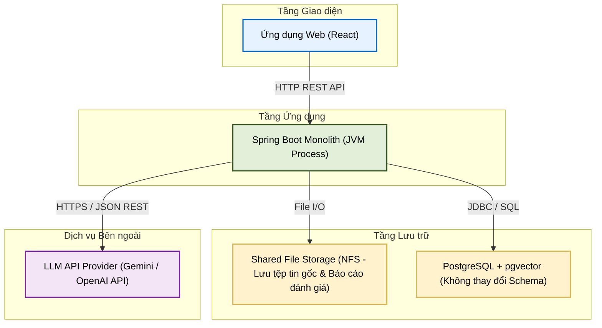
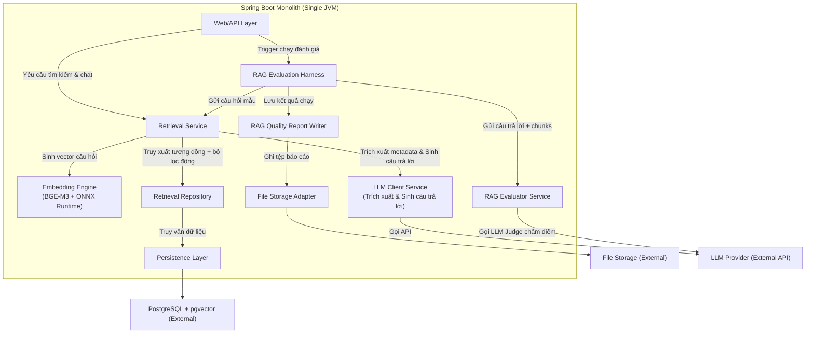

# TÀI LIỆU THIẾT KẾ KIẾN TRÚC (ADD)
**Tuần 5: Bảo mật Tìm kiếm & Đánh giá Tự động (Security & RAG Evaluation)**

---

## 1. Kiểm soát Tài liệu

### 1.1. Thông tin Tài liệu
| Thuộc tính | Giá trị |
| :--- | :--- |
| **Tiêu đề Tài liệu** | Tài liệu Thiết kế Kiến trúc - Tuần 5 (ADD-005) |
| **Dự án** | Nền tảng lưu trữ tri thức doanh nghiệp VCC (VCC-EAP) |
| **Phiên bản** | 1.0 |
| **Trạng thái** | Hoàn thiện |
| **Tác giả** | Senior Software Architect / Solution Architect |
| **Ngày phát hành** | 2026-08-27 |
| **Khung tham chiếu** | IEEE Std 42010-2011; C4 Model biểu diễn góc nhìn kiến trúc; Architecture Decision Records (ADRs) ghi nhận quyết định kiến trúc. |

### 1.2. Lịch sử Thay đổi
| Phiên bản | Ngày | Tác giả | Mô tả Thay đổi |
| :--- | :--- | :--- | :--- |
| 1.0 | 2026-08-27 | Senior Software Architect | Phiên bản đầu tiên của ADD dành riêng cho Tuần 5. |

---

## 2. Giới thiệu

### 2.1. Mục đích
Tài liệu này đặc tả thiết kế kiến trúc (ADD) cho các tính năng **Bảo mật Tìm kiếm & Đánh giá Tự động** của phân hệ RAG thuộc hệ thống VCC-EAP. Tài liệu định nghĩa cách thức tích hợp vai trò người dùng (RBAC) và phòng ban vào truy vấn pgvector để thực thi mức DB, luồng sinh câu trả lời kèm trích dẫn, và hạ tầng tự động hóa đánh giá chất lượng (Evaluation Harness) phục vụ cho quá trình lập Detailed Design.

### 2.2. Phạm vi Kiến trúc
* **Kiến trúc Bảo mật Kép**: Thực thi Department Isolation, Role-based Access Control (RBAC), Alias-based Sharing, BOARD Isolation và Soft Delete trực tiếp tại ranh giới cơ sở dữ liệu sử dụng cấu trúc JSONB hiện có.
* **Kiến trúc Đánh giá Tự động (Evaluation Harness)**: Định kỳ tự động chạy thử nghiệm 20 câu hỏi mẫu Ground Truth, gọi LLM-as-a-judge chấm điểm chất lượng (Faithfulness, Relevance), đo đạc các chỉ số Hit Rate, Citation Accuracy và kết xuất báo cáo tĩnh.

---

## 3. Các Bên liên quan & Mối quan tâm
* **Bộ phận An toàn Thông tin (Security & Ops)**: Yêu cầu tỷ lệ rò rỉ dữ liệu vector giữa các phòng ban hoặc vai trò khác nhau = 0%. Ràng buộc bảo mật phải được thực thi triệt để tại tầng lưu trữ cơ sở dữ liệu.
* **Đội ngũ Vận hành & Phát triển (DevOps & Developers)**: Yêu cầu giám sát chất lượng RAG hàng ngày để nắm bắt xu hướng chất lượng, đồng thời yêu cầu giữ nguyên cấu trúc cơ sở dữ liệu (không thay đổi schema) để tránh ảnh hưởng đến các thành phần khác.

---

## 4. Mục tiêu & Ràng buộc Kiến trúc

### 4.1. Mục tiêu Chất lượng (SLA)
1. **Độ trễ sinh câu trả lời (RAG Latency)**: Tổng thời gian cho luồng sinh câu trả lời tự nhiên của trợ lý AI hướng tới chỉ số **p95 < 3.0s** (không bao gồm độ trễ đường truyền mạng ngoài).
2. **Rò rỉ dữ liệu chéo (Data Leakage)**: Tỷ lệ tìm chéo hoặc truy xuất dữ liệu vector của phòng ban khác hoặc vai trò không hợp lệ = **0%**.
3. **Tính xác thực trích dẫn (Citation Accuracy)**: **100%** câu trả lời của trợ lý AI có nguồn trích dẫn đúng trang tài liệu PDF gốc và đúng tên file.
4. **Hiệu năng Đánh giá (Evaluation Performance)**: Thời gian chạy tự động đánh giá chất lượng RAG trên bộ 20 câu hỏi Ground Truth hoàn thành **dưới 120 giây** (2 phút).

### 4.2. Ràng buộc Kiến trúc
1. **Cơ sở dữ liệu tĩnh (Static DB Schema constraint)**: Không thay đổi cấu trúc bảng, không thêm bảng mới hay cột mới cho các tính năng của Tuần 5.
   * Lọc vai trò phải tận dụng trường `metadata` JSONB hiện có của bảng `tbl_chunks`.
   * Báo cáo đánh giá và lịch sử chạy phải được lưu dưới dạng file tĩnh trên Shared Storage hoặc đĩa hệ thống, không lưu vào PostgreSQL.
2. **Lọc phân quyền kép tại ranh giới Cơ sở dữ liệu (Database-level Auth Filtering)**: Cấm lọc quyền trên bộ nhớ JVM. Việc lọc quyền phòng ban và vai trò phải được dịch thành các điều kiện (predicates) trong câu lệnh SQL để PostgreSQL lọc trực tiếp tại tầng lưu trữ.
3. **Spring Boot Monolith duy nhất**: Chạy trên một tiến trình JVM độc lập.

---

## 5. Kiến trúc Hệ thống (Mô hình C4)

### 5.1. C2 — Container (Kiến trúc Container)
Sơ đồ C2 mô tả ranh giới triển khai vật lý của hệ thống:



### 5.2. C3 — Component (Kiến trúc Thành phần)
Sơ đồ C3 phân rã cấu trúc logic bên trong Spring Boot Monolith, biểu diễn các thành phần mới của Tuần 5:



---

## 6. Kiến trúc Phân quyền & Bảo mật Kép (Phòng ban + Vai trò)

Quy trình áp dụng chính sách bảo mật kép (Department Isolation + RBAC) được thực thi triệt để tại **ranh giới Cơ sở dữ liệu (Database-level Authorization Filtering)**.

### 6.1. Quy chế thực thi phân quyền kép
*   Mọi câu lệnh SQL truy vấn tìm kiếm vector bắt buộc phải chứa các mệnh đề lọc (predicates) cho cả phòng ban và vai trò của người dùng. Cấm lọc quyền trên bộ nhớ JVM.
*   **Cách ly vai trò (Role-based Access Control - RBAC)**:
    *   Mỗi chunk văn bản khi số hóa sẽ được cấu hình một mảng vai trò cho phép (`roles`) lưu trữ trực tiếp trong trường `metadata` JSONB của bảng `tbl_chunks` (ví dụ: `{"roles": ["staff", "manager"]}`).
    *   Tại thời điểm truy vấn, hệ thống lấy vai trò của người dùng hiện tại và đính kèm điều kiện lọc:
        ```sql
        AND (c.metadata @> CAST(:roleFilter AS jsonb))
        ```
        Trong đó `:roleFilter` được truyền dưới dạng `{"roles": ["staff"]}`. Toán tử `@>` kết hợp chỉ mục GIN hiện có sẽ lọc cực nhanh các chunks trước khi tính toán khoảng cách vector.

### 6.2. Cô lập tuyệt đối của BOARD
*   Tài liệu thuộc phòng ban BOARD chỉ dành riêng cho người dùng BOARD và không thể chia sẻ Alias ra ngoài dưới bất kỳ hình thức nào. Ràng buộc này được chốt chặn cứng trong câu lệnh SQL.

---

## 7. Kiến trúc Đánh giá Chất lượng RAG (RAG Evaluation Architecture)

Hệ thống đánh giá được thiết kế để tự động hóa việc đo lường chất lượng của RAG hàng ngày mà không làm thay đổi cấu trúc cơ sở dữ liệu.

*   **RAG Evaluation Harness**:
    *   Tự động chạy định kỳ (qua Cron) hoặc kích hoạt thủ công.
    *   Nạp bộ dữ liệu Ground Truth gồm **20 câu hỏi mẫu** từ file cấu hình.
    *   Với mỗi câu hỏi: gọi luồng Retrieval + sinh câu trả lời, đo đạc Retrieval Hit Rate và Citation Accuracy bằng code. Gọi `RAGEvaluatorService` để chấm điểm Faithfulness và Answer Relevance qua LLM.
    *   Tổng hợp kết quả và gọi `RAGReportWriter` để kết xuất tệp tin báo cáo.
*   **Lưu trữ báo cáo dạng File**: Để tuân thủ ràng buộc **Cơ sở dữ liệu tĩnh (Static DB Schema)**, kết quả đánh giá không lưu vào database mà kết xuất thành các file tĩnh Markdown (`rag_evaluation_report.md`) và JSON lưu trực tiếp trên Shared File Storage. Báo cáo hỗ trợ so sánh hiệu quả chất lượng giữa các cấu hình phân mảnh khác nhau.

---

## 8. Các Bất biến Kiến trúc (Architectural Invariants)

Hệ thống bắt buộc phải duy trì và tuân thủ các bất biến kiến trúc sau đây tại mọi thời điểm:
1.  **Cách ly quyền kép ở mức DB**: Quyền truy xuất dựa trên phòng ban và vai trò phải được thực thi trực tiếp tại câu lệnh SQL ở tầng lưu trữ cơ sở dữ liệu. Cấm lọc quyền trên bộ nhớ JVM.
2.  **Cơ sở dữ liệu tĩnh (Static DB)**: Nghiêm cấm tạo mới hoặc sửa đổi các bảng/cột cơ sở dữ liệu cho các tính năng của Tuần 5. Mọi dữ liệu phân quyền vai trò phải được lưu trong cột `metadata` JSONB hiện có. Mọi dữ liệu đánh giá chất lượng phải được lưu dạng file tĩnh.
3.  **Trích dẫn xác thực**: Mọi chunk lưu trữ bắt buộc có siêu dữ liệu `page_number` và `file_reference` hợp lệ trong JSONB.
4.  **Bảo mật tuyệt đối của BOARD**: Tài liệu thuộc phòng ban BOARD chỉ dành riêng cho người dùng BOARD và không thể chia sẻ Alias ra ngoài dưới bất kỳ hình thức nào.
5.  **Chặn quyền SYSTEM_ADMIN**: Tài khoản `SYSTEM_ADMIN` bị chặn hoàn toàn quyền truy cập các API tìm kiếm ngữ nghĩa, sử dụng trợ lý AI và đọc nội dung chi tiết của tài liệu nghiệp vụ.

---

## 9. Hồ sơ Quyết định Kiến trúc (ADR)

### 9.1. ADR-005-1: Chiến lược bảo mật vai trò cấp DB sử dụng Schema hiện có
*   **Quyết định**: Sử dụng trường `metadata` JSONB hiện có của bảng `tbl_chunks` để lưu trữ thông tin các vai trò được phép truy xuất dưới dạng mảng (ví dụ: `{"roles": ["staff", "manager"]}`). Thực hiện truy vấn lọc vai trò bằng toán tử containment `@>` trong SQL:
    ```sql
    AND (c.metadata @> CAST(:roleFilter AS jsonb))
    ```
    Trong đó `:roleFilter` được truyền động dạng `{"roles": ["<vai_tro_nguoi_dung>"]}`.
*   **Hệ quả**: Tận dụng hoàn hảo hạ tầng chỉ mục GIN hiện có, đảm bảo tốc độ lọc cực nhanh mức DB mà không làm thay đổi cấu trúc bảng.

### 9.2. ADR-005-2: Chấm điểm tự động qua LLM-as-a-judge phối hợp kiểm định programmatic
*   **Quyết định**: Phối hợp hai cơ chế để đánh giá chất lượng RAG hàng ngày:
    1.  *Programmatic Rules*: Dùng mã Java để tính toán Retrieval Hit Rate (so khớp ID file và số trang) và Citation Accuracy (so khớp các chú thích nguồn trong câu trả lời với chunks ngữ cảnh thực tế).
    2.  *LLM-as-a-judge*: Sử dụng LLM API với prompt chuyên biệt để đánh giá Faithfulness (kiểm tra hallucination) và Answer Relevance.
*   **Hệ quả**: Đảm bảo đánh giá tự động nhanh chóng (dưới 2 phút cho 20 câu), tin cậy, khách quan và đo lường toàn diện chất lượng RAG.

### 9.3. ADR-005-3: Lưu trữ kết quả đánh giá dạng File tĩnh
*   **Quyết định**: Kết xuất kết quả đánh giá chi tiết và báo cáo tổng hợp dưới dạng file JSON và Markdown trực tiếp lên Shared File Storage (thư mục `/reports/rag_eval/`). 
*   **Hệ quả**: Đảm bảo DB schema tĩnh hoàn toàn. Dễ dàng lưu trữ, sao lưu, và hiển thị báo cáo trực quan dạng Markdown cho quản trị viên.

---

## 10. Kế hoạch Xác thực Kiến trúc

### 10.1. Xác thực Bảo mật & Cách ly Kép
*   **Phương pháp**: Thiết lập các kịch bản kiểm thử tích hợp (Integration Tests) kiểm chứng ma trận phân quyền kép:

| Vai trò & Phòng ban | Phòng ban sở hữu tài liệu | Vai trò yêu cầu của tài liệu | Kết quả mong muốn |
| :--- | :--- | :--- | :--- |
| Staff ($D_A$) | $D_A$ | STAFF, MANAGER, BOARD | **ALLOW**: Tìm thấy mảnh văn bản. |
| Staff ($D_A$) | $D_A$ | MANAGER, BOARD | **DENY**: Chặn không tìm thấy mảnh văn bản (mức DB). |
| Manager ($D_A$) | $D_A$ | MANAGER, BOARD | **ALLOW**: Tìm thấy mảnh văn bản. |
| Staff ($D_A$) | $D_B$ (đã có Alias) | STAFF, MANAGER | **ALLOW**: Tìm thấy mảnh văn bản qua Alias. |
| Staff ($D_A$) | $D_B$ (đã có Alias) | MANAGER | **DENY**: Chặn không tìm thấy mảnh văn bản qua Alias (mức DB). |
| SYSTEM_ADMIN | Bất kỳ phòng ban nào | Bất kỳ vai trò nào | **DENY**: Trả về 403 Forbidden trên mọi kênh truy cập. |
