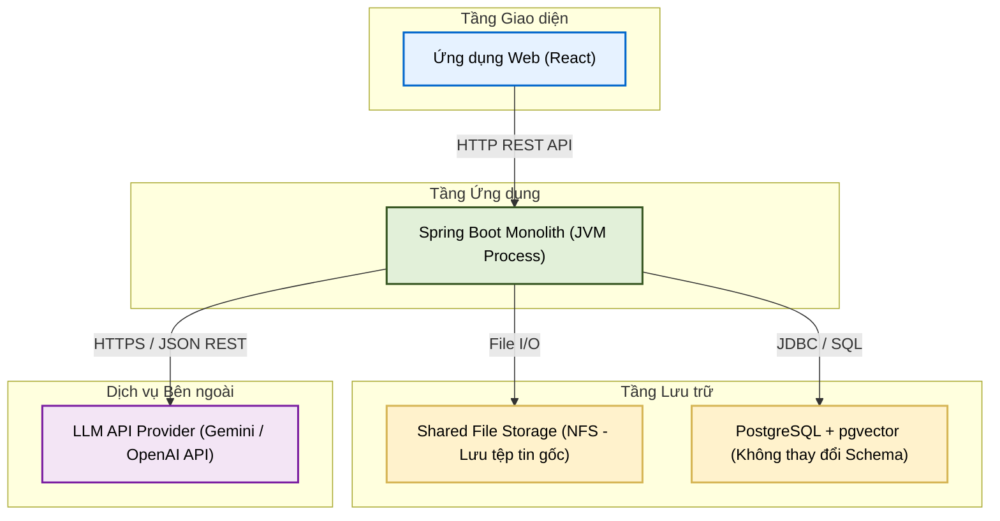
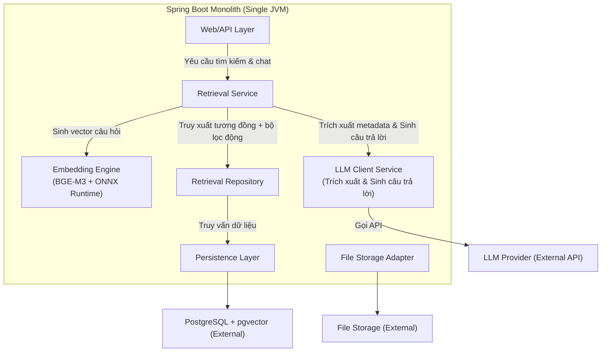

# TÀI LIỆU THIẾT KẾ KIẾN TRÚC (ADD)
**Tuần 5: Bảo mật Tìm kiếm (Security & RAG Search)**

---

## 1. Kiểm soát Tài liệu

### 1.1. Thông tin Tài liệu
| Thuộc tính | Giá trị |
| :--- | :--- |
| **Tiêu đề Tài liệu** | Tài liệu Thiết kế Kiến trúc - Tuần 5 (ADD-005) |
| **Dự án** | Nền tảng lưu trữ tri thức doanh nghiệp VCC (VCC-EAP) |
| **Phiên bản** | 1.0 |
| **Trạng thái** | Hoàn thiện |
| **Tác giả** | Senior Software Architect / Solution Architect |
| **Ngày phát hành** | 2026-08-27 |
| **Khung tham chiếu** | IEEE Std 42010-2011; C4 Model biểu diễn góc nhìn kiến trúc; Architecture Decision Records (ADRs) ghi nhận quyết định kiến trúc. |

### 1.2. Lịch sử Thay đổi
| Phiên bản | Ngày | Tác giả | Mô tả Thay đổi |
| :--- | :--- | :--- | :--- |
| 1.0 | 2026-08-27 | Senior Software Architect | Phiên bản đầu tiên của ADD dành riêng cho Tuần 5. |

---

## 2. Giới thiệu

### 2.1. Mục đích
Tài liệu này đặc tả thiết kế kiến trúc (ADD) cho các tính năng **Bảo mật Tìm kiếm** của phân hệ RAG thuộc hệ thống VCC-EAP. Tài liệu định nghĩa cách thức tích hợp phòng ban vào truy vấn pgvector để thực thi mức DB, luồng sinh câu trả lời kèm trích dẫn, phục vụ cho quá trình lập Detailed Design.

### 2.2. Phạm vi Kiến trúc
*   **Kiến trúc Bảo mật**: Thực thi Department Isolation, BOARD Isolation và Soft Delete trực tiếp tại ranh giới cơ sở dữ liệu sử dụng cấu trúc bảng hiện có.
*   **Chặn quyền SYSTEM_ADMIN**: Thực thi chặn quyền truy cập tìm kiếm ngữ nghĩa của SYSTEM_ADMIN tại tầng Spring Security và Service layer.

---

## 3. Các Bên liên quan & Mối quan tâm
*   **Bộ phận An toàn Thông tin (Security & Ops)**: Yêu cầu tỷ lệ rò rỉ dữ liệu vector giữa các phòng ban = 0%. Ràng buộc bảo mật phải được thực thi triệt để tại tầng lưu trữ cơ sở dữ liệu.
*   **Đội ngũ Vận hành & Phát triển (DevOps & Developers)**: Yêu cầu giữ nguyên cấu trúc cơ sở dữ liệu (không thay đổi schema) để tránh ảnh hưởng đến các thành phần khác.

---

## 4. Mục tiêu & Ràng buộc Kiến trúc

### 4.1. Mục tiêu Chất lượng (SLA)
1. **Độ trễ sinh câu trả lời (RAG Latency)**: Tổng thời gian cho luồng sinh câu trả lời tự nhiên của trợ lý AI hướng tới chỉ số **p95 < 3.0s** (không bao gồm độ trễ đường truyền mạng ngoài).
2. **Rò rỉ dữ liệu chéo (Data Leakage)**: Tỷ lệ tìm chéo hoặc truy xuất dữ liệu vector của phòng ban khác không được phân quyền = **0%**.
3. **Tính xác thực trích dẫn (Citation Accuracy)**: **100%** câu trả lời của trợ lý AI có nguồn trích dẫn đúng trang tài liệu PDF gốc và đúng tên file.

### 4.2. Ràng buộc Kiến trúc
1. **Cơ sở dữ liệu tĩnh (Static DB Schema constraint)**: Không thay đổi cấu trúc bảng, không thêm bảng mới hay cột mới cho các tính năng của Tuần 5.
   * Lọc phòng ban và tiền lọc metadata phải tận dụng cấu trúc cơ sở dữ liệu hiện có.
2. **Lọc phân quyền tại ranh giới Cơ sở dữ liệu (Database-level Auth Filtering)**: Cấm lọc quyền phòng ban trên bộ nhớ JVM. Việc lọc quyền phòng ban và cô lập BOARD phải được dịch thành các điều kiện (predicates) trong câu lệnh SQL để PostgreSQL lọc trực tiếp tại tầng lưu trữ.
3. **Spring Boot Monolith duy nhất**: Chạy trên một tiến trình JVM độc lập.

---

## 5. Kiến trúc Hệ thống (Mô hình C4)

### 5.1. C2 — Container (Kiến trúc Container)
Sơ đồ C2 mô tả ranh giới triển khai vật lý của hệ thống:



### 5.2. C3 — Component (Kiến trúc Thành phần)
Sơ đồ C3 phân rã cấu trúc logic bên trong Spring Boot Monolith:



---

## 6. Kiến trúc Bảo mật Tìm kiếm (Department & BOARD Isolation)

Quy trình áp dụng chính sách bảo mật tìm kiếm được thực thi triệt để tại **ranh giới Cơ sở dữ liệu (Database-level Authorization Filtering)** và **Service Layer**.

### 6.1. Quy chế thực thi bảo mật phòng ban & BOARD
*   Mọi câu lệnh SQL truy vấn tìm kiếm vector bắt buộc phải chứa các mệnh đề lọc (predicates) cho phòng ban của người dùng. Cấm lọc quyền phòng ban trên bộ nhớ JVM.
*   **Cách ly phòng ban (Department Isolation)**:
    *   Người dùng chỉ được tiếp cận tài liệu do phòng ban của mình sở hữu trực tiếp, hoặc tài liệu của phòng ban khác được chia sẻ qua cơ chế Alias.
    *   Tại thời điểm truy vấn, hệ thống lấy phòng ban của người dùng hiện tại từ token JWT và đính kèm điều kiện lọc phòng ban vào SQL query.
*   **Cô lập tuyệt đối của BOARD**:
    *   Tài liệu thuộc phòng ban BOARD chỉ dành riêng cho người dùng BOARD và không thể chia sẻ Alias ra ngoài dưới bất kỳ hình thức nào. Ràng buộc này được chốt chặn cứng trong câu lệnh SQL:
        ```sql
        AND (d.owner_department_id <> :boardDeptId OR :userDeptId = :boardDeptId)
        ```
*   **Chặn quyền SYSTEM_ADMIN**:
    *   Tài khoản `SYSTEM_ADMIN` bị chặn hoàn toàn quyền truy cập các API tìm kiếm ngữ nghĩa và sử dụng trợ lý AI. Ràng buộc này được thực thi tại tầng Spring Security và trong `RetrievalService` để đảm bảo an toàn tuyệt đối.

---

## 7. Các Bất biến Kiến trúc (Architectural Invariants)

Hệ thống bắt buộc phải duy trì và tuân thủ các bất biến kiến trúc sau đây tại mọi thời điểm:
1.  **Cách ly phòng ban ở mức DB**: Quyền truy xuất dựa trên phòng ban (sở hữu hoặc alias) và cô lập BOARD phải được thực thi trực tiếp tại câu lệnh SQL ở tầng lưu trữ cơ sở dữ liệu. Cấm lọc quyền phòng ban trên bộ nhớ JVM.
2.  **Cơ sở dữ liệu tĩnh (Static DB)**: Nghiêm cấm tạo mới hoặc sửa đổi các bảng/cột cơ sở dữ liệu cho các tính năng của Tuần 5.
3.  **Trích dẫn xác thực**: Mọi chunk lưu trữ bắt buộc có siêu dữ liệu `page_number` và `file_reference` hợp lệ trong JSONB.
4.  **Bảo mật tuyệt đối của BOARD**: Tài liệu thuộc phòng ban BOARD chỉ dành riêng cho người dùng BOARD và không thể chia sẻ Alias ra ngoài dưới bất kỳ hình thức nào.
5.  **Chặn quyền SYSTEM_ADMIN**: Tài khoản `SYSTEM_ADMIN` bị chặn hoàn toàn quyền truy cập các API tìm kiếm ngữ nghĩa, sử dụng trợ lý AI và đọc nội dung chi tiết của tài liệu nghiệp vụ.

---

## 8. Hồ sơ Quyết định Kiến trúc (ADR)

### 8.1. ADR-005-1: Chiến lược bảo mật cách ly phòng ban và BOARD cấp DB sử dụng Schema hiện có
*   **Quyết định**: Sử dụng các điều kiện lọc phòng ban trực tiếp trong câu lệnh SQL kết hợp so khớp JOIN bảng tài liệu Alias (`tbl_documents`), và chốt chặn cứng điều kiện phòng ban BOARD:
    ```sql
    AND (d.owner_department_id = :userDeptId OR EXISTS (...))
    AND (d.owner_department_id <> :boardDeptId OR :userDeptId = :boardDeptId)
    ```
*   **Hệ quả**: Đảm bảo an toàn thông tin tuyệt đối mức DB, tránh rò rỉ dữ liệu chéo phòng ban mà không làm thay đổi cấu trúc schema hiện tại.

---

## 9. Kế hoạch Xác thực Kiến trúc

### 9.1. Xác thực Bảo mật & Cách ly Phòng ban
*   **Phương pháp**: Thiết lập các kịch bản kiểm thử tích hợp (Integration Tests) kiểm chứng ma trận phân quyền:

| Phòng ban & Vai trò người dùng | Phòng ban sở hữu tài liệu | Được chia sẻ Alias tới phòng người dùng | Kết quả mong muốn |
| :--- | :--- | :--- | :--- |
| `ROLE_EMPLOYEE` (Phòng A) | Phòng A | - | **ALLOW**: Tìm thấy mảnh văn bản. |
| `ROLE_EMPLOYEE` (Phòng A) | Phòng B | Không | **DENY**: Không tìm thấy mảnh văn bản (mức DB). |
| `ROLE_EMPLOYEE` (Phòng A) | Phòng B | Có | **ALLOW**: Tìm thấy mảnh văn bản qua Alias. |
| `ROLE_BOARD` (Phòng BOARD) | Phòng BOARD | - | **ALLOW**: Tìm thấy mảnh văn bản. |
| `ROLE_EMPLOYEE` (Phòng A) | Phòng BOARD | - | **DENY**: Chặn tuyệt đối (mức DB). |
| `SYSTEM_ADMIN` | Bất kỳ | Bất kỳ | **DENY**: Trả về 403 Forbidden ở tầng API/Service. |
