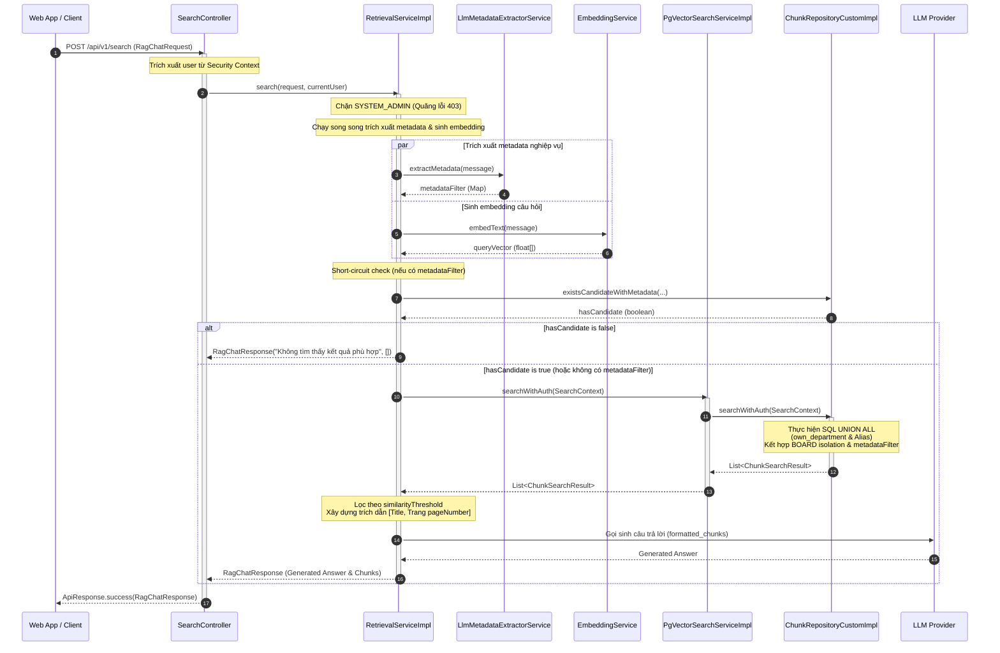

# TÀI LIỆU THIẾT KẾ CHI TIẾT (DETAILED DESIGN DOCUMENT - DDD)
**Tuần 5: Bảo mật Tìm kiếm (Security & RAG Search)**

---

## MỤC LỤC (TABLE OF CONTENTS)
1. [Introduction (Giới thiệu)](#1-introduction-giới-thiệu)
2. [Logical Component & Class Design (Thiết kế Lớp và Thành phần Logic)](#2-logical-component--class-design-thiết-kế-lớp-và-thành-phần-logic)
3. [Data & Database Design (Thiết kế Dữ liệu & Cơ sở dữ liệu)](#3-data-database-design-thiết-kế-dữ-liệu-cơ-sở-dữ-liệu)
4. [Detailed Module & Process Design (Thiết kế Quy trình Chi tiết)](#4-detailed-module--process-design-thiết-kế-quy-trình-chi-tiết)
5. [API & SQL Interface Design (Thiết kế API & Truy vấn SQL)](#5-api-sql-interface-design-thiết-kế-api-truy-vấn-sql)
6. [Testing Design (Thiết kế Kiểm thử)](#6-testing-design-thiết-kế-kiểm-thử)

---

## 1. INTRODUCTION (GIỚI THIỆU)

| Thuộc tính | Chi tiết tài liệu |
| :--- | :--- |
| **Mã tài liệu (Document ID)** | DD-EAP-W5-001 |
| **Phiên bản (Version)** | 1.0 |
| **Trạng thái (Status)** | Hoàn thành |
| **Ngày phát hành (Date)** | 2026-08-27 |
| **Tác giả (Author)** | Nhóm Phát triển Backend (Senior Software Engineer) |
| **Tài liệu Kiến trúc liên quan** | [ADD-005](./ArchitectureDesign.md) |
| **Mục đích & Phạm vi (Purpose & Scope)** | Tài liệu đặc tả thiết kế chi tiết cấp thấp phục vụ lập trình cho các tính năng **Bảo mật Tìm kiếm** của dự án VCC-EAP. Thiết kế tuân thủ các quyết định tại tài liệu kiến trúc ADD-005, tập trung vào cấu trúc lớp, sơ đồ tuần tự thực thi và thiết kế kiểm thử. |

---

## 2. LOGICAL COMPONENT & CLASS DESIGN (THIẾT KẾ LỚP VÀ THÀNH PHẦN LOGIC)

### 2.1. Class Responsibilities (Trách nhiệm của các Lớp)
*   **`SearchContext`**: Record DTO chứa thông tin ngữ cảnh phục vụ tìm kiếm ngữ nghĩa:
    *   `message`: Nội dung câu hỏi gốc của người dùng.
    *   `queryVector`: Mảng vector embedding của câu hỏi (float[]).
    *   `metadataFilter`: Map chứa các cặp key-value bộ lọc siêu dữ liệu do LLM trích xuất.
    *   `userDeptId`: UUID phòng ban của người dùng hiện tại (lấy từ JWT).
    *   `boardDeptId`: UUID đại diện cho phòng ban BOARD của Ban Giám đốc.
*   **`SearchController`**:
    *   Trách nhiệm: REST Endpoint `/api/v1/search` nhận yêu cầu tìm kiếm (`RagChatRequest`). Sử dụng annotation `@AuthenticationPrincipal` để lấy thông tin người dùng đang đăng nhập và truyền dữ liệu cho `RetrievalService`.
*   **`RetrievalServiceImpl`**:
    *   Trách nhiệm: Điều phối luồng xử lý RAG. Chạy song song tác vụ trích xuất metadata nghiệp vụ (bằng LLM) và sinh embedding cho câu hỏi. Thực thi kiểm tra ngắt sớm (Short-circuit). Gọi `VectorSearchService` tìm kiếm dữ liệu, lọc kết quả theo điểm tương đồng và gọi `RagAnswerGeneratorService` để sinh câu trả lời tổng hợp. Chặn quyền tìm kiếm của vai trò `SYSTEM_ADMIN`.
*   **`PgVectorSearchServiceImpl`**:
    *   Trách nhiệm: Triển khai giao diện `VectorSearchService`, làm cầu nối chuyển tiếp ngữ cảnh tìm kiếm tới `ChunkRepository` để truy vấn cơ sở dữ liệu.
*   **`ChunkRepositoryCustomImpl`**:
    *   Trách nhiệm: Thực hiện truy vấn SQL tương đồng vector (Cosine similarity) kết hợp lọc phân quyền phòng ban, BOARD Isolation và tiền lọc metadata JSONB bằng toán tử `@>`.

---

## 3. DATA & DATABASE DESIGN (THIẾT KẾ DỮ LIỆU & CƠ SỞ DỮ LIỆU)

### 3.1. Ràng buộc Cơ sở dữ liệu Tĩnh & Schema JSONB
*   Hệ thống không viết thêm bất kỳ file migration DDL Flyway nào cho Tuần 5.
*   **Tiền lọc Metadata**: Các bộ lọc động do LLM trích xuất từ câu hỏi được so khớp trực tiếp với trường `metadata` JSONB của bảng `tbl_chunks` thông qua toán tử containment `@>` trong PostgreSQL.
    *   *Ví dụ cấu trúc JSONB của Chunk*:
        ```json
        {
          "doc_type": "guide",
          "topics": ["hr_policy"],
          "page_number": 3
        }
        ```

---

## 4. DETAILED MODULE & PROCESS DESIGN (THIẾT KẾ QUY TRÌNH CHI TIẾT)

### 4.1. Sơ đồ tuần tự (Sequence Diagram) - Quy trình Tìm kiếm RAG
Luồng xử lý từ khi client gửi câu hỏi đến khi nhận được câu trả lời tổng hợp có bảo mật và trích dẫn:



---

## 5. API & SQL INTERFACE DESIGN (THIẾT KẾ API & TRUY VẤN SQL)

### 5.1. SQL Tìm kiếm Vector & Phân quyền Phòng ban
Repository thực thi tìm kiếm tương đồng vector Cosine kết hợp tiền lọc siêu dữ liệu, cô lập phòng ban (sở hữu hoặc alias), BOARD isolation, loại bỏ Soft Delete bằng toán tử containment `@>` trên PostgreSQL:

```sql
SELECT * FROM (
  -- Nhánh 1: Tài liệu do phòng ban người dùng sở hữu trực tiếp
  SELECT c.id AS chunk_id, c.content AS chunk_content, c.metadata AS chunk_metadata, 
         d.id AS document_id, d.title AS display_title, d.business_code AS document_business_code, 
         1.0 - (c.embedding <=> CAST(:queryVector AS vector)) AS similarity_score 
  FROM tbl_chunks c 
  JOIN tbl_documents d ON c.document_id = d.id 
  WHERE d.parent_id IS NULL 
    AND d.status = 'COMPLETED' 
    AND d.deleted_at IS NULL 
    AND d.owner_department_id = :userDeptId 
    AND (d.owner_department_id <> :boardDeptId OR :userDeptId = :boardDeptId) 
    AND (CAST(:metadataFilter AS jsonb) IS NULL OR c.metadata @> CAST(:metadataFilter AS jsonb)) 
  ORDER BY c.embedding <=> CAST(:queryVector AS vector) ASC 
  LIMIT :limit 
) AS own_docs 
UNION ALL 
(
  -- Nhánh 2: Tài liệu được chia sẻ hợp lệ qua Alias tới phòng ban của người dùng
  SELECT c.id AS chunk_id, c.content AS chunk_content, c.metadata AS chunk_metadata, 
         d.id AS document_id, d.title AS display_title, d.business_code AS document_business_code, 
         1.0 - (c.embedding <=> CAST(:queryVector AS vector)) AS similarity_score 
  FROM tbl_chunks c 
  JOIN tbl_documents d ON c.document_id = d.id 
  JOIN tbl_documents a ON a.parent_id = d.id AND a.owner_department_id = :userDeptId AND a.deleted_at IS NULL 
  WHERE d.parent_id IS NULL 
    AND d.status = 'COMPLETED' 
    AND d.deleted_at IS NULL 
    AND (d.owner_department_id <> :boardDeptId OR :userDeptId = :boardDeptId) 
    AND (CAST(:metadataFilter AS jsonb) IS NULL OR c.metadata @> CAST(:metadataFilter AS jsonb)) 
  ORDER BY c.embedding <=> CAST(:queryVector AS vector) ASC 
  LIMIT :limit 
) 
ORDER BY similarity_score DESC 
LIMIT :limit;
```

---

## 6. TESTING DESIGN (THIẾT KẾ KIỂM THỬ)

### 6.1. Integration Tests cho Bảo mật Tìm kiếm
Các kịch bản kiểm thử tích hợp (Integration Tests) chạy trên môi trường Spring Boot:

*   **`RagSearchDemoIntegrationTest`**:
    *   `testRagIngestionAndSimilaritySearch`:
        *   *Mục đích*: Kiểm thử luồng RAG cơ bản từ lúc ghi dữ liệu giả lập cho đến lúc tìm kiếm tương đồng.
        *   *Quy trình*: Tạo và lưu một tài liệu gốc vào DB. Lưu 2 chunks có nội dung nghiệp vụ vào vector store. Giả lập người dùng `ROLE_EMPLOYEE` hỏi câu liên quan. Mock LLM trả về câu trả lời. Xác nhận kết quả tìm thấy đúng thông tin đã lưu.
    *   `testRagSearchFallbackWhenLlmFailsOrNotConfigured`:
        *   *Mục đích*: Kiểm chứng khả năng tự phục hồi của hệ thống khi dịch vụ LLM metadata extractor gặp lỗi.
        *   *Quy trình*: Mock `LlmMetadataExtractorService` quăng ngoại lệ `RuntimeException`. Chạy tìm kiếm và kiểm tra hệ thống vẫn tự động fallback thực hiện truy vấn vector trực tiếp thành công.
    *   `testRagSearchSimilarityThresholdFiltering`:
        *   *Mục đích*: Đảm bảo các kết quả có điểm tương đồng dưới ngưỡng được chỉ định sẽ bị loại bỏ.
        *   *Quy trình*: Cấu hình `similarityThreshold` lên cao (0.99). Thực hiện tìm kiếm và xác nhận kết quả trả về rỗng kèm thông báo không tìm thấy kết quả.

*   **`SecurityIntegrationTest`**:
    *   *Mục đích*: Xác thực các cơ chế bảo mật xác thực ở mức bộ lọc Spring Security Filter Chain.
    *   *Quy trình*: Gửi các API requests đến các endpoint yêu cầu xác thực (`/api/v1/original-documents`, `/api/v1/search`) với token JWT không hợp lệ, token hết hạn hoặc giả mạo. Xác nhận hệ thống trả về mã lỗi `401 Unauthorized` cùng mã lỗi `ERR_UNAUTHENTICATED`.
