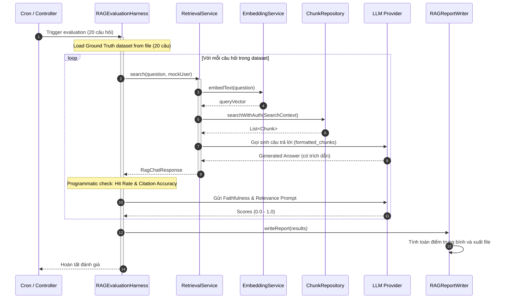

# TÀI LIỆU THIẾT KẾ CHI TIẾT (DETAILED DESIGN DOCUMENT - DDD)
**Tuần 5: Bảo mật Tìm kiếm & Đánh giá Tự động (Security & RAG Evaluation)**

---

## MỤC LỤC (TABLE OF CONTENTS)
1. [Introduction (Giới thiệu)](#1-introduction-giới-thiệu)
2. [Logical Component & Class Design (Thiết kế Lớp và Thành phần Logic)](#2-logical-component--class-design-thiết-kế-lớp-và-thành-phần-logic)
3. [Data & Database Design (Thiết kế Dữ liệu & Cơ sở dữ liệu)](#3-data-database-design-thiết-kế-dữ-liệu-cơ-sở-dữ-liệu)
4. [Detailed Module & Process Design (Thiết kế Quy trình Chi tiết)](#4-detailed-module--process-design-thiết-kế-quy-trình-chi-tiết)
5. [API & SQL Interface Design (Thiết kế API & Truy vấn SQL)](#5-api-sql-interface-design-thiết-kế-api-truy-vấn-sql)
6. [LLM Judge Prompt Templates (Biểu mẫu Prompts Giám khảo LLM)](#6-llm-judge-prompt-templates-biểu-mẫu-prompts-giám-khảo-llm)
7. [Testing Design (Thiết kế Kiểm thử)](#7-testing-design-thiết-kế-kiểm-thử)

---

## 1. INTRODUCTION (GIỚI THIỆU)

| Thuộc tính | Chi tiết tài liệu |
| :--- | :--- |
| **Mã tài liệu (Document ID)** | DD-EAP-W5-001 |
| **Phiên bản (Version)** | 1.0 |
| **Trạng thái (Status)** | Hoàn thành |
| **Ngày phát hành (Date)** | 2026-08-27 |
| **Tác giả (Author)** | Nhóm Phát triển Backend (Senior Software Engineer) |
| **Tài liệu Kiến trúc liên quan** | [ADD-005](./ArchitectureDesign.md) |
| **Mục đích & Phạm vi (Purpose & Scope)** | Tài liệu đặc tả thiết kế chi tiết cấp thấp phục vụ lập trình cho các tính năng **Bảo mật Tìm kiếm & Đánh giá Tự động** của dự án VCC-EAP. Thiết kế tuân thủ các quyết định tại tài liệu kiến trúc ADD-005, tập trung vào cấu trúc lớp, sơ đồ tuần tự thực thi, cấu trúc dữ liệu vai trò và thiết kế kiểm thử. |

---

## 2. LOGICAL COMPONENT & CLASS DESIGN (THIẾT KẾ LỚP VÀ THÀNH PHẦN LOGIC)

### 2.1. Class Responsibilities (Trách nhiệm của các Lớp)
*   **`SearchContext`** (Cập nhật): DTO nội bộ được bổ sung thêm thuộc tính `userRole` (ví dụ: `"staff"`, `"manager"`) lấy từ ngữ cảnh đăng nhập của người dùng hiện tại để phục vụ lọc bảo mật.
*   **`RAGEvaluationHarness`**:
    *   Trách nhiệm: Đóng vai trò bộ điều phối chạy kiểm thử. Đọc tệp Ground Truth (20 câu hỏi), gọi `RetrievalService.search()` để lấy kết quả từ RAG, chuyển thông tin sang `RAGEvaluatorService` chấm điểm chất lượng, tính toán điểm số trung bình và gọi `RAGReportWriter` kết xuất báo cáo.
*   **`RAGEvaluatorService`**:
    *   Trách nhiệm: Đóng gói logic chấm điểm qua LLM (LLM-as-a-judge). Gửi câu trả lời và ngữ cảnh (chunks) sang LLM API kèm prompt để chấm điểm Faithfulness (Độ trung thực) và Answer Relevance.
*   **`RAGReportWriter`**:
    *   Trách nhiệm: Ghi nhận kết quả đánh giá chi tiết và xuất báo cáo dưới dạng Markdown (`rag_evaluation_report.md`) và JSON lưu trữ tĩnh trên Shared File Storage.

---

## 3. DATA & DATABASE DESIGN (THIẾT KẾ DỮ LIỆU & CƠ SỞ DỮ LIỆU)

### 3.1. Ràng buộc Cơ sở dữ liệu Tĩnh & Schema JSONB
*   Hệ thống không viết thêm bất kỳ file migration DDL Flyway nào cho Tuần 5.
*   **Lưu trữ vai trò**: Mảng vai trò được phép truy cập (`roles`) được lưu trực tiếp làm một thuộc tính bên trong trường `metadata` JSONB của bảng `tbl_chunks` hiện tại.
    *   *Ví dụ cấu trúc JSONB*:
        ```json
        {
          "doc_type": "guide",
          "topics": ["hr_policy"],
          "roles": ["staff", "manager"],
          "page_number": 3
        }
        ```
*   **Lưu trữ kết quả đánh giá**: Các tệp tin báo cáo kết quả đánh giá chất lượng được lưu dưới dạng file Markdown và file JSON tĩnh trên thư mục Shared Storage chỉ định `/eap-storage/reports/rag_eval/`.

---

## 4. DETAILED MODULE & PROCESS DESIGN (THIẾT KẾ QUY TRÌNH CHI TIẾT)

### 4.1. Sơ đồ tuần tự (Sequence Diagram) - Quy trình chạy Đánh giá
Quy trình tự động hóa đánh giá chất lượng RAG trên bộ 20 câu hỏi Ground Truth:



---

## 5. API & SQL INTERFACE DESIGN (THIẾT KẾ API & TRUY VẤN SQL)

### 5.1. SQL Tìm kiếm Vector & Phân quyền Kép
Repository thực thi tìm kiếm tương đồng vector Cosine kết hợp tiền lọc siêu dữ liệu, cô lập phòng ban, BOARD isolation, loại bỏ Soft Delete, và lọc vai trò người dùng bằng toán tử containment `@>`:

```sql
SELECT * FROM (
    -- Phân đoạn 1: Tài liệu do phòng ban người dùng sở hữu trực tiếp
    SELECT 
        c.id AS chunk_id,
        c.content AS chunk_content,
        c.metadata AS chunk_metadata,
        d.id AS document_id,
        d.title AS display_title,
        d.business_code AS document_business_code,
        1.0 - (c.embedding <=> CAST(:queryVector AS vector)) AS similarity_score
    FROM tbl_chunks c
    JOIN tbl_documents d ON c.document_id = d.id
    WHERE d.parent_id IS NULL -- Chỉ lấy tài liệu gốc
      AND d.status = 'COMPLETED'
      AND d.deleted_at IS NULL
      AND d.owner_department_id = :userDeptId
      -- Quy tắc cô lập tuyệt đối của BOARD
      AND (
          d.owner_department_id <> :boardDeptId
          OR :userDeptId = :boardDeptId
      )
      -- Tiền lọc theo metadata JSONB
      AND (:metadataFilter IS NULL OR c.metadata @> CAST(:metadataFilter AS jsonb))
      -- Bộ lọc phân quyền vai trò (Tuần 5)
      AND (c.metadata @> CAST(:roleFilter AS jsonb))
    ORDER BY c.embedding <=> CAST(:queryVector AS vector) ASC
    LIMIT :limit
)
UNION ALL
(
    -- Phân đoạn 2: Tài liệu được chia sẻ hợp lệ qua Alias tới phòng ban của người dùng
    SELECT 
        c.id AS chunk_id,
        c.content AS chunk_content,
        c.metadata AS chunk_metadata,
        d.id AS document_id,
        d.title AS display_title,
        d.business_code AS document_business_code,
        1.0 - (c.embedding <=> CAST(:queryVector AS vector)) AS similarity_score
    FROM tbl_chunks c
    JOIN tbl_documents d ON c.document_id = d.id
    JOIN tbl_documents a ON a.parent_id = d.id 
                        AND a.owner_department_id = :userDeptId 
                        AND a.deleted_at IS NULL
    WHERE d.parent_id IS NULL
      AND d.status = 'COMPLETED'
      AND d.deleted_at IS NULL
      -- Quy tắc cô lập tuyệt đối của BOARD
      AND (
          d.owner_department_id <> :boardDeptId
          OR :userDeptId = :boardDeptId
      )
      -- Tiền lọc theo metadata JSONB
      AND (:metadataFilter IS NULL OR c.metadata @> CAST(:metadataFilter AS jsonb))
      -- Bộ lọc phân quyền vai trò (Tuần 5)
      AND (c.metadata @> CAST(:roleFilter AS jsonb))
    ORDER BY c.embedding <=> CAST(:queryVector AS vector) ASC
    LIMIT :limit
)
ORDER BY similarity_score DESC
LIMIT :limit;
```

---

## 6. LLM JUDGE PROMPT TEMPLATES (BIỂU MẪU PROMPTS GIÁM KHẢO LLM)

### 6.1. Faithfulness Prompt (Đỏ trung thực)
Prompt dùng để gọi LLM đánh giá xem câu trả lời có hoàn toàn dựa trên ngữ cảnh cung cấp hay không, kích hoạt JSON Mode:

```text
Bạn là một kiểm toán viên dữ liệu RAG độc lập. Nhiệm vụ của bạn là đánh giá xem CÂU TRẢ LỜI sinh ra bởi trợ lý AI có hoàn toàn được chứng thực bởi NGỮ CẢNH cung cấp hay không (không suy diễn ngoài lề, không bịa đặt).

## NGỮ CẢNH CUNG CẤP:
{context}

## CÂU TRẢ LỜI CỦA TRỢ LÝ AI:
{generated_answer}

## TIÊU CHÍ CHẤM ĐIỂM:
- Điểm 1.0 (Hoàn toàn trung thực): Mọi khẳng định trong câu trả lời đều tìm thấy trực tiếp từ các đoạn ngữ cảnh.
- Điểm từ 0.1 đến 0.9 (Trung thực một phần): Câu trả lời có một phần thông tin được suy diễn ngoài ngữ cảnh hoặc bịa đặt.
- Điểm 0.0 (Không trung thực): Câu trả lời tự bịa đặt toàn bộ thông tin hoặc mâu thuẫn trực tiếp với ngữ cảnh.

BẮT BUỘC trả về DUY NHẤT một đối tượng JSON có schema sau. Không markdown, không giải thích ngoài JSON:
{
  "score": float, // Điểm số từ 0.0 đến 1.0
  "reasoning": "giải thích ngắn gọn lý do chấm điểm"
}
```

### 6.2. Answer Relevance Prompt (Độ liên quan)
Prompt dùng để gọi LLM đánh giá xem câu trả lời có phản hồi trực tiếp và đúng trọng tâm câu hỏi hay không:

```text
Bạn là chuyên gia thẩm định chất lượng giao tiếp. Nhiệm vụ của bạn là đánh giá xem CÂU TRẢ LỜI có phản hồi trực tiếp, đầy đủ ý và đúng trọng tâm của CÂU HỎI hay không.

## CÂU HỎI:
{query}

## CÂU TRẢ LỜI:
{generated_answer}

## TIÊU CHÍ CHẤM ĐIỂM:
- Điểm 1.0: Câu trả lời đi thẳng vào trọng tâm câu hỏi, cung cấp đầy đủ thông tin được hỏi mà không chứa thông tin lan man ngoài lề.
- Điểm từ 0.1 đến 0.9: Trả lời đúng một phần, hoặc câu trả lời chứa quá nhiều nội dung thừa thãi không liên quan.
- Điểm 0.0: Câu trả lời hoàn toàn lạc đề hoặc trả lời sai.

BẮT BUỘC trả về DUY NHẤT một đối tượng JSON có schema sau. Không markdown, không giải thích ngoài JSON:
{
  "score": float, // Điểm số từ 0.0 đến 1.0
  "reasoning": "giải thích ngắn gọn lý do chấm điểm"
}
```

---

## 7. TESTING DESIGN (THIẾT KẾ KIỂM THỬ)

### 7.1. Integration Tests cho Bảo mật & Đánh giá
*   **`RoleBasedSecurityIntegrationTest`**:
    *   *Kịch bản*: Nạp tài liệu chứa 2 chunks: Chunk 1 có metadata `roles: ["staff", "manager"]`, Chunk 2 chỉ có `roles: ["manager"]`.
    *   Giả lập đăng nhập user HR có vai trò `STAFF` -> Gọi tìm kiếm ngữ nghĩa -> Xác thực kết quả trả về chỉ chứa Chunk 1 (Chunk 2 bị chặn hoàn toàn mức DB).
    *   Giả lập đăng nhập user HR có vai trò `MANAGER` -> Gọi tìm kiếm -> Xác thực kết quả chứa cả 2 chunks.
*   **`RAGEvaluationHarnessTest`**:
    *   *Kịch bản*: Mock API LLM trả về các phản hồi giả định cho câu trả lời RAG và điểm số của LLM Judge.
    *   Kích hoạt chạy thử nghiệm `RAGEvaluationHarness.runEvaluation()`.
    *   Xác thực: Đọc thành công tệp Ground Truth (20 câu), tính toán chính xác điểm số Retrieval Hit Rate, Faithfulness, Relevance, Citation Accuracy.
    *   Xác thực: Tệp báo cáo Markdown và JSON được tạo mới đúng định dạng tại thư mục Shared Storage.
