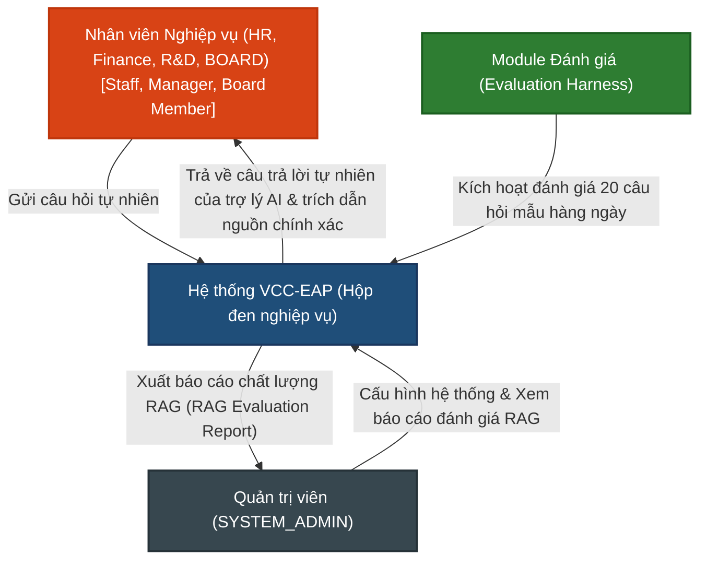

# TÀI LIỆU YÊU CẦU SẢN PHẨM (PRD)
**Tuần 5: Bảo mật Tìm kiếm & Đánh giá Tự động (Security & RAG Evaluation)**

---

## 1. Quản lý Tài liệu (Document Control)

### 1.1. Thông tin Tài liệu
| Trường thông tin | Giá trị |
| :--- | :--- |
| **Tiêu đề Tài liệu** | Tài liệu Yêu cầu Sản phẩm - Bảo mật Tìm kiếm & Đánh giá Tự động (PRD-005) |
| **Dự án** | VCC Enterprise Archive Platform (VCC-EAP) |
| **Phiên bản** | 1.0 |
| **Trạng thái** | Hoàn thành |
| **Tác giả** | Senior Product Analyst |
| **Ngày phát hành** | 2026-08-27 |

### 1.2. Lịch sử Thay đổi
| Phiên bản | Ngày | Tác giả | Mô tả Thay đổi | Lý do |
| :--- | :--- | :--- | :--- | :--- |
| 1.0 | 2026-08-27 | Senior Product Analyst | Phiên bản đầu tiên dành riêng cho yêu cầu Bảo mật & Đánh giá. | Bản đặc tả các yêu cầu nghiệp vụ Tuần 5. |

---

## Mục lục
1. [Quản lý Tài liệu](#1-quản-lý-tài-liệu-document-control)
2. [Giới thiệu](#2-giới-thiệu-introduction)
3. [Mô tả Tổng quan](#3-mô-tả-tổng-quan-overall-description)
4. [Yêu cầu Chức năng](#4-yêu-cầu-chức-năng-functional-requirements)
5. [Yêu cầu Phi chức năng](#5-yêu-cầu-phi-chức-năng-non-functional-requirements)
6. [Quy tắc Nghiệp vụ](#6-quy-tắc-nghiệp-vụ-business-rules)
7. [Kịch bản Nghiệm thu](#7-kịch-bản-nghiệm-thu-acceptance-criteria)
8. [Chú giải & Chú thích](#8-chú-giải--chú-thích-glossary--references)

---

## 2. Giới thiệu (Introduction)

### 2.1. Bối cảnh Nghiệp vụ
Sau khi hệ thống tra cứu tri thức cơ bản (Basic RAG) được thiết lập, hai yêu cầu đặc biệt quan trọng đã được đề ra để đảm bảo nền tảng sẵn sàng triển khai thực tế cho toàn bộ doanh nghiệp:
1.  **Bảo mật tìm kiếm ngữ nghĩa kép**: Việc tìm kiếm ngữ nghĩa không được phép vượt qua bộ lọc quyền hạn phòng ban và vai trò (roles). Nhân viên phòng Nhân sự tuyệt đối không bao giờ được tìm ra các đoạn tài liệu lương mật của Ban Giám đốc khi họ gõ các câu hỏi vu vơ.
2.  **Độ tin cậy & Kiểm chứng**: Trợ lý AI trả lời câu hỏi phải luôn đính kèm chính xác nguồn gốc (tên file gốc, số trang trong PDF gốc) của đoạn tài liệu tham khảo để nhân viên tự đối chiếu. Đồng thời, chất lượng câu trả lời phải được chấm điểm tự động hàng ngày qua bộ 20 câu hỏi mẫu (Ground Truth) để biết chất lượng đang tốt hơn hay tệ hơn khi thay đổi cấu hình.

### 2.2. Mục đích
Tài liệu này đặc tả các yêu cầu nghiệp vụ đối với phân hệ **Bảo mật Tìm kiếm & Đánh giá Tự động**. Tài liệu tập trung làm rõ hành vi hệ thống, luồng nghiệp vụ và các ràng buộc bảo mật dữ liệu ở mức sản phẩm, làm cơ sở để xây dựng thiết kế kiến trúc và thiết kế chi tiết.

### 2.3. Phạm vi Sản phẩm (Product Scope)
*   **Bảo mật tìm kiếm nâng cao**: Tích hợp bộ lọc phòng ban và vai trò của người dùng trực tiếp ở mức database (pgvector search).
*   **Sinh câu trả lời kèm trích dẫn vị trí chính xác**: Tổng hợp câu trả lời từ ngữ cảnh thu hồi, đính kèm chính xác nguồn trích dẫn (tên file, số trang gốc của PDF).
*   **Hệ thống Đánh giá Tự động**: Module tự động chạy kiểm thử trên tập 20 câu hỏi mẫu Ground Truth, gọi LLM-as-a-judge chấm điểm và kết xuất báo cáo chất lượng RAG dạng file tĩnh để so sánh giữa các cấu hình chunking.
*   **Không nằm trong phạm vi (Out of Scope)**: Không xây dựng lại các cấu phần số hóa tài liệu cơ bản, không xếp hạng lại kết quả (Re-ranking), không tìm kiếm lai (Hybrid Search) hay xử lý ảnh quét (OCR).

---

## 3. Mô tả Tổng quan (Overall Description)

### 3.1. Tác nhân Hệ thống (Actors)
*   **Nhân viên Nghiệp vụ**: Người dùng thuộc các phòng ban (HR, Finance, R&D, BOARD) với các vai trò cụ thể (`STAFF`, `MANAGER`, `BOARD_MEMBER`), có nhu cầu đặt câu hỏi tự nhiên để tra cứu thông tin và nhận câu trả lời trong phạm vi được cấp quyền.
*   **Quản trị viên (SYSTEM_ADMIN)**: Người vận hành hệ thống, không có quyền tìm kiếm ngữ nghĩa, không xem nội dung tài liệu. Được phép xem báo cáo chất lượng RAG và kích hoạt chạy thử nghiệm đánh giá.

#### Sơ đồ Bối cảnh Hệ thống (C1 — System Context Diagram)
Sơ đồ mô tả tương tác cấp cao của các tác nhân với hệ thống VCC-EAP dưới góc độ nghiệp vụ:

---

## 4. Yêu cầu Chức năng (Functional Requirements)

*   **FR-5.1. Bộ lọc bảo mật kép cấp DB (Department & Role Filter)**:
    *   Hệ thống bắt buộc thực thi lọc quyền truy cập dựa trên cả phòng ban và vai trò (role) của người dùng hiện tại directly tại tầng SQL của PostgreSQL.
    *   Mỗi phân đoạn văn bản (chunk) có thể đi kèm cấu hình danh sách vai trò được phép truy xuất (`roles`). Quyền truy xuất chỉ được cấp khi người dùng có vai trò phù hợp nằm trong mảng này.
    *   **Quy tắc ngắt sớm (Short-Circuit)**: Nếu câu hỏi không trích xuất được siêu dữ liệu nào hoặc tiền lọc kết hợp phân quyền trả về 0 phân đoạn ứng viên, hệ thống ngắt luồng xử lý và trả về kết quả rỗng `[]` ngay lập tức, không thực thi tìm kiếm vector toàn bảng.
*   **FR-5.2. Sinh câu trả lời kèm nguồn trích dẫn chính xác (Precise Citation Reference)**:
    *   Sử dụng trợ lý AI (LLM) để sinh câu trả lời tự nhiên dựa trên thông tin từ Top-K phân đoạn văn bản liên quan tìm được.
    *   Câu trả lời trả về bắt buộc phải đi kèm nguồn gốc chính xác của từng thông tin tham chiếu, ghi rõ định dạng: `[Tên tài liệu gốc] - Trang [Số trang]` (ví dụ: `[Chinh_Sach_Thu_Viec.pdf] - Trang 3`).
*   **FR-5.3. Module chạy đánh giá tự động (Evaluation Harness)**:
    *   Hệ thống cung cấp module tự động chạy và đánh giá chất lượng RAG trên bộ **20 câu hỏi mẫu Ground Truth** chuẩn hóa định kỳ hàng ngày (qua Cron Job) hoặc khi được Admin trigger thủ công.
    *   Sử dụng LLM làm giám khảo (LLM-as-a-judge) để chấm điểm các chỉ số chất lượng:
        *   **Faithfulness (Độ trung thực)**: Đánh giá câu trả lời của trợ lý AI có hoàn toàn được suy ra từ các chunks ngữ cảnh cung cấp hay không (thang điểm 0.0 - 1.0).
        *   **Answer Relevance (Độ liên quan)**: Đánh giá mức độ phản hồi đúng trọng tâm câu hỏi của câu trả lời sinh ra (thang điểm 0.0 - 1.0).
        *   **Retrieval Hit Rate**: Tính toán xem tệp tin gốc và số trang PDF mong muốn có nằm trong danh sách Top-K chunks được truy xuất hay không (Đo lường bằng lập trình).
        *   **Citation Accuracy (Độ chính xác trích dẫn)**: Kiểm tra xem 100% các trích dẫn nguồn đính kèm trong câu trả lời sinh ra có khớp chính xác với nguồn gốc thực tế của các chunk được nạp làm ngữ cảnh hay không (Kiểm tra bằng lập trình).
*   **FR-5.4. Kết xuất báo cáo chất lượng RAG (RAG Evaluation Report)**:
    *   Module đánh giá tự động thu thập kết quả và xuất báo cáo Markdown/JSON so sánh hiệu quả chất lượng giữa các cấu hình phân mảnh khác nhau (Paragraph Chunking vs Fixed-size Chunking) lưu trữ dạng tệp tin tĩnh trên đĩa hệ thống.

---

## 5. Yêu cầu Phi chức năng (Non-functional Requirements)

*   **NFR-5.1. Độ trễ sinh câu trả lời (SLA)**: Tổng thời gian cho toàn bộ luồng RAG (Retrieval + Generation) phải đạt mức **p95 dưới 3.0s** (không bao gồm độ trễ đường truyền mạng ngoài).
*   **NFR-5.2. Hiệu năng chạy đánh giá (SLA)**: Module chạy đánh giá 20 câu hỏi mẫu hoàn thành **dưới 120 giây** (2 phút) để tránh nghẽn tài nguyên.
*   **NFR-5.3. Rò rỉ dữ liệu (SLA)**: Tỷ lệ tìm chéo dữ liệu vector của phòng ban khác hoặc vai trò không hợp lệ = **0%** (thực thi ở mức DB).
*   **NFR-5.4. Xác thực trích dẫn (SLA)**: **100%** câu trả lời sinh ra có nguồn trích dẫn đúng trang tài liệu PDF gốc.
*   **NFR-5.5. Chặn quyền quản trị viên**: Tài khoản quản trị hệ thống (`SYSTEM_ADMIN`) bị tước quyền thực hiện tìm kiếm ngữ nghĩa, sử dụng trợ lý AI và không được phép xem nội dung chi tiết của tài liệu nghiệp vụ.

---

## 6. Quy tắc Nghiệp vụ (Business Rules)

*   **BR-5.1. Phân quyền bảo mật kép**: Quyền truy xuất của người dùng được xác thực bằng cả phòng ban (sở hữu hoặc alias) VÀ vai trò người dùng được định nghĩa trong trường `roles` của metadata chunk.
*   **BR-5.2. Bắt buộc trích dẫn**: Hệ thống không hiển thị câu trả lời tự sinh nếu không định vị được nguồn trích dẫn hợp lệ (tên file, số trang) tương ứng với các chunks được nạp làm ngữ cảnh.
*   **BR-5.3. Cô lập tuyệt đối của BOARD**: Tài liệu thuộc BOARD chỉ dành riêng cho người dùng BOARD và không thể chia sẻ Alias ra ngoài dưới bất kỳ hình thức nào.

---

## 7. Kịch bản Nghiệm thu (Acceptance Criteria)

### TC-5.1. Kiểm thử phân quyền vai trò chéo mức DB (Chặn rò rỉ dữ liệu)
*   **GIVEN**: Người dùng A thuộc phòng HR có vai trò `STAFF`. Người dùng B thuộc phòng HR có vai trò `MANAGER`. Cơ sở dữ liệu chứa tài liệu phòng HR có phân đoạn văn bản *"Kế hoạch duyệt ngân sách lương quý 3"* có cấu hình siêu dữ liệu `roles: ["manager", "board"]`.
*   **WHEN**: Người dùng A (`STAFF`) và người dùng B (`MANAGER`) cùng thực hiện tìm kiếm câu hỏi: *"Ngân sách lương của HR được duyệt thế nào?"*.
*   **THEN**:
    1. Người dùng B nhận về kết quả chứa phân đoạn văn bản trên.
    2. Người dùng A nhận về kết quả trống hoặc không chứa bất kỳ phân đoạn nào của tài liệu này (chặn hoàn toàn ở mức DB, rò rỉ dữ liệu = 0%).

### TC-5.2. Câu trả lời của trợ lý AI có trích dẫn chính xác nguồn gốc
*   **GIVEN**: Tài liệu *"Quy trinh dao tao.pdf"* đã hoàn thành số hóa, phân đoạn trang 3 chứa thông tin đào tạo nội bộ. Người dùng HR Staff đã đăng nhập.
*   **WHEN**: Người dùng gửi câu hỏi: *"Quy trình đào tạo nhân viên mới gồm những bước nào?"*.
*   **THEN**:
    1. Hệ thống trả về câu trả lời tự nhiên của trợ lý AI.
    2. Câu trả lời có đính kèm nguồn trích dẫn chính xác định dạng: `[Quy_Trinh_Dao_Tao.pdf] - Trang 3`.
    3. Trích dẫn khớp 100% với siêu dữ liệu thực tế của PDF gốc.

### TC-5.3. Kịch hoạt chạy đánh giá tự động và xuất báo cáo so sánh chunking
*   **GIVEN**: Bộ dữ liệu Ground Truth gồm 20 câu hỏi mẫu và tài liệu tham chiếu tương ứng đã được thiết lập.
*   **WHEN**: Quản trị viên kích hoạt chạy module Evaluation Harness thông qua lệnh điều khiển.
*   **THEN**:
    1. Hệ thống chạy hoàn tất đánh giá 20 câu hỏi mẫu trong thời gian dưới 2 phút.
    2. Điểm số các chỉ số (Retrieval Hit Rate, Faithfulness, Relevance, Citation Accuracy) được tính toán đầy đủ.
    3. Hệ thống xuất ra tệp tin báo cáo `rag_evaluation_report.md` so sánh chi tiết hiệu quả giữa cấu hình Paragraph Chunking hiện tại và cấu hình Fixed-size Chunking.

---

## 8. Chú giải & Chú thích (Glossary & References)

*   **RBAC (Role-Based Access Control)**: Cơ chế phân quyền truy cập dựa trên vai trò của người dùng.
*   **Evaluation Harness**: Module tự động chạy bộ câu hỏi kiểm thử và đo đạc chất lượng hệ thống.
*   **LLM-as-a-judge**: Kỹ thuật sử dụng Mô hình ngôn ngữ lớn để chấm điểm các câu trả lời tự sinh theo các tiêu chí chất lượng xác định.
