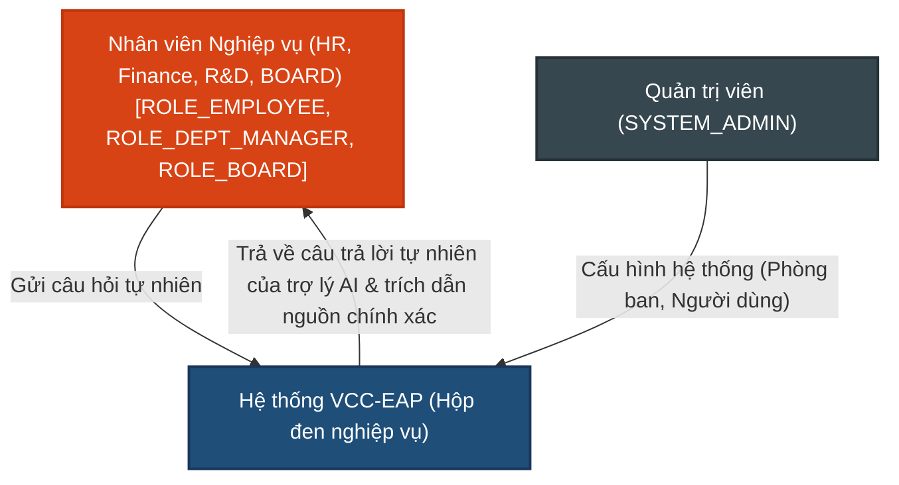

# TÀI LIỆU YÊU CẦU SẢN PHẨM (PRD)
**Tuần 5: Bảo mật Tìm kiếm (Security & RAG Search)**

---

## 1. Quản lý Tài liệu (Document Control)

### 1.1. Thông tin Tài liệu
| Trường thông tin | Giá trị |
| :--- | :--- |
| **Tiêu đề Tài liệu** | Tài liệu Yêu cầu Sản phẩm - Bảo mật Tìm kiếm (PRD-005) |
| **Dự án** | VCC Enterprise Archive Platform (VCC-EAP) |
| **Phiên bản** | 1.0 |
| **Trạng thái** | Hoàn thành |
| **Tác giả** | Senior Product Analyst |
| **Ngày phát hành** | 2026-08-27 |

### 1.2. Lịch sử Thay đổi
| Phiên bản | Ngày | Tác giả | Mô tả Thay đổi | Lý do |
| :--- | :--- | :--- | :--- | :--- |
| 1.0 | 2026-08-27 | Senior Product Analyst | Phiên bản đầu tiên dành riêng cho yêu cầu Bảo mật & Đánh giá. | Bản đặc tả các yêu cầu nghiệp vụ Tuần 5. |

---

## Mục lục
1. [Quản lý Tài liệu](#1-quản-lý-tài-liệu-document-control)
2. [Giới thiệu](#2-giới-thiệu-introduction)
3. [Mô tả Tổng quan](#3-mô-tả-tổng-quan-overall-description)
4. [Yêu cầu Chức năng](#4-yêu-cầu-chức-năng-functional-requirements)
5. [Yêu cầu Phi chức năng](#5-yêu-cầu-phi-chức-năng-non-functional-requirements)
6. [Quy tắc Nghiệp vụ](#6-quy-tắc-nghiệp-vụ-business-rules)
7. [Kịch bản Nghiệm thu](#7-kịch-bản-nghiệm-thu-acceptance-criteria)
8. [Chú giải & Chú thích](#8-chú-giải--chú-thích-glossary--references)

---

## 2. Giới thiệu (Introduction)

### 2.1. Bối cảnh Nghiệp vụ
Sau khi hệ thống tra cứu tri thức cơ bản (Basic RAG) được thiết lập, hai yêu cầu đặc biệt quan trọng đã được đề ra để đảm bảo nền tảng sẵn sàng triển khai thực tế cho toàn bộ doanh nghiệp:
1.  **Bảo mật tìm kiếm ngữ nghĩa**: Việc tìm kiếm ngữ nghĩa không được phép vượt qua bộ lọc quyền hạn phòng ban và cơ chế cô lập của Ban Giám đốc (BOARD). Nhân viên phòng Nhân sự tuyệt đối không bao giờ được tìm ra các đoạn tài liệu lương mật của Ban Giám đốc khi họ gõ các câu hỏi vu vơ.
2.  **Độ tin cậy & Kiểm chứng**: Trợ lý AI trả lời câu hỏi phải luôn đính kèm chính xác nguồn gốc (tên file gốc, số trang trong PDF gốc) của đoạn tài liệu tham khảo dưới dạng trích dẫn để nhân viên tự đối chiếu.

### 2.2. Mục đích
Tài liệu này đặc tả các yêu cầu nghiệp vụ đối với phân hệ **Bảo mật Tìm kiếm**. Tài liệu tập trung làm rõ hành vi hệ thống, luồng nghiệp vụ và các ràng buộc bảo mật dữ liệu ở mức sản phẩm, làm cơ sở để xây dựng thiết kế kiến trúc và thiết kế chi tiết.

### 2.3. Phạm vi Sản phẩm (Product Scope)
*   **Bảo mật tìm kiếm ngữ nghĩa**: Tích hợp bộ lọc phòng ban (Department Isolation) và cô lập của Ban Giám đốc (BOARD Isolation) trực tiếp ở mức database (pgvector search). Chặn quyền tìm kiếm của `SYSTEM_ADMIN` mức API/Service.
*   **Sinh câu trả lời kèm trích dẫn vị trí chính xác**: Tổng hợp câu trả lời từ ngữ cảnh thu hồi, đính kèm chính xác nguồn trích dẫn (tên file, số trang gốc của PDF).
*   **Không nằm trong phạm vi (Out of Scope)**: Không xây dựng các cấu phần số hóa tài liệu cơ bản, không xếp hạng lại kết quả (Re-ranking), không tìm kiếm lai (Hybrid Search) hay xử lý ảnh quét (OCR). Không xây dựng hệ thống chạy đánh giá tự động (Evaluation Harness) hay chấm điểm chất lượng tự động bằng LLM trong phân hệ này.

---

## 3. Mô tả Tổng quan (Overall Description)

### 3.1. Tác nhân Hệ thống (Actors)
*   **Nhân viên Nghiệp vụ**: Người dùng thuộc các phòng ban (HR, Finance, R&D, BOARD) với các vai trò cụ thể (`ROLE_EMPLOYEE`, `ROLE_DEPT_MANAGER`, `ROLE_BOARD`), có nhu cầu đặt câu hỏi tự nhiên để tra cứu thông tin và nhận câu trả lời trong phạm vi được cấp quyền.
*   **Quản trị viên (SYSTEM_ADMIN)**: Người vận hành hệ thống, không có quyền tìm kiếm ngữ nghĩa, không xem nội dung tài liệu. Thực hiện quản lý danh mục phòng ban và người dùng.

#### Sơ đồ Bối cảnh Hệ thống (C1 — System Context Diagram)

---

## 4. Yêu cầu Chức năng (Functional Requirements)

*   **FR-5.1. Bộ lọc bảo mật tìm kiếm cấp DB (Department & BOARD Isolation)**:
    *   Hệ thống bắt buộc thực thi lọc quyền truy cập dựa trên phòng ban của người dùng hiện tại trực tiếp tại tầng SQL của PostgreSQL.
    *   **Department Isolation**: Người dùng chỉ có quyền tìm kiếm và truy xuất các chunks thuộc tài liệu do phòng ban của mình sở hữu trực tiếp, hoặc tài liệu của phòng ban khác được chia sẻ hợp lệ qua Alias tới phòng ban của mình.
    *   **BOARD Isolation**: Tài liệu thuộc phòng ban BOARD chỉ dành riêng cho người dùng thuộc phòng ban BOARD và không thể chia sẻ Alias ra ngoài dưới bất kỳ hình thức nào. Điều kiện này được ràng buộc cứng trong câu lệnh SQL.
    *   **SYSTEM_ADMIN Block**: Người dùng có vai trò `SYSTEM_ADMIN` bị chặn hoàn toàn quyền truy cập các API tìm kiếm ngữ nghĩa, sử dụng trợ lý AI và đọc nội dung tài liệu. Hệ thống sẽ trả về lỗi `403 Forbidden`.
    *   **Quy tắc ngắt sớm (Short-Circuit)**: Nếu câu hỏi trích xuất được metadata filter từ LLM nhưng tiền lọc (pre-filter) kiểm tra trong DB không tìm thấy bất kỳ chunk nào khớp metadata, hệ thống ngắt luồng xử lý và trả về kết quả rỗng ngay lập tức, không thực thi tìm kiếm vector toàn bảng.
*   **FR-5.2. Sinh câu trả lời kèm nguồn trích dẫn chính xác (Precise Citation Reference)**:
    *   Sử dụng trợ lý AI (LLM) để sinh câu trả lời tự nhiên dựa trên thông tin từ Top-K phân đoạn văn bản liên quan tìm được.
    *   Câu trả lời trả về bắt buộc phải đi kèm nguồn gốc chính xác của từng thông tin tham chiếu, ghi rõ định dạng: `[Tên tài liệu gốc, Trang Số trang]` (ví dụ: `[Quy_Trinh_Dao_Tao.pdf, Trang 3]`).
    *   Nếu không có trang, định dạng hiển thị là `[Tên tài liệu gốc]`.

---

## 5. Yêu cầu Phi chức năng (Non-functional Requirements)

*   **NFR-5.1. Độ trễ sinh câu trả lời (SLA)**: Tổng thời gian cho toàn bộ luồng RAG (Retrieval + Generation) phải đạt mức **p95 dưới 3.0s** (không bao gồm độ trễ đường truyền mạng ngoài).
*   **NFR-5.2. Rò rỉ dữ liệu (SLA)**: Tỷ lệ tìm chéo dữ liệu vector của phòng ban khác hoặc vai trò không hợp lệ = **0%** (thực thi ở mức DB).
*   **NFR-5.3. Xác thực trích dẫn (SLA)**: **100%** câu trả lời sinh ra có nguồn trích dẫn đúng trang tài liệu PDF gốc.
*   **NFR-5.4. Chặn quyền quản trị viên**: Tài khoản quản trị hệ thống (`SYSTEM_ADMIN`) bị tước quyền thực hiện tìm kiếm ngữ nghĩa, sử dụng trợ lý AI và không được phép xem nội dung chi tiết của tài liệu nghiệp vụ.

---

## 6. Quy tắc Nghiệp vụ (Business Rules)

*   **BR-5.1. Phân quyền bảo mật**: Quyền truy xuất của người dùng được xác thực và cách ly bằng phòng ban sở hữu hoặc phòng ban nhận alias của tài liệu.
*   **BR-5.2. Bắt buộc trích dẫn**: Hệ thống không hiển thị câu trả lời tự sinh nếu không định vị được nguồn trích dẫn hợp lệ (tên file, số trang) tương ứng với các chunks được nạp làm ngữ cảnh.
*   **BR-5.3. Cô lập tuyệt đối của BOARD**: Tài liệu thuộc BOARD chỉ dành riêng cho người dùng BOARD và không thể chia sẻ Alias ra ngoài dưới bất kỳ hình thức nào.

---

## 7. Kịch bản Nghiệm thu (Acceptance Criteria)

### TC-5.1. Kiểm thử phân quyền cô lập phòng ban và BOARD (Chặn rò rỉ dữ liệu)
*   **GIVEN**: Người dùng A thuộc phòng HR. Người dùng B thuộc phòng BOARD. Tài liệu X thuộc sở hữu của phòng BOARD.
*   **WHEN**: Cả hai người dùng thực hiện tìm kiếm cùng một câu hỏi liên quan đến nội dung tài liệu X.
*   **THEN**:
    1. Người dùng B nhận về kết quả chứa các phân đoạn văn bản của tài liệu X.
    2. Người dùng A nhận về kết quả trống hoặc không chứa bất kỳ phân đoạn nào của tài liệu X (chặn hoàn toàn ở mức DB).
*   **GIVEN**: Người dùng A thuộc phòng HR. Tài liệu Y thuộc phòng Finance và chưa được chia sẻ Alias cho phòng HR.
*   **WHEN**: Người dùng A tìm kiếm câu hỏi liên quan đến tài liệu Y.
*   **THEN**: Người dùng A không nhận được bất kỳ kết quả nào thuộc tài liệu Y.

### TC-5.2. Câu trả lời của trợ lý AI có trích dẫn chính xác nguồn gốc
*   **GIVEN**: Tài liệu *"Quy trinh dao tao.pdf"* đã hoàn thành số hóa, phân đoạn trang 3 chứa thông tin đào tạo nội bộ. Người dùng HR đã đăng nhập.
*   **WHEN**: Người dùng gửi câu hỏi: *"Quy trình đào tạo nhân viên mới gồm những bước nào?"*.
*   **THEN**:
    1. Hệ thống trả về câu trả lời tự nhiên của trợ lý AI.
    2. Câu trả lời có đính kèm nguồn trích dẫn chính xác định dạng: `[Quy_trinh_dao_tao.pdf, Trang 3]`.
    3. Trích dẫn khớp 100% với siêu dữ liệu thực tế của PDF gốc.

---

## 8. Chú giải & Chú thích (Glossary & References)

*   **RAG (Retrieval-Augmented Generation)**: Kỹ thuật tối ưu hóa đầu ra của Mô hình Ngôn ngữ Lớn (LLM) bằng cách tham chiếu đến một nguồn tri thức bên ngoài trước khi sinh câu trả lời.
*   **Department Isolation**: Cô lập dữ liệu giữa các phòng ban, ngăn chặn việc truy cập tài liệu trái phép giữa các phòng ban khác nhau.
*   **BOARD Isolation**: Cơ chế cô lập tuyệt đối dữ liệu của Ban Giám Đốc, không cho phép chia sẻ hay truy cập từ bên ngoài phòng BOARD.
