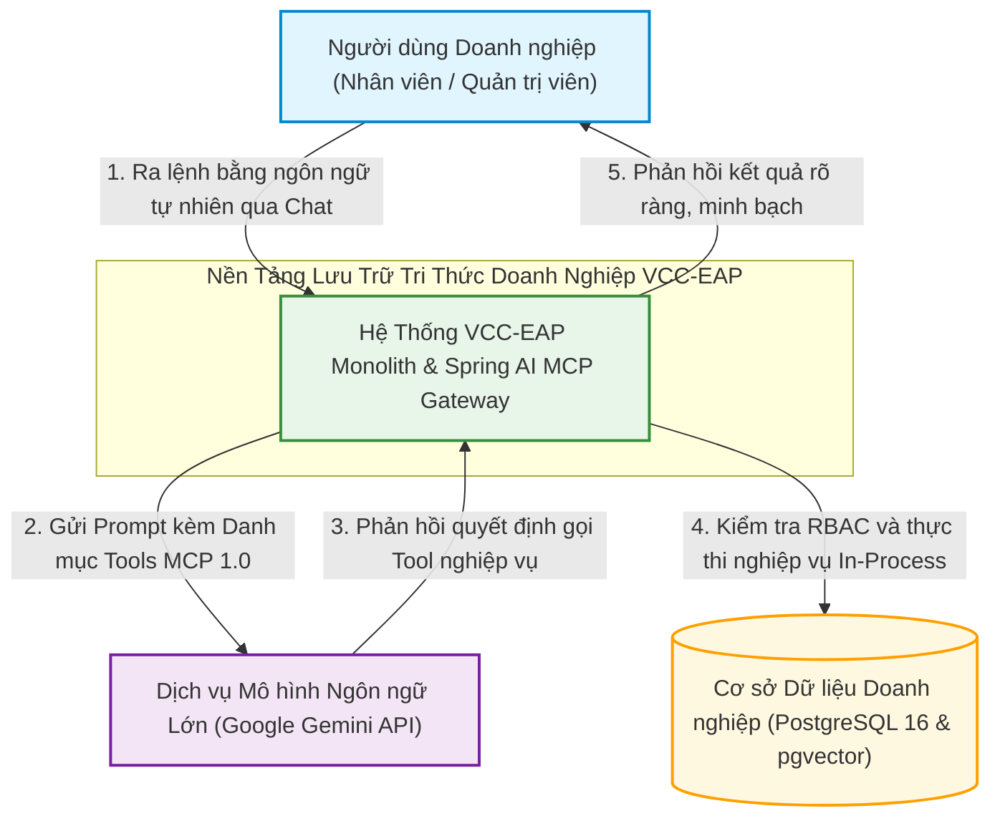
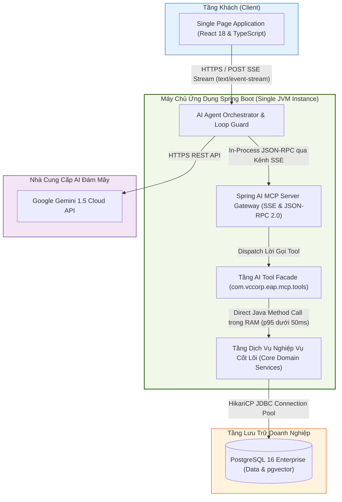
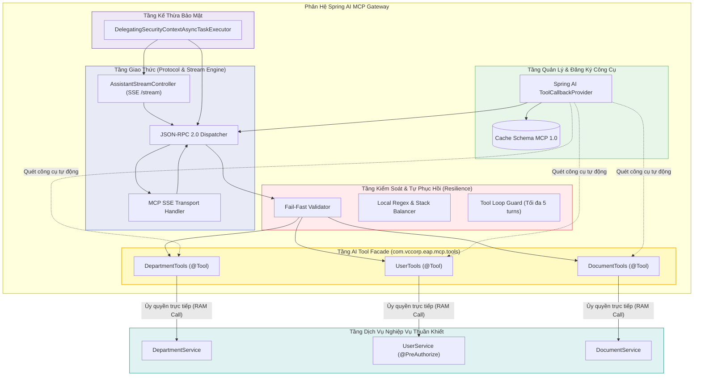
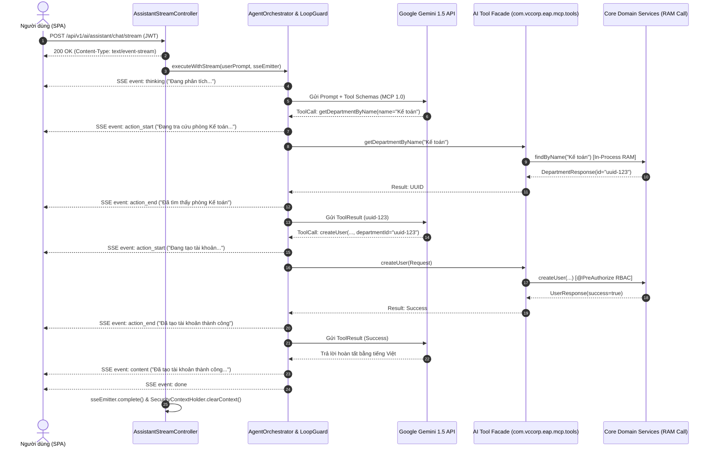

# TÀI LIỆU THIẾT KẾ KIẾN TRÚC (ADD)
**Tuần 6: Phân Hệ Spring AI MCP Server & Trợ Lý Tự Thực Thi Tác Vụ Nghiệp Vụ**

---

## 1. Kiểm Soát Tài Liệu (Document Control)

### 1.1. Thông Tin Tài Liệu
| Thuộc tính | Giá trị |
| :--- | :--- |
| **Tiêu đề Tài liệu** | Tài liệu Thiết kế Kiến trúc Hệ thống - Tuần 6 (ADD-006) |
| **Dự án** | Nền tảng Lưu trữ Tri thức Doanh nghiệp VCC (VCC-EAP) |
| **Phân hệ** | Spring AI MCP Server (Model Context Protocol Gateway) |
| **Phiên bản** | **2.0 (Chuẩn Hóa Kiến Trúc Không Lưu Trạng Thái, Giới Hạn Loop Guard 5 Turns & Quản Lý Ngắt Kết Nối SSE)** |
| **Trạng thái** | **ĐÃ PHÊ DUYỆT (LOCKED & FINALIZED)** |
| **Tác giả** | Senior Software Architect / Solution Architect |
| **Ngày phát hành** | 2026-09-10 |
| **Khung tham chiếu** | **IEEE Std 42010-2011** (Đặc tả Kiến trúc Hệ thống & Phần mềm); **C4 Model** (Context, Container, Component); **Architecture Decision Records (ADRs)**; **Anthropic Model Context Protocol 1.0**; **Spring AI 1.0.0-M6 & Spring Boot 3.3.4**. |

### 1.2. Lịch Sử Thay Đổi
| Phiên bản | Ngày | Tác giả | Mô tả Thay đổi |
| :--- | :--- | :--- | :--- |
| 1.0 | 2026-09-10 | Senior Software Architect | Khởi tạo tài liệu Thiết kế Kiến trúc chính thức Tuần 6 (ADD-006) chuẩn hóa theo IEEE 42010 và C4 Model. Hợp nhất các quyết định kiến trúc: AI Tool Facade, Zero LLM-DTOs, Autonomous Chaining, Fail-Fast dứt khoát, an toàn ThreadPool context propagation và 4 tầng phòng vệ dữ liệu. |
| **2.0** | **2026-09-10** | **Senior Software Architect** | **Phát hành chính thức ADD Tuần 6 (Đồng bộ phiên bản 2.0 toàn hệ thống)**:<br/>• Chuẩn hóa kiến trúc Không lưu trạng thái (Stateless Assistant), tích hợp kênh Client SSE Streaming (`/api/v1/ai/assistant/chat/stream`).<br/>• Thống nhất giới hạn trần vòng lặp tự chủ (Tool Loop Guard) tối đa **5 turns**.<br/>• Hoàn thiện quản lý vòng đời kết nối SSE và cơ chế xử lý ngắt kết nối đột ngột từ Client (Client Disconnect Lifecycle). |

---

## 2. Giới Thiệu & Bối Cảnh Kiến Trúc (Introduction & Scope)

### 2.1. Mục Đích của Tài Liệu
Tài liệu này đặc tả thiết kế kiến trúc hệ thống cấp cao (Architecture Design Document - ADD) cho phân hệ **Spring AI MCP Server và Trợ lý AI Tự Thực Thi Tác Vụ Nghiệp Vụ** thuộc nền tảng VCC-EAP. 

Tài liệu xác lập ranh giới hệ thống, cấu trúc container, các thành phần logic nội bộ, các cơ chế giao tiếp, ràng buộc bảo mật, và các quyết định kiến trúc chiến lược (ADRs). Tài liệu đóng vai trò là **khung tham chiếu và đầu vào bắt buộc** để đội ngũ kỹ thuật xây dựng tài liệu Thiết kế Chi tiết (DetailedDesign.md), đảm bảo không lấn sân sang các đặc tả cài đặt mức mã nguồn hay chi tiết lược đồ cơ sở dữ liệu.

### 2.2. Bối Cảnh Nghiệp Vụ
Sau khi hoàn thiện năng lực Tra cứu Tri thức Ngữ nghĩa (Basic RAG ở Tuần 4 và Tuần 5), VCC-EAP mở rộng năng lực để hỗ trợ nhân viên thực thi các hành động nghiệp vụ thực tế (Active Actions) thông qua giao tiếp ngôn ngữ tự nhiên. 

Hệ thống chuyển đổi từ **Trợ lý Thụ động (Passive Assistant - chỉ tra cứu và đọc dữ liệu)** sang **Trợ lý Chủ động (Action-Oriented Assistant)**. Hệ thống cung cấp cho mô hình ngôn ngữ lớn (LLM Engine) danh mục công cụ nghiệp vụ được chuẩn hóa theo giao thức mở **Anthropic Model Context Protocol (MCP 1.0)**.

### 2.3. Ranh Giới Phạm Vi Kiến Trúc (Architectural Scope)
* **Thuộc phạm vi (In-Scope)**:
  * Xây dựng cổng giao thức Spring AI MCP Server hỗ trợ SSE Transport và JSON-RPC 2.0.
  * Thiết lập mô hình AI Tool Facade Pattern (`com.vccorp.eap.mcp.tools`) bọc các dịch vụ nghiệp vụ cốt lõi (Phòng ban, Người dùng, Tra cứu Tri thức).
  * Cơ chế Xâu chuỗi Công cụ Tự chủ (Autonomous Tool Chaining) cho phép LLM tự động suy luận khóa ngoại UUID.
  * Cơ chế Thất bại Sớm (Fail-Fast Validation) khi thiếu tham số bắt buộc hoặc tra cứu liên kết rỗng.
  * Kiểm soát an toàn phân quyền In-Process và kế thừa bảo mật luồng bất đồng bộ trong ThreadPool (`DelegatingSecurityContextAsyncTaskExecutor`).
  * Cơ chế phòng vệ và tự phục hồi cú pháp JSON 4 tầng (Resilience Engine).
  * Kênh truyền tin Server-Sent Events (SSE) Streaming qua HTTP POST giữa Client SPA và Agent Orchestrator (`/api/v1/ai/assistant/chat/stream`).
* **Nằm ngoài phạm vi (Out-of-Scope)**:
  * Không xây dựng hệ thống đa tác nhân tự hành (Multi-Agent Swarm) phức tạp.
  * Không can thiệp vào các hành động rủi ro cao (xóa vĩnh viễn dữ liệu lớn, can thiệp tài chính/tiền lương).
  * Không thay đổi schema cơ sở dữ liệu nền tảng đã ổn định từ các tuần trước.

---

## 3. Các Bên Liên Quan & Mối Quan Tâm (Stakeholders & Concerns)

| Bên liên quan | Vai trò trong hệ thống | Mối quan tâm kiến trúc chính | Giải pháp kiến trúc đáp ứng |
| :--- | :--- | :--- | :--- |
| **Giám đốc Công nghệ (CTO)** | Quản trị Chiến lược | Tuân thủ tiêu chuẩn mở MCP 1.0, kiến trúc bền vững, dễ mở rộng với các Agent AI khác trong tương lai. | Chuẩn hóa hoàn toàn theo Anthropic MCP 1.0; thiết kế Ports & Adapters mở. |
| **Đội ngũ SRE / Vận hành** | Hạ tầng & Ổn định | Tỷ lệ crash ứng dụng bằng 0%; ngăn chặn tiêu tốn tài nguyên và nghẽn kết nối do vòng lặp LLM vô hạn. | Cam kết SLA Crash Rate = 0%; bộ lọc JSON Resilience 4 tầng; chốt cứng Tool Loop Guard tối đa 5 turns. |
| **Bộ phận An toàn Thông tin** | An ninh Doanh nghiệp | Cưỡng chế phân quyền RBAC; chống Prompt Injection và Mass Assignment; kiểm soát danh tính người thao tác. | Thực thi bảo mật tại tầng Service (`@PreAuthorize`); bất biến danh tính từ JWT trong RAM; dọn dẹp context trong ThreadPool. |
| **Đội ngũ Phát triển Phần mềm** | Xây dựng & Bảo trì | Mã nguồn rõ ràng; không làm ô nhiễm tầng nghiệp vụ bằng các annotation của AI; dễ viết kiểm thử tự động. | Tách riêng package `mcp.tools` (AI Tool Facade); giữ tầng `@Service` thuần khiết độc lập với Spring AI. |
| **Người dùng Doanh nghiệp** | Trải nghiệm Nghiệp vụ | Giao tiếp tự nhiên, không phải nhớ mã định danh kỹ thuật (UUID) phức tạp; theo dõi minh bạch tiến trình xử lý, không bị treo giao diện. | Năng lực Autonomous Tool Chaining cho phép LLM tự tìm kiếm và suy luận tham số liên kết; Action Stepper trực quan thời gian thực qua Client SSE Streaming. |

---

## 4. Mục Tiêu Chất Lượng & Ràng Buộc Kiến Trúc (Quality Goals & Constraints)

### 4.1. Mục Tiêu Chất Lượng (SLAs)
1. **SLA Độ Ổn Định (Crash Rate = 0%)**: Tỷ lệ dừng luồng hoặc sập ứng dụng JVM do lỗi cú pháp, chuỗi cắt cụt hoặc dữ liệu bất thường từ LLM phải đạt mức tuyệt đối **0%**. Mọi lỗi phải được cô lập và tự phục hồi an toàn trong RAM.
2. **SLA Độ Trễ Phân Định (Latency SLAs)**:
   * **Độ trễ Gọi Nội bộ (In-Process Call)**: Thời gian thực thi lời gọi công cụ trong RAM JVM (từ khi nhận lệnh JSON-RPC đến khi trả kết quả cho Orchestrator) đạt **p95 dưới 50ms**.
   * **Tác vụ Đơn lẻ (Single-turn Action / Query)**: Tổng thời gian phản hồi cho tác vụ tra cứu hoặc gọi 1 tool đơn lẻ đạt **p95 dưới 4.0s**.
   * **Xâu chuỗi Tự chủ Nhiều bước (Multi-turn Chaining)**: Tôn trọng số bước reasoning và gọi công cụ tự nhiên của mô hình AI; chấp nhận tổng thời gian phụ thuộc vào số lượt round-trip ngoại vi cần thiết (trung bình 1.2s - 1.8s / lượt).
3. **SLA Bảo Mật Phân Quyền (RBAC 100%)**: 100% các hành động nghiệp vụ đều được kiểm tra thẩm quyền tại tầng Service. Tuyệt đối không có kịch bản prompt injection nào có thể vượt quyền người dùng thực tế.
4. **SLA Giới Hạn Tài Nguyên (Loop Limit = 5)**: Số lần gọi công cụ liên tiếp trong cùng một lượt tương tác không vượt quá **5 lần**.

### 4.2. Ràng Buộc Kiến Trúc (Architectural Constraints)
1. **Ràng buộc Kiến trúc Đơn khối (Spring Boot Monolith)**: Toàn bộ phân hệ MCP Gateway, Orchestrator và Core Services vận hành trong cùng một tiến trình JVM duy nhất.
2. **Ràng buộc Thực thi Trong Bộ Nhớ (In-Process Execution)**: Lời gọi từ MCP Gateway xuống Service nghiệp vụ phải thực hiện trực tiếp qua method call trên RAM, nghiêm cấm gọi vòng ngược qua HTTP Loopback.
3. **Ràng buộc Bất Biến Danh Tính (Identity Immutability)**: Định danh và vai trò người dùng bắt buộc phải lấy 100% từ `SecurityContextHolder` trong RAM, nghiêm cấm nhận tham số định danh từ câu lệnh chat.
4. **Ràng buộc Không Lưu Trạng Thái (Stateless Assistant Constraint)**: Hệ thống hoạt động theo nguyên tắc Stateless; không lưu giữ phiên đàm thoại hay trạng thái dở dang trên server. Mỗi request gửi tới endpoint stream là một lượt xử lý độc lập hoàn toàn. Khi yêu cầu bị từ chối bởi Fail-Fast, câu lệnh tiếp theo của người dùng được xem là một request mới.

---

## 5. Kiến Trúc Hệ Thống Theo Mô Hình C4 (C4 Architecture Views)

### 5.1. C1 — System Context (Ngữ Cảnh Hệ Thống)
Mô hình C1 mô tả tương tác cấp cao giữa người dùng doanh nghiệp, nền tảng VCC-EAP và dịch vụ trí tuệ nhân tạo bên ngoài:



### 5.2. C2 — Container View (Kiến Trúc Container & Biên Giới Tiến Trình)
Mô hình C2 xác định các đơn vị triển khai thực tế và ranh giới giao tiếp mạng/tiến trình:



### 5.3. C3 — Component View (Kiến Trúc Thành Phần Nội Bộ)
Mô hình C3 phân rã các khối chức năng bên trong phân hệ Spring AI MCP Gateway và mối liên kết với tầng nghiệp vụ:



---

## 6. Các Cơ Chế Kỹ Thuật Cốt Lõi (Core Architectural Mechanisms)

### 6.1. AI Tool Facade Pattern & Triệt Tiêu DTO Trung Gian
* **Tách biệt ranh giới trách nhiệm**: Nhóm các class `*Tools` (`DepartmentTools`, `UserTools`, `DocumentTools`) đặt tại package chuyên trách `com.vccorp.eap.mcp.tools`. Annotation `@Tool` chỉ được phép tồn tại tại tầng này. Tầng `@Service` giữ nguyên tính độc lập hoàn toàn với Spring AI.
* **Tái sử dụng trực tiếp Domain DTO (Zero LLM-DTOs)**: Thay vì xây dựng các lớp DTO trung gian thừa thãi, hệ thống sử dụng trực tiếp các DTO nghiệp vụ sẵn có (`CreateUserRequest`, `DepartmentResponse`).
* **Quy chuẩn Kiểm Soát Bề Mặt DTO (DTO Exposure Control)**: Để bảo vệ toàn vẹn dữ liệu và chống tiêm nhiễm thuộc tính phân quyền (Mass Assignment), mọi thuộc tính nhạy cảm hoặc trường hệ thống (như `id`, `roles`, `status`, `createdAt`...) phải được che giấu khỏi JSON Schema của LLM bằng annotation `@JsonIgnore`, `@JsonProperty(access = WRITE_ONLY)` hoặc cấu hình lọc schema tự động.

### 6.2. Cơ Chế Xâu Chuỗi Công Cụ Tự Chủ (Autonomous Tool Chaining Flow)
Khi người dùng đưa câu lệnh chứa thông tin danh nghĩa (ví dụ: *"Tạo tài khoản cho nhân viên thuộc phòng Kế toán"*), LLM tự chủ thực hiện xâu chuỗi:
1. **Bước 1**: Nhận thấy API `createUser` yêu cầu `departmentId` dạng UUID $\rightarrow$ LLM kích hoạt công cụ phụ trợ `getDepartmentByName(name="Kế toán")`.
2. **Bước 2**: Hệ thống trả về `DepartmentResponse` chứa UUID tương ứng.
3. **Bước 3**: LLM tiếp nhận UUID và tự động gọi tiếp công cụ chính `createUser` với đầy đủ tham số hợp lệ.

### 6.3. Cơ Chế Thất Bại Sớm Dứt Khoát (Fail-Fast Validation & Empty Data Guard)
* **Xử lý thiếu tham số cốt lõi**: Nếu người dùng đưa thiếu thông tin bắt buộc mà hệ thống không có công cụ nào để tự suy luận (ví dụ thiếu email, mật khẩu), hệ thống lập tức từ chối và thông báo danh sách trường còn thiếu (`MISSING_REQUIRED_FIELDS`), tuyệt đối không hỏi gợi mở nhiều vòng.
* **Ngắt chuỗi khi dữ liệu tra cứu rỗng**: Khi công cụ tra cứu phụ trợ trả về lỗi hoặc dữ liệu rỗng (ví dụ: không tìm thấy phòng ban $\rightarrow$ mã `DEPARTMENT_NOT_FOUND`), MCP Dispatcher **lập tức ngắt chuỗi gọi tự chủ**, không gửi lại cho LLM suy luận tiếp, ngăn chặn 100% nguy cơ LLM tự đoán mò hoặc bịa mã UUID giả.

### 6.4. Kế Thừa Ngữ Cảnh Bảo Mật Trong Môi Trường ThreadPool An Toàn
* **Bảo vệ tại tầng thực thi (Execution-Level Security)**: Phân quyền được cưỡng chế trực tiếp tại tầng Service bằng Spring Security (`@PreAuthorize("hasRole('ADMIN')")`).
* **Khắc phục rủi ro rò rỉ quyền quản trị chéo luồng**: Trong môi trường xử lý bất đồng bộ, `InheritableThreadLocal` thông thường chỉ sao chép ngữ cảnh tại thời điểm tạo luồng, dẫn đến nguy cơ rò rỉ quyền quản trị khi ThreadPool tái sử dụng luồng. Kiến trúc khắc phục triệt để bằng hai chốt chặn:
  1. Sử dụng `DelegatingSecurityContextAsyncTaskExecutor` bọc lấy `ThreadPoolTaskExecutor`.
  2. Bắt buộc gọi `SecurityContextHolder.clearContext()` trong khối `finally` của Dispatcher/Worker để làm sạch luồng trước khi trả về pool.

### 6.5. Tự Phục Hồi Dữ Liệu 4 Tầng (Resilience Engine) & Chốt Chặn Điều Phối
Hệ thống duy trì cam kết **SLA Crash Rate = 0%** trước các biến đổi chuỗi JSON từ LLM thông qua **4 tầng bảo vệ cú pháp**:
1. **Tầng 1 — Local Regex Sanitizer (Dưới 5ms)**: Loại bỏ thẻ bọc markdown (```json), làm sạch khoảng trắng và xóa bỏ dấu phẩy thừa trước dấu đóng ngoặc.
2. **Tầng 2 — Stack Bracket Balancer & Xử Lý Chuỗi Chưa Đóng (Dưới 5ms)**: Sử dụng cấu trúc `ArrayDeque` kết hợp cờ `inString`. Nếu chuỗi bị cắt cụt giữa chừng khi `inString == true`, tự động bù dấu `"` để khép chuỗi ký tự an toàn trước khi bù các ngoặc nhọn `{}` và ngoặc vuông `[]` còn thiếu trong Stack.
3. **Tầng 3 — LLM Self-Correction Re-prompt (Tối đa 2 lần)**: Nếu sau Tầng 1 và Tầng 2 chuỗi vẫn không hợp lệ, gửi thông báo lỗi ngược lại cho LLM để định dạng lại cú pháp (`JsonSelfCorrectionService`).
4. **Tầng 4 — Circuit Breaker Fallback**: Nếu quá 2 lần sửa vẫn thất bại, ngắt tiến trình an toàn và trả về phản hồi lỗi chuẩn MCP (`isError = true`). Tuyệt đối không để Uncaught Exception làm sập tiến trình JVM.

* **Chốt Chặn Điều Phối (Tool Loop Guard)**: Độc lập với tầng xử lý cú pháp, bộ đếm điều phối `ToolLoopGuard` chặn cứng tối đa **5 lần gọi công cụ liên tiếp** trong cùng một lượt tương tác (turn). Nếu phát sinh turn thứ 6, lập tức ngắt chuỗi và trả về lỗi an toàn.

### 6.6. Cơ Chế Truyền Tin Phản Hồi Trợ Lý Thời Gian Thực (Client SSE Streaming Mechanism)

#### A. Bối Cảnh & Mục Tiêu Kiến Trúc
Khi thực hiện xâu chuỗi công cụ tự chủ (Multi-turn Chaining), tổng thời gian xử lý kéo dài từ 3.0s đến 5.0s do cần 2 - 3 lượt round-trip ngoại vi tới LLM Engine kết hợp với các lời gọi nghiệp vụ nội bộ. Nếu sử dụng REST Request-Response đồng bộ truyền thống, giao diện người dùng rơi vào trạng thái chờ thụ động (loading spinner tĩnh), gây cảm giác đơ ứng dụng và tăng nguy cơ người dùng bấm gửi trùng lặp yêu cầu.

Phân hệ thiết lập kênh truyền **Server-Sent Events (SSE) Streaming qua HTTP POST** (`/api/v1/ai/assistant/chat/stream`), đồng nhất 100% với tư tưởng kiến trúc SSE Transport của MCP 1.0, cho phép Backend chủ động đẩy (push) các sự kiện tiến trình hành động (Action Events) về Client theo thời gian thực.

#### B. Hợp Đồng Dữ Liệu Sự Kiện (Event Stream Contract)
Chuỗi sự kiện truyền tải qua header `Accept: text/event-stream` tuân thủ nghiêm ngặt 6 định dạng chuẩn:
1. **`event: thinking`**: Phát ngay lập tức khi Agent Orchestrator tiếp nhận yêu cầu (SLA TTFE p95 < 500ms):
   ```
   event: thinking
   data: {"step": 0, "status": "REASONING", "message": "Đang phân tích yêu cầu..."}
   ```
2. **`event: action_start`**: Phát trước khi kích hoạt lời gọi một Tool Facade:
   ```
   event: action_start
   data: {"step": 1, "tool": "getDepartmentByName", "label": "Đang tra cứu thông tin phòng ban 'Kế toán'..."}
   ```
3. **`event: action_end`**: Phát ngay khi Tool Facade hoàn tất xử lý trong RAM:
   ```
   event: action_end
   data: {"step": 1, "tool": "getDepartmentByName", "status": "SUCCESS", "label": "Đã tìm thấy phòng ban: Kế toán"}
   ```
4. **`event: content`**: Nội dung văn bản phản hồi hoàn chỉnh sau khi kết thúc các bước hành động:
   ```
   event: content
   data: {"step": 3, "text": "Tài khoản của bạn Hoàng (email: hoang.nv@vccorp.vn) đã được khởi tạo thành công thuộc phòng Kế toán."}
   ```
5. **`event: error`**: Kích hoạt khi phát hiện vi phạm Fail-Fast hoặc lỗi hệ thống:
   ```
   event: error
   data: {"code": "DEPARTMENT_NOT_FOUND", "message": "Không tìm thấy phòng ban 'Kinh doanh Quốc tế' trong hệ thống."}
   ```
6. **`event: done`**: Báo hiệu kết thúc toàn bộ luồng truyền dữ liệu:
   ```
   event: done
   data: {"status": "FINISHED"}
   ```

#### C. Sơ Đồ Tuần Tự Tương Tác (Sequence Diagram)


#### D. Kế Thừa Bảo Mật & Quản Lý Vòng Đời Kết Nối
1. **An toàn bảo mật luồng (`SseEmitter`)**: `AssistantStreamController` bàn giao `SseEmitter` cho `AgentOrchestrator` chạy bất đồng bộ qua `DelegatingSecurityContextAsyncTaskExecutor`. Ngữ cảnh xác thực (JWT Claims, `Authentication`) được sao chép nguyên vẹn từ luồng Servlet chính sang luồng worker.
2. **Dọn dẹp tài nguyên & Giải phóng luồng**: `SseEmitter` cấu hình timeout 30 giây (`30_000L`). Bắt buộc đăng ký `emitter.onCompletion()` và `emitter.onTimeout()`. Luôn thực hiện `SecurityContextHolder.clearContext()` trong khối `finally` trước khi trả worker thread về ThreadPool.
3. **Ngắt chuỗi dứt khoát khi Fail-Fast**: Khi công cụ tra cứu rỗng (`DEPARTMENT_NOT_FOUND`) hoặc thiếu tham số bắt buộc, Orchestrator lập tức emit `event: error`, tiếp theo là `event: done`, và gọi `emitter.complete()` để đóng socket kết nối ngay lập tức; cấm duy trì kết nối rỗng.
4. **Xử lý ngắt kết nối đột ngột từ Client (Client Disconnect Lifecycle)**: Khi người dùng đóng trình duyệt hoặc chuyển tab làm đứt kết nối SSE, lệnh `emitter.send()` sẽ phát sinh ngoại lệ `IOException` (hoặc `ClientAbortException`). Orchestrator phải bắt ngoại lệ này, ngay lập tức hủy bỏ (abort) vòng lặp điều phối còn lại, tránh tiếp tục gọi LLM hoặc query cơ sở dữ liệu lãng phí, và gọi `emitter.completeWithError(...)` / dọn dẹp context trong khối `finally`.

---

## 7. Các Bất Biến Kiến Trúc (Architectural Invariants)

Toàn bộ quá trình thiết kế chi tiết và lập trình bắt buộc phải tuân thủ nghiêm ngặt 5 bất biến kiến trúc sau:
1. **Bất biến Phân quyền Thực tế**: AI không có bất kỳ đặc quyền riêng nào cao hơn người dùng đang đăng nhập. Người dùng có quyền gì trên giao diện thì AI chỉ được phép thực hiện trong phạm vi đó.
2. **Bất biến Danh tính Tác nhân**: Mọi hành động nghiệp vụ ghi nhận vào nhật ký hệ thống phải mang định danh của người dùng đăng nhập thực tế (lấy từ JWT trong RAM). Nghiêm cấm nhận thông tin định danh từ câu lệnh chat.
3. **Bất biến Ranh giới AI Facade**: Tầng Core Domain Service không chứa bất kỳ annotation nào của Spring AI. Toàn bộ annotation `@Tool` chỉ tồn tại duy nhất tại package `com.vccorp.eap.mcp.tools`.
4. **Bất biến Gọi In-Process**: Toàn bộ tương tác giữa MCP Gateway và Service nghiệp vụ phải là in-process method call trực tiếp trong RAM JVM, cam kết độ trễ p95 dưới 50ms.
5. **Bất biến Ngắt Chuỗi Dứt Khoát**: Tra cứu dữ liệu phụ trợ ra rỗng hoặc phát hiện thiếu tham số bắt buộc phải kích hoạt Fail-Fast ngắt chuỗi ngay lập tức; cấm AI đoán mò mã định danh giả.

---

## 8. Hồ Sơ Quyết Định Kiến Trúc (Architecture Decision Records - ADRs)

### ADR-006.1: Thực Thi In-Process Method Call Thay Vì HTTP Loopback
* **Bối cảnh**: Cần lựa chọn phương thức kết nối giữa MCP Gateway và các Service nghiệp vụ trong ứng dụng monolith.
* **Quyết định**: Sử dụng **In-Process Direct Java Method Call** trong bộ nhớ JVM RAM.
* **Lợi ích & Đánh đổi**: Đạt độ trễ tuyệt đối p95 dưới 50ms; giải phóng socket và connection pool; không tốn chi phí tuần tự hóa HTTP.

### ADR-006.2: Kiến Trúc Công Cụ Hợp Nhất & Triệt Tiêu DTO Trung Gian (Zero LLM-DTOs)
* **Bối cảnh**: Việc phân loại công cụ và tạo các class `LlmDto` trung gian gây bùng nổ boilerplate code và khó khăn khi bảo trì.
* **Quyết định**: Hợp nhất thành một chuẩn giao thức Anthropic MCP 1.0 duy nhất; tái sử dụng trực tiếp các Domain DTO sẵn có (`CreateUserRequest`, `DepartmentResponse`) kết hợp nguyên tắc DTO Exposure Control.
* **Lợi ích & Đánh đổi**: Giảm hơn 60% code thừa; duy trì tính nhất quán; kiểm soát chặt chẽ bề mặt phơi bày schema qua `@JsonIgnore` / `@JsonProperty`.

### ADR-006.3: Xâu Chuỗi Công Cụ Tự Chủ & Đánh Đổi Độ Trễ (Autonomous Chaining)
* **Bối cảnh**: Người dùng giao tiếp tự nhiên không biết mã UUID kỹ thuật (như `departmentId`).
* **Quyết định**: Cho phép LLM tự chủ xâu chuỗi công cụ (gọi `getDepartmentByName` trước để lấy UUID rồi gọi `createUser`). Phân định rõ SLA: Single-turn p95 dưới 4.0s, Multi-turn chấp nhận thời gian theo số bước round-trip ngoại vi cần thiết của mô hình.
* **Lợi ích & Đánh đổi**: Tận dụng tối đa trí tuệ suy luận của LLM; loại bỏ code ánh xạ thủ công; chấp nhận tổng thời gian tăng theo số lượt round-trip AI.

### ADR-006.4: Thất Bại Sớm Dứt Khoát (Fail-Fast), Xử Lý Dữ Liệu Rỗng & Thiết Kế Không Lưu Trạng Thái (Stateless)
* **Bối cảnh**: Khi thiếu tham số hoặc khi tra cứu dữ liệu phụ trợ ra rỗng, việc hỏi lại người dùng làm tăng độ trễ và phức tạp hóa quản lý hội thoại trên server.
* **Quyết định**: Áp dụng nguyên lý Fail-Fast dứt khoát kết hợp thiết kế Stateless hoàn toàn. Thiếu trường bắt buộc hoặc tra cứu phòng ban ra rỗng lập tức ngắt chuỗi và trả về lỗi chuẩn MCP (`DEPARTMENT_NOT_FOUND`). Hệ thống không lưu vết ngữ cảnh dở dang; bất kỳ câu lệnh nào tiếp theo từ người dùng đều được xem là một request độc lập mới. Cấm AI hỏi lại dạng gợi mở.
* **Lợi ích & Đánh đổi**: Phản hồi dứt khoát, minh bạch; tiết kiệm token; triệt tiêu 100% nguy cơ LLM bịa UUID giả mạo; đơn giản hóa kiến trúc backend khi không cần duy trì session state phức tạp.

### ADR-006.5: Bảo Mật Tầng Thực Thi & Kế Thừa ThreadPool An Toàn
* **Bối cảnh**: Việc kiểm soát quyền ở bộ lọc ngoài tiềm ẩn rủi ro lọt lưới; `InheritableThreadLocal` đơn thuần có nguy cơ rò rỉ quyền quản trị chéo giữa các request khi ThreadPool tái sử dụng luồng.
* **Quyết định**: Kiểm soát phân quyền 100% tại tầng Service qua `@PreAuthorize`; bọc ThreadPool bằng `DelegatingSecurityContextAsyncTaskExecutor` và bắt buộc gọi `clearContext()` trong khối `finally`.
* **Lợi ích & Đánh đổi**: Triệt tiêu hoàn toàn rủi ro rò rỉ quyền quản trị khi tái sử dụng luồng; bảo vệ hệ thống trước tấn công Prompt Injection và Mass Assignment.

### ADR-006.6: Tách Biệt Tầng AI Tool Facade (`com.vccorp.eap.mcp.tools`)
* **Bối cảnh**: Gắn `@Tool` trực tiếp lên `@Service` gây ô nhiễm mã nghiệp vụ thuần túy và vi phạm nguyên lý Single Responsibility.
* **Quyết định**: Tạo package riêng `com.vccorp.eap.mcp.tools` chứa các class Facade (`DepartmentTools`, `UserTools`, `DocumentTools`) ủy quyền gọi sang `@Service`.
* **Lợi ích & Đánh đổi**: Đảm bảo Clean Architecture; tầng Service giữ nguyên tính độc lập; dễ viết Unit Test độc lập.

### ADR-006.7: Sử Dụng Server-Sent Events (SSE) Streaming Cho Giao Tiếp Client Thay Vì REST Đồng Bộ
* **Bối cảnh**: Quá trình xâu chuỗi công cụ tự chủ (Multi-turn Chaining) tốn từ 3.0s - 5.0s. Giao tiếp REST Request-Response đồng bộ khiến màn hình chat bị treo tĩnh, làm giảm trải nghiệm người dùng và tăng rủi ro gửi lặp yêu cầu.
* **Quyết định**: Sử dụng giao thức **Server-Sent Events (SSE) qua HTTP POST** (`/api/v1/ai/assistant/chat/stream`) để stream liên tục các sự kiện trạng thái (`thinking` $\rightarrow$ `action_start` $\rightarrow$ `action_end` $\rightarrow$ `content` $\rightarrow$ `done` / `error`).
* **Lợi ích & Đánh đổi**: Đồng nhất với kiến trúc SSE Transport của MCP 1.0; Time to First Event < 500ms; hiển thị tiến trình minh bạch; đánh đổi là cần quản lý timeout (30s) và dọn dẹp kết nối của `SseEmitter` trên server.

---

## 9. Kế Hoạch Xác Thực Kiến Trúc (Architecture Verification Matrix)

Bảng ma trận nghiệm thu kiến trúc làm tiêu chuẩn đầu vào để xây dựng các kịch bản kiểm thử tích hợp (Integration Tests) trong tài liệu DetailedDesign:

| Mã Kịch Bản | Trọng Tâm Kiến Trúc Cần Xác Thực | Điều Kiện Đầu Vào & Kích Hoạt | Kết Quả Kỳ Vọng |
| :--- | :--- | :--- | :--- |
| **TC-ARCH-1** | **Clean Architecture & AI Facade Separation** | Quét toàn bộ mã nguồn tầng Service trong `com.vccorp.eap.modules.*.service`. | 100% không chứa annotation `@Tool` hay `@ToolParam`. Annotation `@Tool` chỉ tồn tại duy nhất trong `com.vccorp.eap.mcp.tools`. |
| **TC-ARCH-2** | **ThreadPool Security & Thread Reuse Protection** | Request 1 của ADMIN chạy trên Worker A; Request 2 của EMPLOYEE chạy ngay sau đó trên cùng Worker A vừa tái sử dụng. | Worker A được làm sạch context sau Request 1; Request 2 bị chặn với `AccessDeniedException` (403 Forbidden). Không rò rỉ quyền chéo. |
| **TC-ARCH-3** | **Autonomous Tool Chaining** | Quản trị viên yêu cầu tạo tài khoản cho nhân viên thuộc phòng "Kế toán" (chỉ có tên tiếng Việt). | LLM tự chủ gọi `getDepartmentByName` lấy UUID, sau đó gọi `createUser`. Hoàn tất thành công trong 2 bước (< giới hạn 5 turn). |
| **TC-ARCH-4** | **Fail-Fast khi Thiếu Tham Số Cốt Lõi** | Quản trị viên chat: *"Tạo tài khoản cho nhân viên Nguyễn Văn An"* (thiếu email, password). | Hệ thống từ chối ngay lập tức với `isError = true`, mã `MISSING_REQUIRED_FIELDS`. Tuyệt đối không hỏi gợi mở người dùng. |
| **TC-ARCH-5** | **Fail-Fast khi Tra Cứu Phòng Ban Rỗng** | Quản trị viên chat tạo tài khoản cho phòng "Kinh doanh Quốc tế" (không tồn tại trong DB). | Tra cứu phòng ban trả về mã `DEPARTMENT_NOT_FOUND`. Dispatcher lập tức ngắt chuỗi tự chủ; cấm LLM tự bịa UUID ngẫu nhiên. |
| **TC-ARCH-6** | **In-Process Latency & Tool Loop Guard** | Chạy kiểm thử tải 100 lượt gọi công cụ nội bộ; thử nghiệm kích hoạt chuỗi vượt quá 5 turn. | Độ trễ In-Process p95 < 50ms; nếu phát sinh turn thứ 6, Tool Loop Guard ngắt an toàn với mã `TOOL_CALL_LIMIT_EXCEEDED` (Crash Rate = 0%). |
| **TC-ARCH-7** | **Tự Phục Hồi Chuỗi Chưa Đóng (Unclosed String)** | LLM trả về chuỗi JSON bị cắt cụt giữa chừng: `{"name": "Ban Cong Nghe` | `JsonSanitizer` phát hiện `inString == true`, tự bù `"` và `}` thành JSON hợp lệ trong RAM (< 5ms), parse thành công không cần re-prompt. |
| **TC-ARCH-8** | **Client SSE Streaming & Realtime Action Timeline** | Quản trị viên chat tạo tài khoản cho phòng "Kế toán" qua endpoint SSE POST stream. | Nhận liên tục các event chuẩn: `thinking` (TTFE < 500ms), `action_start`, `action_end`, `content`, `done`. Emitter tự động hoàn tất và dọn dẹp context sau khi kết thúc. |
