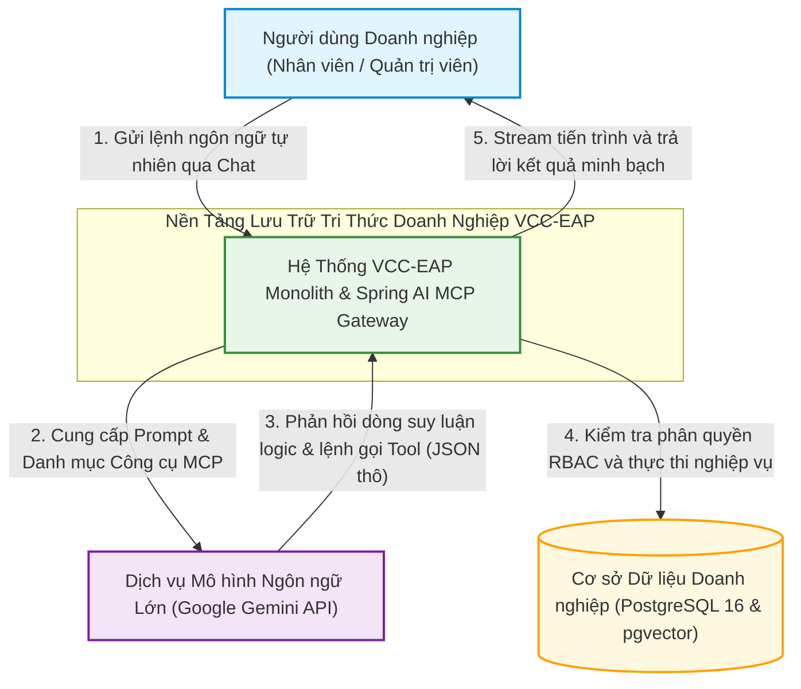
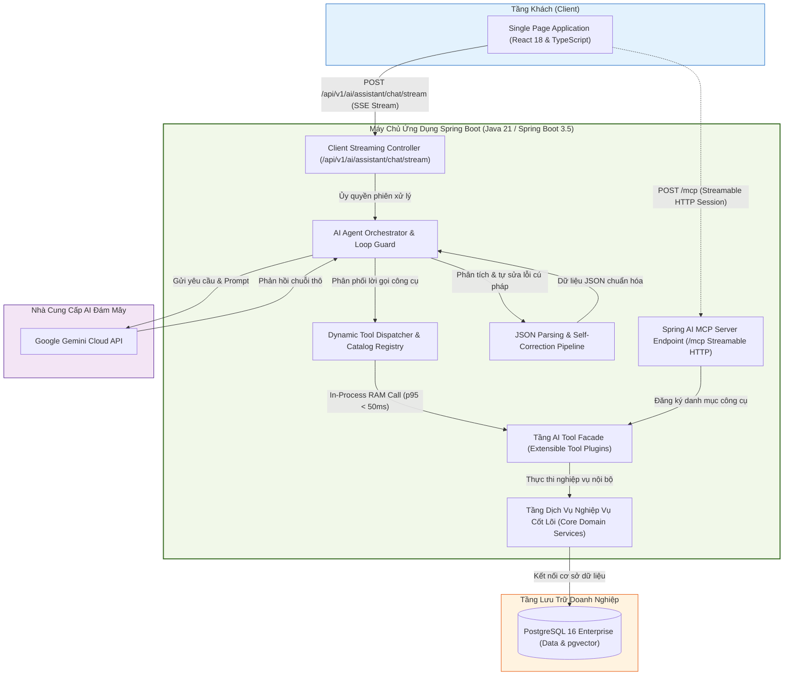
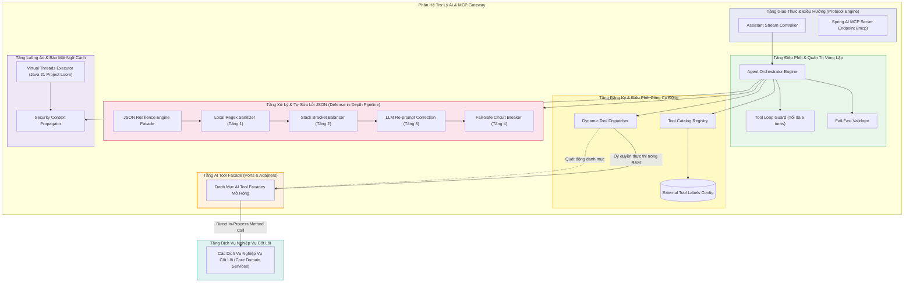
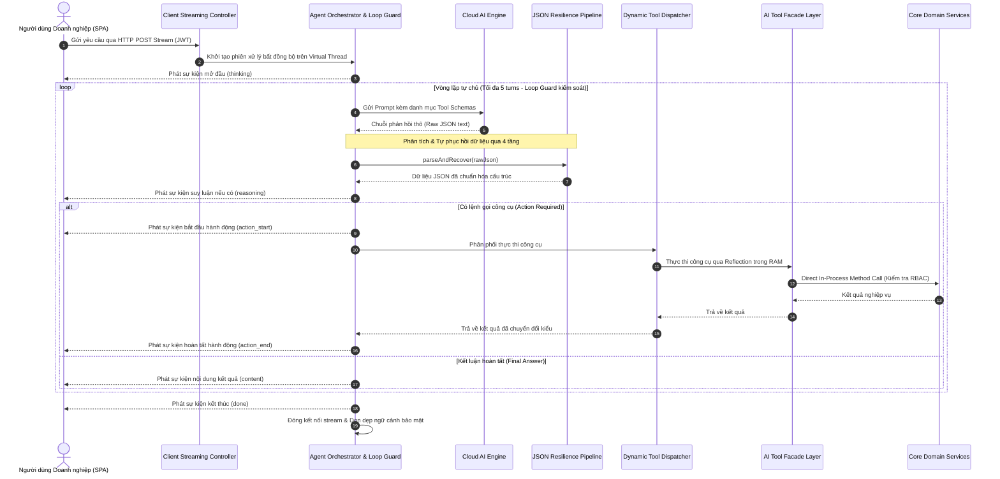

# TÀI LIỆU THIẾT KẾ KIẾN TRÚC (ADD)
**Tuần 6: Phân Hệ Spring AI MCP Server & Trợ Lý Tự Thực Thi Tác Vụ Nghiệp Vụ**

---

## 1. Kiểm Soát Tài Liệu (Document Control)

### 1.1. Thông Tin Tài Liệu
| Thuộc tính | Giá trị |
| :--- | :--- |
| **Tiêu đề Tài liệu** | Tài liệu Thiết kế Kiến trúc Hệ thống - Tuần 6 (ADD-006) |
| **Dự án** | Nền tảng Lưu trữ Tri thức Doanh nghiệp VCC (VCC-EAP) |
| **Phân hệ** | Phân Hệ Trợ Lý AI & Cổng Giao Thức Model Context Protocol (MCP) |
| **Phiên bản** | **2.1 (Đồng bộ theo thực tế triển khai & Chuẩn hóa ranh giới kiến trúc)** |
| **Trạng thái** | **ĐÃ PHÊ DUYỆT (LOCKED & FINALIZED)** |
| **Tác giả** | Senior Software Architect / Solution Architect |
| **Ngày phát hành** | 2026-09-16 |
| **Khung tham chiếu** | **IEEE Std 42010-2011** (Đặc tả Kiến trúc Hệ thống & Phần mềm); **C4 Model** (Context, Container, Component); **Architecture Decision Records (ADRs)**; **Anthropic Model Context Protocol 1.0 (Streamable HTTP Transport)**; **Java 21 (Virtual Threads) & Spring Boot 3.5**. |

### 1.2. Lịch Sử Thay Đổi
| Phiên bản | Ngày | Tác giả | Mô tả Thay đổi |
| :--- | :--- | :--- | :--- |
| 1.0 | 2026-09-10 | Senior Software Architect | Khởi tạo tài liệu Thiết kế Kiến trúc chính thức Tuần 6 (ADD-006). |
| 2.0 | 2026-09-10 | Senior Software Architect | Chuẩn hóa kiến trúc Không lưu trạng thái (Stateless), Client SSE Streaming, Loop Guard 5 turns. |
| **2.1** | **2026-09-16** | **Senior Software Architect** | Đồng bộ theo thực tế triển khai: tái cấu trúc theo phạm vi tuần 6, chuẩn hóa cổng Spring AI MCP Server, điều phối công cụ động, cơ chế phân tích và tự sửa lỗi JSON của LLM, luồng ảo và truyền phát thời gian thực. |

---

## 2. Giới Thiệu & Bối Cảnh Kiến Trúc (Architecture Scope)

### 2.1. Mục Tiêu Kiến Trúc
Tài liệu này xác lập thiết kế kiến trúc hệ thống cấp cao cho phân hệ **Trợ Lý AI Tự Thực Thi Tác Vụ và Cổng Giao Thức Model Context Protocol (MCP)** trong nền tảng VCC-EAP. Phân hệ được thiết kế nhằm đạt được các mục tiêu kiến trúc cốt lõi:
* **Mở rộng năng lực tự chủ (Action-Oriented Assistant)**: Cho phép người dùng tương tác qua ngôn ngữ tự nhiên để kích hoạt trực tiếp các hành động nghiệp vụ trên hệ thống.
* **Chuẩn hóa cổng giao tiếp MCP Server**: Đóng vai trò là một MCP Server tuân thủ đặc tả mở Anthropic Model Context Protocol (MCP 1.0), phơi bày danh mục công cụ nghiệp vụ một cách an toàn cho các tác nhân AI.
* **Độ tin cậy & tự phục hồi dữ liệu từ AI**: Đảm bảo toàn vẹn dữ liệu JSON nhận về từ mô hình AI thông qua đường ống phòng thủ đa tầng (Defense-in-Depth), cam kết tỷ lệ sập tiến trình JVM bằng 0% (Crash Rate = 0%).
* **Tối ưu hóa hiệu năng & độ trễ**: Thực thi công cụ trực tiếp trong bộ nhớ RAM (In-Process Call), tận dụng ưu thế luồng ảo (Java 21 Virtual Threads) để xử lý streaming đồng thời với chi phí tài nguyên tối thiểu.
* **Cưỡng chế an toàn & phân quyền tuyệt đối**: Cưỡng chế phân quyền RBAC tại tầng dịch vụ, kế thừa ngữ cảnh bảo mật từ phiên đăng nhập an toàn, và chốt chặn an toàn tài nguyên (Loop Guard).

### 2.2. Ranh Giới Hệ Thống (Architectural Scope)
* **Thuộc phạm vi thiết kế kiến trúc Tuần 6**:
  1. Cổng giao thức Spring AI MCP Server hỗ trợ Streamable HTTP Transport trên endpoint `/mcp`.
  2. Mẫu kiến trúc AI Tool Facade kết hợp Bộ điều phối công cụ động (Dynamic Tool Dispatcher & Catalog Registry).
  3. Kênh truyền tin Server-Sent Events (SSE) Streaming giữa Client SPA và Agent Orchestrator trên endpoint `/api/v1/ai/assistant/chat/stream`.
  4. Kiến trúc Cơ chế Phân tích & Tự Sửa Lỗi JSON (Multi-tier JSON Parsing & Self-Correction Pipeline) bảo vệ tính sẵn sàng của hệ thống khi tiếp nhận phản hồi từ LLM.
  5. Mô hình xử lý đồng thời dựa trên Java 21 Virtual Threads và sao chép ngữ cảnh bảo mật.
  6. Cơ chế an toàn vận hành: Thất bại sớm dứt khoát (Fail-Fast) và Chốt chặn vòng lặp tự chủ (Tool Loop Guard tối đa 5 turns).
* **Nằm ngoài phạm vi kiến trúc**: Chi tiết mã nguồn từng class, biến nội bộ và các trường dữ liệu DTO chi tiết (thuộc tài liệu Detailed Design).

---

## 3. Mục Tiêu Chất Lượng & Ràng Buộc Kiến Trúc (Quality Attributes & Constraints)

### 3.1. Các Cam Kết Chất Lượng (Quality SLAs)
1. **SLA Độ Trễ (Latency SLAs)**:
   * **Thực thi Nội bộ trong RAM (In-Process Call)**: Thời gian phân giải và thực thi công cụ từ Dispatcher đến tầng Service đạt **p95 dưới 50ms**.
   * **Phát Sự Kiện Đầu Tiên (Time to First Event - TTFE)**: Tín hiệu phản hồi đầu tiên (`event: thinking`) đến Client đạt **p95 dưới 500ms**, triệt tiêu cảm giác chờ đợi thụ động.
   * **Thời Gian Timeout Kênh Stream**: Cấu hình thời gian chờ socket stream ở mức **120 giây** nhằm đảm bảo an toàn cho các tác vụ xâu chuỗi nhiều bước suy luận ngoại vi.
2. **SLA Độ Sẵn Sàng & Tin Cậy Dữ Liệu (Reliability SLA)**: 
   * Tỷ lệ sập tiến trình JVM do lỗi phân tích cú pháp JSON từ LLM đạt **Crash Rate = 0%** nhờ cơ chế phòng vệ 4 lớp.
   * Thời gian xử lý làm sạch cú pháp cục bộ trong RAM tại Tầng 1 và Tầng 2 đạt **p99 dưới 5ms**.
3. **SLA Bảo Mật Hành Động (RBAC 100%)**: 100% các hành động nghiệp vụ nhạy cảm đều được kiểm tra thẩm quyền tại tầng Service; không có kịch bản câu lệnh nào có thể vượt quyền người dùng thực tế.
4. **SLA An Toàn Vận Hành (Resource Safety)**: Số bước gọi công cụ liên tiếp trong cùng một yêu cầu không vượt quá **5 turns**.

### 3.2. Các Ràng Buộc Kiến Trúc Bắt Buộc (Architectural Constraints)
1. **Ràng buộc Thực Thi Trong Bộ Nhớ (In-Process Only)**: Mọi lời gọi từ phân hệ AI xuống dịch vụ nghiệp vụ phải thực hiện trực tiếp trong bộ nhớ RAM JVM, nghiêm cấm gọi vòng lặp lại qua HTTP localhost/loopback.
2. **Ràng buộc Bất Biến Danh Tính (Identity Immutability)**: Định danh và vai trò người dùng bắt buộc phải lấy 100% từ ngữ cảnh xác thực (`SecurityContext`) trong RAM, nghiêm cấm nhận định danh từ nội dung câu lệnh chat.
3. **Ràng buộc Không Lưu Trạng Thái (Stateless Interaction)**: Hệ thống hoạt động theo nguyên tắc Stateless hoàn toàn; không duy trì phiên đàm thoại dở dang trên server. Mỗi request gửi tới endpoint stream là một lượt xử lý độc lập hoàn toàn.

---

## 4. Kiến Trúc Hệ Thống Theo Mô Hình C4 (C4 Architectural Views)

### 4.1. C1 — System Context (Ngữ Cảnh Hệ Thống)



### 4.2. C2 — Container View (Kiến Trúc Container & Phân Định Ranh Giới)



### 4.3. C3 — Component View (Kiến Trúc Thành Phần Phân Hệ Trợ Lý & MCP)



---

## 5. Các Cơ Chế Kiến Trúc Cốt Lõi (Core Architectural Mechanisms)

### 5.1. Khung Phân Phối Công Cụ Động & Mở Rộng (Extensible Dynamic Tool Execution)
* **Tách biệt ranh giới kiến trúc (Ports & Adapters)**: Tầng dịch vụ nghiệp vụ thuần túy giữ nguyên tính độc lập, không bị ô nhiễm bởi các annotation hay thư viện AI. Toàn bộ giao diện công cụ cung cấp cho AI được đóng gói trong tầng AI Tool Facade.
* **Cơ chế phát hiện và phân phối động (Dynamic Discovery & Invocation)**: Thay vì gán cứng các công cụ trong bộ điều phối, kiến trúc sử dụng cơ chế tự động quét danh mục các thành phần công cụ trong Spring Context. Tham số đầu vào được tự động ánh xạ và kiểm tra kiểu dữ liệu một cách linh hoạt.
* **Nguyên lý Mở/Đóng (Open-Closed Principle)**: Khi doanh nghiệp bổ sung thêm các nhóm công cụ nghiệp vụ mới (nhân sự, tài liệu, quản trị phân quyền...), hệ thống tự động nhận diện và cập nhật vào danh mục công cụ mà không cần chỉnh sửa bộ điều phối cốt lõi.

### 5.2. Kiến Trúc Truyền Phát Sự Kiện Thời Gian Thực (Client SSE Streaming Architecture)
* **Kênh truyền Server-Sent Events qua HTTP POST**: Cho phép máy chủ chủ động đẩy các sự kiện tiến trình về máy trạm theo thời gian thực (`/api/v1/ai/assistant/chat/stream`).
* **Truyền phát dòng suy luận logic (Reasoning Streaming)**: Chủ động stream bước tư duy logic (`reasoning`) của mô hình AI về giao diện giúp người dùng theo dõi tiến trình phân tích trước khi hành động được thực thi.
* **Minh chứng dữ liệu minh bạch**: Khi xử lý tra cứu tri thức, sự kiện hoàn tất tự động đính kèm danh sách phân đoạn tài liệu tham chiếu gốc (`chunks`) để hiển thị minh chứng rõ ràng trên giao diện.

### 5.3. Kiến Trúc Phân Tích & Tự Sửa Lỗi JSON Đa Tầng (Defense-in-Depth JSON Resilience Pipeline)
* **Thách thức bản chất của LLM**: Các mô hình ngôn ngữ lớn (LLM) phản hồi chuỗi bán cấu trúc mang tính xác suất, thường xuyên xuất ra định dạng JSON bị bọc bởi các khối markdown (````json ... ````), chứa dấu phẩy thừa, hoặc bị đứt gãy cấu trúc ngoặc nhọn do giới hạn độ dài token.
* **Chiến lược phòng thủ đa tầng (Defense-in-Depth)**: Thay vì dựa vào một parser đơn lẻ dễ gây lỗi gián đoạn hệ thống, phân hệ triển khai đường ống phòng vệ 4 lớp độc lập:
  1. **Tầng 1 (Local Regex Sanitizer)**: Làm sạch nhanh bằng biểu thức chính quy trong RAM (< 1ms). Bóc tách mã Markdown, loại bỏ dấu phẩy thừa trước ngoặc đóng `}` hoặc `]`.
  2. **Tầng 2 (Stack Bracket Balancer)**: Cân bằng ngoặc và khép chuỗi ký tự bằng cấu trúc dữ liệu Stack trong RAM (< 2ms). Tự động bổ sung các dấu ngoặc đóng `{}` và `[]` bị thiếu, khép chuỗi nháy kép dở dang.
  3. **Tầng 3 (LLM Self-Correction Re-prompt)**: Tự động phát hiện lỗi ngữ nghĩa sâu và kích hoạt prompt hiệu chỉnh gửi lại LLM để sửa cấu trúc khi 2 tầng cục bộ không xử lý được.
  4. **Tầng 4 (Fail-Safe Circuit Breaker)**: Chốt chặn an toàn cuối cùng. Nếu cả 3 tầng trên đều thất bại, hệ thống thực hiện ngắt chuỗi an toàn, ném mã lỗi nghiệp vụ rõ ràng, tuyệt đối không để xảy ra crash máy chủ.

### 5.4. Mô Hình Đa Luồng Ảo & Bảo Toàn Ngữ Cảnh Bảo Mật (Virtual Threads Concurrency)
* **Đột phá tài nguyên với Java 21 Virtual Threads**: Chuyển dịch từ Platform Thread Pool truyền thống sang kiến trúc Virtual Threads (Project Loom), cho phép mở hàng nghìn kết nối stream đồng thời với chi phí bộ nhớ tối thiểu.
* **Kế thừa ngữ cảnh bảo mật**: Bọc executor bằng bộ truyền ngữ cảnh chuyên trách (`Security Context Propagator`) để tự động sao chép thông tin xác thực từ luồng Servlet sang Virtual Thread thực thi tác vụ AI.
* **Làm sạch ngữ cảnh tuyệt đối**: Ngữ cảnh bảo mật bắt buộc phải được làm sạch hoàn toàn khi kết thúc chu trình xử lý nhằm ngăn ngừa rò rỉ dữ liệu chéo luồng.

### 5.5. Chuẩn Hóa Cổng Giao Tiếp Anthropic Model Context Protocol (MCP 1.0)
* Nền tảng đóng vai trò là một **MCP Server chuẩn hóa**, mở cổng kết nối theo đặc tả Streamable HTTP Transport trên endpoint `/mcp`.
* Cổng giao thức MCP được tích hợp trực tiếp vào chuỗi kiểm soát phân quyền của nền tảng, hỗ trợ cơ chế quản lý phiên làm việc và chia sẻ tài nguyên an toàn (CORS với exposed header `Mcp-Session-Id`).

### 5.6. Cơ Chế Thất Bại Sớm (Fail-Fast) & Chốt Chặn Vòng Lặp (Tool Loop Guard)
* **Fail-Fast dứt khoát**: Khi thiếu tham số bắt buộc hoặc khi bước tra cứu thông tin phụ trợ trả về rỗng, hệ thống ngắt chuỗi ngay lập tức, không chuyển tiếp dữ liệu rỗng cho AI, ngăn chặn 100% rủi ro AI tự đoán mò mã định danh giả.
* **Chốt chặn vòng lặp (Tool Loop Guard)**: Độc lập kiểm soát số lần gọi công cụ liên tiếp trong cùng một phiên xử lý, chặn cứng tối đa **5 turns**. Nếu phát sinh turn thứ 6, lập tức ngắt chuỗi và trả về cảnh báo an toàn.

---

## 6. Sơ Đồ Tuần Tự Tương Tác Kiến Trúc (Architectural Sequence Flow)



---

## 7. Hồ Sơ Quyết Định Kiến Trúc (Architecture Decision Records - ADRs)

### ADR-006.1: Thực Thi In-Process Trong Bộ Nhớ RAM Trên Nền Java 21 Virtual Threads
* **Bối cảnh**: Phân hệ Trợ lý AI vận hành trong kiến trúc Spring Boot Monolith, cần giải pháp giao tiếp hiệu năng cao và đáp ứng nhiều kết nối stream đồng thời mà không làm cạn kiệt tài nguyên luồng.
* **Quyết định**: Sử dụng Direct In-Process Method Call kết hợp Java 21 Virtual Threads (Project Loom) bọc bởi bộ truyền ngữ cảnh bảo mật.
* **Lý do & Đánh đổi**: Đạt độ trễ tuyệt đối p95 < 50ms; giải phóng socket và connection pool; mở rộng hàng nghìn luồng nhẹ mà không tiêu tốn bộ nhớ OS thread; đánh đổi là phải quản lý dọn dẹp ngữ cảnh an toàn trên luồng ảo.

### ADR-006.2: Khung AI Tool Facade & Điều Phối Công Cụ Tự Động Hoá (Ports & Adapters)
* **Bối cảnh**: Gắn các annotation AI trực tiếp vào tầng dịch vụ nghiệp vụ gây ô nhiễm mã nguồn; ngược lại, ánh xạ thủ công từng công cụ bằng switch/case gây khó khăn khi bổ sung tính năng mới.
* **Quyết định**: Tách riêng tầng AI Tool Facade và xây dựng bộ điều phối động `Dynamic Tool Dispatcher` tự động quét danh mục và ánh xạ tham số qua Reflection.
* **Lý do & Đánh đổi**: Đảm bảo Clean Architecture; tuân thủ nguyên lý Mở/Đóng (Open-Closed Principle); cho phép doanh nghiệp tích hợp thêm công cụ mới mà không cần sửa đổi bộ điều phối cốt lõi.

### ADR-006.3: Chuẩn Hóa Cổng Giao Tiếp Theo Chuẩn Anthropic MCP 1.0 Streamable HTTP
* **Bối cảnh**: Cần một chuẩn giao thức mở để mô hình AI bên ngoài kết nối an toàn với các công cụ nội bộ của doanh nghiệp.
* **Quyết định**: Áp dụng chuẩn Streamable HTTP Transport của Model Context Protocol trên endpoint `/mcp`, tích hợp trực tiếp vào chuỗi bộ lọc bảo mật của Spring Security.
* **Lý do & Đánh đổi**: Tuân thủ đặc tả công nghiệp mở; dễ dàng tương thích với các AI Client và Agent khác; quản lý bảo mật và phiên làm việc tập trung.

### ADR-006.4: Thất Bại Sớm Dứt Khoát (Fail-Fast) & Mô Hình Không Lưu Trạng Thái (Stateless)
* **Bối cảnh**: Khi thiếu dữ liệu hoặc tra cứu thông tin rỗng, việc đàm thoại hỏi lại nhiều vòng làm gia tăng độ trễ và phức tạp hóa việc quản lý phiên trên máy chủ.
* **Quyết định**: Áp dụng nguyên lý Fail-Fast dứt khoát kết hợp thiết kế Stateless hoàn toàn. Thiếu tham số bắt buộc hoặc tra cứu rỗng lập tức dừng xử lý và trả về thông báo lỗi; cấm AI hỏi gợi mở.
* **Lý do & Đánh đổi**: Tiết kiệm chi phí token; triệt tiêu 100% rủi ro AI tự bịa dữ liệu giả; đơn giản hóa kiến trúc backend khi không phải duy trì trạng thái hội thoại.

### ADR-006.5: Kênh Giao Tiếp Client Qua SSE Streaming Kèm Dòng Suy Luận (Reasoning)
* **Bối cảnh**: Quá trình xâu chuỗi công cụ tự chủ tốn từ 3s - 5s khiến giao diện người dùng dễ bị treo tĩnh nếu dùng REST truyền thống.
* **Quyết định**: Sử dụng giao thức Server-Sent Events (SSE) qua HTTP POST để truyền phát liên tục các sự kiện trạng thái, trong đó có dòng tư duy suy luận logic (`reasoning`) và trích dẫn văn bản (`chunks`).
* **Lý do & Đánh đổi**: Time to First Event < 500ms; hiển thị tiến trình minh bạch; đánh đổi là cần quản lý vòng đời kết nối và cơ chế ngắt kết nối an toàn trên máy chủ (timeout 120s).

### ADR-006.6: Chiến Lược Phòng Thủ Đa Tầng Trong Xử Lý & Tự Sửa Lỗi Dữ Liệu JSON Của LLM
* **Bối cảnh**: Phản hồi từ mô hình ngôn ngữ lớn (Google Gemini) là dữ liệu chuỗi không đảm bảo tính toàn vẹn tuyệt đối, thường dính khối mã Markdown, dấu phẩy thừa hoặc bị cắt cụt do giới hạn token. Việc dựa vào các thư viện phân tích cú pháp chuẩn (như Jackson thuần túy) sẽ dẫn đến ngoại lệ `JsonParseException`, gây gián đoạn luồng xử lý và tiềm ẩn nguy cơ lỗi hệ thống.
* **Quyết định**: Áp dụng đường ống phòng vệ 4 lớp (L1 Regex $\rightarrow$ L2 Stack Balancer $\rightarrow$ L3 LLM Re-prompt $\rightarrow$ L4 Fail-Safe Fallback) đóng gói trong `ResilienceEngineFacade`.
* **Lý do & Đánh đổi**:
  - *Hiệu năng cao*: 99% các lỗi định dạng thông thường được sửa đổi ngay tại Lớp 1 và Lớp 2 trực tiếp trong RAM với độ trễ < 5ms, triệt tiêu chi phí gọi lại mạng.
  - *Tự phục hồi thông minh*: Chỉ kích hoạt Lớp 3 (gọi LLM sửa lỗi) khi cú pháp sai lệch nghiêm trọng.
  - *Cam kết an toàn tuyệt đối*: Lớp 4 đóng vai trò cầu chì an toàn (Circuit Breaker), trả về lỗi nghiệp vụ kiểm soát được và đảm bảo tỷ lệ sập máy chủ là 0% (Crash Rate = 0%).

---

## 8. Kế Hoạch Xác Thực Kiến Trúc (Architecture Verification Matrix)

| Mã Kịch Bản | Trọng Tâm Kiến Trúc | Điều Kiện Kích Hoạt | Tiêu Chuẩn Đạt Kỳ Vọng |
| :--- | :--- | :--- | :--- |
| **TC-ARCH-1** | **Ranh Giới AI Facade Độc Lập** | Quét toàn bộ tầng dịch vụ nghiệp vụ cốt lõi trong `com.vccorp.eap.service.*`. | 100% không chứa bất kỳ ràng buộc hoặc annotation nào của Spring AI. |
| **TC-ARCH-2** | **Kế Thừa Ngữ Cảnh Trên Luồng Ảo** | Gửi yêu cầu với JWT token hợp lệ qua kênh streaming. | Virtual Thread thực thi kế thừa nguyên vẹn quyền hạn từ Servlet Thread; dọn dẹp sạch sau khi hoàn tất. |
| **TC-ARCH-3** | **Điều Phối Công Cụ Động** | Kích hoạt công cụ nghiệp vụ thông qua câu lệnh chat tự nhiên. | Dispatcher tự động tìm đúng công cụ trong danh mục và thực thi In-Process thành công trong RAM. |
| **TC-ARCH-4** | **Cơ Chế Thất Bại Sớm (Fail-Fast)** | Gửi yêu cầu thiếu tham số bắt buộc hoặc tra cứu thực thể rỗng. | Hệ thống lập tức dừng tiến trình, không gửi lại cho AI suy luận, trả về lỗi rõ ràng. |
| **TC-ARCH-5** | **Hiệu Năng & Chốt Chặn Vòng Lặp** | Đo đạc độ trễ RAM và thử nghiệm kích hoạt chuỗi vượt quá 5 turn. | Độ trễ In-Process p95 < 50ms; nếu phát sinh turn thứ 6, Tool Loop Guard ngắt chuỗi an toàn. |
| **TC-ARCH-6** | **Streaming Sự Kiện & Dòng Suy Luận** | Tiếp nhận yêu cầu chat qua endpoint SSE stream. | Client nhận đầy đủ và liên tục các sự kiện: thinking, reasoning, action, content (kèm chunks), done. |
| **TC-ARCH-7** | **Cổng Giao Thức MCP Streamable HTTP** | Gửi yêu cầu xác thực tới endpoint `/mcp`. | Phản hồi đúng chuẩn giao thức MCP 1.0, yêu cầu xác thực JWT Bearer token hợp lệ. |
| **TC-ARCH-8** | **Tự Sửa Lỗi Cú Pháp JSON Đa Tầng** | Mô hình AI trả về chuỗi JSON dính markdown fence, dấu phẩy thừa hoặc đứt ngoặc. | Hệ thống tự động làm sạch qua Tầng 1/Tầng 2 trong RAM < 5ms, trích xuất dữ liệu thành công mà không gây crash JVM. |
