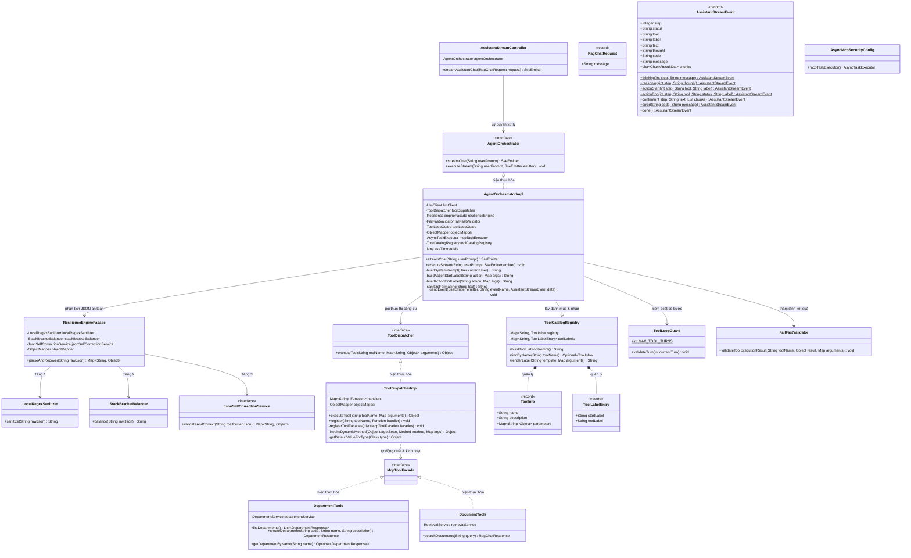
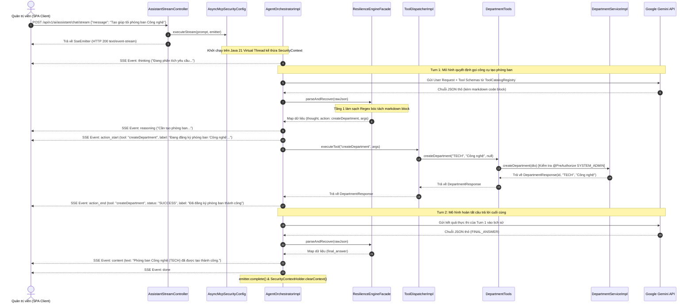
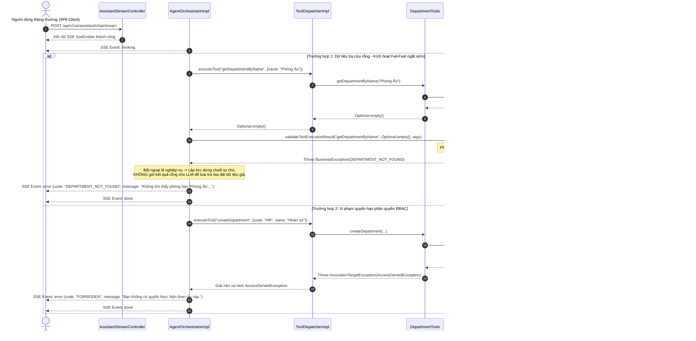

# TÀI LIỆU THIẾT KẾ CHI TIẾT (DETAILED DESIGN DESCRIPTION - DDD)
**Tuần 6: Phân Hệ Spring AI MCP Server & Trợ Lý AI Tự Thực Thi Tác Vụ Nghiệp Vụ**

---

## 1. Thông Tin Tài Liệu & Kiểm Soát (Document Control)

### 1.1. Thông Tin Tài Liệu
| Thuộc tính | Chi tiết tài liệu |
| :--- | :--- |
| **Mã tài liệu** | **DDD-EAP-W6-001** |
| **Tiêu đề Tài liệu** | Tài liệu Thiết kế Chi tiết Phân hệ Spring AI MCP Server & Trợ Lý AI Tự Thực Thi Tác Vụ |
| **Dự án** | Nền tảng Lưu trữ Tri thức Doanh nghiệp VCC (VCC-EAP) |
| **Phân hệ** | Spring AI MCP Server & Agent Orchestrator Subsystem |
| **Phiên bản** | **2.1 (Đồng bộ theo thực tế triển khai)** |
| **Trạng thái** | **ĐÃ PHÊ DUYỆT (LOCKED & FINALIZED)** |
| **Ngày phát hành** | 2026-09-16 |
| **Khung tiêu chuẩn** | **IEEE Std 1016-2009** (Standard for Information Technology — Systems Design — Software Design Descriptions); **C4 Model** (Component View L3 & Code View L4). |
| **Tài liệu tham chiếu** | • [PRD-006 v2.1](./PRD.md): Tài liệu Yêu cầu Sản phẩm Tuần 6.<br/>• [ADD-006 v2.1](./ArchitectureDesign.md): Tài liệu Thiết kế Kiến trúc Hệ thống Tuần 6.<br/>• Model Context Protocol Specification (MCP 1.0 - Streamable HTTP Transport). |

### 1.2. Lịch Sử Sửa Đổi
| Phiên bản | Ngày | Tác giả | Tóm tắt Nội dung Sửa đổi |
| :--- | :--- | :--- | :--- |
| 1.0 | 2026-09-10 | Senior Software Engineer | Khởi tạo tài liệu Thiết kế Chi tiết ban đầu cho Tuần 6. |
| 2.0 | 2026-09-10 | Lead Technical Architect | Chuẩn hóa thiết kế vòng lặp tự chủ, an toàn luồng và xử lý lỗi ngắt sớm. |
| **2.1** | **2026-09-16** | **Lead Technical Architect** | Đồng bộ thiết kế chi tiết theo mã nguồn thực tế: tái cấu trúc theo IEEE 1016 và C4 Level 3/4; hoàn thiện đặc tả bộ điều phối công cụ động, luồng phát trực tiếp sự kiện, cơ chế tự sửa lỗi JSON và mô hình quản lý đa luồng ảo mà không dùng mã nguồn. |

---

## 2. Kiến Trúc Thành Phần C4 Level 3 (Component View - IEEE 1016 Composition Viewpoint)

### 2.1. Phân Rã Thành Phần & Trách Nhiệm (Component Breakdown & Responsibilities)

Phân hệ Tuần 6 bao gồm 9 thành phần logic cốt lõi đảm nhiệm toàn bộ vòng đời tiếp nhận yêu cầu, phân tích ý định, xử lý dữ liệu AI, điều phối công cụ và truyền phát kết quả theo thời gian thực:

1. **`AssistantStreamController` (REST / SSE Interface Component)**:
   - Điểm tiếp nhận yêu cầu duy nhất cho giao diện trợ lý qua `POST /api/v1/ai/assistant/chat/stream`.
   - Khởi tạo kết nối `SseEmitter` với cấu hình thời gian chờ 120 giây (120,000ms), gắn các bộ lắng nghe sự kiện hoàn tất, quá hạn và lỗi mạng.
   - Chuyển giao toàn bộ việc thực thi tác vụ sang bộ điều phối `AgentOrchestrator` trên luồng xử lý riêng biệt.

2. **`AgentOrchestrator` & `AgentOrchestratorImpl` (Autonomous Chaining Orchestrator Component)**:
   - Quản trị vòng lặp đối thoại tự chủ (Autonomous Chaining Loop) theo mô hình ReAct.
   - Tự động tiêm thông tin danh tính người dùng và thời gian thực máy chủ (GMT+7) vào System Prompt.
   - Quản lý trạng thái ngữ cảnh hội thoại, bóc tách dòng suy luận (`thought`), phát hiện ý định gọi công cụ (`action`) hoặc hoàn tất yêu cầu (`FINAL_ANSWER`).
   - Phát các sự kiện tiến trình theo thời gian thực (`thinking`, `reasoning`, `action_start`, `action_end`, `content`, `error`, `done`) qua kênh SSE.

3. **`ToolDispatcher` & `ToolDispatcherImpl` (Dynamic Tool Dispatcher Component)**:
   - Thành phần trung tâm thực hiện nguyên lý Open/Closed (OCP) và Single Responsibility (SRP) trong việc phân phối công cụ.
   - Tự động phát hiện và đăng ký toàn bộ các bean triển khai giao diện `McpToolFacade` trong Spring ApplicationContext mà không cần khai báo tĩnh.
   - Tự động phân giải tham số động (Dynamic Argument Resolution) từ dữ liệu gọi của LLM sang kiểu dữ liệu đích của Java bằng Jackson `ObjectMapper`.
   - Thẩm định tham số bắt buộc (Fail-Fast) dựa trên thuộc tính `required` của chú thích `@McpToolParam`.

4. **`ToolCatalogRegistry` (Tool Metadata & Prompt Generator Component)**:
   - Đọc cấu hình nhãn tiến trình thân thiện từ tệp `mcp-tool-labels.json`.
   - Tự động tổng hợp và sinh tài liệu đặc tả danh mục công cụ (Tool Schemas) bằng tiếng Việt để nhúng vào System Prompt của LLM.
   - Phân giải các biến giữ chỗ (ví dụ: `{{name}}`, `{{code}}`) để hiển thị nhãn tiến trình động tương ứng với dữ liệu đầu vào.

5. **`ResilienceEngineFacade` & Nhóm Xử Lý Cú Pháp JSON (JSON Resilience Pipeline Component)**:
   - Đảm bảo tính toàn vẹn dữ liệu JSON và cam kết Crash Rate = 0% cho máy chủ trước các phản hồi bán cấu trúc từ LLM.
   - Điều phối 4 tầng xử lý: Tầng 1 làm sạch Regex nhanh (`LocalRegexSanitizer`), Tầng 2 cân bằng ngoặc và khép chuỗi (`StackBracketBalancer`), Tầng 3 re-prompt LLM hiệu chỉnh (`JsonSelfCorrectionService`), và Tầng 4 ngắt an toàn (Circuit Breaker).

6. **`McpToolFacade` & Tool Implementations (`DepartmentTools`, `DocumentTools`)**:
   - Giao diện đánh dấu (Marker Interface) đại diện cho các lớp cung cấp công cụ AI.
   - `DepartmentTools`: Cung cấp các tác vụ nghiệp vụ quản trị phòng ban (`listDepartments`, `createDepartment`, `getDepartmentByName`).
   - `DocumentTools`: Cung cấp tác vụ tra cứu tri thức nội bộ và tài liệu RAG (`searchDocuments`).

7. **`ToolLoopGuard` (Loop Guard Mechanism Component)**:
   - Bộ đếm lượt và chốt chặn an toàn nhằm ngăn chặn nguy cơ vòng lặp vô tận (Infinite Loop) hoặc cạn kiệt tài nguyên do mô hình lặp lại thao tác.
   - Ngưỡng giới hạn cố định: Tối đa 5 lượt gọi công cụ liên tiếp (`MAX_TOOL_TURNS = 5`). Nếu vượt quá ngưỡng, hệ thống ngắt chuỗi và ném ngoại lệ nghiệp vụ dứt khoát.

8. **`FailFastValidator` (Fail-Fast Result Validator Component)**:
   - Bộ thẩm định kết quả sau khi thực thi công cụ.
   - Phát hiện các trường hợp kết quả trả về `null` hoặc đối tượng `Optional.empty()` (ví dụ: tìm kiếm phòng ban không tồn tại) để ném mã lỗi dứt khoát (`DEPARTMENT_NOT_FOUND`), lập tức dừng vòng lặp tự chủ nhằm loại trừ nguy cơ ảo giác (Hallucination) từ mô hình ngôn ngữ lớn.

9. **`AsyncMcpSecurityConfig` (Virtual Threads & Security Context Executor Component)**:
   - Cấu hình hạ tầng thực thi bất đồng bộ trên nền tảng Java 21 Virtual Threads (`SimpleAsyncTaskExecutor` với chế độ luồng ảo).
   - Đóng gói bộ thực thi qua `DelegatingSecurityContextAsyncTaskExecutor` để tự động kế thừa thông tin phiên làm việc Spring Security (`SecurityContextHolder`) giữa luồng HTTP tiếp nhận và luồng ảo thực thi tác vụ nền.

---

### 2.2. Cấu Trúc Gói Mã Nguồn (Package Structure)

Cấu trúc các thành phần thuộc phạm vi Tuần 6 được tổ chức phân tầng rõ ràng trong cây thư mục `com.vccorp.eap`:

```
eap/src/main/java/com/vccorp/eap/
├── controller/
│   └── assistant/
│       └── AssistantStreamController.java          // REST/SSE Controller tiếp nhận kết nối
├── dto/
│   ├── assistant/
│   │   └── AssistantStreamEvent.java               // DTO Envelope bao bọc sự kiện SSE stream
│   └── search/
│       ├── RagChatRequest.java                     // DTO tiếp nhận câu hỏi của người dùng
│       └── RagChatResponse.java                    // DTO trả về kết quả tra cứu tài liệu
├── mcp/
│   ├── config/
│   │   └── AsyncMcpSecurityConfig.java             // Cấu hình Virtual Thread & kế thừa SecurityContext
│   ├── orchestrator/
│   │   ├── AgentOrchestrator.java                  // Giao diện điều phối vòng lặp tự chủ
│   │   ├── AgentOrchestratorImpl.java              // Cài đặt điều phối xâu chuỗi ReAct & SSE
│   │   ├── ToolDispatcher.java                     // Giao diện phân phối công cụ động
│   │   ├── ToolDispatcherImpl.java                 // Cài đặt Reflection & Jackson dynamic mapping
│   │   └── ToolLoopGuard.java                      // Bộ đếm bước & chốt chặn tối đa 5 turns
│   ├── registry/
│   │   ├── ToolCatalogRegistry.java                // Đăng ký metadata & sinh prompt danh mục công cụ
│   │   ├── ToolInfo.java                           // Record lưu trữ thông tin công cụ
│   │   └── ToolLabelEntry.java                     // Record cấu hình nhãn hiển thị UI
│   ├── resilience/
│   │   ├── ResilienceEngineFacade.java             // Tầng bọc điều phối 4 cấp phục hồi dữ liệu JSON
│   │   ├── LocalRegexSanitizer.java                // Tầng 1: Xử lý Regex làm sạch nhanh
│   │   ├── StackBracketBalancer.java               // Tầng 2: Cân bằng Stack & Khép chuỗi dở dang
│   │   ├── JsonSelfCorrectionService.java          // Tầng 3: Giao diện gọi LLM sửa lỗi JSON
│   │   └── impl/JsonSelfCorrectionServiceImpl.java // Cài đặt dịch vụ LLM re-prompt sửa lỗi
│   ├── tools/
│   │   ├── McpToolFacade.java                      // Marker interface định danh các AI Tool Facades
│   │   ├── DepartmentTools.java                    // AI Tool Facade cho nghiệp vụ phòng ban
│   │   └── DocumentTools.java                      // AI Tool Facade cho tra cứu tài liệu RAG
│   └── validator/
│       └── FailFastValidator.java                  // Thẩm định kết quả công cụ và ngắt sớm (Fail-Fast)
└── service/
    ├── department/
    │   ├── DepartmentService.java                  // Dịch vụ lõi quản lý phòng ban
    │   └── impl/DepartmentServiceImpl.java         // Triển khai nghiệp vụ phòng ban
    └── search/
        ├── RetrievalService.java                   // Dịch vụ lõi tìm kiếm vector RAG
        └── impl/RetrievalServiceImpl.java          // Triển khai vector search & trích dẫn nguồn
```

---

### 2.3. Sơ Đồ Kiến Trúc Thành Phần (C4 Level 3 Component Diagram)

```mermaid
graph TB
    subgraph ClientLayer["Lớp Client / Giao Diện Người Dùng"]
        UI["Single Page Application (SPA)"]
    end

    subgraph ControllerLayer["Lớp Giao Tiếp API (Controller Layer)"]
        StreamCtrl["AssistantStreamController<br/><i>(REST / SSE Endpoint)</i>"]
    end

    subgraph OrchestrationLayer["Lớp Điều Phối Tự Chủ (Orchestration Layer)"]
        Orchestrator["AgentOrchestratorImpl<br/><i>(ReAct Chaining Loop)</i>"]
        LoopGuard["ToolLoopGuard<br/><i>(Max 5 Turns)</i>"]
        Validator["FailFastValidator<br/><i>(Result Validator)</i>"]
    end

    subgraph ResilienceLayer["Lớp Xử Lý Cú Pháp JSON (JSON Resilience Layer)"]
        ResFacade["ResilienceEngineFacade<br/><i>(4-Tier Resilience Pipeline)</i>"]
        RegexSanitizer["LocalRegexSanitizer (L1)"]
        StackBalancer["StackBracketBalancer (L2)"]
        JsonCorrector["JsonSelfCorrectionService (L3)"]
        
        ResFacade --> RegexSanitizer
        ResFacade --> StackBalancer
        ResFacade --> JsonCorrector
    end

    subgraph DispatcherLayer["Lớp Phân Phối Công Cụ Động (Dispatcher Layer)"]
        Dispatcher["ToolDispatcherImpl<br/><i>(Reflection & Jackson Mapper)</i>"]
        Catalog["ToolCatalogRegistry<br/><i>(Metadata & Labels)</i>"]
    end

    subgraph ToolFacadesLayer["Lớp Công Cụ Nghiệp Vụ (MCP Tool Facades)"]
        DeptTools["DepartmentTools<br/><i>(@McpTool)</i>"]
        DocTools["DocumentTools<br/><i>(@McpTool)</i>"]
    end

    subgraph CoreServicesLayer["Lớp Dịch Vụ Nghiệp Vụ Cốt Lõi (Core Services)"]
        DeptService["DepartmentService / Impl"]
        RetrievalService["RetrievalService / Impl"]
    end

    subgraph InfrastructureLayer["Lớp Hạ Tầng & Bảo Mật (Infrastructure)"]
        TaskExec["AsyncMcpSecurityConfig<br/><i>(Virtual Thread Executor)</i>"]
        SecCtx["SecurityContextHolder<br/><i>(Security Propagation)</i>"]
        LLMClient["LlmClient<br/><i>(External AI Gateway)</i>"]
    end

    UI -->|1. POST /api/v1/ai/assistant/chat/stream| StreamCtrl
    StreamCtrl -->|2. Dispatch async job| TaskExec
    TaskExec -.->|Inherit context| SecCtx
    StreamCtrl -->|3. Return SseEmitter| UI
    TaskExec -->|4. Execute streamChat| Orchestrator
    
    Orchestrator -->|Validate turn <= 5| LoopGuard
    Orchestrator -->|Get tool catalog prompt| Catalog
    Orchestrator -->|Call LLM with tools| LLMClient
    LLMClient -->|Raw string response| Orchestrator
    Orchestrator -->|Parse and sanitize raw JSON| ResFacade
    ResFacade -->|Normalized structured data| Orchestrator
    
    Orchestrator -->|Execute tool dynamically| Dispatcher
    Dispatcher -->|Scan & dynamic invoke| DeptTools
    Dispatcher -->|Scan & dynamic invoke| DocTools
    
    DeptTools -->|Delegate CRUD| DeptService
    DocTools -->|Delegate search| RetrievalService
    
    DeptTools -->|Return result| Dispatcher
    DocTools -->|Return result| Dispatcher
    Dispatcher -->|Return result| Orchestrator
    
    Orchestrator -->|Validate result not empty| Validator
    Orchestrator -->|5. Emit SSE events (thinking, reasoning, action, content, done)| UI
```

---

## 3. Đặc Tả Thiết Kế Lớp C4 Level 4 (Code View - IEEE 1016 Logical Viewpoint)

### 3.1. Sơ Đồ Lớp Chi Tiết (Detailed UML Class Diagram)



---

### 3.2. Bảng Đặc Tả Chi Tiết Các Lớp (Detailed Class Specifications)

#### 1. Lớp `AssistantStreamController`
* **Gói định danh**: `com.vccorp.eap.controller.assistant`
* **Stereotype**: REST Controller (`@RestController`, `@RequestMapping("/api/v1/ai/assistant")`)
* **Mục tiêu**: Điểm giao tiếp HTTP tiếp nhận yêu cầu từ SPA, tạo kết nối Server-Sent Events và uỷ quyền xử lý cho `AgentOrchestrator`.

| Thành phần | Tên | Kiểu dữ liệu / Chữ ký | Ràng buộc Thiết kế & Mô tả |
| :--- | :--- | :--- | :--- |
| **Thuộc tính** | `agentOrchestrator` | `AgentOrchestrator` | Private final, tiêm phụ thuộc bắt buộc qua constructor. |
| **Phương thức** | `streamAssistantChat` | `+ streamAssistantChat(RagChatRequest request): SseEmitter` | Tiếp nhận `POST /chat/stream`. Kiểm tra hợp lệ dữ liệu `@Valid`. Khởi tạo và trả về đối tượng `SseEmitter` kết nối với client. |

---

#### 2. Cấu Trúc DTO `RagChatRequest` & `AssistantStreamEvent`
* **Gói định danh**: `com.vccorp.eap.dto.search` & `com.vccorp.eap.dto.assistant`
* **Stereotype**: Immutable Java 21 Record, cấu hình `@JsonInclude(NON_NULL)` loại bỏ các trường null khi serialize.

| Tên DTO | Thuộc tính chính | Phương thức tĩnh | Ràng buộc & Đặc tả Dữ liệu |
| :--- | :--- | :--- | :--- |
| **`RagChatRequest`** | `String message` | - | Ràng buộc `@NotBlank`. Chứa văn bản câu lệnh tự nhiên của người dùng. |
| **`AssistantStreamEvent`** | `Integer step`, `String status`, `String tool`, `String label`, `String text`, `String thought`, `String code`, `String message`, `List<ChunkResultDto> chunks` | • `thinking(step, message)`<br/>• `reasoning(step, thought)`<br/>• `actionStart(step, tool, label)`<br/>• `actionEnd(step, tool, status, label)`<br/>• `content(step, text, chunks)`<br/>• `error(code, message)`<br/>• `done()` | Đóng vai trò là Envelope chuẩn hóa cho mọi gói tin phát qua SSE stream. Mỗi factory method tạo cấu trúc sự kiện tương ứng với từng giai đoạn xử lý. |

---

#### 3. Lớp `AgentOrchestratorImpl`
* **Gói định danh**: `com.vccorp.eap.mcp.orchestrator`
* **Stereotype**: Service Component (`@Service`, triển khai `AgentOrchestrator`)
* **Mục tiêu**: Điều phối vòng lặp đối thoại tự chủ ReAct, quản lý trạng thái luồng stream, phát sự kiện và uỷ quyền thực thi công cụ.

| Thành phần | Tên | Kiểu dữ liệu | Ràng buộc Thiết kế & Mô tả |
| :--- | :--- | :--- | :--- |
| **Thuộc tính** | `llmClient` | `LlmClient` | Gateway gọi API mô hình ngôn ngữ lớn ngoài mạng (Google Gemini). |
| | `toolDispatcher` | `ToolDispatcher` | Bộ điều phối công cụ động (tuân thủ OCP). |
| | `resilienceEngine` | `ResilienceEngineFacade` | Bộ phân tích cú pháp và tự sửa lỗi JSON 4 tầng. |
| | `failFastValidator` | `FailFastValidator` | Bộ thẩm định ngắt sớm dữ liệu rỗng. |
| | `toolLoopGuard` | `ToolLoopGuard` | Chốt chặn kiểm soát số lượt tối đa 5 turns. |
| | `objectMapper` | `ObjectMapper` | Chuyển đổi dữ liệu JSON sang cấu trúc đối tượng. |
| | `mcpTaskExecutor` | `AsyncTaskExecutor` | Bean điều phối luồng bất đồng bộ trên Virtual Threads. |
| | `toolCatalogRegistry` | `ToolCatalogRegistry` | Nạp metadata và tạo prompt danh mục công cụ. |
| | `sseTimeoutMs` | `long` | Thời gian chờ tối đa của kết nối stream (mặc định 120,000ms). |
| **Phương thức** | `streamChat` | `+ streamChat(String userPrompt): SseEmitter` | Tạo `SseEmitter(sseTimeoutMs)`, đăng ký các callbacks timeout/completion/error, đẩy tác vụ vào `mcpTaskExecutor`. |
| | `executeStream` | `+ executeStream(String userPrompt, SseEmitter emitter): void` | Khởi chạy luồng suy luận tự chủ: gửi thinking event $\rightarrow$ lặp qua các turns $\rightarrow$ gọi LLM $\rightarrow$ phục hồi JSON $\rightarrow$ phát reasoning $\rightarrow$ gọi tool qua dispatcher $\rightarrow$ phát action $\rightarrow$ phát content $\rightarrow$ phát done. |
| | `buildSystemPrompt` | `- buildSystemPrompt(User currentUser): String` | Tiêm danh tính người dùng hiện tại, thời gian máy chủ (GMT+7) và danh mục công cụ động từ `ToolCatalogRegistry`. |
| | `sanitizeFormatting` | `- sanitizeFormatting(String text): String` | Chuẩn hóa các ký tự xuống dòng và khoảng trắng thừa trước khi gửi nội dung kết quả về client. |

---

#### 4. Nhóm Lớp Phân Tích & Tự Sửa Lỗi JSON Của LLM (`com.vccorp.eap.mcp.resilience`)
* **Stereotype**: Components chịu trách nhiệm làm sạch và tái cấu trúc chuỗi JSON từ LLM trước khi parse.

| Lớp | Thuộc tính chính | Phương thức cốt lõi | Trách nhiệm Kỹ thuật |
| :--- | :--- | :--- | :--- |
| **`ResilienceEngineFacade`** | `localRegexSanitizer`, `stackBracketBalancer`, `jsonSelfCorrectionService`, `objectMapper` | `+ parseAndRecover(String rawJson): Map<String, Object>` | Điều phối tuần tự qua 4 tầng: L1 Regex $\rightarrow$ L2 Stack Balancer $\rightarrow$ L3 LLM Re-prompt $\rightarrow$ L4 Ngắt an toàn ném ngoại lệ nghiệp vụ. |
| **`LocalRegexSanitizer`** | - | `+ sanitize(String rawJson): String` | Loại bỏ các thẻ code block Markdown, bóc tách dấu phẩy thừa trước dấu đóng ngoặc. Độ trễ < 1ms. |
| **`StackBracketBalancer`** | - | `+ balance(String rawJson): String` | Sử dụng ngăn xếp duyệt chuỗi, bù dấu đóng ngoặc nhọn hoặc ngoặc vuông còn thiếu, khép chuỗi nháy kép dở dang. Độ trễ < 2ms. |
| **`JsonSelfCorrectionService`** | `llmClient`, `objectMapper` | `+ validateAndCorrect(String malformedJson): Map<String, Object>` | Gửi prompt chuyên biệt yêu cầu LLM sửa lại cú pháp JSON khi 2 tầng cục bộ không xử lý được. |

---

#### 5. Lớp `ToolDispatcherImpl`
* **Gói định danh**: `com.vccorp.eap.mcp.orchestrator`
* **Stereotype**: Service Component (`@Service`, triển khai `ToolDispatcher`)
* **Mục tiêu**: Tự động quét và đăng ký mọi công cụ nghiệp vụ từ các bean `McpToolFacade`, ánh xạ tham số động bằng Reflection & Jackson, thẩm định Fail-Fast tham số bắt buộc.

| Thành phần | Tên | Kiểu dữ liệu / Chữ ký | Ràng buộc Thiết kế & Mô tả |
| :--- | :--- | :--- | :--- |
| **Thuộc tính** | `handlers` | `Map<String, Function<Map<String, Object>, Object>>` | Bộ nhớ đệm ConcurrentHashMap lưu trữ các hàm thực thi công cụ theo tên viết thường. |
| | `objectMapper` | `ObjectMapper` | Tiện ích chuyển đổi kiểu dữ liệu động của Jackson. |
| | `PARAM_NAME_DISCOVERER` | `ParameterNameDiscoverer` | Đối tượng Spring phát hiện tên tham số phương thức Java. |
| **Phương thức** | `registerToolFacades` | `- registerToolFacades(List<McpToolFacade> toolFacades): void` | Quét danh sách facades, trích xuất metadata từ `@McpTool` và đăng ký vào bảng tra cứu `handlers`. |
| | `executeTool` | `+ executeTool(String toolName, Map<String, Object> arguments): Object` | Tìm kiếm công cụ không phân biệt hoa thường. Ném `ERR_INVALID_REQUEST` nếu không tìm thấy. |
| | `invokeDynamicMethod` | `- invokeDynamicMethod(Object targetBean, Method method, Map<String, Object> args): Object` | Phân giải mảng tham số động, kiểm tra cờ `required` của `@McpToolParam`, ép kiểu qua `objectMapper`, kích hoạt phương thức qua Reflection và giải nén ngoại lệ nguyên bản `InvocationTargetException`. |

---

#### 6. Lớp `ToolCatalogRegistry`
* **Gói định danh**: `com.vccorp.eap.mcp.registry`
* **Stereotype**: Spring Component (`@Component`)
* **Mục tiêu**: Quản lý metadata công cụ và nạp nhãn hiển thị từ `mcp-tool-labels.json`.

| Thành phần | Tên | Kiểu dữ liệu / Chữ ký | Ràng buộc Thiết kế & Mô tả |
| :--- | :--- | :--- | :--- |
| **Thuộc tính** | `registry` | `Map<String, ToolInfo>` | Lưu trữ thông tin metadata danh mục công cụ. |
| | `toolLabels` | `Map<String, ToolLabelEntry>` | Lưu cấu hình nhãn giao diện nạp từ tệp JSON cấu hình ngoài. |
| **Phương thức** | `buildToolListForPrompt` | `+ buildToolListForPrompt(): String` | Tổng hợp danh sách công cụ và tham số thành chuỗi văn bản tiếng Việt cho System Prompt. |
| | `findByName` | `+ findByName(String toolName): Optional<ToolInfo>` | Tra cứu thông tin chi tiết của công cụ theo tên. |
| | `renderLabel` | `+ renderLabel(String template, Map<String, Object> arguments): String` | Điền giá trị thực tế vào các biến giữ chỗ `{{key}}` trên nhãn tiến trình giao diện. |

---

#### 7. Các Lớp Công Cụ Nghiệp Vụ (`DepartmentTools` & `DocumentTools`)
* **Gói định danh**: `com.vccorp.eap.mcp.tools`
* **Stereotype**: Spring Component (`@Component`, triển khai `McpToolFacade`)
* **Mục tiêu**: Đóng gói các dịch vụ lõi (`DepartmentService`, `RetrievalService`) thành các công cụ AI có chú thích chuẩn `@McpTool`.

| Lớp | Phương thức công cụ | Chú thích & Tham số | Nghiệp vụ thực thi |
| :--- | :--- | :--- | :--- |
| **`DepartmentTools`** | `listDepartments()` | `@McpTool(name = "listDepartments")` | Gọi `departmentService.getAllDepartments()`. Yêu cầu quyền đọc cơ bản. |
| | `createDepartment(...)` | `@McpTool(name = "createDepartment")`<br/>• `code`: `@McpToolParam(required = true)`<br/>• `name`: `@McpToolParam(required = true)`<br/>• `description`: `@McpToolParam(required = false)` | Gọi `departmentService.createDepartment(dto)`. Được bảo vệ bởi `@PreAuthorize("hasRole('SYSTEM_ADMIN')")`. |
| | `getDepartmentByName(...)` | `@McpTool(name = "getDepartmentByName")`<br/>• `name`: `@McpToolParam(required = true)` | Gọi `departmentService.getDepartmentByName(name)`. Trả về `Optional<DepartmentResponse>`. |
| **`DocumentTools`** | `searchDocuments(...)` | `@McpTool(name = "searchDocuments")`<br/>• `query`: `@McpToolParam(required = true)` | Gọi `retrievalService.searchDocuments(user, query)`. Tự động áp dụng bộ lọc phân quyền tài liệu theo người dùng hiện tại. |

---

#### 8. Lớp `ToolLoopGuard` & `FailFastValidator`
* **Gói định danh**: `com.vccorp.eap.mcp.orchestrator` & `com.vccorp.eap.mcp.validator`
* **Stereotype**: Spring Component (`@Component`)

| Lớp | Phương thức chính | Tham số | Hành vi & Mã lỗi |
| :--- | :--- | :--- | :--- |
| **`ToolLoopGuard`** | `validateTurn` | `int currentTurn` | Nếu `currentTurn > 5` $\rightarrow$ ném ngay `BusinessException(ErrorCode.ERR_INVALID_REQUEST, "Vượt quá giới hạn an toàn...")`. |
| **`FailFastValidator`** | `validateToolExecutionResult` | `String toolName`, `Object result`, `Map arguments` | Nếu kết quả `null` hoặc `Optional.isEmpty()` $\rightarrow$ trích xuất tên đối tượng và ném dứt khoát `BusinessException(ErrorCode.DEPARTMENT_NOT_FOUND, ...)`. Ngắt ngay chuỗi suy luận. |

---

#### 9. Lớp `AsyncMcpSecurityConfig`
* **Gói định danh**: `com.vccorp.eap.mcp.config`
* **Stereotype**: Configuration Class (`@Configuration`)

| Thành phần | Tên | Kiểu trả về | Ràng buộc triển khai |
| :--- | :--- | :--- | :--- |
| **Bean** | `mcpTaskExecutor` | `AsyncTaskExecutor` | Khởi tạo `SimpleAsyncTaskExecutor` với chế độ luồng ảo (`Virtual Threads = true`). Bọc ngoài bởi `DelegatingSecurityContextAsyncTaskExecutor` để tự động kế thừa bối cảnh bảo mật Spring Security. |

---

## 4. Hợp Đồng Giao Diện & Dữ Liệu (Interface & Data Contracts - IEEE 1016 Interface Viewpoint)

### 4.1. Hợp Đồng Kênh Dòng Sự Kiện SSE (`/api/v1/ai/assistant/chat/stream`)
* **Endpoint tiếp nhận**: `POST /api/v1/ai/assistant/chat/stream`
* **Giao thức truyền tải**: HTTP/1.1 qua chuẩn `text/event-stream` (Server-Sent Events)
* **Tiêu đề bắt buộc**:
  - `Authorization: Bearer <JWT_ACCESS_TOKEN>`
  - `Content-Type: application/json`
  - `Accept: text/event-stream`
* **Thời gian chờ kết nối (Timeout)**: 120,000 ms (2 phút).

#### Bảng Quy Chuẩn 7 Loại Sự Kiện Dòng SSE
Mỗi gói tin SSE gửi về client có cấu trúc tiêu chuẩn:
- Trường `event`: Tên sự kiện (ví dụ: `thinking`, `reasoning`, `action_start`, `action_end`, `content`, `error`, `done`).
- Trường `data`: Chuỗi JSON định dạng theo DTO `AssistantStreamEvent`.

| Tên Sự Kiện | Cấu Trúc Dữ Liệu JSON Chuẩn Mẫu (`data`) | Ý Nghĩa Kỹ Thuật & Hành Vi Giao Diện Người Dùng |
| :--- | :--- | :--- |
| **`thinking`** | `{"step":0,"status":"REASONING","message":"Đang phân tích yêu cầu..."}` | Sự kiện đầu tiên phát ngay khi nhận request (SLA TTFE < 500ms). UI hiển thị trạng thái đang xử lý ban đầu. |
| **`reasoning`** | `{"step":1,"status":"REASONING","thought":"Cần kiểm tra xem phòng ban đã tồn tại hay chưa."}` | Dòng suy luận nội tâm của AI. UI hiển thị trong bảng điều khiển suy luận (Reasoning Panel) để minh bạch quy trình tư duy. |
| **`action_start`** | `{"step":1,"status":"CALLING_TOOL","tool":"createDepartment","label":"Đang đăng ký phòng ban 'Ban Công nghệ'..."}` | Báo hiệu bắt đầu thực thi một công cụ nghiệp vụ. UI hiển thị badge công cụ với biểu tượng xoay tiến trình. |
| **`action_end`** | `{"step":1,"status":"SUCCESS","tool":"createDepartment","label":"Đã đăng ký phòng ban thành công"}` | Báo hiệu công cụ đã thực thi xong và có kết quả hợp lệ. UI chuyển badge sang trạng thái hoàn tất thành công. |
| **`content`** | `{"step":2,"status":"COMPLETED","text":"Đã tạo thành công phòng ban Ban Công nghệ.","chunks":[...]}` | Nội dung câu trả lời cuối cùng từ AI sau khi đã làm sạch định dạng. Kèm theo danh sách `chunks` trích dẫn tài liệu nếu có. |
| **`error`** | `{"status":"ERROR","code":"DEPARTMENT_NOT_FOUND","message":"Không tìm thấy phòng ban 'Kinh doanh'..."}` | Báo cáo sự cố hoặc lỗi ngắt sớm Fail-Fast dứt khoát. UI hiển thị thông báo lỗi màu đỏ rõ ràng, không bịa đặt nội dung. |
| **`done`** | `{"status":"FINISHED"}` | Đóng dòng truyền phát. Client đóng kết nối socket, hoàn tất tác vụ và mở lại thanh nhập liệu. |

---

### 4.2. Đặc Tả Schema Công Cụ Chuẩn MCP 1.0 (MCP Tool Schemas)

Các công cụ nghiệp vụ được tự động công khai qua kênh Streamable HTTP Transport `/mcp` theo định dạng JSON Schema của đặc tả Model Context Protocol:

#### 1. Schema `listDepartments`
```json
{
  "name": "listDepartments",
  "description": "Lấy toàn bộ danh sách các phòng ban đang hoạt động trong công ty.",
  "parameters": {
    "type": "object",
    "properties": {}
  }
}
```

#### 2. Schema `createDepartment`
```json
{
  "name": "createDepartment",
  "description": "Đăng ký (tạo mới) một phòng ban trong hệ thống EAP. Yêu cầu quyền Quản trị viên hệ thống (SYSTEM_ADMIN).",
  "parameters": {
    "type": "object",
    "properties": {
      "code": {
        "type": "string",
        "description": "Mã định danh viết tắt của phòng ban, viết HOA, không dấu tiếng Việt (ví dụ: TECH, HR, MKT)."
      },
      "name": {
        "type": "string",
        "description": "Tên phòng ban đầy đủ bằng tiếng Việt có dấu (ví dụ: 'Công nghệ', 'Nhân sự')."
      },
      "description": {
        "type": "string",
        "description": "Mô tả chức năng nhiệm vụ của phòng ban."
      }
    },
    "required": ["code", "name"]
  }
}
```

#### 3. Schema `getDepartmentByName`
```json
{
  "name": "getDepartmentByName",
  "description": "Tìm kiếm thông tin chi tiết và mã định danh UUID của một phòng ban theo tên gọi tiếng Việt. Trả về Optional rỗng nếu không tìm thấy.",
  "parameters": {
    "type": "object",
    "properties": {
      "name": {
        "type": "string",
        "description": "Tên phòng ban cần tra cứu thông tin (ví dụ: 'Nhân sự', 'Công nghệ')."
      }
    },
    "required": ["name"]
  }
}
```

#### 4. Schema `searchDocuments`
```json
{
  "name": "searchDocuments",
  "description": "Tìm kiếm thông tin từ kho tài liệu và tri thức nội bộ của hệ thống. Sử dụng công cụ này khi cần tra cứu tài liệu nghiệp vụ để trả lời người dùng.",
  "parameters": {
    "type": "object",
    "properties": {
      "query": {
        "type": "string",
        "description": "Câu hỏi hoặc từ khóa tìm kiếm tài liệu."
      }
    },
    "required": ["query"]
  }
}
```

---

## 5. Thiết Kế Quy Trình Động (Dynamic Behavioral Design - IEEE 1016 Interaction Viewpoint)

### 5.1. Sơ Đồ Tuần Tự 1: Thực Thi Công Cụ Tự Chủ Kèm Dòng Suy Luận & Phục Hồi Dữ Liệu
Mô tả kịch bản Người dùng có quyền Quản trị viên (`ROLE_SYSTEM_ADMIN`) yêu cầu tạo phòng ban mới:



---

### 5.2. Sơ Đồ Tuần Tự 2: Xử Lý Lỗi Ngắt Sớm (Fail-Fast) & Vi Phạm Phân Quyền (RBAC Rejection)



---

## 6. Đặc Tả Thuật Toán & Logic Thủ Tục (Procedural Logic - IEEE 1016 Procedural Viewpoint)

Theo tiêu chuẩn IEEE Std 1016-2009, các thuật toán và quy trình xử lý được đặc tả hình thức dưới dạng các bảng mô tả logic thủ tục theo từng bước (Step-by-Step Procedural Specification), nêu rõ tiền điều kiện, tham số vào/ra, quy tắc rẽ nhánh và hậu điều kiện.

### 6.1. Quy Trình Phân Phối & Phân Giải Tham Số Động (`ToolDispatcherImpl`)

* **Mục tiêu**: Tự động chuyển đổi bản đồ tham số `Map<String, Object>` nhận được từ mô hình ngôn ngữ lớn sang mảng đối số có kiểu dữ liệu phù hợp của phương thức Java và thực thi an toàn qua Reflection.

| Thuộc tính Quy trình | Đặc tả Chi tiết |
| :--- | :--- |
| **Tiền điều kiện** | Tên công cụ mục tiêu tồn tại trong bảng đăng ký `handlers`; Bean mục tiêu đã được quản lý trong ApplicationContext. |
| **Dữ liệu đầu vào** | `String toolName`: Tên công cụ cần thực thi.<br/>`Map<String, Object> arguments`: Bản đồ các tham số trích xuất từ phản hồi của LLM. |
| **Dữ liệu đầu ra** | `Object`: Kết quả thực thi phương thức nghiệp vụ từ tầng công cụ (Tool Facade). |
| **Các bước thực thi logic tuần tự** | **Bước 1**: Chuẩn hóa `toolName` về dạng viết thường (`toLowerCase`) và tra cứu hàm xử lý trong `handlers`. Nếu không tồn tại, ném ngoại lệ `BusinessException(ERR_INVALID_REQUEST)`.<br/>**Bước 2**: Lấy danh sách đối tượng `Parameter` và mảng tên tham số từ phương thức Java thông qua `DefaultParameterNameDiscoverer`. Khởi tạo mảng đối số kết quả `resolvedArgs` với kích thước tương ứng.<br/>**Bước 3**: Duyệt qua từng tham số phương thức theo thứ tự:<br/>- Xác định tên tham số và kiểm tra chú thích `@McpToolParam`. Nếu chú thích vắng mặt hoặc có thuộc tính `required = true`, tham số được đánh dấu là bắt buộc.<br/>- Trích xuất giá trị thô từ bản đồ đầu vào theo tên tham số.<br/>- Áp dụng quy tắc dự phòng (Fallback): Nếu giá trị thô là `null`, tên tham số là `query` và đầu vào chứa khóa `message`, gán giá trị của `message` cho giá trị thô.<br/>- **Kiểm tra Thất bại sớm (Fail-Fast)**: Nếu tham số là bắt buộc và giá trị thô là `null` hoặc chuỗi rỗng sau khi cắt khoảng trắng (`trim().isEmpty()`), lập tức ném ngoại lệ `BusinessException(ERR_INVALID_REQUEST)` kèm mô tả tham số bị thiếu.<br/>- **Chuyển đổi kiểu dữ liệu**: Nếu giá trị thô tồn tại, sử dụng Jackson `ObjectMapper.convertValue` để ép kiểu sang kiểu dữ liệu đích của tham số. Nếu ép kiểu thất bại, ném ngoại lệ `ERR_INVALID_REQUEST`. Nếu giá trị thô là `null`, gán giá trị mặc định tương ứng với kiểu nguyên thủy hoặc `null` cho kiểu đối tượng.<br/>**Bước 4**: Thiết lập quyền truy cập phương thức (`setAccessible(true)`) và kích hoạt phương thức trên bean đối tượng với mảng `resolvedArgs`.<br/>**Bước 5**: Bắt ngoại lệ `InvocationTargetException`. Trích xuất nguyên nhân gốc (`getCause`). Nếu nguyên nhân là `BusinessException` hoặc `RuntimeException`, trực tiếp ném lại ngoại lệ đó để bảo toàn mã lỗi nghiệp vụ gốc. Ngược lại, đóng gói vào `BusinessException(ERR_SYSTEM_ERROR)`. |
| **Hậu điều kiện** | Phương thức nghiệp vụ được thực thi thành công; kết quả trả về được chuyển tiếp nguyên vẹn cho bộ điều phối. |

---

### 6.2. Quy Trình Vòng Lặp Xâu Chuỗi Tự Chủ & Chốt Chặn Vòng Lặp (`AgentOrchestratorImpl`)

* **Mục tiêu**: Điều phối tương tác đa bước giữa người dùng, LLM và các công cụ nội bộ, duy trì chốt chặn an toàn tài nguyên tối đa 5 bước.

| Thuộc tính Quy trình | Đặc tả Chi tiết |
| :--- | :--- |
| **Tiền điều kiện** | Yêu cầu `userPrompt` hợp lệ; người dùng đã được xác thực danh tính qua Security Context. |
| **Dữ liệu đầu vào** | `String userPrompt`: Câu lệnh của người dùng.<br/>`SseEmitter emitter`: Kênh kết nối dòng sự kiện Server-Sent Events với máy trạm. |
| **Dữ liệu đầu ra** | Chuỗi các sự kiện SSE được phát liên tục tới client cho đến khi hoàn tất hoặc phát sinh lỗi. |
| **Các bước thực thi logic tuần tự** | **Bước 1**: Lấy thông tin người dùng hiện tại từ `SecurityContextHelper`. Khởi tạo biến đếm lượt `turn = 1`, danh sách trích dẫn `lastSearchChunks = null`, và chuỗi lịch sử đàm thoại ban đầu.<br/>**Bước 2**: Phát ngay lập tức sự kiện `thinking` qua `emitter` với bước 0 để đáp ứng cam kết độ trễ TTFE < 500ms.<br/>**Bước 3**: Tạo System Prompt thông qua `ToolCatalogRegistry`, tiêm định danh người dùng và thời gian thực máy chủ (GMT+7).<br/>**Bước 4**: Bắt đầu vòng lặp vô hạn điều phối:<br/>- **Kiểm tra Chốt chặn vòng lặp (Loop Guard)**: Gọi `toolLoopGuard.validateTurn(turn)`. Nếu `turn > 5`, ném ngay `BusinessException(ERR_INVALID_REQUEST)` ngắt vòng lặp.<br/>- Tổng hợp prompt kèm yêu cầu định dạng JSON và gọi `LlmClient` với thời gian chờ 25 giây.<br/>- Đưa chuỗi thô nhận được từ LLM qua `resilienceEngine.parseAndRecover` để làm sạch cú pháp và bóc tách dữ liệu có cấu trúc.<br/>- Trích xuất trường suy luận (`thought`). Nếu tồn tại, phát sự kiện `reasoning` qua kênh stream.<br/>- Trích xuất trường hành động (`action`) và dữ liệu đầu vào của hành động (`action_input`).<br/>- **Kiểm tra điều kiện dừng**: Nếu `action` là `null` hoặc bằng `FINAL_ANSWER`: Trích xuất nội dung trả lời cuối cùng, làm sạch định dạng qua `sanitizeFormatting`, phát sự kiện `content` (đính kèm `lastSearchChunks` nếu có), phát sự kiện `done`, gọi `emitter.complete()` và kết thúc phương thức.<br/>- **Xử lý gọi công cụ**: Tạo nhãn tiến trình bắt đầu từ `ToolCatalogRegistry` và phát sự kiện `action_start`.<br/>- Kích hoạt thực thi công cụ qua `toolDispatcher.executeTool(action, actionInput)`. Nếu kết quả là `RagChatResponse`, lưu lại danh sách `chunks`.<br/>- **Thẩm định kết quả (Fail-Fast)**: Gọi `failFastValidator.validateToolExecutionResult`. Nếu dữ liệu rỗng, ném lỗi ngắt chuỗi ngay lập tức.<br/>- Tạo nhãn tiến trình hoàn tất và phát sự kiện `action_end` với trạng thái `SUCCESS`.<br/>- Bổ sung hành động và kết quả vào lịch sử đàm thoại, tăng `turn = turn + 1` và chuyển sang vòng lặp kế tiếp. |
| **Xử lý sự cố** | Bắt toàn bộ `BusinessException` hoặc `Exception`. Phát sự kiện `error` chứa mã lỗi và thông điệp rõ ràng, phát sự kiện `done`, gọi `emitter.complete()` và dọn dẹp sạch Security Context. |
| **Hậu điều kiện** | Toàn bộ các bước được ghi nhận vào nhật ký; kênh stream được đóng an toàn; tài nguyên được giải phóng hoàn toàn. |

---

### 6.3. Quy Trình Phân Tích & Tự Sửa Lỗi JSON Đa Tầng (`ResilienceEngineFacade`)

* **Mục tiêu**: Đảm bảo toàn vẹn dữ liệu JSON từ LLM qua đường ống 4 lớp phòng thủ, loại bỏ nguy cơ sập tiến trình máy chủ.

| Tầng Xử Lý | Tên Thành Phần | Tiền điều kiện & Dữ liệu vào | Logic Xử lý & Quy tắc Chuyển tầng | Dữ liệu ra & Xử lý Ngoại lệ |
| :--- | :--- | :--- | :--- | :--- |
| **Tầng 1** (Local Regex) | `LocalRegexSanitizer` | Chuỗi phản hồi thô `rawJson` từ mô hình AI. | Sử dụng các biểu thức Regex đã biên dịch trước để:<br/>1. Loại bỏ các khối mở đầu và kết thúc Markdown code block (ví dụ: ````json` hoặc ````).<br/>2. Loại bỏ dấu phẩy thừa trước dấu đóng ngoặc nhọn hoặc ngoặc vuông.<br/>3. Thử phân tích cú pháp bằng Jackson `ObjectMapper`. | Nếu thành công: Trả về `Map<String, Object>`.<br/>Nếu phát sinh `JsonParseException`: Ghi nhật ký Debug và tự động chuyển giao dữ liệu sang Tầng 2. |
| **Tầng 2** (Stack Balancer) | `StackBracketBalancer` | Chuỗi JSON đã qua Tầng 1 nhưng chưa đóng mở ngoặc hợp lệ. | Sử dụng ngăn xếp `Deque<Character>` duyệt qua từng ký tự:<br/>1. Theo dõi trạng thái nằm trong chuỗi nháy kép và bỏ qua các ký tự thoát (`\`).<br/>2. Đẩy các dấu mở ngoặc `{` hoặc `[` vào ngăn xếp. Khi gặp dấu đóng, kiểm tra và lấy ra phần tử tương ứng.<br/>3. Nếu kết thúc chuỗi mà cờ trong nháy kép còn bật, tự động bổ sung dấu nháy kép đóng `"`.<br/>4. Duyệt qua các ngoặc còn tồn đọng trong ngăn xếp và bổ sung dấu đóng `}` hoặc `]` tương ứng.<br/>5. Thử phân tích cú pháp bằng Jackson `ObjectMapper`. | Nếu thành công: Trả về `Map<String, Object>`.<br/>Nếu vẫn không phân tích được: Ghi nhật ký Cảnh báo và chuyển sang Tầng 3. |
| **Tầng 3** (LLM Re-prompt) | `JsonSelfCorrectionService` | Chuỗi JSON có sai lệch cấu trúc ngữ nghĩa sâu. | Tạo một prompt yêu cầu sửa lỗi chuyên biệt, đính kèm chuỗi JSON lỗi và hướng dẫn cấu trúc mong muốn. Gửi tới LLM với thời gian chờ ngắn để mô hình tái tạo chuỗi JSON hợp lệ. Thử phân tích cú pháp kết quả từ LLM. | Nếu thành công: Trả về `Map<String, Object>`.<br/>Nếu thất bại hoặc quá hạn: Ghi nhật ký Lỗi và chuyển sang Tầng 4. |
| **Tầng 4** (Circuit Breaker) | `ResilienceEngineFacade` | Chuỗi dữ liệu không thể phục hồi sau cả 3 tầng trên. | Đóng vai trò cầu chì an toàn (Fail-Safe Fallback). Ngăn chặn ngoại lệ kỹ thuật không kiểm soát gây sập luồng. | Ném ngoại lệ nghiệp vụ dứt khoát: `BusinessException(ERR_INVALID_REQUEST, "Không thể khôi phục định dạng JSON từ mô hình AI sau 4 tầng tự phục hồi.")`. |

---

### 6.4. Quy Trình Thẩm Định Ngắt Sớm Dữ Liệu Rỗng (`FailFastValidator`)

* **Mục tiêu**: Phát hiện sớm kết quả tra cứu rỗng từ các công cụ phụ trợ để dừng chuỗi ngay lập tức, ngăn ngừa hiện tượng ảo giác (Hallucination) khi AI tự đoán mò thông tin.

| Thuộc tính Quy trình | Đặc tả Chi tiết |
| :--- | :--- |
| **Tiền điều kiện** | Công cụ nghiệp vụ đã thực thi xong và trả về đối tượng kết quả. |
| **Dữ liệu đầu vào** | `String toolName`: Tên công cụ vừa thực thi.<br/>`Object result`: Kết quả trả về từ công cụ.<br/>`Map<String, Object> arguments`: Tham số đầu vào đã dùng khi gọi công cụ. |
| **Các bước thực thi logic tuần tự** | **Bước 1**: Kiểm tra nếu `toolName` là `null`, kết thúc thẩm định không xử lý.<br/>**Bước 2**: Đánh giá kết quả trả về. Nếu `result` là `null` hoặc `result` là một đối tượng `Optional` có trạng thái rỗng (`isEmpty()`):<br/>- Kiểm tra trong bản đồ `arguments` xem có chứa khóa `name` hay không.<br/>- Nếu có chứa khóa `name` và giá trị không rỗng: Trích xuất tên đối tượng mục tiêu và lập tức ném ngoại lệ `BusinessException(ErrorCode.DEPARTMENT_NOT_FOUND)` kèm thông điệp rõ ràng: `"Không tìm thấy phòng ban '<tên>' trong hệ thống. Vui lòng kiểm tra lại tên phòng ban."`.<br/>- Nếu không chứa khóa `name`: Ném ngoại lệ `BusinessException(ErrorCode.ERR_SYSTEM_ERROR)` với thông điệp: `"Không thể khởi tạo hoặc hoàn tất tác vụ của công cụ."`.<br/>**Bước 3**: Nếu kết quả không rỗng, cho phép luồng điều phối tiếp tục bình thường. |
| **Hậu điều kiện** | Chuỗi tự chủ bị ngắt an toàn và dứt khoát nếu dữ liệu rỗng; không có dữ liệu giả mạo nào được gửi về cho LLM. |

---

## 7. Thiết Kế Đa Luồng & Quản Trị Tài Nguyên (Resource & Concurrency Design - IEEE 1016 Resource Viewpoint)

Theo tiêu chuẩn IEEE Std 1016-2009, phần thiết kế tài nguyên và tương tác đồng thời được đặc tả chi tiết dưới dạng bảng cấu hình tài nguyên và quy ước vòng đời xử lý, loại bỏ hoàn toàn các đoạn mã nguồn phụ thuộc cú pháp ngôn ngữ.

### 7.1. Đặc Tả Mô Hình Luồng Ảo Java 21 (Virtual Threads Configuration Specification)

Kênh truyền Server-Sent Events có đặc tính giữ kết nối mở lâu dài (timeout lên tới 120s). Để giải quyết bài toán cạn kiệt tài nguyên luồng (Thread Starvation) khi có nhiều người dùng đồng thời, hệ thống sử dụng cấu hình luồng ảo chuyên trách:

| Thuộc tính Cấu hình | Tham số Thiết kế | Cơ Chế Vận Hành & Lợi Điểm Kỹ Thuật |
| :--- | :--- | :--- |
| **Tên Bean Bộ Thực Thi** | `mcpTaskExecutor` | Bean quản lý thực thi tác vụ bất đồng bộ cho phân hệ trợ lý AI. |
| **Loại Bộ Thực Thi** | `SimpleAsyncTaskExecutor` | Bộ thực thi nhẹ của Spring Framework, không duy trì nhóm luồng cố định trong hàng đợi. |
| **Tiền Tố Tên Luồng** | `McpWorker-` | Tiền tố nhận diện trong nhật ký hệ thống (Logging) và giám sát hiệu năng (Monitoring). |
| **Chế Độ Ảo Hóa** | `virtualThreads = true` | Kích hoạt Project Loom trên nền tảng Java 21, mỗi tác vụ được gán cho một Virtual Thread riêng biệt. |
| **Chi Phí Bộ Nhớ** | ~ vài KB mỗi luồng | Tiết kiệm hơn 99% dung lượng bộ nhớ so với Platform Thread (~1MB), cho phép mở hàng nghìn kết nối stream đồng thời. |
| **Cơ Chế Không Phong Tỏa** | Carrier Thread Unmounting | Khi luồng ảo phải chờ I/O mạng từ Cloud LLM API hoặc Database, nó tự động rời khỏi luồng nền tảng (Carrier Thread) để luồng này tiếp tục phục vụ các tác vụ khác. |

---

### 7.2. Quy Ước Vòng Đời & Lan Truyền Ngữ Cảnh Bảo Mật (Security Context Lifecycle Contract)

Do cơ chế phân quyền RBAC dựa trên `ThreadLocal`, luồng con không thể tự động nhận diện thông tin người dùng từ luồng Servlet nếu không có cơ chế chuyển giao rõ ràng. Hệ thống áp dụng quy ước 4 giai đoạn bảo toàn danh tính:

| Giai Đoạn Vòng Đời | Thành Phần Chịu Trách Nhiệm | Hành Động & Ràng Buộc Kỹ Thuật |
| :--- | :--- | :--- |
| **Giai đoạn 1: Tiếp nhận** | `AssistantStreamController` (Servlet Thread) | Xác thực JWT Bearer Token tại tầng lọc bảo mật Spring Security; khởi tạo thông tin người dùng trong `SecurityContextHolder`. |
| **Giai đoạn 2: Đóng gói & Chuyển giao** | `AsyncMcpSecurityConfig` (`DelegatingSecurityContextAsyncTaskExecutor`) | Trích xuất ảnh chụp (Snapshot) của `SecurityContext` hiện tại và đóng gói vào `Runnable` trước khi đệ trình vào luồng ảo. |
| **Giai đoạn 3: Thực thi tác vụ** | `AgentOrchestratorImpl` (Virtual Thread) | Nạp bối cảnh bảo mật vào `SecurityContextHolder` của luồng ảo trước khi gọi `executeStream`. Mọi lời gọi kiểm tra quyền `@PreAuthorize` tại tầng Service đều nhận đúng vai trò của người dùng. |
| **Giai đoạn 4: Thu hồi & Dọn dẹp** | `AgentOrchestratorImpl` (Khối dọn dẹp bắt buộc) | Thực hiện lệnh `clearContext()` trong khối kết thúc bảo vệ (Finally Block) ngay khi luồng hoàn tất hoặc phát sinh lỗi, triệt tiêu 100% rủi ro rò rỉ thông tin người dùng giữa các luồng. |

---

## 8. Ma Trận Truy Vết Yêu Cầu & Thiết Kế Kiểm Thử (Traceability Matrix & Test Design - IEEE 1016 Verification Viewpoint)

### 8.1. Ma Trận Truy Vết Yêu Cầu (Requirements Traceability Matrix)

| Mã Yêu Cầu PRD | Quyết Định ADD | Lớp & Phương Thức Cài Đặt Chi Tiết | Bộ Ca Kiểm Thử Đơn Vị Tương Ứng |
| :--- | :--- | :--- | :--- |
| **FR-1** (Nhận diện ý định) | ADR-006.3 | `AgentOrchestratorImpl.executeStream` | `AgentOrchestratorTest.testExecuteStream_SearchDocumentsFlow_Success` |
| **FR-2** (Điều phối công cụ động) | ADR-006.2 | `ToolDispatcherImpl`, `DepartmentTools` | `AgentOrchestratorTest.testExecuteStream_CreateDepartmentFlow_Success` |
| **FR-3** (Fail-Fast tham số) | ADR-006.4 | `ToolDispatcherImpl.invokeDynamicMethod` | `ToolDispatcherTest.testExecuteTool_MissingRequiredParam_ThrowsException` |
| **FR-3** (Fail-Fast dữ liệu rỗng) | ADR-006.4 | `FailFastValidator`, `DepartmentTools` | `FailFastValidatorTest.testValidateToolExecutionResult_EmptyDepartmentLookup_ThrowsException` |
| **FR-4** (Streaming & Reasoning) | ADR-006.5 | `AssistantStreamController`, `AssistantStreamEvent` | `AssistantStreamControllerTest.testStreamAssistantChat_DelegatesToAgentOrchestrator` |
| **FR-5** (Phân quyền RBAC) | ADR-006.1 | `DepartmentServiceImpl.createDepartment` | `McpEndpointIntegrationTest.testMcpEndpoint_WithoutToken_Returns401` |
| **FR-6** (Bất biến danh tính) | ADR-006.1 | `SecurityContextHelper.getCurrentUser` | `AgentOrchestratorTest.setUp` |
| **NFR-1** (Crash Rate = 0%) | ADR-006.6 | `ResilienceEngineFacade`, `StackBracketBalancer` | `StackBracketBalancerTest`, `LocalRegexSanitizerTest`, `JsonSelfCorrectionServiceTest` |
| **NFR-2** (Hạ tầng bất đồng bộ) | ADR-006.5 | `AsyncMcpSecurityConfig.mcpTaskExecutor` | `AgentOrchestratorTest.testExecuteStream_CreateDepartmentFlow_Success` |
| **NFR-4** (Loop Guard = 5) | ADR-006.4 | `ToolLoopGuard.validateTurn` | `ToolLoopGuardTest.testTurnExceedLimit_ThrowsException` |

---

### 8.2. Danh Mục Bộ 36 Ca Kiểm Thử Đơn Vị (36 Passing Unit Tests)

Toàn bộ 36 ca kiểm thử đơn vị cho phân hệ Tuần 6 đã được kiểm chứng thành công 100%:

1. **`ToolDispatcherTest` (9 tests)**:
   - `testExecuteTool_Success_CaseInsensitive`: Thực thi công cụ thành công không phân biệt chữ hoa/thường.
   - `testExecuteTool_NotFound_ThrowsException`: Ném ngoại lệ khi công cụ không tồn tại trong danh mục.
   - `testExecuteTool_MissingRequiredParam_ThrowsException`: Thẩm định Fail-Fast khi thiếu tham số bắt buộc.
   - `testExecuteTool_WithOptionalParam_Success`: Thực thi thành công khi tham số tùy chọn không được cung cấp.
   - `testExecuteTool_ParameterTypeConversion`: Ép kiểu tự động đối số đầu vào sang kiểu dữ liệu đích.
   - `testExecuteTool_EquivalentParamFallback`: Phân giải đối số dự phòng (`message` $\rightarrow$ `query`).
   - `testDynamicRegistration_FromToolFacades`: Quét và đăng ký tự động từ danh sách bean `McpToolFacade`.
   - `testExecuteTool_BusinessExceptionUnwrapping`: Giải nén `InvocationTargetException` thành ngoại lệ nghiệp vụ gốc.
   - `testExecuteTool_BlankRequiredString_ThrowsException`: Thẩm định chuỗi rỗng cho tham số bắt buộc.

2. **`ToolCatalogRegistryTest` (3 tests)**:
   - `testBuildToolListForPrompt_ContainsAllRegisteredTools`: Sinh danh mục công cụ định dạng chuẩn cho LLM.
   - `testFindByName_ReturnsCorrectToolInfo`: Tra cứu thông tin metadata của công cụ chính xác.
   - `testRenderLabel_ResolvesPlaceholders`: Phân giải biến thay thế `{{key}}` trong nhãn giao diện.

3. **`ToolLoopGuardTest` (2 tests)**:
   - `testTurnWithinLimit_DoesNotThrowException`: Cho phép thực thi khi số lượt $\le 5$.
   - `testTurnExceedLimit_ThrowsException`: Chặn đứng và ném lỗi an toàn khi số bước vượt quá 5.

4. **`FailFastValidatorTest` (3 tests)**:
   - `testValidateToolExecutionResult_ValidResult_NoException`: Cho qua đối với kết quả hợp lệ.
   - `testValidateToolExecutionResult_EmptyDepartmentLookup_ThrowsException`: Ngắt sớm khi tìm kiếm phòng ban rỗng.
   - `testValidateToolExecutionResult_NullResult_ThrowsSystemError`: Ngắt sớm khi kết quả trả về null.

5. **`LocalRegexSanitizerTest` (3 tests)**:
   - Kiểm thử bóc tách khối mã Markdown, xóa dấu phẩy thừa trước dấu đóng ngoặc nhọn.

6. **`StackBracketBalancerTest` (3 tests)**:
   - Kiểm thử cân bằng ngoặc nhọn, khép chuỗi ký tự chưa đóng nháy kép và xử lý ký tự thoát escape.

7. **`JsonSelfCorrectionServiceTest` (3 tests)**:
   - Kiểm thử cơ chế yêu cầu mô hình sửa lỗi định dạng JSON khi cú pháp bị sai lệch nghiêm trọng.

8. **`DepartmentToolsTest` (5 tests)**:
   - Kiểm thử các tác vụ `listDepartments`, `createDepartment` và `getDepartmentByName`.

9. **`DocumentToolsTest` (3 tests)**:
   - Kiểm thử tác vụ `searchDocuments` tích hợp với dịch vụ tra cứu tri thức RAG.

10. **`AgentOrchestratorTest` (5 tests)**:
    - `testExecuteStream_CreateDepartmentFlow_Success`: Luồng tự chủ gọi công cụ tạo phòng ban và streaming.
    - `testExecuteStream_SearchDocumentsFlow_Success`: Luồng tự chủ tra cứu tài liệu và trích xuất nguồn trích dẫn.
    - `testExecuteStream_DirectFinalAnswer_Success`: Trả lời trực tiếp không cần gọi công cụ khi câu hỏi thông thường.
    - `testExecuteStream_FailFastOnEmptyDepartment`: Kiểm chứng dừng luồng ngay lập tức khi phòng ban không tồn tại.
    - `testStreamChat_DelegatesToAsyncExecutor`: Kiểm chứng việc chuyển giao tác vụ sang Virtual Thread.
