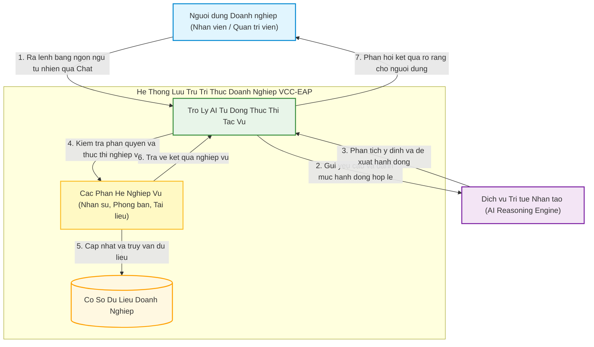

# TÀI LIỆU YÊU CẦU SẢN PHẨM (PRD)
**Tuần 6: Phân Hệ Trợ Lý AI Tự Thực Thi Tác Vụ Nghiệp Vụ**

---

## 1. Quản Lý Tài Liệu (Document Control)

### 1.1. Thông Tin Tài Liệu
| Trường thông tin | Giá trị |
| :--- | :--- |
| **Tiêu đề Tài liệu** | Tài liệu Yêu cầu Sản phẩm - Trợ Lý AI Tự Thực Thi Tác Vụ Nghiệp Vụ (PRD-006) |
| **Dự án** | Nền tảng Lưu trữ Tri thức Doanh nghiệp VCC (VCC-EAP) |
| **Phiên bản** | **2.0 (Chuẩn Hóa Tương Tác Không Lưu Trạng Thái, Phản Hồi SSE & Giới Hạn Loop Guard 5 Bước)** |
| **Trạng thái** | **ĐÃ PHÊ DUYỆT (LOCKED & FINALIZED)** |
| **Tác giả** | Senior Product Analyst / Product Owner |
| **Ngày phát hành** | 2026-09-10 |
| **Tiêu chuẩn Áp dụng** | **IEEE Std 830-1998** (Đặc tả Yêu cầu Phần mềm) & **ISO/IEC/IEEE 29148:2018** (Kỹ thuật Yêu cầu Hệ thống). |

### 1.2. Lịch Sử Thay Đổi
| Phiên bản | Ngày | Tác giả | Mô tả Thay đổi |
| :--- | :--- | :--- | :--- |
| 1.0 | 2026-08-28 | Senior Product Analyst | Khởi tạo PRD sơ bộ cho tính năng Trợ lý tự gọi API và cơ chế sửa lỗi JSON. |
| **2.0** | **2026-09-10** | **Senior Product Analyst** | **Phát hành chính thức PRD Tuần 6 (Đồng bộ phiên bản 2.0 toàn hệ thống)**: • Chuẩn hóa nguyên tắc tương tác Không lưu trạng thái (Stateless Interaction) & Fail-Fast dứt khoát. • Bổ sung yêu cầu phản hồi tiến trình streaming thời gian thực qua Server-Sent Events (SSE). • Thống nhất giới hạn an toàn vòng lặp tự chủ (Loop Guard) tối đa **5 bước hành động liên tiếp** (NFR-4 & BR-4). • Hoàn thiện các kịch bản nghiệm thu (TC-1 đến TC-5) và phân định rõ SLA độ trễ. |

---

## 2. Giới Thiệu & Mục Tiêu Sản Phẩm (Introduction)

### 2.1. Bối Cảnh Nghiệp Vụ
Sau khi hoàn thiện năng lực Tra cứu Tri thức Doanh nghiệp (RAG ở Tuần 4 & Tuần 5), hệ thống VCC-EAP đã hỗ trợ nhân viên tìm kiếm tài liệu và giải đáp thông tin hiệu quả. Tuy nhiên, để tối ưu hóa năng suất lao động, hệ thống cần tiến thêm một bước: **chuyển từ Trợ lý thụ động (chỉ đọc & trả lời) sang Trợ lý chủ động (Action-Oriented Assistant)**.

Thay vì nhân viên phải tự truy cập vào các màn hình quản trị phức tạp, nhớ cấu trúc biểu mẫu hoặc tìm kiếm các mã định danh kỹ thuật, người dùng chỉ cần ra lệnh bằng ngôn ngữ tự nhiên (ví dụ: *"Tạo tài khoản cho bạn Hoàng, email hoang.nv@vccorp.vn, thuộc phòng Kế toán"*), Trợ lý AI sẽ tự động phân tích và thực hiện hành động đó trên hệ thống.

### 2.2. Mục Đích của Tài Liệu
Tài liệu này đặc tả đầy đủ các **Yêu cầu Sản phẩm (Product Requirements)** phục vụ cho phân hệ Trợ lý AI tự thực thi tác vụ nghiệp vụ. Tài liệu tập trung làm rõ:
* Người dùng nhận được những giá trị gì và thực hiện được những tác vụ nào qua ngôn ngữ tự nhiên.
* Các quy tắc ứng xử của sản phẩm khi gặp tình huống thiếu dữ liệu, sai quyền hoặc lỗi hệ thống.
* Các cam kết chất lượng (SLA) về độ ổn định, hiệu năng và an toàn bảo mật.

### 2.3. Phạm Vi Sản Phẩm (Product Scope)

#### A. Thuộc Phạm Vi Sản Phẩm (In-Scope)
1. **Thực thi hành động qua ngôn ngữ tự nhiên**: Tiếp nhận yêu cầu bằng tiếng Việt tự nhiên từ người dùng và kích hoạt tác vụ tương ứng trong hệ thống.
2. **Khả năng tự suy luận thông tin liên kết (Smart Context Inference)**: Khi người dùng đưa các thông tin dạng tên gọi quen thuộc (như tên phòng ban), Trợ lý phải tự động tra cứu mã định danh tương ứng để hoàn tất thao tác mà không bắt người dùng phải nhập mã kỹ thuật.
3. **Xử lý thiếu thông tin dứt khoát (Fail-Fast on Missing Data)**: Khi người dùng cung cấp thiếu thông tin bắt buộc mà hệ thống không thể tự suy luận, Trợ lý phải từ chối thực hiện ngay lập tức và liệt kê rõ thông tin còn thiếu. Tuyệt đối không tạo hội thoại hỏi lại vòng vo.
4. **Cưỡng chế phân quyền tuyệt đối (Role-Based Access Enforcement)**: AI chỉ được phép thực hiện những tác vụ mà người dùng đang đăng nhập có quyền thực hiện trực tiếp trên hệ thống.
5. **Bảo vệ an toàn vận hành (Zero-Crash Tolerance)**: Hệ thống phải có cơ chế tự cô lập và xử lý mọi sai sót về dữ liệu sinh ra từ AI, cam kết không làm gián đoạn ứng dụng chính.
6. **Nhận thức thời gian thực**: Trợ lý phải hiểu đúng các mốc thời gian tương đối (*"hôm nay"*, *"ngày mai"*, *"thứ Sáu tới"*) theo múi giờ làm việc của doanh nghiệp.
7. **Phản hồi tiến trình hành động thời gian thực (Realtime Action Progress Streaming)**: Trong các tác vụ xâu chuỗi nhiều bước (Multi-turn Chaining), Trợ lý phải liên tục truyền phát các sự kiện trạng thái trung gian (đang suy luận, đang tra cứu phòng ban, đang tạo tài khoản) về giao diện chat để người dùng theo dõi tiến độ trực quan, triệt tiêu thời gian chờ đợi thụ động.

#### B. Nằm Ngoài Phạm Vi Sản Phẩm (Out-of-Scope)
* Không xây dựng hệ thống đa tác nhân tự hành (Multi-Agent Swarm) phức tạp.
* Không hỗ trợ các hành động nguy hiểm cao như: xóa vĩnh viễn dữ liệu lớn hoặc can thiệp trực tiếp vào tài chính, tiền lương.
* Không xây dựng giao diện cấu hình AI riêng biệt; toàn bộ tính năng tích hợp trực tiếp vào khung chat trợ lý hiện có.

---

## 3. Mô Tả Tổng Quan Sản Phẩm (Overall Description)

### 3.1. Chân Dung Người Dùng & Tác Nhân (User Personas)

| Chân dung người dùng | Mô tả & Trách nhiệm | Nhu cầu chính với Trợ lý AI |
| :--- | :--- | :--- |
| **Nhân viên Thông thường** (`ROLE_EMPLOYEE`) | Cán bộ nhân viên thuộc các phòng ban trong công ty. | • Tra cứu danh sách và thông tin liên hệ của các phòng ban. • Tìm kiếm các văn bản chính sách, quy chế làm việc nội bộ qua ngôn ngữ tự nhiên. |
| **Quản trị viên Hệ thống** (`ROLE_SYSTEM_ADMIN`) | Người chịu trách nhiệm vận hành hệ thống thông tin nội bộ. | • Khởi tạo nhanh tài khoản nhân viên mới bằng câu lệnh chat. • Tra cứu và kiểm tra thông tin nhân sự, phòng ban mà không cần mở nhiều biểu mẫu quản trị. |
| **Mô hình Trí tuệ Nhân tạo** (AI Engine) | Thành phần suy luận ngôn ngữ tự nhiên bên ngoài. | • Phân tích ý định của người dùng và chuyển tải yêu cầu thành hành động có cấu trúc. |

---

### 3.2. Sơ Đồ Bối Cảnh Nghiệp Vụ Sản Phẩm (Product Context)

---

### 3.3. Các Ràng Buộc Nghiệp Vụ (Business Constraints)

1. **Ràng buộc về Quyền hạn Tối thượng**: Trợ lý AI tuyệt đối không có đặc quyền riêng. Người dùng có quyền gì trên giao diện phần mềm thì AI chỉ được hỗ trợ thực hiện trong phạm vi đó.
2. **Ràng buộc về Tính Toàn vẹn Dữ liệu**: Không bao giờ tạo dữ liệu rác, tài khoản thiếu trường hoặc tài khoản không rõ phòng ban vào cơ sở dữ liệu doanh nghiệp.
3. **Ràng buộc về Tính Minh bạch**: Mọi hành động tạo mới hoặc thay đổi dữ liệu phải được thông báo kết quả cụ thể, rõ ràng cho người dùng.

---

## 4. Yêu Cầu Chức Năng Chi Tiết (Functional Requirements)

### 4.1. Nhóm Yêu Cầu Nhận Diện Ý Định & Thực Thi Tác Vụ
* **FR-1: Tự động Nhận diện Ý định Người dùng**:
  * Khi người dùng gửi câu lệnh bằng ngôn ngữ tự nhiên, Trợ lý phải phân tích chính xác ý định: đây là câu hỏi tra cứu thông tin hay là yêu cầu thực thi hành động nghiệp vụ.
* **FR-2: Tự Động Suy Luận Dữ Liệu Liên Kết (Autonomous Chaining)**:
  * Khi người dùng yêu cầu thực thi một hành động có chứa thông tin gián tiếp (ví dụ: *"Tạo tài khoản cho nhân viên thuộc phòng Kế toán"*), Trợ lý phải tự động tìm kiếm thông tin phòng ban trước để lấy mã định danh kỹ thuật cần thiết, sau đó mới tiến hành tạo tài khoản.
  * Quá trình này phải diễn ra hoàn toàn tự động, người dùng không cần phải biết hay nhập các mã kỹ thuật phức tạp.
  * **Phản hồi trạng thái tiến trình thời gian thực**: Trong suốt quá trình tự động xâu chuỗi, Trợ lý phải phát tín hiệu trạng thái từng bước (đang tìm phòng ban $\rightarrow$ đã tìm thấy $\rightarrow$ đang khởi tạo tài khoản) hiển thị trực quan trên giao diện chat, đảm bảo người dùng luôn nắm bắt được diễn biến thực thi.
* **FR-3: Xử Lý Thiếu Dữ Liệu & Dữ Liệu Rỗng Dứt Khoát (Fail-Fast Validation)**:
  * Khi người dùng yêu cầu thực thi hành động nhưng thiếu thông tin bắt buộc mà hệ thống không thể tự suy luận (ví dụ: thiếu email, thiếu mật khẩu), Trợ lý phải từ chối ngay lập tức và liệt kê rõ ràng danh sách các thông tin người dùng cần bổ sung.
  * Khi người dùng cung cấp thông tin liên kết gián tiếp (ví dụ: tên phòng ban) nhưng hệ thống tra cứu không tìm thấy hoặc kết quả trả về rỗng (`null`), Trợ lý phải lập tức kích hoạt cơ chế Fail-Fast từ chối thực hiện, nêu rõ phòng ban không tồn tại trong hệ thống. Tuyệt đối không cho phép AI tự ý đoán mò hoặc bịa mã định danh giả.
  * **Hành vi cấm**: Trợ lý tuyệt đối không được tự động hỏi lại dạng gợi mở đàm thoại nhiều lượt (*"Bạn có muốn nhập email ngay bây giờ không?"*).
  * **Nguyên tắc Tương tác Không lưu trạng thái (Stateless Interaction)**: Hệ thống được thiết kế hoàn toàn không lưu trạng thái hội thoại. Khi một yêu cầu bị từ chối dứt khoát bởi cơ chế Fail-Fast, mọi câu lệnh tiếp theo của người dùng (kể cả nhằm bổ sung thông tin thiếu) sẽ được tiếp nhận và xử lý như một **yêu cầu mới độc lập hoàn toàn**. Trợ lý không lưu vết ngữ cảnh dở dang của lượt tương tác trước đó.

---

### 4.2. Nhóm Năng Lực Nghiệp Vụ Hỗ Trợ (Supported Business Capabilities)
Hệ thống phải cung cấp cho Trợ lý khả năng thao tác trên 3 nhóm nghiệp vụ sau:

* **FR-4.1. Nghiệp vụ Quản lý Phòng ban**:
  * **Xem danh sách phòng ban**: Cho phép người dùng xem toàn bộ danh mục các phòng ban đang hoạt động trong công ty.
  * **Tra cứu phòng ban**: Cho phép tìm kiếm phòng ban theo tên tiếng Việt đầy đủ hoặc tên viết tắt (ví dụ: "Ban Công nghệ", "IT", "Kế toán").
* **FR-4.2. Nghiệp vụ Quản trị Tài khoản Người dùng**:
  * **Tạo mới tài khoản nhân viên**: Tiếp nhận các thông tin (tên đăng nhập, email công ty, họ và tên, mật khẩu, phòng ban) và tạo tài khoản hợp lệ trên hệ thống.
  * **Tự động xử lý xác nhận mật khẩu**: Nếu người dùng chỉ cung cấp 1 mật khẩu, hệ thống tự động hiểu xác nhận mật khẩu trùng khớp với mật khẩu đã cung cấp.
* **FR-4.3. Nghiệp vụ Tra cứu Tri thức & Văn bản**:
  * **Tìm kiếm tài liệu nội bộ**: Cho phép tìm kiếm văn bản quy định, chính sách công ty dựa theo từ khóa hoặc câu hỏi ngữ nghĩa.

---

### 4.3. Nhóm Yêu Cầu An Toàn & Bảo Mật Nghiệp Vụ
* **FR-5: Cưỡng Chế Phân Quyền Theo Vai Trò (RBAC)**:
  * Trợ lý phải kiểm tra vai trò của người dùng trước khi xác nhận bất kỳ hành động nào.
  * Nếu một Nhân viên thông thường (`ROLE_EMPLOYEE`) yêu cầu thực hiện hành động của Quản trị viên (`ROLE_SYSTEM_ADMIN` như tạo tài khoản), Trợ lý phải từ chối dứt khoát và thông báo người dùng không đủ thẩm quyền.
* **FR-6: Bất Biến Danh Tính Người Thực Hiện**:
  * Định danh của người thực hiện thao tác phải được lấy tự động từ phiên đăng nhập an toàn của hệ thống. Nghiêm cấm nhận thông tin định danh người thao tác từ câu lệnh chat nhằm chống giả mạo danh tính.
* **FR-7: Nhận Thức Thời Gian Thực Của Doanh Nghiệp**:
  * Trợ lý phải tự động đồng bộ thời gian làm việc thực tế của máy chủ (GMT+7) để hiểu chính xác các mốc thời gian tương đối (*"hôm nay"*, *"ngày mai"*, *"tuần sau"*).

---

## 5. Yêu Cầu Phi Chức Năng (Non-Functional Requirements & SLAs)

### 5.1. Độ Tin Cậy & Ổn Định Vận Hành (Reliability)
* **NFR-1 (Cam Kết SLA Crash Rate = 0%)**: 
  * Tỷ lệ sập ứng dụng hoặc lỗi gián đoạn tiến trình do dữ liệu bất thường từ AI phải đạt mức tuyệt đối **0%**.
  * Mọi dữ liệu không chuẩn xác do AI sinh ra phải được hệ thống tự động phục hồi hoặc chặn lại an toàn kèm thông báo lỗi dễ hiểu.

### 5.2. Hiệu Năng & Trải Nghiệm Người Dùng (Performance)
* **NFR-2 (Thời Gian Đáp Ứng - Latency SLA)**:
  * **Tác vụ Đơn lẻ (Single-turn Action / Query)**: Tổng thời gian từ khi người dùng gửi câu lệnh đến khi Trợ lý hoàn tất phản hồi (cho các yêu cầu tra cứu tài liệu hoặc thao tác gọi tool đơn lẻ) phải đạt **p95 dưới 4.0 giây** trong điều kiện mạng bình thường.
  * **Xâu Chuỗi Tự Chủ Nhiều Bước (Multi-turn Autonomous Chaining)**: Tôn trọng số bước reasoning và gọi công cụ tự nhiên của mô hình AI; tổng thời gian phản hồi phụ thuộc tự nhiên vào số lượt round-trip ngoại vi cần thiết của AI Engine (trung bình 1.2s - 1.8s / lượt).
  * **Độ Trễ Phát Sự Kiện Đầu Tiên (Time to First Event - TTFE)**: Tín hiệu phản hồi đầu tiên báo hiệu hệ thống đã tiếp nhận và bắt đầu phân tích (`event: thinking`) phải đến được giao diện người dùng đạt **p95 dưới 500ms**, triệt tiêu hoàn toàn cảm giác chờ đợi thụ động.
  * **Thời Gian Xử Lý Nội Bộ (In-Process Call)**: Thời gian kiểm tra bảo mật, định tuyến và thực thi nghiệp vụ trong bộ nhớ RAM của hệ thống phải đạt mức tuyệt đối **p95 dưới 50ms**.

### 5.3. An Toàn Thông Tin (Security)
* **NFR-3 (Bảo Mật Hành Động 100%)**:
  * 100% các hành động nghiệp vụ nhạy cảm đều được bảo vệ bởi lớp kiểm tra quyền hạn. Không có kịch bản câu lệnh nào có thể đánh lừa AI để vượt quyền hệ thống.

### 5.4. An Toàn Tài Nguyên & Chống Treo Hệ Thống (Resource Safety)
* **NFR-4 (Giới Hạn Tương Tác - Loop Guard)**:
  * Mỗi yêu cầu của người dùng chỉ được phép kích hoạt tối đa **5 bước hành động liên tiếp**.
  * Nếu phát sinh hành động thứ 6 trong cùng một yêu cầu, hệ thống phải tự động ngắt để chống lãng phí tài nguyên và tránh nguy cơ treo hệ thống.

---

## 6. Quy Tắc Nghiệp Vụ (Business Rules)

| Mã Quy tắc | Tên Quy tắc | Nội dung Chi tiết |
| :--- | :--- | :--- |
| **BR-1** | **Nguyên Tắc Bình Đẳng Quyền Hạn** | AI không có bất kỳ đặc quyền nào cao hơn người dùng đang đăng nhập. Quyền hạn của AI chính là quyền hạn của người dùng thực tế. |
| **BR-2** | **Nguyên Tắc Thất Bại Sớm (Fail-Fast)** | Khi yêu cầu thiếu thông tin bắt buộc hoặc khi bước tra cứu thông tin phụ trợ (như tìm phòng ban) trả về rỗng / không tìm thấy, hệ thống phải từ chối ngay lập tức; cấm AI đoán mò hoặc bịa dữ liệu giả; không tạo hội thoại kéo dài nhiều vòng để hỏi lại người dùng. |
| **BR-3** | **Bất Biến Danh Tính Tác Nhân** | Mọi hành động ghi nhận vào nhật ký hệ thống phải mang định danh của người dùng đăng nhập thực tế, không chấp nhận việc giả lập danh tính qua chat. |
| **BR-4** | **Giới Hạn Bước Hành Động Tự Chủ** | Chuỗi hành động tự động giải quyết dữ liệu chỉ được phép tối đa 5 bước (ví dụ: Bước 1 tìm kiếm phòng ban $\rightarrow$ Bước 2 tạo tài khoản). |

---

## 7. Kịch Bản Nghiệm Thu Người Dùng (User Acceptance Criteria)

### TC-1: Xem Danh Sách Phòng Ban Bằng Ngôn Ngữ Tự Nhiên
* **GIVEN (Tiền đề)**: Nhân viên đã đăng nhập hệ thống với vai trò `ROLE_EMPLOYEE`.
* **WHEN (Khi)**: Nhân viên chat: *"Cho tôi xem danh sách các phòng ban hiện có trong công ty"*.
* **THEN (Kỳ vọng)**:
  1. Trợ lý AI nhận diện đúng ý định tra cứu danh sách phòng ban.
  2. Hệ thống thực hiện lấy danh sách và hiển thị bảng/danh sách tên phòng ban rõ ràng cho nhân viên.

### TC-2: Tạo Tài Khoản Mới Với Khả Năng Tự Suy Luận Phòng Ban
* **GIVEN (Tiền đề)**: Quản trị viên đăng nhập với vai trò `ROLE_SYSTEM_ADMIN`. Trong hệ thống đã có phòng ban "Kế toán".
* **WHEN (Khi)**: Quản trị viên chat: *"Tạo tài khoản cho bạn Hoàng, email hoang.nv@vccorp.vn, pass 123456, thuộc phòng Kế toán"*.
* **THEN (Kỳ vọng)**:
  1. Trợ lý AI tự động nhận biết cần mã định danh phòng ban $\rightarrow$ Tự động tra cứu phòng ban "Kế toán" để lấy mã định danh.
  2. Trong suốt quá trình xử lý, giao diện chat nhận stream sự kiện và hiển thị huy hiệu tiến trình trực quan (`⚡ Đang tra cứu phòng ban "Kế toán"...` $\rightarrow$ `⚡ Đang khởi tạo tài khoản nhân viên...`).
  3. Trợ lý tự động kích hoạt tạo tài khoản với đầy đủ thông tin (tự động đồng bộ xác nhận mật khẩu).
  4. Tài khoản được tạo thành công trên hệ thống.
  5. Trợ lý hoàn tất thông báo xác nhận đã tạo tài khoản thành công cho người dùng.

### TC-3: Ngăn Chặn Yêu Cầu Vượt Quá Thẩm Quyền (Security Check)
* **GIVEN (Tiền đề)**: Nhân viên thông thường đăng nhập với vai trò `ROLE_EMPLOYEE`.
* **WHEN (Khi)**: Nhân viên chat: *"Hãy tạo tài khoản mới cho đồng nghiệp Nguyễn Văn An"*.
* **THEN (Kỳ vọng)**:
  1. Trợ lý AI nhận diện đây là hành động quản trị tài khoản.
  2. Hệ thống kiểm tra vai trò của nhân viên và phát hiện không có quyền quản trị.
  3. Hệ thống từ chối thực thi ngay lập tức.
  4. Trợ lý phản hồi lịch sự: *"Bạn không có quyền hạn để thực hiện hành động tạo tài khoản này."* Không có dữ liệu nào bị thay đổi.

### TC-4: Từ Chối Dứt Khoát Khi Thiếu Thông Tin Bắt Buộc (Fail-Fast)
* **GIVEN (Tiền đề)**: Quản trị viên đăng nhập với vai trò `ROLE_SYSTEM_ADMIN`.
* **WHEN (Khi)**: Quản trị viên chat: *"Tạo tài khoản cho nhân viên Nguyễn Văn An"*.
* **THEN (Kỳ vọng)**:
  1. Trợ lý AI phát hiện yêu cầu thiếu các thông tin bắt buộc cốt lõi (email, mật khẩu, phòng ban) mà hệ thống không thể tự bịa hay tự suy luận.
  2. Trợ lý lập tức từ chối thực hiện và phản hồi rõ: *"Yêu cầu không thể thực hiện do thiếu thông tin bắt buộc: email, mật khẩu và phòng ban."*
  3. Trợ lý tuyệt đối không hỏi lại kiểu gợi mở (*"Bạn có muốn nhập email không?"*).

### TC-4.1: Từ Chối Dứt Khoát Khi Dữ Liệu Tra Cứu Phòng Ban Không Tồn Tại
* **GIVEN (Tiền đề)**: Quản trị viên đăng nhập với vai trò `ROLE_SYSTEM_ADMIN`. Trong cơ sở dữ liệu không tồn tại phòng ban "Kinh doanh Quốc tế".
* **WHEN (Khi)**: Quản trị viên chat: *"Tạo tài khoản cho bạn Linh, email linh.tt@vccorp.vn, pass 123456, thuộc phòng Kinh doanh Quốc tế"*.
* **THEN (Kỳ vọng)**:
  1. Trợ lý AI kích hoạt công cụ tra cứu phòng ban "Kinh doanh Quốc tế".
  2. Hệ thống kiểm tra và trả về kết quả không tìm thấy phòng ban.
  3. Trợ lý kích hoạt ngay cơ chế Fail-Fast từ chối thực hiện và phản hồi rõ ràng: *"Không tìm thấy phòng ban 'Kinh doanh Quốc tế' trong hệ thống. Vui lòng kiểm tra lại tên phòng ban."*
  4. Trợ lý tuyệt đối không tự bịa mã UUID ngẫu nhiên để gọi tạo tài khoản; không phát sinh bất kỳ bản ghi lỗi nào trong cơ sở dữ liệu.

### TC-5: Đảm Bảo An Toàn Vận Hành Khi AI Gặp Lỗi Cú Pháp
* **GIVEN (Tiền đề)**: Người dùng gửi một câu lệnh bất kỳ.
* **WHEN (Khi)**: Mô hình AI phản hồi dữ liệu bị lỗi cú pháp nhẹ (dư thẻ markdown, thừa dấu phẩy) hoặc cố gắng gọi hành động liên tục quá 5 lần.
* **THEN (Kỳ vọng)**:
  1. Với lỗi cú pháp nhẹ: Hệ thống tự động làm sạch và xử lý thành công, ứng dụng không bị dừng hoặc sập (SLA Crash Rate = 0%).
  2. Với trường hợp lặp quá 5 lần: Hệ thống chủ động dừng xử lý và thông báo lỗi vượt quá giới hạn an toàn.

---

## 8. Chú Giải Thuật Ngữ Nghiệp Vụ (Business Glossary)
* **Trợ Lý Chủ Động (Action-Oriented Assistant)**: Hệ thống AI có khả năng thay mặt người dùng thực hiện các thao tác trên phần mềm thông qua các quyền hạn được cấp phép.
* **Suy Luận Liên Kết (Context Chaining)**: Khả năng tự động xâu chuỗi nhiều bước tra cứu thông tin phụ trợ để hoàn thành một mục tiêu chính của người dùng.
* **Thất Bại Sớm (Fail-Fast)**: Nguyên tắc xử lý từ chối ngay lập tức khi phát hiện dữ liệu không đủ điều kiện thực hiện, giúp người dùng nắm rõ vấn đề và tiết kiệm tài nguyên hệ thống.
