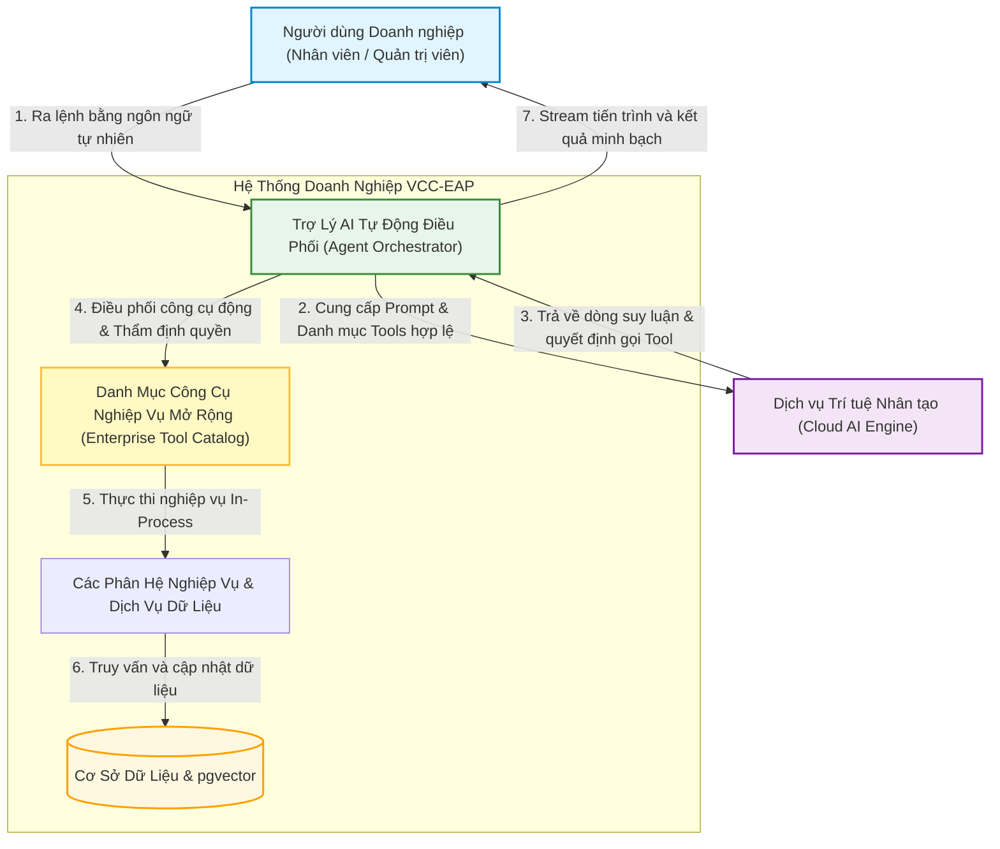

# TÀI LIỆU YÊU CẦU SẢN PHẨM (PRD)
**Tuần 6: Phân Hệ Trợ Lý AI Tự Thực Thi Tác Vụ Nghiệp Vụ**

---

## 1. Quản Lý Tài Liệu (Document Control)

### 1.1. Thông Tin Tài Liệu
| Trường thông tin | Giá trị |
| :--- | :--- |
| **Tiêu đề Tài liệu** | Tài liệu Yêu cầu Sản phẩm - Phân Hệ Trợ Lý AI Tự Thực Thi Tác Vụ (PRD-006) |
| **Dự án** | Nền tảng Lưu trữ Tri thức Doanh nghiệp VCC (VCC-EAP) |
| **Phiên bản** | **2.1 (Đồng bộ theo thực tế triển khai)** |
| **Trạng thái** | **ĐÃ PHÊ DUYỆT (LOCKED & FINALIZED)** |
| **Tác giả** | Senior Product Analyst / Product Owner |
| **Ngày phát hành** | 2026-09-16 |
| **Tiêu chuẩn Áp dụng** | **IEEE Std 830-1998** & **ISO/IEC/IEEE 29148:2018** (Kỹ thuật Yêu cầu Hệ thống). |

### 1.2. Lịch Sử Thay Đổi
| Phiên bản | Ngày | Tác giả | Mô tả Thay đổi |
| :--- | :--- | :--- | :--- |
| 1.0 | 2026-08-28 | Senior Product Analyst | Khởi tạo PRD sơ bộ cho tính năng Trợ lý tự gọi API và cơ chế sửa lỗi JSON. |
| 2.0 | 2026-09-10 | Senior Product Analyst | Chuẩn hóa nguyên tắc Không lưu trạng thái (Stateless), phản hồi SSE & Loop Guard 5 bước. |
| **2.1** | **2026-09-16** | **Product Owner / Lead Architect** | Đồng bộ theo thực tế triển khai: chuyển đổi sang khung thực thi công cụ mở rộng; bổ sung luồng dữ liệu suy luận và trích dẫn nguồn; cập nhật kịch bản nghiệm thu và nâng thời gian chờ phản hồi. |

---

## 2. Giới Thiệu & Mục Tiêu Sản Phẩm (Introduction)

### 2.1. Bối Cảnh Nghiệp Vụ
Sau khi hoàn thiện năng lực Tra cứu Tri thức Ngữ nghĩa (RAG ở Tuần 4 & Tuần 5), VCC-EAP cần chuyển dịch từ **Trợ lý thụ động (chỉ đọc và trả lời)** sang **Trợ lý chủ động (Action-Oriented Assistant)**. Người dùng có thể ra lệnh bằng ngôn ngữ tự nhiên để kích hoạt trực tiếp các hành động nghiệp vụ trên hệ thống mà không cần thao tác thủ công qua các biểu mẫu quản trị phức tạp.

### 2.2. Mục Đích & Giá Trị Mang Lại
* **Tối ưu năng suất**: Giảm thiểu thời gian tra cứu và thực thi tác vụ cho nhân viên và quản trị viên.
* **Tự động hóa thông minh**: AI tự động liên kết thông tin, suy luận tham số cần thiết từ ngữ cảnh để thực thi công cụ.
* **An toàn & Minh bạch**: Đảm bảo 100% tuân thủ phân quyền người dùng, hiển thị tiến trình xử lý trực quan và không gây gián đoạn hệ thống.

### 2.3. Phạm Vi Sản Phẩm (Scope)
* **Thuộc phạm vi (In-Scope)**:
  1. Tiếp nhận câu lệnh ngôn ngữ tự nhiên tiếng Việt và tự động thực thi công cụ nghiệp vụ tương ứng.
  2. Khung thực thi công cụ mở rộng (Extensible Action Execution Framework): Hỗ trợ tích hợp và điều phối động danh mục các công cụ nghiệp vụ của doanh nghiệp qua Model Context Protocol (MCP).
  3. Xử lý thiếu dữ liệu và dữ liệu rỗng theo nguyên tắc Thất bại sớm (Fail-Fast) dứt khoát; mô hình tương tác không lưu trạng thái (Stateless).
  4. Cưỡng chế phân quyền theo vai trò (RBAC) và bảo đảm bất biến danh tính người dùng từ phiên đăng nhập.
  5. Truyền phát tiến trình thời gian thực (Realtime Progress Streaming) gồm các bước suy luận logic (`reasoning`), trạng thái gọi công cụ (`action`) và câu trả lời hoàn chỉnh kèm trích dẫn văn bản (`content`).
  6. Cơ chế phòng vệ tự phục hồi cú pháp (Resilience) và chốt chặn vòng lặp (Loop Guard tối đa 5 bước).
* **Nằm ngoài phạm vi (Out-of-Scope)**:
  * Không xây dựng hệ thống đa tác nhân tự hành (Multi-Agent Swarm) phân tán.
  * Không hỗ trợ các tác vụ có tính chất phá hủy nghiêm trọng (xóa vĩnh viễn dữ liệu lớn, can thiệp tài chính cốt lõi).

---

## 3. Chân Dung Người Dùng & Bối Cảnh Nghiệp Vụ

### 3.1. Chân Dung Người Dùng (User Personas)
| Chân dung | Vai trò | Nhu cầu chính với Trợ lý AI |
| :--- | :--- | :--- |
| **Nhân viên Doanh nghiệp** (`ROLE_EMPLOYEE`) | Cán bộ nhân viên các phòng ban | • Tra cứu thông tin tổ chức, phòng ban. • Tìm kiếm văn bản quy chế, chính sách nội bộ kèm nguồn trích dẫn. |
| **Quản trị viên Hệ thống** (`ROLE_SYSTEM_ADMIN`) | Quản trị vận hành nội bộ | • Thực thi nhanh các thao tác quản trị dữ liệu (tạo phòng ban, cấu hình danh mục...). • Quản lý thông tin tập trung không cần mở biểu mẫu. |
| **Mô hình Trí tuệ Nhân tạo** (AI Engine) | Thành phần suy luận ngôn ngữ lớn | • Phân tích ý định, suy luận logic (thought) và kích hoạt công cụ có cấu trúc. |

### 3.2. Sơ Đồ Bối Cảnh Nghiệp Vụ (Context Diagram)

---

## 4. Yêu Cầu Chức Năng (Functional Requirements)

* **FR-1: Phân Loại Ý Định Thông Minh (Intent Classification)**:
  * Hệ thống tự động phân loại yêu cầu của người dùng vào 2 nhóm hành vi cốt lõi:
    - **Nhóm 1 (Thực thi hành động nghiệp vụ)**: Khi yêu cầu liên quan đến thao tác, quản lý dữ liệu $\rightarrow$ Tự động lựa chọn công cụ tương ứng trong danh mục để kích hoạt.
    - **Nhóm 2 (Tra cứu tri thức nội bộ)**: Mọi câu hỏi tra cứu, quy định, chính sách hoặc giải đáp thông tin $\rightarrow$ Tự động chuyển giao cho công cụ tra cứu tri thức RAG.
  * **Quy tắc ứng xử**: Trợ lý tuyệt đối không trả lời xã giao dông dài (chit-chat); mọi tương tác đều phải hướng đến giải quyết công việc cụ thể.

* **FR-2: Khung Thực Thi Công Cụ Tự Chủ Mở Rộng (Extensible Action Execution Framework)**:
  * Trợ lý AI kết nối động tới Danh mục công cụ doanh nghiệp (Enterprise Tool Catalog) mà không bị giới hạn cố định ở một vài công cụ. Các công cụ mới khi được đăng ký vào danh mục sẽ tự động sẵn sàng để AI nhận diện và điều phối.
  * Hỗ trợ xâu chuỗi công cụ tự chủ (Autonomous Tool Chaining): Tự động tìm kiếm các thông tin phụ trợ (như mã định danh, khóa ngoại) để hoàn tất mục tiêu chính của người dùng mà không bắt người dùng nhập mã kỹ thuật.

* **FR-3: Xử Lý Thất Bại Sớm & Tương Tác Không Lưu Trạng Thái (Fail-Fast & Stateless Interaction)**:
  * Khi yêu cầu thiếu thông tin bắt buộc hoặc khi bước tra cứu liên kết trả về rỗng/không tìm thấy, Trợ lý lập tức từ chối thực hiện dứt khoát, chỉ rõ thông tin còn thiếu hoặc lỗi phát sinh.
  * Tuyệt đối cấm AI tự đoán mò hoặc bịa đặt mã định danh giả; cấm tạo hội thoại hỏi gợi mở nhiều lượt.
  * Mọi yêu cầu sau khi bị từ chối được đóng lại; yêu cầu tiếp theo của người dùng được xử lý như một phiên độc lập hoàn toàn.

* **FR-4: Truyền Phát Tiến Trình & Suy Luận Thời Gian Thực (Progress & Reasoning Streaming)**:
  * Trong suốt quá trình thực thi, hệ thống liên tục truyền phát các sự kiện trạng thái về giao diện:
    - Bắt đầu phân tích (`thinking`).
    - Dòng tư duy logic của mô hình (`reasoning` kèm `thought`).
    - Bắt đầu và kết thúc gọi công cụ (`action_start`, `action_end`).
    - Nội dung phản hồi hoàn chỉnh (`content`) kèm nguồn trích dẫn văn bản (`chunks`).
    - Đóng luồng an toàn (`done`) hoặc cảnh báo lỗi dứt khoát (`error`).

* **FR-5: Cưỡng Chế Phân Quyền Theo Vai Trò (RBAC) & Bất Biến Danh Tính**:
  * Trợ lý kiểm tra vai trò người dùng tại tầng thực thi nghiệp vụ trước khi xác nhận bất kỳ hành động nào. Người dùng không đủ thẩm quyền sẽ bị từ chối ngay lập tức.
  * Định danh người thao tác được lấy tuyệt đối từ phiên đăng nhập an toàn trong RAM, nghiêm cấm tiếp nhận định danh người thao tác từ nội dung chat.

* **FR-6: Nhận Thức Thời Gian Thực Của Doanh Nghiệp**:
  * Tự động tiêm thời gian thực tế của máy chủ (`Asia/Ho_Chi_Minh`, GMT+7) vào ngữ cảnh để AI hiểu chính xác các mốc thời gian tương đối (*"hôm nay"*, *"ngày mai"*, *"thứ Sáu tới"*).

---

## 5. Yêu Cầu Phi Chức Năng & Cam Kết Dịch Vụ (NFRs & SLAs)

| Mã NFR | Tiêu chí | Cam kết Chất lượng (SLA) | Cơ chế Đảm bảo |
| :--- | :--- | :--- | :--- |
| **NFR-1** | **Độ Ổn Định (Reliability)** | Tỷ lệ sập ứng dụng (Crash Rate) = **0%**. | 4 tầng tự phục hồi cú pháp JSON (Regex $\rightarrow$ Stack Balancer $\rightarrow$ Re-prompt $\rightarrow$ Circuit Breaker). |
| **NFR-2** | **Độ Trễ Phản Hồi (Latency)** | • Phát sự kiện đầu tiên (TTFE) p95 **< 500ms**. • Thực thi nội bộ trong RAM p95 **< 50ms**. • Tác vụ đơn lẻ p95 **< 4.0s**. • Timeout kết nối stream: **120 giây**. | Kênh truyền Server-Sent Events qua HTTP POST; thực thi In-Process RAM call; mô hình đa luồng ảo Java 21 Virtual Threads. |
| **NFR-3** | **An Toàn Bảo Mật (Security)** | **100%** hành động nhạy cảm đều được bảo vệ bởi RBAC. | Kiểm tra thẩm quyền tại tầng Service; bất biến danh tính từ JWT. |
| **NFR-4** | **An Toàn Tài Nguyên (Resource Safety)** | Giới hạn vòng lặp tự chủ tối đa **5 bước/yêu cầu**. | Chốt chặn Tool Loop Guard ngắt an toàn nếu phát sinh bước thứ 6. |

---

## 6. Quy Tắc Nghiệp Vụ (Business Rules)

* **BR-1 (Bình Đẳng Quyền Hạn)**: AI không có đặc quyền riêng. Người dùng có quyền gì trên hệ thống thì AI chỉ được hỗ trợ thực hiện trong phạm vi đó.
* **BR-2 (Thất Bại Sớm - Fail-Fast)**: Thiếu tham số hoặc dữ liệu tra cứu rỗng phải ngắt chuỗi ngay lập tức; cấm AI đoán mò hoặc hỏi lại gợi mở.
* **BR-3 (Bất Biến Danh Tính)**: Mọi thao tác ghi nhận vào hệ thống phải mang định danh người đăng nhập thực tế.
* **BR-4 (Giới Hạn Tương Tác)**: Chuỗi hành động tự động giải quyết dữ liệu chỉ được phép kéo dài tối đa 5 bước liên tiếp.
* **BR-5 (Trình Bày Trực Diện)**: Phản hồi dạng văn bản thuần túy (plain text), không dùng dấu hoa thị (`*`, `**`), đi thẳng vào trọng tâm.

---

## 7. Kịch Bản Nghiệm Thu Đại Diện (User Acceptance Criteria)

### TC-1: Tra Cứu Danh Mục Hệ Thống
* **GIVEN**: Nhân viên đã đăng nhập hệ thống với vai trò `ROLE_EMPLOYEE`.
* **WHEN**: Nhân viên chat yêu cầu tra cứu danh mục (ví dụ: danh sách các phòng ban hiện có).
* **THEN**: Trợ lý AI nhận diện đúng ý định, kích hoạt công cụ tra cứu tương ứng và hiển thị kết quả minh bạch, rõ ràng.

### TC-2: Thực Thi Tác Vụ Nghiệp Vụ Kèm Streaming Tiến Trình
* **GIVEN**: Quản trị viên đăng nhập với vai trò `ROLE_SYSTEM_ADMIN`.
* **WHEN**: Quản trị viên chat yêu cầu thực thi một hành động nghiệp vụ hợp lệ (ví dụ: tạo phòng ban mới với đầy đủ thông tin).
* **THEN**:
  1. Trợ lý kích hoạt công cụ nghiệp vụ tương ứng.
  2. Giao diện chat nhận stream sự kiện liên tục: `thinking` $\rightarrow$ `reasoning` $\rightarrow$ `action_start` $\rightarrow$ `action_end` $\rightarrow$ `content` $\rightarrow$ `done`.
  3. Dữ liệu được tạo thành công trên hệ thống và Trợ lý thông báo xác nhận hoàn tất.

### TC-3: Ngăn Chặn Yêu Cầu Vượt Quá Thẩm Quyền (RBAC Denial)
* **GIVEN**: Nhân viên thông thường đăng nhập với vai trò `ROLE_EMPLOYEE`.
* **WHEN**: Nhân viên yêu cầu thực thi một hành động của Quản trị viên.
* **THEN**: Hệ thống thẩm định quyền tại tầng nghiệp vụ, từ chối ngay lập tức; Trợ lý phản hồi: *"Bạn không có quyền thực hiện yêu cầu này."* Không có dữ liệu nào bị thay đổi.

### TC-4: Từ Chối Dứt Khoát Khi Thiếu Dữ Liệu Hoặc Dữ Liệu Rỗng (Fail-Fast)
* **GIVEN**: Người dùng đã đăng nhập hệ thống.
* **WHEN**: Người dùng yêu cầu thực thi hành động nhưng thiếu thông tin bắt buộc hoặc tra cứu thực thể không tồn tại.
* **THEN**: Hệ thống kích hoạt Fail-Fast ngắt chuỗi ngay lập tức, thông báo cụ thể thông tin còn thiếu hoặc thực thể không tồn tại; cấm AI bịa đặt dữ liệu.

### TC-5: Tự Phục Hồi Khi AI Gặp Lỗi Cú Pháp
* **GIVEN**: Người dùng gửi câu lệnh bất kỳ.
* **WHEN**: Mô hình AI phản hồi dữ liệu lỗi cú pháp nhẹ (dư thẻ markdown, thừa dấu phẩy, chuỗi cắt cụt).
* **THEN**: Hệ thống tự động làm sạch và xử lý thành công trong RAM (< 5ms), cam kết Crash Rate = 0%.
